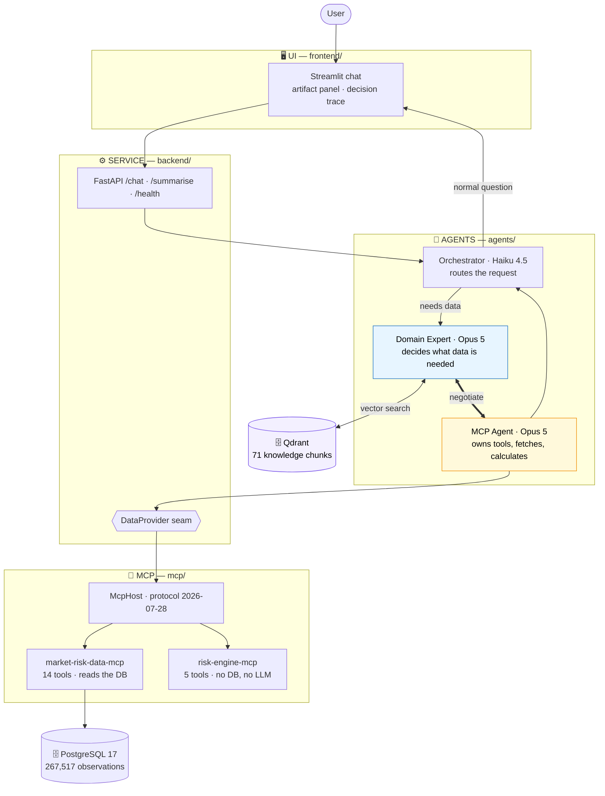
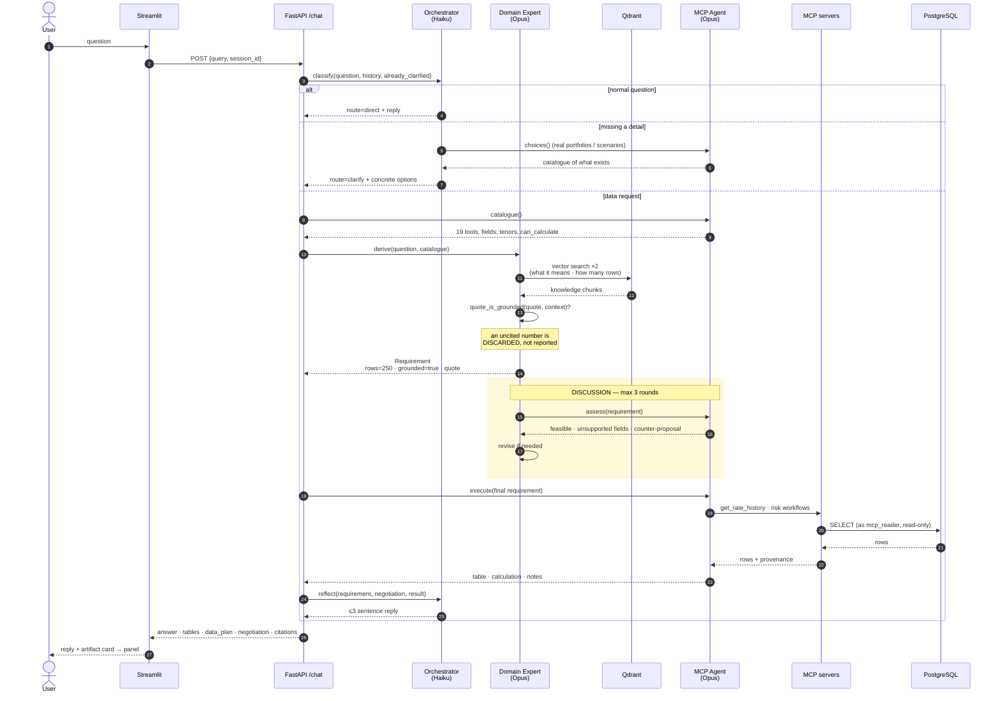
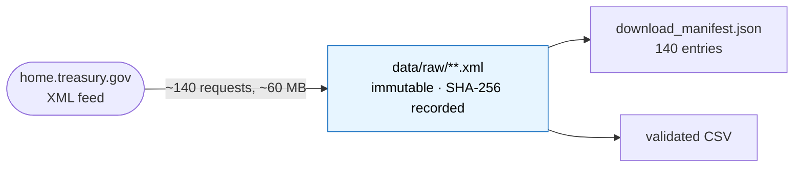
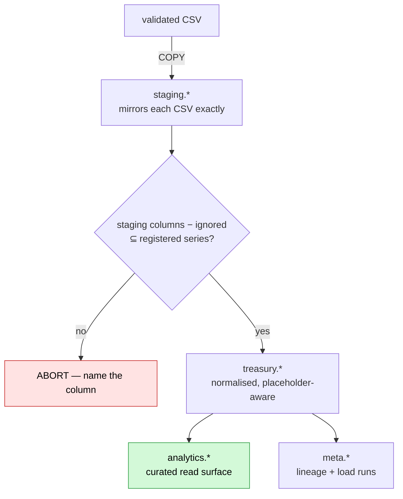
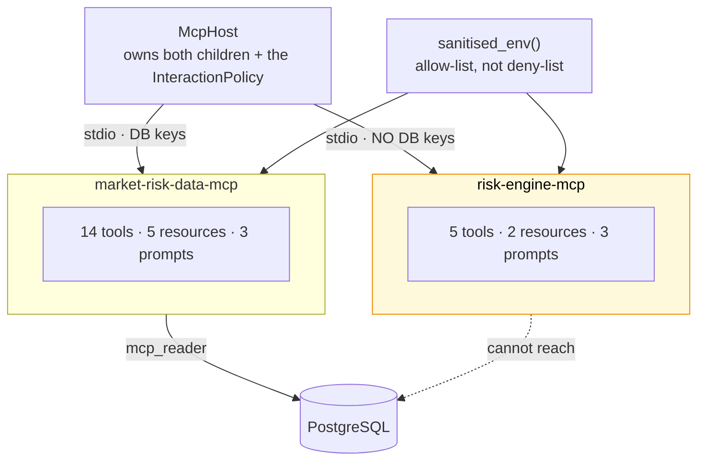
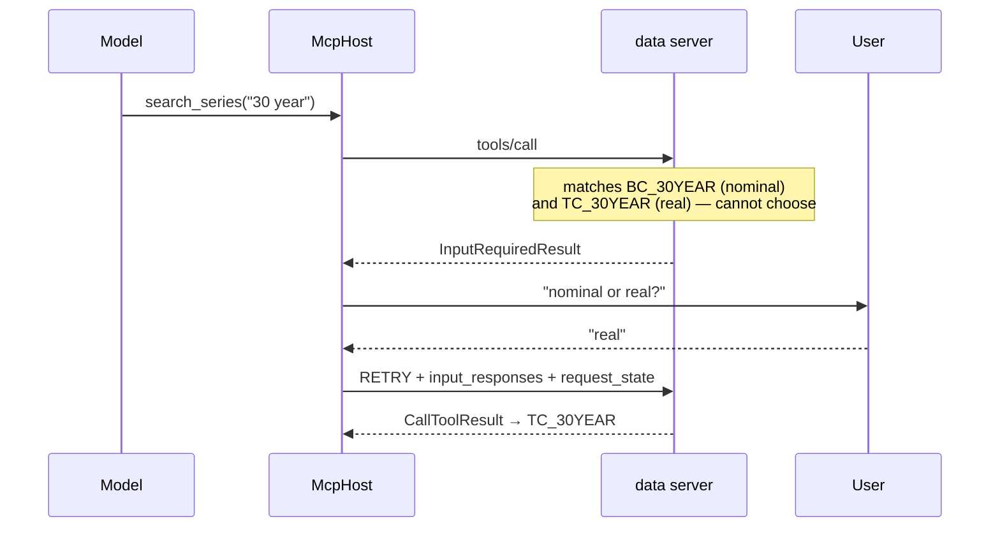

# semantic-mcp-data-access-gateway

A semantic **Model Context Protocol** gateway for intent-aware request understanding,
data-requirement planning, and optimised retrieval over enterprise data.

Ask a question in plain English. Three specialist agents decide what data the task actually
needs — **grounded in a vector store, never in a hardcoded constant** — negotiate what the data
layer can serve, fetch exactly that, and show their working.

Today's domain is **U.S. Treasury interest rates**: 267,517 verified observations from
1990-01-02 to 2026-08-11.

> **The rule everything rests on:** a missing observation is **NULL**. Never zero, never the
> previous day's rate, never an interpolation. Absence of a rate and a rate of zero are
> different facts; collapse them and you get a curve that looks complete and is wrong, with
> nothing downstream able to tell.

---

## Table of contents

1. [What problem this solves](#1-what-problem-this-solves)
2. [High-level architecture](#2-high-level-architecture)
3. [Detailed workflow](#3-detailed-workflow-one-request-end-to-end)
4. [The three agents](#4-the-three-agents)
5. [No hardcoded thresholds](#5-no-hardcoded-thresholds)
6. [The five stages](#6-the-five-stages)
   - [Stage 1 — Acquisition](#stage-1--acquisition-treasury--disk)
   - [Stage 2 — Data layer](#stage-2--data-layer-csv--postgresql)
   - [Stage 3 — MCP layer](#stage-3--mcp-layer-the-only-road-between-tiers)
   - [Stage 4 — Reasoning layer](#stage-4--reasoning-layer-the-three-agents)
   - [Stage 5 — UI](#stage-5--ui-the-answer-and-how-it-was-reached)
7. [All six MCP primitives](#7-all-six-mcp-primitives)
8. [Observability and evaluation](#8-observability-and-evaluation)
9. [Quick start](#9-quick-start)
10. [Verification](#10-verification)
11. [Repository layout](#11-repository-layout)
12. [Known issues](#12-known-issues)
13. [Documentation index](#13-documentation-index)

---

## 1. What problem this solves

The obvious way to build this is to connect an LLM to a database and let it write SQL. That
fails in four specific ways, and the whole architecture is a response to them.

| Failure | What this system does instead |
|---|---|
| **The model invents numbers.** Ask for the 10-year yield and it recalls one from training. | The model has no numbers. Every figure comes from a tool call against the real database, and the trace shows which. |
| **Things that look alike get mixed.** A bill quotes 3.64% bank-discount and 3.70% coupon-equivalent. Both correct, not interchangeable. | `quote_basis` travels with every single rate, from the database through to the answer. |
| **Nobody can check the answer.** | Any value traces back to the exact Treasury file and its SHA-256. |
| **"Give me 10,000 rows" is taken at face value.** | A domain expert reads the knowledge base and says the method consumes 250 — quoting the sentence that says so. |

---

## 2. High-level architecture



**Reading it.** The agents decide *what data a question needs*; the data layer is *where that
truthfully lives*; the MCP layer is *the only road between them*; the UI is *how a human sees
the answer and how it was reached*.

**Two swap seams** keep the engines configurable rather than hardcoded:

| Seam | Implementations | Chosen by |
|---|---|---|
| `DataProvider` | `McpDataProvider` · `PostgresDataProvider` · `MockDataProvider` | `DATA_BACKEND` |
| `VectorStore` | `QdrantVectorStore` (embedded or Docker) | `QDRANT_URL` |

---

## 3. Detailed workflow (one request, end to end)

This is the full path of *"Give me 10,000 rows … for 10-day 99% historical VaR"*.



**Six things worth noticing in that diagram:**

1. **The cheap path stays cheap.** A greeting never reaches Qdrant or Opus — it returns at
   step 4.
2. **Clarifying questions are grounded too.** The orchestrator reads real portfolios and
   scenarios before offering choices, so clicking an option *ends* the ambiguity.
3. **The catalogue comes before the requirement.** The domain expert plans against what is
   actually connected, not what it imagines exists.
4. **Two vector searches, not one.** The agent needs two different things — what the task
   means, and how many rows it reads — and one embedding cannot be near both.
5. **The grounding check is a gate.** A number whose citation is not in the retrieved text is
   thrown away.
6. **Nothing is fetched until both agents agree.**

---

## 4. The three agents

| Agent | Model | Why that model | Responsibility |
|---|---|---|---|
| **Orchestrator** | `claude-haiku-4-5` | Runs on *every* turn, including "hi". Routing needs speed, not depth. | Classify → reply / clarify / delegate. Then write the final answer. |
| **Domain Expert** | `claude-opus-5` | This is where the thinking is. | Vector-search Qdrant, decide the requirement, defend it in discussion. |
| **MCP Agent** | `claude-opus-5` | Judging what a source can serve needs reading, not a set lookup. | Advertise tools, negotiate, fetch, calculate. |

### Why a discussion, not a handoff

**Neither agent knows enough alone.** The domain expert knows what the *method* requires —
that historical VaR reads a 250-day window, because it read that in the knowledge base. The
MCP agent knows what the *source* holds — that a par yield curve has no CUSIPs, no issuer
names, no settlement dates.

A one-way handoff produces requirements nobody can serve. So they talk:

```
round 0  domain_expert → "Proposing 4 fields and a 250-row window for
                          10-day 99% historical VaR"
round 1  mcp_agent     → "I can serve the full daily par-curve history for all
                          14 tenors over the 250-trading-day lookback. I cannot
                          serve cusip, issuer_name or settlement_date — this is
                          a par yield curve, it holds no instrument records."
         ✓ converged
```

Bounded at **3 rounds**. Two agents that can always reply will always reply; if they never
converge, that is recorded and reported rather than hidden behind a last-ditch answer.

---

## 5. No hardcoded thresholds

The domain expert holds **no numbers of its own**. Every figure must be quoted verbatim from a
chunk it actually retrieved, and the quote is verified against the retrieved text:

```python
if rows is not None and not quote_is_grounded(quote, context):
    rows, quote = None, None      # discarded — and the user is told why
```

A window recalled from training is rejected exactly like a constant in the source: **both are
unfalsifiable.** You cannot change them by editing a document, and you cannot audit them by
reading one.

**Live proof** — the expert quotes `knowledge/market_risk/var.md`:

> *"Historical simulation reads a fixed lookback window of **250 trading days** of daily
> observations."*

### Prove it yourself

```bash
# 1. edit knowledge/market_risk/var.md — change 250 to 500
# 2. re-ingest
python -c "from backend.knowledge.knowledge_base import KnowledgeBase; KnowledgeBase(rebuild=True)"
# 3. ask again → you get 500, quoting your edited sentence
```

**No code change. No release. No engineer.** The knowledge base is the authority, and a domain
expert can edit it.

When the corpus is silent, `rows` comes back `None` and the answer says the corpus states no
window — rather than quietly supplying a plausible default.

---

## 6. The five stages

### Stage 1 — Acquisition (Treasury → disk)



Five datasets, downloaded year by year. Every file's SHA-256 is recorded at download, and
`data/raw/` is **byte-immutable** from that moment.

**Why it matters:** the loader refuses to run if any hash no longer matches. That guard is not
theoretical — it fired when git's line-ending normalisation silently rewrote every XML file
(`data/raw/** -text` in `.gitattributes` is the fix).

- Never hardcode the field list — Treasury has added six par maturities since 1990.
- Preserve Treasury's terminology exactly; renaming is how a discount rate becomes a "yield".
- Never substitute a source. No FRED, no mirror. If Treasury is down, the run fails.
- Flag, don't clean. Negative real yields are legitimate.

### Stage 2 — Data layer (CSV → PostgreSQL)



Wide datasets are unpivoted generically with `jsonb_each_text`, and a join to `treasury.series`
decides which columns are rates. **That join is also the hazard:** an unregistered column would
simply vanish and every remaining number would still look correct. So the loader asserts every
staging column is a registered series, and aborts naming it.

**That failure is the feature.** The fix is always a migration, never widening the ignore list.

| Loaded | |
|---|---:|
| Observations | 267,517 |
| Series registered | 52 |
| Source files tracked | 140 |
| Placeholder rows (NULL rate, kept for audit) | 5,256 |

**The privilege boundary:** `mcp_reader` has `REVOKE` on `treasury` and `staging`, sees only
`analytics.*` through owner-privileged views, and carries `CONNECTION LIMIT 5`.

### Stage 3 — MCP layer (the only road between tiers)



| Boundary | What enforces it |
|---|---|
| Only the host reasons | Neither server imports `anthropic` |
| Only the data server reads PostgreSQL | The risk child's env has no `POSTGRES_*`, no `MCP_READER_*` |
| `mcp_reader` cannot see raw tables | `REVOKE` on `treasury` / `staging` |
| Only the risk engine calculates | The data server holds no pricing code |
| Bulk arrays bypass model context | Routed through the result's `_meta` |
| Real vs synthetic is unambiguous | `CHECK` constraints + classification on every payload |

- **stdout is the protocol channel.** A stray `print()` corrupts JSON-RPC and presents as a
  client disconnect. Diagnostics go to stderr.
- **No `run_sql`, ever** — and no `columns`/`table`/`schema`/`order_by`/`where` parameter.
- **Par yields are not zero rates.** The engine bootstraps discount factors before pricing.
- **Limits are refusals, not truncations.**

### Stage 4 — Reasoning layer (the three agents)

See [§3](#3-detailed-workflow-one-request-end-to-end) and [§4](#4-the-three-agents).

**Honesty rules that reach the user:**

- The demo book is `SYNTHETIC_DEMO`; the curve is `REAL_MARKET_DATA`. Both labels survive.
- Bond values are **model-implied**, not executable prices.
- VaR is an **analytical demonstration**, not a regulatory figure.
- CVA, RWA, PD/LGD/EAD are explained from knowledge but **not computed** — no counterparty data.
- Every quoted rate carries its observation date.

### Stage 5 — UI (the answer, and how it was reached)


The table never enters the transcript — a card stands for it. Clicking opens a side panel while
the chat stays live. Each pane scrolls independently.

> ⚠️ Set `AGENT_BACKEND=rest` in `frontend/.env` or the UI silently serves canned mock answers,
> and raise `AGENT_TIMEOUT_SECONDS` — one turn runs several MCP round trips behind an Opus loop.

---

## 7. All six MCP primitives

Protocol revision **2026-07-28**, SDK `mcp>=2.0.0`.

| Primitive | Direction | Implemented by |
|---|---|---|
| **Tools** | client → server | 14 data + 5 risk |
| **Resources** | client → server | catalogues, caveats, provenance, methodology |
| **Prompts** | client → server | 3 + 3 recommended tool orderings |
| **Elicitation** | server → client | `search_series` — `'30 year'` matches BC_30YEAR *and* TC_30YEAR |
| **Roots** | server → client | `export_curve_csv` — writes only inside a client-granted directory |
| **Sampling** | server → client | `brief_dataset_caveat` — the data server has no model, so it borrows the host's |

The last three share one mechanism: `Annotated[T, Resolve(fn)]` fills a parameter *before* the
tool body, and `fn` may return `Elicit[T]`, `ListRoots` or `Sample`.



That retry loop is **MRTR**. Two things that are easy to get wrong:

1. **Connect with `session.discover()`, not `session.initialize()`.** `initialize` is the
   pre-2026 handshake and caps at 2025-11-25, where these three fall back to deprecated
   standalone requests. `verify_mcp.py` asserts the negotiated revision.
2. **Never combine `Resolve(...)` with a hand-rolled `InputRequiredResult`** on one tool — a
   call has a single state channel and can never converge.

```bash
python -m mcp_servers.host --primitives   # exercise all six
```

---

## 8. Observability and evaluation

Every agent boundary is a LangSmith run, so a trace shows the shape of the system:

```
agent_pipeline
├── orchestrator.classify        (llm, Haiku)
├── mcp_agent.catalogue          (tool)
├── knowledge_retrieval          (retriever, Qdrant)
├── domain_expert.derive         (llm, Opus)
├── discussion
│   ├── mcp_agent.assess         (llm, Opus)
│   └── domain_expert.revise     (llm, Opus)
├── mcp_agent.execute            (tool)
└── orchestrator.reflect         (llm, Haiku)
```

```bash
export LANGSMITH_TRACING=true
export LANGSMITH_API_KEY=ls__...
```

Tracing never changes behaviour — a missing key degrades to running the function.

### Evaluation

```bash
python -m evaluation.run              # local table
python -m evaluation.run --langsmith  # dataset + experiment
```

**13 cases × 11 scorers.** It scores *behaviour*, not answers — market data moves, so pinning
"the slope is 48 bp" would fail every publication day. Not-applicable checks are excluded
rather than counted as passes, so it cannot look green by dilution.

| Scorer | Checks |
|---|---|
| `routing_correct` | right path taken |
| `cheap_path_stays_cheap` | a greeting never hits the vector store |
| `rows_are_grounded` | the window is cited where the corpus states one |
| `no_ungrounded_numbers` | **any** stated row count has a citation |
| `impossible_fields_refused` | non-existent fields flagged, never filled |
| `citations_present` · `no_tool_names_leaked` · `answer_is_brief` | output hygiene |
| `discussion_converged` · `clarification_offers_choices` | agent behaviour |

**Current: 73/73 (100%).** The suite found four real defects on its first run.

---

## 9. Quick start

```bash
python tools/setup.py            # fresh system, end to end
python tools/setup.py --check    # report state, change nothing
```

By hand:

```bash
pip install -r requirements.txt
pip install -e ./postgres -e ./mcp -e ./backend -e ./agents
cp .env.example .env             # set POSTGRES_PASSWORD and ANTHROPIC_API_KEY
```

All four distributions must be installed — they import each other. There are **no `sys.path`
hacks**; modules find the repo root by walking up for a marker, never by counting `parents[N]`.

```bash
# data layer
docker compose up -d postgres
python -m treasury_db.migrate && python -m treasury_db.load

# MCP layer
python -m mcp_servers.data.bootstrap      # once: set the mcp_reader password
python -m mcp_servers.host --demo         # curve → price → DV01 → VaR → stress
python -m mcp_servers.host --primitives   # all six primitives

# knowledge + service + UI
docker compose up -d qdrant
python -c "from backend.knowledge.knowledge_base import KnowledgeBase; KnowledgeBase(rebuild=True)"
python -m backend.api.service              # :8000
cd frontend && streamlit run app.py        # :8501
```

---

## 10. Verification

There is no CI. These checks are manual and are the only thing between a defect and `main`.

```bash
python tools/verify_load.py --self-test   # 74/74
python tools/verify_mcp.py  --self-test   # 48/48, 4 canaries
python -m mcp_servers.host --isolation    # risk engine cannot reach the DB
python -m evaluation.run                  # 73/73
pytest                                    # 231
cd frontend && pytest                     # 29
```

**The principle:** a suite that has only ever passed is equally consistent with a suite that
cannot detect anything. Every verifier plants a failure and requires the checks to catch it.

- `verify_load` plants a corruption and requires reconciliation to detect it, then rolls back.
  **Expectations are recounted from the CSVs** — asking the database what it should contain
  proves nothing.
- `verify_mcp` plants four canaries that must be **rejected**: a rate missing `quote_basis`, a
  leaked `BC_30YEARDISPLAY` placeholder, an unlabelled demo position, a filename escaping a root.

### Test suite — 260 tests

| Tier | Focus | Tests |
|---|---|---:|
| T1 | Foundations — packaging, contracts, cursor, errors | 28 |
| T2 | Advertised surface — schemas, annotations, SQL boundary | 19 |
| T3 | Data integrity — NULL rule, placeholders, grants | 17 |
| T4 | MCP tools — every tool, happy path + edge | 28 |
| T5 | Security — injection, traversal, separation of duties | 39 |
| T6 | Live service — contract, routing, sessions | 18 |
| — | Risk maths, provider seam, primitives, SDK contract | 82 |
| — | Frontend | 29 |

Tiers 3–6 skip cleanly when PostgreSQL or the service is down, so red always means a real defect.

---

## 11. Repository layout

| Path | Distribution | Import package |
|---|---|---|
| `agents/` | `gateway-agents` | `agents` — orchestrator, domain expert, MCP agent |
| `backend/` | `gateway-backend` | `backend` — `.api`, `.knowledge`, `.providers` |
| `mcp/` | `mcp-servers` | `mcp_servers` — `.data`, `.risk`, `.host` |
| `postgres/` | `treasury-db` | `treasury_db` — migrations, loader, DB access |
| `frontend/` | — | Streamlit app, run in place |
| `evaluation/` | — | dataset, evaluators, runner |
| `knowledge/` | — | RAG corpus (4 domains, 11 docs, 71 chunks) |
| `data/` | — | source of record + `acquisition/` |
| `tools/` | — | setup and the two verifiers |
| `docs/` | — | contracts and methodology |
| `.claude/` | — | **configuration only** — agents, rules, skills, commands |

The MCP package is `mcp_servers`, deliberately **not** `mcp` — that name belongs to the MCP SDK
on PyPI. (A *directory* named `mcp/` is safe: a regular package beats a namespace portion, so
`import mcp` still resolves to the SDK.)

`.claude/` holds no product code. Seven development subagents live there — they configure Claude
Code and never run in the product.

---

## 12. Known issues

Recorded rather than hidden.

| # | Issue | Severity |
|---|---|---|
| 1 | **The user's scenario choice is ignored.** Clicking "Parallel +100" still runs `FLATTENER_50BP` — the MCP agent resolves a scenario with `_first_scenario()` instead of carrying through the pick. Needs a field threaded from intent → `Requirement` → `execute()`. | 🔴 |
| 2 | **Repeated market questions may answer from memory.** Asked the same question twice in one session, the agent sometimes recalls rather than re-fetching. Intermittent; recorded as an `xfail`. | 🟠 |
| 3 | **LangSmith tracing is unproven.** Every boundary is instrumented and degrades cleanly without a key, but no real trace has been observed. | 🟡 |
| 4 | Routing runs on a small model and shows run-to-run variance on borderline phrasing. | 🟡 |

---

## 13. Documentation index

| Document | Covers |
|---|---|
| [`agents/README.md`](agents/README.md) | The three agents in depth — models, discussion, grounding |
| [`CLAUDE.md`](CLAUDE.md) | Shared project memory; rules that apply to every session |
| [`AGENTS.md`](AGENTS.md) | Runtime agent architecture and decision trace |
| [`docs/loading-contract.md`](docs/loading-contract.md) | How to extend the data pipeline |
| [`docs/mcp-contract.md`](docs/mcp-contract.md) | The MCP tool/resource/prompt contract |
| [`docs/risk-methodology.md`](docs/risk-methodology.md) | Curve construction and risk maths |
| [`docs/postgres-setup.md`](docs/postgres-setup.md) | Database provisioning, narrated |

## Licence

See [LICENSE](LICENSE).
