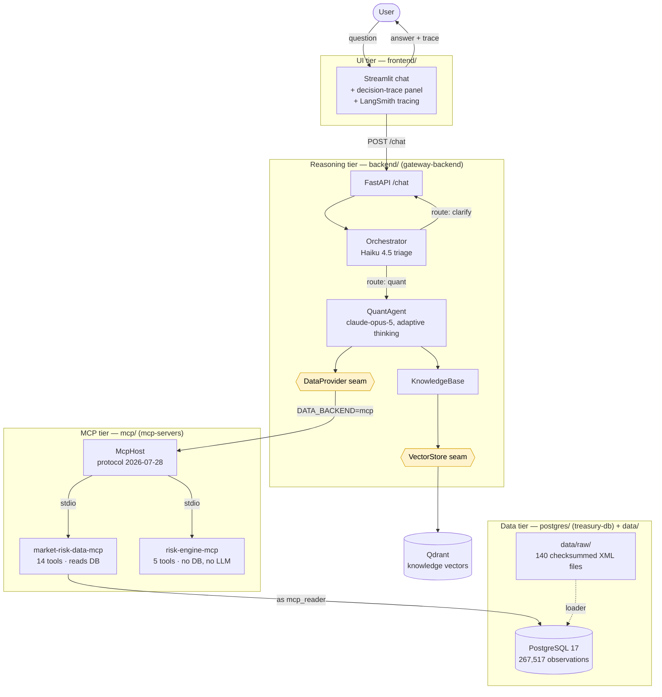
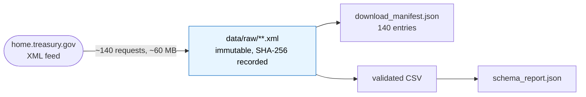
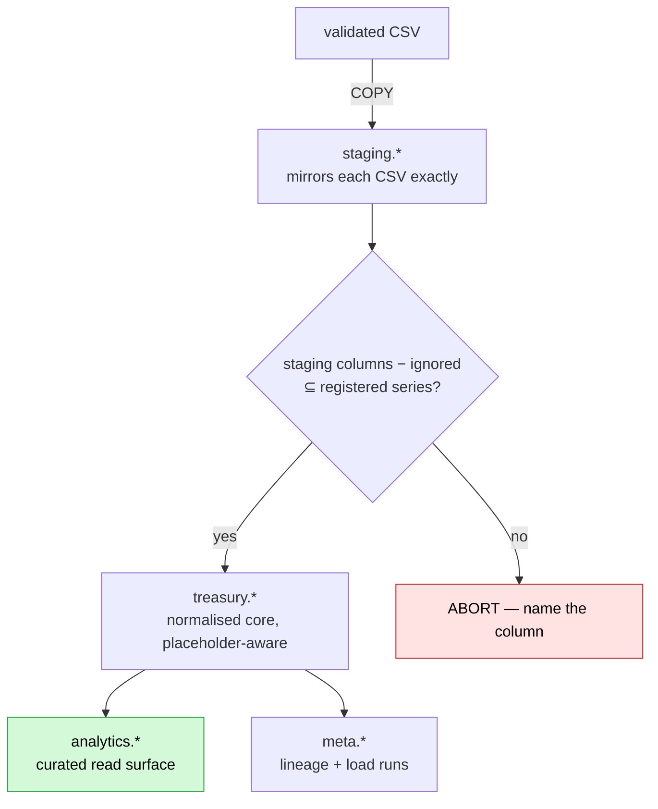
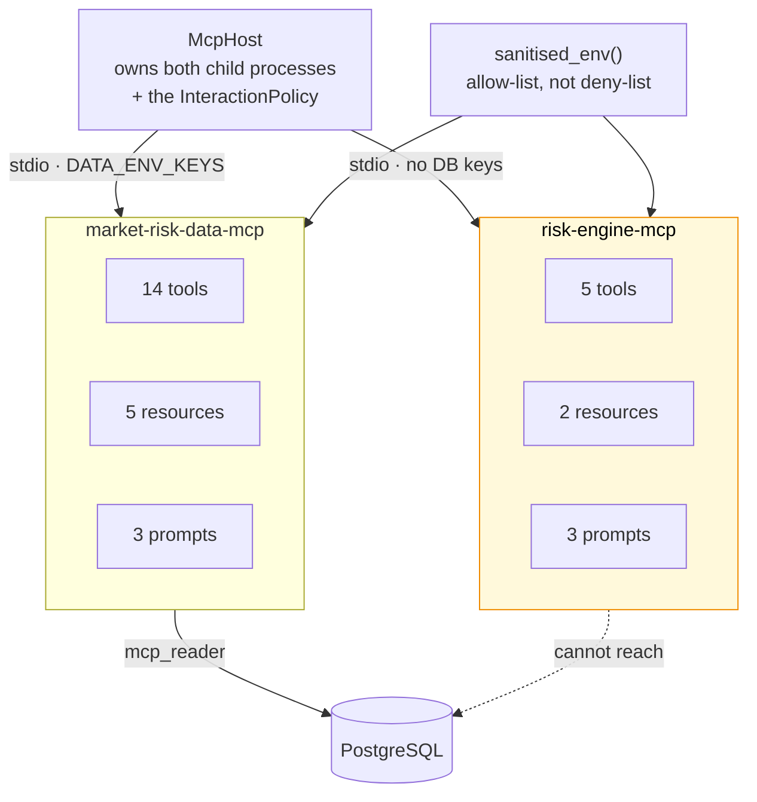
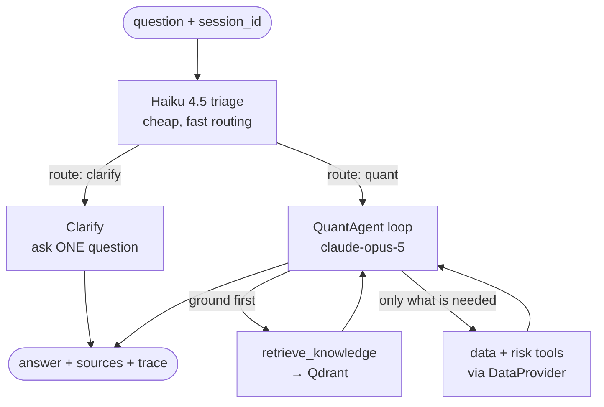
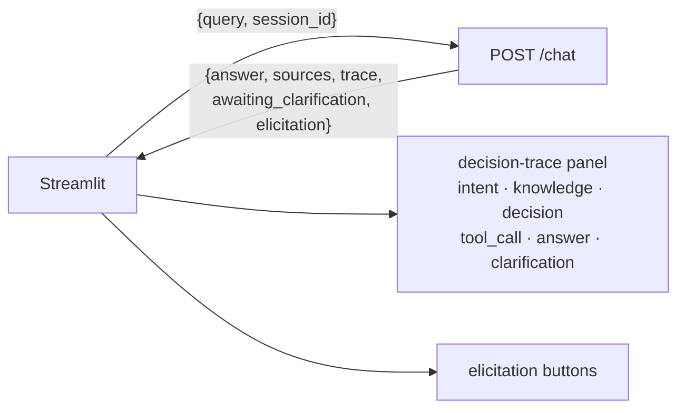
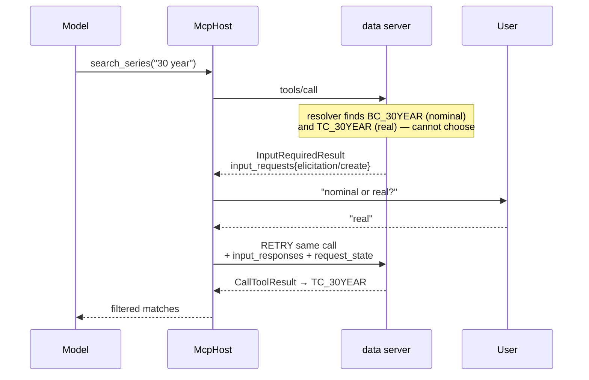

# semantic-mcp-data-access-gateway

A semantic **Model Context Protocol** gateway for intent-aware request understanding,
data-requirement planning, and optimised retrieval over enterprise data. Today's domain is
**U.S. Treasury interest rates** — 267,517 verified observations spanning 1990-01-02 to
2026-08-11.

Instead of a client blindly calling every tool an MCP server exposes, this project adds a
reasoning layer that reads the incoming question, consults a knowledge base of what each tool
and data source is actually *for*, and invokes only what is needed to answer it — then shows
its working.

> **The rule everything rests on:** a missing observation is **NULL**. Never zero, never the
> previous day's rate, never an interpolation. Absence of a rate and a rate of zero are
> different facts; collapse them and you get a curve that looks complete and is wrong, with
> nothing downstream able to tell.

---

## Table of contents

- [The whole system](#the-whole-system)
- [Stage 1 — Acquisition](#stage-1--acquisition-treasury--disk)
- [Stage 2 — The data layer](#stage-2--the-data-layer-csv--postgresql)
- [Stage 3 — The MCP layer](#stage-3--the-mcp-layer-the-only-road-between-tiers)
- [Stage 4 — The reasoning layer](#stage-4--the-reasoning-layer-what-data-does-this-question-need)
- [Stage 5 — The UI](#stage-5--the-ui-the-answer-and-how-it-was-reached)
- [All six MCP primitives](#all-six-mcp-primitives)
- [Quick start](#quick-start)
- [Verification](#verification)
- [Repository layout](#repository-layout)

---

## The whole system

Four runtime tiers, dependencies strictly downward. Each is independently runnable and
independently verifiable.



**Reading the diagram.** The reasoning tier decides *what data a question needs*; the data tier
is *where that truthfully lives*; the MCP tier is *the only road between them*; the UI is *how a
human sees the answer and how it was reached*.

The two yellow boxes are **swap seams**. The agent talks only to interfaces, so the engines
behind them are configuration rather than code changes:

| Seam | Implementations | Selected by |
|---|---|---|
| `DataProvider` | `McpDataProvider`, `PostgresDataProvider`, `MockDataProvider` | `DATA_BACKEND` |
| `VectorStore` | `QdrantVectorStore` (embedded or Docker server) | `QDRANT_URL` |

| `DATA_BACKEND` | Route | Trade-off |
|---|---|---|
| `mcp` | Both MCP servers as `mcp_reader` | Privilege boundary holds; risk engine included. **Default for the full stack.** |
| `postgres` | Direct psycopg2 as the **owner** role | Fewer moving parts; the agent can write to the source of record |
| `mock` | Synthetic, Treasury-shaped | No database needed |

---

## Stage 1 — Acquisition (Treasury → disk)



Five Treasury datasets are downloaded year by year. Every file's SHA-256 is recorded at
download time, and **`data/raw/` is byte-immutable from that moment on** — every downstream
artifact is reproducible from those bytes.

**Why it matters:** the loader refuses to run if any file's hash no longer matches the
manifest. That guard is not theoretical — it fired during development when git's line-ending
normalisation silently rewrote every XML file (`data/raw/** -text` in `.gitattributes` is the
fix).

**Rules enforced here**

- Never hardcode the field list — Treasury has added six par maturities since 1990. Parse what
  the feed returns.
- Preserve Treasury's terminology exactly. `BC_1MONTH` stays `BC_1MONTH`; renaming is how a
  discount rate ends up labelled a yield.
- Never substitute a source. No FRED, no Kaggle, no mirror. If Treasury is down, the run fails.
- Flag, don't clean. Nothing is clipped, smoothed or dropped as an outlier — negative real
  yields are legitimate.

---

## Stage 2 — The data layer (CSV → PostgreSQL)



Four schemas, one direction. Only `analytics.*` is visible to the MCP layer.

**The generic unpivot and the guard that makes it safe.** Wide datasets are unpivoted with
`jsonb_each_text`, and a join to `treasury.series` decides which columns are rates. That join is
also the hazard: an unregistered column would simply vanish, and every number that remained
would still look correct. So before any insert runs, the loader asserts that every staging
column is a registered series — and aborts naming the column if not.

**That failure is the feature.** Silence would be the defect. The fix is always a migration
registering the series, never widening the ignore list.

| What is loaded | Count |
|---|---:|
| Observations | 267,517 |
| Series registered | 52 |
| Source files tracked | 140 |
| Placeholder rows (NULL rate, kept for audit) | 5,256 |
| Database size | 65 MB |

**The privilege boundary.** `mcp_reader` has `REVOKE` on `treasury` and `staging`, sees only
`analytics.*` through owner-privileged views, and carries `CONNECTION LIMIT 5`. That grant — not
a convention — is what the whole MCP layer rests on.

---

## Stage 3 — The MCP layer (the only road between tiers)



Two stdio servers plus the host that drives them. **Neither server imports an LLM client, and
the risk engine holds no database credential** — its child environment is built by allow-list,
so "was the input wrong, or the maths?" has a mechanical answer.

| Boundary | What enforces it |
|---|---|
| Only the host reasons | Neither server imports `anthropic` |
| Only the data server reads PostgreSQL | The risk child's env has no `POSTGRES_*`, no `MCP_READER_*` |
| `mcp_reader` cannot see raw tables | `REVOKE` on `treasury`/`staging` |
| Only the risk engine calculates | The data server contains no pricing code |
| Bulk arrays bypass model context | Routed through the result's `_meta` |
| Real vs synthetic is unambiguous | `CHECK` constraints + classification on every payload |

**Non-negotiables**

- **stdout is the protocol channel.** A stray `print()` corrupts the JSON-RPC stream and
  presents as a mysterious client disconnect. Diagnostics go to stderr.
- **No `run_sql`, ever** — and no `columns`/`table`/`schema`/`order_by`/`where` parameter. SQL
  templates live in `repository.py`; callers supply values only.
- **Par yields are not zero rates.** The risk engine bootstraps discount factors before pricing.
  Using a 10-year CMT as a discount rate fails silently and the error grows with maturity.
- **Limits are refusals, not truncations.** A caller who asked for 5,000 rows and silently got
  2,000 has a wrong answer, not a partial one.

---

## Stage 4 — The reasoning layer (what data does this question need?)



The agent's responsibilities, in order: **understand intent → clarify if ambiguous → ground in
knowledge → decide required data → fetch → compose → emit a decision trace.**

Grounding before fetching is deliberate: the knowledge document for a metric names the exact
data inputs it needs, which turns retrieval into a correct tool plan rather than a guess.

**Capability is detected, never assumed.** Portfolio and risk tools are offered only when the
provider can actually reach them. Under `mock` or `postgres` the agent never sees those tools
and says plainly that it has no positions — an agent that advertises a capability it cannot
honour will confabulate one.

**Honesty rules that must survive into the answer**

- The demo book is `SYNTHETIC_DEMO`; the curve is `REAL_MARKET_DATA`. Both labels reach the user.
- Bond values are **model-implied** from the par curve, not executable prices.
- Reported VaR is an **analytical demonstration**, not a regulatory figure.
- CVA, RWA and PD/LGD/EAD are explained from knowledge but **not computed** — there is no
  counterparty data. The agent says so rather than improvising a number.

**Orchestration belongs in code, not in the model.** Marshalling a portfolio into the risk
engine's input shape, and differencing two observed curves into a replay shock, live in
`risk_workflows.py`. That is mechanical work with one right answer; a model asked to improvise
it will eventually improvise it differently. The model chooses *which* workflow, not how to
reshape a payload.

---

## Stage 5 — The UI (the answer, and how it was reached)



The trace panel is not decoration — it is the project's claim to being auditable. Every step
carries its kind, and knowledge steps carry the domain and source of each retrieved chunk.

A clarifying question is a **first-class state**, not an error: when `awaiting_clarification` is
set the UI renders the question with real option buttons and carries the same `session_id` into
the next turn.

> ⚠️ Set `AGENT_BACKEND=rest` in `frontend/.env` or the UI silently serves canned
> mock answers, and raise `AGENT_TIMEOUT_SECONDS` — one turn runs several MCP round trips behind
> an Opus loop, and the 30s default expires mid-answer.

---

## All six MCP primitives

Protocol revision **2026-07-28**, SDK `mcp>=2.0.0`. Three primitives flow client→server; three
flow the other way, mid-call.

| Primitive | Direction | Where it lives here |
|---|---|---|
| **Tools** | client → server | 14 data + 5 risk |
| **Resources** | client → server | catalogues, caveats, provenance, risk methodology |
| **Prompts** | client → server | 3 + 3 recommended tool orderings |
| **Elicitation** | server → client | `search_series` — `'30 year'` matches BC_30YEAR *and* TC_30YEAR |
| **Roots** | server → client | `export_curve_csv` — writes only inside a client-granted directory |
| **Sampling** | server → client | `brief_dataset_caveat` — the data server has no model, so it borrows the host's |

The last three share **one mechanism**: a tool parameter annotated `Annotated[T, Resolve(fn)]`
is filled by running `fn` *before* the tool body, and `fn` may return a request marker instead
of a value.



That retry loop is **MRTR** (multi-round-trip tool response). There is no server-initiated
`elicitation/create` any more and no `elicitationId` — correlation is by resolver key across
retries. `McpHost.call` drives the loop, so the provider seam and the reasoning agent never see
it.

**Two things that are easy to get wrong**

1. **Connect with `session.discover()`, not `session.initialize()`.** `initialize` is the
   pre-2026 handshake and negotiates at most 2025-11-25, where these three fall back to
   deprecated standalone requests. `verify_mcp.py` asserts the negotiated revision.
2. **Never combine a `Resolve(...)` parameter with a hand-rolled `InputRequiredResult` return
   on one tool.** A call has a single `input_responses`/`request_state` channel; the two flows
   overwrite each other and the call can never converge. The SDK rejects it at registration.

Resolver bodies **re-run on every round**, so they must be cheap and side-effect-free. A
resolver that returns a plain value asks nothing and costs no round trip — which is what keeps
elicitation affordable to leave switched on.

```bash
python -m mcp_servers.host --primitives   # exercise all six, end to end
```

---

## Quick start

```bash
python tools/setup.py            # fresh system, end to end
python tools/setup.py --check    # report state, change nothing
```

Or by hand:

```bash
pip install -r requirements.txt
pip install -e ./postgres -e ./mcp -e ./backend
cp .env.example .env             # set POSTGRES_PASSWORD and ANTHROPIC_API_KEY
```

All three distributions must be installed — they import each other. There are **no `sys.path`
hacks anywhere**; modules find the repo root by walking up for a marker, never by counting
`parents[N]` (three packages sit at three depths, so a count is wrong the moment a file moves).

**Data layer**

```bash
docker compose up -d postgres
python -m treasury_db.migrate                     # --status to inspect
python -m treasury_db.load
python tools/verify_load.py --self-test
```

**MCP layer**

```bash
python -m mcp_servers.data.bootstrap     # once: set the mcp_reader password
python -m mcp_servers.host --tools       # discover both servers' tools
python -m mcp_servers.host --demo        # curve → price → DV01 → VaR → stress
python -m mcp_servers.host --isolation   # prove the risk engine cannot reach the DB
python -m mcp_servers.host --primitives  # all six primitives
python -m mcp_servers.host --ask "What is the current 2s10s slope?"
```

**Reasoning + UI**

```bash
docker compose up -d qdrant
python -m backend.knowledge.knowledge_base   # ingest; no API key needed
python -m backend.api.service                # POST /chat on :8000
cd frontend && streamlit run app.py   # :8501
```

---

## Verification

There is no CI. These checks are manual and are the only thing between a defect and `main`.

```bash
python -m treasury_db.migrate --status    # no unexpected pending
python -m treasury_db.load
python tools/verify_load.py --self-test   # 74/74
python tools/verify_mcp.py  --self-test   # 48/48, 4 canaries
python -m mcp_servers.host --isolation
python -m mcp_servers.host --demo
pytest                                    # 231 tests
cd frontend && pytest          # 10 tests
```

**The principle:** a suite that has only ever passed is equally consistent with a suite that
cannot detect anything. Every verifier here plants a failure and requires the checks to catch
it.

- `verify_load` plants a corruption in the loaded data and requires reconciliation to detect it,
  then rolls back. **Expectations are recounted from the CSVs** — a check that asks the database
  what it should contain proves nothing.
- `verify_mcp` plants four canaries that must be **rejected**: a rate missing `quote_basis`, a
  leaked `BC_30YEARDISPLAY` placeholder, an unlabelled demo position, and a filename that would
  escape a granted root.

**Test suite — 241 tests across six tiers**

| Tier | Focus | Tests |
|---|---|---:|
| T1 | Foundations — packaging, contracts, cursor, errors | 28 |
| T2 | Advertised surface — schemas, annotations, SQL boundary | 19 |
| T3 | Data integrity — NULL rule, placeholders, grants | 17 |
| T4 | MCP tools — every tool, happy path + edge | 28 |
| T5 | Security — injection, traversal, separation of duties | 39 |
| T6 | Live service — contract, routing, sessions | 18 |
| — | Risk maths, provider seam, primitives, SDK contract | 82 |
| — | Frontend | 10 |

Tiers 3–6 skip cleanly when PostgreSQL or the service is not running, so a red result always
means a real defect.

---

## Repository layout

| Path | Distribution | Import package |
|---|---|---|
| `postgres/` | `treasury-db` | `treasury_db` — migrations, loader, DB access |
| `mcp/` | `mcp-servers` | `mcp_servers` — `.data`, `.risk`, `.host` |
| `backend/` | `gateway-backend` | `backend` — `.api`, `.agent`, `.knowledge`, `.providers` |
| `frontend/` | — | Streamlit app, run in place |
| `data/` | — | source of record, plus the `acquisition/` that fills it |
| `knowledge/` | — | RAG corpus the vector store ingests |
| `docs/` | — | contracts and methodology |
| `tools/` | — | setup and the two verifiers |

The MCP package is `mcp_servers`, deliberately **not** `mcp` — that name belongs to the MCP SDK
on PyPI, and shadowing it breaks every server with an import error that looks like a corrupted
install.

`.claude/` holds both configuration (`agents/`, `commands/`, `rules/`, `skills/`,
`settings.json`) and the four source distributions under ``. Nothing outside
`` is importable code; nothing inside it is Claude Code configuration.

### Development agents

Seven subagents in `.claude/agents/` mirror the tiers — one per concern, each stating what it
must **not** do, because the boundaries between tiers are the part worth protecting.

| Agent | Owns | Explicitly does not |
|---|---|---|
| `acquisition-agent` | Treasury feeds, raw XML, manifests | load PostgreSQL |
| `database-agent` | migrations, loader, views, grants | download source data |
| `mcp-agent` | both servers, host, risk maths | provision DBs, author knowledge |
| `backend-agent` | QuantAgent, seams, `/chat` | build MCP servers |
| `frontend-agent` | Streamlit, trace panel | change the `/chat` contract |
| `knowledge-author` | the `knowledge/` corpus | change retrieval code |
| `verification-agent` | the pre-PR gates | quietly fix the code under test |

---

## Documentation

| Document | Covers |
|---|---|
| [`CLAUDE.md`](CLAUDE.md) | Shared project memory; the rules that apply to every session |
| [`AGENTS.md`](AGENTS.md) | The runtime agent's architecture, tools and decision trace |
| [`docs/loading-contract.md`](docs/loading-contract.md) | How to extend the pipeline |
| [`docs/mcp-contract.md`](docs/mcp-contract.md) | The MCP tool/resource/prompt contract |
| [`docs/risk-methodology.md`](docs/risk-methodology.md) | Curve construction and risk maths |
| [`docs/postgres-setup.md`](docs/postgres-setup.md) | Database provisioning, narrated |

## Licence

See [LICENSE](LICENSE).
