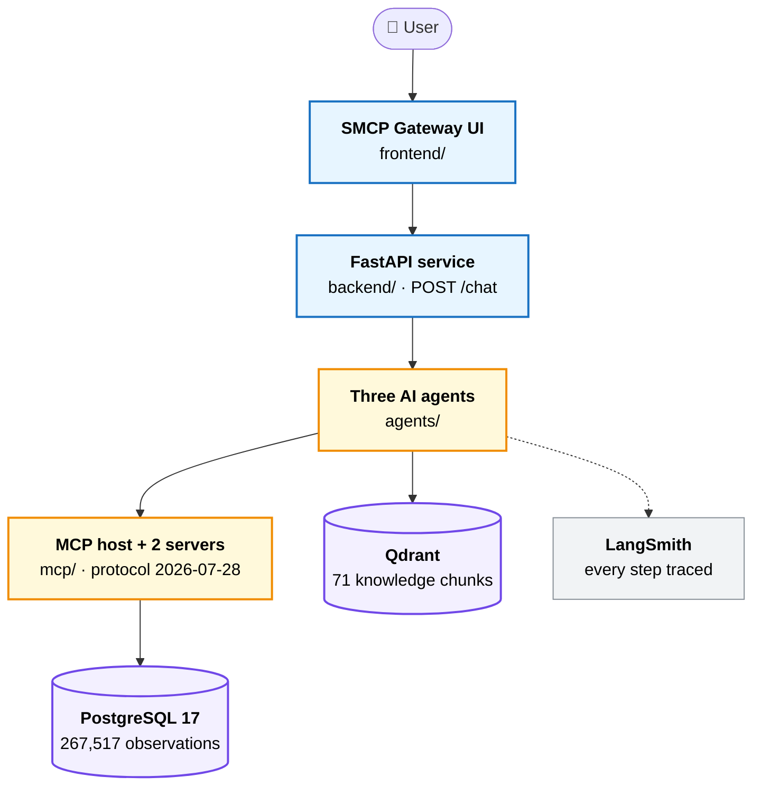
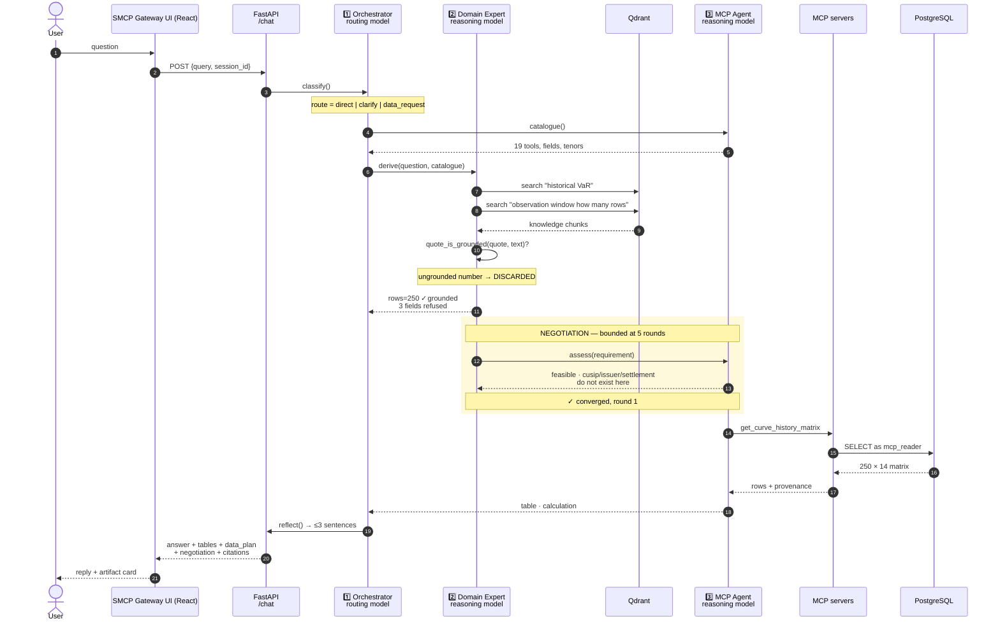
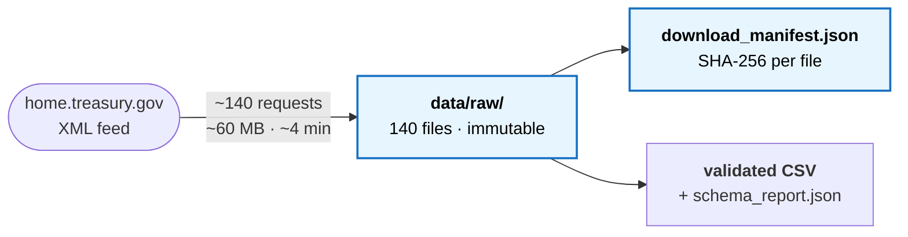
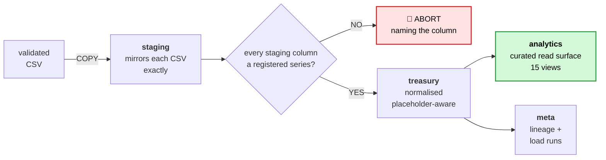
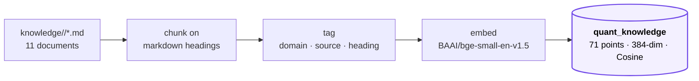
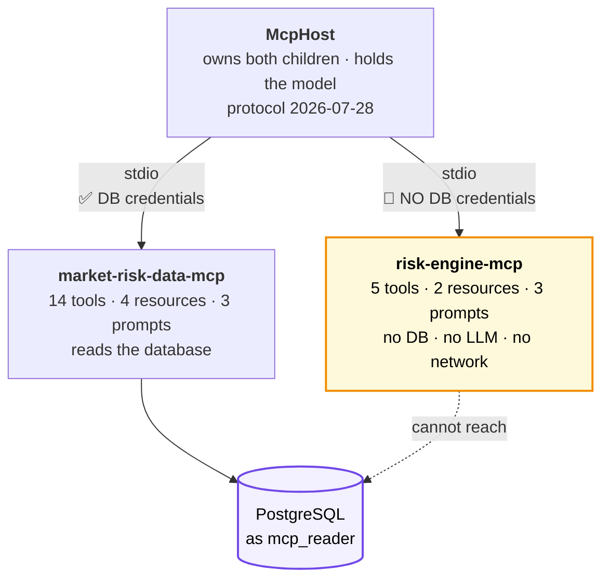
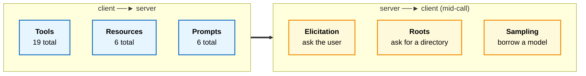
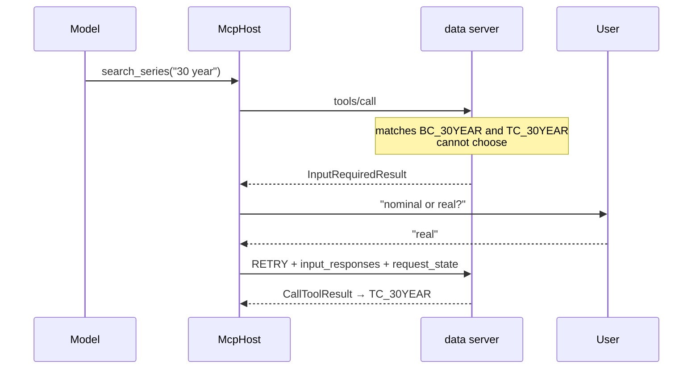
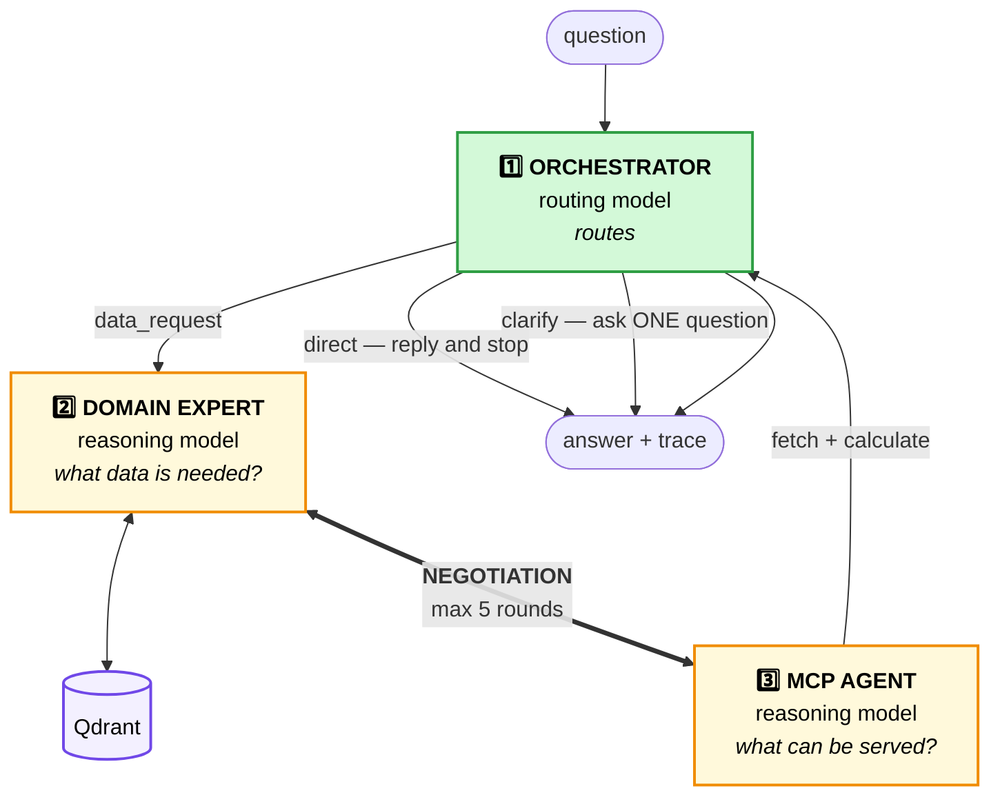

<h1>semantic-mcp-data-access-gateway</h1>

**Ask a market-risk question in plain English. Three specialist AI agents work out what data the
task actually needs — grounded in a vector database, never in a hardcoded constant — negotiate
what the data layer can honestly serve, fetch exactly that, and show their working.**

Today's domain is U.S. Treasury interest rates: **267,517 verified observations, 1990-01-02 to
2026-08-11**, straight from `home.treasury.gov`.

---

# Table of contents

| § | Section | What you'll find |
|---|---|---|
| **1** | [What this is](#1-what-this-is) | The problem, and the four failures this design answers |
| **2** | [Architecture overview](#2-architecture-overview) | The whole system in one diagram |
| **3** | [End-to-end workflow](#3-end-to-end-workflow) | One question traced through every component |
| **4** | [Stage 1 — Acquisition](#4-stage-1--acquisition) | Treasury → immutable files on disk |
| **5** | [Stage 2 — PostgreSQL](#5-stage-2--postgresql) | **Every schema, table and row count** |
| **6** | [Stage 3 — Qdrant](#6-stage-3--qdrant) | **Every domain, document and chunk** |
| **7** | [Stage 4 — MCP layer](#7-stage-4--mcp-layer) | Both servers, all 19 tools, **all 6 primitives with demo questions** |
| **8** | [Stage 5 — The three agents](#8-stage-5--the-three-agents) | Orchestrator, Domain Expert, MCP Agent |
| **9** | [Stage 6 — The UI](#9-stage-6--the-ui) | Chat, artifact panel, decision trace |
| **10** | [LangSmith](#10-langsmith--tracing-and-how-to-read-it) | **How to turn it on and read the outcomes** |
| **11** | [Evaluation](#11-evaluation) | 13 cases × 11 scorers |
| **12** | [Quick start](#12-quick-start) | From empty machine to running system |
| **13** | [Verification](#13-verification) | The gates between a defect and `main` |
| **14** | [Demo script](#14-demo-script) | What to type, in order, for a 10-minute demo |
| **15** | [Repository layout](#15-repository-layout) | Where everything lives |
| **16** | [Known issues](#16-known-issues) | Recorded, not hidden |

---

# 1. What this is

The obvious way to build this is to point an LLM at a database and let it write SQL. That fails
in four specific ways. **Every major design decision here is an answer to one of them.**

| # | The failure | The answer in this system |
|---|---|---|
| 1 | **The model invents numbers.** Ask for the 10-year yield and it recalls one from training. | The model has no numbers. Every figure comes from a tool call against the real database, and the trace shows exactly which. |
| 2 | **Things that look alike get silently mixed.** A Treasury bill quotes 3.64% bank-discount *and* 3.70% coupon-equivalent. Both correct. Not interchangeable. | `quote_basis` travels with **every single rate**, from the database column through to the sentence in the answer. |
| 3 | **Nobody can check the answer.** | Any value traces back to the exact Treasury file and its SHA-256 hash. |
| 4 | **"Give me 10,000 rows" is taken at face value.** | A domain expert agent reads the knowledge base and replies that the method consumes 250 — quoting the sentence that says so. |

### The one rule everything rests on

> **A missing observation is NULL. Never zero, never the previous day's rate, never an
> interpolation.**

Absence of a rate and a rate of zero are *different facts*. Collapse them and you get a curve
that looks complete and is wrong, with nothing downstream able to tell. This is enforced at
every layer: the downloader emits NULL, the loader writes no row, the schema has no default
that could invent one.

The harder half: **an exact 0 is not automatically a missing value.** Short tenors genuinely
printed 0.00% in 2008-12, 2011, 2015 and 2020-21. Exactly one column is a placeholder —
`BC_30YEARDISPLAY`, a literal `0` on all 5,256 dates before 2011-01-03 — and that judgement
lives in the database as data (`treasury.series.placeholder_zero_before`), not in code.

---

# 2. Architecture overview

Six components. Dependencies run strictly downward — nothing ever reaches back up.



### Reading it in one line each

| Layer | Its job |
|---|---|
| **UI** | How a human sees the answer *and how it was reached* |
| **Service** | The only entry point; owns session memory |
| **Agents** | Decide **what data a question needs** |
| **MCP** | **The only road** between reasoning and data |
| **PostgreSQL** | **Where truth lives** |
| **Qdrant** | **What the domain means** — the system's brain |

### Three swap seams

The agents talk only to interfaces, so engines are configurable rather than welded in.

| Seam | Implementations | Chosen by |
|---|---|---|
| `DataProvider` | `McpDataProvider` · `PostgresDataProvider` · `MockDataProvider` | `DATA_BACKEND` |
| `VectorStore` | `QdrantVectorStore` (embedded, or Docker via `QDRANT_URL`) | `QDRANT_URL` |
| `ModelProvider` | `AnthropicProvider` (Claude) · `ZaiProvider` (GLM) | `LLM_BACKEND` |

The third means **the LLM engine itself is interchangeable**. No agent names a model — each
declares a *call site*, and the model serving it is configuration. The system runs on open weights **by
default**; `LLM_BACKEND=anthropic` returns it to Claude, with no change in any agent.
Details and the measurements behind the allocation:
[`docs/model-provider.md`](docs/model-provider.md).

---

# 3. End-to-end workflow

The complete path of one real question:

> *"Give me 10,000 rows of Treasury yield data with observation_date, rate_percent,
> quote_basis, cusip, issuer_name and settlement_date. I need it to compute 10-day 99%
> historical VaR on the book."*



### Six things worth pointing at during a demo

| # | What happens | Why it matters |
|---|---|---|
| 1 | **The cheap path stays cheap.** "hi" returns at step 3. | A greeting never costs an Opus turn or a vector search. |
| 2 | **The catalogue comes before the requirement.** | The expert plans against what is *actually connected*, not what it imagines exists. |
| 3 | **Two vector searches, not one.** | "What is historical VaR" and "how many rows does it read" are different questions; one embedding cannot be near both. |
| 4 | **The grounding check is a gate.** | A number whose citation is not in the retrieved text is *thrown away*, not reported. |
| 5 | **Three fields are refused, not filled.** | A par yield curve holds no CUSIPs. Inventing one is worse than saying no. |
| 6 | **Nothing is fetched until both agents agree.** | 250 rows instead of 10,000 — argued on the record, not assumed. |

---

# 4. Stage 1 — Acquisition



Five datasets, downloaded year by year. Every file's SHA-256 is recorded at download, and
`data/raw/` is **byte-immutable** from that moment on.

```bash
python data/acquisition/download_us_treasury.py
```

### Rules

| Rule | Why |
|---|---|
| **Never hardcode the field list** | Treasury has added six par maturities since 1990. Parse what the feed returns. |
| **Preserve Treasury's terminology exactly** | `BC_1MONTH` stays `BC_1MONTH`. Renaming is how a discount rate ends up labelled a yield. |
| **Never substitute a source** | No FRED, no mirror. If Treasury is down, the run fails. |
| **Flag, don't clean** | Negative real yields are legitimate. |

> **The immutability guard is not theoretical.** It fired when git's line-ending normalisation
> silently rewrote all 140 XML files, breaking every manifest hash and blocking the loader.
> The fix was `data/raw/** -text` in `.gitattributes` — and *restoring the files from committed
> blobs*, **not** regenerating the manifest from disk. Regenerating would have "verified" the
> mutated bytes.

---

# 5. Stage 2 — PostgreSQL

## 5.1 Schema design

Four working schemas plus a demo schema. Data flows one way.



## 5.2 What is actually inside — every table

**Live counts, read from the running database.**

### `treasury` — the normalised source of record

| Table | Rows | What it holds |
|---|---:|---|
| `observation` | **267,517** | One rate, one date, one series. **The core table.** |
| `bill_security` | 26,300 | CUSIPs and maturity dates for bills — *not* rates |
| `long_term_extrapolation` | 994 | Extrapolation factors |
| `series` | **52** | Every rate series, with its quoting basis and placeholder rule |
| `dataset` | 5 | The five Treasury datasets, each with its market-risk caveat |
| `market_note` | 1 | Market-closure notes |

### `staging` — one table per CSV, mirroring it exactly

| Table | Rows |
|---|---:|
| `long_term_rates` | 19,965 |
| `par_yield_curve` | 9,159 |
| `real_long_term_rates` | 6,655 |
| `bill_rates` | 6,157 |
| `real_yield_curve` | 5,906 |

### `meta` — lineage, so any number can be traced back

| Table | Rows | What it holds |
|---|---:|---|
| `reconciliation` | 1,696 | Recount of every load, from source |
| `source_file` | **140** | Every downloaded file + its SHA-256 |
| `load_step` | 70 | Each step of each load |
| `schema_migration` | 13 | Applied migrations |
| `load_run` | 7 | Load history |

### `demo` — synthetic, and labelled as such everywhere

| Table | Rows | What it holds |
|---|---:|---|
| `scenario` | **7** | Stress scenarios |
| `instrument` | 5 | Demo bond economics |
| `position` | 5 | Positions in the demo book |
| `portfolio` | 1 | `TREASURY_DEMO_001` |

### `analytics` — 15 views, the only surface `mcp_reader` can see

`v_observation` · `v_series` · `v_series_coverage` · `v_latest_rates` · `v_par_yield_curve` ·
`v_real_yield_curve` · `v_bill_rates_quoted` · `v_long_term_rates` · `v_dataset_summary` ·
`v_source_file_current` · `v_mcp_curve` · `v_mcp_observation` · `v_mcp_series_catalogue` ·
`v_mcp_dataset` · `v_mcp_portfolio_position`

## 5.3 The five datasets

| Dataset | From | Shape | Series | Observations |
|---|---:|---|---:|---:|
| Daily Treasury Par Yield Curve Rates | 1990 | wide | 15 | **108,339** |
| Daily Treasury Bill Rates | 2002 | wide | 28 | **105,204** |
| Daily Treasury Par Real Yield Curve Rates | 2003 | wide | 5 | 27,354 |
| Daily Treasury Long-Term Rates | 2000 | long | 3 | 19,965 |
| Daily Treasury Real Long-Term Rates | 2000 | wide | 1 | 6,655 |

## 5.4 Quoting basis — the distinction that must never be lost

**This is the single most important column in the database.** The same instrument quoted two
ways gives two different numbers, both correct, and mixing them silently corrupts a curve.

| `rate_kind` | `quote_basis` | Series | Meaning |
|---|---|---:|---|
| nominal | `par_coupon_semiannual` | 17 | Par yields — the classic Treasury curve |
| nominal | `bank_discount_act360` | 14 | Bill discount rates, ACT/360 |
| nominal | `coupon_equivalent` | 14 | The *same bills*, bond-equivalent |
| real | `par_coupon_semiannual` | 5 | TIPS par real yields |
| real | `average_real_yield` | 2 | Long-term average real |

> Getting `rate_kind` wrong is visible — a real yield among nominals looks odd immediately.
> **Getting `quote_basis` wrong is not.** A discount rate registered as `coupon_equivalent`
> sits quietly in a curve until someone prices off it.

## 5.5 The guard that makes the loader safe

Wide datasets are unpivoted generically — there is **no list of maturities anywhere in the
loader**:

```sql
FROM staging.<table> st
CROSS JOIN LATERAL jsonb_each_text(to_jsonb(st) - <ignored>) AS kv(key, value)
JOIN treasury.series s ON s.data_key = :key AND lower(s.series_code) = kv.key
WHERE kv.value IS NOT NULL
```

That join is also the hazard: **an unregistered column would simply vanish**, and every number
that remained would still look correct. Nobody notices a maturity missing from a curve they have
never seen complete. So before any insert runs, the loader asserts:

```
staging columns − ignored  ⊆  registered series codes
```

and aborts naming the column:

```
daily_treasury_yield_curve: staging column(s) with no registered series:
['bc_2_5month']. Treasury has published a series this database does not know
about. Add it in a migration - do not let the load drop it.
```

**This failure is the feature. Silence would be the defect.**

## 5.6 The privilege boundary

| Constraint | How it's enforced |
|---|---|
| MCP cannot read raw tables | `REVOKE` on `treasury` and `staging` |
| MCP sees only curated views | `analytics.*`, owner-privileged |
| MCP cannot exhaust the pool | `CONNECTION LIMIT 5` on `mcp_reader` |
| MCP cannot write | No `INSERT`/`UPDATE`/`DELETE` grant anywhere |

---

# 6. Stage 3 — Qdrant

## 6.1 What it is for

**Qdrant is the brain.** It is not a cache and not a document store — it is where the system
learns *what a metric means and what data it consumes*, and it is the reason no threshold is
hardcoded.

Each `market_risk` document is an **executable analytical contract**, not just prose: it names
its required inputs as canonical concepts, the real MCP tool that computes the metric
(`compute_historical_risk_tool`, `compute_dv01_tool`, `run_stress_tool`, `get_curve`), and ends
with a *Mapping status* table recording — per capability — whether every input resolves to real
data (**Calculate + Explain**) or not (**Explain-only**, e.g. CVA/RWA, which have no counterparty
data). That is what keeps retrieval honest: the knowledge cannot ask for data the system does not
have, and every referenced tool and column is one that actually exists.



| Property | Value |
|---|---|
| Collection | `quant_knowledge` |
| Points | **71** |
| Vector size | **384** |
| Distance | **Cosine** |
| Embedding model | `BAAI/bge-small-en-v1.5` — **runs locally, no API key** |
| Mode | Docker server when `QDRANT_URL` is set; otherwise embedded at `./data/qdrant` |

## 6.2 What is actually inside — every document

**Live counts, read from the running collection.**

| Domain | Chunks | Documents |
|---|---:|---|
| **market_risk** | **35** | `var` (7) · `expected_shortfall` (7) · `yield_curve` (7) · `sensitivities_greeks` (7) · `stress_testing` (7) |
| **credit_risk** | 13 | `credit_ratings_pd` (7) · `pd_lgd_ead` (6) |
| **regulatory_capital** | 12 | `basel_capital_ratios` (6) · `rwa` (6) |
| **xva** | 11 | `exposure_metrics` (6) · `cva` (5) |

Each point carries `domain`, `source`, `heading` and the chunk text — so a citation can be
verified rather than trusted.

**The subfolder name under `knowledge/` is the domain tag.** Adding a domain means a new
subfolder plus its docs, then adding it to `DOMAINS`.

## 6.3 Why nothing is hardcoded — and how to prove it

The domain expert holds **no numbers of its own**. Every figure must be quoted verbatim from a
chunk it actually retrieved, and the quote is checked against the retrieved text:

```python
if rows is not None and not quote_is_grounded(quote, context):
    rows, quote = None, None      # discarded — and the user is told why
```

A window recalled from training is rejected exactly like a constant in the source code:
**both are unfalsifiable.** You cannot change them by editing a document, and you cannot audit
them by reading one.

The live quote comes from `knowledge/market_risk/var.md`:

> *"Historical simulation reads a fixed lookback window of **250 trading days** of daily
> observations."*

### 🔬 Prove it in 60 seconds — the best moment of the demo

```bash
# 1. edit knowledge/market_risk/var.md — change 250 to 500
# 2. re-ingest
python -c "from backend.knowledge.knowledge_base import KnowledgeBase; KnowledgeBase(rebuild=True)"
# 3. ask the same question again
```

You get **500**, quoting your edited sentence. **No code change. No release. No engineer.**
A domain expert can change the system's behaviour by editing a document.

When the corpus is silent on a window, `rows` comes back `None` and the answer says the corpus
states none — rather than quietly supplying a plausible default.

---

# 7. Stage 4 — MCP layer

## 7.1 Two servers, one host, one boundary



**Why the risk engine has no database access.** Not because it would misuse it — because a
calculation service that *cannot* reach the database makes *"was the input wrong, or the
maths?"* a question with a mechanical answer. That guarantee is worth nothing if it rests on the
engine choosing not to connect, so the credentials are **simply absent from its environment**.

`sanitised_env()` builds each child's environment by **allow-list, not deletion** — a deny-list
silently leaks the next credential someone adds to `.env`.

```bash
python -m mcp_servers.host --isolation   # proves the risk engine cannot reach the DB
```

## 7.2 All 19 tools

### `market-risk-data-mcp` — 14 tools

| Tool | What it does | 💬 Demo question |
|---|---|---|
| `list_datasets` | The five datasets with coverage **and caveats** | *"What Treasury datasets do you have?"* |
| `list_series` | Rate series, filterable by kind/basis | *"What tenors are available?"* |
| `search_series` | Resolve `'10 year'` → a series code | *"Find me the thirty year series"* |
| `get_series_coverage` | First/last observation + count | *"How far back does the 10-year go?"* |
| `get_curve` | One day's complete par curve | *"Show me today's Treasury yield curve"* |
| `get_rate_history` | Up to 16 series over a date range | *"How has the 10-year moved this year?"* |
| `get_curve_history_matrix` | N trading days × tenors, aligned | *"Give me 250 days of curve history for VaR"* |
| `explain_number` | **Where a number came from** — file, hash, row | *"Where did that 4.70% come from?"* |
| `list_portfolios` | Demo books, all labelled `SYNTHETIC_DEMO` | *"What portfolios can I analyse?"* |
| `get_portfolio` | Positions + full instrument economics | *"Show me the demo book"* |
| `list_scenarios` | The 7 stress scenarios | *"What stress scenarios exist?"* |
| `get_scenario` | One scenario's full shock vector | *"What exactly is the 2020 COVID scenario?"* |
| `export_curve_csv` | Write a curve to a client-granted directory | *"Export today's curve to CSV"* |
| `brief_dataset_caveat` | Terse caveat → desk-ready guidance | *"Explain the caveats on the par curve"* |

### `risk-engine-mcp` — 5 tools

| Tool | What it does | 💬 Demo question |
|---|---|---|
| `price_portfolio_tool` | PV of fixed-rate bonds under a par curve | *"What is the demo book worth today?"* |
| `compute_dv01_tool` | DV01 by **full revaluation** | *"What is the DV01 of the demo book?"* |
| `compute_key_rate_dv01_tool` | Sensitivity to each par node individually | *"Break the DV01 down by tenor"* |
| `run_stress_tool` | Revalue under an explicit bp shock vector | *"Run the 1994 bond massacre on the demo book"* |
| `compute_historical_risk_tool` | VaR + Expected Shortfall by full revaluation | *"Compute 10-day 99% historical VaR"* |

### Hard boundaries

| Never | Why |
|---|---|
| No `run_sql` tool, ever | A tool that accepts SQL is a database with extra steps |
| No `columns` / `table` / `schema` / `order_by` / `where` parameters | Same reason, wearing a disguise |
| Par yields are **not** zero rates | The engine bootstraps discount factors before pricing |
| Limits are **refusals**, not truncations | A silently truncated result is a wrong answer |
| `stdout` is the protocol channel | A stray `print()` corrupts JSON-RPC and looks like a client disconnect. Diagnostics → stderr. |

## 7.3 All six MCP primitives — with demo questions

Protocol revision **2026-07-28**, SDK `mcp>=2.0.0`. Three flow client→server; three flow back
mid-call.



### 1️⃣ Tools — *client → server*

19 callable operations across both servers (table above).

💬 **Demo question:** *"Show me the nominal Treasury yield curve as a table."*
→ calls `get_curve`; every point comes back carrying its `quote_basis`.

### 2️⃣ Resources — *client → server*

Context, not data. Six of them:

| URI | Server |
|---|---|
| `market-risk://catalog/datasets` | data |
| `market-risk://catalog/series` | data |
| `market-risk://docs/data-contract` | data |
| `market-risk://docs/provenance` | data |
| `risk://model/manifest` | risk |
| `risk://methodology/curve-construction` | risk |

💬 **Demo question:** *"What are the caveats on the par yield curve dataset?"*
→ reads the catalogue resource rather than calling a tool. **Context, not a query.**

### 3️⃣ Prompts — *client → server*

Recommended tool orderings, exposed as slash-commands.

| Server | Prompts |
|---|---|
| data | `curve_snapshot` · `explain_series` · `coverage_report` |
| risk | `risk_summary` · `stress_review` · `var_methodology` |

💬 **Demo:** in MCP Inspector, open **Prompts → `curve_snapshot`**. It returns the *plan*:
retrieve the curve with `get_curve`, then describe its shape. **The server tells the client how
to use it.**

### 4️⃣ Elicitation — *server → client, mid-call* ⭐

The server asks the **user** a question instead of guessing.

💬 **Demo question:** *"Find me the 30 year series."*

```
'30 year' matches BC_30YEAR (nominal par yield)
       and TC_30YEAR (real / TIPS yield)

→ server does NOT pick. It asks:
  "A nominal par yield and a real yield are different quantities. Which?"
→ user answers "real"
→ resolved: TC_30YEAR
```

**Why it matters:** a nominal and a real yield are different quantities. Guessing produces a
confidently wrong answer with no signal that anything went wrong.

### 5️⃣ Roots — *server → client, mid-call* ⭐

The **client grants a directory**; the server may write only inside it.

💬 **Demo question:** *"Export today's curve to CSV."*

```
roots offered   : exports → data/exports
written         : data/exports/latest_nominal_curve.csv  (14 rows, 1257 bytes)
containment test: '../escaped.csv'  →  REFUSED
```

**Why it matters:** the server never chooses where to write. A path escaping the granted root is
**refused, never sanitised** — sanitising hides the attempt.

### 6️⃣ Sampling — *server → client, mid-call* ⭐

The server has **no model**, so it borrows the host's.

💬 **Demo question:** *"Explain the caveats on the par yield curve in desk-ready language."*

```
drafted_by_model : claude-opus-5      ← the HOST's model, not the server's
verbatim caveat  : PAR yields - not zero-coupon/spot rates, not forwards…
```

**Why it matters:** this makes the division of labour explicit. Neither server may hold a model.
When the data server needs prose, it asks the *host*. **The model stays on one side of the
boundary; the database credential stays on the other.**

### How the last three actually work

All three share one mechanism. A tool parameter annotated `Annotated[T, Resolve(fn)]` is filled
by running `fn` *before* the tool body, and `fn` may return `Elicit[T]`, `ListRoots` or `Sample`
instead of a value. The framework returns an `InputRequiredResult`, and the client answers by
**retrying the original call** with `input_responses` + `request_state` — the **MRTR** pattern.
`McpHost.call` runs that retry loop, so the agents never see it.



> ⚠️ **The host must connect with `session.discover()`, not `session.initialize()`.**
> `initialize` is the pre-2026 handshake and negotiates at most 2025-11-25, on which those
> three primitives fall back to deprecated standalone requests. `verify_mcp.py` asserts the
> negotiated revision so this cannot regress silently.

### See it yourself

```bash
python -m mcp_servers.host --tools        # discover both servers' tools
python -m mcp_servers.host --primitives   # exercise ALL SIX, end to end
python -m mcp_servers.host --demo         # curve → price → DV01 → VaR → stress
python -m mcp_servers.host --isolation    # prove the risk engine has no DB
python -m mcp_servers.host --ask "..."    # the host's own agent
```

### Browsing the servers in MCP Inspector

```bash
CLIENT_PORT=6280 SERVER_PORT=6281 npx @modelcontextprotocol/inspector python -m mcp_servers.data.server
CLIENT_PORT=6282 SERVER_PORT=6283 npx @modelcontextprotocol/inspector python -m mcp_servers.risk.server
```

Inspector shows **Tools, Resources and Prompts** beautifully. It will **not** show elicitation,
roots or sampling — Inspector v1 connects with `initialize` and so negotiates ≤2025-11-25. Use
`--primitives` for those three.

---

# 8. Stage 5 — The three agents



| Agent | Responsibility | `LLM_BACKEND=zai` *(default)* | `LLM_BACKEND=anthropic` |
|---|---|---|---|
| **Orchestrator** | Classify → reply / clarify / delegate. Then write the final answer. Runs on **every** turn including "hi". | `glm-5.2` | `claude-haiku-4-5` |
| **Domain Expert** | Vector-search Qdrant, decide the requirement, defend it. This is where the thinking is. | `glm-5.2` | `claude-opus-5` |
| **MCP Agent** | Advertise tools, negotiate, fetch, calculate. | `glm-5.2` | `claude-opus-5` |
| *(MCP sampling)* | Rewrite a dataset caveat as desk-ready prose. | `glm-5.2` | `claude-opus-5` |
| *(Host agent)* | The standalone `--ask` loop. | `glm-5.2` | `claude-opus-5` |

**No agent names a model.** Each declares a *call site*; the model is resolved by
`LLM_BACKEND` plus `ORCHESTRATOR_MODEL`, `DOMAIN_EXPERT_MODEL` and friends, and a QA test
fails the build if a model string reappears in an agent. The allocation above is measured,
not assumed — see [`docs/model-provider.md`](docs/model-provider.md).

## 8.1 Why a discussion, not a handoff — the heart of the design

**Neither agent knows enough alone.**

- The **domain expert** knows what the *method* requires — historical VaR reads 250 trading
  days, because it read that in the knowledge base.
- The **MCP agent** knows what the *source* holds — a par yield curve has no CUSIPs, no issuer
  names, no settlement dates.

A one-way handoff produces requirements nobody can serve. So they talk, and every round is a
real model call and a real trace span:

```
round 0  domain_expert → "Proposing 4 fields and a 250-row window for
                          10-day 99% historical VaR"

round 1  mcp_agent     → "I can serve the full daily par-curve history for all
                          14 tenors over the 250-trading-day lookback. I cannot
                          serve cusip, issuer_name or settlement_date — this is
                          a par yield curve, it holds no instrument records."

         ✓ converged
```

**Bounded at 5 rounds.** Two agents that can always reply will always reply. If they never
converge, that fact is *recorded and reported* rather than hidden behind a last-ditch answer.

## 8.2 Two guarantees that live in code, not in a prompt

| Guarantee | Why a prompt isn't enough |
|---|---|
| A user who just answered a clarification is **never** asked another | A model instruction is not a bound. A loop with no exit is worse than a wrong guess. |
| Clarifying questions carry **real** choices | The orchestrator reads the MCP catalogue first, so options are actual portfolios and scenarios. Clicking one *ends* the ambiguity. |

## 8.3 Honesty rules that reach the user

- The demo book is `SYNTHETIC_DEMO`; the curve is `REAL_MARKET_DATA`. **Both labels survive.**
- Bond values are **model-implied**, not executable prices.
- VaR is an **analytical demonstration**, not a regulatory figure.
- **CVA, RWA, PD/LGD/EAD are explained from knowledge but not computed** — there is no
  counterparty data. The system says so and offers what it *can* compute.
- Every quoted rate carries its observation date.

## 8.4 A fourth agent, deliberately outside the pipeline

`mcp_servers/host/agent.py` drives both MCP servers directly:

```bash
python -m mcp_servers.host --ask "What is the DV01 of the demo book?"
```

Same model, same honesty rules, but **no knowledge base, no discussion, no trace** — and not in
the `/chat` path. It exists so the MCP layer can be demonstrated with the backend, Qdrant and
the UI all switched off.

**There is no other agent.** `/chat` has exactly one implementation and no CLI shortcut around
it — a second path is a second thing to keep in step, and the first to drift.

---

# 9. Stage 6 — The UI


The table never enters the transcript — **a card stands for it**. Clicking opens a side panel
while the chat stays live, and the two panes scroll independently.

| Panel tab | Shows |
|---|---|
| **Table** | The actual rows and columns, sortable |
| **Data plan** | Fields granted/refused, row count, **the verbatim quote it was grounded in** |
| **Discussion** | The full transcript between the domain expert and the MCP agent |
| **Source** | The knowledge chunks behind the plan |

> ⚠️ Set `VITE_AGENT_BACKEND=rest` in `frontend/.env` or the UI silently serves canned mock
> answers. Raise `VITE_AGENT_TIMEOUT_SECONDS` too — one turn runs several MCP round trips behind
> an Opus loop, and a short timeout expires mid-answer. The backend also needs this app's origin
> in `CORS_ALLOWED_ORIGINS` (defaults already cover Vite's `:5173`).

---

# 10. LangSmith — tracing and how to read it

## 10.1 What is traced

**Every agent boundary is a LangSmith run**, so one trace shows the shape of the whole system:

```
agent_pipeline                          (chain)
├── orchestrator.classify               (llm)       ← Haiku
├── mcp_agent.catalogue                 (tool)
├── knowledge_retrieval                 (retriever) ← Qdrant
├── domain_expert.derive                (llm)       ← Opus
├── discussion                          (chain)
│   ├── mcp_agent.assess                (llm)       ← Opus
│   └── domain_expert.revise            (llm)       ← Opus
├── mcp_agent.execute                   (tool)
└── orchestrator.reflect                (llm)       ← Haiku
```

## 10.2 How to turn it on

Add to `.env` (or export):

```bash
LANGSMITH_TRACING=true
LANGSMITH_API_KEY=lsv2_pt_...
LANGSMITH_PROJECT=semantic-mcp-data-access-gateway   # optional; this is the default
```

`LANGCHAIN_TRACING_V2` / `LANGCHAIN_API_KEY` / `LANGCHAIN_PROJECT` are accepted as aliases.

**Tracing never changes behaviour.** With no key, `traced()` degrades to simply running the
function — it does not warn on every call and it does not fail.

## 10.3 How to check it is on

The service prints its status at startup:

```bash
python -m backend.api.service
# LangSmith tracing enabled for project 'semantic-mcp-data-access-gateway'
```

If it is off, it tells you exactly why — one of:

| Message | Fix |
|---|---|
| `LANGSMITH_TRACING is true but no API key is set` | Set `LANGSMITH_API_KEY` |
| `an API key is set but LANGSMITH_TRACING is not 'true'` | Set `LANGSMITH_TRACING=true` |
| `set LANGSMITH_TRACING=true and LANGSMITH_API_KEY to enable` | Set both |

## 10.4 How to read the outcomes

1. Go to **https://smith.langchain.com**
2. Open the project **`semantic-mcp-data-access-gateway`**
3. Click any **`agent_pipeline`** run — it expands into the tree above

**What to look for, and what it proves:**

| In the trace | What it demonstrates |
|---|---|
| `orchestrator.classify` **alone** on a greeting | The cheap path really is cheap — no Qdrant, no Opus |
| `knowledge_retrieval` showing **two** queries | The two-query retrieval fix, visible |
| `domain_expert.derive` output containing `grounded: true` + the quote | The number came from the corpus, not the model |
| `discussion` with **1 round** and `converged` | The agents agreed rather than looping |
| Token counts per span | Where the cost actually goes — Opus on reasoning, Haiku on routing |

**Per-request link.** `POST /chat` returns a `langsmith_url` field pointing at that turn's run,
so you can jump straight to the trace for a specific answer. *(It is returned by the API but
not yet rendered in the UI — see [known issues](#16-known-issues).)*

## 10.5 Running the evaluation against LangSmith

```bash
python -m evaluation.run --langsmith
```

This uploads the 13-case dataset and records an **experiment**, so you get scorer-by-scorer
results in the LangSmith UI and can compare runs over time. Without the flag it prints a local
table and touches nothing remote.

---

# 11. Evaluation

```bash
python -m evaluation.run              # local table
python -m evaluation.run --langsmith  # dataset + experiment
python -m evaluation.run --case var_10k_rows
```

**13 cases × 11 scorers = 73 checks.** It scores **behaviour, not answers** — market data moves,
so pinning *"the slope is 48 bp"* would fail on every publication day. Not-applicable checks are
**excluded** rather than counted as passes, so the suite cannot look green by dilution.

### The 13 cases

| Case | Question | Expected route |
|---|---|---|
| `greeting` | *"hi"* | direct |
| `capability` | *"what can you do?"* | direct |
| `concept_only` | *"what does an inverted yield curve mean?"* | direct |
| `vague_stress` | *"i want to run a stress test"* | clarify |
| `vague_var` | *"calculate VaR"* | clarify |
| `vague_table` | *"show me a table"* | clarify |
| **`var_10k_rows`** | *"Give me 10,000 rows … for 10-day 99% historical VaR"* | data_request |
| `es_window` | *"I need data for a 97.5% expected shortfall calculation."* | data_request |
| `dv01_single_curve` | *"Give me the data to compute DV01 on the demo book."* | data_request |
| `curve_snapshot` | *"Show me the nominal Treasury yield curve as a table."* | data_request |
| `counterparty_out_of_scope` | *"Compute CVA on our counterparty exposures."* | data_request |
| `instrument_detail` | *"Give me the CUSIP and issuer for every bond in the 10-year sector."* | data_request |
| `slope_specific` | *"What is the 2s10s slope today?"* | data_request |

### The 11 scorers

| Scorer | Checks |
|---|---|
| `routing_correct` | The right path was taken |
| `cheap_path_stays_cheap` | A greeting never touches the vector store |
| `rows_are_grounded` | The window is cited wherever the corpus states one |
| `no_ungrounded_numbers` | **Any** stated row count has a citation |
| `expected_row_count` | 250 for VaR/ES, 1 for a snapshot or DV01 |
| `impossible_fields_refused` | Non-existent fields are flagged, never filled |
| `citations_present` | Sources travel with the answer |
| `no_tool_names_leaked` | The user never sees `get_curve_history_matrix` |
| `answer_is_brief` | ≤ the case's sentence budget |
| `discussion_converged` | The agents agreed within the round limit |
| `clarification_offers_choices` | A clarifying question carries real options |

**Current result: 73/73 (100%).** The suite found four real defects on its first run.

---

# 12. Quick start

```bash
python tools/setup.py            # fresh system, end to end
python tools/setup.py --check    # report state, change nothing
```

### By hand

```bash
pip install -r requirements.txt
pip install -e ./llm -e ./postgres -e ./mcp -e ./backend -e ./agents
cp .env.example .env             # set POSTGRES_PASSWORD and ANTHROPIC_API_KEY
```

All five distributions must be installed — they import each other. There are **no `sys.path`
hacks anywhere**; modules find the repo root by walking up for a marker, never by counting
`parents[N]` (five packages sit at five depths, and a count is wrong the moment a file moves).

### Bring it up

```bash
# 1 — data layer
docker compose up -d postgres
python -m treasury_db.migrate                     # --status to inspect
python -m treasury_db.load

# 2 — MCP layer
python -m mcp_servers.data.bootstrap              # once: set the mcp_reader password
python -m mcp_servers.host --primitives           # all six primitives

# 3 — knowledge
docker compose up -d qdrant
python -c "from backend.knowledge.knowledge_base import KnowledgeBase; KnowledgeBase(rebuild=True)"

# 4 — service + UI
python -m backend.api.service                     # :8000
cd frontend && npm install && npm run dev         # :5173
```

### Environment variables that matter

| Variable | Values | Effect |
|---|---|---|
| `LLM_BACKEND` | **`zai`** (default) · `anthropic` | Which model engine answers |
| `ZAI_API_KEY` | your key | Required by the default backend |
| `ANTHROPIC_API_KEY` | your key | Required when `LLM_BACKEND=anthropic` |
| `DATA_BACKEND` | `mcp` · `postgres` · `mock` | Which `DataProvider` is used |
| `QDRANT_URL` | a URL, or unset | Docker server vs embedded |
| `CORS_ALLOWED_ORIGINS` | comma-separated origins | Backend must list the frontend's origin, or the browser blocks `/chat` |
| `VITE_AGENT_BACKEND` | `rest` | **Required** (in `frontend/.env`), or the UI serves mock answers |
| `VITE_AGENT_TIMEOUT_SECONDS` | `960` (default) | Matches the backend's own turn bound, so a failure arrives as a stated reason rather than a browser abort |
| `LANGSMITH_TRACING` | `true` | Turn tracing on |

---

# 13. Verification

**There is no CI.** These checks are manual and are the only thing between a defect and `main`.

```bash
python -m treasury_db.migrate --status    # no unexpected pending
python -m treasury_db.load
python tools/verify_load.py --self-test   # 74/74
python tools/verify_mcp.py  --self-test   # 48/48, 4 canaries
python -m mcp_servers.host --isolation    # risk engine cannot reach the DB
python -m evaluation.run                  # 73/73
pytest                                    # 218
cd frontend && pytest                     # 29
```

### The principle

> A suite that has only ever passed is equally consistent with a suite that **cannot detect
> anything.**

So every verifier **plants a failure and requires the checks to catch it**:

- `verify_load` plants a corruption, requires reconciliation to detect it, then rolls back.
  **Expectations are recounted from the CSVs** — asking the database what it should contain
  proves nothing.
- `verify_mcp` plants **four canaries that must be rejected**: a rate missing `quote_basis`, a
  leaked `BC_30YEARDISPLAY` placeholder, an unlabelled demo position, and a filename escaping a
  granted root.

### Test suite — 249 tests

| Tier | Focus | Tests |
|---|---|---:|
| T1 | Foundations — packaging, contracts, cursor, errors | 30 |
| T2 | Advertised surface — schemas, annotations, SQL boundary | 19 |
| T3 | Data integrity — the NULL rule, placeholders, grants | 17 |
| T4 | MCP tools — every tool, happy path + edge | 28 |
| T5 | Security — injection, traversal, separation of duties | 39 |
| T6 | Live service — contract, routing, sessions | 18 |
| — | Risk maths, provider seam, primitives, SDK contract, service | 69 |
| — | Frontend | 29 |

Tiers 3–6 **skip cleanly** when PostgreSQL or the service is down, so red always means a real
defect.

---

# 14. Demo script

Ten minutes, in this order.

| # | Do this | Point at |
|---|---|---|
| 1 | Type **"hi"** | Instant. Trace shows *one* Haiku call — no Qdrant, no Opus. |
| 2 | Type **"i want to run a stress test"** | It asks **one** question, with the **real 7 scenarios** as options. |
| 3 | Click **"1994 bond massacre"** | It proceeds. It does **not** ask again. |
| 4 | Type the **10,000-row VaR question** | The headline. It returns **250**, quoting `var.md`, and **refuses cusip / issuer_name / settlement_date**. |
| 5 | Open the artifact card → **Data plan** | The verbatim quote, and each field marked required / not needed / unavailable. |
| 6 | Open → **Discussion** | The two agents arguing. *This is the part nobody expects.* |
| 7 | Edit `var.md` 250→500, re-ingest, re-ask | **Different answer, no code change.** The proof there is no hardcoding. |
| 8 | Run `--primitives` in a terminal | All six MCP primitives, protocol 2026-07-28. |
| 9 | Run `--isolation` | The risk engine **cannot** reach the database. |
| 10 | Open LangSmith | The full run tree, with token counts per agent. |

---

# 15. Repository layout

| Path | Distribution | Import package | Holds |
|---|---|---|---|
| `llm/` | `gateway-llm` | `llm` | The `ModelProvider` seam — imports nothing above it |
| `agents/` | `gateway-agents` | `agents` | The three runtime agents + the pipeline |
| `backend/` | `gateway-backend` | `backend` | `/chat` service, seams, KnowledgeBase, workflows |
| `mcp/` | `mcp-servers` | `mcp_servers` | Both servers, the host, risk maths |
| `postgres/` | `treasury-db` | `treasury_db` | Migrations, loader, DB access |
| `frontend/` | `smcp-gateway-ui` (npm) | — | React + TypeScript + Tailwind UI, run in place |
| `evaluation/` | — | — | Dataset, evaluators, runner |
| `knowledge/` | — | — | The RAG corpus — 4 domains, 11 docs |
| `data/` | — | — | Source of record + `acquisition/` |
| `tools/` | — | — | `setup.py`, `verify_load.py`, `verify_mcp.py` |
| `docs/` | — | — | Contracts and methodology |
| `.claude/` | — | — | **Configuration only** — no product code |

> **The MCP package is `mcp_servers`, deliberately not `mcp`** — that name belongs to the MCP SDK
> on PyPI, and shadowing it breaks every server with an import error that looks like a corrupted
> install. (A *directory* named `mcp/` is safe: a regular package beats a namespace portion, so
> `import mcp` still resolves to the SDK.)

`.claude/` holds seven **development** subagents that configure Claude Code. They never run in
the product.

---

# 16. Known issues

Recorded rather than hidden.

| # | Issue | Severity |
|---|---|---|
| 1 | **The user's scenario choice is ignored.** Clicking "Parallel +100" still runs `FLATTENER_50BP` — the MCP agent resolves a scenario with `_first_scenario()` instead of carrying the pick through. Needs a field threaded from intent → `Requirement` → `execute()`. | 🔴 |
| 2 | **Repeated market questions may answer from session memory** rather than re-fetching. Intermittent; recorded as an `xfail`. | 🟠 |
| 3 | **LangSmith is instrumented but unproven.** Every boundary is traced and it degrades cleanly without a key, but no real trace has been observed against a live account. | 🟡 |
| 4 | **`langsmith_url` is returned by `/chat` but not rendered in the UI.** | 🟡 |
| 5 | Routing runs on a small model and shows run-to-run variance on borderline phrasing. | 🟡 |

---

# Further reading

| Document | Covers |
|---|---|
| [`AGENTS.md`](AGENTS.md) | The runtime agent architecture in full |
| [`CLAUDE.md`](CLAUDE.md) | Shared project memory; rules for every session |
| [`agents/README.md`](agents/README.md) | The three agents in depth |
| [`docs/loading-contract.md`](docs/loading-contract.md) | How to extend the data pipeline |
| [`docs/model-provider.md`](docs/model-provider.md) | The `ModelProvider` seam, and why structured output uses forced tool calls |
| [`docs/mcp-contract.md`](docs/mcp-contract.md) | The MCP tool/resource/prompt contract |
| [`docs/risk-methodology.md`](docs/risk-methodology.md) | Curve construction and risk maths |
| [`docs/postgres-setup.md`](docs/postgres-setup.md) | Database provisioning, narrated |
| [`docs/data-guide.md`](docs/data-guide.md) | The datasets, in detail |

## Licence

See [LICENSE](LICENSE).
