<div align="center">

# SMCP Gateway — Semantic MCP Data Access Gateway for U.S. Treasury Market Risk

**SMCP Gateway is an agentic market-risk data access and reasoning system for U.S. Treasury interest rates. It takes a question in natural language through these steps to a grounded answer with provenance:**

`route the question` → `check completeness` → `ground the requirement in the knowledge base` → `negotiate with the data layer` → `fetch through MCP` → `calculate` → `validate the result` → `reply with dates and sources`.


**[Summary](#1-summary)** ·
**[Workflow](#4-the-end-to-end-workflow)** ·
**[Agents](#5-the-three-agents)** ·
**[MCP tools](#16-the-mcp-servers-and-their-catalogue)** ·
**[Run it](#28-how-to-run-smcp-gateway)** ·
**[Configuration](#289-environment-variables)** ·
**[Known problems](#31-known-problems)** ·
**[Glossary](#33-glossary)**

</div>

> [!NOTE]
> This README uses ASD-STE100 Simplified Technical English. The writing rules and the project
> vocabulary are in [`docs/ste-style-guide.md`](docs/ste-style-guide.md). Each term in the
> [Glossary](#33-glossary) has only one meaning.

> [!CAUTION]
> Do not use the figures of SMCP Gateway for trading, risk limits or regulatory reports.
> The only portfolio is a synthetic demo book (`SYNTHETIC_DEMO`), and bond values come from a model.
> The reported VaR is an analytical demonstration, not a regulatory figure.

---

SMCP Gateway answers market-risk questions about U.S. Treasury interest rates.
A React chat interface sends each question to a FastAPI service, which sends it to three A2A agents.
The agents find what the question needs in a knowledge base and agree on a plan with the data layer.
Then they fetch only the agreed data through two MCP servers.
Each figure in a reply has its observation date, its source and its label (real market data or synthetic demo data).
When the system cannot answer, it says so and gives the reason.

This README is the **one location that explains all of SMCP Gateway**. It gives these topics:

- the general design and the design rules
- each agent, the negotiation between agents and the A2A layer
- the datasets, PostgreSQL, Qdrant and Redis
- each MCP server, tool, resource and prompt
- the API, the frontend and the model layer
- observability, timeouts, errors and security
- the runbook, the validation results and the known problems

The facts in this README come from the repository.
An earlier audit read each count, model identifier, endpoint, port, tool name, environment variable and command at commit `2bdd2ff` (branch `dev/krishnaannavaram`) on 2026-08-26.
This rewrite checked the counts again at commit `a3a8d8a` on `main`.
Where the prose documents of the repository disagree with the code, the code wins, and [Known problems](#31-known-problems) records the disagreement.
The live services were not running during the audit. Thus the runtime facts come from the committed verification reports in `data/metadata/us_treasury/` and from `tests/use_cases/question_catalog.json`. The test suite checks both again against the live stores.

| If you are… | Read |
|---|---|
| An engineering manager | [1](#1-summary), [3](#3-design-rules), [5](#5-the-three-agents), [26](#26-feature-status), [31](#31-known-problems) |
| A software or GenAI architect | [2](#2-how-smcp-gateway-is-built), [3](#3-design-rules), [4](#4-the-end-to-end-workflow), [10](#10-the-a2a-layer), [15](#15-the-mcp-layer), [19](#19-the-model-layer) |
| An MCP engineer | [15](#15-the-mcp-layer), [16](#16-the-mcp-servers-and-their-catalogue) |
| A quant developer | [7](#7-the-domain-expert-agent), [11](#11-the-datasets-and-the-ingestion), [16](#16-the-mcp-servers-and-their-catalogue), [22](#22-supported-questions-and-examples) |
| A backend engineer | [2.5](#25-detailed-system-architecture), [17](#17-the-backend-api), [21](#21-structured-output-and-validation), [24](#24-timeouts-errors-and-recovery), [25](#25-security-and-guardrails), [28.9](#289-environment-variables) |
| A frontend engineer | [17](#17-the-backend-api), [18](#18-the-frontend), [23](#23-observability-and-langsmith), [24](#24-timeouts-errors-and-recovery) |
| A new contributor | [2.3](#23-repository-layout), [2.4](#24-file-by-file-reference), [28](#28-how-to-run-smcp-gateway), [29](#29-how-to-extend-smcp-gateway), [30](#30-validation-results). Keep [31](#31-known-problems) open while you work |
| A technical interviewer | [3](#3-design-rules), [5](#5-the-three-agents), [9](#9-the-bounded-negotiation), [19](#19-the-model-layer), [20](#20-model-evaluation-and-selection), [21](#21-structured-output-and-validation) |

---

## Table of contents

1. 🧭 [Summary](#1-summary)
2. 🏗️ [How SMCP Gateway is built](#2-how-smcp-gateway-is-built)
   - 2.1 [System context](#21-system-context) · 2.2 [Technology stack](#22-technology-stack) · 2.3 [Repository layout](#23-repository-layout) · 2.4 [File-by-file reference](#24-file-by-file-reference) · 2.5 [Detailed system architecture](#25-detailed-system-architecture)
3. 🛡️ [Design rules](#3-design-rules)
   - 3.2 [A missing observation is NULL](#32-a-missing-observation-is-null) · 3.6 [What this architecture gives](#36-what-this-architecture-gives) · 3.7 [Design decisions](#37-design-decisions)
4. 🔄 [The end-to-end workflow](#4-the-end-to-end-workflow)
   - 4.1 [Full request sequence](#41-full-request-sequence) · 4.2 [The same flow, step by step](#42-the-same-flow-step-by-step) · 4.3 [The full architecture in one diagram](#43-the-full-architecture-in-one-diagram) · 4.4 [The life cycle in fourteen steps](#44-the-life-cycle-in-fourteen-steps)
5. 🤖 [The three agents](#5-the-three-agents)
   - 5.2 [The agent roster](#52-the-agent-roster) · 5.3 [The eleven skills](#53-the-eleven-skills) · 5.5 [Why there are multiple agents](#55-why-there-are-multiple-agents)
6. 🧭 [The orchestrator](#6-the-orchestrator)
7. 🧠 [The domain expert agent](#7-the-domain-expert-agent)
   - 7.3 [Stage 0 — the pre-flight completeness gate](#73-stage-0--the-pre-flight-completeness-gate) · 7.4 [Stage 1 — two corpora, kept apart](#74-stage-1--two-corpora-kept-apart) · 7.5 [Stage 2 — the `Requirement`](#75-stage-2--the-requirement)
8. 🔌 [The MCP agent](#8-the-mcp-agent)
9. 🤝 [The bounded negotiation](#9-the-bounded-negotiation)
10. 📨 [The A2A layer](#10-the-a2a-layer)
11. 📊 [The datasets and the ingestion](#11-the-datasets-and-the-ingestion)
12. 🗄️ [The PostgreSQL database](#12-the-postgresql-database)
13. 📚 [The knowledge stores: Qdrant and embeddings](#13-the-knowledge-stores-qdrant-and-embeddings)
14. ⚡ [The Redis cache](#14-the-redis-cache)
15. 🧩 [The MCP layer](#15-the-mcp-layer)
16. 🧰 [The MCP servers and their catalogue](#16-the-mcp-servers-and-their-catalogue)
    - 16.1 [`market-risk-data-mcp`](#161-market-risk-data-mcp) · 16.2 [`risk-engine-mcp`](#162-risk-engine-mcp) · 16.3 [The 34 agent-reachable capabilities](#163-the-34-agent-reachable-capabilities) · 16.4 [MCP resources](#164-mcp-resources) · 16.5 [MCP prompts](#165-mcp-prompts)
17. 🌐 [The backend API](#17-the-backend-api)
18. 🖥️ [The frontend](#18-the-frontend)
19. 🤖 [The model layer](#19-the-model-layer)
20. ⚖️ [Model evaluation and selection](#20-model-evaluation-and-selection)
21. ✔️ [Structured output and validation](#21-structured-output-and-validation)
22. 💬 [Supported questions and examples](#22-supported-questions-and-examples)
23. 📡 [Observability and LangSmith](#23-observability-and-langsmith)
24. ⏱️ [Timeouts, errors and recovery](#24-timeouts-errors-and-recovery)
25. 🔒 [Security and guardrails](#25-security-and-guardrails)
26. 🚦 [Feature status](#26-feature-status)
27. 🗂️ [Data and file map](#27-data-and-file-map)
28. ▶️ [How to run SMCP Gateway](#28-how-to-run-smcp-gateway)
    - 28.1 [Prerequisites](#281-prerequisites) · 28.4 [Run the setup by hand](#284-run-the-setup-by-hand) · 28.8 [Services and ports](#288-services-and-ports) · 28.9 [Environment variables](#289-environment-variables) · 28.10 [Health check](#2810-health-check-and-runtime-verification) · 28.11 [Problems and solutions](#2811-problems-and-solutions)
29. 🧩 [How to extend SMCP Gateway](#29-how-to-extend-smcp-gateway)
30. ✅ [Validation results](#30-validation-results)
31. ⚠️ [Known problems](#31-known-problems)
32. 📌 [Key points](#32-key-points)
33. 📖 [Glossary](#33-glossary)
34. 📄 [License](#34-license)

---

## 1. Summary

**The problem.** A market-risk analyst asks *"what is the 10-day 99% VaR on this book?"*. This is three different questions, and only one of them is about data:

1. **A methodology question.** How do you calculate historical VaR? How many trading days does it read? On what basis? The answer is in a risk-methodology corpus, not in a database.
2. **A capability question.** Does the connected data source hold what the method needs? A par yield curve has no CUSIPs, no issuer names and no settlement dates. A method that asks for them cannot get an answer, also with perfect reasoning.
3. **A retrieval and calculation question.** Fetch exactly the rows that the agreed method reads, run the agreed calculation, and report the data that arrived.

The simple architecture `user → LLM → unrestricted SQL → dump` fails all three questions.
It has no grounded knowledge of what a method needs, and no knowledge of what the source cannot serve.
It puts each guess of the model into a context window.

| Item | Value |
|---|---|
| Project name | Semantic MCP Data Access Gateway |
| Short name | SMCP Gateway |
| Repository | `semantic-mcp-data-access-gateway` |
| npm package (UI) | `smcp-gateway-ui` |
| Domain | U.S. Treasury interest-rate market risk |
| Input | A question in natural language, typed in the React chat UI or sent to `POST /chat` |
| Output | A short reply, typed sections, tables, a curve chart, the data plan, the negotiation transcript, the handoff ledger, a latency report and a trace link |
| Agents | **3** A2A agents (orchestrator, domain expert, MCP agent) with **11** skills |
| MCP servers | **2** stdio servers: `market-risk-data-mcp` (14 tools, 5 resources, 3 prompts) and `risk-engine-mcp` (42 tools, 7 resources, 8 prompts) |
| Agent-reachable capabilities | **30** executable + **4** informational |
| Data | **267,517** real Treasury observations in 5 datasets and 52 series, 1990-01-02 → 2026-08-11, in PostgreSQL 17 |
| Knowledge | 2 Qdrant collections: `quant_knowledge` (11 documents, 71 points) and `market_risk_kb` (47 documents) |
| Default model | `glm-5.2` through Z.AI at all five call sites. Anthropic is a maintained alternative |
| Safety | The data server reads PostgreSQL as the SELECT-only role `mcp_reader`. The risk engine has no database credential. Only the orchestrator talks to the user |
| Tests | 867 Python test functions in 42 files (1,835 collected at the audit commit), 86 Vitest cases, 2 verification gates (74 and 48 checks) |

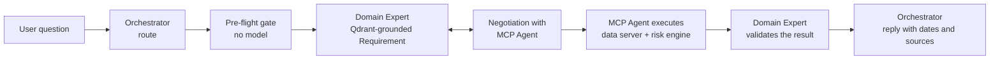
```mermaid
flowchart LR
    Q["User question"] --> O["Orchestrator<br/>route"] --> G["Pre-flight gate<br/>no model"] --> D["Domain Expert<br/>Qdrant-grounded Requirement"]
    D <--> N["Negotiation with<br/>MCP Agent"]
    N --> X["MCP Agent executes<br/>data server + risk engine"]
    X --> V["Domain Expert<br/>validates the result"] --> R["Orchestrator<br/>reply with dates and sources"]
```

### 1.1 What the name means

| Word | What it means here |
|---|---|
| **Semantic** | The system interprets the intent against a real knowledge corpus in a vector store before it touches data. The row count for a VaR window must be a *verbatim quote* from a retrieved document, or the system discards it |
| **MCP** | The Model Context Protocol is the **only** road from the reasoning layer to the data. Two stdio MCP servers publish tools, resources and prompts. Nothing above them holds a database credential |
| **Data Access** | The output is not text about data. It is a bounded dataset with provenance, and a deterministic calculation over it |
| **Gateway** | One front door (`POST /chat`), one agent that faces the user, and enforced boundaries behind it |

### 1.2 What makes the MCP implementation different

A plain tool-call loop does not do these three things:

1. **All six MCP primitives are live.** This includes the three that go from server to client during a call (elicitation, roots and sampling). When `'30 year'` matches both a nominal and a real series, the data server *asks a question back*. It does not select one.
2. **The tool surface is read live, not declared.** With `DATA_BACKEND=mock`, the risk tools are not connected, and the planner never sees a capability that it cannot reach.
3. **The advertised capability set is smaller than the protocol surface, on purpose.** The risk server registers **42** tools. The domain expert gets **30 executable + 4 informational** capabilities. Each extra entry that is almost a duplicate makes a planner under uncertainty worse, not better.

### 1.3 Why unrestricted database retrieval is a problem here

| Failure mode | What occurs |
|---|---|
| Rows with no limit | A nominal curve history is 9,159 dates × 14 tenors. In a prompt, that is more than 100,000 numbers, and no model needs to *see* them to reason |
| Lost quote basis | A bill discount rate (act/360) and a par coupon yield are different quantities. As bare numbers, they look the same, and at some time they share a curve |
| Thresholds with no grounding | "VaR uses 250 days", recalled from training, cannot be checked. You cannot change it by an edit to a document, and you cannot audit it by a read of a document |
| No refusal path | A model that gets a table always answers *something*. CVA needs counterparty exposures that this system does not hold. The honest answer is "I do not have that" |
| Privilege | An agent process with the owner credential is one bug away from a write to the source of record |

### 1.4 How the domain expert limits retrieval before the fetch

```
question
  -> pre-flight completeness gate   (regex + lexicon, sub-millisecond, no model call)
  -> two Qdrant retrievals          (executable contract + reference library)
  -> Requirement                    (fields, rows, tenors, curve family, window, calculation, params)
  -> every figure quoted verbatim, and the quote verified against the retrieved text
  -> negotiated against what the data layer can actually serve
  -> only then: fetch
```

Each stage can **stop** the turn:

- The gate stops a question that misses an input for which no default is honest.
- The grounding check discards a row count that the corpus does not state.
- The negotiation returns `UNSUPPORTED` when the source cannot serve the plan.

### 1.5 The architecture in one paragraph

A user asks a question in a React chat interface.
The request goes to a FastAPI service. The service is the *user boundary*, and it sends exactly one A2A message to an **Orchestrator** agent.
The orchestrator routes the turn. For a real data request, it delegates to a **Domain Expert** agent.
The domain expert grounds an analytical requirement in two Qdrant collections.
It then *negotiates* that requirement, over A2A and in a bounded loop, with an **MCP Agent** that owns the tool surface.
When both agree, the MCP agent executes the plan through the `DataProvider` seam into two stdio **MCP servers**.
One is a data server that reads PostgreSQL as the restricted role `mcp_reader`. The other is a risk engine that holds no database credential.
The orchestrator writes the final reply under explicit honesty rules.
An optional **Redis** layer keeps validated specialist work and records operational evidence.
**LangSmith** traces each agent boundary and fails open.
A Server-Sent Events stream reports what the agents do while they do it.

---

## 2. How SMCP Gateway is built

### 2.1 System context


```mermaid
flowchart TB
    U(["User"])

    subgraph UI["Browser - smcp-gateway-ui"]
        R["React 18 + Vite + Tailwind<br/>Zustand stores"]
    end

    subgraph SVC["FastAPI service :8000 - the user boundary"]
        API["POST /chat, /summarise<br/>GET /health, /chat/stream/id<br/>/trace/id, /langsmith/trace/id"]
        MOUNT["Mounted A2A endpoints<br/>/a2a/orchestrator<br/>/a2a/domain-expert<br/>/a2a/mcp-agent"]
    end

    subgraph AG["Agent tier - gateway-agents"]
        ORCH["Orchestrator<br/>routes, reflects<br/>the only agent a user reaches"]
        DE["Domain Expert<br/>grounds the requirement"]
        MA["MCP Agent<br/>owns the tool surface"]
    end

    subgraph MCPL["MCP tier - stdio child processes"]
        DS["market-risk-data-mcp<br/>14 tools, 5 resources, 3 prompts"]
        RS["risk-engine-mcp<br/>42 tools, 7 resources, 8 prompts"]
    end

    subgraph DATA["Stores"]
        PG[("PostgreSQL 17<br/>267,517 observations")]
        QD[("Qdrant<br/>quant_knowledge<br/>market_risk_kb")]
        RD[("Redis 8.8<br/>optional, fail-open")]
    end

    LLM["ModelProvider seam<br/>Z.AI GLM-5.2 default<br/>Anthropic alternative"]
    LS["LangSmith<br/>optional, fail-open"]

    U --> R
    R -->|"HTTPS JSON"| API
    API -->|"A2A handle_user_turn"| ORCH
    ORCH <-->|"A2A"| DE
    ORCH <-->|"A2A"| MA
    DE <-->|"A2A negotiation"| MA
    DE --> QD
    MA -->|"DataProvider seam"| DS
    MA --> RS
    DS -->|"as mcp_reader"| PG
    ORCH -.-> LLM
    DE -.-> LLM
    MA -.-> LLM
    DE -.-> RD
    MA -.-> RD
    AG -.-> LS
    MOUNT -.-> AG
    API -->|"SSE progress"| R
```

The table gives each block, its caller and its behaviour when it fails.

| Block | What it is | Who calls it | Behaviour on failure |
|---|---|---|---|
| **React UI** | `frontend/`, an npm package that Vite runs in place. It calls only `/chat`, `/summarise`, `/health`, `/chat/stream/{id}`, `/trace/{id}` and `/langsmith/trace/{id}` | The human | The chat shows the network error. The SSE stream is only a view. If it stops, the answer does not change |
| **FastAPI service** | `backend/src/backend/api/service.py`. It owns the session memory, CORS and the `user-boundary` identity | The browser | `502` with `agent error: …` for an unexpected exception. A specialist failure becomes a sentence, never a stack trace |
| **Orchestrator** | `agents/orchestrator_agent.py` + `agents/pipeline.py`. Its card is the only card that admits `user-boundary` | The service, over A2A | It routes the turn to a reply that states the reason |
| **Domain Expert** | `agents/domain_expert_agent.py`. The only agent that reads Qdrant | The orchestrator, over A2A | The turn reports that the requirement is not established. Nothing is fetched |
| **MCP Agent** | `agents/mcp_agent.py`. The only agent with a road to the data | The orchestrator and the domain expert, over A2A | The turn reports that the data layer cannot complete. No figure is substituted |
| **MCP servers** | `mcp/src/mcp_servers/{data,risk}/server.py`. The host starts them as stdio child processes | `McpDataProvider` | A tool error becomes a structured MCP error, which the user sees as a refusal |
| **PostgreSQL** | The source of record. Only the data server reaches it, as `mcp_reader` | `market-risk-data-mcp` | A connection failure gives "part of the gateway is not reachable" |
| **Qdrant** | Two collections of domain knowledge | The domain expert only | If retrieval returns nothing, the turn reports that the corpus is silent. No default is invented |
| **Redis** | Derived memory. It is never the authority | The domain expert and the MCP agent | A failure is a cache miss, unless `REDIS_REQUIRED=true` |
| **LangSmith** | The trace sink | Each agent boundary | The function runs with no trace |

### 2.2 Technology stack

All versions in this table come from the package manifests.

| Layer | Technology | Responsibility |
|---|---|---|
| Frontend | React 18.3 · Vite 5.4 · TypeScript 5.7 · Tailwind 3.4 · Zustand 5 · `@xyflow/react` 12.3 · `react-markdown` 9 | Chat, artifact panel, execution graph, trace view and latency view |
| Frontend tests | Vitest 2.1 · Testing Library · jsdom | Unit tests for components and library modules |
| API | FastAPI ≥0.110 · Uvicorn ≥0.29 · Pydantic v2 | `/chat`, `/summarise`, `/health`, the SSE stream and the trace endpoints |
| Agent runtime | Python 3.11+ · distribution `gateway-agents` | Three agents, the pipeline, the planner, the guardrails and the events |
| Agent protocol | **A2A**: `a2a-sdk` ≥1.1.2, protocol revision 1.0 | Tasks, cards, artifacts and the task life cycle between agents |
| Tool protocol | **MCP**: `mcp` ≥2.0.0, protocol revision **2026-07-28** | Tools, resources, prompts, elicitation, roots and sampling |
| Primary LLM | **`glm-5.2`** through the Z.AI OpenAI-compatible API (`LLM_BACKEND=zai`, the default) | All five call sites |
| Alternative LLM | `claude-haiku-4-5` (orchestrator) + `claude-opus-5` (all other call sites) with `LLM_BACKEND=anthropic` | Maintained. See [Known problems](#31-known-problems) for a current limit |
| Structured output | `jsonschema` ≥4.20 with a strict type checker | Schema and type validation of each model object |
| Relational data | PostgreSQL 17 (`postgres:17-alpine`) · `psycopg2-binary` | Treasury observations, series meanings, lineage and the demo book |
| Vector data | Qdrant (`qdrant/qdrant:latest`) · `qdrant-client[fastembed]` ≥1.12 | Two knowledge collections |
| Embeddings | **`BAAI/bge-small-en-v1.5`** with FastEmbed, local, 384 dimensions, cosine | Chunk and query embeddings. No external embedding API |
| Cache and coordination | Redis 8.8.2 · `redis` ≥8.0.1,<9 · RedisInsight | Cache of validated specialist work, single-flight locks, rate limits, evidence in Streams and TimeSeries |
| Observability | LangSmith ≥0.2 · the in-process `EventBus` (SSE) | Distributed traces. A live execution stream that does not need LangSmith |
| Source data | `requests` ≥2.31 against the Treasury XML feed | Five daily interest-rate datasets |
| Lint | Ruff ≥0.4, line length 100, target py311 | — |
| Tests | pytest ≥8.0 · `responses` ≥0.25 | 867 Python test functions in 42 files (1,835 collected tests at the audit commit) |

### 2.3 Repository layout

The repository root holds five installable Python distributions and one npm package.
The dependencies go **only downward**. `llm/` imports nothing above it.
For this reason, `python -m mcp_servers.host --ask` runs with no backend, no Qdrant and no UI.

```
semantic-mcp-data-access-gateway/
├── agents/                     gateway-agents      — the three runtime agents
│   ├── a2a/                    protocol boundary (the ONLY place a2a.types is imported)
│   ├── cache/                  Redis intelligence (13 modules)
│   ├── orchestrator_agent.py   agent 1
│   ├── domain_expert_agent.py  agent 2
│   ├── mcp_agent.py            agent 3
│   ├── pipeline.py             the orchestrator's own workflow
│   ├── planning.py             the bounded negotiation, over DataLayerPort
│   ├── preflight.py            the requirement completeness gate
│   ├── contracts.py            the dataclasses agents exchange
│   ├── events.py               live execution EventBus (SSE source)
│   ├── answer_builder.py       the reply, as typed sections
│   ├── observability.py        LangSmith instrumentation
│   └── redaction.py            identifier scrubbing at user-facing exits
├── backend/                    gateway-backend     — service, seams, workflows
│   └── src/backend/
│       ├── api/service.py      FastAPI: /chat, /summarise, /health, SSE, trace
│       ├── api/langsmith_reader.py  server-side trace read-back
│       ├── knowledge/          KnowledgeBase, MarketRiskKnowledgeBase, chunker, VectorStore
│       ├── providers/          DataProvider seam: mcp | postgres | mock
│       └── workflows/risk_workflows.py  deterministic marshalling into the risk engine
├── llm/                        gateway-llm         — the ModelProvider seam
│   └── src/llm/                base · config · contracts · factory · validation
│                               anthropic_provider · zai_provider
├── mcp/                        mcp-servers         — two stdio servers + the host
│   └── src/mcp_servers/
│       ├── data/               market-risk-data-mcp  (PostgreSQL, as mcp_reader)
│       ├── risk/               risk-engine-mcp       (no DB credential at all)
│       └── host/               the client that launches and drives both
├── postgres/                   treasury-db         — migrations, loader, DB access
│   ├── migrations/             V001 … V013
│   └── src/treasury_db/        migrate · load · db · paths
├── frontend/                   smcp-gateway-ui     — React + Vite + TS + Tailwind
├── data/                       source of record + the acquisition that fills it
│   ├── acquisition/            download_us_treasury.py
│   ├── processed/us_treasury/  five validated CSVs
│   └── metadata/us_treasury/   manifests, schema report, verification reports
├── knowledge/                  RAG corpus → Qdrant `quant_knowledge` (11 docs, 4 domains)
├── docs/                       design docs + market-risk-kb/ → Qdrant `market_risk_kb` (47 docs)
│   └── ste-style-guide.md      writing rules and project vocabulary of this README
├── evaluation/                 13 cases × 11 scorers
├── tests/                      Python tests (42 files)
├── tools/                      setup.py · verify_load.py · verify_mcp.py
├── .claude/                    Claude Code CONFIGURATION ONLY — never product code
├── docker-compose.yml          postgres · qdrant · redis · redis-insight · agent
├── Dockerfile                  backend image (stale, see Known problems)
├── requirements.txt            pinned floors for every layer
├── .env.example                the full configuration reference
├── AGENTS.md · CLAUDE.md       agent-architecture and repo-instruction docs
└── README.md                   this document
```

> [!NOTE]
> `docker-compose.yml` mounts `db/init/` as the PostgreSQL init folder. The folder is empty, so git does not track it. A clone does not contain it.

The table gives the responsibility of each folder.

| Path | Type | Responsibility | Important contents | Used by |
|---|---|---|---|---|
| `llm/` | Python distribution `gateway-llm` | The `ModelProvider` seam. It imports **nothing** above it | `base.py`, `config.py`, `validation.py`, `zai_provider.py`, `anthropic_provider.py` | Agents, MCP host |
| `agents/` | Python distribution `gateway-agents` | The three runtime agents, the A2A protocol boundary, the negotiation, the Redis layer, observability | `orchestrator_agent.py`, `domain_expert_agent.py`, `mcp_agent.py`, `a2a/`, `cache/` | Backend service, evaluation |
| `postgres/` | Python distribution `treasury-db` | Schema, forward-only migrations, generic loader, `.env` reader | `migrations/V001…V013`, `load.py`, `migrate.py` | MCP data server, verification tools |
| `mcp/` | Python distribution `mcp-servers` | Both MCP servers, the host and client, the curve and risk mathematics | `data/`, `risk/` (30 modules), `host/` | `McpDataProvider`, CLI demos |
| `backend/` | Python distribution `gateway-backend` | The `/chat` service, the seams, the knowledge layer, the deterministic risk workflows | `api/service.py`, `knowledge/`, `providers/`, `workflows/` | Frontend, evaluation |
| `frontend/` | npm package `smcp-gateway-ui` | The React application | `src/components/` (26), `src/lib/` (15), `src/store/` (3) | The human |
| `data/` | Data | The source of record and its acquisition | `acquisition/`, `processed/`, `metadata/` | Loader, verification |
| `knowledge/` | Corpus | The executable analytical contracts | 11 Markdown documents in 4 domain subfolders | Qdrant `quant_knowledge` |
| `docs/market-risk-kb/` | Corpus | The reference library | 47 Markdown documents | Qdrant `market_risk_kb` |
| `evaluation/` | Harness | 13 cases × 11 scorers, offline or in LangSmith | `dataset.py`, `evaluators.py`, `run.py`, `judge.py` | Quality gate (no CI) |
| `tools/` | Scripts | The setup and the two verification gates | `setup.py`, `verify_load.py`, `verify_mcp.py` | Checks before a pull request |
| `.claude/` | Configuration | Claude Code agents, rules, skills and settings | 7 subagents, 5 rules, 5 skills | Development only |

Two layout rules apply:

- **The MCP package name is `mcp_servers`, not `mcp`.** The name `mcp` belongs to the MCP SDK on PyPI. A package with the same name hides the SDK, and each server then stops with an import error that looks like a damaged installation.
- **No code changes `sys.path`.** Each distribution has a `paths.py` that finds the repository root. It goes up the folders until it finds a marker file. It never counts `parents[N]`, because the five packages are at five depths and a count is wrong when a file moves.

### 2.4 File-by-file reference

The tables list only the important source, configuration and test files. They exclude generated content, `node_modules/`, caches and `data/raw/`.

#### 2.4.1 `llm/` — the model seam

| File | Purpose | Key classes and functions | Called by | Depends on |
|---|---|---|---|---|
| `llm/src/llm/base.py` | The `ModelProvider` Protocol. Three operations cover each model call | `ModelProvider` (`structured_call`, `tool_turn`, `complete`, `assistant_message`, `tool_result_message`) | Each agent, MCP host | `llm.contracts` |
| `llm/src/llm/config.py` | Reads the environment **one time**. Model and token floor for each call site | `ModelConfig`, `load_config()`, `_DEFAULT_MODELS`, `_MIN_TOKENS`, `_load_dotenv()` | `factory.py` | Standard library only |
| `llm/src/llm/contracts.py` | Types that do not depend on a vendor | `CallSite` enum, `ModelReply`, `ToolCall`, `ToolSpec`, `ProviderError`, `SchemaViolation` | All of `llm/` | — |
| `llm/src/llm/factory.py` | One line for each provider. `LLM_BACKEND` selects the provider | `make_model_provider()`, `provider_status()` | Agents, host | Both providers |
| `llm/src/llm/validation.py` | **Strict** schema and type validation. It redefines `integer` as a Python `int` | `validate_against_schema()`, `strictened()`, `normalise_nullables()`, `StrictValidator` | Both providers | `jsonschema` |
| `llm/src/llm/zai_provider.py` | GLM through the OpenAI-compatible API of Z.AI. It uses a **forced function call**, not `response_format` | `ZaiProvider`, `sanitise_arguments()`, `_recover_templated_call()`, `_close_unbalanced()` | `factory.py` | `openai` SDK |
| `llm/src/llm/anthropic_provider.py` | The Claude Messages API. Adaptive thinking and `effort` change with the model | `AnthropicProvider`, `_LOW_EFFORT` | `factory.py` | `anthropic` SDK |

#### 2.4.2 `agents/` — the runtime agents

| File | Purpose | Key classes and functions | Called by | Depends on |
|---|---|---|---|---|
| `agents/orchestrator_agent.py` | Agent 1. Routing and reflection. The only voice that the user hears | `OrchestratorAgent.classify / ground_options / reflect / summarise_session`, `CLASSIFY_SCHEMA`, `REFLECT_SCHEMA` | `OrchestratorExecutor`, `AgentPipeline` | `llm`, `agents.observability` |
| `agents/domain_expert_agent.py` | Agent 2. Requirement derivation from Qdrant, revision and result validation | `DomainExpertAgent.retrieve / retrieve_market_risk / derive / revise / validate_result`, `quote_is_grounded()`, `SCHEMA`, `REVISE_SCHEMA` | `DomainExpertExecutor` | `llm`, Qdrant, `agents.cache` |
| `agents/mcp_agent.py` | Agent 3. Live capability catalogue, assessment and execution | `McpAgent.catalogue / choices / assess / execute / _calculate`, `TENOR_MONTHS`, `MAX_DISPLAY_ROWS` | `McpAgentExecutor` | `DataProvider`, `RiskWorkflows`, `llm` |
| `agents/pipeline.py` | The workflow of the orchestrator: route → gate → derive → execute → validate → reply | `AgentPipeline.handle / resume / _data_request / _compose / _not_agreed / _relay_question`, `VALIDATED_CALCULATIONS` | `OrchestratorExecutor` | `agents.a2a`, `answer_builder`, `events` |
| `agents/planning.py` | The rules of the negotiation, against a port with no transport | `DataPlanner.plan()`, `DataLayerPort`, `MAX_NEGOTIATION_ROUNDS=5`, `MAX_UNCHANGED_ROUNDS=2` | Domain expert path | `agents.contracts` |
| `agents/preflight.py` | Deterministic completeness gate. Regular expressions and a lexicon, no model, no vectors | `assess()`, `extract()`, `classify_intent()`, `CompletenessVerdict`, `MissingField`, `FieldSpec` | `DomainExpertExecutor` | Standard library only |
| `agents/contracts.py` | Each dataclass that the agents exchange | `Requirement`, `ToolCatalogue`, `ToolSpec`, `ServeResponse`, `Negotiation`, `ResultValidation`, `Intent`, `TemporalScope`, `AgentOutcome`, `KnowledgeChunk`, `FieldNote` | All agents | Standard library only |
| `agents/answer_builder.py` | Puts the reply into typed sections from facts that the turn already has | `build()`, `_SHAPES`, `_metrics_from()`, `_caveats()`, `_methodology()` | `AgentPipeline` | — |
| `agents/events.py` | The live execution `EventBus`, a bounded history for each run, the latency report | `EventType` (24 values), `emit()`, `bus()`, `timeline()`, `latency_report()`, `safe_metadata()`, `RUN_CAPACITY=64`, `EVENTS_PER_RUN=600` | Each agent, `/chat/stream` | Standard library only |
| `agents/observability.py` | LangSmith instrumentation. Each agent boundary is a run | `traced()`, `span()`, `structured_call()`, `langsmith_status()`, `current_trace_headers()`, `continue_trace()`, `app_metadata()` | All agents | `langsmith` (optional) |
| `agents/redaction.py` | Removes internal identifiers from the text that the user sees | `scrub_identifiers()`, `humanise()`, `contains_sensitive_data()`, `redact_sensitive()`, `MCP_IMPLEMENTATION_NAMES`, `CONTRACT_KEYS` | `AgentPipeline`, `agents.cache` | — |

#### 2.4.3 `agents/a2a/` — the protocol boundary

| File | Purpose | Key contents |
|---|---|---|
| `identity.py` | The names and the addresses of the agents | `AgentId` (3 members), `MOUNT_PATHS`, `transport_mode()`, `base_url()`, `card_url()`, `AGENT_VERSION="1.0.0"` |
| `cards.py` | The Agent Cards, which are the contract | `ORCHESTRATOR_SKILLS` (3), `DOMAIN_EXPERT_SKILLS` (3), `MCP_SKILLS` (5), `IDEMPOTENT_TAG` |
| `executors.py` | One `AgentExecutor` for each agent, caller allow-lists, dispatch to worker threads | `OrchestratorExecutor`, `DomainExpertExecutor`, `McpAgentExecutor`, `BaseAgentExecutor`, `ExecutionContext`, `active_execution()`, `USER_BOUNDARY` |
| `guardrails.py` | Five bounds, in code | `CallChain`, `TurnLedger`, `LedgerRegistry`, `DEFAULT_MAX_CHAIN=8`, `DEFAULT_MAX_REENTRY=3`, `DEFAULT_MAX_HANDOFFS=20`, `DEFAULT_TURN_TIMEOUT_S=900` |
| `envelope.py` | Typed artifacts on the wire, integer coercion | `SkillResult`, `ARTIFACT_*` constants, `requirement_from_dict()`, `restore_counts()`, `COUNT_KEYS` |
| `client.py` | The call to a peer, in-process ASGI or HTTP | `AgentLink.call()`, `dispatch()` |
| `runtime.py` | Builds the network and the thread of its event loop | `AgentNetwork`, `get_network()` |
| `server.py` | Mounts the JSON-RPC app and the card of each agent on FastAPI | `mount()` |
| `ports.py` | The A2A implementation of `DataLayerPort` | `A2ADataLayer` |
| `elicitation.py` | Clarification through the orchestrator, with a bound | `match_answer()`, `is_refusal()`, `is_domain_material()`, `DOMAIN_MATERIAL_FIELDS`, `DEFAULT_MAX_CLARIFICATION_RETRIES=3` |

#### 2.4.4 `agents/cache/` — the Redis intelligence

| File | Purpose |
|---|---|
| `config.py` | `RedisConfig.from_env()`. Each TTL, threshold and limit in one dataclass |
| `client.py` | `RedisConnection`. A connection pool that fails open, unless `REDIS_REQUIRED` is set |
| `factory.py` | `get_intelligence()`. One instance for the process. `NoOpIntelligence` when Redis is off |
| `service.py` | `RedisIntelligence`. The full surface: `cached`, `allow_llm`, `observed`, `record_llm_call`, `complete_run`, `health`, `clear` |
| `policies.py` | `policy_for(agent, operation, config)`. The cacheability matrix. **Execution is not in it, by design** |
| `keys.py` | `KeyBuilder`. Each shape of namespaced key in one location |
| `fingerprints.py` | `canonical_question()`, `analytical_signature()`, `catalogue_fingerprint()`, `model_identity()`, `is_semantic_cache_reuse_safe()` |
| `serialization.py` | `CacheRequest`, `build_envelope()`, `validate_envelope()`, `load_result()` |
| `locks.py` | `RedisSingleFlight`. The lock checks the owner and releases atomically |
| `rate_limit.py` | `RedisRateLimiter`. Fixed-window limits with the Redis 8.8 command `INCREX` |
| `telemetry.py` | Streams, TimeSeries, counters, question frequency |
| `versions.py` | Prompt and schema version constants. Each key contains them |
| `admin.py` | Cache clear by scope |

#### 2.4.5 `backend/` — service, seams, knowledge and workflows

| File | Purpose | Key contents |
|---|---|---|
| `api/service.py` | The FastAPI app and the user boundary | `/chat`, `/summarise`, `/health`, `/chat/stream/{id}`, `/trace/{id}`, `/langsmith/trace/{id}`, `ChatRequest`, `ChatResponse`, `_sessions`, CORS, `mount_a2a_agents()` |
| `api/langsmith_reader.py` | Reads a trace back on the server and removes the payloads | `fetch_trace()`, the `_SAFE_FIELDS` allow-list, `MAX_RUNS=500` |
| `knowledge/vector_store.py` | The `VectorStore` seam and its Qdrant implementation | `VectorStore` Protocol, `QdrantVectorStore`, `Hit`, `make_vector_store()`, `EMBED_MODEL="BAAI/bge-small-en-v1.5"` |
| `knowledge/knowledge_base.py` | The `quant_knowledge` corpus. Chunks split at headings | `KnowledgeBase.ingest / retrieve / count`, `_chunk_markdown()`, `_iter_chunks()` |
| `knowledge/market_risk_kb.py` | The `market_risk_kb` corpus. Chunks follow the heading hierarchy and obey a token budget | `MarketRiskKnowledgeBase`, `COLLECTION`, `chunk_payload()`, `chunk_id()`, `discover()`, `IngestReport` |
| `knowledge/markdown_chunker.py` | A pure chunker with no I/O and a hard token budget | `chunk_document()`, `parse_blocks()`, `MODEL_LIMIT=512`, `MAX_TOKENS=460`, `TARGET_TOKENS=400`, `OVERLAP_TOKENS=60` |
| `knowledge/versioning.py` | The content identity that goes into the cache keys | `corpus_version()` |
| `providers/base.py` | The `DataProvider` seam and the mock implementation | `DataProvider` Protocol, `MockDataProvider`, `make_data_provider()`, `NOMINAL_TENORS`, `REAL_TENORS` |
| `providers/mcp.py` | The full-stack provider: one warm event loop and two warm child processes | `McpDataProvider`, `call_tool()`, `_span()` |
| `providers/postgres.py` | Direct psycopg2 as the owner role. It goes around the privilege boundary | `PostgresDataProvider` |
| `workflows/risk_workflows.py` | Deterministic marshalling into the risk engine. It **calculates nothing** | `RiskWorkflows` with more than 40 methods (`price_portfolio`, `compute_dv01`, `compute_var`, `run_stress`, `run_historical_stress`, `compute_frtb_girr`, and others) |
| `paths.py` | Finds the repository root by a marker | `KNOWLEDGE_DIR`, `MARKET_RISK_KB_DIR` |

#### 2.4.6 `mcp/` — the MCP layer

| File | Purpose |
|---|---|
| `data/server.py` | `market-risk-data-mcp`: 14 tools, 5 resources, 3 prompts |
| `data/repository.py` | Each SQL statement of the data server. They read only the `analytics.*` views |
| `data/_db.py` | The connection as `mcp_reader`. `snapshot_id()` |
| `data/contracts.py` | Typed results: `CurveResult`, `RateHistoryPage`, `PortfolioSnapshot`, `ProvenancedObservation`, and others |
| `data/cursor.py` | Signed pagination cursors that stay valid after a restart (`MCP_CURSOR_KEY`) |
| `data/interactive.py` | The three server-to-client primitives: `resolve_rate_kind` (Elicit), `resolve_export_roots` (ListRoots), `resolve_caveat_briefing` (Sample) |
| `data/errors.py` | Structured errors with a code and a remedy |
| `data/bootstrap.py` | Applies the `mcp_reader` password one time |
| `risk/server.py` | `risk-engine-mcp`: 5 tools in the file + 37 tools from five modules. 7 resources, 8 prompts |
| `risk/tools_analytics.py` | 6 tools: bond analytics, carry and roll, curve analytics, volatility, sensitivities, contributions |
| `risk/tools_stress.py` | 11 tools: parallel, key-rate, twist, curvature, ladder, matrix, comparison, attribution, explanation, concentration, severity pack |
| `risk/tools_historical.py` | 6 tools: replay, crisis catalogue, worst-window search, reverse stress, thresholds, limit-breach search |
| `risk/tools_distribution.py` | 8 tools: parametric, Monte Carlo, extreme tail, volatility regime, correlation, method comparison, backtest, P&L attribution |
| `risk/tools_portfolio.py` | 6 tools: concentration, limits, portfolio comparison, hypothetical trade, hedge analysis, FRTB GIRR |
| `risk/curves.py`, `pricing.py`, `risk.py`, `sensitivities.py`, and others | The mathematics: bootstrapped discount curve, pricing, DV01, VaR and ES, stress, attribution, FRTB constants |
| `risk/manifest.py` | `MODEL_MANIFEST`. The versions and each numerical convention, published as a resource |
| `host/mcp_clients.py` | Starts both servers as stdio children. It calls **`session.discover()`, never `initialize()`** |
| `host/primitives.py` | The MRTR retry loop. The callers do not see elicitation, roots or sampling |
| `host/agent.py` | A separate, smaller tool-call loop to test MCP alone (`MAX_STEPS=24`) |
| `host/demo.py`, `host/__main__.py` | `--demo`, `--tools`, `--isolation`, `--primitives`, `--ask`, `--interactive` |

#### 2.4.7 `postgres/`, `data/`, `tools/` and `evaluation/`

| File | Purpose |
|---|---|
| `postgres/migrations/V001…V013` | Forward-only schema changes with a checksum guard (see [12](#12-the-postgresql-database)) |
| `postgres/src/treasury_db/migrate.py` | The migration runner. `--status` reports the pending migrations |
| `postgres/src/treasury_db/load.py` | The generic loader: `LOAD_SPECS`, staging `COPY`, generic unpivot, the guard for unmapped columns |
| `postgres/src/treasury_db/db.py` | `connect()`, `load_dotenv()` |
| `data/acquisition/download_us_treasury.py` | The client of the Treasury XML feed. Five `DatasetSpec` objects. It never hard-codes a field list |
| `tools/setup.py` | Setup from end to end in seven steps. `--check` reports the state and changes nothing |
| `tools/verify_load.py` | 74 checks. It **counts each expected value again from the CSVs**. `--self-test` puts a known error into the data |
| `tools/verify_mcp.py` | 48 checks against real child processes. It must catch 4 canaries |
| `evaluation/dataset.py` | The 13 cases |
| `evaluation/evaluators.py` | The 11 scorers |
| `evaluation/run.py` | Runs the cases offline or sends them to LangSmith |
| `evaluation/judge.py` | Support for the LLM-as-judge scorer |

#### 2.4.8 `frontend/` — 26 components, 15 library modules, 3 stores

| File | Purpose |
|---|---|
| `src/App.tsx` | Layout: header, market strip, sidebar, chat window, right rail, status bar |
| `src/config.ts` | `getSettings()`: `VITE_AGENT_BACKEND`, `VITE_AGENT_API_URL`, `VITE_AGENT_TIMEOUT_SECONDS` (default **960**) |
| `src/api/client.ts` | `askAgent()`, `summariseSession()`, `AgentClientError`. Maps the `/chat` payload to `ChatMessage` |
| `src/api/health.ts` | Reads `/health`, so that the header shows the real backend status |
| `src/api/executionStream.ts` | `newRequestId()`, `openExecutionStream()` (an EventSource on `/chat/stream/{id}`), `/trace/{id}`, `/langsmith/trace/{id}` |
| `src/api/mockFixtures.ts` | Fixed answers when `VITE_AGENT_BACKEND=mock` |
| `src/hooks/useSend.ts` | The turn: select the id → subscribe → post. It gives a session a title after 300 s or 6 turns |
| `src/hooks/useHealth.ts` | Polls `/health` |
| `src/store/chatStore.ts` | Chats, messages, pending state, reference to the artifact panel |
| `src/store/executionStore.ts` | The events of the live run |
| `src/store/themeStore.ts` | Light or dark theme |
| `src/components/ChatWindow.tsx`, `MessageBubble.tsx`, `ChatInput.tsx` | The conversation |
| `src/components/StructuredAnswer.tsx` | Shows the `structured` section document |
| `src/components/RightRail.tsx`, `ReasoningRail.tsx`, `ArtifactPanel.tsx`, `ArtifactCard.tsx` | Data plan, negotiation, catalogue, tables |
| `src/components/ExecutionView.tsx`, `GraphView.tsx`, `LatencyView.tsx`, `TraceView.tsx` | Live execution, the handoff graph, the latency breakdown, the LangSmith span tree |
| `src/components/ElicitationPrompt.tsx` | Clarification options that the user can click |
| `src/components/CurveChart.tsx`, `DataTable.tsx`, `MarketSnapshotStrip.tsx` | Result views |
| `src/lib/executionEvents.ts`, `executionGraph.ts`, `graphLayout.ts` | Change from events to a graph |
| `src/lib/trace.ts`, `artifact.ts`, `classification.ts`, `elicitation.ts`, `marketSnapshot.ts` | Pure helpers. Each one has a `.test.ts` file next to it |

#### 2.4.9 Tests

[Validation results](#30-validation-results) gives the full test matrix. The Python suite has 42 files under `tests/`.

### 2.5 Detailed system architecture

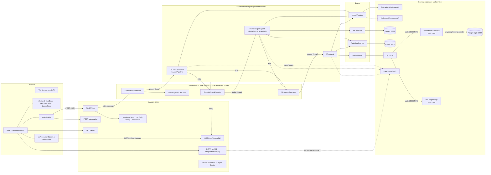
```mermaid
flowchart LR
    subgraph BROWSER["Browser"]
        direction TB
        VITE["Vite dev server :5173"]
        RC["React components (26)"]
        ZS["Zustand: chatStore · executionStore · themeStore"]
        AC["api/client.ts"]
        ES["api/executionStream.ts<br/>EventSource"]
        RC --- ZS
        RC --- AC
        RC --- ES
    end

    subgraph FASTAPI["FastAPI :8000"]
        direction TB
        CH["POST /chat"]
        SM["POST /summarise"]
        HL["GET /health"]
        STR["GET /chat/stream/{id}"]
        TR["GET /trace/{id} · /langsmith/trace/{id}"]
        SESS["_sessions: turns · clarified · waiting · clarification"]
        A2AMOUNT["/a2a/* JSON-RPC + Agent Cards"]
    end

    subgraph NET["AgentNetwork (one asyncio loop on a daemon thread)"]
        direction TB
        LEDGER["TurnLedger + CallChain"]
        OEX["OrchestratorExecutor"]
        DEX["DomainExpertExecutor"]
        MEX["McpAgentExecutor"]
    end

    subgraph AGENTS["Agent domain objects (worker threads)"]
        direction TB
        O["OrchestratorAgent<br/>+ AgentPipeline"]
        D["DomainExpertAgent<br/>+ DataPlanner + preflight"]
        M["McpAgent"]
    end

    subgraph SEAMS["Seams"]
        direction TB
        MP["ModelProvider"]
        DP["DataProvider"]
        VS["VectorStore"]
        RI["RedisIntelligence"]
    end

    subgraph EXT["External processes and services"]
        direction TB
        ZAI["Z.AI api.z.ai/api/paas/v4"]
        ANT["Anthropic Messages API"]
        QDRANT[("Qdrant :6333")]
        REDIS[("Redis :6379")]
        HOST["McpHost"]
        DSRV["market-risk-data-mcp<br/>stdio child"]
        RSRV["risk-engine-mcp<br/>stdio child"]
        PGDB[("PostgreSQL :5432")]
        LSMITH["LangSmith SaaS"]
    end

    AC -->|"POST JSON"| CH
    AC --> SM
    ES -->|"GET text/event-stream"| STR
    RC --> HL
    RC --> TR

    CH --> SESS
    CH -->|"A2A message"| OEX
    OEX --> LEDGER
    OEX -->|"worker thread"| O
    O -->|"A2A"| DEX
    O -->|"A2A"| MEX
    DEX -->|"worker thread"| D
    MEX -->|"worker thread"| M
    D -->|"A2A"| MEX

    O --> MP
    D --> MP
    M --> MP
    MP --> ZAI
    MP -.-> ANT

    D --> VS --> QDRANT
    D --> RI
    M --> RI
    RI --> REDIS

    M --> DP --> HOST
    HOST -->|"stdio JSON-RPC"| DSRV
    HOST -->|"stdio JSON-RPC"| RSRV
    DSRV -->|"psycopg2 as mcp_reader"| PGDB

    O -.->|"traced spans"| LSMITH
    D -.-> LSMITH
    M -.-> LSMITH
    TR -.->|"server-side read-back"| LSMITH
    AGENTS -.->|"emit()"| STR
```

#### 2.5.1 The connections

| # | Edge | Initiator | Payload | Protocol | Expected response | On failure |
|---|---|---|---|---|---|---|
| 1 | Browser → `POST /chat` | `useSend` | `{query, session_id, request_id?}` | HTTPS JSON, with a CORS gate | `ChatResponse` (16 fields) | `AgentClientError`. The browser stops after `VITE_AGENT_TIMEOUT_SECONDS` (960 s) |
| 2 | Browser → `GET /chat/stream/{id}` | `openExecutionStream`, **before** #1 | None | SSE (`text/event-stream`) | `event: event` frames, then `event: done` | Silent. The answer does not change |
| 3 | `/chat` → Orchestrator | FastAPI as `user-boundary` | Skill `handle_user_turn` + `{query, history, already_clarified, pending_clarification}` | A2A JSON-RPC (in-process ASGI by default) | A `Task` in state `completed`, with `ARTIFACT_OUTCOME` | A state that is not settled is a failure, never a success |
| 4 | Orchestrator → Domain Expert | `AgentPipeline._ask` | `check_requirement_completeness`, then `derive_data_requirement`, then `validate_result` | A2A | `ARTIFACT_COMPLETENESS`, `ARTIFACT_REQUIREMENT` + `ARTIFACT_CATALOGUE` + `ARTIFACT_NEGOTIATION`, `ARTIFACT_VALIDATION` | Gate failure: **the turn continues**. Derive failure: a reply that states the reason |
| 5 | Domain Expert → Qdrant | `_qdrant_search` | Embedded query vector, `limit`, optional payload filter | Qdrant HTTP or gRPC | `Hit[]` with `distance` | Empty result: the turn reports that the corpus is silent |
| 6 | Domain Expert → MCP Agent | `A2ADataLayer` | `describe_data_capabilities`, then `assess_data_requirement` in each round | A2A (nested, so the loop must stay free) | `ToolCatalogue`, `ServeResponse` | The round counts against the negotiation budget |
| 7 | Orchestrator → MCP Agent | `AgentPipeline._ask` | `execute_data_plan` with the agreed `Requirement` | A2A | `ARTIFACT_DATASET` + `ARTIFACT_CALCULATION` + `summary`, **or** the task state `input-required` | The orchestrator gives `input-required` to the user as one question |
| 8 | MCP Agent → `DataProvider` | `McpAgent._execute` | Typed method call (`get_yield_curve`, `get_rate_history`, and others) or `call_tool` | Python, synchronous | dicts | A provider exception becomes a structured error artifact |
| 9 | `McpDataProvider` → MCP host | Bridge | MCP `tools/call` | stdio JSON-RPC, protocol 2026-07-28 | `CallToolResult` (or `InputRequiredResult`) | The MRTR retry loop handles the three interactive primitives |
| 10 | Data server → PostgreSQL | `mcp_servers.data._db` | Parameterised SQL against `analytics.*` only | psycopg2 as `mcp_reader` | Rows | A connection error becomes an MCP error |
| 11 | Each agent → `ModelProvider` | `structured_call` / `tool_turn` / `complete` | System prompt + prompt + JSON Schema | HTTPS (Z.AI or Anthropic) | A **validated** object | One corrective retry with the output of the model. Then the violation stays |
| 12 | Agents → LangSmith | `@traced` / `span()` | Run tree with metadata and tags | LangSmith SDK | — | Fail-open: the function runs |
| 13 | Agents → `EventBus` | `events.emit` | Clean `{type, agent, title, status, duration_ms, …}` | In-process | — | `emit` cannot raise an exception |
| 14 | Agents → Redis | `RedisIntelligence.cached` | Namespaced key + envelope | RESP | Envelope or miss | Miss, unless `REDIS_REQUIRED=true` |

#### 2.5.2 The seams

A seam is an interface with more than one implementation. A setting selects the implementation.

| Seam | Implementations | Selected by | Location |
|---|---|---|---|
| `ModelProvider` | `ZaiProvider` · `AnthropicProvider` | `LLM_BACKEND` | `llm/factory.py` |
| `DataProvider` | `McpDataProvider` · `PostgresDataProvider` · `MockDataProvider` | `DATA_BACKEND` | `backend/providers/base.py` |
| `VectorStore` | `QdrantVectorStore` (server or embedded) | `QDRANT_URL` | `backend/knowledge/vector_store.py` |
| `RedisIntelligence` | `RedisIntelligence` · `NoOpIntelligence` | `REDIS_ENABLED` | `agents/cache/factory.py` |
| `DataLayerPort` | `A2ADataLayer` | — | `agents/a2a/ports.py` |
| A2A transport | In-process ASGI · HTTP | `A2A_TRANSPORT` | `agents/a2a/identity.py` |

`DataLayerPort` keeps the *rules* of the negotiation apart from the transport.
`agents/planning.py` holds the round limit and the convergence test.
It knows nothing about tasks, cards or protobufs.
For this reason, a unit test can check the round limit with no network.

---

## 3. Design rules

### 3.1 Constrain the retrieval before the fetch

The system is **not** this design:

```
User -> LLM -> unrestricted database -> dump
```

It is this design:

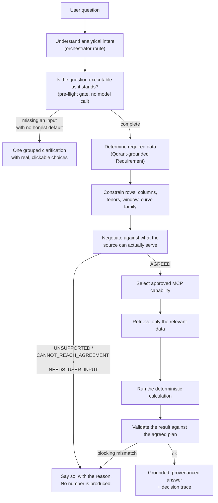
```mermaid
flowchart TD
    A["User question"] --> B["Understand analytical intent<br/>(orchestrator route)"]
    B --> C["Is the question executable as it stands?<br/>(pre-flight gate, no model call)"]
    C -->|"missing an input<br/>with no honest default"| C2["One grouped clarification<br/>with real, clickable choices"]
    C -->|"complete"| D["Determine required data<br/>(Qdrant-grounded Requirement)"]
    D --> E["Constrain rows, columns,<br/>tenors, window, curve family"]
    E --> F["Negotiate against what the<br/>source can actually serve"]
    F -->|"AGREED"| G["Select approved MCP capability"]
    F -->|"UNSUPPORTED /<br/>CANNOT_REACH_AGREEMENT /<br/>NEEDS_USER_INPUT"| H["Say so, with the reason.<br/>No number is produced."]
    G --> I["Retrieve only the relevant data"]
    I --> J["Run the deterministic calculation"]
    J --> K["Validate the result against the agreed plan"]
    K -->|"blocking mismatch"| H
    K -->|"ok"| L["Grounded, provenanced answer<br/>+ decision trace"]
```

### 3.2 A missing observation is NULL

**A missing observation is NULL. It is never zero, never the rate of the previous day and never an interpolation.**

The absence of a rate and a rate of zero are different facts.
If you merge them, you get a curve that looks complete and is wrong, and no later step can see the error.
Each layer enforces this rule:

- The downloader writes NULL.
- The loader writes no row.
- The schema has no default that can invent a value (`CONSTRAINT observation_status_matches_value` in `postgres/migrations/V004__treasury_core.sql`).

The second half of the rule is more difficult: **an exact 0 is not automatically missing.**
Short tenors had real values of 0.00% in 2008-12, 2011, 2015 and 2020-21.
Exactly one column is a placeholder: `BC_30YEARDISPLAY`, a literal `0` on all **5,256** dates before 2011-01-03.
This judgement is in `treasury.series.placeholder_zero_before`, as *data*, not as code.

The same rule applies to time: the latency report never shares out a millisecond with no instrument to a component that did not use it.

### 3.3 Nothing is trusted that nobody can check

- The code validates structured output against a strict schema.
- The code checks the grounding of a figure against the retrieved text.
- The code calculates the difference of a revision. It does not trust a claim of change.
- A test compares each documented count with the tools that the servers advertise.

### 3.4 Each bound is code, and the receiver checks it

Chain, re-entry, handoffs, duplicates, turn deadline, negotiation rounds, unchanged rounds and clarification retries are all code.
No bound is a number from the caller, and no bound is a prompt instruction.

### 3.5 When the system cannot answer, it says so

The reply is a clear refusal with the reason. No figure takes the place of the missing figure.

### 3.6 What this architecture gives

This table states the benefits with no exaggeration.

| Property | Mechanism in this repository | Measured? |
|---|---|---|
| **Data efficiency** | `get_curve_history_matrix` returns the numeric matrix in the `_meta` of the MCP result, and the host sends it on to the risk engine. The *model* gets a summary | No benchmark here. You can check the mechanism in `mcp/src/mcp_servers/data/server.py` |
| **Context efficiency** | The row, column, tenor and window limits are decided before the fetch. `MAX_DISPLAY_ROWS = 500` limits what the UI shows | No benchmark |
| **Reasoning focus** | 30 executable capabilities, not 42 tools. Two separate corpora, not one | `tests/test_risk_tool_inventory.py` checks the reachability (34/42) |
| **Cost avoidance** | The pre-flight gate stops a question that cannot be answered before four Qdrant queries, a derive call and a maximum of five negotiation rounds | The saving is structural. The repository has no benchmark of the saving for each turn |
| **Explainability** | Each turn sends `data_plan`, `negotiation`, `catalogue`, `trace`, `handoffs`, `latency` and `structured` sections to the UI | You can check it in the `/chat` response model |
| **Governance** | Caller allow-lists for each skill. `mcp_reader` PostgreSQL grants. Identifier redaction at the three exits that face the user | `tests/test_a2a.py`, `tests/qa/test_qa_tier5_security.py`, `tests/test_redaction.py` |

### 3.7 Design decisions

| Decision | Why | Accepted trade-off |
|---|---|---|
| **Why MCP?** | A standard, discoverable, typed tool surface with a privilege boundary that the system enforces. The data server holds `mcp_reader`, and the risk server holds nothing. Also the three interactive primitives, which a plain function call does not have | Two extra OS processes, one stdio step for each call, a bridge between async and sync code, and a retry protocol (MRTR). `DATA_BACKEND=postgres` exists because this cost is not always worth it |
| **Why A2A?** | Each agent has its own address and a contract that it can publish. Delegation becomes a task with a life cycle, artifacts and an `input-required` state. The *receiver* can enforce the bounds | An extra protocol layer, and a rule (`pipeline` must not import a specialist) that a test must check |
| **Why a separate orchestrator and domain expert?** | Routing runs on **each** turn, also "hi". Grounded reasoning is expensive. The split keeps the cheap path cheap and gives a wrong number exactly one author | More handoffs, more latency, one more model call for each turn |
| **Why does only the orchestrator talk to the user?** | One voice, one location for the honesty rules, one bounded clarification budget. The meaning of the words of a human stays with the agent that owns the conversation | The orchestrator must relay the question of a specialist. This needs more machinery than a direct question |
| **Why a *negotiation* and not a handoff?** | Neither agent knows enough alone. The expert cannot get one fact from the corpus: *"that input is unnecessary, the tool abstracts it"* | A maximum of 5 rounds × 2 model calls. Two bounds: length and **progress** |
| **Why PostgreSQL?** | The data is relational *and* has meaning. Enums, check constraints, composite foreign keys and grants make "a discount rate can never be a par yield" a property of the database | A running service to operate |
| **Why Qdrant?** | Semantic questions that no relational index can answer. Embedded for development, a server for the stack. This gives the `VectorStore` seam two real implementations | Another store, and a second ingest to keep current |
| **Why two Qdrant collections?** | Blast radius: `rebuild=True` **deletes a collection**. With one shared collection, the documented re-ingest deletes the other corpus. Also different chunks, and retrieval measurement for each corpus | Two ingest commands |
| **Why Redis?** | Reasoning calls are the expensive part, and many of them repeat. Also single-flight, rate limits and bounded operational evidence | Another store. The risk is lower because Redis is optional, fails open and **never caches an execution** |
| **Why local MCP servers over stdio?** | No port to secure, no network step, warm child processes. The isolation of the risk server is a fact of its process environment | Not callable from another host without a change of transport |
| **Why a local embedding model?** | No embedding key, no cost for each embedding token, ingest and retrieval work offline. A second mandatory vendor cancels the benefit of the seams | A 512-token limit, which needed a full chunker |
| **Why GLM-5.2?** | 8/8 on the real routing schema, proven at five call sites and in a multi-agent negotiation, and the cheapest compared option that can reason ($1.40/$4.40 for each million tokens) | Slower for each call than Claude. Needs forced tool calls and three serialisation repairs |
| **Why keep Anthropic compatibility?** | A seam is real only if something else can go through it. The Anthropic path is maintained, tested and evaluated (72/73). It also found two schema portability bugs that Z.AI silently accepted | Two schema rules break its data-request path now (see [Known problems](#31-known-problems)) |
| **Why React + FastAPI?** | A turn takes minutes and gives a *structured document*: table, plan, negotiation, trace, graph, latency. This needs real components and real client state. SSE needs a real HTTP stack | A build toolchain and a second language |
| **Why SSE and not WebSockets?** | The traffic goes in one direction. `EventSource` reconnects by itself and works with the same CORS configuration. The client is thirty lines | The browser cannot send anything during a turn. When it must, a WebSocket becomes worth its cost |
| **Why bound the turn, not each call?** | A call contains each call below it. A flat number for each call makes the outermost call the tightest bound, so it always expires first | One stuck call can use the full turn budget. `LLM_TIMEOUT_SECONDS` limits this risk |
| **Why such strict validation of structured output?** | A renamed field parses correctly and becomes `None` three layers later. **A silent wrong answer is the worst possible result** | Some corrective retries |
| **Why 30 capabilities and not 42 tools?** | A planner selects under uncertainty, and each entry is one more chance of a wrong choice | `/chat` cannot reach eight tools. The documents list them with the reason for each |

The longer form is in [`docs/architecture-decisions.md`](docs/architecture-decisions.md).

---

## 4. The end-to-end workflow

### 4.1 Full request sequence

The example is a realistic data request: **"Compute the 10-day 99% historical VaR on the demo book."**

```mermaid
sequenceDiagram
    autonumber
    actor U as User
    participant R as React UI
    participant F as FastAPI :8000
    participant O as Orchestrator
    participant D as Domain Expert
    participant Q as Qdrant
    participant X as Redis
    participant M as MCP Agent
    participant H as McpHost
    participant DS as market-risk-data-mcp
    participant RS as risk-engine-mcp
    participant P as PostgreSQL
    participant L as LangSmith

    U->>R: types the question
    R->>R: newRequestId()
    R->>F: GET /chat/stream/{rid}  (SSE — subscribed FIRST)
    R->>F: POST /chat {query, session_id, request_id}
    F->>F: open TurnLedger(rid); read session memory
    F->>O: A2A handle_user_turn  [caller = user-boundary]
    O-->>L: root run: agent_pipeline (thread_id = session)
    O-->>R: SSE REQUEST_RECEIVED, ORCHESTRATOR_STARTED

    O->>O: orchestrator.classify  (structured, 8 fields)
    O-->>L: span orchestrator.classify (llm)
    O-->>R: SSE ORCHESTRATOR_DECISION route=data_request

    O->>D: A2A check_requirement_completeness
    D->>D: preflight.assess — regex + lexicon, no model
    D-->>O: complete (confidence and horizon were stated)
    O-->>R: SSE DOMAIN_VALIDATION_COMPLETED

    O->>D: A2A derive_data_requirement
    D->>X: exact-key lookup (question + corpus version + model identity + prompt version)
    X-->>D: miss
    D->>Q: query quant_knowledge   (2 queries, merged by distance)
    D->>Q: query market_risk_kb    (2 queries, merged by distance)
    Q-->>D: chunks + distances
    D-->>L: spans knowledge_retrieval, market_risk_reference_retrieval (retriever)
    D-->>R: SSE RETRIEVAL_COMPLETED

    D->>M: A2A describe_data_capabilities
    M-->>D: ToolCatalogue (34 capabilities, can_calculate=true)

    D->>D: domain_expert.derive -> INITIAL_HYPOTHESIS
    D->>D: strict schema+type validation, then grounding check of row_quote
    D-->>L: span domain_expert.derive (llm)

    loop bounded negotiation (<= 5 rounds; <= 2 unchanged)
        D->>M: A2A assess_data_requirement(as_capability_request)
        M->>M: mcp_agent.assess (llm)
        M-->>D: available / unavailable / unnecessary + counter-proposal
        D->>D: domain_expert.revise + _describe_changes diff
        D-->>R: SSE NEGOTIATION_ROUND
    end
    D-->>O: Requirement + Negotiation(decision=AGREED) + ToolCatalogue + citations

    O->>M: A2A execute_data_plan
    M->>M: getattr(RiskWorkflows, "compute_var")
    M->>H: get_portfolio(TREASURY_DEMO_001)
    H->>DS: stdio tools/call
    DS->>P: SELECT … analytics.v_mcp_portfolio_position  (as mcp_reader)
    P-->>DS: positions + instrument economics
    M->>H: get_curve + get_curve_history_matrix(trading_days=N)
    H->>DS: stdio tools/call
    DS->>P: SELECT … analytics.v_mcp_curve
    P-->>DS: N trading days x tenors
    DS-->>H: summary for the model; numeric matrix in _meta
    M->>H: compute_historical_risk_tool(...)
    H->>RS: stdio tools/call   (RS holds NO database credential)
    RS-->>M: VaR, ES, worst days, parameters actually used
    M-->>R: SSE MCP_TOOL_COMPLETED (per call, with measured duration)
    M-->>O: dataset + calculation + summary

    O->>D: A2A validate_result  (compute_var is in VALIDATED_CALCULATIONS)
    D-->>O: ResultValidation(verdict, mismatches, blocking)

    O->>O: orchestrator.reflect -> reply + interpretation
    O->>O: scrub_identifiers(); answer_builder.build()
    O-->>L: span orchestrator.reflect (llm)
    O-->>F: AgentOutcome (+ langsmith_url, handoffs, latency, structured)
    F->>F: persist session turn pair, clarified, waiting
    F-->>R: ChatResponse
    F-->>R: SSE REQUEST_COMPLETED, then done
    R-->>U: answer + table + chart + data plan + negotiation + trace
```

### 4.2 The same flow, step by step

1. **The user enters a question.** The React app already shows the conversation.
2. **The client selects a `request_id`, then subscribes to `/chat/stream/{id}` *before* the POST.** A later subscription races the first events. The backend sends a bounded history of the run again on connect. But a design that needs this replay to cover an avoidable race works only until the day that it fails.
3. **FastAPI validates the request** against `ChatRequest`. It reads the session memory: the last 12 turns, a `clarified` flag, a `waiting` specialist task and an open `clarification` of the previous turn.
4. **One A2A message goes to the orchestrator**, with the caller identity `user-boundary`. The service opens a `TurnLedger` here, one time, at the user boundary. All other components find it by id.
5. **The orchestrator reads the conversation state.** If the previous turn asked a question, the orchestrator merges this message with it into one complete sentence. If the previous turn was a clarification, the code prevents a second one.
6. **The orchestrator classifies the route** as a structured output. It never parses free text. The route goes into a LangSmith tag and a metadata key, so that you can find the "P95 latency of `data_request` turns".
7. **The pre-flight gate runs.** It is deterministic and takes less than a millisecond. It makes no model call and no vector search. An incomplete question stops here with one grouped clarification.
8. **The domain expert retrieves** from both Qdrant collections, two queries each, merged by the best distance. It derives a `Requirement`. Each figure in it is a verbatim quote, and the code checks the quote against the retrieved text.
9. **The negotiation runs.** The expert proposes a hypothesis that keeps inputs that the source possibly does not have. The MCP agent answers with evidence, also *"unnecessary"*. The expert revises the plan. The difference proves that a round did something.
10. **On `AGREED`, the MCP agent executes.** It finds the capability with `getattr` on `RiskWorkflows`, fetches the book and the curve history from the data server and calls the risk server for the mathematics.
11. **The expert that agreed the plan validates a risk figure.** A blocking mismatch stops the answer.
12. **The orchestrator reflects.** It writes the reply and the interpretation in one call. The code then removes identifiers from both.
13. **`_finish` attaches** the LangSmith URL and trace id, the handoff ledger, the request id, the measured latency report and the structured section document.
14. **FastAPI stores** the turn pair, the `clarified` flag and a `waiting` task id if one exists. Then it returns `ChatResponse`.
15. **The UI shows** the answer, the table, the curve chart, the data plan, the negotiation transcript, the execution graph and the latency breakdown. On request, it also shows the LangSmith span tree, which the server fetches.

### 4.3 The full architecture in one diagram

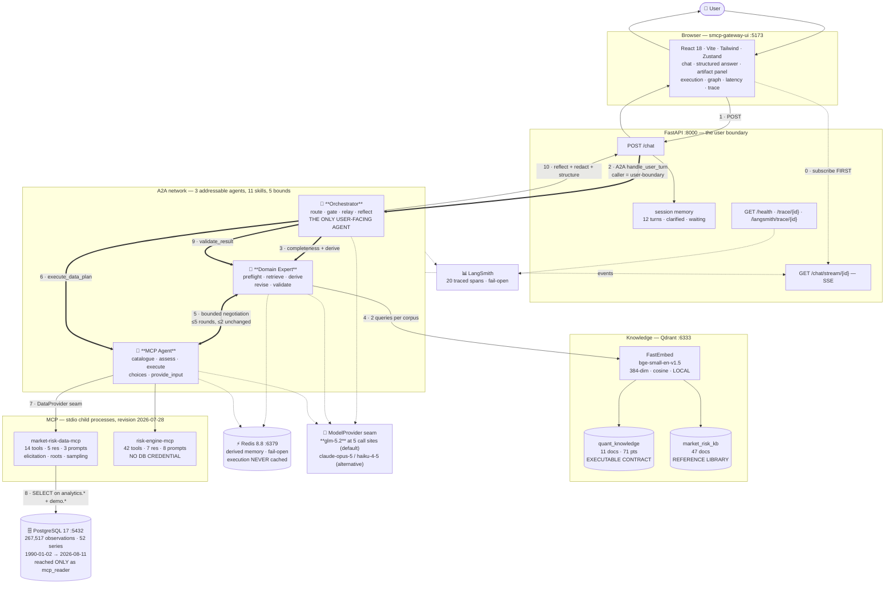
```mermaid
flowchart TB
    U(["👤 User"])

    subgraph B["Browser — smcp-gateway-ui :5173"]
        UI["React 18 · Vite · Tailwind · Zustand<br/>chat · structured answer · artifact panel<br/>execution · graph · latency · trace"]
    end

    subgraph API["FastAPI :8000 — the user boundary"]
        CHAT["POST /chat"]
        SSE["GET /chat/stream/{id} — SSE"]
        SESS["session memory<br/>12 turns · clarified · waiting"]
        HEALTH["GET /health · /trace/{id} · /langsmith/trace/{id}"]
    end

    subgraph A2A["A2A network — 3 addressable agents, 11 skills, 5 bounds"]
        ORCH["🧭 **Orchestrator**<br/>route · gate · relay · reflect<br/>THE ONLY USER-FACING AGENT"]
        DE["🧠 **Domain Expert**<br/>preflight · retrieve · derive<br/>revise · validate"]
        MA["🔌 **MCP Agent**<br/>catalogue · assess · execute<br/>choices · provide_input"]
    end

    subgraph KN["Knowledge — Qdrant :6333"]
        QK[("quant_knowledge<br/>11 docs · 71 pts<br/>EXECUTABLE CONTRACT")]
        MK[("market_risk_kb<br/>47 docs<br/>REFERENCE LIBRARY")]
        EMB["FastEmbed<br/>bge-small-en-v1.5<br/>384-dim · cosine · LOCAL"]
    end

    subgraph MCP["MCP — stdio child processes, revision 2026-07-28"]
        DS["market-risk-data-mcp<br/>14 tools · 5 res · 3 prompts<br/>elicitation · roots · sampling"]
        RS["risk-engine-mcp<br/>42 tools · 7 res · 8 prompts<br/>NO DB CREDENTIAL"]
    end

    PG[("🗄️ PostgreSQL 17 :5432<br/>267,517 observations · 52 series<br/>1990-01-02 → 2026-08-11<br/>reached ONLY as mcp_reader")]
    RD[("⚡ Redis 8.8 :6379<br/>derived memory · fail-open<br/>execution NEVER cached")]
    LLM["🤖 ModelProvider seam<br/>**glm-5.2** at 5 call sites (default)<br/>claude-opus-5 / haiku-4-5 (alternative)"]
    LS["📊 LangSmith<br/>20 traced spans · fail-open"]

    U --> UI
    UI -->|"1 · POST"| CHAT
    UI -.->|"0 · subscribe FIRST"| SSE
    CHAT --> SESS
    CHAT ==>|"2 · A2A handle_user_turn<br/>caller = user-boundary"| ORCH
    ORCH ==>|"3 · completeness + derive"| DE
    DE -->|"4 · 2 queries per corpus"| EMB
    EMB --> QK
    EMB --> MK
    DE <==>|"5 · bounded negotiation<br/>≤5 rounds, ≤2 unchanged"| MA
    ORCH ==>|"6 · execute_data_plan"| MA
    MA -->|"7 · DataProvider seam"| DS
    MA --> RS
    DS -->|"8 · SELECT on analytics.* + demo.*"| PG
    ORCH ==>|"9 · validate_result"| DE
    ORCH -->|"10 · reflect + redact + structure"| CHAT
    CHAT --> UI
    UI --> U

    ORCH -.-> LLM
    DE -.-> LLM
    MA -.-> LLM
    DE -.-> RD
    MA -.-> RD
    A2A -.-> LS
    A2A -.->|"events"| SSE
    HEALTH -.-> LS
```

### 4.4 The life cycle in fourteen steps

1. **The user types a question** in the React chat interface.
2. **The client selects a `request_id` and subscribes to the SSE stream first**, then posts to `/chat`. Thus it already watches before the first agent starts.
3. **FastAPI validates the request** and reads the session memory: the last 12 turns, a `clarified` flag, a waiting specialist task and a pending clarification. It opens a **`TurnLedger`** (20 handoffs, 900 s) and sends **one** A2A message as `user-boundary`.
4. **The orchestrator merges a pending clarification** with the answer that it belongs to. Then it **classifies** the turn as a structured output: `direct`, `clarify` or `data_request`. The code, not a prompt, prevents a second question to a user who answered one in the previous turn.
5. **The pre-flight gate runs.** It is deterministic, takes less than a millisecond, and makes no model call and no vector search. It stops only on a field that no default can honestly replace. It asks one grouped question with **real options that the user can click**.
6. **The domain expert retrieves** from two Qdrant collections, two queries each, merged by the best distance. The *executable contract* stays separate from the *reference library*.
7. **It derives a `Requirement`.** Each figure in it is a verbatim quote, and the code **checks the quote against the retrieved text**. When the corpus is silent, `rows` is `None`, and the answer says so. It does not supply a plausible default.
8. **The negotiation runs** over A2A. The expert proposes a hypothesis that keeps, on purpose, inputs that the source possibly does not have. The MCP agent answers with evidence: *available*, *unavailable* and, most useful, ***unnecessary***. The expert revises, and a **difference** proves that the round did something. The negotiation ends in one of four decisions, and that decision controls what the user reads.
9. **On `AGREED`, the MCP agent executes**: `getattr(RiskWorkflows, capability)`. It fetches only the agreed rows through the MCP data server as `mcp_reader`. It calls the risk engine, which holds no database credential, for the mathematics.
10. **The expert that agreed the plan validates a risk figure.** A blocking mismatch **holds back the answer**, because a true figure under a false description is the worst output that this system can give.
11. **The orchestrator writes the reply** under the honesty rules: dated figures, separate `SYNTHETIC_DEMO` and real-market labels, and the parameters that the calculation used. The code replaces internal identifiers at the exit that faces the user.
12. **`answer_builder`** puts together a typed section document. Each turn gets one, **also each refusal**.
13. **`_finish` attaches** the LangSmith URL and trace id, the handoff ledger, the request id and a latency report from **measured durations only**.
14. **The UI shows** the answer, the table, the chart, the data plan, the negotiation transcript, the execution graph, the latency breakdown and the LangSmith span tree. The server fetches the span tree and an **allow-list** removes the prompts, completions and retrieved text. Thus a reader sees the architecture of the decision, never the reasoning behind it.

---

## 5. The three agents

### 5.1 What is an agent here

There are **exactly three** agents. An entity is an agent only if it has all of these:

- an Agent Card
- a mounted JSON-RPC endpoint
- a task life cycle

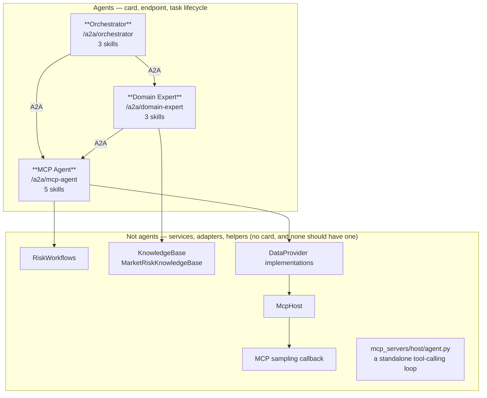
```mermaid
flowchart TB
    subgraph REAL["Agents — card, endpoint, task lifecycle"]
        O["**Orchestrator**<br/>/a2a/orchestrator<br/>3 skills"]
        D["**Domain Expert**<br/>/a2a/domain-expert<br/>3 skills"]
        M["**MCP Agent**<br/>/a2a/mcp-agent<br/>5 skills"]
    end

    subgraph NOT["Not agents — services, adapters, helpers (no card, and none should have one)"]
        H["McpHost"]
        RW["RiskWorkflows"]
        KB["KnowledgeBase<br/>MarketRiskKnowledgeBase"]
        DPI["DataProvider implementations"]
        SC["MCP sampling callback"]
        HA["mcp_servers/host/agent.py<br/>a standalone tool-calling loop"]
    end

    O -->|"A2A"| D
    O -->|"A2A"| M
    D -->|"A2A"| M
    M --> DPI --> H
    M --> RW
    D --> KB
    H --> SC
```

### 5.2 The agent roster

| Agent | Module | A2A address | Primary responsibility | Receives from | Sends to | LLM call site | Tools | User-facing? |
|---|---|---|---|---|---|---|---|---|
| **Orchestrator** | `agents/orchestrator_agent.py` + `agents/pipeline.py` | `/a2a/orchestrator` | Routes each turn. Writes the final reply. Owns the conversation, also the relayed clarifications | `user-boundary` **only** | Domain Expert, MCP Agent | `CallSite.ORCHESTRATOR` | None directly. It delegates | **Yes, the only one** |
| **Domain Expert** | `agents/domain_expert_agent.py` | `/a2a/domain-expert` | The pre-flight gate, Qdrant retrieval, the grounded `Requirement`, revision in the negotiation, result validation | Orchestrator **only** | MCP Agent (for the negotiation) | `CallSite.DOMAIN_EXPERT` | Reads two Qdrant collections | No |
| **MCP Agent** | `agents/mcp_agent.py` | `/a2a/mcp-agent` | Publishes the live tool surface. Assesses a proposed requirement. Executes the agreed plan. Supplies real choices | Orchestrator, Domain Expert | — | `CallSite.MCP_AGENT` | 34 advertised capabilities → 42 MCP risk tools + 14 data tools | No. It returns `input-required` and does not ask |

### 5.3 The eleven skills

| Agent | Skill id | Idempotent? | Permitted callers |
|---|---|---|---|
| Orchestrator | `handle_user_turn` | No | `user-boundary` |
| Orchestrator | `relay_user_input` | No | `user-boundary` |
| Orchestrator | `summarise_session` | **Yes** | `user-boundary` |
| Domain Expert | `check_requirement_completeness` | **Yes** | `orchestrator` |
| Domain Expert | `derive_data_requirement` | **Yes** | `orchestrator` |
| Domain Expert | `validate_result` | **Yes** | `orchestrator` |
| MCP Agent | `describe_data_capabilities` | **Yes** | `domain-expert`, `orchestrator` |
| MCP Agent | `assess_data_requirement` | **Yes** | `domain-expert` |
| MCP Agent | `execute_data_plan` | No | `orchestrator` |
| MCP Agent | `list_data_choices` | **Yes** | `orchestrator` |
| MCP Agent | `provide_input` | No | `orchestrator` |

`user-boundary` is on the skills of the orchestrator and **on no other skill**.
If a browser sends a POST directly to `/a2a/mcp-agent/`, the agent refuses it by name.
Thus the mounted endpoints carry only discovery and agent-to-agent traffic. They are not a back door.

> [!NOTE]
> `AGENTS.md` says "nine skills". The code has **eleven**. The pre-flight gate added `check_requirement_completeness`, and the result-validation pass added `validate_result`. The count in this README comes from `cards.py`.

### 5.4 What is not an agent

| Entity | What it is | Why it has no card |
|---|---|---|
| `McpHost` | An MCP client that owns two child processes | It moves data. It does not reason or decide |
| `RiskWorkflows` | An adapter that prepares inputs, calls two servers and gives shape to the replies | A test checks that it does **no arithmetic**. It marshals data. It does not judge |
| `KnowledgeBase` / `MarketRiskKnowledgeBase` | Ingest and retrieval services | They answer a query. They do not select the query |
| `DataProvider` implementations | Three adapters that can replace each other | A change of adapter must not change an agent |
| The MCP sampling callback | A bridge that lends the model of the host to a server | It has no goals |
| `mcp_servers/host/agent.py` | A standalone tool-call loop (`MAX_STEPS=24`) to test MCP with no backend, Qdrant or UI | It is **not in the `/chat` path**. It has no knowledge base, no negotiation and no decision trace |

A fourth agent (a router, a planner, a supervisor or a judge) splits a responsibility that one of the three agents already owns.
`.claude/rules/a2a-layer.md` records this as a design constraint.
`tests/test_a2a.py` checks the roster.

### 5.5 Why there are multiple agents

Each specialist alone does not know enough:

- The **domain expert** knows what the *method* needs. For example, historical VaR reads 250 trading days. The expert read this in the knowledge base and can quote the sentence.
- The **MCP agent** knows what the *source* holds. A par yield curve has no CUSIPs, no issuer names and no settlement dates. Also, some inputs are **unnecessary**, because a tool already abstracts them.

A one-way handoff gives requirements that nobody can serve (six fields, and three of them do not exist).
It also gives fetches that nobody asked for.
The third fact, "that input is unnecessary", is not in the corpus.
The expert can get it only from the MCP agent.
With this fact, a requirement becomes smaller **on evidence**, not by assumption.

### 5.6 The cost of one single agent

| Consequence | Why it occurs |
|---|---|
| Larger prompts | One agent needs the routing rules, the corpus excerpts, the full tool catalogue and the honesty rules in each call, also for "hi" |
| Unclear responsibility | When a number is wrong, nobody can say which agent wrote it. With a split, a wrong number has exactly one author |
| No limit on tool use | With no capability boundary, the reasoning step and the fetch step share a credential and a goal |
| Difficult debugging | The LangSmith trace becomes one opaque span, not `derive → assess → revise → execute` |
| Difficult testing | Tests cannot check the round limit and the convergence test without a network. `DataLayerPort` makes them unit-testable |
| More tokens on the cheap path | Routing runs on **each** turn. Without the split, a greeting goes to Qdrant and to a reasoning-grade call |
| Weaker governance | Caller allow-lists, the user boundary and the rule "specialists never speak to a user" need more than one participant |

These are trade-offs, not absolute rules.
Three agents have a real cost: more parts, an A2A layer to maintain, and a negotiation that can take minutes.
The project accepts this cost.
The split prevents one failure that a market-risk system must not have: a confident, well-formatted number with no grounding.

---

## 6. The orchestrator

**Purpose.** Route each user turn, and write the only reply that the user sees.

The code is in `agents/orchestrator_agent.py` (the model calls) and `agents/pipeline.py` (the workflow).

The orchestrator is the single authority that faces the user. The specialists work behind it. The code enforces this rule in three ways:

1. **The caller allow-list.** `user-boundary` is only on the skills of the orchestrator.
2. **The executor allow-lists.** A specialist cannot call the orchestrator. A specialist that wants to "ask the user" directly needs this call.
3. **The elicitation design.** A specialist returns `input-required` with structured field names. It never writes to a terminal.

### 6.1 The two responsibilities

The orchestrator works at the two ends of a request: routing at the start and reflection at the end.

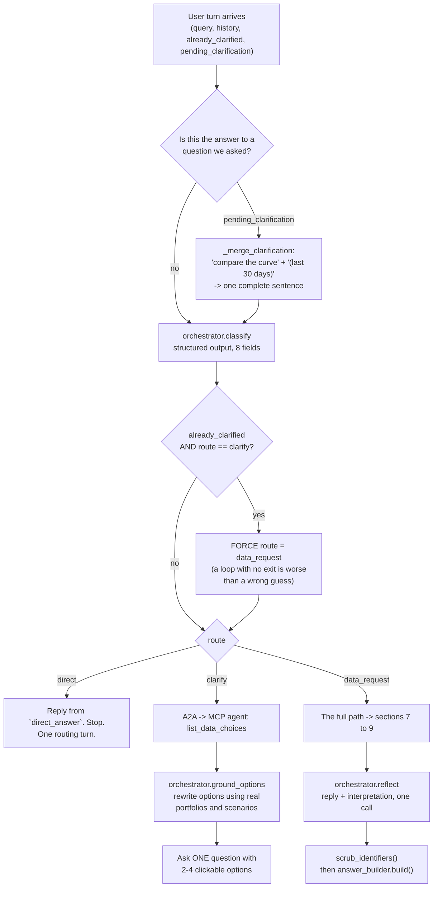
```mermaid
flowchart TD
    A["User turn arrives<br/>(query, history, already_clarified, pending_clarification)"]
    A --> B{"Is this the answer to a<br/>question we asked?"}
    B -->|"pending_clarification"| B2["_merge_clarification:<br/>'compare the curve' + '(last 30 days)'<br/>-> one complete sentence"]
    B -->|no| C
    B2 --> C["orchestrator.classify<br/>structured output, 8 fields"]
    C --> D{"already_clarified<br/>AND route == clarify?"}
    D -->|yes| D2["FORCE route = data_request<br/>(a loop with no exit is worse<br/>than a wrong guess)"]
    D -->|no| E
    D2 --> E{route}
    E -->|"direct"| F["Reply from `direct_answer`. Stop.<br/>One routing turn."]
    E -->|"clarify"| G["A2A -> MCP agent: list_data_choices"]
    G --> G2["orchestrator.ground_options<br/>rewrite options using real<br/>portfolios and scenarios"]
    G2 --> G3["Ask ONE question with<br/>2-4 clickable options"]
    E -->|"data_request"| H["The full path -> sections 7 to 9"]
    H --> I["orchestrator.reflect<br/>reply + interpretation, one call"]
    I --> J["scrub_identifiers()<br/>then answer_builder.build()"]
```

### 6.2 The routes

| Route | Meaning | Cost | Decided in |
|---|---|---|---|
| `direct` | Greetings, small talk, questions about the capabilities of the system, short definitions that do not select a calculation or give its inputs | One routing call | `CLASSIFY_SCHEMA.route` |
| `clarify` | The user wants data, but a missing detail changes the full result | One routing call + one catalogue read | Same |
| `data_request` | All questions that need real numbers, **and** methodology questions ("how is X calculated", "what data does X need", "which calculation do I use"). These go to the domain expert because it reads the corpora | The full path | Same |

The routing prompt ends with this text: *"Be decisive. If in doubt between the two, choose `data_request` — asking the data layer costs a little; inventing an answer costs correctness."*
If the routing call fails, `classify` returns `route="data_request"` for the same reason.
The domain expert can still refuse the request. Nothing can catch a fabricated direct answer.

### 6.3 The classify contract

The contract has 8 fields. All 8 are required.

```json
{
  "route": "direct | clarify | data_request",
  "reasoning": "one line on why this route",
  "task": "what the data is for; empty when direct",
  "direct_answer": "the reply; empty unless direct",
  "question": "one clarifying question; empty unless clarify",
  "options": [{"label": "what the user reads",
               "value": "natural language sent as their next message — NEVER a tool name"}],
  "requested_fields": ["any column names the user named"],
  "requested_rows": 250
}
```

The type of `requested_rows` is `["integer", "null"]`. This field failed on the cheaper model (see [20.5](#205-the-earlier-glm-experiment)).

### 6.4 Two guarantees in the code

These two guarantees are in the code, not in the prompt.

| Guarantee | Location | Why a prompt is not sufficient |
|---|---|---|
| **The orchestrator never asks a second question to a user who answered a clarification in the previous turn.** | `pipeline.py`: `if already_clarified and intent.route == "clarify": intent.route = "data_request"` | A model instruction is not a bound. A loop with no exit is worse than a wrong guess |
| **Each clarifying question has real choices.** | `pipeline._clarify` reads `list_data_choices` from the MCP agent *before* it asks. Then `ground_options` writes the options again from the real portfolios and scenarios | An option is useful only if a click on it *removes* the ambiguity. "A named scenario on my portfolio" only repeats the question |

The orchestrator reads the catalogue **only** on the `clarify` branch. Thus a greeting costs nothing more.
The pre-flight gate applies a narrower form of this rule.
It reads the catalogue only when the data layer holds a list for the missing field (a scenario or a portfolio).
"Which comparison period?" needs no catalogue.
An A2A call and a provider round trip for options that nobody can use cancel part of the saving of the gate.

### 6.5 The reflect contract

`reflect` asks for **two** fields in one call:

- `reply`: a maximum of three sentences, the executive answer.
- `interpretation`: two to five sentences for a market-risk professional. It is empty when the turn made no calculation and no table.

Two calls double the most expensive part of the reply. The model already has the material in its context.

The honesty rules are in `REFLECT_SYSTEM`. The user can see that the reply obeys them:

- The reply names each unavailable field as "not published by this source". It substitutes nothing.
- The reply reports a row count with no grounding as "the corpus does not state a window".
- `SYNTHETIC_DEMO` data and real market data keep their labels.
- **Each rate, curve or risk figure states its observation date.** A rate with no date is not an answer. It is a number that was true at one time.
- The parameters of a risk figure are the parameters that the *calculation* reports, not the parameters in the question. The reply states a difference clearly. The prompt says: *"Describing a 1-day figure as 10-day because the question said 10-day is the worst kind of wrong: it is a true number under a false label."*
- No internal tool, function or column identifier is in the text.

### 6.6 The fields on each turn

Each path goes through `AgentPipeline._finish`. It attaches these fields:

| Field | Source |
|---|---|
| `langsmith_url`, `langsmith_trace_id` | Captured while the root run is still open |
| `handoffs` | The `TurnLedger`: who called whom, at what depth, with which task id |
| `request_id` | The correlation id of the turn. SSE, `/trace/{id}` and the handoff ledger share it |
| `latency` | The sum of **measured** durations only. A stage with no instrument goes into `unattributed_ms`. The code does not share it out |
| `structured` | A typed section document, **also on refusals**, because a refused request also has a shape |

### 6.7 The failure sentences

`_user_facing_failure` maps an error *kind* to a sentence.
Nothing from the error itself goes into the sentence: not the exception type, not the message, not a host and not a port.

| Kind | What the user reads |
|---|---|
| `timeout`, `incomplete` | The request took longer than the limit and stopped. Nothing came back, and nothing is assumed. Try a narrower question |
| `handoff_limit`, `depth_limit` | The agents did not agree within the permitted exchanges. No partial answer was written |
| `unavailable`, `empty_response`, `transport` | Part of the gateway is not reachable. No figure came from memory |
| `caller_not_permitted` | Refused, because the request did not come through the front door |
| Domain expert default | The data requirement was not established, so nothing was fetched. A fetch without a grounded requirement is a guess |
| MCP agent default | The data layer could not complete this request. No figure was substituted |

Two `blocked_by` cases have their own sentences. One shared sentence tells the user something false:

- `blocked_by="model"`: the reasoning step failed. The reply says *"a fault on my side, not a limit of the data"*.
- `blocked_by="account"`: the provider account has no balance. The reply says *"this needs an operator, not another attempt"*.

---

## 7. The domain expert agent

**Purpose.** Find what a calculation needs, from the knowledge corpora, and quote the source of each number.

The code is in `agents/domain_expert_agent.py` (1,418 lines) and `agents/preflight.py` (606 lines).

### 7.1 Why the agent exists

The domain expert is the only agent that reads the knowledge base. It is the only agent that can say what a calculation needs.
**It holds no thresholds of its own.**
It must quote each number that it states from a chunk that it retrieved.
The code checks the quote against the retrieved text before it accepts the requirement:

```python
if rows is not None and not quote_is_grounded(quote, context):
    rows, quote = None, None      # discarded — and the user is told why
```

The code rejects a window that the model recalls from training. It rejects it in the same way as a constant that is hard-coded in the source.
Nobody can change either value by an edit to a document, and nobody can audit either value by a read of a document.

> [!NOTE]
> The knowledge base is the authority, and a domain expert can change it with no engineer.
> Change `250` to `500` in `knowledge/market_risk/var.md`, ingest the corpus again and ask again.
> The answer changes with no code change and no release.

### 7.2 The full pipeline


```mermaid
flowchart TD
    Q["question, task, catalogue"] --> PF["**Stage 0 — pre-flight gate**<br/>agents/preflight.py<br/>regex + lexicon, sub-millisecond,<br/>NO model call, NO vector search"]
    PF -->|"incomplete"| PFX["CompletenessVerdict:<br/>intent, missing fields,<br/>one question each, why it matters<br/>-> to the ORCHESTRATOR"]
    PF -->|"complete"| R1

    subgraph RET["**Stage 1 — dual retrieval** (two collections, two query pairs)"]
        R1["quant_knowledge<br/>the EXECUTABLE contract"]
        R2["market_risk_kb<br/>the REFERENCE library"]
    end
    R1 --> MERGE["merge by best distance"]
    R2 --> MERGE
    MERGE --> CTX["Two explicitly separated<br/>context blocks in the prompt"]

    CTX --> DER["**Stage 2 — derive**<br/>structured_call, DOMAIN_EXPERT call site<br/>SCHEMA: 18 properties, 4 required"]
    DER --> VAL["**Stage 3 — validate**<br/>strict schema + type validation<br/>(llm/validation.py)"]
    VAL -->|"violation"| RETRY["ONE corrective retry<br/>carrying the model's own output"]
    RETRY --> VAL
    VAL --> GRD["**Stage 4 — grounding**<br/>quote_is_grounded(quote, context)<br/>emphasis-normalised, not paraphrase-tolerant"]
    GRD -->|"ungrounded"| DROP["rows = None, grounded = False<br/>'the corpus does not state a window'"]
    GRD --> BUILD["**Stage 5 — build**<br/>Requirement dataclass"]
    DROP --> BUILD
    BUILD --> NEG["**Stage 6 — negotiate** -> section 9"]
    NEG --> FIN["Final Requirement + citations + Negotiation"]
```

### 7.3 Stage 0 — the pre-flight completeness gate

The gate stops a turn that misses an input before the turn pays for the full path.
Before the gate existed, a question with no comparison period cost all of these:

- four Qdrant queries
- a reasoning call
- a capability read over A2A
- a maximum of five negotiation rounds, each with two model calls

That was minutes of latency and many reasoning tokens, only to find that nobody named a period.

**The gate uses regular expressions and a lexicon, not a model.**
A frontier model is not necessary to decide if `2026-08-20` is a date.
A model call for this decision brings back most of the cost that the gate removes.

**The gate does not ask without a strong reason.** A field with a documented default is never a reason to interrupt a senior quant:

| Field | Has an honest default? | Can it stop a turn? |
|---|---|---|
| Confidence level | Yes (0.99) | No |
| Holding period or horizon | Yes (1 day) | No |
| Observation window | Yes (from the corpus, or `SAMPLE_ROWS=60` with the flag `window_unstated`) | No |
| As-of date | Yes (latest observation) | No |
| Comparison period | **No** | **Yes** |
| Stress scenario | **No** | **Yes** |
| Reverse-stress target loss | **No** | **Yes** |
| Subject of the request | **No** | **Yes** |

```
"Show me the 10Y Treasury yield."        -> complete (latest observation)
"10-day 99% VaR on the book."            -> complete
"Calculate VaR."                         -> complete for this gate — the router already
                                            refuses a compute request with no target, and
                                            two agents asking the same question is worse
                                            than one
"Compare the curve and show the moves."  -> INCOMPLETE: which period?
"Run a stress test on the demo book."    -> INCOMPLETE: which scenario?
```

The gate has these bounds and switches:

| Setting | Value | Effect |
|---|---|---|
| `PREFLIGHT_MAX_QUESTIONS` | 3 by default, hard limit 5 | The code comment says: *"past that the user is filling in a form rather than having a conversation"* |
| `PREFLIGHT_MAX_ROUNDS` | 2 | After 2 rounds, the turn continues on defaults and states which defaults it used |
| `PREFLIGHT_ENABLED` | `false` | Restores exactly the previous flow. This return path needs no deployment |

A gate failure is **not** a reason to stop.
If the gate cannot answer, `pipeline._completeness` lets the turn continue on the old path.
The code comment gives the reason: *"an optimisation that can fail the request it was meant to speed up is a worse trade than the cost it avoids."*

### 7.4 Stage 1 — two corpora, kept apart

This is the most important distinction in the reasoning layer. The prompt, the storage and the code all enforce it.

| | `quant_knowledge` | `market_risk_kb` |
|---|---|---|
| Source | `knowledge/**.md`: **11** documents in 4 domain subfolders | `docs/market-risk-kb/*.md`: **47** documents |
| Role | **Executable analytical contract** | **Reference knowledge** |
| Prompt label | *EXECUTABLE KNOWLEDGE CONTEXT* | *MARKET RISK REFERENCE CONTEXT* |
| Can support | Exact operational fields, observation windows, row counts, dates, calculation parameters | Terminology, the choice of the relevant calculation, risk factors, the meaning of formulas and regulation |
| Can **not** support | — | An exact operational constraint in the requirement |
| Chunks | Split at headings (`_chunk_markdown`) | Follow the heading hierarchy, with a token budget (`markdown_chunker.py`) |
| Constant | `EXECUTABLE_COLLECTION = "quant_knowledge"` | `REFERENCE_COLLECTION = "market_risk_kb"` |

**Retrieved knowledge must not become an SQL filter.**
A reference document says that FRTB GIRR uses seven tenor vertices. This is *true*, but it is *not* a statement about this database.
A row filter from this document gives a query with the shape of a regulation, not the shape of the data.
The number is then wrong, and nothing after it can find the error.
For this reason, the prompt lets only the executable corpus carry an operational constraint.
The grounding check compares the quote with **the retrieved text**. A paraphrase of a reference document thus cannot pass as an executable contract.

**Retrieval runs two queries for each corpus, not one.**
*"What is expected shortfall"* and *"how many observations does it read"* are different questions. One embedding cannot be near both.
The code merges the results by the best distance.
The reference corpus also gets a fixed interpretation query, `REFERENCE_INTERPRETATION`.
This query changes "which maturity is driving my rate risk?" into a search that finds key-rate DV01 and curve-segment material, with no other model call.

### 7.5 Stage 2 — the `Requirement`

| Field | Meaning |
|---|---|
| `task`, `answerable`, `unanswerable_reason` | What the agent understood, and if the source can serve it |
| `fields`, `candidate_fields`, `field_notes` | The fields that stayed, against the fields that the *method* asked for. Each has a verdict `required / not_needed / unavailable` and a reason |
| `rows`, `row_quote`, `row_reason`, `grounded` | The window and the verbatim sentence that supports it |
| `tenors`, `curve_family` | The curve nodes, on `nominal` / `real` / **`ambiguous`** |
| `temporal` | `TemporalScope(as_of_date, start_date, end_date, lookback_days)` |
| `calculation` | One capability name from the catalogue, or null |
| `calculation_params` | A **closed** schema of 20 declared parameters (see [7.6](#76-calculation_params--a-closed-schema)) |
| `decision` | `AGREED / NEEDS_USER_INPUT / UNSUPPORTED / CANNOT_REACH_AGREEMENT / null` |
| `is_hypothesis` | True while this is still the opening hypothesis |
| `open_questions`, `assumptions`, `limitations` | What the expert needs to know, and what the method depends on |
| `blocked_by` | `""` / `"data"` / `"model"` / `"account"` |
| `citations`, `warnings` | The chunks that support it, and each item that the agent dropped |

### 7.6 `calculation_params` — a closed schema

**Each parameter must have a declared location.**
The routing to a capability can be correct, and the capability can still be unanswerable if its input has no legal location.
`additionalProperties: false` stays. Thus the schema had to be *extended*, not opened.
At first, only `confidence_level` and `horizon_days` were declared.
A planner that got a request for a bear steepener returned `calculation_params: {}`.
Then the guard of each capability with a required input blocked it, although the routing was correct.

The twenty declared parameters are:

`confidence_level` · `horizon_days` · `scenario` (closed enum) · `shock_bp` · `severity_bp` ·
`pivot_tenor_months` · `tenor_months` · `crisis_id` (closed enum) · `risk_measure` (`var`/`es`) ·
`target_loss` · `target_losses` · `limit_amount` · `dv01_limit` · `var_limit` ·
`stress_loss_limit` · `notional` · `amber_utilisation_percent` · `scenario_count` · `top_n` ·
`other_portfolio_id`

Each parameter is nullable. Thus each parameter stays optional, and the planner does not invent values.
If a parameter fails validation, the code **drops it and does not clamp it**.
A change of a confidence level from 99 to 0.99 is a guess about the number that defines the full figure.

**Dates are the exception.** The requirement records a period one time, in `temporal`.
The MCP agent fills it in for each capability that reads it.
Thus a planner never states the same window two times.

`tests/test_calculation_params_contract.py` (21 test functions) stops the build if the declared parameters and the capability signatures do not agree.

### 7.7 Stage 6 — result validation

After the execution, the pipeline sends `VALIDATED_CALCULATIONS = {compute_var, compute_dv01, run_stress, price_portfolio}` **back** to the expert that agreed the plan, through `validate_result`.
A catalogue lookup does not need a second opinion.
A model call in which one agent tells another that a table is still a table adds cost and no assurance.

A **blocking** mismatch stops the answer:

> "The calculation ran, but it does not match the plan agreed for your question, so I will not
> present it as the answer."

A true figure under a false description is the worst output that this system can give. Before this check, the system gave such figures.
If the validator itself fails, the reply reports the result as unverified and does not hold it back.
The reply then states nothing that it cannot support.

### 7.8 The limits of the conversation with the MCP agent

- The expert **proposes**. It never fetches.
- The expert can state what the *method* needs, also inputs that the source possibly does not have. This is the function of a hypothesis (see [9](#9-the-bounded-negotiation)).
- The expert never speaks to the user. A `CompletenessVerdict` goes to the *orchestrator* as structured data.
- Both agents see the tool catalogue (the expert uses it to judge what the source can hold). Thus both agents **can** copy an identifier into the text. `agents/redaction.py` replaces these identifiers at the three exits of the pipeline that face the user. It takes the names from the **live** catalogue, so it also covers a tool that a developer adds tomorrow.

### 7.9 The token budget

`_MIN_TOKENS[DOMAIN_EXPERT] = 12,000`. This value was measured, not guessed.
A reasoning model counts its thinking against the same budget as the visible answer.
The smallest prompt of this call site measured `3,869 reasoning + 1,076 visible` tokens against a limit of 6,000.
The real prompt also carries retrieved excerpts and the tool catalogue.
A truncated completion returns no text and no forced call. The error is `no_tool_call`, and it looks like a refusal of the model.
It is not a refusal. The model output was cut.

---

## 8. The MCP agent

**Purpose.** Publish what the data layer can serve, assess a proposed requirement, and execute the agreed plan.

The code is in `agents/mcp_agent.py` (1,337 lines). The agent has three jobs and two service skills.

| Skill | What it does | Cached? |
|---|---|---|
| `describe_data_capabilities` | **Advertise.** Reports the tools, fields and tenors that are *connected now* | Yes, `REDIS_MCP_CATALOGUE_TTL=300` |
| `assess_data_requirement` | **Assess.** Compares a proposed requirement with the source and gives a counter-proposal. This skill makes the model call | Yes, `REDIS_MCP_ASSESS_TTL=21600` |
| `execute_data_plan` | **Execute.** Fetches exactly the agreed requirement, runs the agreed calculation, reports what arrived | **Never** |
| `list_data_choices` | Gives the real portfolios and scenarios, so that a clarifying question has a real basis | Yes, `REDIS_MCP_CHOICES_TTL=300` |
| `provide_input` | Continues an interrupted plan with the answer of the user, on the same task id | **Never** |

### 8.1 Capability detection, not declaration

```python
if hasattr(self.data, "call_tool"):   # only McpDataProvider has this
    tools += [ToolSpec("price_portfolio", …), ToolSpec("compute_dv01", …), …]
```

With `DATA_BACKEND=mock` or `postgres`, the risk tools are not reachable.
Thus the agents never see them, and the reply says clearly that there are no positions.
An agent that advertises a capability that it cannot supply will invent a result.

The base capabilities are always present: `get_yield_curve`, `get_rate_history`, `get_curve_slope` and `list_series` (4 informational capabilities).
With `mcp`, the agent adds thirty executable capabilities.
[16.3](#163-the-34-agent-reachable-capabilities) gives the full list and the map to the 42 registered MCP tools.

### 8.2 The execution pipeline

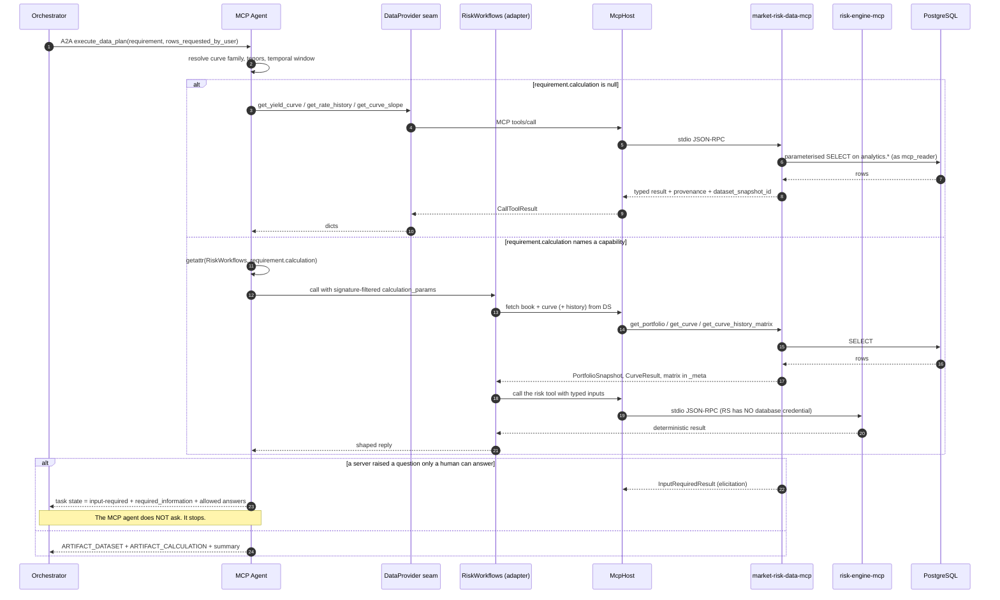
```mermaid
sequenceDiagram
    autonumber
    participant O as Orchestrator
    participant M as MCP Agent
    participant DP as DataProvider seam
    participant RW as RiskWorkflows (adapter)
    participant H as McpHost
    participant DS as market-risk-data-mcp
    participant RS as risk-engine-mcp
    participant PG as PostgreSQL

    O->>M: A2A execute_data_plan(requirement, rows_requested_by_user)
    M->>M: resolve curve family, tenors, temporal window
    alt requirement.calculation is null
        M->>DP: get_yield_curve / get_rate_history / get_curve_slope
        DP->>H: MCP tools/call
        H->>DS: stdio JSON-RPC
        DS->>PG: parameterised SELECT on analytics.* (as mcp_reader)
        PG-->>DS: rows
        DS-->>H: typed result + provenance + dataset_snapshot_id
        H-->>DP: CallToolResult
        DP-->>M: dicts
    else requirement.calculation names a capability
        M->>M: getattr(RiskWorkflows, requirement.calculation)
        M->>RW: call with signature-filtered calculation_params
        RW->>H: fetch book + curve (+ history) from DS
        H->>DS: get_portfolio / get_curve / get_curve_history_matrix
        DS->>PG: SELECT
        PG-->>DS: rows
        DS-->>RW: PortfolioSnapshot, CurveResult, matrix in _meta
        RW->>H: call the risk tool with typed inputs
        H->>RS: stdio JSON-RPC (RS has NO database credential)
        RS-->>RW: deterministic result
        RW-->>M: shaped reply
    end
    alt a server raised a question only a human can answer
        DS-->>H: InputRequiredResult (elicitation)
        M-->>O: task state = input-required + required_information + allowed answers
        Note over M,O: The MCP agent does NOT ask. It stops.
    else
        M-->>O: ARTIFACT_DATASET + ARTIFACT_CALCULATION + summary
    end
```

### 8.3 Execution rules

**The requested count and the delivered count are separate numbers.**
`execute` reports both. A fetch that silently returns fewer rows is the one failure that arrives in an answer and looks like a success.
`rows_requested_by_user`, the `rows` of the requirement and `rows_delivered` all go to the reply.

**`RiskWorkflows` calculates nothing.**
`backend/src/backend/workflows/risk_workflows.py` (1,487 lines) is an **adapter**. It prepares the inputs, calls the data server for market data, calls the risk server for the mathematics and gives shape to the reply.
A test checks this against the syntax tree of the module.
Arithmetic in a workflow method stops the build, unless the method is on a short allow-list of label format and calendar helpers.

**The `ToolSpec` name *is* the name of the `RiskWorkflows` method.**
`McpAgent._calculate` finds the method with `getattr`.
Contract tests enforce this in both directions: no advertised capability without an executor, and no executor that nothing can reach.

**The agent asks for a required input. It never assumes it.**
Some capability descriptions say `NEEDS x`. If such a capability does not get `x`, it returns a structured `needs` block.
The MCP agent sends the block up, and the orchestrator asks the user. The agent does not substitute a default.

### 8.4 Elicitation belongs to the orchestrator

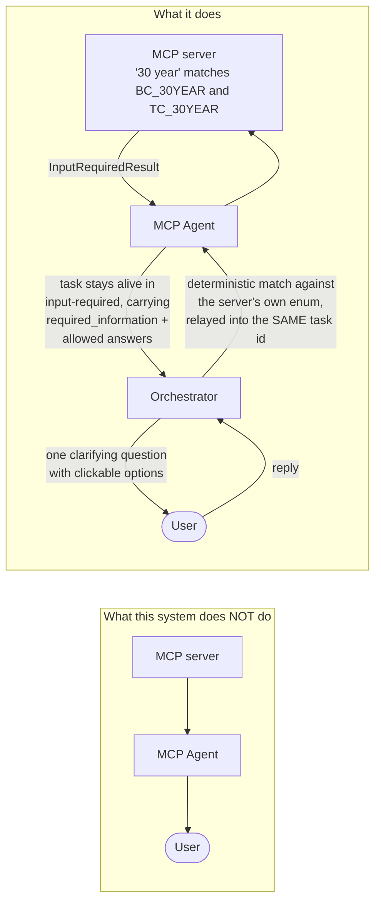
```mermaid
flowchart LR
    subgraph WRONG["What this system does NOT do"]
        S1["MCP server"] --> A1["MCP Agent"] --> U1(["User"])
    end
    subgraph RIGHT["What it does"]
        S2["MCP server<br/>'30 year' matches BC_30YEAR and TC_30YEAR"] -->|"InputRequiredResult"| A2["MCP Agent"]
        A2 -->|"task stays alive in<br/>input-required, carrying<br/>required_information +<br/>allowed answers"| O2["Orchestrator"]
        O2 -->|"one clarifying question<br/>with clickable options"| U2(["User"])
        U2 -->|"reply"| O2
        O2 -->|"deterministic match against<br/>the server's own enum,<br/>relayed into the SAME task id"| A2
        A2 --> S2
    end
```

The table shows why this design is important.

| Concern | If the MCP agent asked directly | With the orchestrator in the middle |
|---|---|---|
| Owner of the conversation | Two agents write to the user. Neither knows what the other said | One voice, and one location for the honesty rules |
| Transport | The specialist needs a channel to the browser | The specialist returns structured data. The orchestrator owns the transport |
| Meaning of the words of a human | The specialist decides what "30 year Treasury" means | The code comment says: *"Matching what the user said onto the field the servers asked about is a decision about a human's words, and those belong to the orchestrator."* |
| Retry bound | No bound, for each specialist | `A2A_MAX_CLARIFICATIONS=3`. The specialist that owns the task enforces it. There is exactly one location where it can run out |
| Continuity | A new question each time | The **task id** correlates the answer. The interrupted work continues and does not start again |

These rules apply to the answer of the user:

1. **The match is deterministic.** The code compares the answer with the enum that the server supplied. The code comment says: *"Asking a model to pick from a list it was given is a way to occasionally get something that is not on the list."*
2. **An answer that settles nothing is not a refusal.** "30 year Treasury" is not an answer to "nominal or real?", and it is not a refusal. The task stays `input-required`, and the orchestrator asks again. After `A2A_MAX_CLARIFICATIONS` attempts, the plan runs on the **labelled declined path of the tool**.
3. **An explicit refusal ends the task immediately.** The code compares the answer with a word list, on word boundaries. It never infers a refusal from a vague answer.
4. **A material clarification opens the analysis again.** Some answers change *which rows to read* ("use portfolio X"). Other answers change *what the question means* ("use real rates"). For the second kind (`DOMAIN_MATERIAL_FIELDS`), `pipeline._revalidate` gives the expert its agreed plan and the change. The expert keeps the parts that are still true. A plan that was agreed for nominal rates gives a correct number for a question that nobody asked.

---

## 9. The bounded negotiation

**Purpose.** Let the domain expert and the MCP agent agree on a plan that the data layer can serve, in a limited number of rounds.

The code is in `agents/planning.py`. It works against `DataLayerPort`.

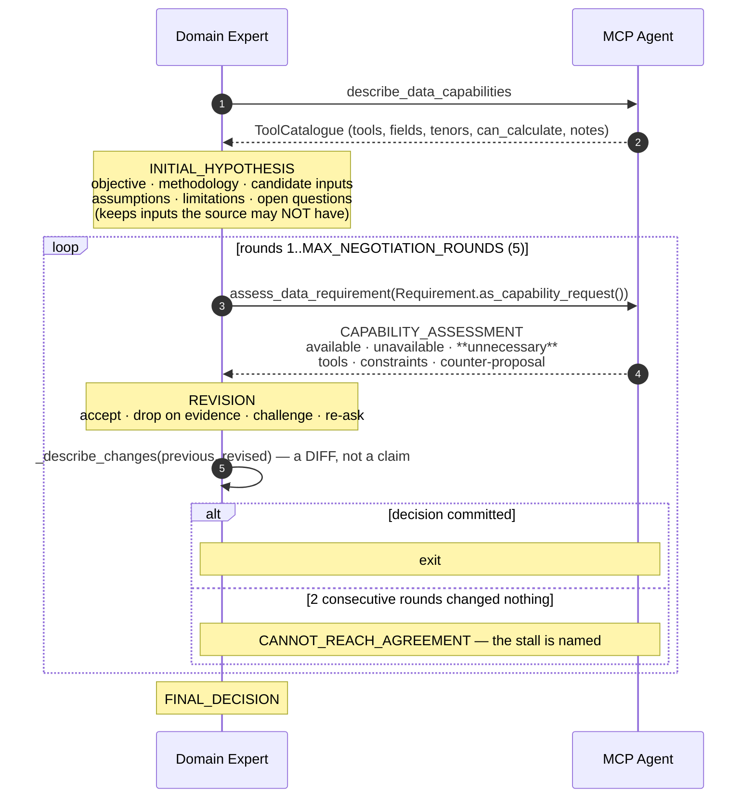
```mermaid
sequenceDiagram
    autonumber
    participant D as Domain Expert
    participant M as MCP Agent

    D->>M: describe_data_capabilities
    M-->>D: ToolCatalogue (tools, fields, tenors, can_calculate, notes)

    Note over D: INITIAL_HYPOTHESIS<br/>objective · methodology · candidate inputs<br/>assumptions · limitations · open questions<br/>(keeps inputs the source may NOT have)

    loop rounds 1..MAX_NEGOTIATION_ROUNDS (5)
        D->>M: assess_data_requirement(Requirement.as_capability_request())
        M-->>D: CAPABILITY_ASSESSMENT<br/>available · unavailable · **unnecessary**<br/>tools · constraints · counter-proposal
        Note over D: REVISION<br/>accept · drop on evidence · challenge · re-ask
        D->>D: _describe_changes(previous, revised) — a DIFF, not a claim
        alt decision committed
            Note over D,M: exit
        else 2 consecutive rounds changed nothing
            Note over D,M: CANNOT_REACH_AGREEMENT — the stall is named
        end
    end

    Note over D: FINAL_DECISION
```

### 9.1 A hypothesis, not a requirement

In the previous design, the expert normalised its plan **before** the MCP agent saw it.
The code silently dropped the fields that the catalogue did not have.
Thus the MCP agent got a plan that it could already serve, and it could only agree.
That was not a negotiation. It was an approval stamp, and the second agent had no real function.

Now the opening move keeps the inputs that the method asks for. This includes inputs that the data layer possibly does not have.
The opening move also states what the expert does not know.
The MCP agent answers with evidence.
The most useful of its three verdicts is **"unnecessary, because the tool already abstracts it."**
The expert cannot get this fact from the corpus.

### 9.2 The four decisions

| Decision | Meaning | The user gets |
|---|---|---|
| `AGREED` | An executable plan that both agents accept | The answer |
| `NEEDS_USER_INPUT` | A choice that neither agent is permitted to make | One clarifying question |
| `UNSUPPORTED` | The data layer cannot serve this request | A clear refusal and what the system *can* do |
| `CANNOT_REACH_AGREEMENT` | The rounds ran out, or the conversation stopped making progress | That fact, and no number |

A boolean `converged` could not show the difference between the last three decisions.
All three arrived as the same flat "declined". This included the case where one more sentence from the user was sufficient to continue.
Now the code *derives* `converged` as `decision == "AGREED"`. Thus the flag cannot differ from the decision.

### 9.3 Two bounds: length and progress

| Constant | Value | Bounds |
|---|---|---|
| `MAX_NEGOTIATION_ROUNDS` | 5 | The maximum length of a conversation |
| `MAX_UNCHANGED_ROUNDS` | 2 | The maximum length of a conversation **with no progress** |

`_describe_changes` calculates the difference between the two requirements. It does not trust the report of the expert about its changes.
For a long time, the code calculated this difference and wrote it into the transcript, but nothing *read* it.
Thus a conversation with no progress ran all five rounds and stopped at the same point as round one.
This cost **eight more model calls for no result**.

The bound is two rounds, not one.
After the first round with no change, a real convergence can still occur.
In the second round, the data layer gets the same capability question again. The input has the same fingerprint, so the assessment is the cached reply of the same turn.
No new information is then left in the loop.

### 9.4 The projection that makes idempotency work

`assess_data_requirement` has the tag `idempotent`, but at first the tag **never had an effect**.
The skill got the full requirement, with `warnings`, and `warnings` grows in each round.
Duplicate suppression makes a digest of the *full* input.
The fix was a projection, `Requirement.as_capability_request()`, not a narrower digest.

A projection must stay honest.
The receiver **builds the dataclass again**, so a dropped field comes back as its *default* value, not as absent.

- If the projection omits `warnings`, the receiver reads "no warnings shown". This is harmless.
- If the projection omits `grounded`, the receiver reads `False`. This is a false statement about an expert that grounded its citation.

Thus the rule is: drop a field only if nothing reads it *and* its default is harmless. Keep all other fields.

---

## 10. The A2A layer

**Purpose.** Carry each message between the agents as an A2A task, with bounds that the receiver enforces.

### 10.1 What A2A means in this project

Each arrow between agents is an **A2A task**, not a Python method call.
Each of the three agents is a separate service with its own address.
Each has an Agent Card, a set of skills, a JSON-RPC endpoint and a full task life cycle.
All three are mounted on the same FastAPI app.

| Item | Value |
|---|---|
| SDK | `a2a-sdk` ≥ 1.1.2 (types from the proto files + JSON-RPC server bindings) |
| Protocol revision | `PROTOCOL_VERSION_CURRENT` from `a2a.utils.constants`. `GET /health` reports it live under `a2a.protocol_version` |
| Transport | `A2A_TRANSPORT=inprocess` (default) calls the mounted ASGI app through the ASGI transport of httpx. This is real JSON-RPC, real serialisation and a real task life cycle, with no second port. `http` calls `A2A_BASE_URL` or an override for each agent |
| Card discovery | `GET /a2a/<agent>/.well-known/agent-card.json` |
| RPC | `POST /a2a/<agent>/` |
| Streaming | Advertised as **`false`**, because streaming is not implemented. A client that subscribes to a stream with no producer waits with no end |
| Task states in use | `submitted`, `working`, `input-required`, `completed`, `failed`, `cancelled` |
| Artifacts | 15 named constants in `envelope.py`: `requirement`, `negotiation`, `catalogue`, `citations`, `serve_response`, `dataset`, `calculation`, `choices`, `outcome`, `error`, `input_request`, `title`, `capability_assessment`, `result_validation`, `completeness` |
| Push notifications | Advertised as `false`. Not implemented |

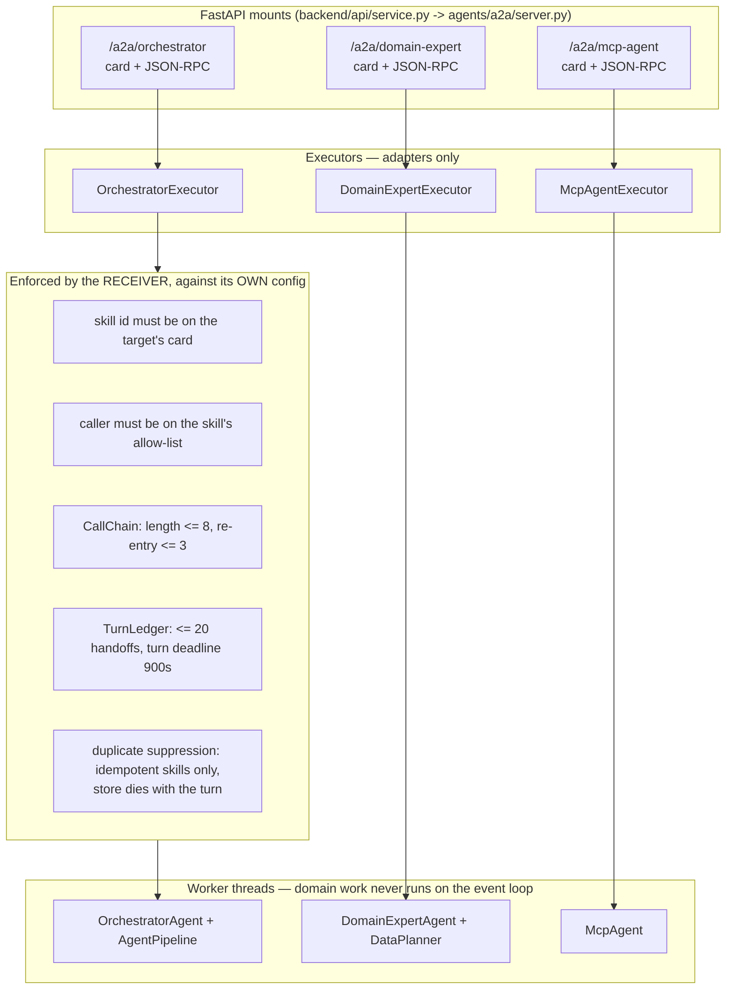
```mermaid
flowchart TB
    subgraph MOUNTS["FastAPI mounts (backend/api/service.py -> agents/a2a/server.py)"]
        M1["/a2a/orchestrator<br/>card + JSON-RPC"]
        M2["/a2a/domain-expert<br/>card + JSON-RPC"]
        M3["/a2a/mcp-agent<br/>card + JSON-RPC"]
    end
    subgraph EXEC["Executors — adapters only"]
        E1["OrchestratorExecutor"]
        E2["DomainExpertExecutor"]
        E3["McpAgentExecutor"]
    end
    subgraph GUARD["Enforced by the RECEIVER, against its OWN config"]
        G1["skill id must be on the target's card"]
        G2["caller must be on the skill's allow-list"]
        G3["CallChain: length <= 8, re-entry <= 3"]
        G4["TurnLedger: <= 20 handoffs, turn deadline 900s"]
        G5["duplicate suppression: idempotent skills only,<br/>store dies with the turn"]
    end
    subgraph WORK["Worker threads — domain work never runs on the event loop"]
        W1["OrchestratorAgent + AgentPipeline"]
        W2["DomainExpertAgent + DataPlanner"]
        W3["McpAgent"]
    end
    M1 --> E1 --> GUARD --> W1
    M2 --> E2 --> W2
    M3 --> E3 --> W3
```

### 10.2 The five transport bounds

| Bound | Stops | Environment variable | Default |
|---|---|---|---|
| **Call chain length** | Nesting with no limit: A→B→C→D→E→… | `A2A_MAX_CHAIN` | 8 |
| **Re-entry** | A *cycle*: A→B→A→B→A→… | `A2A_MAX_REENTRY` | 3 |
| **Handoff budget** | Breadth: one agent that calls a peer with no end | `A2A_MAX_HANDOFFS` | 20 |
| **Duplicate suppression** | The same idempotent question two times in one turn | (always on) | — |
| **Turn deadline** | A turn that is stuck | `A2A_TURN_TIMEOUT_SECONDS` | 900 s |

Two domain bounds are outside the transport layer: `MAX_NEGOTIATION_ROUNDS=5` (in `planning.py`) and `A2A_MAX_CLARIFICATIONS=3` (in `elicitation.py`).

**Chain length and re-entry are two numbers, because they stop different faults.**
Length limits how far a collaboration goes.
Re-entry limits how often the same `(agent, skill)` pair occurs on the same path. This is the real shape of a cycle.
One number that catches `A→B→A→B` refuses honest negotiations of four steps.
One number that permits those negotiations lets the cycle run to the limit.

A bounded negotiation of five rounds sends five *sibling* calls from one worker thread.
Each call has the **same** chain length, and no call is inside another.
When the code counted messages as depth, a correct conversation looked like a stack overflow.

The chain is the **path itself**, for example `orchestrator.plan > domain-expert.derive > mcp-agent.assess`.
Thus a refusal can name the loop, and not only report that a number was reached.

**There is no flat deadline for each call.**
A call **contains** each call below it.
One number at each depth makes the outermost call the tightest bound in the system, so it always expires first.
This occurred: `derive` took 80 s and `assess` took 78 s, both correctly.
The 300 s deadline of the orchestrator then expired during the revision and reported a normal turn as stuck.
A larger number only moves the same failure further out.

The removal of this deadline does not make hang detection weaker.
An agent hangs where it waits on the network, and the model layer already limits each provider request with `LLM_TIMEOUT_SECONDS`.
**Each guard is at the level where its fault occurs.**

**Duplicate suppression prevents loops. It is not a cache.**
The identity of a call is `(this turn, target agent, skill, canonical input)`.
The store is on the `TurnLedger`. The code makes the ledger when a user turn starts and **discards it when the turn ends**.
Nothing stays after a turn. Thus the system never answers a later, independent question with the data of an earlier question.
In a turn, only skills with the card tag `idempotent` are eligible.
A data fetch, a calculation and the continuation of an interrupted plan run again each time, because their answer is about *now*.
A developer can tag a data fetch as idempotent to save a call.
Duplicate suppression then becomes a cache, and it can give the numbers of one user to another user.

### 10.3 Caller allow-lists are authorization, not authentication

This is **internal caller authorization**.
It is a logical boundary between components in one trusted process.
The receiver reads the caller from message metadata that the caller supplied.
Nothing checks that a message with the orchestrator as caller came from the orchestrator.
In local development, all three agents share a process, and the only network listener is the service of the developer.
For this case, a logical boundary is the correct weight. It makes the architecture enforceable and reviewable, and it does not claim a security property that it does not have.
If you deploy an agent on a host that other people can reach, you must add real authentication (OAuth, JWT, mTLS). That is a deployment change.

### 10.4 Two rules that give A2A a real function

1. **The protocol stays out of the behaviour.** Only `agents/a2a/` can import `a2a.types`, `a2a.client` or `a2a.server`. An agent module takes and returns the dataclasses in `agents/contracts.py`.
2. **`agents/pipeline.py` must not import `DomainExpertAgent` or `McpAgent`.** A test checks this against the *parsed import graph*. If the caller can reach the callee directly, A2A has no real function. The specialists are not public attributes of `AgentNetwork`. The only way to reach one is to send it a message.

`ExecutionContext` gives the stronger guarantee.
Each executor publishes the task that it runs before it gives the work to a worker thread.
An integration test requires that each specialist execution carries a context whose task id is in the handoff ledger.

### 10.5 Integers do not survive JSON

`Part.data` is a `google.protobuf.Value`, so `250` comes back as `250.0`.
Each typed rebuilder in `envelope.py` coerces its own integer fields.
`restore_counts()` handles the free-form structures with `COUNT_KEYS`.
Without this step, a count goes into a sentence for the user as "250.0 observations".

### 10.6 A2A and MCP compared

| Concern | **A2A** | **MCP** |
|---|---|---|
| Purpose | Collaboration between agents: delegation, negotiation, task life cycle | Standard access of a model or agent to tools, resources and prompts |
| Between | Orchestrator ⇄ Domain Expert ⇄ MCP Agent | MCP Agent (through `McpDataProvider` and `McpHost`) ⇄ the two servers |
| Data and tool access | **None.** No A2A message reaches PostgreSQL | **All of it.** The only road to the database and the risk engine |
| User interaction | Only the skills of the orchestrator admit `user-boundary`. A specialist returns `input-required` | Elicitation goes from server to client during a call. The orchestrator relays it. The user never sees it directly |
| Protocol | `a2a-sdk` 1.x, JSON-RPC over HTTP or ASGI, protocol revision 1.0 | `mcp` ≥2.0, JSON-RPC over **stdio**, protocol revision 2026-07-28 |
| Unit of work | A **Task** with a life cycle and named artifacts | A **tool call** with a typed result |
| Discovery | Agent Card at `/.well-known/agent-card.json` | `tools/list`, `resources/list`, `prompts/list` after `discover()` |
| Bounds | Chain, re-entry, handoffs, duplicates, turn deadline | Row limits, page sizes, roots containment, `missing_policy` |

**A2A carries agents. MCP carries data.** The two protocols have two jobs, and neither replaces the other.

### 10.7 An A2A call and a Python function call compared

| Item | Python call | A2A call in this project |
|---|---|---|
| Address | Import + attribute | Agent id → card → mount path → JSON-RPC endpoint |
| Contract | A signature | A **published skill**. The receiver checks the skill id against its card before an executor sees it |
| Authorization | None | A caller allow-list for each skill. The receiver checks it |
| Failure | An exception goes up the stack | A `failed` task with a structured `error` artifact. The sentence for the user comes from the error **kind**, never from its message |
| Interruption | Not possible | Task state `input-required`. The work continues with the same task id |
| Observability | A stack frame | A task id in the handoff ledger, a LangSmith span, an SSE event |
| Move to another host | Not possible without a refactor | One environment variable (`A2A_MCP_URL=…`) |

---

## 11. The datasets and the ingestion

**Purpose.** Download the official Treasury rates, validate them and load them into PostgreSQL with full lineage.

### 11.1 The five Treasury datasets

All five datasets are **real, official U.S. Treasury data**.
The acquisition script downloads them from the Treasury XML feed and validates them before the load.
The coverage below comes from `data/metadata/us_treasury/load_verification.md` (load run 8, generated 2026-08-25, **PASS 74/74**).
`tests/use_cases/test_question_catalog.py` checks it again against the live database.

| Dataset (`data_key`) | Source | Purpose | Frequency | Shape | Since | Observations | Distinct dates | Important fields |
|---|---|---|---|---|---|---:|---:|---|
| `daily_treasury_yield_curve` | home.treasury.gov XML feed | Nominal par yield curve, the primary market-risk curve | Daily | Wide | 1990-01-02 | **108,339** | 9,159 | `BC_1MONTH` … `BC_30YEAR` (14 live tenors) + `BC_30YEARDISPLAY` (excluded) |
| `daily_treasury_bill_rates` | Same | Bill rates in **two quote bases** | Daily | Wide | 2002-01-02 | **105,204** | 6,157 | 4, 8, 13, 17, 26 and 52 weeks, each as bank discount **and** coupon equivalent. Also CUSIPs |
| `daily_treasury_real_yield_curve` | Same | Real par yields from TIPS | Daily | Wide | 2003-01-02 | **27,354** | 5,906 | `TC_5YEAR`, `TC_7YEAR`, `TC_10YEAR`, `TC_20YEAR`, `TC_30YEAR` |
| `daily_treasury_long_term_rate` | Same | 20-year composite + long-term average | Daily | Long | 2000-01-03 | **19,965** | 6,655 | `rate_type`, `rate_percent`, extrapolation factor |
| `daily_treasury_real_long_term` | Same | Long-term real average | Daily | Wide | 2000-01-03 | **6,655** | 6,655 | Long-term real average rate |
| | | | | | **Total** | **267,517** | | **52 series** |

Full range: **1990-01-02 → 2026-08-11**. Manifest: **140** downloaded files, **0** checksum failures.

### 11.2 The quote basis

The quote basis must never be lost. `treasury.quote_basis` is a PostgreSQL enum, not a comment:

| Value | What it is | Why it must not mix |
|---|---|---|
| `par_coupon_semiannual` | Par yield, bond equivalent, semi-annual coupon | The curve that all pricing uses |
| `bank_discount_act360` | Bill **discount rate**, actual/360 | Not a yield. On a par curve, it is a category error |
| `coupon_equivalent` | The same bill, given again on a coupon basis | You can compare it with par yields. You cannot compare the discount rate with them |
| `average_real_yield` | Unweighted average of TIPS bid real yields | Real, not nominal. Negative values are normal and correct |

An incorrect `rate_kind` is easy to see: a real yield among nominal yields looks wrong immediately.
An incorrect `quote_basis` is not easy to see.
A discount rate that is registered as `coupon_equivalent` stays silently in a curve until somebody prices from it.

### 11.3 The synthetic data and its label

| What | Location | Classification |
|---|---|---|
| Demo portfolio (`TREASURY_DEMO_001`, 5 positions) | `demo.portfolio`, `demo.instrument`, `demo.position` | **`SYNTHETIC_DEMO`** |
| Stress scenarios (`TENOR_VECTOR_BP` and `HISTORICAL_REPLAY`) | `demo.scenario` | **`SYNTHETIC_DEMO`** |
| Each rate, curve and history | `treasury.observation` → `analytics.*` | **`REAL_MARKET_DATA`** |

Both labels go in the MCP response envelope (`data_classification`), and they stay in the final answer.
The description of the `list_portfolios` tool says: *"All portfolios are SYNTHETIC_DEMO — invented for demonstration. Never present them as a real book."*

Two more honesty rules reach the user:

- **Bond values come from the par curve model.** They are not executable prices.
- **The reported VaR is an analytical demonstration.** It is not a regulatory figure.

### 11.4 What the data supports

| Application | Supported? | Why |
|---|---|---|
| Yield-curve level, slope, curvature | **Yes** | Real par curves, 14 nominal tenors |
| Historical rate analysis | **Yes** | 36 years of nominal rates, 23 years of real rates |
| Curve inversion and steepening | **Yes** | Derived from `v_mcp_curve` |
| Realised rate volatility | **Yes** | `compute_rate_volatility` over a curve history matrix |
| DV01 and key-rate DV01 | **Yes** | On the synthetic demo book, priced from the real curve |
| Historical, parametric and Monte Carlo VaR and ES | **Yes** | Same |
| Stress (parallel, key-rate, twist, curvature, ladder, matrix, historical replay, reverse) | **Yes** | 23 stress-family tools |
| FRTB GIRR (delta, vega, curvature) | **Yes, USD only** | Published Basel constants. The system refuses risk classes outside GIRR by name |
| P&L attribution, backtests, limits, hedges | **Yes** | On the demo book |
| CVA, EE/EPE/PFE, RWA, PD/LGD/EAD | **Explained, never calculated** | There is no counterparty or exposure data. The knowledge corpus covers these topics. The *Mapping status* table marks them **Explain-only** |
| FX, equity, commodity, credit spread, option implied volatility | **No** | No such data. The system refuses them by name and does not approximate them |
| Instrument detail (CUSIP, issuer, settlement) for the curve | **No** | A par yield curve has none. Bill CUSIPs exist in `treasury.bill_security`, but that is a different dataset |

### 11.5 The Treasury ingestion flow

There are two independent ingestion pipelines: Treasury rates → PostgreSQL, and Markdown → Qdrant.
This section gives the first. [13.1](#131-the-knowledge-ingestion) gives the second.

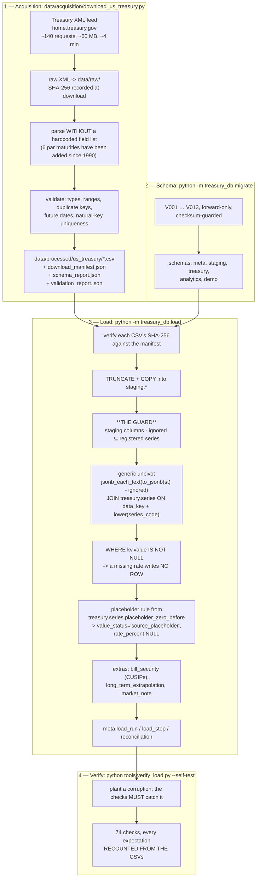
```mermaid
flowchart TD
    subgraph ACQ["1 — Acquisition: data/acquisition/download_us_treasury.py"]
        A1["Treasury XML feed<br/>home.treasury.gov<br/>~140 requests, ~60 MB, ~4 min"]
        A2["raw XML -> data/raw/<br/>SHA-256 recorded at download"]
        A3["parse WITHOUT a hardcoded field list<br/>(6 par maturities have been added since 1990)"]
        A4["validate: types, ranges, duplicate keys,<br/>future dates, natural-key uniqueness"]
        A5["data/processed/us_treasury/*.csv<br/>+ download_manifest.json<br/>+ schema_report.json<br/>+ validation_report.json"]
        A1-->A2-->A3-->A4-->A5
    end

    subgraph MIG["2 — Schema: python -m treasury_db.migrate"]
        B1["V001 … V013, forward-only,<br/>checksum-guarded"]
        B2["schemas: meta, staging, treasury,<br/>analytics, demo"]
        B1-->B2
    end

    subgraph LOAD["3 — Load: python -m treasury_db.load"]
        C1["verify each CSV's SHA-256<br/>against the manifest"]
        C2["TRUNCATE + COPY into staging.*"]
        C3["**THE GUARD**<br/>staging columns - ignored ⊆ registered series"]
        C4["generic unpivot<br/>jsonb_each_text(to_jsonb(st) - ignored)<br/>JOIN treasury.series ON data_key + lower(series_code)"]
        C5["WHERE kv.value IS NOT NULL<br/>-> a missing rate writes NO ROW"]
        C6["placeholder rule from<br/>treasury.series.placeholder_zero_before<br/>-> value_status='source_placeholder', rate_percent NULL"]
        C7["extras: bill_security (CUSIPs),<br/>long_term_extrapolation, market_note"]
        C8["meta.load_run / load_step / reconciliation"]
        C1-->C2-->C3-->C4-->C5-->C6-->C7-->C8
    end

    subgraph VER["4 — Verify: python tools/verify_load.py --self-test"]
        D1["plant a corruption; the checks MUST catch it"]
        D2["74 checks, every expectation<br/>RECOUNTED FROM THE CSVs"]
        D1-->D2
    end

    A5-->C1
    B2-->C1
    C8-->D1
```

### 11.6 Idempotency and updates

- **Deterministic.** The loader truncates the staging tables and runs `COPY` again. The unpivot is a pure function of the staging data and `treasury.series`. A second run gives a result that is identical byte for byte.
- **Forward-only migrations.** A checksum guard refuses an edit to an applied migration. Such edits make the databases of two developers differ silently.
- **No unverified bytes.** The loader first checks the SHA-256 of each CSV against the manifest. Other bytes are not the bytes that the acquisition step validated.
- **Lineage.** `meta.load_run`, `meta.load_step`, `meta.source_file` and `meta.reconciliation` let you trace each number back to a Treasury file, a URL and a checksum. The tool `explain_number` reads them.

### 11.7 The guard for the generic unpivot

The join to `treasury.series` decides which staging columns are rates.
The join is also the risk: **an unregistered column disappears, and each remaining number still looks correct.**
Nobody sees that a maturity is missing from a curve that they never saw complete.
Thus, before any insert, the loader checks this rule:

```
staging columns − ignored  ⊆  registered series codes
```

A violation stops the load and names the column:

```
daily_treasury_yield_curve: staging column(s) with no registered series:
['bc_2_5month']. Treasury has published a series this database does not know
about. Add it in a migration - do not let the load drop it.
```

**This failure is the feature. Silence is the defect.**
To add a maturity, write a new migration with a staging column and a `treasury.series` row.
The loader does not change, because the unpivot finds the columns and holds no list.
The full contract is in [`docs/loading-contract.md`](docs/loading-contract.md).

---

## 12. The PostgreSQL database

**Purpose.** Hold the Treasury rates as the source of record, with their meaning in the schema and a strict privilege boundary.

**Why PostgreSQL.** The data is relational and it has meaning.
A rate has no meaning without its series. A series has no meaning without its quote basis and its tenor.
Enums, check constraints, composite foreign keys and role grants make the rule "a discount rate can never be a par yield" a *property of the database*.
The application does not have to obey a convention.

### 12.1 Five schemas, each with one job

| Schema | Job | Visible to `mcp_reader`? |
|---|---|---|
| `staging` | One table for each CSV, an exact copy. The loader truncates it and runs `COPY` again at each load | **No** |
| `treasury` | The normalised source of record: `dataset`, `series`, `observation`, `bill_security`, `long_term_extrapolation`, `market_note` | **No** |
| `meta` | Lineage: `load_run`, `load_step`, `source_file`, `reconciliation` | Only `meta.source_file` |
| `analytics` | 15 views. The only rate surface that a component above the database sees | **Yes** (SELECT) |
| `demo` | Synthetic book and scenarios: `portfolio`, `instrument`, `position`, `scenario` | **Yes** (SELECT) |

### 12.2 Entity model


```mermaid
erDiagram
    dataset ||--o{ series : "publishes"
    dataset ||--o{ observation : "data_key"
    series ||--o{ observation : "series_id"
    load_run ||--o{ observation : "load_run_id"
    load_run ||--o{ load_step : ""
    load_run ||--o{ reconciliation : ""
    dataset ||--o{ source_file : "data_key + year"
    portfolio ||--o{ position : ""
    instrument ||--o{ position : ""

    dataset {
        text data_key PK
        text title
        text slug UK
        text source_url_pattern
        int documented_first_year
        text date_field
        enum shape "wide|long"
        text caveat "market-risk warning, IN the database"
    }
    series {
        int series_id PK
        text data_key FK
        text series_code UK "BC_10YEAR - Treasury's own name, never renamed"
        text display_name
        enum rate_kind "nominal|real"
        enum quote_basis "par_coupon_semiannual|bank_discount_act360|coupon_equivalent|average_real_yield"
        text tenor_label
        numeric tenor_value
        text tenor_unit
        numeric tenor_years
        date placeholder_zero_before "SEMANTICS AS DATA, not code"
        bool excluded_from_analytics
    }
    observation {
        int series_id PK, FK
        date observation_date PK
        text data_key FK "denormalised; composite FK forbids disagreement"
        numeric rate_percent "NULL means Treasury published nothing"
        enum value_status "observed|source_placeholder"
        numeric source_value_percent "what the source actually printed"
        text source_file
        bigint load_run_id FK
    }
    bill_security {
        date observation_date PK
        text tenor_code PK
        text cusip
        date maturity_date
    }
    load_run {
        bigint load_run_id PK
        timestamptz started_at
        text status
    }
    source_file {
        text data_key
        int year
        text sha256 "provenance root"
        text url
    }
    portfolio {
        text portfolio_id PK "SYNTHETIC_DEMO"
        text name
        text seed_version
    }
    instrument {
        text instrument_id PK
        numeric coupon_rate
        date maturity_date
        text day_count
        int payment_frequency
    }
    position {
        text portfolio_id PK, FK
        text instrument_id PK, FK
        numeric face_notional
    }
    scenario {
        text scenario_id PK
        text scenario_type "TENOR_VECTOR_BP|HISTORICAL_REPLAY"
        jsonb shock_definition
    }
```

### 12.3 Two rules that the schema enforces

1. **A new maturity is a ROW, not a column.** Treasury added six maturities to the par curve after 1990 and expects to add more. A wide table needs DDL, a migration and an application change each time. Here, `BC_1_5MONTH` (new in 2025) is one `INSERT` into `treasury.series`. The loader reads it at the next run.
2. **Each rate carries its quote basis.** As bare numbers in adjacent columns, a bill discount rate and a par coupon yield look the same. At some time, somebody plots them on one curve. `quote_basis` prevents this error by accident and makes it easy to filter.

### 12.4 The constraints that make NULL mean NULL

```sql
CONSTRAINT observation_rate_is_plausible
    CHECK (rate_percent IS NULL OR rate_percent BETWEEN -25 AND 100)

CONSTRAINT observation_status_matches_value
    CHECK (
        (value_status = 'observed'           AND rate_percent IS NOT NULL)
     OR (value_status = 'source_placeholder' AND rate_percent IS NULL
                                             AND source_value_percent IS NOT NULL)
    )
```

The plausibility band is wide on purpose. Only corrupt data can fail it.
**Negative rates are correct and permitted.** The real curve often shows them.

A placeholder row keeps the value that the source printed in `source_value_percent`. Thus the trap stays auditable, and nothing erases it.

### 12.5 Indexes

| Index | Table | Purpose |
|---|---|---|
| PK `(series_id, observation_date)` | `observation` | The natural key |
| `observation_date_idx` | `observation` | Curve reads at one point in time |
| `observation_dataset_date_idx` | `observation` | Ranges for each dataset |
| `observation_date_brin_idx` (BRIN) | `observation` | Cheap range scans on a table in date sequence |
| `series_data_key_idx`, `series_tenor_idx` | `series` | Catalogue and tenor-range filters |
| `source_file_data_key_year_idx` | `meta.source_file` | Provenance lookup |
| `load_step_run_idx`, `reconciliation_run_idx` | `meta` | Lineage joins |

### 12.6 The analytics views

| View | What it serves |
|---|---|
| `v_series`, `v_observation` | The tidy long form and the catalogue |
| `v_par_yield_curve`, `v_real_yield_curve` | Pivoted curves by date |
| `v_bill_rates_quoted`, `v_long_term_rates` | The other three datasets |
| `v_latest_rates`, `v_series_coverage`, `v_dataset_summary` | Current state and coverage |
| `v_source_file_current` | Provenance for `explain_number` |
| `v_mcp_observation`, `v_mcp_curve`, `v_mcp_portfolio_position` | The MCP read surface |
| `v_mcp_series_catalogue`, `v_mcp_dataset` | Catalogue tools |

`V013__mcp_curve_single_source.sql` defines `v_mcp_curve` again.
Nominal and real curves now come from one source, not from two definitions that can drift apart.

### 12.7 The privilege boundary

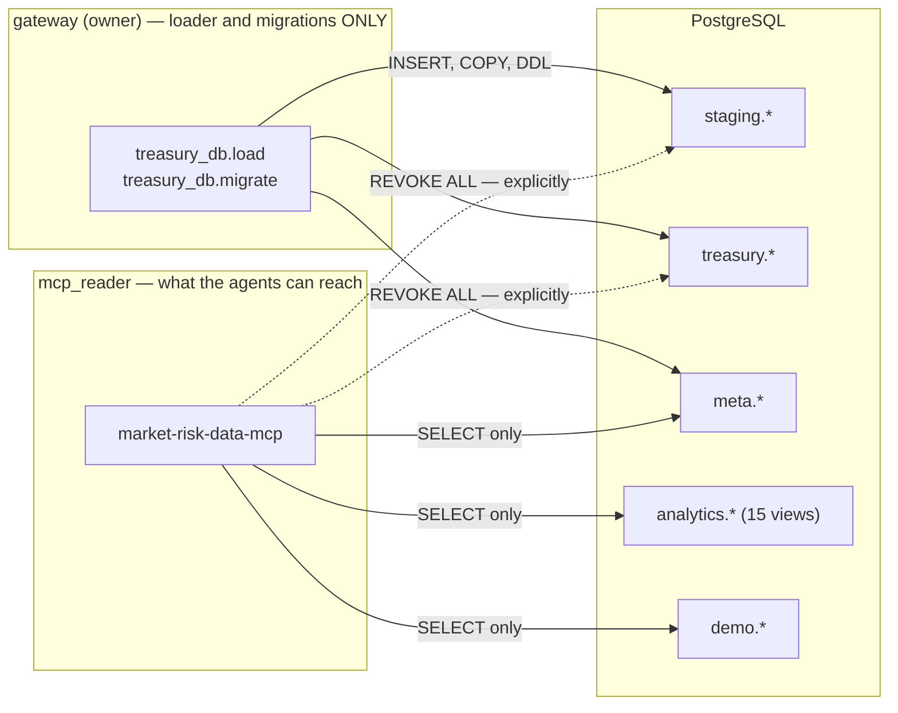
```mermaid
flowchart LR
    subgraph OWNER["gateway (owner) — loader and migrations ONLY"]
        L["treasury_db.load<br/>treasury_db.migrate"]
    end
    subgraph READER["mcp_reader — what the agents can reach"]
        MS["market-risk-data-mcp"]
    end
    subgraph DB["PostgreSQL"]
        ST["staging.*"]
        TR["treasury.*"]
        MT["meta.*"]
        AN["analytics.* (15 views)"]
        DM["demo.*"]
    end
    L -->|"INSERT, COPY, DDL"| ST
    L --> TR
    L --> MT
    MS -->|"SELECT only"| AN
    MS -->|"SELECT only"| DM
    MS -->|"SELECT only"| MT
    MS -.->|"REVOKE ALL — explicitly"| TR
    MS -.->|"REVOKE ALL — explicitly"| ST
```

`V009__mcp_reader.sql`:

```sql
GRANT CONNECT ON DATABASE gateway TO mcp_reader;
GRANT USAGE, SELECT ON SCHEMA/TABLES analytics TO mcp_reader;
GRANT USAGE, SELECT ON SCHEMA/TABLES demo      TO mcp_reader;
GRANT USAGE  ON SCHEMA meta TO mcp_reader;
GRANT SELECT ON meta.source_file TO mcp_reader;   -- the one exception

REVOKE ALL ON SCHEMA treasury FROM mcp_reader;
REVOKE ALL ON ALL TABLES IN SCHEMA treasury FROM mcp_reader;
REVOKE ALL ON SCHEMA staging  FROM mcp_reader;
REVOKE ALL ON ALL TABLES IN SCHEMA staging  FROM mcp_reader;
REVOKE ALL ON ALL TABLES IN SCHEMA meta FROM mcp_reader;
GRANT  SELECT ON meta.source_file TO mcp_reader;
```

The `REVOKE` statements are explicit, also where the default already denies access.
A future `GRANT … ON ALL TABLES` thus cannot silently widen a boundary that is on the record.
`ALTER DEFAULT PRIVILEGES` keeps a new analytics view readable with no manual grant.
`python -m mcp_servers.host --isolation` proves that the risk engine cannot reach the database.

A separate role, `gateway_readonly` (NOLOGIN, in `V007__grants.sql`), is for read access by humans and BI tools.
It is broader: it can see `treasury.dataset` and `treasury.series`.

### 12.8 How the MCP layer queries

- **No model writes SQL.** Each statement is in `mcp/src/mcp_servers/data/repository.py`, and each statement is parameterised.
- **Only `analytics.*` and `demo.*` are reachable**, by grant.
- **Row limits are explicit and have names**: a maximum of 32 series codes for coverage, a maximum of 16 for history, `repo.DEFAULT_HISTORY_PAGE` for pagination, `MAX_DISPLAY_ROWS = 500` in the agent.
- **Pagination uses cursors.** `MCP_CURSOR_KEY` signs each cursor, so it stays valid after a server restart. If the key is not set, a cursor is valid only in the life of the process.
- **Dates never move silently.** `get_curve(date_policy=…)` has the default `exact`. A caller must ask for `previous` or `next` to accept a shift.
- **Gaps are refused by default.** `get_curve_history_matrix(missing_policy="reject")` does not return a window with holes, because a silent drop of dates changes each risk number from that window. `intersection` accepts gaps and reports `excluded_dates`.
- **Rates are `numeric(9,4)` in percent, as published.** `3.72` means 3.72%. It is not a decimal fraction and not basis points.

---

## 13. The knowledge stores: Qdrant and embeddings

**Purpose.** Store the methodology knowledge as vectors, and give the domain expert the passages that a question needs.

**Why Qdrant.** The knowledge layer answers *semantic* questions, for example "what assumptions does historical simulation make?". No relational index can answer them.
Qdrant runs embedded (a local path, no Docker) or against a server in Docker. `QDRANT_URL` selects the mode.
Thus the `VectorStore` seam has two real implementations, not one.

### 13.1 The knowledge ingestion

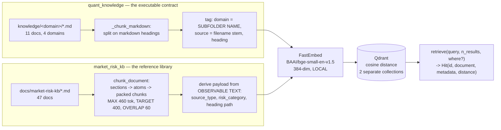
```mermaid
flowchart LR
    subgraph EXEC["quant_knowledge — the executable contract"]
        K1["knowledge/&lt;domain&gt;/*.md<br/>11 docs, 4 domains"]
        K2["_chunk_markdown:<br/>split on markdown headings"]
        K3["tag: domain = SUBFOLDER NAME,<br/>source = filename stem, heading"]
        K1-->K2-->K3
    end
    subgraph REF["market_risk_kb — the reference library"]
        R1["docs/market-risk-kb/*.md<br/>47 docs"]
        R2["chunk_document:<br/>sections -> atoms -> packed chunks<br/>MAX 460 tok, TARGET 400, OVERLAP 60"]
        R3["derive payload from OBSERVABLE TEXT:<br/>source_type, risk_category, heading path"]
        R1-->R2-->R3
    end
    E["FastEmbed<br/>BAAI/bge-small-en-v1.5<br/>384-dim, LOCAL"]
    K3-->E
    R3-->E
    E-->Q[("Qdrant<br/>cosine distance<br/>2 separate collections")]
    Q-->RET["retrieve(query, n_results, where?)<br/>-> Hit(id, document, metadata, distance)"]
```

**The reference corpus needs its own chunker.**
`BAAI/bge-small-en-v1.5` truncates at 512 tokens *silently*.
The tokenizer has truncation on, so the model embeds only the first 512 tokens of a large section. Nothing represents the remainder.
A measurement on `docs/market-risk-kb/` with chunks split only at headings gave this result:

- **1,402 chunks**
- **99 chunks** larger than 512 tokens
- **26,413 tokens lost (8.2% of the corpus)**

The worst case was a calculation catalogue section of 2,576 tokens with 66 calculations. Only about 13 of them were searchable.

Truncation is a dangerous failure, because nobody can see it.
The collection reports the correct chunk count, and retrieval returns plausible neighbours.
But the missing two thirds of a table never match a query.

Three properties make the retrieved text usable, not only small:

- **Each chunk carries its full heading path** as a prefix. Thus an isolated group of table rows starts with `# 31 - Master Calculation Catalog / ## B. Interest Rate Sensitivities`.
- **The blockquote header of a category is in each chunk of that section.** It states the market data, the aggregation level and the regulatory use for the full category.
- **A split table repeats its header row.** Nobody can read `| IR-02 | Modified duration | … |` without `| ID | Calculation | Alt names | … |` above it.

**Idempotency.** The chunk ids are deterministic, so a second run upserts in place.
A document can now give *fewer* chunks than at the last run. The old extra chunks then stay retrievable with no end.
For this reason, the `VectorStore` interface has `ids_where()` and `delete()`, and the reference ingest removes these orphans.

### 13.2 The two collections

| Collection | Purpose | Content | Source | Embedding model | Dimensions | Distance | Chunks |
|---|---|---|---|---|---|---|---|
| **`quant_knowledge`** | **Executable analytical contract**. The only corpus that can support an operational constraint | 11 documents in 4 domains. **71 points** (checked by `tests/use_cases/test_question_catalog.py`) | `knowledge/<domain>/*.md` | `BAAI/bge-small-en-v1.5` | **384** | **Cosine** | Split at headings (`_chunk_markdown`) |
| **`market_risk_kb`** | **Reference library**: terminology, calculation choice, risk factors, formulas, regulation | 47 documents, about 167,000 words | `docs/market-risk-kb/*.md` | `BAAI/bge-small-en-v1.5` | **384** | **Cosine** | Follows the heading hierarchy, with a token budget (`markdown_chunker.py`) |

> [!NOTE]
> No test checks the point count of `market_risk_kb`, so this README does not state it as a fact. Ask the running instance: `curl -s localhost:6333/collections/market_risk_kb`.

#### 13.2.1 `quant_knowledge` — the 11 documents

| Domain | Documents |
|---|---|
| `market_risk` | `var`, `expected_shortfall`, `stress_testing`, `sensitivities_greeks`, `yield_curve` |
| `credit_risk` | `pd_lgd_ead`, `credit_ratings_pd` |
| `regulatory_capital` | `rwa`, `basel_capital_ratios` |
| `xva` | `cva`, `exposure_metrics` |

**The subfolder name *is* the domain tag.** This is the full tag mechanism. Thus `retrieve(query, domain="credit_risk")` works with no registry.

These documents are **executable analytical contracts**, not only text. Each document does these things:

- It states its *Required inputs* as canonical concepts.
- It names the real MCP tool that calculates the metric (`compute_historical_risk_tool`, `compute_dv01_tool`, `run_stress_tool`, `get_curve`, and others).
- It ends with a ***Mapping status*** table. The table records if each input resolves to real data. Thus it records if the mode is **Calculate + Explain** or **Explain-only**.

CVA and RWA have no counterparty data, so the system explains them but never calculates them.
**The knowledge never asks for data that the system does not have.**

#### 13.2.2 `market_risk_kb` — the 47 documents

This corpus holds the taxonomy, the instrument coverage, the treatment of each risk class, VaR, ES and stress, and the FRTB framework.
It also holds six large reference catalogues: calculations, formulas, risk factors, glossary, question-to-calculation and dependency graph.

The payload metadata (`source_type`, `risk_category`, heading path, document title) **comes from text that you can see**.
A regular expression reads the heading path, the document title or the body of the chunk. Nothing is inferred.
If a field has no match, the code *omits it and does not guess*.
A `risk_category` that nobody can trace to a line of the document is worse than no value. At some time, a filter will use it.

### 13.3 Two collections, not one

One collection with a `corpus` payload field is not sufficient. All three reasons are about the blast radius:

1. `KnowledgeBase(rebuild=True)` calls `store.reset()`, which **deletes the collection**. With one shared collection, the documented re-ingest command for `knowledge/` silently deletes the market-risk vectors. A payload flag cannot give protection against a delete of the full collection.
2. The two corpora have **different chunks**. With one schema for both, one of them gives false information about how it was built.
3. **You can measure retrieval for each corpus.** Thus a regression in one corpus is visible, and an average does not hide it.

### 13.4 Retrieval

```python
store.query(text, n_results=3, where=None) -> list[Hit]
# Hit(id, document, metadata, distance)   # distance = 1.0 - cosine similarity
```

| Aspect | Behaviour |
|---|---|
| Top-k | `DomainExpertAgent(n_results=6)` by default. The reference retrieval takes `market_risk_n_results` and limits the kept chunks with `max_reference_chunks` |
| Queries for each corpus | **Two**, merged by the best distance. "What is expected shortfall" and "how many observations does it read" cannot both be near one embedding |
| Score | `score = 1.0 - distance`, rounded to 4 decimal places. The UI shows it in the citation |
| Filter | Optional payload filter (`{"domain": "credit_risk"}`) with `models.Filter` / `FieldCondition` |
| Merge | By the best distance over both queries. Duplicates collapse on the chunk id |
| Point ids | Qdrant requires uint or UUID. The code derives a stable UUID5 from the string id. This makes the upsert idempotent |
| Bookkeeping | `ids_where()` **scrolls** and does not search. "What does this document own now?" is not a similarity question. A query vector silently stops at the search limit |

### 13.5 How the retrieved context goes into the prompt

The prompt has two blocks with labels. The code never merges them:

```
MARKET RISK REFERENCE CONTEXT        <- may inform terminology and calculation choice
   …chunks from market_risk_kb…

EXECUTABLE KNOWLEDGE CONTEXT         <- the ONLY section that may support an exact
   …chunks from quant_knowledge…        operational field, window, row count or parameter
```

The code then checks the row-count quote against **the retrieved text**. Thus nothing from either block can go into the requirement without a quote.

### 13.6 The embedding model

| Item | Value |
|---|---|
| **Model** | **`BAAI/bge-small-en-v1.5`** |
| **Library and provider** | `fastembed`, included with `qdrant-client[fastembed]` ≥ 1.12 |
| **Dimensions** | **384** |
| **Distance metric** | **Cosine** (`models.Distance.COSINE`) |
| **Hard token limit** | **512** (`MODEL_LIMIT`). Truncation is **silent** |
| **Local or API** | **Local.** No external embedding API, no embedding key, no cost for each embedding token |
| **Where generated** | `QdrantVectorStore._embed()`, at ingest and at query time. Thus the two can never drift apart |
| **Normalisation** | None in this repository. The code uses the vectors as FastEmbed returns them. Cosine distance does not change with the vector length |

**Why this model is a good fit.** The corpora are English technical text of some hundred thousand words, not billions.
384 dimensions keep the index small and the queries fast.
A *local* model lets ingest and retrieval work with no network, no key and no vendor dependency.
This is important, because `llm/` is already a seam. A second mandatory vendor cancels that benefit.

**The 512-token limit is the reason for a full chunker.** The tokenizer truncates silently (see [13.1](#131-the-knowledge-ingestion)). Text is lost, but each count still looks correct.
The budget is `MAX_TOKENS = 460`, not 512. The difference is necessary for two reasons:

- The code measures a packed chunk as `count(head) + count(body)`. The tokenizer does not always give the same count across that join. The measured drift was up to **+12 tokens** on a corpus with many Sigma signs, subscripts and middle dots.
- The ingest adds a document title (about 15 tokens) before each chunk whose outermost heading is not the heading of the document.

The margin changes a hope into a guarantee.

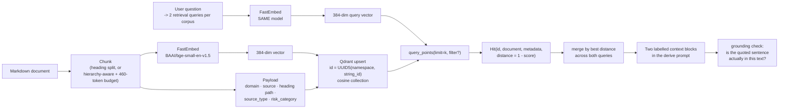
```mermaid
flowchart LR
    D["Markdown document"] --> C["Chunk<br/>(heading split, or<br/>hierarchy-aware + 460-token budget)"]
    C --> P["Payload<br/>domain · source · heading path ·<br/>source_type · risk_category"]
    C --> E1["FastEmbed<br/>BAAI/bge-small-en-v1.5"]
    E1 --> V["384-dim vector"]
    V --> QU["Qdrant upsert<br/>id = UUID5(namespace, string_id)<br/>cosine collection"]
    P --> QU

    Q["User question<br/>-> 2 retrieval queries per corpus"] --> E2["FastEmbed<br/>SAME model"]
    E2 --> V2["384-dim query vector"]
    V2 --> S["query_points(limit=k, filter?)"]
    QU --> S
    S --> H["Hit(id, document, metadata,<br/>distance = 1 - score)"]
    H --> MG["merge by best distance<br/>across both queries"]
    MG --> CTX["Two labelled context blocks<br/>in the derive prompt"]
    CTX --> GR["grounding check:<br/>is the quoted sentence<br/>actually in this text?"]
```

### 13.7 Qdrant and PostgreSQL compared

The source code confirms this division. Both stores can supply parts of one answer.

| Item | **Qdrant** | **PostgreSQL** |
|---|---|---|
| Holds | Semantic and reference knowledge, as text | Structured analytical data, as numbers |
| Answers | "What does this method require?", "When do I use ES and not VaR?" | "What was the 10-year yield on 1995-06-15?" |
| Read by | The **Domain Expert** only | The **data MCP server** only |
| Query type | k-NN over 384-dimension cosine vectors | Parameterised SQL over the `analytics.*` views |
| Written by | `KnowledgeBase.ingest()` / `MarketRiskKnowledgeBase.ingest()` | `treasury_db.load` as the owner role |
| Authority for | *Methodology*, also the number of trading days that a VaR reads | *Facts*: each rate, each date, each position |
| Changed by | A domain expert, with a Markdown edit and a re-ingest | Only a new acquisition and load |

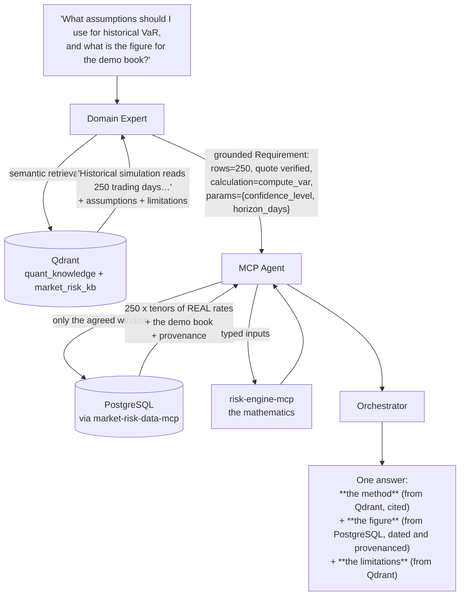
```mermaid
flowchart TD
    Q["'What assumptions should I use for historical VaR,<br/>and what is the figure for the demo book?'"]

    Q --> A["Domain Expert"]
    A -->|"semantic retrieval"| QD[("Qdrant<br/>quant_knowledge + market_risk_kb")]
    QD -->|"'Historical simulation reads 250 trading days…'<br/>+ assumptions + limitations"| A
    A -->|"grounded Requirement:<br/>rows=250, quote verified,<br/>calculation=compute_var,<br/>params={confidence_level, horizon_days}"| M["MCP Agent"]
    M -->|"only the agreed window"| PG[("PostgreSQL<br/>via market-risk-data-mcp")]
    PG -->|"250 x tenors of REAL rates<br/>+ the demo book<br/>+ provenance"| M
    M -->|"typed inputs"| RE["risk-engine-mcp<br/>the mathematics"]
    RE --> M
    M --> O["Orchestrator"]
    O --> ANS["One answer:<br/>**the method** (from Qdrant, cited)<br/>+ **the figure** (from PostgreSQL, dated and provenanced)<br/>+ **the limitations** (from Qdrant)"]
```

### 13.8 Prove that nothing is hard-coded

This demonstration takes three commands and about sixty seconds:

```bash
# 1. edit knowledge/market_risk/var.md — change "250 trading days" to "500 trading days"
# 2. re-ingest
python -c "from backend.knowledge.knowledge_base import KnowledgeBase; KnowledgeBase(rebuild=True)"
# 3. ask the same question again — the requirement now reads 500, and cites the edited sentence
```

It needs no code change, no release and no engineer.
`tests/test_model_provider.py` checks that the integer literal `250` is nowhere in `llm/`.
It runs the carry-through test with each of these values: 30 · 60 · 90 · 125 · 250 · 365 · 500 · 750.

---

## 14. The Redis cache

**Purpose.** Keep validated specialist work for reuse, coordinate concurrent calls and record operational evidence. Redis is optional, and it fails open.

### 14.1 Status: implemented and connected

The audit checked this in the code. Redis is not a configuration stub:

| Evidence | Location |
|---|---|
| 13 modules, about 2,700 lines | `agents/cache/` |
| Both specialists call it | `agents/domain_expert_agent.py` and `agents/mcp_agent.py` both contain `from agents.cache import get_intelligence` |
| Connected to the network | `agents/a2a/runtime.py` builds it and gives it to `DomainExpertAgent` and `McpAgent` |
| Reported at runtime | `GET /health` → `redis`. `GET /health?analytics=true` adds top questions, latency percentiles and stream lengths |
| Compose service | `redis:8.8.2` with AOF + RDB, `volatile-lfu`, and RedisInsight on port 5540 |
| Tests | `tests/test_redis_intelligence.py` |
| Documentation | [`docs/redis.md`](docs/redis.md) |

**There are two different defaults.**

- In the code, `RedisConfig.enabled` is **`False`** by default. Thus an import of this library in a unit test does not try to reach a server.
- The supplied `.env.example` sets `REDIS_ENABLED=true`, and Compose overrides `REDIS_URL` in the agent container.

Thus Redis is **on by default for the full local stack, and off by default for a bare import**.

> [!NOTE]
> Redis is derived memory, not an authority. PostgreSQL owns the data, and Qdrant owns the knowledge.
> A Redis failure is a cache miss, unless `REDIS_REQUIRED=true`.

### 14.2 What the cache keeps

`agents/cache/policies.py` is the single matrix. **No agent contains a TTL constant.**

| Agent | Operation | Exact cache | Semantic cache | TTL (environment variable) | Expensive LLM? |
|---|---|---|---|---|---|
| `domain_expert` | `retrieve` | ✅ | ✖ | `REDIS_DOMAIN_RETRIEVAL_TTL` = 900 s | No |
| `domain_expert` | `retrieve_reference` | ✅ | ✖ | 900 s | No |
| `domain_expert` | **`derive`** | ✅ | **✅** | `REDIS_DOMAIN_DERIVE_TTL` = 86,400 s | **Yes** |
| `domain_expert` | `revise` | ✅ | ✖ | `REDIS_DOMAIN_REVISE_TTL` = 43,200 s | **Yes** |
| `domain_expert` | `validate_result` | ✅ | ✖ | `REDIS_DOMAIN_VALIDATE_TTL` = 3,600 s | **Yes** |
| `mcp_agent` | `catalogue` | ✅ | ✖ | `REDIS_MCP_CATALOGUE_TTL` = 300 s | No |
| `mcp_agent` | **`assess`** | ✅ | ✖ | `REDIS_MCP_ASSESS_TTL` = 21,600 s | **Yes** |
| `mcp_agent` | `choices` | ✅ | ✖ | `REDIS_MCP_CHOICES_TTL` = 300 s | No |
| `mcp_agent` | **`execute`** | **✖ (not in the matrix, by design)** | ✖ | — | — |

**The cache never keeps an MCP execution.** A comment in the policy module gives the reason: *"A historical result is cacheable only when every provider exposes an immutable snapshot identity. The current seam does not, so 'latest' and '2008' both execute normally."*
`execution_cacheability()` exists only to make this refusal explicit. It returns `(False, "historical_snapshot_identity_not_exposed_by_provider")`.

Thus **a repeated question can skip a reasoning call, but never a data fetch or a calculation.**

### 14.3 Key structure

`KeyBuilder` holds each key shape in one file. The namespace is `{REDIS_CACHE_PREFIX}` (default `smcp`).

| Shape | Purpose |
|---|---|
| `smcp:cache:{agent}:{operation}:{sha256}` | Exact cache entry |
| `smcp:semantic:{agent}:{operation}:{sha256}` | Semantic cache entry (JSON + vector) |
| `smcp:idx:semantic` | The vector index over the semantic entries |
| `smcp:lock:{digest}` | Single-flight lease |
| `smcp:run:{request_id}` · `smcp:idx:runs` | Run summary for each turn (`REDIS_RUN_SUMMARY_TTL` = 7 days) |
| `smcp:stream:agent-events` | Bounded Stream (`REDIS_AGENT_STREAM_MAXLEN` = 50,000) |
| `smcp:stats:counters` · `smcp:stats:question-frequency:{scope}` · `smcp:stats:cache-expiry` | Counters and frequency |
| `smcp:ts:{agent}:{operation}:{metric}` | TimeSeries (`REDIS_METRICS_RETENTION_SECONDS` = 30 days) |
| `smcp:rate:llm:{scope}` | Fixed-window LLM rate limit |

**The digest makes an entry safe to use again.**
It is a SHA-256 over `{identity, versions, model, result_kind}`.

- `versions` holds the **corpus content version**, the **prompt version** and the **schema version** (`agents/cache/versions.py`).
- `model` holds the resolved backend and the model id.

If you edit a knowledge document, change a prompt, change a schema or change `LLM_BACKEND`, each derived entry gets a different key.
There is no invalidation step to forget. Nothing asks for the old key again.

### 14.4 Cache hit and miss, with single-flight

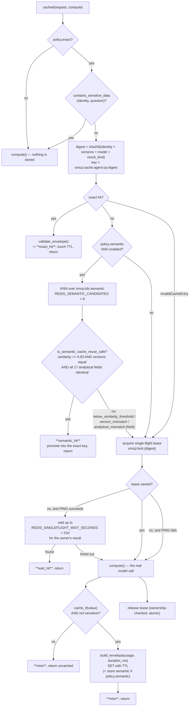
```mermaid
flowchart TD
    A["cached(request, compute)"] --> P{"policy.exact?"}
    P -->|no| Z["compute() — nothing is stored"]
    P -->|yes| SEC{"contains_sensitive_data<br/>(identity, question)?"}
    SEC -->|yes| Z
    SEC -->|no| K["digest = sha256(identity + versions + model + result_kind)<br/>key = smcp:cache:agent:op:digest"]
    K --> EX{"exact hit?"}
    EX -->|yes| EXH["validate_envelope()<br/>-> **exact_hit**, touch TTL, return"]
    EX -->|no| SM{"policy.semantic<br/>AND enabled?"}
    SM -->|yes| SMQ["KNN over smcp:idx:semantic<br/>REDIS_SEMANTIC_CANDIDATES = 8"]
    SMQ --> GATE{"is_semantic_cache_reuse_safe?<br/>similarity >= 0.93 AND versions equal<br/>AND all 17 analytical fields identical"}
    GATE -->|"yes"| SMH["**semantic_hit**<br/>promote into the exact key, return"]
    GATE -->|"no: below_similarity_threshold /<br/>version_mismatch /<br/>analytical_mismatch:{field}"| LOCK
    SM -->|no| LOCK
    EX -->|"InvalidCacheEntry"| LOCK
    LOCK["acquire single-flight lease<br/>smcp:lock:{digest}"] --> OWN{"lease owned?"}
    OWN -->|"no, and PING succeeds"| WAIT["wait up to<br/>REDIS_SINGLEFLIGHT_WAIT_SECONDS = 310<br/>for the owner's result"]
    WAIT -->|"found"| WH["**wait_hit**, return"]
    WAIT -->|"timed out"| CMP
    OWN -->|"yes"| CMP
    OWN -->|"no, and PING fails"| CMP
    CMP["compute() — the real model call"] --> CIF{"cache_if(value)<br/>AND not sensitive?"}
    CIF -->|no| RET["**miss**, return uncached"]
    CIF -->|yes| ST["build_envelope(usage, duration_ms)<br/>SET with TTL<br/>(+ store semantic if policy.semantic)"]
    ST --> RET2["**miss**, return"]
    CMP --> REL["release lease (ownership-checked, atomic)"]
```

The cache records four different outcomes, not two: `exact_hit`, `semantic_hit`, `wait_hit` and `miss`.
Each outcome has its Redis latency, and `_trace_cache_status()` shows each one in the LangSmith trace.

**The `SET NX` detail.** A lease that is not owned can mean contention *or* a Redis that is not available.
A bounded `PING` tells the two cases apart.
In an outage, the code calculates **now**. It does not wait minutes for the result of an owner that does not exist.

### 14.5 Why the semantic cache cannot give a wrong answer

Vector similarity alone does *not* authorize reuse. `is_semantic_cache_reuse_safe()` requires **all** of these conditions:

1. `similarity >= REDIS_SEMANTIC_SIMILARITY_THRESHOLD` (0.93)
2. a `metric` in the analytical signature of the query that is not empty
3. **exact equality of each version** (corpus, prompt, schema, model)
4. **exact equality of all 17 material analytical fields**: `policy_version`, `metric`, `method`, `confidence_level`, `horizon_days`, `lookback_days`, `curve_family`, `tenors`, `temporal_mode`, `temporal_values`, `requested_fields`, `requested_rows`, `portfolio`, `scenario`, `shock_bp`, `numbers`, `calculation_params`

A refusal names its reason, for example `analytical_mismatch:confidence_level`. Thus you can diagnose a hit rate that is too low.
**"99% VaR" and "97.5% VaR" are almost identical in meaning, but they can never share a cache entry here.**

### 14.6 The other Redis functions

| Capability | Mechanism | Configured by |
|---|---|---|
| **Single-flight** | A lock that checks its owner and releases atomically. The wait stays *below* the A2A turn deadline | `REDIS_LOCK_TTL_MS` = 360,000 · `REDIS_SINGLEFLIGHT_WAIT_SECONDS` = 310 |
| **LLM rate limit** | Redis 8.8 `INCREX`, atomic across processes, fixed window. **Zero turns a limit off**, and all three limits have the default 0 | `REDIS_GLOBAL_LLM_RATE_LIMIT`, `REDIS_DOMAIN_LLM_RATE_LIMIT`, `REDIS_MCP_LLM_RATE_LIMIT`, `REDIS_LLM_RATE_WINDOW_SECONDS` |
| **Operational evidence** | Streams (with a cap), TimeSeries (with a retention limit), counters, question frequency (with a cap), run summaries | `REDIS_AGENT_STREAM_MAXLEN`, `REDIS_METRICS_RETENTION_SECONDS`, `REDIS_QUESTION_FREQUENCY_MAX_ENTRIES`, `REDIS_RUN_SUMMARY_TTL` |
| **Run completion** | `complete_run(request_id, question, route, result_status, total_latency_ms, negotiation_rounds)`. `/chat` calls it inside a wrapper, so **the analytics never change the response** | `REDIS_RUN_SUMMARY_TTL` |
| **Admin** | `clear(scope)` for `all` / `domain` / `mcp` / `semantic`, with `SCAN` + `UNLINK` in batches | — |
| **Redaction** | `contains_sensitive_data()` / `redact_sensitive()` check the key material and the value before each write | — |

### 14.7 Measured savings

**The repository has no benchmark for the savings.** The structural facts are these:

- A `derive` hit skips one reasoning call of the domain expert (`_MIN_TOKENS = 12,000`).
- An `assess` hit skips one reasoning call of the MCP agent (`_MIN_TOKENS = 10,000`).
- `agents/cache/telemetry.py` records the token usage and the duration of each skipped call. Thus you can *measure the saving on a running instance* with `GET /health?analytics=true`.

This README claims no figure that the repository does not contain.

---

## 15. The MCP layer

**Purpose.** Give the reasoning tier its only road to the data and the mathematics, through two MCP servers.

The layer uses **protocol revision `2026-07-28` and SDK `mcp>=2.0.0`.**
Three primitives go from client to server. Three primitives go the other way, during a call.

```mermaid
flowchart LR
    subgraph AGENT["Reasoning tier"]
        MA["McpAgent"]
        RW["RiskWorkflows (adapter)"]
    end
    subgraph CLIENT["MCP client — one warm event loop on a daemon thread"]
        DP["McpDataProvider<br/>(DataProvider seam)"]
        HOST["McpHost<br/>session.discover()<br/>MRTR retry loop"]
    end
    subgraph SERVERS["MCP servers — stdio child processes"]
        DS["**market-risk-data-mcp**<br/>14 tools · 5 resources · 3 prompts<br/>+ elicitation, roots, sampling"]
        RS["**risk-engine-mcp**<br/>42 tools · 7 resources · 8 prompts<br/>NO database credential"]
    end
    PG[("PostgreSQL<br/>analytics.* + demo.*")]

    MA --> DP
    RW --> DP
    DP --> HOST
    HOST -->|"stdio JSON-RPC<br/>tools/call · resources/read · prompts/get"| DS
    HOST -->|"stdio JSON-RPC"| RS
    DS -->|"psycopg2 as mcp_reader<br/>parameterised SQL only"| PG
    DS -.->|"InputRequiredResult:<br/>Elicit · ListRoots · Sample"| HOST
    HOST -.->|"retry the ORIGINAL call with<br/>input_responses + request_state"| DS
```

### 15.1 All six primitives are live

| Primitive | Direction | Location | What it does |
|---|---|---|---|
| **Tools** | Client → server | Both servers | 14 data tools, 42 risk tools |
| **Resources** | Client → server | Both servers | Catalogues, caveats, provenance, methodology, capability gaps |
| **Prompts** | Client → server | Both servers | Recommended tool sequences, published as slash commands |
| **Elicitation** | **Server → client, during a call** | `search_series` | `'30 year'` matches `BC_30YEAR` *and* `TC_30YEAR`. The server **asks** and does not select one |
| **Roots** | **Server → client, during a call** | `export_curve_csv` | The client grants a folder. The server writes only in it |
| **Sampling** | **Server → client, during a call** | `brief_dataset_caveat` | The data server has no model, so it borrows the model of the host |

### 15.2 How the three server-to-client primitives work

The three primitives use one mechanism, not three.
A tool parameter with the annotation `Annotated[T, Resolve(fn)]` gets its value from `fn`, which runs **before** the tool body.
`fn` can return `Elicit[T]`, `ListRoots` or `Sample` in place of a value.
The framework then returns an `InputRequiredResult`.
The client answers with a **retry of the original call** that carries `input_responses` + `request_state`.
This is MRTR (Multi-Round Tool Request/Response).

```mermaid
sequenceDiagram
    participant A as McpAgent
    participant H as McpHost.call
    participant S as MCP server
    participant U as (Orchestrator -> User)

    A->>H: call_tool("search_series", {query: "30 year"})
    H->>S: tools/call
    S->>S: Resolve(resolve_rate_kind) runs BEFORE the body
    S-->>H: InputRequiredResult(required_information, request_state)
    alt elicitation_mode = "relay" (the agent stack)
        H-->>A: surfaced as task state input-required
        A-->>U: structured field names + allowed answers
        U-->>A: the user's reply, matched deterministically
    else elicitation_mode = "prompt" (the standalone CLI only)
        H->>H: ask on the terminal
    end
    A->>H: retry with input_responses + request_state
    H->>S: tools/call (SAME call, now answered)
    S->>S: the resolver returns a value; the body runs
    S-->>H: CallToolResult
    H-->>A: result
```

`McpHost.call` runs this retry loop. Thus **the provider seam and the reasoning agent never see it.**
The `prompt` mode of the MCP host is only for the standalone CLI. The agent stack runs `relay`.

### 15.3 `discover()`, never `initialize()`

> [!IMPORTANT]
> The host must connect with `session.discover()`.
> `initialize` is the handshake from before 2026, and it negotiates a maximum of `2025-11-25`.
> On that revision, the three primitives fall back to *deprecated standalone server-to-client requests*.
> `discover()` is the stateless entry point of `2026-07-28`.
> `tools/verify_mcp.py` checks the negotiated revision, so this cannot regress silently.

### 15.4 Transport, sessions and processes

- **The transport is stdio, not HTTP.** The host starts each server as a child process (`python -m mcp_servers.data.server`, `python -m mcp_servers.risk.server`).
- **Do not start a server by hand.** If you do, remember that **stdout is the protocol channel**. One stray `print()` damages the stream, and the client then disconnects for no clear reason. Diagnostics go to stderr.
- **The child processes stay warm.** `McpDataProvider` runs one event loop on a daemon thread for the life of the process. It sends synchronous calls to this loop. It does not start servers for each call, so no question pays the process startup time.
- **Only the data server gets the database environment keys** (`ServerSpec(..., DATA_ENV_KEYS)`). The host starts the risk server with `()`. Its isolation is a fact of its process environment, not a promise in a docstring. `python -m mcp_servers.host --isolation` proves it.

### 15.5 Errors

The errors are structured, with a code and a remedy (`mcp/src/mcp_servers/data/errors.py`).
`tests/qa/test_qa_tier1_foundations.py::test_errors_carry_a_code_and_a_remedy` checks this. Examples:

- `row_limit_exceeded(requested, limit, "Request 1 to 32 series codes.")`
- an unknown portfolio, with the list of known ids attached
- a date out of range, with the real coverage bounds attached

### 15.6 Sampling: the data server borrows the model of the host

**Who requests it:** `market-risk-data-mcp`, in `brief_dataset_caveat`.
**Which model executes it:** the model of the *client*, at `CallSite.SAMPLING`. With the default backend, this is `glm-5.2`.

Neither server is permitted to hold a model. When the data server needs text, it asks the **host** for a completion.
The model credential and the reasoning stay on one side of the boundary. The database credential stays on the other side.

**A limit and its measured result.** The *server* sets the sampling limit at **400 tokens**. It cannot know how many tokens the model of the client needs to *think*.
A reasoning model counts its thinking against the same budget. With a low floor, the completion comes back **empty**:

```
glm-5.2, ceiling raised to 1024 -> 755 reasoning, 278 visible    ok
glm-5.2, ceiling raised to 1024 -> 1022 reasoning,  0 visible    EMPTY
```

An empty completion is not a short answer. The tool then returns `[no briefing returned by the client's model]`.
Thus `_MIN_TOKENS[SAMPLING]` is **2,048**. Four consecutive runs verified this value. The reasoning peak was 1,317 tokens, and no completion was empty.
**Do not make this value lower without a new measurement.**

The tool always returns the verbatim caveat with the drafted text. **If the two do not agree, the verbatim text wins.**

### 15.7 Elicitation, with the orchestrator in front

**Why an MCP tool can need more information.** `search_series('30 year')` matches `BC_30YEAR` (nominal par yield) **and** `TC_30YEAR` (real TIPS yield).
These are different quantities, and they must never share a curve. The server does not select one. It asks.

```mermaid
sequenceDiagram
    autonumber
    participant DS as market-risk-data-mcp
    participant H as McpHost
    participant M as MCP Agent
    participant O as Orchestrator
    participant U as User

    Note over DS: resolve_rate_kind() returns Elicit[RateKindChoice]<br/>BEFORE the tool body runs
    DS-->>H: InputRequiredResult(required_information, request_state)
    H-->>M: surfaced through the DataProvider seam
    M-->>M: **stops its task in `input-required`**<br/>carrying field names + allowed answers as STRUCTURED DATA
    M-->>O: A2A task state = input-required
    O->>O: turn it into ONE question with clickable options
    O-->>U: "Did you mean the nominal 30-year or the real (TIPS) 30-year?"
    U-->>O: "nominal"
    O->>O: elicit.match_answer() — DETERMINISTIC, against the server's own enum
    alt matched
        O->>M: A2A provide_input, relayed into the SAME task id
        M->>H: retry the ORIGINAL call with input_responses + request_state
        H->>DS: tools/call — the resolver now returns a value
        DS-->>M: filtered matches
    else unmatched, and attempts < A2A_MAX_CLARIFICATIONS (3)
        O-->>U: ask again — the task is still alive
    else unmatched, budget exhausted
        M->>H: retry on the tool's OWN labelled declined path<br/>(unfiltered matches, and it says so)
    else explicit refusal ("cancel", "never mind")
        M->>M: cancel the task; nothing is fetched
    end
```

The orchestrator stays the component that faces the user, for four reasons:

1. **One voice.** The honesty rules (dates on each rate, real or synthetic labels, no internal identifiers) are in one prompt, at one exit.
2. **The meaning of the words of a human is a decision about those words.** The agent that owns the conversation owns this decision.
3. **The retry budget is with the specialist that owns the task.** Thus there is exactly one location where the budget can run out. The task id makes attempt 2 a *continuation*, not new work.
4. **A specialist has no channel to the browser.** A channel makes the user boundary meaningless.

**The bound `A2A_MAX_CLARIFICATIONS` exists because both extremes are wrong.**
A stop on the first unmatched reply discards a request that the user still wants.
A question with no bound is the user-facing form of an agent loop with no bound.
The code compares a refusal with an explicit word list on **word boundaries**. It never infers a refusal from a vague answer.

> [!IMPORTANT]
> Each clarification path must end in a terminal state. If you add a clarification path, add its bound at the same time.

### 15.8 Roots: the client grants the folder

**Location:** `export_curve_csv`. `resolve_export_roots()` returns `ListRoots`.
The client answers with the folders that it agrees to open. The server writes **only in them**.

| Rule | Behaviour |
|---|---|
| No roots declared | Nothing is written, and the refusal says so |
| `filename` contains `/`, `\` or `..` | **Refused, not cleaned** |
| Target outside all roots | Refused. The message names the offered roots |
| A malformed root | Skipped by name, never guessed (`tests/test_primitives.py`) |

The server does not select the destination, and it **cannot** write outside the folders that it got.
This is a capability boundary, not a validation rule.

### 15.9 MCP and a direct function call compared

This table shows why the agents do not `import` a database module.

| Property | Direct import | MCP, as implemented here |
|---|---|---|
| **Schema** | A Python signature. Only a reader of the file sees it | A published JSON Schema with descriptions. Clients find it at runtime with `tools/list` |
| **Discoverability** | grep | `python -m mcp_servers.host --tools`, MCP Inspector or any MCP client |
| **Decoupling** | The agent process *is* the database client | The servers are separate OS processes with their own environment |
| **Privilege** | The agent holds each credential of the module | The data server holds `mcp_reader`. The risk server holds **nothing**. `--isolation` proves it |
| **Contract** | Any value that the caller passes | Typed inputs and typed results, validated at the boundary |
| **Transport independence** | None. Always the same process | stdio now. The same servers can work over another transport with no tool change |
| **Central data surface** | Each caller can write its own SQL | Each statement is in one repository module, parameterised, against `analytics.*` only |
| **Auditability** | A stack frame | A tool call with a name, typed arguments, a `dataset_snapshot_id` and a traced span |
| **Interoperability** | This repository only | Any MCP client, also an IDE, can drive these servers |
| **Interactive questions** | Not possible | Elicitation, roots and sampling, as protocol features |
| **Documentation drift** | Manual | `tests/test_risk_tool_inventory.py` fails when a documented count differs from the advertised tools |

**The cost of MCP here.** It adds two OS processes, one stdio serialisation step for each call and a bridge between async and sync code.
It also adds a full retry protocol (MRTR) that hides the interactive primitives from the callers.
`DATA_BACKEND=postgres` exists because this cost is not always worth it.
It has fewer parts, but the agent process then holds a credential that can write to the source of record.

---

## 16. The MCP servers and their catalogue

**Purpose.** List each MCP server, each tool, each resource and each prompt that the servers register.

| MCP server | Module | Responsibility | Backing service | Tools | Resources | Prompts | Interactive primitives |
|---|---|---|---|---:|---:|---:|---|
| **`market-risk-data-mcp`** | `mcp_servers.data.server` | All that the system knows about Treasury rates, the demo book and the scenarios, and its own provenance | **PostgreSQL**, as `mcp_reader`, only `analytics.*` + `demo.*` + `meta.source_file` | **14** | **5** | **3** | Elicitation, Roots, Sampling |
| **`risk-engine-mcp`** | `mcp_servers.risk.server` | The quantitative surface: pricing, sensitivities, stress, distribution risk, attribution, limits, FRTB GIRR | **None.** Market data arrives as a typed argument or not at all | **42** | **7** | **8** | — |

Both servers are `MCPServer(name=…, title=…, version="0.1.0", instructions=…)`. `McpHost` starts them as stdio child processes.

### 16.1 `market-risk-data-mcp`

| Item | Value |
|---|---|
| **Purpose** | The single road from the reasoning tier to the source of record |
| **Start** | `python -m mcp_servers.data.server`, started by the host. `python -m mcp_servers.data.bootstrap` sets the `mcp_reader` password one time |
| **Transport** | stdio JSON-RPC, protocol `2026-07-28` through `session.discover()` |
| **Dependencies** | `treasury_db` (for `.env` and the connection helpers), `psycopg2` |
| **Database access** | `mcp_reader`, SELECT only, `analytics.*` + `demo.*` + `meta.source_file`. `treasury.*` and `staging.*` have an explicit `REVOKE` |
| **Consumers** | `McpHost` ← `McpDataProvider` ← `McpAgent` / `RiskWorkflows`. Also the standalone CLI |
| **Each response carries** | `dataset_snapshot_id`, `data_classification`, `quote_basis`, `rate_kind`, `unit` |

#### 16.1.1 The 14 data tools

| Tool | Purpose | Inputs | Output | When used | Example user intent |
|---|---|---|---|---|---|
| `list_datasets` | The five datasets with coverage and **market-risk caveats** | — | `DatasetPage` | Orientation, before you trust a dataset | "What data do you hold?" |
| `list_series` | Rate series. Filters: dataset, nominal or real, quote basis, tenor range | `data_key?`, `rate_kind?`, `quote_basis?`, `tenor_min_months?`, `tenor_max_months?` | `SeriesPage` with coverage for each series | Build a catalogue | "Which tenors can I query?" |
| `search_series` | Resolves `'10 year'` or `'thirty year real'` to canonical codes. **Deterministic alias and token match, not a model** | `query`, `data_key?`, `limit=10`, *`rate_kind` filled by a resolver* | `SeriesSearchResult` | Tenor references in natural language | "Give me the 30-year rate" → **elicitation** |
| `get_series_coverage` | First and last observation and the count for named series | `series_codes` (≤32) | `CoverageResult` | Find the size of a history request before you send it | "How far back does the real curve go?" |
| `get_curve` | The complete par yield curve for one date | `curve_family='nominal'`, `observation_date?`, `date_policy='exact'` | `CurveResult` | Each curve question | "Show me today's curve" |
| `get_rate_history` | Historical observations for a maximum of 16 series over a range, in pages | `series_codes` (≤16), `start_date`, `end_date`, `page_size`, `cursor?` | `RateHistoryPage` | Some named series over time | "A year of 10-year history" |
| `get_curve_history_matrix` | **N trading days × the requested tenors**, aligned, for risk calculations | `curve_family`, `as_of_date?`, `trading_days=250`, `tenors_months?`, `missing_policy='reject'` | `CurveHistorySummary`. The **numeric matrix is in `_meta`**. The model gets a summary | Each VaR, ES or volatility path | "10-day 99% VaR" |
| `explain_number` | The origin of one number: value + Treasury file + source URL + SHA-256 | `series_code`, `observation_date` | `ProvenancedObservation` | Audit a figure in the conversation | "Is that figure right?" |
| `list_portfolios` | The available demo books. **All are `SYNTHETIC_DEMO`** | — | `PortfolioList` | Give real options for a clarification | "Which portfolios are available?" |
| `get_portfolio` | Positions and the full instrument economics for one book | `portfolio_id` | `PortfolioSnapshot` | Each portfolio calculation | "What is in the demo book?" |
| `list_scenarios` | Stress scenarios: `TENOR_VECTOR_BP` or `HISTORICAL_REPLAY` | `scenario_type?` | `ScenarioList` | Give real options for a clarification | "Which scenarios are defined?" |
| `get_scenario` | The definition of one scenario: its shock vector, or the pair of dates to replay | `scenario_id` | `ScenarioInfo` | Before a named stress | "Run the 2020 COVID replay" |
| `export_curve_csv` | Writes the curve of one day to CSV **in a root that the client declares** | `filename` (bare name only), `curve_family`, `observation_date?`, *`roots` filled by a resolver* | `CurveExportResult` | Export | "Save the curve to a file" → **roots** |
| `brief_dataset_caveat` | Changes a short caveat into guidance for a trading desk, with the model of the **client** | `data_key`, *`drafted` filled by a resolver* | `CaveatBriefing` | Explain a data trap | "What should I watch out for in the bill data?" → **sampling** |

Important notes:

- `get_rate_history` and `get_curve_history_matrix`: the tool description tells the caller which tool to use. It says: *"For a whole curve's history use `get_curve_history_matrix` instead; it is far more efficient and keeps thousands of rates out of the conversation."*
- `missing_policy='reject'` is the default, because *"silently dropping dates changes any risk number computed from it."* `'intersection'` accepts the gaps and reports `excluded_dates`.
- `date_policy='exact'` is the default. **The date never moves silently.**
- `export_curve_csv` refuses a `filename` with a path separator or `..`. It refuses the name and does not clean it.
- `brief_dataset_caveat` returns the **verbatim** caveat with the drafted text. The rule is: *"where the two disagree, the verbatim text wins."*

**Possible errors.** All errors are structured, and each has a code and a remedy:

- `row_limit_exceeded`
- an unknown series, portfolio or scenario (with the known ids attached)
- a date outside the coverage (with the real bounds attached)
- no curve on the requested date with `exact`
- missing dates with `reject`
- no client roots declared

### 16.2 `risk-engine-mcp`

| Item | Value |
|---|---|
| **Purpose** | Deterministic quantitative analytics: the mathematics, and nothing more |
| **Start** | `python -m mcp_servers.risk.server`, started by the host with **no database environment keys** |
| **Transport** | stdio JSON-RPC, protocol `2026-07-28` |
| **Dependencies** | Pure Python numerics (`linalg.py`, `numerics.py`). **No module imports `psycopg2`** |
| **Database access** | **None, by design.** `python -m mcp_servers.host --isolation` proves it |
| **Consumers** | `RiskWorkflows` through `McpHost` |
| **Reproducibility** | `risk://model/manifest` publishes each model version and numerical convention, and a SHA-256 |

Six modules register the tools:

| Module | Tools | Family |
|---|---:|---|
| `server.py` (in the file) | 5 | Core: pricing, DV01, key-rate DV01, explicit stress, historical VaR and ES |
| `tools_analytics.py` | 6 | Bond and curve analytics, volatility, sensitivities, contributions |
| `tools_stress.py` | 11 | Standardised, key-rate, twist, curvature, ladder, matrix, comparison, attribution, explanation, concentration, severity |
| `tools_historical.py` | 6 | Replay, crisis catalogue, worst-window search, reverse stress, thresholds, limit breach |
| `tools_distribution.py` | 8 | Parametric, Monte Carlo, extreme tail, volatility regime, correlation, method comparison, backtest, P&L attribution |
| `tools_portfolio.py` | 6 | Concentration, limits, portfolio comparison, hypothetical trade, hedges, FRTB GIRR |
| | **42** | |

Each tool takes typed inputs (`PortfolioInput`, `ParCurveInput`, `CurveHistoryInput`, `valuation_date`) and **holds no market data of its own**.

#### 16.2.1 Core tools (5, in `server.py`)

| Tool | Purpose | Key inputs |
|---|---|---|
| `price_portfolio_tool` | Present value of fixed-rate bonds under a par curve. **The tool first bootstraps the curve to discount factors. Par yields are not discount rates** | portfolio, valuation_date, par_curve |
| `compute_dv01_tool` | DV01 by **full revaluation**: the value lost from a parallel rise. Positive for a conventional long fixed-rate book | + `bump_bp=1.0` |
| `compute_key_rate_dv01_tool` | Sensitivity to each par node, bumped one at a time. **Single-node bumps, no smoothing.** The perturbation is exactly what the name says | + `key_tenors_months?`, `bump_bp` |
| `run_stress_tool` | Revalues under an explicit vector of tenor → basis-point shocks. For a historical replay, first calculate the difference of the two observed curves. **This server does not fetch market data** | + `shocks_bp_by_tenor_months` |
| `compute_historical_risk_tool` | Historical-simulation VaR **and** ES by full revaluation. The aligned curve history arrives as tenors + a rates matrix (from the `_meta` of `get_curve_history_matrix`) | + `history_tenors_months`, `history_rates_percent`, confidence, horizon |

#### 16.2.2 Analytics tools (6, `tools_analytics.py`)

| Tool | Purpose |
|---|---|
| `compute_bond_analytics_tool` | For each bond: dirty and clean price, accrued interest, YTM, current yield, Macaulay and modified duration, dollar duration, convexity, and **effective** duration and convexity by full revaluation |
| `compute_carry_roll_tool` | Carry and roll-down over a holding period, **with the assumption that the curve does not move**. This is what the position earns if the market gives what it priced |
| `compute_curve_analytics_tool` | Par yield, discount factor and zero rate (continuous and semiannual) at each tenor. Implied forwards. The standard slope spreads (2s10s, 5s30s and others). Butterflies |
| `compute_rate_volatility_tool` | Standard deviation of bp changes for each tenor, annualised, with rolling windows of 20, 60 and 250 days. Also covariance and correlation matrices |
| `compute_rate_sensitivities_tool` | The full sensitivity picture in one call: portfolio and position DV01, key-rate DV01 at each node with its split by position, maturity-bucket DV01, effective duration and convexity |
| `compute_risk_contributions_tool` | Component, marginal and incremental risk contributions for each position, for VaR or ES. **Component figures are exact Euler decompositions** |

#### 16.2.3 Stress tools (11, `tools_stress.py`)

| Tool | Purpose |
|---|---|
| `run_rate_stress_tool` | Parallel shift, or a named template of curve shape (bear or bull steepener, bear or bull flattener, belly and wings selloff or rally) |
| `run_key_rate_stress_tool` | Stresses single nodes **and nothing else**. You can compare it directly with `compute_key_rate_dv01_tool`, which perturbs in the same way |
| `run_curve_twist_stress_tool` | Rotation about a pivot: the short end goes down by the magnitude, the pivot stays at exactly zero, the long end goes up. A stated rule interpolates the nodes between them |
| `run_curve_curvature_stress_tool` | Belly against wings, or wings against belly |
| `run_shock_ladder_tool` | A ladder of parallel shocks, each fully revalued. **At each rung, the duration and duration+convexity approximations and their errors are next to the revalued answer** |
| `run_stress_matrix_tool` | The full standard pack in one call: ±50, ±100 and ±200 bp, steepeners and flatteners at two severities, twists in both directions, belly and wings, single-node key-rate stresses |
| `compare_stress_scenarios_tool` | Ranks the shock vectors that the caller supplies and names the drivers of the extremes |
| `compute_stress_contributions_tool` | Splits the loss of one scenario across positions (**exact**, same revaluation pass) and across the curve (**not exact**, with a label that says so) |
| `explain_stress_loss_tool` | Structured quantitative facts about *why* a scenario loses what it loses |
| `run_concentration_stress_tool` | Stresses the part of the curve where the **measured** exposure of the book is largest (largest absolute key-rate DV01) |
| `run_scenario_severity_pack_tool` | One shape at each severity that the project defines: MILD 25 bp, MODERATE 100 bp, SEVERE 200 bp, EXTREME 300 bp. **These are project conventions, not a regulatory classification** |

#### 16.2.4 Historical tools (6, `tools_historical.py`)

| Tool | Purpose |
|---|---|
| `run_historical_stress_tool` | Replays an observed move. The shock is the **difference between two supplied published curves, measured here. The engine stores no historical shock** |
| `run_historical_crisis_stress_tool` | Replays a named crisis: 1994 selloff, 2008 Lehman quarter, 2013 taper tantrum, March 2020 COVID, 2022 tightening, March 2023 regional banks. **The catalogue stores ONLY DATES** |
| `find_worst_historical_stresses_tool` | Answers this question: if the book of today existed over all the history, which observed moves hurt it most? It applies and fully revalues each h-day move |
| `run_reverse_stress_tool` | Solves for the move that gives a stated loss. It takes a **shape** and finds the multiple of it |
| `compute_stress_thresholds_tool` | The magnitude that each of several loss thresholds needs. It changes "we lose 1.9m at +100bp" into "1m at +49bp, 5m at +278bp" |
| `find_limit_breach_stress_tool` | The severity at which a stated limit breaches, and where it becomes amber. **The limit is an explicit input. This engine holds no risk policy and does not supply one** |

#### 16.2.5 Distribution tools (8, `tools_distribution.py`)

| Tool | Purpose |
|---|---|
| `compute_parametric_risk_tool` | Delta-normal VaR and ES: key-rate DV01 exposure vector × sample covariance, multivariate normal. ES from the closed form of the normal distribution |
| `compute_monte_carlo_risk_tool` | Full revaluation on each path, so **the convexity is priced, not approximated**. Correlated shocks by Cholesky (or eigenvalue clipping) |
| `run_extreme_tail_simulation_tool` | A simulation with fat tails on purpose, **with a label that says so**. Four methodologies, each with its own manifest version, so that nobody can confuse one with historical VaR |
| `run_volatility_regime_stress_tool` | Finds the most volatile window in the history and simulates from *that* covariance |
| `run_rate_correlation_stress_tool` | Keeps the volatilities and changes only the co-movement: `historical`, `perfect_positive` (no diversification, an upper bound) and others |
| `compare_risk_methods_tool` | Historical, parametric and Monte Carlo side by side on identical inputs, with the spread. **A model-validation tool** |
| `backtest_var_tool` | Exception count and rate, exception dates, clustering diagnostics, **Kupiec** unconditional coverage, **Christoffersen** independence and joint conditional coverage |
| `compute_pnl_attribution_tool` | Carry, roll-down, rate move and position change, each by full revaluation. The rate effect is split across the curve by key-rate DV01. **There are two residuals, and they mean different things** |

#### 16.2.6 Portfolio tools (6, `tools_portfolio.py`)

| Tool | Purpose |
|---|---|
| `compute_concentration_tool` | PV, position DV01, notional, key-rate DV01 and maturity-bucket concentration. Each has the largest and top-three shares, a **Herfindahl index** and the effective number of equal positions |
| `evaluate_risk_limits_tool` | Current value, limit, utilisation %, headroom and GREEN/AMBER/RED for each limit. The **caller supplies** the limits |
| `compare_portfolio_risk_tool` | Two books on identical inputs, for each measure |
| `analyze_hypothetical_trade_tool` | Measures the book, then the book plus hypothetical positions, and gives the difference of each measure. **It changes nothing that is stored** |
| `analyze_rate_hedge_tool` | Sizes a par bond at one node so that the key-rate DV01 of that node reaches a target. The hedge instrument pays the par rate of the curve at that tenor, so you can reproduce the construction |
| `compute_frtb_girr_tool` | FRTB SA GIRR capital: delta and curvature for the USD risk-free curve. Key-rate DV01s become Basel PV01 sensitivities on the ten prescribed vertices |

### 16.3 The 34 agent-reachable capabilities

There are two inventories, and their sizes are different on purpose.

| Inventory | Count | What it is |
|---|---|---|
| **MCP-registered tools** | **42** on `risk-engine-mcp`, **14** on `market-risk-data-mcp` | The protocol surface. Any MCP client can call it, also `python -m mcp_servers.host --ask` |
| **Agent-reachable capabilities** | **30 executable + 4 informational** | What the domain expert can schedule through `/chat` |
| **Reachability** | **34 of 42** risk tools have a capability that reaches them. 8 are held back on purpose | See [`docs/agent-capabilities.md`](docs/agent-capabilities.md) |

The two numbers do not have to match.
A planner selects from the capability catalogue under uncertainty, and each extra entry is one more chance of a wrong choice.

**The tool inventory comes from the registered tools, never from text.**
`tests/test_risk_tool_inventory.py` (18 test functions) fails if a documented count differs from the tools that the servers advertise.
It found a stale "5 risk tools" on the day the count became 42. When the code and a document do not agree, the document changes.

`McpAgent.catalogue()` advertises the capabilities. **The `ToolSpec` name *is* the name of the `RiskWorkflows` method**, because `McpAgent._calculate` finds it with `getattr`.

**Always available (4, informational):** `get_yield_curve` · `get_rate_history` · `get_curve_slope` · `list_series`

**Available only when the provider has `call_tool` (30, executable):**

| Family | Capabilities |
|---|---|
| Valuation | `price_portfolio`, `compute_bond_analytics`, `compute_carry_roll`, `compute_curve_analytics`, `compute_rate_volatility` |
| Sensitivity | `compute_dv01`, `compute_rate_sensitivities`, `compute_risk_contributions`, `compute_concentration` |
| Stress | `run_stress`, `run_rate_stress`, `run_key_rate_stress`, `run_shock_ladder`, `run_stress_matrix`, `compute_stress_contributions` |
| Historical | `run_historical_stress`, `find_worst_historical_stresses`, `run_reverse_stress`, `compute_stress_thresholds`, `find_limit_breach_stress` |
| Distribution | `compute_var`, `compute_parametric_risk`, `compute_monte_carlo_risk`, `compare_risk_methods`, `backtest_var`, `compute_pnl_attribution` |
| Portfolio | `evaluate_risk_limits`, `compare_portfolio_risk`, `analyze_hypothetical_trade`, `compute_frtb_girr` |

[`docs/agent-capabilities.md`](docs/agent-capabilities.md) and [`docs/capability-gaps.md`](docs/capability-gaps.md) list the eight risk tools that `/chat` does **not** reach, and the reason for each.

### 16.4 MCP resources

**Both servers register resources: 12 in total.**

| Resource URI | Server | Purpose | Data returned | MIME | Consumer |
|---|---|---|---|---|---|
| `market-risk://catalog/datasets` | data | The five datasets with coverage and market-risk caveats | JSON | `application/json` | Host, agents, MCP Inspector |
| `market-risk://catalog/series` | data | All retrievable series with quote basis, tenor and coverage | JSON (a maximum of 500 rows) | `application/json` | Host, agents |
| `market-risk://caveats/{data_key}` | data | **Templated.** The warning for one dataset: quote basis, discontinued maturities, placeholder values | Markdown | `text/markdown` | Host, agents |
| `market-risk://docs/data-contract` | data | What the numbers mean, and the traps in the source | Markdown (from `docs/data-contract.md`) | `text/markdown` | Humans, agents |
| `market-risk://docs/provenance` | data | How to trace a number from a response back to a Treasury file, and the **current `dataset_snapshot_id`** | Markdown | `text/markdown` | Audits |
| `risk://model/manifest` | risk | Model versions and **each numerical convention**, so that you can reproduce a result | JSON + SHA-256 | `application/json` | Model validation |
| `risk://methodology/curve-construction` | risk | Why the engine **bootstraps** par yields and does not use them as discount rates | Markdown | `text/markdown` | A person who questions a price |
| `risk://scenarios/templates` | risk | Each named stress shape as control points in multiples of severity, the interpolation rules and the severity labels of the project | JSON | `application/json` | Stress planning |
| `risk://scenarios/historical-crises` | risk | Named crisis windows **as DATES ONLY**. No shock vector is stored. The engine measures each historical shock from published curves at run time | JSON | `application/json` | Replay planning |
| `risk://methodology/risk-measures` | risk | The four loss-distribution methodologies, the assumptions of each, and **why they are not expected to agree** | Markdown | `text/markdown` | Model validation |
| `risk://methodology/regulatory-girr` | risk | The implemented Basel parameters, their source and the **complete list of risk classes that the engine does not calculate, by design** | JSON | `application/json` | Questions about regulatory scope |
| `risk://capability-gaps` | risk | What this engine cannot calculate, why, and what each capability needs. **Published so that nobody reads an absent number as a zero** | JSON | `application/json` | Questions about scope |

### 16.5 MCP prompts

**Both servers register prompts: 11 in total.** Each prompt returns a recommended tool sequence. An MCP client shows it as a slash command.

| Prompt | Server | Purpose | Arguments | Used by |
|---|---|---|---|---|
| `curve_snapshot` | data | Show and interpret the Treasury par curve for a date | `observation_date=""`, `curve_family="nominal"` | MCP clients, Inspector |
| `explain_series` | data | Explain what a rate series is and how to use it correctly | `series_code` | MCP clients |
| `coverage_report` | data | Report what data exists and where the gaps are | — | MCP clients |
| `risk_summary` | risk | Price a demo portfolio and summarise its rate risk | `portfolio_id=""` | MCP clients |
| `stress_review` | risk | Run a stress scenario against a demo portfolio and interpret it | `scenario_id=""`, `portfolio_id=""` | MCP clients |
| `var_methodology` | risk | Explain how this engine calculates VaR, **and what it is not** | — | MCP clients |
| `stress_matrix_review` | risk | Run the standard pack and interpret the ranked table | `portfolio_id=""` | MCP clients |
| `reverse_stress_review` | risk | Answer "what move would cost us X" and give the context | `target_loss=""`, `portfolio_id=""` | MCP clients |
| `model_validation_review` | risk | Compare the risk methodologies and backtest the selected one | `portfolio_id=""` | MCP clients |
| `pnl_attribution_review` | risk | Explain the P&L of a period and examine the residual | `portfolio_id=""` | MCP clients |
| `regulatory_scope` | risk | State what regulatory capital this engine calculates, **and what it does not** | — | MCP clients |

> [!NOTE]
> The MCP prompts are for MCP clients, not for the `/chat` agents.
> The three runtime agents carry their own system prompts and select capabilities from `ToolCatalogue`.
> The MCP prompts serve `python -m mcp_servers.host` and each external MCP client (MCP Inspector, an IDE) that connects directly to these servers.
> Thus "the project has 11 MCP prompts" does not mean "the agents use 11 prompts".

---

## 17. The backend API

**Purpose.** Be the user boundary: accept each turn, send it to the orchestrator and return a typed response.

The app is in `backend/src/backend/api/service.py`: `FastAPI(title="semantic-mcp-data-access-gateway", version="0.2.0")`.

### 17.1 Endpoints

| Method | Endpoint | Purpose | Request | Response | Caller |
|---|---|---|---|---|---|
| `POST` | `/chat` | One user turn, sent to the orchestrator over A2A | `{query, session_id?, request_id?}` | `ChatResponse` (16 fields) | React UI, evaluation harness |
| `POST` | `/summarise` | Gives a conversation a name from its real subject | `{messages: [...]}` (minimum 1) | `{title}` | React UI, after 300 s or 6 turns |
| `GET` | `/health` | Liveness, **and which engines answer now** | `?analytics=true` adds Redis analytics | `{status, llm_backend, models, api_key_configured, data_backend, langsmith, redis, a2a}` | UI header, operators, monitors |
| `GET` | `/chat/stream/{request_id}` | The execution events of the turn as they occur | — | SSE: `event: event` frames, then `event: done` | `EventSource` in the browser |
| `GET` | `/trace/{request_id}` | **The own** execution trace and latency breakdown of this gateway | — | `{request_id, available, finished, events, latency}` | Execution and Latency views |
| `GET` | `/langsmith/trace/{trace_id}` | The LangSmith span tree, fetched and **cleaned on the server** | — | `{available, reason?, runs?}` | Trace view |
| `GET` | `/a2a/<agent>/.well-known/agent-card.json` | Agent Card discovery | — | Agent Card JSON | Agents, MCP and A2A tools |
| `POST` | `/a2a/<agent>/` | JSON-RPC, **for agents only** | A2A message | A2A task | The other agents |

`<agent>` is one of `orchestrator` · `domain-expert` · `mcp-agent`.

### 17.2 `ChatResponse` in full

| Field | Type | What it carries |
|---|---|---|
| `answer` | `str` | The executive reply |
| `sources` | `list[str]` | Citation labels |
| `trace` | `list[dict]` | Typed decision steps: `intent`, `knowledge`, `decision`, `tool_call`, `answer`, `clarification` |
| `awaiting_clarification` | `bool` | **Follows the route, never the text** |
| `elicitation` | `{question, options[]}` \| null | A structured question with choices that the user can click |
| `route` | `str` | `direct` / `clarify` / `data_request` / `resume` |
| `tables` | `list[dict]` | **Columns + rows, never a Markdown string** |
| `data_plan` | `dict` \| null | The requirement, its verbatim quote and the chunks behind it |
| `negotiation` | `dict` \| null | The full transcript of the discussion |
| `catalogue` | `dict` \| null | What the MCP agent advertised at request time |
| `calculation` | `dict` \| null | The risk result and the parameters that the calculation used |
| `langsmith_url` | `str` \| null | Direct link to the trace of this turn |
| `langsmith_trace_id` | `str` \| null | Each message keeps its *own* trace, not a global "latest" link |
| `langsmith_project` | `str` \| null | The project of the trace |
| `handoffs` | `dict` \| null | Who called whom, at what depth, with which task id, for how long, with how much budget |
| `request_id` | `str` \| null | **One id, four views**: SSE, `/trace/{id}`, the handoff ledger, the response |
| `structured` | `dict` \| null | The reply as typed sections |
| `latency` | `dict` \| null | Only measured durations. Time with no instrument goes into `unattributed_ms` |

Two design notes:

- `tables` contains columns + rows, because a code comment says *"a pre-formatted blob cannot be sorted, scrolled or exported."*
- `awaiting_clarification` follows the **route**. An earlier version inferred it from the text, and this was a real defect. A finished answer of 2,302 characters that ended "Want me to run DV01?" was reported as a pending question. The same answer that ended "Say which and I'll run it." was not. The intent was identical, and the last character decided the opposite result.

### 17.3 Request flow

```mermaid
flowchart TD
    A["Browser: POST /chat"] --> B["Pydantic validates ChatRequest<br/>query min_length=1, request_id max_length=48"]
    B --> C["get_network() — lazily builds AgentNetwork<br/>(KnowledgeBase + DataProvider + Redis + loop thread)"]
    C --> D["read session: turns · clarified · waiting · clarification"]
    D --> E["network.handle(...) -> A2A message to the orchestrator"]
    E -->|"exception"| F["HTTPException 502 'agent error: …'"]
    E --> G["intelligence.complete_run(...)<br/>wrapped in try/except — analytics NEVER changes the response"]
    G --> H["persist last 12 turns + clarified + waiting + clarification"]
    H --> I["_response_for(outcome) -> ChatResponse"]

    A2["Browser: GET /chat/stream/{id}"] -.->|"opened FIRST"| J["replay bounded history<br/>-> subscribe to an asyncio.Queue<br/>-> 15s keep-alive comment frames"]
    J -.-> K["event: done when the turn finishes<br/>(or immediately, for a finished turn)"]
```

### 17.4 Startup and life cycle

| Concern | How |
|---|---|
| `.env` | `load_dotenv()` runs **at import**, before any code reads the environment. A code comment says: *"a service that starts healthy and dies on the first request is a confusing way to discover a missing key"* |
| Agent construction | **Lazy**, through `get_network()`. `/health` must answer before Qdrant or the MCP child processes are ready |
| CORS | `CORSMiddleware` with `CORS_ALLOWED_ORIGINS` (comma-separated). Default `http://localhost:5173,http://127.0.0.1:5173` |
| Session memory | The in-memory `_sessions` dict. **A restart clears it.** It keeps the last 12 turns, `clarified`, `waiting` and `clarification` |
| Streaming | SSE only, and only for **progress**. `/chat` itself does not stream |
| Exceptions | An unexpected exception gives `502`. Specialist failures become sentences through `_user_facing_failure`. A task state that is not settled is a failure |
| Logs | `logging.basicConfig(level=A2A_LOG_LEVEL or INFO)` in `__main__`. The reason in the code: *uvicorn's logging configuration swallows the one record that lets you follow a request across three agents*. `httpx` is set to WARNING, because it logs one line for each in-process A2A call |
| Port | `AGENT_PORT`, default **8000**, bound to `0.0.0.0` |

### 17.5 SSE, not WebSockets

A comment in the service gives the reason. The traffic goes in **one direction**: the server reports progress, and the browser sends nothing back.
A WebSocket adds a second protocol, a second failure mode, a handshake through each proxy in front, and its own reconnect logic. All of this only carries a stream of small JSON objects in one direction.
SSE is a plain GET on the same HTTP stack that `/chat` already uses. It works with the same CORS configuration. `EventSource` reconnects by itself, and the full client is thirty lines.
The comment ends: *"The moment the browser needs to send something mid-turn — cancel this run, answer a question inline — a WebSocket earns its keep; it does not before then."*

Three details make SSE work in practice:

- **The server sends the history again on connect.** A client that subscribed some milliseconds late, or that reconnected after a drop, sees the full turn.
- **A keep-alive comment frame every 15 seconds.** Idle proxies close a connection after a period of silence, and a negotiation round can correctly be silent for a minute.
- **`X-Accel-Buffering: no`.** Nginx buffers proxied responses by default. This changes a live stream into one delivery at the end, which is the exact failure that this endpoint removes.

**The stream is a view, never a dependency.** If nobody subscribes, if the subscriber disconnects, or if nothing calls the endpoint, the answer is identical. The publisher never waits for a reader.

### 17.6 `/trace/{request_id}` next to LangSmith

The endpoint uses the events that the gateway recorded **itself**.
Thus it answers also when LangSmith is not configured, not reachable or not finished with its ingest.
A code comment gives the reason: *"Observability must never be a dependency of being able to explain what happened, and a trace view that goes blank when a SaaS is slow is a trace view nobody trusts in the moment they need it."*

---

## 18. The frontend

**Purpose.** Show the conversation, the data, the agent work and the traces in the browser.

**The current stack is React 18 + Vite 5 + TypeScript 5.7 + Tailwind 3.4 + Zustand 5.**
Vite runs the app in place. The normal development loop has no build step.

> [!NOTE]
> The first UI was a **Streamlit** application. Commit `0d3a74d` ("refactor: remove Streamlit frontend") removed it, and commits `7461c59` and `7a30909` replaced it with this React app.
> **The repository has no Streamlit code now.** Two prose files (`frontend/CLAUDE.md`, `frontend/README.md`) describe what the React app replaced, and `mcp/src/mcp_servers/host/__init__.py` has one stale mention.
> Streamlit is **legacy architecture, not current**.

### 18.1 Component structure

```mermaid
flowchart TB
    APP["App.tsx"]
    APP --> HDR["Header<br/>+ ThemeToggle<br/>+ useHealth -> /health"]
    APP --> MSS["MarketSnapshotStrip"]
    APP --> SB["Sidebar<br/>chat list, new/clear/delete"]
    APP --> CW["ChatWindow"]
    APP --> RR["RightRail"]
    APP --> STB["StatusBar"]

    CW --> MB["MessageBubble<br/>react-markdown + remark-gfm"]
    CW --> SA["StructuredAnswer<br/>renders the typed section document"]
    CW --> EP["ElicitationPrompt<br/>clickable options"]
    CW --> CI["ChatInput"]
    CW --> RB["RegenerateButton"]
    CW --> DT["DataTable"]
    CW --> CC["CurveChart"]

    RR --> RSL["ReasoningRail<br/>data_plan · negotiation · catalogue"]
    RR --> EV["ExecutionView<br/>live SSE events"]
    RR --> GV["GraphView<br/>@xyflow/react handoff graph"]
    RR --> LV["LatencyView<br/>measured breakdown"]
    RR --> TV["TraceView<br/>LangSmith span tree via the backend"]
    RR --> AP["ArtifactPanel + ArtifactCard"]

    subgraph STORES["Zustand"]
        CS["chatStore<br/>chats · messages · pending · openArtifact"]
        ES["executionStore<br/>begin/push/end for the live run"]
        TS["themeStore"]
    end
    APP -.-> STORES
    CW -.-> CS
    EV -.-> ES
```

### 18.2 The life cycle of a turn in the browser

```mermaid
sequenceDiagram
    participant U as User
    participant CI as ChatInput
    participant US as useSend
    participant ES as executionStream
    participant AC as api/client
    participant F as FastAPI

    U->>CI: types and submits
    CI->>US: send(question)
    US->>US: newRequestId()
    US->>ES: openExecutionStream(requestId, pushEvent)
    ES->>F: GET /chat/stream/{id}  (EventSource)
    Note over US,F: subscribe FIRST — "relying on the replay to cover a race<br/>we can simply not have is the kind of thing<br/>that works until the day it does not"
    US->>AC: askAgent(question, sessionId, requestId)
    AC->>F: POST /chat   (AbortController, 960s)
    F-->>ES: SSE events, rendered live in ExecutionView
    F-->>AC: ChatResponse
    AC-->>US: ChatMessage (answer, tables, data_plan, negotiation,<br/>handoffs, structured, langsmith*)
    US->>ES: stream.close(); endRun()
    US->>CI: appendMessage; render
    opt after 300s or 6 turns, once
        US->>F: POST /summarise -> title for the sidebar
    end
```

### 18.3 Application state

| Store | Holds | Notes |
|---|---|---|
| `chatStore` | `chats` (id → session), `activeChatId`, messages, `pending`, `openArtifact` | `popLastMessage()` supports regeneration. A stale artifact reference repairs itself. The panel does not stay open on data that no longer exists |
| `executionStore` | The `requestId` of the live run and its events in sequence | `begin` / `push` / `end` |
| `themeStore` | Light or dark | — |

### 18.4 Behaviours

| Behaviour | Location | Detail |
|---|---|---|
| Loading state | `useSend.sending` | Also the live `ExecutionView`. It makes a turn of some minutes readable, so the user can see that it is not a hang |
| Connection status | `useHealth` → `/health` | The header shows the real backend state, the LLM backend and if tracing is on. **It never shows a key** |
| Errors | `AgentClientError` | Shown in the chat. `clearError` |
| Clarification continuation | `ElicitationPrompt` | The user can click the options. A click sends `option.value` as the next message with the **same `session_id`**. The server uses it to continue |
| Timeout | `config.ts` | `AbortController` at `VITE_AGENT_TIMEOUT_SECONDS × 1000`, default **960 s** |
| Mock mode | `VITE_AGENT_BACKEND=mock` | Fixed answers with exactly the shape of a live `/chat` payload |
| Titles | `useSend` | `TITLE_AFTER_SECONDS = 300`, `TITLE_AFTER_TURNS = 6`. The first question is a poor title, because it is often the most vague sentence of the user |
| Trace | `TraceView` | Fetches `/langsmith/trace/{id}`. The key stays on the server |
| Export and download | `DataTable.tsx` | **Implemented.** A `Download` button writes the table to CSV with a `Blob` + `a.download='smcp-gateway-export.csv'`. It exports **each row, not only the visible page**. For this reason, `tables` contains columns + rows and not pre-rendered Markdown. This is separate from the MCP tool `export_curve_csv`, which writes on the server in a root that the client declares |
| Speech to text | `ChatInput.tsx` | **Implemented**, with the Web Speech API of the browser (`window.SpeechRecognition ?? window.webkitSpeechRecognition`), `lang='en-US'`, `interimResults=false`, `continuous=false`. The microphone button shows only when `speechSupported` is true. Browsers without the API show no button and no error. No audio leaves the browser, and no speech service is configured |
| Table search and pages | `DataTable.tsx` | Search and page navigation in the client, over the returned rows |

> [!WARNING]
> **`VITE_AGENT_BACKEND` has the default `mock`.** `frontend/.env.example` contains `mock`, and `config.ts` uses `mock` when the variable is not set.
> **Set `VITE_AGENT_BACKEND=rest` in `frontend/.env`.** If you do not, the UI silently gives fixed answers with no error.
> If the answers look wrong, check this setting first.

---

## 19. The model layer

**Purpose.** Give each agent a model through one seam, so that no agent names a model and a setting can change the provider.

### 19.1 The seam

```mermaid
flowchart TB
    subgraph CALLERS["Call sites — an agent declares a CallSite, never a model"]
        C1["OrchestratorAgent<br/>CallSite.ORCHESTRATOR"]
        C2["DomainExpertAgent<br/>CallSite.DOMAIN_EXPERT"]
        C3["McpAgent<br/>CallSite.MCP_AGENT"]
        C4["mcp_servers/host/agent.py<br/>CallSite.HOST_AGENT"]
        C5["MCP sampling callback<br/>CallSite.SAMPLING"]
    end
    subgraph SEAM["llm/ — the lowest distribution; imports NOTHING above it"]
        B["ModelProvider Protocol<br/>structured_call · tool_turn · complete<br/>assistant_message · tool_result_message"]
        CFG["ModelConfig<br/>backend · api_key · base_url<br/>models per call site<br/>timeout · retries · token FLOORS"]
        V["validation.py<br/>strictened() + StrictValidator<br/>normalise_nullables()"]
    end
    subgraph IMPL["Implementations"]
        Z["ZaiProvider<br/>forced function call"]
        A["AnthropicProvider<br/>output_config.format.json_schema"]
    end
    CALLERS --> B
    CFG --> B
    B --> Z
    B --> A
    Z --> V
    A --> V
    Z --> ZAPI["Z.AI OpenAI-compatible<br/>api.z.ai/api/paas/v4"]
    A --> AAPI["Anthropic Messages API"]
```

### 19.2 Each call site and its model

| Component | Call site | `LLM_BACKEND=zai` **(default)** | `LLM_BACKEND=anthropic` | Override | Structured output? | Tool calls? | Token floor |
|---|---|---|---|---|---|---|---:|
| **Orchestrator**: `classify`, `ground_options`, `reflect`, `summarise_session` | `ORCHESTRATOR` | **`glm-5.2`** | `claude-haiku-4-5` | `ORCHESTRATOR_MODEL` | ✅ | ✖ | 1,200 |
| **Domain Expert**: `derive`, `revise`, `validate_result`, `_interpret` | `DOMAIN_EXPERT` | **`glm-5.2`** | `claude-opus-5` | `DOMAIN_EXPERT_MODEL` | ✅ | ✖ | 12,000 |
| **MCP Agent**: `assess` | `MCP_AGENT` | **`glm-5.2`** | `claude-opus-5` | `MCP_AGENT_MODEL` | ✅ | ✖ | 10,000 |
| **MCP host agent**: a standalone loop, **not in the `/chat` path** | `HOST_AGENT` | **`glm-5.2`** | `claude-opus-5` | `HOST_AGENT_MODEL` | ✖ | ✅ `tool_turn` | 8,000 |
| **MCP sampling**: `brief_dataset_caveat` borrows the model of the client | `SAMPLING` | **`glm-5.2`** | `claude-opus-5` | `SAMPLING_MODEL` | ✖ | ✖ `complete` | 2,048 |

**No agent names a model.** Each agent declares a *call site*.
`LLM_BACKEND` and the variables for each call site decide which model serves it. This is the same as how `DATA_BACKEND` decides which `DataProvider` serves a fetch.
A pinned model string is how a cheap routing path silently becomes an expensive path.

The uniform GLM default is on purpose: one model to reason about, one latency profile and one set of quirks.
The seam still permits a split, because you can override each entry separately.

With `anthropic`, the split is real. Routing runs on Haiku, and grounded reasoning runs on Opus.
To route a greeting and to ground a market-risk requirement are different problems, and the routing call occurs on *each* turn, also for "hi".

### 19.3 Token floors, not ceilings

`ModelConfig.tokens_for(call_site, requested)` returns `max(requested, floor)`.
The floor can only increase the value that a caller asks for. It never decreases it.
The reason: **reasoning models count their thinking against the same budget as the visible answer.** A tight ceiling thus returns an *empty* completion, not a short one.
The floor also obeys the MCP sampling contract. In that contract, the **server** sets the ceiling (400), and it cannot know how many tokens the model of the client needs to think.

### 19.4 Timeouts and retries

| Setting | Default | Bounds |
|---|---|---|
| `LLM_TIMEOUT_SECONDS` | **300 s** | **One model call.** Hang detection is where hangs occur |
| `LLM_MAX_RETRIES` | **2** | **Transport failures only.** A schema violation is deterministic, and this setting never retries it |

### 19.5 Provider-specific behaviour: GLM and Anthropic

The audit located each entry in this table in the code. **No difference is invented.**

| Concern | Anthropic behaviour | GLM (Z.AI) behaviour | Project adaptation | Location |
|---|---|---|---|---|
| **Structured output mechanism** | `output_config.format.json_schema` works | `response_format={"type":"json_schema","strict":true}` returns **HTTP 200 and then renames the fields** | **The code never uses `response_format`.** It gets the structure through a **forced function call** (`tools=[…], tool_choice={"name": …}`) and validates it again | `zai_provider.py` docstring + `_forced_call()` |
| **Thinking and effort** | Adaptive thinking and `effort` are frontier-model features. **Haiku rejects both with a 400** | Reasoning is implicit. No such parameters | `_LOW_EFFORT = {ORCHESTRATOR, SAMPLING}`. The code gives the request the shape that the model needs. It does not select a model to fit one request shape | `anthropic_provider.py` |
| **Typed refusal** | `stop_reason == "refusal"` is real | Absent on OpenAI-compatible providers | Normalised into the neutral `ModelReply.stop_reason` **in the provider**. No caller checks it | `anthropic_provider.py` |
| **Leaked stop tokens in arguments** | Not observed | Observed on `glm-4.5-air`: `{"route":"direct","requested_rows":-1.0\n</tool_call>`. The sentinel is added and the closing brace is lost | `sanitise_arguments()` cuts the text at the sentinel and closes open brackets. It **respects string literals**, so a `}` in a string does not count as a closer. It changes only the structure. **It can never add a value** | `zai_provider.py:431` |
| **Full forced call as chat-template text** | Not observed | Observed **verbatim on glm-5.2** at the orchestrator call site: `emit_result<arg_key>route</arg_key><arg_value>data_request</arg_value>…` with **no `tool_calls` on the message** | `_recover_templated_call()` reads the key and value pairs back into an arguments object. It reads a value as JSON where it parses, and keeps it as a string where it does not. A flat template cannot say `250` and not `"250"`, so no other reading is possible. **It cannot rescue real prose, by design.** In production it fired one time, recovered eight fields and saved a full orchestrator round | `zai_provider.py:451` |
| **The string `"null"`** | Not observed | `unsupported_calculation`, declared `["string","null"]`, came back as the **four-character string `"null"`**, on each attempt, deterministically | `normalise_nullables()`, **only for fields whose schema permits null**. A string field that cannot be null keeps the word verbatim. `""` never collapses, because an empty counter-proposal is a real value | `llm/validation.py` |
| **Whole floats where an integer is necessary** | Not observed | `250.0`, `10000.0`, `0.0` where `null` was meant | `integer` is **redefined** as a Python `int` (`bool` excluded). JSON Schema accepts `250.0` as an integer because its fraction is zero. This is correct by the specification and wrong here, because the value goes into the application as a `float` | `_is_strict_integer` |
| **Renamed or dropped fields** | Not observed | `{"rows_required": 250, "quoted_sentence": …}` for a schema with `{"rows", "grounded", "quote"}` | `strictened()` applies `additionalProperties: false` **recursively**, wherever the schema did not decide already. Without it, a renamed field is only an additional property, and the *missing* field is the only signal. That signal disappears when a field is optional | `llm/validation.py` |
| **Union type with an enum** | **Rejects the full request**: `Invalid schema: Enum value 'AGREED' does not match declared type '['string','null']'` | Accepts it | Schemas use `enum` **alone**, with `null` as one of its members. `test_no_schema_pairs_a_union_type_with_an_enum` pins this | `domain_expert_agent.py` `SCHEMA["decision"]`, `["scenario"]`, `["crisis_id"]`, `["risk_measure"]` |
| **Limits on union-typed and optional properties** | Enforces **≤16 union-typed** and **≤24 optional** properties for each schema | Enforces neither | **Not solved now.** `calculation_params` has 25 union-typed and 32 optional properties. A **strict xfail** records this, so it fails if somebody fixes it and does not remove the marker. See [Known problems](#31-known-problems) | `test_no_schema_exceeds_the_optional_parameter_budget` |
| **`minItems` on an array** | Supports only **0 or 1** | Supports each value | **Not solved now.** The clarify options of the orchestrator use `minItems: 2`. This is a deliberate contract: one option is a statement, not a choice. This alone breaks the Anthropic clarify path | `orchestrator_agent.py` |
| **Balance and quota errors** | Standard HTTP errors | Z.AI code **1113** is "insufficient balance", **not** a rate limit | `_BALANCE_CODES = {"1113"}` maps it to `blocked_by="account"`. The reply then says *"this needs an operator, not another attempt"*, not "asking again usually works" | `zai_provider.py:44` |
| **Retry policy** | Same | Same | **One** corrective retry for a deterministic contract failure. **Zero** transport retries at this layer (the SDK already does them) | Both providers |
| **Message shapes** | Anthropic content blocks | OpenAI chat messages | `assistant_message()` / `tool_result_message()` are **behind the seam**. Thus the tool-call loop of the host holds no provider-specific structure | `llm/base.py` |
| **Token accounting** | `usage` on the response | `usage` on the response, **with the reasoning tokens** | `_usage()` for each provider. `last_call_stats()` sends the values to LangSmith metadata and Redis telemetry | Both |
| **Finish reasons** | Anthropic vocabulary | OpenAI vocabulary | `_stop_reason(finish_reason, calls)` normalises both into `ModelReply.stop_reason` | `zai_provider.py:538` |

### 19.6 The known errors are still current

Both quoted failure strings are **still live in the code**. They are not only history.

| Symptom | Still present? | Handled by |
|---|---|---|
| Failures of the type `decision: null is not one of [...]`: a nullable enum that arrives as the string `"null"`, or a union-typed enum that the provider rejects | **Yes.** `normalise_nullables()` runs on each validation. A test pins the rule for union and enum, and it fails if a schema regresses | `validation.py`, `test_model_provider.py` |
| *"did not produce the forced call"* | **Yes.** It is a listed rejection case. For this reason `_recover_templated_call()` exists: the encoding was wrong, not the decision | `zai_provider.py`, `docs/model-provider.md` |

### 19.7 The corrective retry repairs. It does not derive again

`ProviderError.payload_text` holds what the model sent: the broken object or the text.
The retry sends **the own output of the model back**, with an instruction to return the same analysis and to change only what the contract requires.

Without this output, the model has only the complaint. It must then think out the full answer again.
That is a second full reasoning cost to fix an encoding fault that the model already passed.
**Each failure of this type that the project measured was a serialisation fault, never a wrong answer.**

### 19.8 Three defects that strict validation found

None of the three was a prompt problem.
**Each one was visible only with strict validation.** Each one gave output that was valid syntax but wrong in meaning.

| # | Defect | Consequence | Fix |
|---|---|---|---|
| 1 | The string `"null"` for a nullable field | `"null"` is **truthy**, so `if … and not response.unsupported_calculation:` was always false. **The discussion could never converge on a question.** One bug caused five failed evaluation cases, and each negotiation ran to the round limit | `normalise_nullables()`, only for fields that permit null |
| 2 | Internal identifiers in the text for the user | A scope refusal named **seven functions of this repository**. Each fact in the sentence was true. It was still the wrong sentence | `agents/redaction.py`, at the three exits of the pipeline that face the user. **Substitution, not deletion** (`compute_dv01` → "DV01"), so the sentence stays readable. The names come from the **live** catalogue |
| 3 | The grounding guard failed on Markdown | The corpus writes `**250 trading days**`. A model that copied the asterisks was grounded. A model that quoted the *identical sentence* as plain text lost its correct citation as "ungrounded". The guard failed on typography, and it failed *toward* the result that it must prevent | `_normalise()` removes emphasis from both sides. It is **exactly as strict** as before: a paraphrase is still not in the source. `tests/test_grounding_guard.py` pins both halves |

### 19.9 The general lesson

**A schema that one provider accepts and another provider rejects passes each test that you have. The tests run on the provider that accepts it.**

For this reason, the two Anthropic incompatibilities in [Known problems](#31-known-problems) are *strict* xfails.
They are not silently fixed and not silently ignored.
A strict xfail **fails when somebody fixes the limitation and does not remove the marker**. Thus the record cannot become stale.

### 19.10 Add a third provider

1. Implement the Protocol in `llm/base.py`.
2. Add one line to `llm/factory.py`.
3. Add the defaults of the provider to `_DEFAULT_MODELS`.

**No agent changes. This is the test that the seam is real.**

---

## 20. Model evaluation and selection

**Purpose.** Record which models the project uses, how the project evaluated them and why GLM-5.2 is the default.

### 20.1 The models in the repository

The audit located each identifier in this table in the repository or in its git history. Where something is absent, the table says so. It does not infer it.

| Model | Exact identifier | Status in this repository | Evidence |
|---|---|---|---|
| **GLM-5.2** | `glm-5.2` | **Current default at all five call sites** | `llm/config.py` `_DEFAULT_MODELS[ZAI]`, `.env.example`, `docs/model-provider.md` |
| **GLM-4.5-Air** | `glm-4.5-air` | **Legacy and rejected.** Measured, documented, and a test checks that it is *not* a default | Comments in `llm/config.py`, `docs/model-provider.md`, `tests/test_model_provider.py:145`: `assert "glm-4.5-air" not in set(config.models.values())` |
| **Claude Opus 5** | `claude-opus-5` | **Configured alternative**: sampling, MCP agent, host agent and domain expert with `LLM_BACKEND=anthropic` | `llm/config.py` `_DEFAULT_MODELS[ANTHROPIC]` |
| **Claude Haiku 4.5** | `claude-haiku-4-5` | **Configured alternative**: orchestrator with `LLM_BACKEND=anthropic` | Same |
| **Kimi / Moonshot** | — | **Not present.** Not in a source file, not in `.env.example`, not in a configuration, not in a test, and **not in the git history** | Checked with `git log --all -i --grep='kimi'`, `git log --all -S'kimi' -i`, `git log --all -S'moonshot' -i` and a recursive grep over `*.py`, `*.md` and `*.json`. **All four returned nothing** |

> [!NOTE]
> `claude-opus-5` **is** the exact configured Anthropic identifier.
> The repository does **not** verify a Kimi or Moonshot model: no Kimi model was ever configured, committed or referenced here.
> Thus [20.4](#204-glm-52-anthropic-and-kimi-compared) compares GLM-5.2 and the two Anthropic models on repository evidence.
> It uses Kimi only as an **external comparison** from the published price list of the vendor, with a clear label.

### 20.2 Provider selection

`LLM_BACKEND` **has the default `zai`**. The project runs on open weights unless you change this setting.
`llm/config.py` states the result, and it is on purpose.
A checkout with only an `ANTHROPIC_API_KEY` **refuses to start the model layer**. It does not silently bill a vendor that is not the configured vendor.
The error names both ways to correct the configuration.

### 20.3 What the evaluation measures

`python -m evaluation.run` runs **13 cases × 11 scorers**.
It sends each case to the own A2A endpoint of the orchestrator, not over HTTP.
The reason in the code: *"because the properties being scored belong to the agents, and going through the service would make a red result ambiguous between a reasoning regression and a serving bug."*

| Case | Question |
|---|---|
| `greeting` | "hi" |
| `capability` | "what can you do?" |
| `concept_only` | "what does an inverted yield curve mean?" |
| `vague_stress` | "i want to run a stress test" |
| `vague_var` | "calculate VaR" |
| `vague_table` | "show me a table" |
| `var_10k_rows` | "Give me 10,000 rows of Treasury yield data with observation_date…" |
| `es_window` | "I need data for a 97.5% expected shortfall calculation." |
| `dv01_single_curve` | "Give me the data to compute DV01 on the demo book." |
| `curve_snapshot` | "Show me the nominal Treasury yield curve as a table." |
| `counterparty_out_of_scope` | "Compute CVA on our counterparty exposures." |
| `instrument_detail` | "Give me the CUSIP and issuer for every bond in the 10-year sector" |
| `slope_specific` | "What is the 2s10s slope today?" |

| Scorer | What it checks |
|---|---|
| `routing_correct` | The route is the route that the case expects |
| `cheap_path_stays_cheap` | A greeting never reaches retrieval or a reasoning-grade call |
| `rows_are_grounded` | A stated row count has a verified verbatim quote |
| `no_ungrounded_numbers` | No figure occurs that is not in the supplied material |
| `expected_row_count` | The window agrees with the corpus |
| `impossible_fields_refused` | The system refuses fields that the source cannot serve. It does not invent them |
| `citations_present` | The reply cites the retrieved chunks |
| `no_tool_names_leaked` | No internal identifier reaches the text for the user |
| `answer_is_brief` | The executive reply stays short |
| `discussion_converged` | The negotiation reached the expected decision |
| `clarification_offers_choices` | A clarifying question has real options that the user can click |

**These scorers measure behaviour, not answers.**
The reported result on this suite with `LLM_BACKEND=anthropic` is **72/73**.
The migration evaluation is the source of the GLM-5.2 measurements in sections 20.4 to 20.6 and in [19.5](#195-provider-specific-behaviour-glm-and-anthropic).

### 20.4 GLM-5.2, Anthropic and Kimi compared

#### 20.4.1 Official list prices

The audit checked these prices on **2026-08-26** in the vendor documentation. The prices are in USD for each **million tokens**.

| Model | Provider | Input | Cached input | Output | Source |
|---|---|---:|---:|---:|---|
| **`glm-5.2`** | Z.AI | **$1.40** | **$0.26** | **$4.40** | [docs.z.ai/guides/overview/pricing](https://docs.z.ai/guides/overview/pricing) |
| `glm-4.5-air` | Z.AI | $0.20 | $0.03 | $1.10 | Same |
| **`claude-opus-5`** | Anthropic | **$5.00** | **$0.50** (cache hit) | **$25.00** | [platform.claude.com/docs/en/about-claude/pricing](https://platform.claude.com/docs/en/about-claude/pricing) |
| **`claude-haiku-4-5`** | Anthropic | **$1.00** | **$0.10** (cache hit) | **$5.00** | Same |
| **Kimi K3** | Moonshot AI | **$3.00** | **$0.30** | **$15.00** | Vendor list price as reported on 2026-08-26. See the warning below |

Notes on the prices:

- Anthropic cache writes have their own price: 5-minute writes cost 1.25× the base input, 1-hour writes cost 2×, and cache hits cost 0.1× the base input.
- Z.AI does not charge cache-storage fees for a limited time.
- The Anthropic Batch API halves the input and output prices.

> [!WARNING]
> **The Kimi row does not come from the repository.** The project configures and references no Kimi model (see [20.1](#201-the-models-in-the-repository)).
> The figures come from the published API price list of Moonshot on 2026-08-26. They are here only to make the requested comparison honestly.
> Check them at [platform.moonshot.ai](https://platform.moonshot.ai) before you use them.

#### 20.4.2 Technical comparison

| Dimension | **GLM-5.2** | **Claude Opus 5** | **Claude Haiku 4.5** | **Kimi K3** |
|---|---|---|---|---|
| Provider | Z.AI | Anthropic | Anthropic | Moonshot AI |
| Model type | Reasoning model (reports reasoning tokens) | Frontier reasoning model | Small, fast model | Reasoning model |
| Access in this repository | OpenAI-compatible endpoint (`openai` SDK) | Anthropic Messages API (`anthropic` SDK) | Same | **Not integrated** |
| Reasoning strength | **8/8** on the real 8-field routing schema of the orchestrator, measured in the repository | Fully maintained path. **72/73** on the same evaluation suite | Sufficient for routing. This is why it is the Anthropic orchestrator default | Not measured here |
| Tool calls | ✅. The project trusts no other structure mechanism from this model | ✅ | ✅ (adaptive thinking and `effort` are **rejected** with a 400, so the code gives the request the shape that the model needs) | Not measured here |
| Structured output | Through a **forced function call**. The project **does not trust** `response_format` (see [19.5](#195-provider-specific-behaviour-glm-and-anthropic)) | Through `output_config.format.json_schema` | Same | Not measured here |
| Context window | Not stated in the repository | 1M tokens at standard price (Claude 4.6+) | Not stated in the repository | 1M tokens (vendor) |
| Input and output price | **$1.40 / $4.40** | $5.00 / $25.00 | $1.00 / $5.00 | $3.00 / $15.00 |
| Cached input price | $0.26 | $0.50 | $0.10 | $0.30 |
| Effective project cost | **Lowest of the options that can reason.** For each output token: 5.7× cheaper than Opus 5 and 3.4× cheaper than Kimi K3 | Highest | Cheap, but not used for grounded reasoning | About 2.1× GLM on input, **about 3.4× on output** |
| Observed latency | **Slower for each call than Claude.** For this reason `LLM_TIMEOUT_SECONDS` is 300 s. But it is **faster than `glm-4.5-air` at routing** (60 s against 82 s over eight calls), because it needs no retries | Faster for each call | Fastest | Not measured here |
| Agentic suitability | Proven at all five call sites in this system | Proven, but **blocked now on the data-request path** by two schema rules (see [Known problems](#31-known-problems)) | Routing only | Unknown here |
| **Project role** | **Default, all five call sites** | Configured alternative: sampling, MCP agent, host agent, domain expert | Configured alternative: orchestrator | **None** |

#### 20.4.3 Effective cost

A fully negotiated risk turn has approximately these calls:

- 1 routing call
- 1 completeness check (no model)
- 1 derive
- 1 catalogue read (no model)
- 1 to 5 assess calls
- 1 to 4 revise calls
- 1 validate
- 1 reflect

That is about **6 to 13 model calls**. Some of them have ceilings of 10,000 to 12,000 tokens, and the reasoning counts against them.

At list price, for each **million output tokens** (the largest cost for a reasoning model):

```
glm-5.2          $4.40      1.00x   (baseline)
claude-haiku-4-5 $5.00      1.14x
claude-opus-5   $25.00      5.68x
kimi-k3         $15.00      3.41x
```

**This README claims no dollar figure for each turn.** The repository records no token-usage benchmark to calculate it.
`agents/cache/telemetry.py` records the token usage and the duration of each call in Redis TimeSeries. Thus a running instance can give the figure. Nobody has recorded it in the repository.

### 20.5 The earlier GLM experiment

#### 20.5.1 The exact model: `glm-4.5-air`

The model is in `llm/src/llm/config.py`, `llm/src/llm/validation.py`, `llm/src/llm/zai_provider.py`, `docs/model-provider.md` and `tests/test_model_provider.py`.
`git log --all -S'glm-4.5-air'` traces it to commits `72dbc3b`, `4d69efb` and `d6745d8`.

**Where it was used.** The migration to Z.AI first specified it for the **orchestrator** (routing) call site, the cheap path. The reasoning call sites used the larger model.

**Why the project tested it.** Routing does not need frontier reasoning, and routing runs on *each* turn.
At $0.20 / $1.10 for each million tokens against $1.40 / $4.40, it is 7× cheaper on input and 4× cheaper on output.
For sampling, it looked even better on paper. It reports **no reasoning tokens**, so thinking never uses up a small ceiling that the server sets.

#### 20.5.2 What the project measured

The test used the **real** eight-field schema of the orchestrator:

| Model | Score | Wall clock over 8 calls |
|---|---|---|
| `glm-4.5-air` | **2/8** | 82 s |
| `glm-5.2` | **8/8** | 60 s |

**The two "passes" of `glm-4.5-air` were only the safe default.** They were not correct routing.

#### 20.5.3 The symptom was not in the reasoning

`glm-4.5-air` **selected the correct route** and then could not serialise `requested_rows: integer | null`. Verbatim from `docs/model-provider.md`:

```
0.0            where null was meant
10000.0        where 10000 was meant
1.25e-08       noise
5034904145...  a 1,000-digit integer
```

**A corrective retry did not change it.** Each failure fell back to `data_request`.
This is safe, but it removes the cheap path that the split must protect. A greeting then reaches Qdrant and frontier-level reasoning.

The same model showed a second, separate serialisation defect.
The stop token of the chat template leaked **into** the function-arguments string, and the closing brace was lost:

```
{"route":"direct","requested_rows":-1.0
</tool_call>
```

The decision was correct. Only the serialisation was broken. `sanitise_arguments()` was written for this case, and it still repairs it.

#### 20.5.4 Why `glm-5.2` replaced it

1. **Correct on the real schema.** 8/8 against 2/8, on the real eight fields, not on a toy schema.
2. **Prompts could not repair the failure.** A corrective retry did not change the behaviour, so no prompt engineering could recover it.
3. **It was also faster.** 60 s against 82 s over eight calls, *because it needs no retries*. Thus the cheaper model was not cheaper in wall-clock time.
4. **The safe fallback was silently expensive.** A fallback to `data_request` is safe, but it sends each greeting down the expensive path. This reverses the economics that the split had to give.
5. **Uniformity became an advantage.** The cheap model was not usable at the one call site that it was selected for. The remaining choice was a split with no cheap half. Thus the supplied default became uniform: *one model to reason about, one latency profile, one set of quirks.*

**A test pins the rejection**, so nobody can reverse it by accident:

```python
# tests/test_model_provider.py
assert "glm-4.5-air" not in set(config.models.values())
```

The project also recorded the one thing that `glm-4.5-air` did *better*.
It reports no reasoning tokens, so on paper it is the cheaper fit for MCP sampling.
The project selected the uniform default anyway. `_MIN_TOKENS[SAMPLING] = 2048` makes that safe (see [15.6](#156-sampling-the-data-server-borrows-the-model-of-the-host)).

### 20.6 Why GLM-5.2 was selected

The project explored strong reasoning models **outside the Anthropic-only path**, on purpose.
`llm/config.py` states the result: *"This project runs on open weights by default. Set `LLM_BACKEND=anthropic` to go back to Claude — that path is maintained, tested and evaluated, not decorative."*

| Factor | Evidence in this repository |
|---|---|
| **Reasoning quality** | 8/8 on the real eight-field schema of the orchestrator, against 2/8 for `glm-4.5-air`. Measured, not claimed |
| **Tool use** | It obeys forced function calls reliably enough to be the *only* structure mechanism of the project on this provider |
| **Structured output** | It works through forced tool calls, **not** through `response_format` (see [19.5](#195-provider-specific-behaviour-glm-and-anthropic)). The project designed around this limit. It is not a strength |
| **Long context** | No benchmark in the repository. The repository records the reasoning-token use against a ceiling for each call site, and the floors come from those measurements |
| **Agentic performance** | Proven at five call sites and in a bounded multi-agent negotiation, in real use in this system |
| **Latency** | Slower for each call than Claude. This is known, and it is the reason for `LLM_TIMEOUT_SECONDS=300` and `A2A_TURN_TIMEOUT_SECONDS=900`. Faster than the cheaper GLM at routing, because it needs no corrective retries |
| **Reliability** | One corrective retry, and only one. Each measured failure of this type was a **serialisation** fault, never a wrong answer |
| **API availability** | OpenAI-compatible endpoint. The `openai` SDK was already a dependency |
| **Token economics** | Official list price $1.40 / $4.40 for each million tokens. The cheapest option that can reason in this comparison |

#### 20.6.1 The observation that Kimi is "about 3× more expensive than GLM"

The project owner observed that a Kimi model cost **about three times** as much as GLM-5.2 in his use. The correct statement has three separate parts:

- **Official price comparison.** The Moonshot list price for Kimi K3 ($3.00 / $15.00 for each million tokens) is **2.14× GLM-5.2 on input and 3.41× on output**. For an agentic workload with much reasoning, output and reasoning tokens are the largest part. Thus "about 3×" is a fair description of the **published list prices** on 2026-08-26.
- **Measured project experience.** **The repository does not verify it.** There is no Kimi integration, configuration, usage record or cost measurement here (see [20.1](#201-the-models-in-the-repository)). Each observation of real spend came from outside this codebase, and nobody can confirm it against the code.
- **What you must not claim.** "Kimi is 3× GLM" is **not** a general pricing rule. The Moonshot catalogue goes from $0.60/$3.00 (K2.5) to $3.00/$15.00 (K3). The ratio depends on the compared model, and vendor prices change.

#### 20.6.2 Anthropic stays available, with one current limit

`LLM_BACKEND=anthropic` is a real, maintained fallback. `AnthropicProvider` does these things:

- It keeps exactly the behaviour of the repository from before the seam existed.
- It keeps two behaviours that are specific to Anthropic: adaptive thinking and `effort` with a shape for each model, and the typed `stop_reason == "refusal"`.
- It scores 72/73 on the evaluation suite.

**But** it **cannot plan a data request now**. `docs/model-provider.md` states this first.
Two schema rules break it. Both are not visible with the default backend, because Z.AI enforces neither. See [Known problems](#31-known-problems).

---

## 21. Structured output and validation

**Purpose.** Accept a model object only after strict schema and type validation, and then check its grounding as a separate step.

### 21.1 A parse is not a validation

A successful `json.loads` proves that the model sent **well-formed** JSON.
It proves nothing about whether the model answered the question.

A measured case shows this.
A request for `{"rows": int, "grounded": bool, "quote": str}` came back as `{"rows_required": 250, "quoted_sentence": "…"}`.
The response was HTTP 200 and valid JSON, with two fields renamed and one field dropped.
After this, each `.get()` misses and the values become `None`.
**The system then reports that the corpus is silent, but the model had found and quoted the answer.**
No component raises an exception. A silent wrong answer is the worst possible result.

### 21.2 The pipeline

```mermaid
flowchart TD
    A["Agent calls structured_call(call_site, system, prompt, schema)"] --> B["strictened(schema)<br/>additionalProperties: false, recursively"]
    B --> C{"provider"}
    C -->|"zai"| D["FORCED FUNCTION CALL<br/>tools=[schema-as-function]<br/>tool_choice={'name': 'emit_result'}"]
    C -->|"anthropic"| E["output_config.format.json_schema"]

    D --> F{"tool_calls present?"}
    F -->|no| F2["_recover_templated_call(content)<br/>-> arg_key/arg_value pairs?"]
    F2 -->|"pairs found"| G
    F2 -->|"prose only"| RETRY
    F -->|yes| G["sanitise_arguments()<br/>truncate at leaked sentinel<br/>close unbalanced brackets<br/>(structure ONLY — never adds a value)"]
    E --> H
    G --> H["json.loads"]
    H -->|"still malformed"| RETRY

    H --> I["normalise_nullables(payload, schema)<br/>'null'/'none'/'n/a' -> None,<br/>ONLY where the schema permits null.<br/>'' is NEVER collapsed"]
    I --> J["**StrictValidator**<br/>Draft 2020-12 with integer redefined<br/>as a Python int (bool excluded)<br/>ALL errors collected, not just the first"]
    J -->|"SchemaViolation"| RETRY

    RETRY{"already retried once?"}
    RETRY -->|no| K["ONE corrective retry,<br/>carrying ProviderError.payload_text —<br/>the model's OWN output —<br/>plus the validator's message"]
    K --> C
    RETRY -->|yes| L["The violation stands.<br/>The caller degrades VISIBLY:<br/>blocked_by='model',<br/>'a fault on my side, not a limit of the data'"]

    J -->|"valid"| M["**Structurally trusted**"]
    M --> N["GROUNDING — a SEPARATE layer<br/>quote_is_grounded(quote, retrieved_text)"]
    N -->|"ungrounded"| O["rows = None, grounded = False<br/>'the corpus does not state a window'"]
    N -->|"grounded"| P["Business logic"]
    O --> P
```

### 21.3 What the validator rejects

Each object in this table is valid JSON.

| Sent | Rejected because |
|---|---|
| `{"rows": 250}` | Required fields are missing |
| `{"rows_required": 250, …}` | Renamed field (`additionalProperties: false`) |
| `{"rows": 250.0125}` | Float where an integer is required |
| `{"rows": 250.0}` | **Whole float** where an integer is required |
| `{"rows": "250"}` | String where an integer is required |
| `{"rows": true}` | `bool` is not an integer |
| `{"route": "quant"}` | Not in the enum |
| Text, no tool call | The model did not make the forced call |

**The whole-float case is more important than it looks.**
JSON Schema accepts `250.0` as an integer because its fraction is zero.
This is correct by the specification and wrong here.
The value goes into the application as a Python `float`, and **a row count of `0.0` is not the `None` that the model meant.**

### 21.4 Retry limits and budgets

| Limit | Value | Scope |
|---|---|---|
| Corrective retries | **1** | Only deterministic contract failures (a schema violation, or text where a call was forced) |
| Transport retries | **0 at this layer** (`LLM_MAX_RETRIES=2` goes to the SDK) | A code comment says: *"Retrying an expensive reasoning request on a timeout is how a retry storm starts"* |
| Wall clock for each call | `LLM_TIMEOUT_SECONDS` = 300 s | One model call |
| Token floor | For each call site, 1,200 to 12,000 | Can only increase the value that a caller asks for |

### 21.5 The schemas

| Schema | Location | Shape |
|---|---|---|
| `CLASSIFY_SCHEMA` | `orchestrator_agent.py` | 8 properties, all required. `route` is an enum of 3 values. `requested_rows` is `["integer","null"]`. `options[].{label,value}` with `minItems: 2` |
| `REFLECT_SCHEMA` | `orchestrator_agent.py` | 2 properties: `reply`, `interpretation` |
| `SCHEMA` (derive) | `domain_expert_agent.py` | **18** properties, **4** required (`task_understood`, `answerable`, `fields`, `calculation`). `calculation_params` is a closed object of **20** nullable parameters. `temporal` is a closed object of 4 |
| `REVISE_SCHEMA` | `domain_expert_agent.py` | `SCHEMA` + `decision` required |
| Assess schema | `mcp_agent.py` | The `ServeResponse` shape: available / unavailable / unnecessary + counter-proposal |
| Validation schema | `domain_expert_agent.py` | The `ResultValidation` shape: verdict, mismatches, blocking, interpretation |

**The `required` list is short, and this is not a weakness.**
No model reliably obeyed a contract with eighteen required properties.
GLM-5.2 returned an object without `unanswerable_reason`. This field has **no useful value when the task *is* answerable**.
The object failed validation, and the corrective retry then gave no call at all.
**The result was two and a half minutes, then a false refusal.**
Each omitted field has a defined, honest default in `_build`. An absent `rows` means that *the corpus is silent*. An absent `decision` means *no commitment*.

A code comment says: *"Strictness in the schema does not add rigour when the rebuilder is already total; it only adds ways to fail."*

`calculation` is one of the four required fields, although `_build` can give it a default. **The default is not neutral.**
When `calculation` was optional, glm-5.2 sent `calculation_params: {horizon_days: 10, confidence_level: 0.99}` with **no `calculation`**.
That plan stated *how* to calculate but named nothing to calculate. It silently changed "compute 10-day 99% VaR" into a plain table.

### 21.6 Grounding is a separate layer

```
model output → schema/type validation → quote/value grounding → business logic
```

Structural validity and semantic grounding are different questions. **One check for both loses both.**
An object with a correct structure can still have no grounding. A grounded value can still arrive in the wrong shape.

In the migration evaluation, the guard fired against `glm-5.2` and logged `ungrounded row count 250 discarded`.
The honesty contract held with a new engine. This is the function of the guard.

**The code assumes no domain value.** `tests/test_model_provider.py` checks that the integer literal `250` is **nowhere** in `llm/`.
It runs the carry-through test with each of these values: 30 · 60 · 90 · 125 · 250 · 365 · 500 · 750.

---

## 22. Supported questions and examples

**Purpose.** Show what you can ask SMCP Gateway, what it asks back, what it refuses, and how one complex request runs.

### 22.1 What you can ask

Each question below comes from **`tests/use_cases/question_catalog.json`**.
The catalogue has 66 questions, each with an expected behaviour.
`test_question_catalog.py` (29 test functions, 291 collected tests at the audit commit) and `test_routing_catalog.py` (276 routing assertions at the audit commit) use them.
The authors wrote the catalogue *after* they examined the live database, the live Qdrant collection and both MCP servers over the wire.
They also examined the code of the agents.
They did **not** write it from what a Treasury dataset seems to support.
The text version is [`docs/supported-question-catalog.md`](docs/supported-question-catalog.md).

#### 22.1.1 Yield curve and rate lookup

| Ask | What occurs |
|---|---|
| "What is the current nominal Treasury par yield curve?" | `get_curve` on the latest published date. Each rate has its quote basis and observation date |
| "What is the latest 10-year Treasury yield?" | One series, with the date |
| "Show me the real (TIPS) yield curve." | `curve_family='real'`. **Negative values are normal and correct** |
| "Give me the 2-year and 10-year yields with their quoting basis." | Explicit `quote_basis` in the table |
| "What is the 3-month Treasury bill rate today?" | Treasury publishes bills in **two** quote bases. The answer says which basis it uses |
| "Is the yield curve currently inverted?" | Curve analytics: the slope, not an opinion |
| "What is the current 2s10s slope?" | `get_curve_slope`, with the observation date |
| "Has the curve steepened or flattened recently?" | Needs a comparison period. **If you did not name one, the pre-flight gate asks** |

#### 22.1.2 Historical rates

| Ask | What occurs |
|---|---|
| "Show me the last 250 observations of the 2-year and 10-year yields." | Bounded history. The reply reports the requested and the delivered counts |
| "Give me a year of 10-year yield history." | History for a date range |
| "Give me 5,000 rows of 10-year yield history." | In pages. The reply says how many rows it returned |
| "What was the 10-year yield during 2008?" | Historical window |
| "What was the 30-year yield on 1995-06-15?" | `date_policy='exact'`. The date **never** moves silently |

#### 22.1.3 Comparison, aggregation and statistics

| Ask |
|---|
| "Compare the 2-year and 10-year yields." |
| "How does the real 10-year yield compare with the nominal 10-year?" |
| "Which tenor moved the most over the last year?" |
| "What is the average 10-year yield over the last year?" |
| "What is the highest 30-year yield ever recorded?" |
| "What is the realised volatility of the 10-year yield?" |

#### 22.1.4 Metadata and catalogue

| Ask |
|---|
| "Which tenors can I query on the nominal curve?" |
| "What can this system actually do?" |
| "Which portfolios are available?" |
| "What date range of Treasury data do you hold?" |
| "Which stress scenarios are defined?" |

#### 22.1.5 Portfolio and risk analytics (demo book, `SYNTHETIC_DEMO`, 5 positions)

| Ask | Capability reached |
|---|---|
| "What is in the demo book?" | `get_portfolio` |
| "What is the present value of the demo book?" | `price_portfolio` |
| "What is the DV01 of the demo book?" | `compute_dv01` |
| "Compute the 10-day 99% historical VaR on the demo book." | `compute_var` → `compute_historical_risk_tool` |
| "What is the expected shortfall on the demo book at 97.5%?" | Same tool, ES output |
| "Give me the key-rate DV01 breakdown for the demo book." | `compute_rate_sensitivities` |
| "Run the parallel +100 bp stress on the demo book." | `run_stress` / `run_rate_stress` |
| "Replay the 2020 COVID dash-for-cash scenario on the demo book." | `run_historical_stress`. **The engine measures the shock from published curves at run time. It does not store it** |

#### 22.1.6 Domain explanation (from the knowledge corpora, with citations)

| Ask |
|---|
| "What is DV01?" |
| "How many observations does a historical VaR calculation read, and why?" |
| "When should I use expected shortfall rather than VaR?" |
| "What are the limitations of historical simulation?" |
| "What is CVA and what inputs does it need?" |
| "What is the difference between a par yield and a bill discount rate?" |

#### 22.1.7 Hybrid: knowledge and data in one answer

| Ask | Why it is interesting |
|---|---|
| "What data do you need to compute VaR, and do you have it?" | Qdrant supplies the requirement. The MCP catalogue supplies the capability answer |
| "Explain how DV01 is calculated and then compute it for the demo book." | The explanation from the corpus and the figure from the engine, in one reply |
| "Can you compute RWA for this book?" | **Explain-only.** The corpus covers RWA. There is no counterparty data, so the system explains and refuses to calculate |

#### 22.1.8 Complex questions with many steps

| Ask | The path that it causes |
|---|---|
| "Work out what data a 99% VaR needs, check you have it, then run it on the demo book." | Domain Expert → catalogue → negotiation → MCP agent → **two** data tools → risk tool → validation → synthesis |
| "Which of the demo book's key rates carries the most risk, and what would a 100 bp rise cost?" | Key-rate sensitivities **and** a stress, then a synthesis that relates the two |

#### 22.1.9 Clarification: questions that the system does not guess

| Ask | What it asks back | Why |
|---|---|---|
| "Give me the 30-year rate." | "Nominal or real (TIPS)?" | `'30 year'` matches `BC_30YEAR` **and** `TC_30YEAR`. This is **MCP elicitation** from the data server |
| "Run a stress test." | "Which scenario?", with the **real** scenario ids as options to click | A stress with no scenario has no honest default |
| "Compare the curve and show the biggest movements." | "Over which period?" | The **pre-flight gate** catches it in less than a millisecond, before any retrieval |
| "Calculate VaR." | "On what?" | The router refuses a compute request with no target |
| "Give me risk." / "Show me the data." / "Give me the curve." | One grounded question for each | The subject is ambiguous |

The asymmetry is on purpose. **"10-day 99% VaR on the book" is complete**, but "compare the curve" is not.
The confidence level, the holding period, the observation window and the as-of date all have documented defaults. A comparison period has none.

#### 22.1.10 Out of scope: refused by name, never approximated

| Ask | The honest answer |
|---|---|
| "What is the CVA on our counterparty exposure?" | No counterparty data exists. Explained, never calculated |
| "What is the DV01 of our equity book?" | No equity data |
| "Show me EUR/USD FX rates." | No FX data |
| "Give me the CUSIP and issuer name for every bond in the 10-year sector." | **A par yield curve has no CUSIPs or issuers.** Bill CUSIPs exist, but they are a different dataset |
| "What is our Basel capital ratio?" | Explain-only |
| "What is the 15-year Treasury yield?" | Treasury does not publish a 15-year par yield |
| "What is the implied volatility of the 10-year option?" | No option data |

#### 22.1.11 Edge cases

| Ask | Behaviour |
|---|---|
| "What was the 10-year yield on 1985-01-01?" | Before the coverage (1990-01-02). Refused **with the real bounds attached** |
| "What was the 10-year yield on 2030-01-01?" | After the coverage |
| "Price the portfolio NOT_A_BOOK." | Unknown portfolio, **with a list of the known ids** |
| "Compute VaR at 150% confidence." | Invalid parameter. **Dropped, not clamped** |

#### 22.1.12 Conversation

| Ask | Behaviour |
|---|---|
| "hi" / "thanks, that is helpful" | `direct` route. One routing call. **It never reaches Qdrant** |
| "Show me the 10-year yield." → "and the 30 year?" | The session memory holds the last 12 turns, so the follow-up question resolves |

### 22.2 Example conversation

**User**

> Compare the Treasury curve and show me the biggest movements.

**Turn 1: the pre-flight gate stops the question in less than a millisecond**

```
route          : data_request
gate           : INCOMPLETE — missing: comparison_period
                 (deterministic; no model call, no vector search)
```

**Gateway**

> Over which period should I compare the curve?

Nothing was retrieved, and no reasoning call occurred. The unanswered question cost one routing call.

**User**

> last 30 days

**Turn 2: the orchestrator merges the answer with the question that it answers**

```
_merge_clarification -> "Compare the Treasury curve and show me the biggest
                         movements. (last 30 days)"
```

The merge occurs here, before the router sees the fragment alone. Thus the router does not classify "last 30 days" as an unrelated request with no subject.
`already_clarified` is now true, so a second clarification is **not possible**. The pipeline forces `data_request`.

**Gateway** (after the full path. The earlier README gives this example reply. No test records these figures)

> Over the 30 sessions to 2026-08-11 the curve steepened: the 2-year fell 12 bp to 3.71% while
> the 30-year rose 8 bp to 4.62%, so 2s10s widened by 14 bp. The biggest single move was the
> 3-month, down 19 bp.

**The right rail shows these panels next to the reply:**

| Panel | What it shows |
|---|---|
| **Data plan** | Fields, tenors, curve family `nominal`, `temporal.lookback_days = 30`, the verbatim quote for each stated window, and the Qdrant chunks behind it |
| **Discussion** | The transcript round by round, with the decision (`AGREED`) and the change in each round |
| **Catalogue** | The 34 capabilities that the MCP agent advertised at request time |
| **Execution** | The live event timeline, each stage with its measured duration |
| **Graph** | The handoff graph: who called whom, with task ids |
| **Latency** | The measured breakdown. Time with no instrument is in `unattributed_ms` |
| **Trace** | The LangSmith span tree, fetched on the server with the prompts and completions removed |

> [!NOTE]
> The hidden reasoning of the models is **not shown anywhere**.
> `agents/events.py` drops prompts, completions and retrieved chunk text **at the source**.
> `backend/api/langsmith_reader.py` uses an **allow-list** of run fields (`id`, `parent_run_id`, `name`, `run_type`, `start_time`, `end_time`, `status`, `trace_id`), so `inputs` and `outputs` can never travel.
> The UI shows the **architecture of the decision** (routes, requirements, assessments, tool calls, verdicts, durations), not the thinking behind it.

### 22.3 Worked example: a complex execution

The request is: **"Calculate a 99% 10-day VaR using 250 days of historical Treasury data on the demo book."**

#### Phase 1 — The user request

The browser makes a `request_id`, opens `GET /chat/stream/{id}`, then posts `{query, session_id, request_id}`.
The `EventSource` already listens before the orchestrator starts.

#### Phase 2 — Orchestration

`/chat` opens a `TurnLedger` (budget 20 handoffs, deadline 900 s). It sends **one** A2A message, `handle_user_turn`, with the caller identity `user-boundary`.

`orchestrator.classify` returns:

```json
{"route": "data_request",
 "reasoning": "Names a specific measure, a book, a confidence level and a horizon.",
 "task": "99% 10-day VaR on the demo book over 250 days",
 "requested_fields": [], "requested_rows": 250,
 "direct_answer": "", "question": "", "options": []}
```

#### Phase 3 — The gate

`check_requirement_completeness` → **complete**. The confidence, the horizon, the window and the subject are all present.
There is no model call and no vector search.
The gate costs microseconds and saves nothing in this case. This is the point: it is cheap enough to run on each turn.

#### Phase 4 — Domain interpretation and data requirements

`derive_data_requirement` runs.
The agent first checks Redis on an exact key over `{identity, corpus version, prompt version, schema version, model identity}`. The first question gives a miss.

The agent sends two queries to `quant_knowledge` and two to `market_risk_kb`, and merges them by the best distance.
The executable corpus supplies the observation window. The reference corpus supplies the assumptions and limitations.

The agent reads the catalogue from the MCP agent: **34 capabilities**, `can_calculate: true`.

`domain_expert.derive` sends an **opening hypothesis**. The hypothesis keeps, on purpose, inputs that the source possibly does not have. The code then validates it strictly and checks its grounding:

```
Requirement
  task                 99% 10-day VaR on the demo book
  answerable           true
  calculation          compute_var
  calculation_params   {confidence_level: 0.99, horizon_days: 10}
  rows                 250
  row_quote            "<the verbatim sentence from the retrieved chunk>"
  grounded             true          <- verified against the retrieved text
  tenors               [y2, y5, y10, y20, y30]
  curve_family         nominal
  temporal             lookback_days = 250
  candidate_fields     [...] including anything the method asks for
  assumptions          [...]   limitations [...]
  is_hypothesis        true    decision null
```

If the corpus says nothing about the window, `rows` is `None` and `grounded` is `false`.
The reply then says *"the corpus does not state a window"*. It does not silently use 250.

#### Phase 5 — Negotiation, then capability selection

| Round | Expert | MCP agent |
|---|---|---|
| 1 | Hypothesis (keeps each method input) | **Available**: curve history, book, tenors. **Unavailable**: instrument fields that the par curve does not have. **Unnecessary**: inputs that `compute_historical_risk_tool` already abstracts. A counter-proposal is attached |
| 1′ | Revises: drops items on **evidence**, keeps what is still true, commits `decision = AGREED` | — |

`_describe_changes` calculates the difference of the two requirements to prove that the round did something.
The code derives `converged` from `decision == "AGREED"`, so the flag cannot drift.

#### Phase 6 — Database retrieval through MCP

`execute_data_plan` → `getattr(RiskWorkflows, "compute_var")`. The call gets **only** the parameters that its signature names (`confidence_level`, `horizon_days`, …).

| Call | Server | SQL surface |
|---|---|---|
| `get_portfolio("TREASURY_DEMO_001")` | data | `analytics.v_mcp_portfolio_position` |
| `get_curve(...)` | data | `analytics.v_mcp_curve` |
| `get_curve_history_matrix(trading_days=250, missing_policy="reject")` | data | `analytics.v_mcp_curve` |

All three calls run as `mcp_reader`, SELECT only, with parameters.
The matrix call returns a **summary to the model** and the **numeric matrix in `_meta`**, which the host sends on. Thousands of rates never go into a prompt.
`missing_policy="reject"` refuses a window with gaps.

#### Phase 7 — Calculation

`compute_historical_risk_tool` runs on **`risk-engine-mcp`**, which holds no database credential.
It calculates historical-simulation VaR **and** ES by **full revaluation**. The engine prices the book again under each historical scenario, so the convexity is priced, not approximated.
Both measures come from one pass.

#### Phase 8 — Validation

There are two independent layers:

1. **Structural.** The model output already passed strict schema and type validation.
2. **Domain.** `compute_var` is in `VALIDATED_CALCULATIONS`, so the result goes back to the expert that agreed the plan. The expert compares the **parameters that the calculation used** with the agreed plan. A blocking mismatch stops the answer:

   > "The calculation ran, but it does not match the plan agreed for your question."

   A true figure under a false description is the worst output that this system can give.

#### Phase 9 — Final synthesis

`orchestrator.reflect` gives `reply` + `interpretation` in one call, under the honesty rules. Thus the reply does these things:

- It states the observation date.
- It keeps the `SYNTHETIC_DEMO` and real-market labels apart.
- It reports the parameters **that the calculation used**.
- It calls the figure an analytical demonstration, not a regulatory number.

`scrub_identifiers()` then replaces each internal name in both texts (`compute_var` → "VaR").
`answer_builder.build()` puts together the section document: *scope · metrics · table · chart · interpretation · methodology · assumptions · caveats · sources*.

#### Phase 10 — Observability

| Sink | What it received |
|---|---|
| **SSE** | About 60 events, each with its measured duration, sent live |
| **`/trace/{request_id}`** | The own timeline and latency report of the gateway. It is available also when LangSmith is not |
| **LangSmith** | One connected trace across three agents: `agent_pipeline` → `orchestrator.classify` → `knowledge_retrieval` → `domain_expert.derive` → `negotiation/round_1.*` → `mcp_agent.execute` → `orchestrator.reflect` |
| **Redis** | The `derive` and `assess` envelopes with token usage and duration, the run summary, Stream and TimeSeries entries |
| **Handoff ledger** | Who called whom, at what chain depth, with which task id, for how long, and how much budget the turn used |

---

## 23. Observability and LangSmith

**Purpose.** Show what the system does, where the time goes and why an agent refused, through three independent channels.

The gateway has **three independent observability channels**. The sequence is important. The two channels inside the gateway answer also when the third channel is not configured.

| Channel | Location | Answers | Works when LangSmith is down? |
|---|---|---|---|
| **Application logs** | stdout | "What occurred across three agents, at the time it occurred" | ✅ |
| **Execution `EventBus`** | In-process, published as SSE + `/trace/{id}` | "What does the system do now, and where did the time go" | ✅ |
| **LangSmith** | SaaS (or self-hosted) | "The full span tree, token counts and evaluation over time" | — |

### 23.1 Application logs

`service.__main__` sets `logging.basicConfig(level=A2A_LOG_LEVEL or INFO)`.
Without this setting, **the logging configuration of uvicorn hides the one record that lets you follow a request across three agents.**
`httpx` is set to WARNING. With the in-process transport, it logs one line for each A2A call. This doubles the volume and adds no information.

| Logger | What it reports |
|---|---|
| `agents.pipeline` | Prevented second clarifications, merged clarification answers, preflight verdicts, relayed questions with task id and attempt, specialist failures |
| `agents.a2a.guardrails` | Chain, re-entry, budget and duplicate decisions |
| `agents.domain_expert` | Discarded ungrounded values, warnings |
| `agents.mcp_agent` | Capability resolution and execution |
| `agents.cache` | Serialisation failures (fail-open), lock contention |
| `agents.observability` | The resolved model allocation at startup, **with the key reduced to a present or absent flag** |
| `llm.zai` / `llm.anthropic` | Provider failures, sanitisation and recovery |

### 23.2 The execution event stream

`agents/events.py` is the source for both SSE and `/trace/{id}`.

**Why it exists.** A turn takes minutes, not milliseconds. A code comment says: *"For that whole time the browser used to see one spinner, which is indistinguishable from a hang."*

#### 23.2.1 The 24 event types

| Group | Types |
|---|---|
| Request | `REQUEST_RECEIVED`, `REQUEST_COMPLETED`, `REQUEST_FAILED` |
| Orchestrator | `ORCHESTRATOR_STARTED`, `ORCHESTRATOR_DECISION` |
| Gate | `DOMAIN_VALIDATION_STARTED`, `DOMAIN_VALIDATION_COMPLETED`, `CLARIFICATION_REQUIRED` |
| Retrieval | `RETRIEVAL_STARTED`, `RETRIEVAL_COMPLETED` |
| A2A | `AGENT_HANDOFF`, `AGENT_HANDOFF_COMPLETED`, `NEGOTIATION_ROUND` |
| MCP | `MCP_AGENT_STARTED`, `MCP_TOOL_STARTED`, `MCP_TOOL_COMPLETED`, `MCP_TOOL_FAILED` |
| Database | `DB_QUERY_STARTED`, `DB_QUERY_COMPLETED` |
| Model | `MODEL_CALL_STARTED`, `MODEL_CALL_COMPLETED`, `MODEL_CALL_FAILED` |
| Synthesis | `RESPONSE_SYNTHESIS_STARTED`, `RESPONSE_SYNTHESIS_COMPLETED` |

Each event carries `agent`, `title`, `summary`, `status` (`running`/`completed`/`failed`/`skipped`/`info`), `duration_ms`, `tool_name`, `span_id`/`parent_span_id`/`trace_id` and cleaned metadata.

#### 23.2.2 The four rules of the module

| Rule | How the code enforces it |
|---|---|
| **Observability must never change the behaviour** | Each function fails open. A full queue, a dead loop, a value that does not serialise, or no subscriber: each case does nothing. **`emit` cannot raise an exception** |
| **No private reasoning, ever** | The module does **not publish** model prompts, completions, chain of thought, rate values, credentials or connection strings. `safe_metadata()` drops each key that contains `key`, `token`, `secret`, `password`, `credential`, `auth`, `dsn`, `conn` or `cookie`, with no case sensitivity. A code comment says this is *"cheaper than asking every call site to remember, and it fails safe"* |
| **One id correlates all data** | `request_id` **is** the `user_request_id` of the `TurnLedger`. The handoff ledger reports it, and the frontend selected it before it sent the question. The live stream, the handoff trail, the latency table and the graph are four **views of the same turn**. They are not four systems that you must reconcile |
| **The timing is measured, never modelled** | Durations come from `perf_counter` around real work. An event with no duration reports none. **Nothing interpolates a plausible number** |

**The stream has bounds by design:**

- `RUN_CAPACITY = 64` turns keep history. A dictionary with no bound, keyed by request id, is a slow leak.
- `EVENTS_PER_RUN = 600`. A fully negotiated risk turn publishes about sixty events.
- The module **reports the overflow count and does not hide it**.

#### 23.2.3 The latency report

`latency_report(request_id)` adds **only measured durations**, by component.
A stage with no instrument goes into **`unattributed_ms`**. The report does not share it out to a component that did not use the time.
This is the same discipline as the NULL rule: the report gives an unknown as unknown, and never spreads it into a figure that looks plausible.

### 23.3 What you can diagnose, and from which channel

| Question | Channel |
|---|---|
| Why does this take so long, *now*? | SSE, the live `ExecutionView` |
| Where did the time go? | `/trace/{id}` → `latency` |
| Did a corrective retry fire? | LangSmith span count on one call site. `MODEL_CALL_FAILED` events |
| How many negotiation rounds occurred, and did they change something? | `negotiation` in the `/chat` response. `NEGOTIATION_ROUND` events |
| Which MCP tools ran? | `MCP_TOOL_*` events. `mcp_agent.execute` spans |
| Token use for each call site | LangSmith run metadata. Redis TimeSeries |
| Did the answer come from the cache? | LangSmith `cache_status` metadata (`exact_hit` / `semantic_hit` / `wait_hit` / `miss`). `GET /health?analytics=true` |
| Which agent refused, and why? | Handoff ledger + `trace[]` decision steps |

### 23.4 LangSmith: implemented, optional, fail-open

The audit checked this in the code:

| Evidence | Location |
|---|---|
| 632 lines of instrumentation | `agents/observability.py` |
| **20 `@traced` decorators** in five modules, and a `span()` context manager | See [23.6](#236-the-trace-tree) |
| Distributed tracing across the A2A boundary | `current_trace_headers()` on the caller, `continue_trace(headers)` on the callee |
| Trace read-back on the server | `backend/api/langsmith_reader.py` |
| Status reported at runtime | `GET /health` → `langsmith` |
| Tests | `tests/test_langsmith_integration.py` (9), `tests/test_observability.py` (17) |
| Dependency | `langsmith>=0.2`. This floor is necessary for `RunTree.to_headers()` and `tracing_context(parent=…)` |

> [!NOTE]
> Tracing is only for observability. If LangSmith is off, absent or not reachable, the gateway answers exactly as before.
> Each helper catches its own errors. A missing key, an endpoint that is not reachable or a payload that does not serialise must not stop a request.

### 23.5 LangSmith configuration

The LangSmith SDK reads the environment itself. `agents/observability.py` only **reports what it found**, so there is no second copy that can drift.

| Variable | Default | Purpose |
|---|---|---|
| `LANGSMITH_TRACING` | — | Must be `"true"` |
| `LANGSMITH_API_KEY` | — | Must be present |
| `LANGSMITH_PROJECT` | `semantic-mcp-data-access-gateway` | Project name |
| `LANGSMITH_ENDPOINT` | `https://api.smith.langchain.com` | EU or self-hosted instance |
| `LANGSMITH_WORKSPACE_ID` | — | For a key with more than one workspace |
| `LANGSMITH_READ_TIMEOUT_SECONDS` | 8 | The maximum time that the backend can use to read a trace back for the UI |

The code still accepts the legacy `LANGCHAIN_*` names of all these variables, so an older `.env` continues to work.

**Tracing needs two things: the flag AND a key.** If you set only one, `/health` *reports* it. It does not fail silently.

| State | `reason` |
|---|---|
| Both set | `"runs are being sent to LangSmith"` |
| Flag only | `"LANGSMITH_TRACING is true but no API key is set"` |
| Key only | `"an API key is set but LANGSMITH_TRACING is not 'true'"` |
| Neither | `"set LANGSMITH_TRACING=true and LANGSMITH_API_KEY to enable"` |

> [!WARNING]
> **Do not send `LANGSMITH_API_KEY` to the frontend.** There is no `VITE_LANGSMITH_*` variable, on purpose.
> A key in a Vite build is a key in the bundle, and each person who opens the page can read it.
> The browser gets the tracing status from `/health`, which never returns the key. It reads traces through `/langsmith/trace/{id}`, which keeps the credential on the server.

### 23.6 The trace tree

```mermaid
flowchart TD
    R["**agent_pipeline** (chain)<br/>thread_id = session · route tag · backend/env/data_backend tags"]
    R --> C1["orchestrator.classify (llm)"]
    R --> DE["**domain_expert** work"]
    DE --> K1["knowledge_retrieval (retriever)"]
    DE --> K2["market_risk_reference_retrieval (retriever)"]
    DE --> K3["qdrant.search (retriever)"]
    DE --> D1["domain_expert.derive (llm)"]
    DE --> NEG["**negotiation** (chain)"]
    NEG --> N1["round_1 · mcp_agent.assess (llm)"]
    NEG --> N2["round_1 · domain_expert.revise (llm)"]
    R --> PL["data_planner.plan (chain)"]
    R --> M1["mcp_agent.catalogue (tool)"]
    R --> M2["mcp_agent.execute (tool)"]
    M2 --> M3["mcp_agent.calculate (tool)"]
    M2 --> M4["mcp.tool spans via span() in McpDataProvider"]
    R --> V1["domain_expert.validate_result (llm)"]
    R --> C2["orchestrator.reflect (llm)"]
    R --> LS[("LangSmith")]
```

Each instrumented boundary:

| Span | Run type | Module |
|---|---|---|
| `agent_pipeline`, `agent_pipeline.resume` | `chain` | `pipeline.py` |
| `data_planner.plan`, `negotiation` | `chain` | `planning.py` |
| `orchestrator.classify`, `.ground_options`, `.reflect`, `.summarise_session` | `llm` | `orchestrator_agent.py` |
| `knowledge_retrieval`, `market_risk_reference_retrieval`, `qdrant.search` | `retriever` | `domain_expert_agent.py` |
| `domain_expert.derive`, `.revise`, `.validate_result` | `llm` | `domain_expert_agent.py` |
| `mcp_agent.assess` | `llm` | `mcp_agent.py` |
| `mcp_agent.catalogue`, `.choices`, `.execute`, `.calculate`, `.resolve_family` | `tool` | `mcp_agent.py` |
| MCP tool calls | `tool` | `providers/mcp.py` through `span()` |

**This nesting makes the system *evaluable*.** An evaluator can score the requirement of the domain expert alone, apart from the answer that the system wrote from it.

### 23.7 Distributed tracing across A2A

This is the difficult part.
Each specialist runs on a **worker thread**, and a **JSON-RPC call** reaches it. Thus the tracing context does not travel by itself:

1. `AgentPipeline._ask` captures `current_trace_headers()` **on the worker thread, where the run of the orchestrator is the active run**.
2. The headers travel as A2A call metadata.
3. The receiving executor enters `continue_trace(headers)` before it runs the agent.

**This keeps the spans of the specialist under the single root of this turn, not in a separate trace.** It is also why `langsmith>=0.2` is the floor.

### 23.8 What each trace carries

| Kind | Values |
|---|---|
| Thread groups | `session_id`, `thread_id`, `conversation_id`. All three are the session id (or the turn id when there is no session). Thus **each turn of one conversation goes to one LangSmith thread** |
| Correlation | `user_request_id` |
| Route | `route` metadata **and** a `route:<value>` tag. A dashboard must be able to answer "P95 latency of data_request turns" |
| Process facts | Tags `backend:<llm_backend>`, `env:<SMCP_ENV>`, `data_backend:<value>`. `app_metadata()` adds the app version and the git commit automatically |
| Model | Which model served each call site, and the token usage from `last_call_stats()` |
| Cache | `cache_status` = `exact_hit` / `semantic_hit` / `wait_hit` / `miss`, with the similarity where relevant |

### 23.9 Read a trace back into the UI

`GET /langsmith/trace/{trace_id}` fetches the span tree **on the server** and removes data from it:

- **An allow-list, not a block-list.** Only `id`, `parent_run_id`, `name`, `run_type`, `start_time`, `end_time`, `status` and `trace_id` can travel. A code comment says: *"A block-list is wrong the first time the SDK adds a field."*
- **Never `inputs` or `outputs`.** They hold the prompts, the retrieved chunks and the own work of the model. The code comment says this is *"exactly the private reasoning the execution view is not allowed to show. Dropping them here rather than in the client is what makes that a property of the system instead of a convention the UI is trusted to follow."*
- `MAX_RUNS = 500`. If the limit cuts the tree, the endpoint **reports it**. It does not truncate silently.
- **It always answers.** Off, not reachable, still in ingest, or a trace id that does not exist: these are four different facts. All four come back as `available: false` with the reason, never as a 5xx, *"because a missing trace must not look like a broken gateway."*

### 23.10 Run the evaluation against LangSmith

```bash
python -m evaluation.run              # local: 13 cases, printed table, no key needed
python -m evaluation.run --langsmith  # upload the dataset and results as an experiment
python -m evaluation.run --case var_10k_rows
```

All three commands use the same cases and the same scorers, so you can compare the runs over time.

---

## 24. Timeouts, errors and recovery

**Purpose.** Let a long analytical turn complete, and give a stated reason for each failure.

### 24.1 Why an agentic analytical turn is slow

One question is a **bounded negotiation over several reasoning calls**.
A fully negotiated risk turn has about 6 to 13 model calls. Some have ceilings of 10,000 to 12,000 tokens, and the reasoning counts against them.
The turn also has Qdrant retrievals and MCP round trips into two child processes and a database.
**Measured turns take 110 to 370 s.**
This is not a performance defect. It is the cost of the architecture. The timeouts let the turn complete. They do not hide the cost.

### 24.2 The full chain of bounds

```mermaid
flowchart TB
    B["**Browser** — AbortController<br/>VITE_AGENT_TIMEOUT_SECONDS = **960 s**"]
    B --> S["**A2A dispatch** — ledger.remaining_seconds() + 30<br/>(pipeline._ask and A2ADataLayer)"]
    S --> T["**Turn** — A2A_TURN_TIMEOUT_SECONDS = **900 s**<br/>the ONLY deadline the A2A layer enforces"]
    T --> C["**Per call** — whatever REMAINS of the turn<br/>(A2A_CALL_TIMEOUT_SECONDS = 300 is a FLOOR, not a ceiling)"]
    C --> M["**Model call** — LLM_TIMEOUT_SECONDS = **300 s**<br/>hang detection lives where hangs happen"]
    M --> P["**Provider SDK** — LLM_MAX_RETRIES = 2, transport only"]
    T --> R["**Redis single-flight wait** — 310 s<br/>deliberately bounded BELOW the turn deadline"]
    T --> N["**Negotiation** — 5 rounds, and 2 unchanged rounds"]
    T --> H["**Handoffs** — 20 per turn"]
```

| Layer | Setting | Value | Verified in |
|---|---|---:|---|
| Browser | `VITE_AGENT_TIMEOUT_SECONDS` | **960 s** | `frontend/src/config.ts` `DEFAULT_AGENT_TIMEOUT_SECONDS = 960` |
| A2A dispatch | `ledger.remaining_seconds() + 30` | Turn remainder + 30 s | `pipeline._ask`, `a2a/ports.py` |
| Turn | `A2A_TURN_TIMEOUT_SECONDS` | **900 s** | `guardrails.DEFAULT_TURN_TIMEOUT_S = 900.0` |
| Each call | `A2A_CALL_TIMEOUT_SECONDS` | 300 s, as a **floor under the turn budget** | `guardrails.DEFAULT_CALL_TIMEOUT_S` |
| Model | `LLM_TIMEOUT_SECONDS` | **300 s** | `llm/config.py` |
| Redis wait | `REDIS_SINGLEFLIGHT_WAIT_SECONDS` | 310 s | `.env.example` |
| LangSmith read | `LANGSMITH_READ_TIMEOUT_SECONDS` | 8 s | `langsmith_reader.py` |
| Qdrant client | `timeout` | 60 s | `QdrantVectorStore.__init__` |
| SSE keep-alive | — | 15 s comment frame | `service.chat_stream` |

### 24.3 Why the browser waits longer than the backend

**960 = 900 + 60.** The bound belongs to the backend, not to the browser.
The service limits a turn to 900 s, and the A2A layer adds headroom on top. Thus `/chat` always answers in about 960 s.
**When something went wrong, it answers with a *stated reason*.**
A client that stops sooner cancels a turn that the backend was about to explain. The user then gets a blank network error and not the cause.

The old default was 60 s. A full negotiation takes 110 to 370 s.
Thus **each real data question failed in the browser, while the backend continued and answered it correctly.**

> [!NOTE]
> The documents and the code do not agree on the headroom. `frontend/src/config.ts` and `docs/model-provider.md` both describe it as **+60 s**, which gives the 960.
> The code adds **+30 s** (`ledger.remaining_seconds() + 30`, in `pipeline._ask` and in `a2a/ports.py`).
> Thus the browser bound is 30 s *longer* than the backend needs. This is the safe direction, because it cannot cause an early abort. But the two numbers must agree. [Known problems](#31-known-problems) records this item.

### 24.4 The defect that this design fixed

An earlier design applied one flat deadline at each depth. It was **wrong in its structure, not only in its value**.
A call *contains* each call below it. One flat number makes the outermost call the tightest bound, so it always expires first.

The observed case: `derive` took 80 s and `assess` took 78 s, both correctly (each time, the provider repaired a broken output contract).
The 300 s deadline of the orchestrator then expired during the revision and **reported a normal turn as stuck.**
A larger number only moves the same failure further out.

### 24.5 Approximate shapes of a turn

These shapes come from the architecture and the recorded range of measurements. They are **not** a benchmark, and this README gives no performance guarantee.

| Category | Model calls | Path |
|---|---:|---|
| Greeting or small talk | **1** | `classify` only. It never reaches Qdrant |
| Incomplete question | **1** | `classify`, then the gate stops it deterministically |
| Clarification with real options | **2** | `classify` + `ground_options`, and one catalogue read |
| One analytical request | **about 6** | classify · derive · assess · revise · reflect (+ validate) |
| Request with many tools | **about 8 to 13** | As above, with more negotiation rounds and several MCP calls |
| Clarification continuation | **about 6** | Continues the same task. A *material* answer opens the plan again (`_revalidate`) |
| The same question again, with Redis on | **Fewer** | `derive` and `assess` can hit the cache. **The execution never does** |

### 24.6 Error handling and recovery

| Failure | Detection layer | Recovery | Effect for the user |
|---|---|---|---|
| **Invalid LLM structure** (renamed field, wrong type, whole float, not in the enum) | `llm/validation.py` `StrictValidator` | **One** corrective retry with the own output of the model + the message of the validator | Usually not visible. If the second attempt fails: *"I could not complete the reasoning step… This is a fault on my side, not a limit of the data. Asking again usually works."* |
| **No tool call, text in its place** | `zai_provider._forced_call` | `_recover_templated_call()` reads the `<arg_key>`/`<arg_value>` pairs back. Real text goes to the corrective retry | Usually not visible |
| **Leaked stop token or unbalanced JSON** | `sanitise_arguments()` | Cut at the sentinel and close open brackets. **Structure only, never a value** | Not visible |
| **Provider timeout** | `LLM_TIMEOUT_SECONDS` (300 s) | The SDK retries the transport (2). This layer does **not** retry a reasoning request | *"That request took longer than the gateway allows and was stopped. Nothing was returned, and nothing was assumed. Try a narrower question."* |
| **Provider account has no balance** (Z.AI code 1113) | `_BALANCE_CODES` → `blocked_by="account"` | None possible | *"…the configured account has no remaining balance or its key is not valid. The data layer is fine… This needs an operator, not another attempt."* |
| **Ungrounded figure** | `quote_is_grounded()` | The value is **discarded**: `rows=None`, `grounded=False` | The reply says that the corpus does not state a window. **No plausible default is supplied** |
| **Result does not agree with the agreed plan** | `validate_result`, blocking | The answer is **held back** | *"The calculation ran, but it does not match the plan agreed for your question, so I will not present it as the answer."* + the mismatches |
| **The result validator fails** | `pipeline._validate_result` | Reported as **unverified**, not held back | The reply states nothing that it cannot support |
| **The pre-flight gate cannot answer** | `pipeline._completeness` | **Continue on the old path** | None. An optimisation that can fail the request that it must speed up is a worse trade than the cost that it avoids |
| **MCP tool failure** | Structured MCP error with a code and a remedy | Shown as a specialist failure | *"The data layer could not complete this request. No figure was substituted for the one that is missing."* |
| **PostgreSQL not available** | Connection error in `mcp_servers.data._db` | None | *"Part of the gateway is not reachable at the moment… No figure was produced from memory."* **No host or port is disclosed** |
| **Qdrant not available or empty** | `VectorStore.query` returns `[]` | None | The reply says that the corpus is silent. The requirement has no grounding and says so |
| **Redis not available** | Bounded `PING` in `RedisConnection` | **Cache miss.** Single-flight calculates now and does not wait for an owner that does not exist | None, unless `REDIS_REQUIRED=true` |
| **LangSmith not available** | Each helper catches its own error | The function runs without a trace. `/langsmith/trace` returns `available: false` **with the reason** | None. The trace link is absent. `/trace/{id}` still works |
| **Missing clarification** (pre-flight) | `preflight.assess` | One grouped question, ≤3 questions, ≤2 rounds, then **continue on defaults and say which** | One clarifying question with real options |
| **Unanswered clarification** (elicitation) | `elicit.match_answer` returns `None` | Ask again on the **same task**, up to `A2A_MAX_CLARIFICATIONS` (3). Then run the **labelled declined path** of the tool | The question comes again. Then the plan runs and says that it was declined |
| **Explicit refusal** ("cancel") | Word-list match on word boundaries | Task cancelled | *"Cancelled. Nothing was fetched and nothing was assumed."* |
| **Session restart during a clarification** | `provide_input` → `no_pending_task` | The reply becomes a **new turn** | Not visible. The user cannot see the restart and did not cause it |
| **The negotiation stops making progress** | `MAX_UNCHANGED_ROUNDS = 2` | `CANNOT_REACH_AGREEMENT`, with the stall named | *"…could not agree on a plan… within the exchanges they are allowed, so nothing was run."* |
| **Handoff, chain or re-entry limit** | `guardrails` on the **receiver** | Task refused. The refusal **names the loop**, not only a number | *"The agents could not settle this request within the number of exchanges they are allowed. No partial answer was composed."* |
| **Caller not permitted** | Executor allow-list | Rejected by name | *"That request was refused because it did not arrive through this gateway's front door."* |
| **Task still `working`** | `SkillResult.completed` | A **failure** | Same as a timeout. A state that is not settled and reported as a success makes an empty result look like a successful one |
| **Unexpected exception in an executor** | `BaseAgentExecutor` | `failed` task + structured `error` artifact | A sentence from the error **kind**, never from its message. No host, port or internal identifier |
| **Unexpected exception in `/chat`** | FastAPI | `HTTPException(502, "agent error: …")` | The chat shows the error |
| **Unmapped staging column** (at load time) | The guard of the loader | **The load stops** and names the column | For the operator only. The load fails clearly and does not drop a maturity |

---

## 25. Security and guardrails

**Purpose.** List the safeguards that the code implements now.

This section lists only current, implemented safeguards. **The project claims no enterprise security certification. It is a system for local development.**

### 25.1 Credentials

| Rule | How |
|---|---|
| Each credential comes from the environment | `llm/config.py`, `agents/cache/config.py`, `treasury_db.db.load_dotenv()` |
| **No secrets in the source** | Git ignores `.env`. `.env.example` contains only placeholders |
| The code reports the status, never the value | `ModelConfig.redacted()` returns `api_key_configured: bool`. `/health` never returns a key |
| The LangSmith key stays on the server | **No `VITE_LANGSMITH_*` variable exists. Do not add one.** The browser holds a trace id, which is not a credential |
| Redaction at the cache boundary | `contains_sensitive_data()` / `redact_sensitive()` check the key material *and* the values before each write to Redis |
| Redaction at the event boundary | `safe_metadata()` drops each key that contains `key`, `token`, `secret`, `password`, `credential`, `auth`, `dsn`, `conn` or `cookie` |
| Tests | `tests/test_redaction.py`, `tests/qa/test_qa_tier5_security.py` |

### 25.2 Database access boundaries

| Control | Detail |
|---|---|
| Least privilege | `mcp_reader` has SELECT only on `analytics.*` + `demo.*` + `meta.source_file`. `treasury.*` and `staging.*` have an **explicit `REVOKE`** |
| Where enforced | **In a PostgreSQL grant, not in a convention** |
| No generated SQL | Each statement is written and parameterised in `repository.py`. **A model never writes SQL** |
| Row limits | ≤32 series for coverage, ≤16 for history, `DEFAULT_HISTORY_PAGE` for pages, `MAX_DISPLAY_ROWS = 500` in the agent |
| Pagination | Cursors, signed with `MCP_CURSOR_KEY` |
| Dates | `date_policy='exact'` by default. A date never moves silently |
| Numbers | `numeric(9,4)` in percent, as published. A plausibility `CHECK` between −25 and 100 that only corrupt data can fail |
| Isolation proof | `python -m mcp_servers.host --isolation` shows that the risk engine cannot reach the database. The host starts it with **no database environment keys** |

### 25.3 Agent boundaries

| Control | Detail |
|---|---|
| Skill id checked against the card of the target | Before an executor sees the request |
| Caller allow-list for each skill | `user-boundary` is **only** on the skills of the orchestrator |
| Enforced by the receiver | Against **its own** configuration, never against a number from the caller. A caller is not a trustworthy source for the limit that applies to it |
| Five transport bounds | Chain ≤8, re-entry ≤3, handoffs ≤20, duplicate suppression, turn deadline 900 s |
| Import graph | `agents/pipeline.py` must not import `DomainExpertAgent` or `McpAgent`. A test checks this against the parsed AST |
| Protocol containment | Only `agents/a2a/` can import `a2a.*` |
| File system containment | `export_curve_csv` writes only in roots that the client declares. A path separator or `..` in `filename` is **refused, not cleaned** |

> [!NOTE]
> These controls are internal caller authorization, not authentication. Nothing checks that a message from "the orchestrator" came from the orchestrator.
> In a local system, the three agents share a process, and the only listener is the service of the developer.
> For this case, the controls have the correct weight.
> An agent on a host that other people can reach needs real authentication. That is a deployment change, not a code comment.

### 25.4 Model input and output

| Control | Detail |
|---|---|
| Output validation | Strict schema and type validation on **each** structured call |
| Grounding validation | A separate layer. The code discards a figure that has no quote |
| Identifier redaction | At the **three** exits of the pipeline that face the user, with the **live** catalogue |
| Error messages | Written from the error **kind**, never from its message. No host, port or internal identifier reaches a browser |
| Prompt injection | Retrieved chunks go into the prompt as **labelled context**. Most important: **a retrieved document cannot cause an action**. It can only supply a *quoted* value into a closed-schema `Requirement`. The MCP agent then assesses the requirement independently against what the source holds. The closed `calculation_params` schema and the `getattr` capability resolution also limit it. A corpus document cannot name a tool that does not exist, cannot widen a grant and cannot write SQL |
| User input | Pydantic validation (`query` minimum length 1, `request_id` maximum length 48). The code compares the clarification reply of the user **deterministically** with the enum of the server, never with a model |
| CORS | An explicit allow-list in `CORS_ALLOWED_ORIGINS`. The default is the development origins of Vite |

### 25.5 Never commit

> [!CAUTION]
> Do not commit `adaptive-legacy-code-complexity-harness/`.
> It is a **separate repository** with its own `.git`, and it can be in this working folder.
> It is in `.gitignore` and in the deny list of `.claude/settings.json`, and it **must stay in both**.
> A commit of it gives a broken submodule reference or takes in its history. After a push, you cannot recover from either result cleanly.

---

## 26. Feature status

**Purpose.** State for each capability if it is implemented, optional, legacy or absent.

| Capability | Status | Notes |
|---|---|---|
| **React UI** | ✅ **Implemented** | React 18 + Vite 5 + TS + Tailwind + Zustand. 26 components, 3 stores, Vitest suite |
| **Streamlit UI** | ⛔ **Legacy, removed** | Removed in `0d3a74d`. No code is left. Two prose references describe what it replaced |
| **FastAPI service** | ✅ **Implemented** | 6 HTTP endpoints + 3 mounted A2A agents |
| **SSE execution stream** | ✅ **Implemented** | `GET /chat/stream/{id}`, 24 event types, bounded history, replay on connect |
| **Orchestrator** | ✅ **Implemented** | 3 skills, the only agent that faces the user |
| **Domain Expert** | ✅ **Implemented** | 3 skills, retrieval from two corpora, grounding verification |
| **MCP Agent** | ✅ **Implemented** | 5 skills, live capability detection |
| **Pre-flight completeness gate** | ✅ **Implemented** | Deterministic. `PREFLIGHT_ENABLED=false` reverts it with no deployment |
| **Bounded negotiation** | ✅ **Implemented** | 5 rounds, 2 unchanged rounds, 4 decisions |
| **Result validation** | ✅ **Implemented** | For 4 calculations. A blocking mismatch holds back the answer |
| **A2A** | ✅ **Implemented** | `a2a-sdk` 1.1.2+, 3 cards, 11 skills, full task life cycle, 5 bounds |
| **A2A HTTP transport** | ⚙️ **Configured, optional** | `A2A_TRANSPORT=http` + URLs for each agent. The default is `inprocess` |
| **MCP tools, resources and prompts** | ✅ **Implemented** | 56 tools, 12 resources, 11 prompts |
| **MCP elicitation, roots and sampling** | ✅ **Implemented** | Protocol revision 2026-07-28, through MRTR |
| **PostgreSQL** | ✅ **Implemented** | 267,517 observations, 13 migrations, 5 schemas, verified 74/74 |
| **`DATA_BACKEND=postgres`** | ⚙️ **Configured, optional** | Legacy direct path. **It goes around the privilege boundary** |
| **`DATA_BACKEND=mock`** | ⚙️ **Configured, optional** | Development with no database. The risk tools are not present |
| **Qdrant `quant_knowledge`** | ✅ **Implemented** | 11 documents, 71 points, checked by a test |
| **Qdrant `market_risk_kb`** | ✅ **Implemented** | 47 documents, chunker with a token budget. **No test checks the point count** |
| **Local embeddings** | ✅ **Implemented** | `BAAI/bge-small-en-v1.5`, 384 dimensions, cosine, FastEmbed |
| **Redis** | ✅ **Implemented**, optional, fail-open | Cache, semantic reuse, single-flight, rate limits, telemetry. **On in `.env.example`, off by default in the code** |
| **Redis semantic cache** | ✅ **Implemented** | `derive` only, behind a gate of 17 analytical fields that must be equal |
| **Redis rate limits** | ⚙️ **Implemented, off by default** | All three limits have the default `0`, which turns them off |
| **MCP execution cache** | ⛔ **Not implemented, by design** | Waits for an immutable snapshot identity from each provider |
| **LangSmith** | ✅ **Implemented**, optional, fail-open | 20 traced spans, distributed across A2A, read-back on the server |
| **Evaluation harness** | ✅ **Implemented** | 13 cases × 11 scorers, offline or in LangSmith |
| **Z.AI / GLM-5.2** | ✅ **Implemented, the default** | All five call sites |
| **`glm-4.5-air`** | ⛔ **Legacy, rejected and pinned** | 2/8 on the real routing schema. A test forbids it as a default |
| **Anthropic (`claude-opus-5` + `claude-haiku-4-5`)** | ⚙️ **Configured and maintained, with a current limit** | 72/73 on the suite. **It cannot plan a data request now** (see [Known problems](#31-known-problems)) |
| **Kimi / Moonshot** | ❌ **Not present** | No configuration, no code, **no git history**. Each evaluation occurred outside this repository |
| **Speech to text** | ✅ **Implemented** | Web Speech API of the browser in `ChatInput.tsx`. Where the browser does not support it, the button does not show |
| **CSV export** | ✅ **Implemented** | `DataTable.tsx`, all rows, not only the page |
| **Streamed `/chat` responses** | ⛔ **Not implemented** | `/chat` is request and response. **The A2A cards correctly advertise `streaming=false`** |
| **A2A push notifications** | ⛔ **Not implemented** | Correctly advertised as `false` |
| **Authentication** | ❌ **Not present** | Caller allow-lists are *authorization* from metadata that the caller supplies. No OAuth, JWT or mTLS |
| **Docker image for the backend** | ⚠️ **Broken** | The `Dockerfile` copies paths that do not exist now (see [Known problems](#31-known-problems)) |
| **CI** | ❌ **Not present** | The checks before a pull request are manual, and they are the only gate |
| **FX, equity, commodity, credit-spread and option data** | ❌ **Not present** | Refused by name, never approximated |
| **Counterparty and exposure data** | ❌ **Not present** | CVA, EE/EPE/PFE, RWA and PD/LGD/EAD are **Explain-only** |

---

## 27. Data and file map

### 27.1 Data files

| Path | Committed? | Contents |
|---|---|---|
| `data/raw/us_treasury/<dataset>/*.xml` | Yes (140 files, about 55 MB) | The raw XML of the Treasury feed, one file for each dataset and year. Git ignores `*.part` files of downloads that did not finish |
| `data/processed/us_treasury/*.csv` | Yes (5 files) | The five validated CSVs: `par_yield_curve.csv`, `bill_rates.csv`, `real_yield_curve.csv`, `long_term_rates.csv`, `real_long_term_rates.csv` |
| `data/metadata/us_treasury/download_manifest.json` | Yes | The 140 downloaded files with their SHA-256 values |
| `data/metadata/us_treasury/schema_report.json` | Yes | The schema of each dataset and its changes over the years |
| `data/metadata/us_treasury/validation_report.json` / `.md` | Yes | The validation result of the acquisition (types, ranges, duplicates, placeholders) |
| `data/metadata/us_treasury/load_verification.json` / `.md` | Yes | The result of `tools/verify_load.py` (load run 8, PASS 74/74) |
| `data/metadata/us_treasury/mcp_verification.json` / `.md` | Yes | The result of `tools/verify_mcp.py` (PASS 48/48) |
| `data/exports/` | Only `.gitkeep` | The default client root for `export_curve_csv`. Git ignores the contents |
| `data/qdrant/` | No (git ignores it) | The embedded Qdrant store when `QDRANT_URL` is not set. Ingest makes it again |
| `knowledge/<domain>/*.md` | Yes (11 files) | The executable corpus for `quant_knowledge` |
| `docs/market-risk-kb/*.md` | Yes (47 files) | The reference corpus for `market_risk_kb` |
| `tests/use_cases/question_catalog.json`, `routing_catalog.json` | Yes | The catalogued questions and the expected routes |
| `postgres/migrations/V001…V013` | Yes | The schema of the database |
| `.env` / `frontend/.env` | No (git ignores them) | Local settings and credentials |
| `.env.example` / `frontend/.env.example` | Yes | All variable names, with placeholders only |

### 27.2 Design documents

| Document | What it covers |
|---|---|
| [`AGENTS.md`](AGENTS.md) | A description of the runtime agents that does not depend on a vendor |
| [`CLAUDE.md`](CLAUDE.md) | Repository instructions and the conventions of each layer |
| [`docs/a2a.md`](docs/a2a.md) | The full A2A design and guardrails |
| [`docs/a2a-payloads.md`](docs/a2a-payloads.md) | The A2A payloads |
| [`docs/model-provider.md`](docs/model-provider.md) | The model seam, the measurements and the three defects that strict validation found |
| [`docs/redis.md`](docs/redis.md) | Redis policy and operations |
| [`docs/system-overview.md`](docs/system-overview.md) | The tiers, from end to end |
| [`docs/reasoning-layer.md`](docs/reasoning-layer.md) | The behaviour of the agents |
| [`docs/mcp-contract.md`](docs/mcp-contract.md) | The contract of the MCP surface |
| [`docs/risk-tool-reference.md`](docs/risk-tool-reference.md) | Each risk tool and each convention |
| [`docs/risk-methodology.md`](docs/risk-methodology.md) | The mathematics |
| [`docs/agent-capabilities.md`](docs/agent-capabilities.md) | Which of the 42 tools `/chat` can reach, and why the other eight are held back |
| [`docs/capability-gaps.md`](docs/capability-gaps.md) | What the engine cannot do by design, and the cost of each gap |
| [`docs/supported-question-catalog.md`](docs/supported-question-catalog.md) | What a user can ask, derived from the live stores |
| [`docs/question-test-coverage.md`](docs/question-test-coverage.md) | The coverage matrix behind that catalogue |
| [`docs/data-contract.md`](docs/data-contract.md) · [`docs/data-guide.md`](docs/data-guide.md) | What the numbers mean, and the traps in the source |
| [`docs/database-schema.md`](docs/database-schema.md) · [`docs/postgres-setup.md`](docs/postgres-setup.md) | The schema and the provisioning |
| [`docs/loading-contract.md`](docs/loading-contract.md) | How to extend the loader when Treasury publishes something new |
| [`docs/architecture-decisions.md`](docs/architecture-decisions.md) | The decision record |
| [`docs/ste-style-guide.md`](docs/ste-style-guide.md) | The writing rules and the project vocabulary of this README |
| [`docs/market-risk-kb/`](docs/market-risk-kb/) | The reference library of 47 documents in `market_risk_kb` |
| [`knowledge/`](knowledge/) | The 11 executable analytical contracts in `quant_knowledge` |

---

## 28. How to run SMCP Gateway

### 28.1 Prerequisites

| Requirement | Notes |
|---|---|
| Python **3.11+** | `target-version = "py311"` |
| Node **18+** and npm | For the React app |
| Docker + Docker Compose | For PostgreSQL, Qdrant, Redis and RedisInsight |
| A `ZAI_API_KEY` | For the default backend. Or set `LLM_BACKEND=anthropic` and supply `ANTHROPIC_API_KEY` |
| About 60 MB of free disk and about 4 minutes | For the Treasury download, if you refresh the source data |

### 28.2 Clone and configure

```bash
git clone https://github.com/KrishnaAnnavaram/semantic-mcp-data-access-gateway.git
cd semantic-mcp-data-access-gateway

cp .env.example .env
# edit .env: POSTGRES_PASSWORD, MCP_READER_PASSWORD, ZAI_API_KEY
```

### 28.3 Run the full setup with one command

```bash
python tools/setup.py            # fresh system, end to end (7 steps)
python tools/setup.py --check    # report state, change nothing
```

The seven steps are: **prerequisites → configuration → dependencies → containers → source data → schema, load and verify → knowledge base.**

### 28.4 Run the setup by hand

Do these steps in sequence.

1. Prepare the Python environment and install the packages:

   ```bash
   python -m venv .venv
   source .venv/bin/activate        # Windows: .venv\Scripts\activate

   pip install -r requirements.txt
   pip install -e ./llm -e ./postgres -e ./mcp -e ./backend -e ./agents
   ```

   You must install **all five** distributions. They import each other: `backend` uses `mcp_servers`, the data server uses `treasury_db`, and each component that reasons uses `llm`.

2. Install the Node packages:

   ```bash
   cd frontend && npm install && cd ..
   ```

3. Start the infrastructure:

   ```bash
   docker compose up -d postgres qdrant redis
   # optionally: docker compose up -d redis-insight     # :5540
   ```

4. Get the source data. If `data/processed/` already has the CSVs, skip this step.

   ```bash
   python data/acquisition/download_us_treasury.py     # ~140 requests, ~60 MB, ~4 min
   ```

5. Apply the schema, load the data and verify the load:

   ```bash
   python -m treasury_db.migrate                 # --status to inspect
   python -m treasury_db.load
   python tools/verify_load.py --self-test       # ALWAYS before a PR
   ```

   The expected output is `self-test OK: corruption detected …`, then `Verification PASS: 74/74 checks passed`.

6. Apply the password of the restricted MCP role. Do this one time:

   ```bash
   python -m mcp_servers.data.bootstrap          # applies MCP_READER_PASSWORD
   ```

7. Ingest the two knowledge bases:

   ```bash
   # quant_knowledge — the executable contract
   python -m backend.knowledge.knowledge_base

   # market_risk_kb — the reference library
   python -m backend.knowledge.market_risk_kb --rebuild
   ```

   After you edit a knowledge document, ingest it again:

   ```bash
   python -c "from backend.knowledge.knowledge_base import KnowledgeBase; KnowledgeBase(rebuild=True)"
   ```

8. Verify the MCP layer:

   ```bash
   python -m mcp_servers.host --tools            # discover both servers' tools
   python -m mcp_servers.host --demo             # curve -> price -> DV01 -> VaR -> stress
   python -m mcp_servers.host --isolation        # prove the risk engine cannot reach the database
   python -m mcp_servers.host --primitives       # exercise all six MCP primitives
   python -m mcp_servers.host --ask "What is the 2s10s slope today?"
   python tools/verify_mcp.py --self-test        # 48 checks; 4 canaries must be caught
   ```

   Do not start the MCP servers yourself. The host starts them as child processes.

9. Start the backend:

   ```bash
   python -m backend.api.service                 # POST /chat on :8000
   # or, with the handoff log visible:
   A2A_LOG_LEVEL=INFO python -m backend.api.service
   ```

10. Start the frontend. In `frontend/.env`, set `VITE_AGENT_BACKEND=rest`. If you do not, you get fixed answers.

    ```bash
    cd frontend
    cp .env.example .env
    # EDIT IT: VITE_AGENT_BACKEND=rest    <-- or you get canned answers
    npm run dev                                   # :5173
    ```

11. Open **http://localhost:5173**.

### 28.5 Check the health of the services

```bash
curl -s localhost:8000/health | jq .
curl -s localhost:8000/health | jq .a2a
curl -s 'localhost:8000/health?analytics=true' | jq .redis
curl -s localhost:8000/a2a/mcp-agent/.well-known/agent-card.json | jq .
python -c "from llm import provider_status; print(provider_status())"
```

### 28.6 Send the first query

Use the UI, or this command:

```bash
curl -s localhost:8000/chat \
  -H 'Content-Type: application/json' \
  -d '{"query":"What is the current 2s10s slope?","session_id":"demo-1"}' | jq .answer
```

### 28.7 Run the evaluation

```bash
python -m evaluation.run                      # 13 cases x 11 scorers, offline table
python -m evaluation.run --langsmith          # upload as a dataset + experiment
```

### 28.8 Services and ports

The audit read each value from `docker-compose.yml`, `.env.example`, `vite.config.ts` and the service code.

| Service | Default port | Purpose | Start command |
|---|---:|---|---|
| **Frontend (Vite development server)** | **5173** | The React chat UI | `cd frontend && npm run dev` |
| **Backend (FastAPI)** | **8000** | `/chat`, `/summarise`, `/health`, SSE, `/a2a/*` | `python -m backend.api.service` |
| **PostgreSQL** | **5432** | Treasury data, demo book, lineage | `docker compose up -d postgres` |
| **Qdrant (REST)** | **6333** | `quant_knowledge`, `market_risk_kb` | `docker compose up -d qdrant` |
| **Qdrant (gRPC)** | **6334** | Alternative client transport | Same |
| **Redis** | **6379** | Optional shared intelligence | `docker compose up -d redis` |
| **RedisInsight** | **5540** | Redis browser UI | `docker compose up -d redis-insight` |
| **`market-risk-data-mcp`** | *(none, stdio)* | MCP data server | `McpHost` starts it as a child process |
| **`risk-engine-mcp`** | *(none, stdio)* | MCP risk engine | Same |
| **A2A agents** | *(none, mounted on 8000)* | `/a2a/orchestrator`, `/a2a/domain-expert`, `/a2a/mcp-agent` | The backend mounts them |

To change a host port, set `POSTGRES_PORT`, `QDRANT_PORT`, `QDRANT_GRPC_PORT`, `REDIS_PORT`, `REDIS_INSIGHT_PORT` or `AGENT_PORT`.

- **The MCP servers have no ports.** They are stdio child processes. For this reason there is no step to start an MCP server, and a stray `print()` in a server damages the protocol channel.
- **The A2A agents also have no ports.** With the default `inprocess` transport, they are mounted ASGI apps on 8000. httpx calls them through its ASGI transport: real JSON-RPC and a real task life cycle, with no second port.

### 28.9 Environment variables

This is the complete reference, from `.env.example` and the code that reads it. **The examples are placeholders only.**

#### 28.9.1 Model layer

| Variable | Required | Default | Purpose | Example |
|---|---|---|---|---|
| `LLM_BACKEND` | No | `zai` | The engine that answers | `zai` \| `anthropic` |
| `ZAI_API_KEY` | **Yes** with `zai` | — | Z.AI credential | `<your-zai-key>` |
| `ZAI_BASE_URL` | No | `https://api.z.ai/api/paas/v4` | Z.AI endpoint | — |
| `ANTHROPIC_API_KEY` | **Yes** with `anthropic` | — | Anthropic credential | `<your-anthropic-key>` |
| `ORCHESTRATOR_MODEL` | No | `glm-5.2` / `claude-haiku-4-5` | Override for the call site | `glm-5.2` |
| `DOMAIN_EXPERT_MODEL` | No | `glm-5.2` / `claude-opus-5` | Override for the call site | — |
| `MCP_AGENT_MODEL` | No | `glm-5.2` / `claude-opus-5` | Override for the call site | — |
| `HOST_AGENT_MODEL` | No | `glm-5.2` / `claude-opus-5` | Override for the call site | — |
| `SAMPLING_MODEL` | No | `glm-5.2` / `claude-opus-5` | Override for the call site | — |
| `LLM_TIMEOUT_SECONDS` | No | `300` | Wall clock for **one** model call | `300` |
| `LLM_MAX_RETRIES` | No | `2` | **Transport** retries only | `2` |

#### 28.9.2 PostgreSQL

| Variable | Required | Default | Purpose |
|---|---|---|---|
| `POSTGRES_USER` | Yes | `gateway` | Owner role. Compose and the loader use it |
| `POSTGRES_PASSWORD` | Yes | — | **A placeholder in `.env.example`. Set it locally** |
| `POSTGRES_DB` | Yes | `gateway` | Database name |
| `POSTGRES_PORT` | No | `5432` | Host port. Change to `5433` if a native installation uses 5432 |
| `DATABASE_URL` | No | — | The loader uses it first when it is present. Keep it the same as the values above |
| `MCP_READER_USER` | Yes | `mcp_reader` | The restricted role of the MCP data server |
| `MCP_READER_PASSWORD` | Yes | — | Set it here. `python -m mcp_servers.data.bootstrap` applies it one time |
| `MCP_CURSOR_KEY` | No | Not set | Signs the pagination cursors, so they stay valid after a restart |

#### 28.9.3 Data and vector layer

| Variable | Required | Default | Purpose |
|---|---|---|---|
| `DATA_BACKEND` | No | `mock` (code) / `mcp` (`.env.example`) | `mcp` \| `postgres` \| `mock` |
| `QDRANT_URL` | No | Not set → embedded at `./data/qdrant` | `http://localhost:6333` for the server |
| `QDRANT_PORT` | No | `6333` | Compose REST port |
| `QDRANT_GRPC_PORT` | No | `6334` | Compose gRPC port |

#### 28.9.4 Redis

| Variable | Required | Default (code) | Purpose |
|---|---|---|---|
| `REDIS_ENABLED` | No | `false` (code) / `true` (`.env.example`) | Master switch |
| `REDIS_REQUIRED` | No | `false` | When `true`, a Redis failure is an error, not a miss |
| `REDIS_URL` | No | `redis://localhost:6379/0` | Compose overrides it to `redis://redis:6379/0` |
| `REDIS_PORT` | No | `6379` | Host port |
| `REDIS_INSIGHT_PORT` | No | `5540` | RedisInsight UI |
| `REDIS_MAXMEMORY` | No | `512mb` | With `volatile-lfu` eviction |
| `REDIS_CACHE_PREFIX` | No | `smcp` | Key namespace |
| `REDIS_NAMESPACE_VERSION` | No | `v1` | Increase it to make all entries invalid at one time |
| `REDIS_DOMAIN_RETRIEVAL_TTL` | No | `900` | Retrieval results |
| `REDIS_DOMAIN_DERIVE_TTL` | No | `86400` | Derived requirements |
| `REDIS_DOMAIN_REVISE_TTL` | No | `43200` | Revisions |
| `REDIS_DOMAIN_VALIDATE_TTL` | No | `3600` | Result validations |
| `REDIS_MCP_CATALOGUE_TTL` | No | `300` | Capability catalogue |
| `REDIS_MCP_ASSESS_TTL` | No | `21600` | Capability assessments |
| `REDIS_MCP_CHOICES_TTL` | No | `300` | Portfolios and scenarios |
| `REDIS_SEMANTIC_CACHE_ENABLED` | No | `true` | Semantic reuse for `derive` only |
| `REDIS_SEMANTIC_CACHE_TTL` | No | `86400` | — |
| `REDIS_SEMANTIC_SIMILARITY_THRESHOLD` | No | `0.93` | **Necessary, never sufficient.** See [14.5](#145-why-the-semantic-cache-cannot-give-a-wrong-answer) |
| `REDIS_SEMANTIC_CANDIDATES` | No | `8` | KNN breadth |
| `REDIS_LOCK_TTL_MS` | No | `360000` | Single-flight lease |
| `REDIS_SINGLEFLIGHT_WAIT_SECONDS` | No | `310` | Kept **below** the turn deadline |
| `REDIS_GLOBAL_LLM_RATE_LIMIT` | No | `0` | **Zero turns the limit off** |
| `REDIS_DOMAIN_LLM_RATE_LIMIT` | No | `0` | Zero turns the limit off |
| `REDIS_MCP_LLM_RATE_LIMIT` | No | `0` | Zero turns the limit off |
| `REDIS_LLM_RATE_WINDOW_SECONDS` | No | `60` | Fixed window |
| `REDIS_AGENT_STREAM_MAXLEN` | No | `50000` | Bounded Stream |
| `REDIS_QUESTION_FREQUENCY_MAX_ENTRIES` | No | `10000` | Bounded frequency set |
| `REDIS_METRICS_RETENTION_SECONDS` | No | `2592000` | 30 days of TimeSeries |
| `REDIS_RUN_SUMMARY_TTL` | No | `604800` | 7 days of run summaries |

#### 28.9.5 A2A

| Variable | Required | Default | Purpose |
|---|---|---|---|
| `A2A_TRANSPORT` | No | `inprocess` | `inprocess` \| `http` |
| `A2A_BASE_URL` | No | — | Host for all three agents with `http` |
| `A2A_ORCHESTRATOR_URL` / `A2A_DOMAIN_EXPERT_URL` / `A2A_MCP_URL` | No | — | Overrides for each agent. Move one agent and keep the other two |
| `A2A_MAX_CHAIN` | No | `8` | Call-chain length |
| `A2A_MAX_REENTRY` | No | `3` | Repeats of one `(agent, skill)` on one path |
| `A2A_MAX_HANDOFFS` | No | `20` | Calls for each user turn |
| `A2A_TURN_TIMEOUT_SECONDS` | No | `900` | **The only deadline that this layer enforces** |
| `A2A_CALL_TIMEOUT_SECONDS` | No | `300` | A **floor** under the turn budget |
| `A2A_MAX_CLARIFICATIONS` | No | `3` | Questions again after the first |
| `A2A_LOG_LEVEL` | No | `INFO` | The level of the handoff log |

#### 28.9.6 Pre-flight gate

| Variable | Required | Default | Purpose |
|---|---|---|---|
| `PREFLIGHT_ENABLED` | No | `true` | `false` restores exactly the previous flow, **with no deployment** |
| `PREFLIGHT_MAX_QUESTIONS` | No | `3` (hard limit 5) | Questions for each clarification |
| `PREFLIGHT_MAX_ROUNDS` | No | `2` | Consecutive stops before the turn continues on defaults |

#### 28.9.7 Service and observability

| Variable | Required | Default | Purpose |
|---|---|---|---|
| `AGENT_PORT` | No | `8000` | Port of the `/chat` service |
| `CORS_ALLOWED_ORIGINS` | No | `http://localhost:5173,http://127.0.0.1:5173` | Comma-separated |
| `LANGSMITH_TRACING` | No | — | Must be `"true"` **and** a key must be present |
| `LANGSMITH_API_KEY` | No | — | **Never give it to the frontend** |
| `LANGSMITH_PROJECT` | No | `semantic-mcp-data-access-gateway` | — |
| `LANGSMITH_ENDPOINT` | No | `https://api.smith.langchain.com` | EU or self-hosted |
| `LANGSMITH_WORKSPACE_ID` | No | — | Keys with more than one workspace |
| `LANGSMITH_READ_TIMEOUT_SECONDS` | No | `8` | Trace read-back on the server |
| `LANGCHAIN_*` | No | — | Legacy names, still accepted |
| `SMCP_ENV` | No | `local` | Trace tag |
| `APP_VERSION` | No | Resolved from `pyproject` | Trace metadata |
| `GIT_COMMIT` | No | Resolved from `.git` | Trace metadata |

#### 28.9.8 Frontend (`frontend/.env`)

| Variable | Required | Default | Purpose |
|---|---|---|---|
| `VITE_AGENT_BACKEND` | **Yes, in practice** | `mock` | **Must be `rest`**, or the UI silently gives fixed answers |
| `VITE_AGENT_API_URL` | No | `http://localhost:8000` | The address of FastAPI |
| `VITE_AGENT_TIMEOUT_SECONDS` | No | `960` | Browser abort. It agrees with the own bound of the backend |

Vite gives only variables with the `VITE_` prefix to the client code. There is no `VITE_LANGSMITH_*` on purpose. Do not add one.

### 28.10 Health check and runtime verification

```bash
curl -s localhost:8000/health | jq .
curl -s 'localhost:8000/health?analytics=true' | jq .redis     # opt-in, costs more
```

The shape below comes from `service.health()`. The values are examples. **No secret occurs anywhere.**

```json
{
  "status": "ok",
  "llm_backend": "zai",
  "models": {
    "orchestrator": "glm-5.2",
    "sampling": "glm-5.2",
    "mcp_agent": "glm-5.2",
    "host_agent": "glm-5.2",
    "domain_expert": "glm-5.2"
  },
  "api_key_configured": true,
  "data_backend": "mcp",
  "langsmith": {
    "enabled": true,
    "project": "semantic-mcp-data-access-gateway",
    "api_key_configured": true,
    "workspace_configured": false,
    "endpoint": "https://api.smith.langchain.com",
    "reason": "runs are being sent to LangSmith"
  },
  "redis": {
    "enabled": true,
    "connected": true,
    "mode": "redis",
    "config": { "...": "redacted — no URL password, no key" },
    "embedding_model": "BAAI/bge-small-en-v1.5"
  },
  "a2a": {
    "transport": "inprocess",
    "protocol_version": "<from a2a.utils.constants.PROTOCOL_VERSION_CURRENT>",
    "agents": {
      "orchestrator": {
        "path": "/a2a/orchestrator",
        "card": "/a2a/orchestrator/.well-known/agent-card.json",
        "configured_url": "http://agents.a2a.local/a2a/orchestrator"
      },
      "domain-expert": { "...": "..." },
      "mcp-agent":     { "...": "..." }
    },
    "limits": {
      "max_chain": 8,
      "max_reentry": 3,
      "max_handoffs": 20,
      "max_negotiation_rounds": 5,
      "max_clarifications": 3,
      "turn_timeout_seconds": 900.0
    },
    "network_built": true
  }
}
```

| Field | Meaning |
|---|---|
| `status` | Always `"ok"` if the process answers. **Liveness, not readiness** |
| `llm_backend` | The live vendor. `"unavailable"` plus `model_layer_error` if the model layer did not load |
| `models` | The resolved allocation for each call site. **With this field, you can find "which model answered this" with no source read and no restart** |
| `api_key_configured` | **A boolean. Never the key** |
| `data_backend` | `mcp` / `postgres` / `mock` |
| `langsmith.reason` | Plain English for all four states (see [23.5](#235-langsmith-configuration)) |
| `redis.connected` | A real connection check. `config` is redacted |
| `a2a.transport` / `protocol_version` | Live from the SDK, not a literal |
| `a2a.agents[].path` and `.configured_url` | **Both, because they answer different questions.** `path` is where *this service* serves the agent. `configured_url` is the address that the agents call. They differ when you move an agent |
| `a2a.limits` | All six bounds, read from the live configuration |
| `network_built` | If the lazy `AgentNetwork` exists yet |

The endpoint has three design choices:

1. **Configuration, not a probe.** `/health` must answer *before* Qdrant or the MCP child processes are ready. If it built the network to report on it, the liveness check becomes the part most likely to fail.
2. **The LangSmith status is *configured*, not *verified*.** It reads the environment and makes no network call. **A LangSmith outage must never make this service report that it is not healthy.**
3. **The Redis analytics are opt-in.** Top questions, latency percentiles and a scan of the stream lengths are expensive.
   A monitor polls every few seconds, and a liveness probe cannot pay that cost on each call.

**The endpoint answers also when parts are broken.** Each block is wrapped. The response reports a failure *in* its body, and `/health` does not become a 500.

### 28.11 Problems and solutions

#### The backend does not start

```bash
python -c "from llm import provider_status; print(provider_status())"
```

- **`ZAI_API_KEY is not set, and zai is this project's default model backend`**: set `ZAI_API_KEY` in `.env`, or set `LLM_BACKEND=anthropic` with an `ANTHROPIC_API_KEY`. This is by design: a checkout with only an Anthropic key refuses to start. It does not silently bill a different vendor.
- **`ModuleNotFoundError: agents` / `llm` / `mcp_servers`**: install all five distributions: `pip install -e ./llm -e ./postgres -e ./mcp -e ./backend -e ./agents`
- **Port 8000 is in use**: run `AGENT_PORT=8001 python -m backend.api.service`

#### The PostgreSQL connection fails

```bash
docker compose ps postgres
python -m treasury_db.migrate --status
```

- **A native installation uses port 5432**: stop that service, or set `POSTGRES_PORT=5433` **and** change `DATABASE_URL` to match.
- **`DATABASE_URL` and `POSTGRES_PASSWORD` do not agree**: the loader uses `DATABASE_URL` when both are present. Keep them the same.
- **`permission denied for schema treasury`**: you connect as `mcp_reader`. This is **correct behaviour**. The role can see only `analytics.*`, `demo.*` and `meta.source_file`.
- **`password authentication failed for user "mcp_reader"`**: set `MCP_READER_PASSWORD`, then run `python -m mcp_servers.data.bootstrap` one time.

#### A Qdrant collection is missing, or retrieval returns no vectors

```bash
curl -s localhost:6333/collections | jq .
curl -s localhost:6333/collections/quant_knowledge | jq .result.points_count
curl -s localhost:6333/collections/market_risk_kb  | jq .result.points_count
```

- **The collection is absent**: ingest it with `python -m backend.knowledge.knowledge_base` and `python -m backend.knowledge.market_risk_kb --rebuild`.
- **Points are present but retrieval is empty**: you possibly read the *embedded* store while the server holds the vectors. If `QDRANT_URL` is not set, the store is embedded at `./data/qdrant`.
- **A client timeout on Windows**: `localhost` can resolve to IPv6 (`::1`) first and hang. `QdrantVectorStore` already changes `localhost` to `127.0.0.1` for this reason.

> [!CAUTION]
> `KnowledgeBase(rebuild=True)` calls `store.reset()`, which **deletes the `quant_knowledge` collection**.
> It never touches `market_risk_kb`. This separation is the reason for two collections.

#### An MCP server is not available

```bash
python -m mcp_servers.host --tools
python tools/verify_mcp.py --self-test
```

- **The client disconnects for no clear reason**: a server wrote to **stdout**. stdout is the protocol channel. Diagnostics go to stderr.
- **Do not start a server by hand.** The host starts both as child processes.
- **Elicitation, roots or sampling do not work correctly**: the host must connect with `session.discover()`, not `session.initialize()`. `verify_mcp.py` checks the negotiated revision (`2026-07-28`).
- **The risk engine cannot see the database**: this is the design. `--isolation` proves it.

#### LLM API authentication or quota error

- **Z.AI code `1113`**: the balance is not sufficient. It is *not* a rate limit. The reply says: *"This needs an operator, not another attempt."*
- **`/health` shows `"llm_backend": "unavailable"`**: read `model_layer_error` in the same response.
- **Anthropic 400 on a data request**: this is expected. See [Known problems](#31-known-problems), item 3.

#### Invalid structured output

The symptoms in the logs are `SchemaViolation`, `no_tool_call` and `did not produce the forced call`.

- One corrective retry is automatic. If the second attempt fails, the user reads *"a fault on my side, not a limit of the data."*
- **A `no_tool_call` that looks like a refusal is usually a truncation.** Check the token floor of that call site (`_MIN_TOKENS`). A reasoning model that is cut during its thinking returns no text and no forced call.
- Do not make the schema less strict to "fix" this. The strictness is the purpose. See [21](#21-structured-output-and-validation).

#### The LangSmith trace is missing

```bash
curl -s localhost:8000/health | jq .langsmith
```

`reason` names the exact state: both set, flag only, key only, or neither.
If both are set and the traces are still absent, check `LANGSMITH_ENDPOINT` (EU or self-hosted) and `LANGSMITH_WORKSPACE_ID`.
A trace can also be **still in ingest**. `/langsmith/trace/{id}` then returns `available: false` with that reason, not an error.

**`/trace/{request_id}` always works**, because it uses the own events of the gateway.

#### The frontend shows "disconnected", or the answers look wrong

1. **Check that `VITE_AGENT_BACKEND=rest`.** If it is `mock` (the supplied default), the UI gives fixed answers **with no error**. Check this first.
2. Check that `VITE_AGENT_API_URL` points to the running backend.
3. **Check CORS.** The browser blocks the response although the request reached the service. Add your origin to `CORS_ALLOWED_ORIGINS`.
4. Vite reads only variables with the `VITE_` prefix, and **only at startup**. Restart `npm run dev`.

#### The request times out

- **In the browser at 60 s**: an old `VITE_AGENT_TIMEOUT_SECONDS`. It must be **960**. Measured turns take 110 to 370 s.
- **At 900 s**: the turn deadline expired. The reply says so with a reason. Ask a narrower question: fewer tenors or a shorter history.
- **Do not add a flat deadline for each call again.** [24.4](#244-the-defect-that-this-design-fixed) explains why its structure is wrong.

#### A port is already in use

| Port | Override |
|---|---|
| 8000 | `AGENT_PORT` |
| 5173 | `npm run dev -- --port 5174` (and update the consumers of `VITE_AGENT_API_URL` and CORS) |
| 5432 | `POSTGRES_PORT` **and** `DATABASE_URL` |
| 6333 / 6334 | `QDRANT_PORT` / `QDRANT_GRPC_PORT` **and** `QDRANT_URL` |
| 6379 | `REDIS_PORT` **and** `REDIS_URL` |
| 5540 | `REDIS_INSIGHT_PORT` |

#### Redis problems

```bash
curl -s 'localhost:8000/health?analytics=true' | jq .redis
```

- **`connected: false`**: with `REDIS_REQUIRED=false` (the default), this is harmless. Each lookup is a cache miss.
- **The semantic cache never hits**: this is usually **correct**. Reuse needs a similarity of 0.93 or more, **and** exact equality of each version, **and** of all 17 material analytical fields. The refusal names its reason (`analytical_mismatch:confidence_level`).
- **Stale entries after an edit of a knowledge document**: there is nothing to invalidate. The corpus version is part of the key, so nothing asks for the old entry again. To clear the cache anyway, use `RedisIntelligence.clear(scope)` or increase `REDIS_NAMESPACE_VERSION`.

#### `docker compose up agent` fails

This is expected. See [Known problems](#31-known-problems), item 1. Run the backend directly with `python -m backend.api.service`.

#### The loader stops and names a column

```
daily_treasury_yield_curve: staging column(s) with no registered series: ['bc_2_5month'].
```

**This is the feature, not a bug.** Treasury published a series that this database does not know.
Add a staging column and a `treasury.series` row in a **new** migration (see [`docs/loading-contract.md`](docs/loading-contract.md)). Never let the load drop it.

---

## 29. How to extend SMCP Gateway

### 29.1 Common changes

| You want to… | Do this | Code change? |
|---|---|---|
| Change a methodology value (for example the VaR window) | Edit the document in `knowledge/`, then ingest again with `KnowledgeBase(rebuild=True)` (see [13.8](#138-prove-that-nothing-is-hard-coded)) | No |
| Add an executable knowledge document | Put a Markdown file in `knowledge/<domain>/`. The subfolder name is the domain tag. State the *Required inputs*, the MCP tool and a *Mapping status* table. Then ingest again | No |
| Add a reference document | Put a Markdown file in `docs/market-risk-kb/`, then run `python -m backend.knowledge.market_risk_kb --rebuild` | No |
| Use a different model at one call site | Set `ORCHESTRATOR_MODEL`, `DOMAIN_EXPERT_MODEL`, `MCP_AGENT_MODEL`, `HOST_AGENT_MODEL` or `SAMPLING_MODEL` | No |
| Use Claude in place of GLM | Set `LLM_BACKEND=anthropic` and `ANTHROPIC_API_KEY`. Read item 3 in [Known problems](#31-known-problems) first | No |
| Move one agent to another host | Set `A2A_TRANSPORT=http` and the URL of that agent (for example `A2A_MCP_URL=…`). Add real authentication before other people can reach the host | No |
| Turn off the pre-flight gate | Set `PREFLIGHT_ENABLED=false` | No |
| Add a Treasury maturity | Write a new migration with a staging column and a `treasury.series` row. The loader finds the columns and holds no list (see [`docs/loading-contract.md`](docs/loading-contract.md)) | Migration only |
| Add a model provider | Implement the Protocol in `llm/base.py`, add one line to `llm/factory.py` and add its defaults to `_DEFAULT_MODELS` (see [19.10](#1910-add-a-third-provider)) | Yes, in `llm/` only |
| Add an agent capability | Add a `ToolSpec` in `McpAgent.catalogue()` whose name is the name of a `RiskWorkflows` method. Declare each new parameter in the closed `calculation_params` schema. The contract tests check both directions | Yes |
| Add a clarification path | Add its bound in the same change. Each clarification path must end in a terminal state | Yes |

### 29.2 Rules for each change

- Do not add a fourth agent. A router, a planner, a supervisor or a judge splits a responsibility that one of the three agents already owns (`.claude/rules/a2a-layer.md`).
- Do not import `DomainExpertAgent` or `McpAgent` in `agents/pipeline.py`. Send a message.
- Do not import `a2a.*` outside `agents/a2a/`.
- Do not put arithmetic in a `RiskWorkflows` method. Put the mathematics in `risk-engine-mcp`.
- Do not tag a data fetch as `idempotent`.
- Do not add a `VITE_LANGSMITH_*` variable.
- Do not make a schema less strict to remove a validation error.
- Do not add a flat deadline for each call.
- If code and a document do not agree, change the document.

### 29.3 Checks before a pull request

There is no CI. Run these checks by hand:

```bash
python -m treasury_db.migrate --status        # 1. no unexpected pending
python -m treasury_db.load                    # 2.
python tools/verify_load.py --self-test       # 3. 74/74
python tools/verify_mcp.py --self-test        # 4. 48/48 (spawns real child processes)
pytest                                        # 5.
cd frontend && npm test                       # 5b.
git status                                    # 6. no adaptive-legacy-...-harness/, no .env
git grep -nE '^(<<<<<<<|=======|>>>>>>>)' -- ':!data/'   # 7. must return NOTHING
```

Step 7 exists because conflict markers reached `main` one time, in four files. They broke `pip install` for each developer.

---

## 30. Validation results

This section gives only results that the repository records.
The rewrite of this README did not run the tests or the services.

### 30.1 Recorded verification reports

| Validation | Result | Source |
|---|---|---|
| Source data acquisition | 5 datasets, 140 raw files, 0 failed downloads. Status **WARNING**: 3 observations flagged for review (none removed), and `BC_30YEARDISPLAY` placeholder zeros on 5,256 rows through 2010-12-31 (kept as published) | `data/metadata/us_treasury/validation_report.md` (2026-08-12) |
| PostgreSQL load | **PASS 74/74**. Load run 8. Each expected value counted again from the CSVs | `data/metadata/us_treasury/load_verification.md` (2026-08-25) |
| MCP servers | **PASS 48/48**. Real child processes, read-only tools, signed cursors, structured errors, root containment | `data/metadata/us_treasury/mcp_verification.md` (2026-08-25) |
| Routing on the real 8-field schema | `glm-5.2` **8/8** in 60 s over 8 calls. `glm-4.5-air` **2/8** in 82 s | `docs/model-provider.md` |
| Evaluation suite with `LLM_BACKEND=anthropic` | **72/73** | `docs/model-provider.md` |
| Embedding truncation before the new chunker | 1,402 chunks, 99 above 512 tokens, 26,413 tokens lost (8.2% of the corpus) | Docstring of `backend/src/backend/knowledge/markdown_chunker.py` |
| Measured turn duration | 110 to 370 s for a full negotiation | `docs/model-provider.md` |

### 30.2 The test suites

There are 42 Python files under `tests/`: 40 test files, `tests/risk_fixtures.py`, `tests/qa/conftest.py` and the helper `tests/use_cases/build_coverage.py`.
They have **867** test functions (counted with `grep 'def test_'`).
Many tests are parametrised.
The earlier README recorded **1,835** collected tests (`python -m pytest --collect-only -q`) at commit `2bdd2ff` on 2026-08-26.
The frontend has a separate Vitest suite with **86** `it(…)` / `test(…)` cases in 13 `*.test.ts(x)` files.
**There is no CI.** These checks are manual, and they are the only gate before `main`.

The "Collected" column is the record of the earlier README at commit `2bdd2ff`. The "Functions" column is a count of `def test_` in the current files.

| Suite | Collected | Functions | What it validates | Layer |
|---|---:|---:|---|---|
| `tests/use_cases/test_question_catalog.py` | **291** | 29 | Each catalogued question behaves as recorded, **and the data facts still agree with the live database** | End to end, contract |
| `tests/use_cases/test_routing_catalog.py` | **276** | 7 | The domain expert schedules the expected capability for each question | Reasoning |
| `tests/test_risk_properties.py` | **143** | 22 | Invariants over a grid of books and curves | Risk mathematics |
| `tests/test_stress_engine.py` | **72** | 59 | Exact scenario vectors, replay, reverse stress | Risk mathematics |
| `tests/test_model_provider.py` | **65** | 41 | Provider behaviour, schema portability, the `glm-4.5-air` rejection, the ban on the literal `250` | Model layer |
| `tests/test_distribution_risk.py` | **64** | 52 | VaR and ES, parametric, Monte Carlo, backtest | Risk mathematics |
| `tests/test_risk_workflow_adapters.py` | **63** | 40 | `RiskWorkflows` marshalling, **and that it does no arithmetic** | Workflows |
| `tests/test_risk_tool_inventory.py` | **62** | 18 | **The documentation-drift guard.** Documented counts against the advertised tools | MCP |
| `tests/test_attribution_and_limits.py` | **60** | 45 | Carry and roll, attribution, limits, hedges | Risk mathematics |
| `tests/test_a2a.py` | **61** | 61 | Cards, routing between agents, artifacts, elicitation relay, guardrails, failures. **Offline, no key necessary** | A2A |
| `tests/test_bond_and_curve_analytics.py` | **50** | 42 | Golden values: closed forms and identities | Risk mathematics |
| `tests/test_preflight.py` | **47** | 15 | The completeness gate: what stops a turn and what must not | Reasoning |
| `tests/test_collaboration.py` | **42** | 41 | The negotiation: rounds, decisions, stalls | Reasoning |
| `tests/test_calculation_params_contract.py` | **42** | 21 | Declared parameters against capability signatures, **in both directions** | Contract |
| `tests/test_regulatory_girr.py` | **41** | 32 | FRTB constants against the published table | Regulatory |
| `tests/test_rate_sensitivities.py` | **31** | 21 | DV01 convergence and reconciliation | Risk mathematics |
| `tests/test_execution_events.py` | **30** | 25 | The `EventBus`: bounds, replay, cleaned metadata | Observability |
| `tests/test_risk_engine.py` | **26** | 26 | Core engine behaviour | Risk mathematics |
| `tests/test_mcp_provider.py` | **20** | 20 | The `McpDataProvider` bridge and seam | Providers |
| `tests/test_observability.py` | **17** | 17 | `traced`, `span`, fail-open behaviour | Observability |
| `tests/test_redis_intelligence.py` | **16** | 13 | Cache policy, semantic safety gate, single-flight | Redis |
| `tests/test_redaction.py` | **15** | 7 | Identifier removal and detection of sensitive data | Security |
| `tests/test_requirement_guards.py` | **13** | 10 | Requirement invariants | Reasoning |
| `tests/test_primitives.py` | **13** | 8 | Elicitation, roots, sampling, malformed roots | MCP |
| `tests/test_risk_multi_tool_workflows.py` | **12** | 12 | Orchestration of many tools | Workflows |
| `tests/test_grounding_guard.py` | **12** | 7 | Grounding: Markdown emphasis, and a paraphrase still fails | Reasoning |
| `tests/test_clarification_gate.py` | **12** | 12 | Clarification bounds and terminal states | Reasoning |
| `tests/test_langsmith_integration.py` | **9** | 9 | Trace propagation across A2A | Observability |
| `tests/test_dual_knowledge.py` | **6** | 6 | The two collections stay separate, and both reach the expert | Knowledge |
| `tests/test_sdk_contract.py` | **5** | 5 | SDK version assumptions | Dependencies |
| `tests/qa/test_qa_tier1_foundations.py` | **34** | 18 | Import direction (`llm/` imports nothing above it), error codes and remedies | Architecture |
| `tests/qa/test_qa_tier2_schemas.py` | **29** | 19 | Schema shapes | Contract |
| `tests/qa/test_qa_tier3_data_integrity.py` | **17** | 17 | Data integrity | Data |
| `tests/qa/test_qa_tier4_tools.py` | **28** | 28 | Tool surface | MCP |
| `tests/qa/test_qa_tier5_security.py` | **42** | 18 | Security boundaries | Security |
| `tests/qa/test_qa_tier6_service.py` | **18** | 18 | Service contract | API |
| `tests/use_cases/test_catalog_e2e.py` | **17** | 15 | The catalogue from end to end | End to end |
| `tests/use_cases/test_risk_capability_e2e.py` | **26** | 3 | Risk capabilities from end to end | End to end |
| `tests/test_layer2.py` | **8** | 8 | Integration of the reasoning layer | Reasoning |

The two verification gates are **not** pytest:

| Gate | Checks | Why you can trust it |
|---|---:|---|
| `tools/verify_load.py --self-test` | **74** | It **counts each expected value again from the CSVs**. It never reads it back from the database. The self-test **puts a known error into the data and requires the checks to catch it** |
| `tools/verify_mcp.py --self-test` | **48** | It starts **real child processes**. It **must catch 4 canaries**. It checks the negotiated protocol revision |

### 30.3 Run the tests

```bash
pytest                                       # everything
pytest tests/test_a2a.py                     # A2A, offline, no key needed
pytest tests/use_cases/                      # the question and routing catalogs
pytest tests/qa/                             # the six QA tiers
pytest tests/test_risk_tool_inventory.py     # the documentation-drift guard

cd frontend && npm test                      # Vitest
```

### 30.4 The principles of the suite

| Principle | Where it shows |
|---|---|
| **Expected values come again from the source** | `verify_load.py` counts the CSVs. A code comment says: *"A check that asks the database what it should contain proves nothing."* |
| **A guarantee needs a canary that proves that it can fail** | `--self-test` on both verifiers |
| **Tests check the architecture. Documents only describe it** | The import graph, the AST check for no arithmetic in `RiskWorkflows`, the agent roster, the ban on the literal `250` |
| **Documentation drift is a test failure** | `test_risk_tool_inventory.py` found a stale "5 risk tools" on the day the count became 42 |
| **Contracts are checked in both directions** | No advertised capability without an executor. No executor that nothing can reach |
| **A known limit is a strict xfail** | It fails if somebody fixes the limit and does not remove the marker, so the record cannot become stale |
| **Failure cases have names** | `test_a_negative_var_forecast_is_refused_as_a_sign_convention_error`, `test_a_malformed_root_is_skipped_rather_than_guessed_at`, `test_an_engine_error_is_surfaced_rather_than_swallowed`, `test_span_does_not_swallow_the_blocks_own_error` |

---

## 31. Known problems

Read these problems before you deploy SMCP Gateway or change it. The repository confirms each one. Items 1 to 4 are defects. Items 5 to 11 are documentation drift. Items 12 to 31 are architectural and operational limits.

| # | Area | Problem | Impact and action |
|---|---|---|---|
| 1 | Docker image | The `Dockerfile` copies `.claude/src/postgres/`, `.claude/src/mcp/` and `.claude/src/backend/`. **`.claude/src/` does not exist.** Commit `6bca93e` ("refactor: product code to repo root, `.claude/` becomes configuration-only") moved the product code to the repository root, and the `Dockerfile` did not change. Also, with correct paths it installs only three of the five distributions: **`llm/` and `agents/` are missing**, and the runtime needs both | `docker compose up agent` (or `docker build .`) **fails at the first `COPY`**. Local development is not affected, because no documented step builds this image. Containerised deployment does not work now. Correct the paths and install all five distributions |
| 2 | Docker image | The `agent` service in `docker-compose.yml` sets `DATA_BACKEND: postgres` | This goes around the `mcp_reader` privilege boundary that the rest of the architecture depends on. Use `DATA_BACKEND=mcp` |
| 3 | Anthropic backend | `LLM_BACKEND=anthropic` **cannot plan a data request** ([`docs/model-provider.md`](docs/model-provider.md) states this first). `calculation_params` of the domain expert has **25** union-typed properties (Anthropic limit **16**) and **32** optional properties (limit **24**). The clarify options of the orchestrator use **`minItems: 2`** (Anthropic supports only 0 or 1). Z.AI enforces none of these rules, so the default backend does not show them | The Anthropic path fails on data requests and on the clarify path. No split of twenty nullable parameters can satisfy both limits: the arithmetic permits seven nullable and ten optional, seventeen in total. To restore Anthropic, change the **shape** of the schema, for example one array of `{name, value}` pairs with the names as a closed enum. This costs about one union and one optional, and leaves room to grow. The strict xfail `test_no_schema_exceeds_the_optional_parameter_budget` records the problem |
| 4 | Timeout headroom | `frontend/src/config.ts` and `docs/model-provider.md` say that the A2A bridge adds **60 s** on top of the 900 s turn deadline (thus `960`). The code adds **30 s** (`ledger.remaining_seconds() + 30` in `agents/pipeline.py` and `agents/a2a/ports.py`) | Minor. The browser bound is 30 s longer than necessary, which is the safe direction. Make the two numbers agree |
| 5 | Documentation drift | `AGENTS.md` and `CLAUDE.md` say "nine skills" | The code has **eleven**. `check_requirement_completeness` and `validate_result` came later. Update the documents |
| 6 | Documentation drift | `AGENTS.md` and `CLAUDE.md` say "30 A2A checks" in `tests/test_a2a.py` | The file has **61** tests. Update the documents |
| 7 | Documentation drift | `CLAUDE.md` says "1275 tests" | The audit at commit `2bdd2ff` collected **1,835**. Update the document |
| 8 | Documentation drift | `AGENTS.md` says "Qdrant with 71 chunks" | This is correct for `quant_knowledge`, but it **omits the second collection**. Only the code documents `market_risk_kb` (47 documents) |
| 9 | Documentation drift | `docs/loading-contract.md` says `Verification PASS: 58/58` | The current gate is **74/74**. Update the document |
| 10 | Documentation drift | A comment in the root `pyproject.toml` describes **three** distributions at `src/…` paths. `mcp/src/mcp_servers/host/__init__.py` still mentions Streamlit | There are **five** distributions at the repository root, and commit `0d3a74d` removed Streamlit. Update the comments |
| 11 | Documentation drift | `.env.example` tells you to run `python -m src.mcp_data.bootstrap` | The module is `mcp_servers.data.bootstrap`. Use `python -m mcp_servers.data.bootstrap` |
| 12 | Compose | `docker-compose.yml` mounts `./db/init` as the PostgreSQL init folder. The folder is empty, so git does not track it, and a clone does not have it | Docker creates an empty folder at the first start. No init script runs. The migrations do the schema work |
| 13 | Latency | Measured turns take **110 to 370 s**. A bounded negotiation has several reasoning calls, and each takes tens of seconds | This is the cost of the architecture. Keep `VITE_AGENT_TIMEOUT_SECONDS=960` |
| 14 | Reasoning cost | 6 to 13 model calls for each fully negotiated turn. Some have ceilings of 10,000 to 12,000 tokens, and the reasoning counts against them | Use Redis to skip repeated `derive` and `assess` calls. Measure the cost with the Redis telemetry |
| 15 | Structured output | GLM needs forced tool calls, `normalise_nullables`, `sanitise_arguments` and `_recover_templated_call` | A third provider will probably need its own repairs |
| 16 | Session memory | `_sessions` is a plain dict in the process. **A restart loses each conversation**, also a task that waits for a clarification | The system handles this: the reply becomes a new turn. Do not depend on the session memory across restarts |
| 17 | CI | **There is no CI.** The checks before a pull request are manual, and they are the only gate | Run the checklist in [29.3](#293-checks-before-a-pull-request) before each pull request |
| 18 | Authentication | Caller allow-lists are internal authorization from metadata that the caller supplies. No OAuth, JWT or mTLS | Add real authentication before you put an agent on a host that other people can reach |
| 19 | Infrastructure | Compose only, on one node. No replication, and no backup strategy in the repository | Not ready for production use |
| 20 | Market universe | U.S. Treasury interest rates only: 5 datasets, 52 series, 1990-01-02 → 2026-08-11 | Other markets need new datasets, migrations and tools |
| 21 | Portfolio | One demo book, `TREASURY_DEMO_001`, with **5 positions**, labelled `SYNTHETIC_DEMO` from end to end. Bond values **come from the model**. They are not executable prices | Do not use the figures for real positions |
| 22 | VaR | The reported VaR is *"an analytical demonstration, not a regulatory figure"* | Do not use it for regulatory reports |
| 23 | Asset classes | No FX, equity, commodity, credit-spread or option data | The system refuses them by name |
| 24 | Explain-only | CVA, EE/EPE/PFE, RWA and PD/LGD/EAD. There is no counterparty data | The system explains them and never calculates them |
| 25 | Reachability | `/chat` cannot reach 8 of the 42 risk tools, by design | [`docs/agent-capabilities.md`](docs/agent-capabilities.md) lists them with the reasons |
| 26 | FRTB | FRTB GIRR is USD only | The system refuses other risk classes by name. `risk://methodology/regulatory-girr` publishes the full list |
| 27 | Knowledge test | No test checks the point count of `market_risk_kb`. A test checks `quant_knowledge` (71) | Add a test that pins the size of the reference collection |
| 28 | Streaming | `/chat` is request and response. SSE carries only progress. The cards correctly say `streaming=false` | The answer arrives at the end of the turn |
| 29 | Embeddings | The model truncates at 512 tokens, silently | The chunker prevents this for the current corpus. Measure again for a corpus with a different structure |
| 30 | Rate limits | All three Redis LLM rate limits have the default `0`, which turns them off | Set them if more than one user shares a provider account |
| 31 | Cache savings | The repository has no measured cache savings. The telemetry to measure them exists | Capture the figure on a running instance with `GET /health?analytics=true` |

No committed file contains a real credential. `.env.example` and `frontend/.env.example` contain only placeholders (`change-me-locally`, empty keys), and git ignores `.env` and `frontend/.env`.

---

## 32. Key points

1. **A missing observation is NULL.** It is never zero, never the rate of the previous day and never an interpolation. A millisecond with no instrument never goes into a component that did not use it.
2. **Nothing is trusted that nobody can check.** Structured output goes through a strict schema. A figure must have its grounding in the retrieved text. A revision is a calculated difference, not a claim. A test compares each documented count with the advertised tools.
3. **Each bound is code, and the receiver checks it.** Chain, re-entry, handoffs, duplicates, turn deadline, negotiation rounds, unchanged rounds and clarification retries never come from the caller or from a prompt.
4. **When the system cannot answer, it says so.** It gives a clear refusal with the reason, and no figure takes the place of the missing figure.
5. **MCP is the only road to the data.** The data server reads PostgreSQL as the SELECT-only `mcp_reader`. The risk engine holds no database credential.
6. **The orchestrator is the only voice.** Specialists return structured data and `input-required`. They never talk to the user.
7. **The knowledge base is the authority for methodology.** A domain expert can change a number by an edit to a document, with no code change and no release.
8. **The negotiation is real and bounded.** The MCP agent can say "unnecessary", and two bounds (length and progress) stop it.
9. **The demo book is synthetic, and the rates are real.** Both labels stay in the answer.

In short: *understand the intent · determine the data · constrain the retrieval · ground the answer · show the work*.

---

## 33. Glossary

| Term | Meaning |
|---|---|
| **A2A** | The Agent-to-Agent protocol (`a2a-sdk`, revision 1.0). It carries the traffic *between* the three agents as tasks with a life cycle. **It never touches data** |
| **Agent Card** | The published contract of an agent: id, skills, input and output modes, capabilities. The receiver checks a skill id against it before an executor runs |
| **Call chain** | The path of a request, recorded step by step. Its **length** limits nesting. **Re-entry** limits cycles |
| **Confidence level** | For example 0.99. It has a documented default, so it never blocks a turn |
| **Domain Expert** | Agent 2. The only agent that reads Qdrant, and the only agent that can say what a calculation needs |
| **DV01** | The value lost from a parallel rise of 1 bp. Calculated here by **full revaluation**, not by a duration approximation |
| **Elicitation** | A question from a server during a call. Here it stops the task of the MCP agent in `input-required`, and the **orchestrator** relays it |
| **ES (Expected Shortfall)** | The average loss beyond the VaR threshold |
| **FRTB GIRR** | General Interest Rate Risk in the Basel standardised approach. Implemented for **USD only** |
| **Grounding** | The check that the quote of a stated figure is in the retrieved text. A figure with no grounding is discarded |
| **Holding period (horizon)** | The days over which the loss is measured. It has a default, so it never blocks a turn |
| **Hypothesis** | The opening `Requirement`. It keeps, on purpose, inputs that the source possibly does not have, so that the MCP agent can say so **with evidence** |
| **Key-rate DV01** | The sensitivity to each curve node, bumped one at a time. Single-node bumps, no smoothing |
| **LangSmith** | The optional trace sink. Fail-open. Never on the request path |
| **MCP** | The Model Context Protocol (revision 2026-07-28). The **only** road from the reasoning tier to tools and data |
| **MCP Agent** | Agent 3. It owns the tool surface: it advertises it, compares a proposed requirement with it and executes the agreed plan |
| **MCP Prompt** | A recommended tool sequence, shown as a slash command **to MCP clients**, not to the `/chat` agents. 11 in total |
| **MCP Resource** | Read-only content with a URI: catalogues, caveats, methodology, capability gaps. 12 in total |
| **MCP Tool** | A callable with a published JSON Schema. 14 on the data server, 42 on the risk engine |
| **`mcp_reader`** | The SELECT-only PostgreSQL role. `treasury.*` and `staging.*` are explicitly revoked |
| **MRTR** | Multi-Round Tool Request/Response: the answer to an `InputRequiredResult` is a **retry of the original call** with `input_responses` + `request_state` |
| **Negotiation** | The bounded discussion between the domain expert and the MCP agent. ≤5 rounds, ≤2 unchanged rounds, four possible decisions |
| **Observation window** | The number of trading days that a historical method reads. **It must be a quote from the corpus**, or the answer says that the corpus is silent |
| **Orchestrator** | Agent 1. It routes each turn, writes each reply and is the **only** agent that a user reaches |
| **Par yield** | The coupon that a bond needs to trade at 100. **Not a discount rate.** The engine bootstraps before it discounts |
| **PostgreSQL** | The source of record. Only the MCP data server reaches it, as `mcp_reader` |
| **Pre-flight gate** | The deterministic completeness check that runs before any retrieval or reasoning |
| **Qdrant** | The vector database. Two collections: `quant_knowledge` (executable) and `market_risk_kb` (reference) |
| **Quote basis** | How a rate is quoted: `par_coupon_semiannual`, `bank_discount_act360`, `coupon_equivalent` or `average_real_yield`. **It travels with each rate** |
| **`REAL_MARKET_DATA`** | The label on each real Treasury rate |
| **Redis** | Optional **derived** memory: cache of validated work, semantic reuse, single-flight, rate limits, telemetry. **Never the authority** |
| **Requirement** | The structured plan of the domain expert: fields, rows, tenors, curve family, window, calculation, parameters, citations, and the authority for each |
| **Roots** | The folders that the client grants to a server. The server writes only in them |
| **Sampling** | A server that asks the model of the *client* for a completion, because no server is permitted to hold a model |
| **Seam** | An interface with more than one implementation, selected by a setting: `DataProvider`, `VectorStore`, `ModelProvider`, `DataLayerPort`. A change of implementation must need no agent change |
| **Semantic retrieval** | k-NN over the vectors by cosine distance, two queries for each corpus, merged by the best distance |
| **Skill** | One named capability on a card. 11 over the three agents, each with a caller allow-list |
| **`SYNTHETIC_DEMO`** | The label on each invented portfolio and scenario. It stays in the answer |
| **Turn ledger** | The budget and duplicate store of one turn. Opened one time at the user boundary, found by id in all other locations, **discarded when the turn ends** |
| **`user-boundary`** | The caller identity that FastAPI uses for a human. It is on the skills of the orchestrator **and on no other skills** |
| **VaR** | Value at Risk: the loss threshold at a confidence level over a horizon. Here an **analytical demonstration**, not a regulatory figure |
| **Vector embedding** | A 384-dimension representation from `BAAI/bge-small-en-v1.5`, made locally |
| **Yield curve** | Rates across maturities on one date. `nominal` (Treasury CMT) or `real` (from TIPS) |

---

## 34. License

[MIT](LICENSE) © 2026 KrishnaAnnavaram
