<div align="center">

# Semantic MCP Data Access Gateway

**SMCP Gateway** — an agentic market-risk data access and reasoning system for U.S. Treasury interest rates.

Three A2A agents · two MCP servers · PostgreSQL · Qdrant · Redis · LangSmith · React

</div>

---

# Table of Contents

**Orientation**
1. [Project Overview](#1-project-overview)
2. [Architecture in One Paragraph](#2-architecture-in-one-paragraph)
3. [High-Level Architecture](#3-high-level-architecture)
4. [Technology Stack](#4-technology-stack)
5. [Core System Philosophy](#5-core-system-philosophy)

**Structure**

6. [Repository Layout](#6-repository-layout)
7. [File-by-File Reference](#7-file-by-file-reference)
8. [Detailed System Architecture](#8-detailed-system-architecture)

**Agents**

9. [Agent Architecture](#9-agent-architecture)
10. [Why Multiple Agents?](#10-why-multiple-agents)
11. [Orchestrator — Detailed Behaviour](#11-orchestrator--detailed-behaviour)
12. [Domain Expert Agent — Detailed Technical Architecture](#12-domain-expert-agent--detailed-technical-architecture)
13. [MCP Agent — Detailed Technical Architecture](#13-mcp-agent--detailed-technical-architecture)
14. [The Bounded Negotiation](#14-the-bounded-negotiation)
15. [A2A Architecture](#15-a2a-architecture)
16. [Complete End-to-End Request Sequence](#16-complete-end-to-end-request-sequence)

**Data**

17. [Dataset Architecture](#17-dataset-architecture)
18. [Dataset Ingestion Flow](#18-dataset-ingestion-flow)
19. [PostgreSQL Architecture](#19-postgresql-architecture)
20. [Qdrant Vector Database Architecture](#20-qdrant-vector-database-architecture)
21. [Embedding Architecture](#21-embedding-architecture)
22. [Redis / Caching Architecture](#22-redis--caching-architecture)
23. [Qdrant vs PostgreSQL](#23-qdrant-vs-postgresql)

**MCP**

24. [MCP Architecture](#24-mcp-architecture)
25. [MCP Server Catalog](#25-mcp-server-catalog)
26. [Complete MCP Tool Catalog](#26-complete-mcp-tool-catalog)
27. [MCP Resources](#27-mcp-resources)
28. [MCP Prompts](#28-mcp-prompts)
29. [Sampling, Elicitation and Roots](#29-sampling-elicitation-and-roots)
30. [MCP vs Normal Function Calling](#30-mcp-vs-normal-function-calling)

**Service & UI**

31. [FastAPI / Backend API Architecture](#31-fastapi--backend-api-architecture)
32. [Frontend Architecture](#32-frontend-architecture)

**Models**

33. [LLM Architecture](#33-llm-architecture)
34. [LLM Evaluation and Model Selection](#34-llm-evaluation-and-model-selection)
35. [GLM-5.2 vs Anthropic vs Kimi](#35-glm-52-vs-anthropic-vs-kimi)
36. [Why GLM-5.2 Was Selected](#36-why-glm-52-was-selected)
37. [The Earlier GLM Experiment](#37-the-earlier-glm-experiment)
38. [Provider-Specific Behaviour: GLM vs Anthropic](#38-provider-specific-behaviour-glm-vs-anthropic)
39. [Structured Output & Validation Architecture](#39-structured-output--validation-architecture)

**Using it**

40. [What Can I Ask SMCP Gateway?](#40-what-can-i-ask-smcp-gateway)
41. [Example Conversation](#41-example-conversation)
42. [Worked Example — A Complex Execution](#42-worked-example--a-complex-execution)

**Operations**

43. [Observability Architecture](#43-observability-architecture)
44. [LangSmith Architecture](#44-langsmith-architecture)
45. [Timeout / Long-Running Request Architecture](#45-timeout--long-running-request-architecture)
46. [Error Handling and Recovery](#46-error-handling-and-recovery)
47. [Security and Guardrails](#47-security-and-guardrails)
48. [Configuration and Environment Variables](#48-configuration-and-environment-variables)
49. [Local Development / Installation](#49-local-development--installation)
50. [Service / Port Matrix](#50-service--port-matrix)
51. [Testing Architecture](#51-testing-architecture)
52. [Health Check / Runtime Verification](#52-health-check--runtime-verification)

**Reference**

53. [Design Decisions](#53-design-decisions)
54. [Implemented vs Experimental vs Not Present](#54-implemented-vs-experimental-vs-not-present)
55. [Known Limitations and Defects](#55-known-limitations-and-defects)
56. [Troubleshooting](#56-troubleshooting)
57. [Glossary](#57-glossary)
58. [Final End-to-End Architecture Summary](#58-final-end-to-end-architecture-summary)
59. [Further Reading](#59-further-reading)
60. [Licence](#60-licence)

---

> **How this document was produced.** Every count, model identifier, endpoint, port, tool
> name, environment variable and command below was read from the repository at commit
> `2bdd2ff` (branch `dev/krishnaannavaram`) on **2026-08-26**. Where the repository's own
> prose documentation disagrees with the code, the code wins and the disagreement is
> recorded. Where something could not be verified, it says so rather than guessing.
> Live services (PostgreSQL, Qdrant, Redis, the backend) were **not running** during this
> audit — Docker was unavailable — so runtime facts come from the committed verification
> artefacts under `data/metadata/us_treasury/` and from `tests/use_cases/question_catalog.json`,
> both of which are re-asserted against the live stores by the test suite.

---

# 1. Project Overview

| | |
|---|---|
| **Project name** | Semantic MCP Data Access Gateway |
| **Short name** | SMCP Gateway |
| **npm package (UI)** | `smcp-gateway-ui` |
| **Domain** | U.S. Treasury interest-rate market risk |
| **Repository** | `semantic-mcp-data-access-gateway` |

## The problem

A market-risk analyst asking *"what is the 10-day 99% VaR on this book?"* is asking three
different questions at once, and only one of them is about data:

1. **A methodology question.** How is historical VaR computed? How many trading days does it
   read? On what basis? — the answer lives in a risk-methodology corpus, not in a database.
2. **A capability question.** Does the connected data source actually hold what that method
   needs? A par yield curve has no CUSIPs, no issuer names and no settlement dates, so a
   method that asks for them is unanswerable no matter how good the reasoning was.
3. **A retrieval-and-compute question.** Fetch precisely the rows the agreed method reads,
   run the agreed calculation, and report what actually arrived.

The naive architecture — `user → LLM → unrestricted SQL → dump` — fails all three. It has no
grounded notion of what a method requires, no notion of what the source cannot serve, and it
pulls whatever the model guessed at into a context window.

## What "Semantic MCP Data Access Gateway" means

| Word | What it denotes here |
|---|---|
| **Semantic** | Intent is interpreted against a real knowledge corpus in a vector store before any data is touched. The row count for a VaR window must be *quoted verbatim* from a retrieved document, or it is discarded. |
| **MCP** | The Model Context Protocol is the **only** road from the reasoning layer to the data. Two stdio MCP servers publish tools, resources and prompts; nothing above them holds a database credential. |
| **Data Access** | The output is not prose about data — it is a bounded, provenanced dataset plus a deterministic calculation over it. |
| **Gateway** | One front door (`POST /chat`), one user-facing agent, and enforced boundaries behind it. |

## What makes the MCP implementation "smart"

Three things a plain tool-calling loop does not do:

1. **All six MCP primitives are live**, including the three that flow server→client mid-call
   (elicitation, roots, sampling). The data server can *ask a question back* when `'30 year'`
   matches both a nominal and a real series, rather than picking one.
2. **The tool surface is read live, not declared.** Under `DATA_BACKEND=mock` the risk tools
   genuinely are not connected, and the planner is never shown a capability it cannot reach.
3. **The advertised capability set is deliberately smaller than the protocol surface.** The
   risk server registers **42** tools; the domain expert is offered **30 executable + 4
   informational** capabilities. A planner choosing under uncertainty gets worse, not better,
   with every extra near-duplicate entry.

## Why unrestricted database retrieval is undesirable here

| Failure mode | What actually happens |
|---|---|
| Unbounded rows | A nominal curve history is 9,159 dates × 14 tenors. Reading it into a prompt is over 100,000 numbers no model needs to *see* to reason about. |
| Lost quoting basis | A bill discount rate (act/360) and a par coupon yield are different quantities. Stored as bare numbers they look interchangeable and eventually share a curve. |
| Ungrounded thresholds | "VaR uses 250 days" recalled from training is unfalsifiable — you cannot change it by editing a document and cannot audit it by reading one. |
| No refusal path | A model handed a table will answer *something*. CVA needs counterparty exposures this system does not hold; the honest answer is "I don't have that". |
| Privilege | An agent process holding the owner credential is one bug away from writing to the source of record. |

## How the Domain Expert constrains retrieval *before* it happens

```
question
  -> pre-flight completeness gate   (regex + lexicon, sub-millisecond, no model call)
  -> two Qdrant retrievals          (executable contract + reference library)
  -> Requirement                    (fields, rows, tenors, curve family, window, calculation, params)
  -> every figure quoted verbatim, and the quote verified against the retrieved text
  -> negotiated against what the data layer can actually serve
  -> only then: fetch
```

Each stage can **stop** the turn. The gate stops a question missing an input no default can
honestly stand in for. Grounding verification discards a row count the corpus does not state.
The negotiation returns `UNSUPPORTED` when the source genuinely cannot serve the plan.

## Intended users

| Reader | Where to start |
|---|---|
| Engineering manager | Sections 1–5, 9–10, 53–55 |
| Software / GenAI architect | Sections 3, 8, 15, 24, 33, 53 |
| MCP engineer | Sections 24–30 |
| Quant developer | Sections 12, 17, 26, 40–42 |
| Backend engineer | Sections 8, 31, 39, 45–48 |
| Frontend engineer | Sections 31–32, 43–45 |
| New contributor | Sections 6–7, 49–52, 56 |
| Technical interviewer | Sections 5, 10, 14, 34–39, 53 |

---

# 2. Architecture in One Paragraph

> SMCP Gateway is an agentic market-risk data access and reasoning system. A user asks a
> question in a React chat interface; the request enters a FastAPI service that acts as the
> *user boundary* and sends exactly one A2A message to an **Orchestrator** agent. The
> orchestrator routes the turn, and for a real data request delegates to a **Domain Expert**
> agent, which grounds an analytical requirement in two Qdrant collections and then
> *negotiates* that requirement — over A2A, in a bounded loop — with an **MCP Agent** that
> owns the tool surface. Once both agree, the MCP agent executes the plan through the
> `DataProvider` seam into two stdio **MCP servers**: a data server that reads PostgreSQL as a
> restricted `mcp_reader` role, and a risk engine that holds no database credential at all.
> The orchestrator writes the final reply under explicit honesty rules. An optional **Redis**
> layer caches validated specialist work and records operational evidence; **LangSmith**
> traces every agent boundary, fail-open; and a Server-Sent-Events stream reports what the
> agents are doing while they do it.

---

# 3. High-Level Architecture

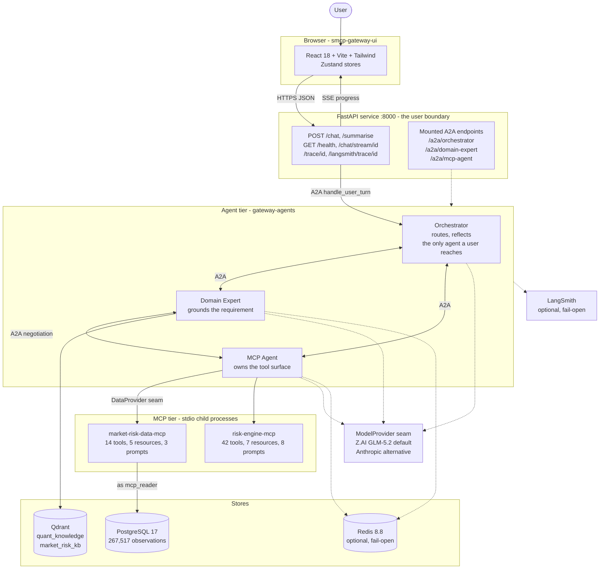
```mermaid
flowchart TB
    U(["User"])

    subgraph UI["Browser - smcp-gateway-ui"]
        R["React 18 + Vite + Tailwind<br/>Zustand stores"]
    end

    subgraph SVC["FastAPI service :8000 - the user boundary"]
        API["POST /chat, /summarise<br/>GET /health, /chat/stream/id<br/>/trace/id, /langsmith/trace/id"]
        MOUNT["Mounted A2A endpoints<br/>/a2a/orchestrator<br/>/a2a/domain-expert<br/>/a2a/mcp-agent"]
    end

    subgraph AG["Agent tier - gateway-agents"]
        ORCH["Orchestrator<br/>routes, reflects<br/>the only agent a user reaches"]
        DE["Domain Expert<br/>grounds the requirement"]
        MA["MCP Agent<br/>owns the tool surface"]
    end

    subgraph MCPL["MCP tier - stdio child processes"]
        DS["market-risk-data-mcp<br/>14 tools, 5 resources, 3 prompts"]
        RS["risk-engine-mcp<br/>42 tools, 7 resources, 8 prompts"]
    end

    subgraph DATA["Stores"]
        PG[("PostgreSQL 17<br/>267,517 observations")]
        QD[("Qdrant<br/>quant_knowledge<br/>market_risk_kb")]
        RD[("Redis 8.8<br/>optional, fail-open")]
    end

    LLM["ModelProvider seam<br/>Z.AI GLM-5.2 default<br/>Anthropic alternative"]
    LS["LangSmith<br/>optional, fail-open"]

    U --> R
    R -->|"HTTPS JSON"| API
    API -->|"A2A handle_user_turn"| ORCH
    ORCH <-->|"A2A"| DE
    ORCH <-->|"A2A"| MA
    DE <-->|"A2A negotiation"| MA
    DE --> QD
    MA -->|"DataProvider seam"| DS
    MA --> RS
    DS -->|"as mcp_reader"| PG
    ORCH -.-> LLM
    DE -.-> LLM
    MA -.-> LLM
    DE -.-> RD
    MA -.-> RD
    AG -.-> LS
    MOUNT -.-> AG
    API -->|"SSE progress"| R
```

## Reading it block by block

| Block | What it is | Who calls it | What happens on failure |
|---|---|---|---|
| **React UI** | `frontend/`, an npm package run in place by Vite. Talks only to `/chat`, `/summarise`, `/health`, `/chat/stream/{id}`, `/trace/{id}`, `/langsmith/trace/{id}`. | The human | Network error surfaced in the chat; the SSE stream is a view, and losing it does not affect the answer. |
| **FastAPI service** | `backend/src/backend/api/service.py`. Owns session memory, CORS, and the `user-boundary` identity. | The browser | `502` with `agent error: …` for an unexpected exception; specialist failures become sentences, never stack traces. |
| **Orchestrator** | `agents/orchestrator_agent.py` + `agents/pipeline.py`. The only agent whose card admits `user-boundary`. | The service, over A2A | Routes to a stated-reason reply. |
| **Domain Expert** | `agents/domain_expert_agent.py`. The only agent that reads Qdrant. | The orchestrator, over A2A | Turn reports the requirement could not be established; nothing is fetched. |
| **MCP Agent** | `agents/mcp_agent.py`. The only agent with a road to data. | The orchestrator and the domain expert, over A2A | Turn reports the data layer could not complete; no substituted figure. |
| **MCP servers** | `mcp/src/mcp_servers/{data,risk}/server.py`, launched as stdio child processes by the host. | `McpDataProvider` | A tool error becomes a structured MCP error, surfaced as a refusal. |
| **PostgreSQL** | Source of record. Reached **only** through the data server, as `mcp_reader`. | `market-risk-data-mcp` | Connection failure → "part of the gateway is not reachable". |
| **Qdrant** | Two collections of domain knowledge. | Domain expert only | Retrieval returns nothing → the corpus is reported silent; no default is invented. |
| **Redis** | Derived memory. Never authoritative. | Domain expert, MCP agent | Treated as a cache miss, unless `REDIS_REQUIRED=true`. |
| **LangSmith** | Trace sink. | Every agent boundary | Degrades to simply running the function. |

---

# 4. Technology Stack

| Layer | Technology (verified) | Responsibility |
|---|---|---|
| Frontend | React 18.3 · Vite 5.4 · TypeScript 5.7 · Tailwind 3.4 · Zustand 5 · `@xyflow/react` 12.3 · `react-markdown` 9 | Chat, artifact panel, execution graph, trace and latency views |
| Frontend tests | Vitest 2.1 · Testing Library · jsdom | Component and library unit tests |
| API | FastAPI ≥0.110 · Uvicorn ≥0.29 · Pydantic v2 | `/chat`, `/summarise`, `/health`, SSE stream, trace endpoints |
| Agent runtime | Python 3.11+ · `gateway-agents` distribution | Three agents, pipeline, planning, guardrails, events |
| Agent protocol | **A2A** — `a2a-sdk` ≥1.1.2, protocol revision 1.0 | Agent-to-agent tasks, cards, artifacts, task lifecycle |
| Tool protocol | **MCP** — `mcp` ≥2.0.0, protocol revision **2026-07-28** | Tools, resources, prompts, elicitation, roots, sampling |
| Primary LLM | **`glm-5.2`** via Z.AI OpenAI-compatible API (`LLM_BACKEND=zai`, the default) | All five call sites |
| Alternative LLM | `claude-haiku-4-5` (orchestrator) + `claude-opus-5` (everything else) via `LLM_BACKEND=anthropic` | Maintained; see §55 for a current limitation |
| Structured output | `jsonschema` ≥4.20 with a strict type-checker | Schema + type validation of every model object |
| Relational data | PostgreSQL 17 (`postgres:17-alpine`) · `psycopg2-binary` | Treasury observations, series semantics, lineage, demo book |
| Vector data | Qdrant (`qdrant/qdrant:latest`) · `qdrant-client[fastembed]` ≥1.12 | Two knowledge collections |
| Embeddings | **`BAAI/bge-small-en-v1.5`** via FastEmbed, local, 384-dim, cosine | Chunk and query embedding — no external embedding API |
| Cache / coordination | Redis 8.8.2 · `redis` ≥8.0.1,<9 · RedisInsight | Validated specialist-work cache, single-flight, rate limits, Streams/TimeSeries evidence |
| Observability | LangSmith ≥0.2 · in-process `EventBus` (SSE) | Distributed traces; live execution stream independent of LangSmith |
| Source data | `requests` ≥2.31 against the Treasury XML feed | Five daily interest-rate datasets |
| Lint | Ruff ≥0.4, line length 100, target py311 | — |
| Tests | pytest ≥8.0 · `responses` ≥0.25 | **1,835** collected tests |

---

# 5. Core System Philosophy

The system is deliberately **not**:

```
User -> LLM -> unrestricted database -> dump
```

It is:

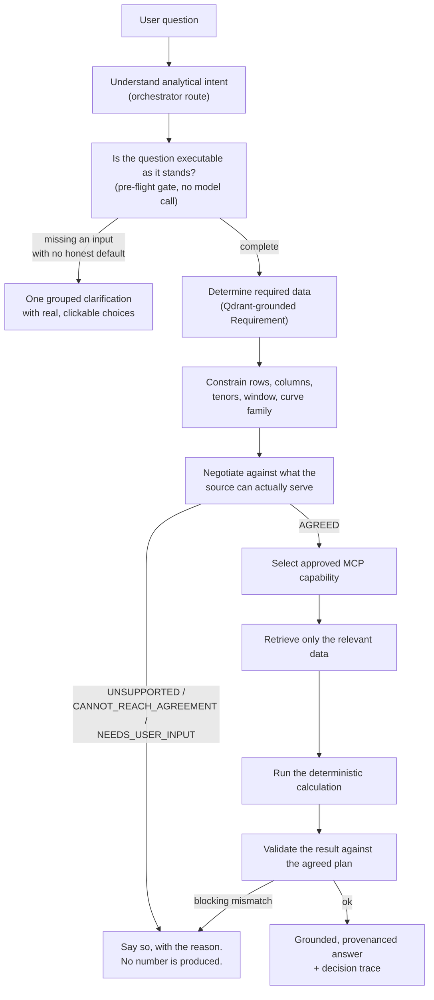
```mermaid
flowchart TD
    A["User question"] --> B["Understand analytical intent<br/>(orchestrator route)"]
    B --> C["Is the question executable as it stands?<br/>(pre-flight gate, no model call)"]
    C -->|"missing an input<br/>with no honest default"| C2["One grouped clarification<br/>with real, clickable choices"]
    C -->|"complete"| D["Determine required data<br/>(Qdrant-grounded Requirement)"]
    D --> E["Constrain rows, columns,<br/>tenors, window, curve family"]
    E --> F["Negotiate against what the<br/>source can actually serve"]
    F -->|"AGREED"| G["Select approved MCP capability"]
    F -->|"UNSUPPORTED /<br/>CANNOT_REACH_AGREEMENT /<br/>NEEDS_USER_INPUT"| H["Say so, with the reason.<br/>No number is produced."]
    G --> I["Retrieve only the relevant data"]
    I --> J["Run the deterministic calculation"]
    J --> K["Validate the result against the agreed plan"]
    K -->|"blocking mismatch"| H
    K -->|"ok"| L["Grounded, provenanced answer<br/>+ decision trace"]
```

## The rule everything rests on

> **A missing observation is NULL. Never zero, never the previous day's rate, never an
> interpolation.**

Absence of a rate and a rate of zero are different facts. Collapse them and you get a curve
that looks complete and is wrong, with nothing downstream able to tell. This is enforced at
every layer: the downloader emits NULL, the loader writes no row, and the schema has no
default that could invent one (`CONSTRAINT observation_status_matches_value` in
`postgres/migrations/V004__treasury_core.sql`).

The harder half: **an exact 0 is not automatically missing.** Short tenors genuinely printed
0.00% in 2008-12, 2011, 2015 and 2020-21. Exactly one column is a placeholder —
`BC_30YEARDISPLAY`, a literal `0` on all **5,256** dates before 2011-01-03 — and that judgement
lives in `treasury.series.placeholder_zero_before`, as *data*, not code.

## What this architecture buys — stated without exaggeration

| Property | Mechanism in this repository | Measured? |
|---|---|---|
| **Data efficiency** | `get_curve_history_matrix` returns the numeric matrix in the MCP result's `_meta` for the host to forward to the risk engine; the *model* receives a summary. | Not benchmarked here; the mechanism is verifiable in `mcp/src/mcp_servers/data/server.py`. |
| **Context efficiency** | Row/column/tenor/window constraints are decided before the fetch, and `MAX_DISPLAY_ROWS = 500` caps what is rendered. | Not benchmarked. |
| **Reasoning focus** | 30 executable capabilities rather than 42 tools; two separate corpora rather than one. | Reachability (34/42) is asserted by `tests/test_risk_tool_inventory.py`. |
| **Cost avoidance** | The pre-flight gate stops an unanswerable question before four Qdrant queries, a derive call and up to five negotiation rounds. | The saving is structural; the per-turn saving is not benchmarked in-repo. |
| **Explainability** | Every turn carries `data_plan`, `negotiation`, `catalogue`, `trace`, `handoffs`, `latency` and `structured` sections to the UI. | Verifiable in the `/chat` response model. |
| **Governance** | Caller allow-lists per skill; `mcp_reader` PostgreSQL grants; identifier redaction at the three user-facing exits. | Asserted by `tests/test_a2a.py`, `tests/qa/test_qa_tier5_security.py`, `tests/test_redaction.py`. |


---

# 6. Repository Layout

Five installable Python distributions plus one npm package, at the repository root.
Dependencies run **strictly downward**: `llm/` imports nothing above it, which is what keeps
`python -m mcp_servers.host --ask` runnable with no backend, no Qdrant and no UI.

```
semantic-mcp-data-access-gateway/
├── agents/                     gateway-agents      — the three runtime agents
│   ├── a2a/                    protocol boundary (the ONLY place a2a.types is imported)
│   ├── cache/                  Redis intelligence (13 modules)
│   ├── orchestrator_agent.py   agent 1
│   ├── domain_expert_agent.py  agent 2
│   ├── mcp_agent.py            agent 3
│   ├── pipeline.py             the orchestrator's own workflow
│   ├── planning.py             the bounded negotiation, over DataLayerPort
│   ├── preflight.py            the requirement completeness gate
│   ├── contracts.py            the dataclasses agents exchange
│   ├── events.py               live execution EventBus (SSE source)
│   ├── answer_builder.py       the reply, as typed sections
│   ├── observability.py        LangSmith instrumentation
│   └── redaction.py            identifier scrubbing at user-facing exits
├── backend/                    gateway-backend     — service, seams, workflows
│   └── src/backend/
│       ├── api/service.py      FastAPI: /chat, /summarise, /health, SSE, trace
│       ├── api/langsmith_reader.py  server-side trace read-back
│       ├── knowledge/          KnowledgeBase, MarketRiskKnowledgeBase, chunker, VectorStore
│       ├── providers/          DataProvider seam: mcp | postgres | mock
│       └── workflows/risk_workflows.py  deterministic marshalling into the risk engine
├── llm/                        gateway-llm         — the ModelProvider seam
│   └── src/llm/                base · config · contracts · factory · validation
│                               anthropic_provider · zai_provider
├── mcp/                        mcp-servers         — two stdio servers + the host
│   └── src/mcp_servers/
│       ├── data/               market-risk-data-mcp  (PostgreSQL, as mcp_reader)
│       ├── risk/               risk-engine-mcp       (no DB credential at all)
│       └── host/               the client that launches and drives both
├── postgres/                   treasury-db         — migrations, loader, DB access
│   ├── migrations/             V001 … V013
│   └── src/treasury_db/        migrate · load · db · paths
├── frontend/                   smcp-gateway-ui     — React + Vite + TS + Tailwind
├── data/                       source of record + the acquisition that fills it
│   ├── acquisition/            download_us_treasury.py
│   ├── processed/us_treasury/  five validated CSVs
│   └── metadata/us_treasury/   manifests, schema report, verification reports
├── knowledge/                  RAG corpus → Qdrant `quant_knowledge` (11 docs, 4 domains)
├── docs/                       design docs + market-risk-kb/ → Qdrant `market_risk_kb` (47 docs)
├── evaluation/                 13 cases × 11 scorers
├── tests/                      1,835 tests
├── tools/                      setup.py · verify_load.py · verify_mcp.py
├── db/init/                    Compose-mounted Postgres init dir (currently empty)
├── .claude/                    Claude Code CONFIGURATION ONLY — never product code
├── docker-compose.yml          postgres · qdrant · redis · redis-insight · agent
├── Dockerfile                  backend image (see §55 — currently stale)
├── requirements.txt            pinned floors for every layer
├── .env.example                the full configuration reference
├── AGENTS.md · CLAUDE.md       agent-architecture and repo-instruction docs
└── README.md                   this document
```

## Directory responsibilities

| Path | Type | Responsibility | Important contents | Used by |
|---|---|---|---|---|
| `llm/` | Python dist `gateway-llm` | The `ModelProvider` seam. Imports **nothing** above it. | `base.py`, `config.py`, `validation.py`, `zai_provider.py`, `anthropic_provider.py` | agents, MCP host |
| `agents/` | Python dist `gateway-agents` | The three runtime agents, the A2A protocol boundary, the negotiation, the Redis layer, observability | `orchestrator_agent.py`, `domain_expert_agent.py`, `mcp_agent.py`, `a2a/`, `cache/` | backend service, evaluation |
| `postgres/` | Python dist `treasury-db` | Schema, forward-only migrations, generic loader, `.env` reader | `migrations/V001…V013`, `load.py`, `migrate.py` | MCP data server, verification tools |
| `mcp/` | Python dist `mcp-servers` | Both MCP servers, the host/client, the curve and risk mathematics | `data/`, `risk/` (30 modules), `host/` | `McpDataProvider`, CLI demos |
| `backend/` | Python dist `gateway-backend` | The `/chat` service, both seams, the knowledge layer, deterministic risk workflows | `api/service.py`, `knowledge/`, `providers/`, `workflows/` | frontend, evaluation |
| `frontend/` | npm pkg `smcp-gateway-ui` | The React application | `src/components/` (26), `src/lib/` (15), `src/store/` (3) | the human |
| `data/` | Data | Source of record and its acquisition | `acquisition/`, `processed/`, `metadata/` | loader, verification |
| `knowledge/` | Corpus | Executable analytical contracts | 11 markdown docs, 4 domain subfolders | Qdrant `quant_knowledge` |
| `docs/market-risk-kb/` | Corpus | The reference library | 47 markdown docs | Qdrant `market_risk_kb` |
| `evaluation/` | Harness | 13 cases × 11 scorers, offline or LangSmith | `dataset.py`, `evaluators.py`, `run.py`, `judge.py` | CI-less quality gate |
| `tools/` | Scripts | Setup and the two verification gates | `setup.py`, `verify_load.py`, `verify_mcp.py` | pre-PR checks |
| `.claude/` | Config | Claude Code agents, rules, skills, settings | 7 subagents, 5 rules, 5 skills | development only |

> **The MCP package is `mcp_servers`, deliberately not `mcp`** — that name belongs to the MCP
> SDK on PyPI, and shadowing it breaks every server with an import error that looks like a
> corrupted install.

> **No `sys.path` hacks anywhere.** Each distribution has a `paths.py` that finds the repo
> root by walking up for a marker, never by counting `parents[N]` — five packages sit at five
> depths and a count is wrong the moment a file moves.

---

# 7. File-by-File Reference

Only meaningful source, configuration and test files. Generated content, `node_modules/`,
caches and `data/raw/` are excluded.

## 7.1 `llm/` — the model seam

| File | Purpose | Key classes / functions | Called by | Depends on |
|---|---|---|---|---|
| `llm/src/llm/base.py` | The `ModelProvider` Protocol: three operations cover every model call | `ModelProvider` (`structured_call`, `tool_turn`, `complete`, `assistant_message`, `tool_result_message`) | every agent, MCP host | `llm.contracts` |
| `llm/src/llm/config.py` | Reads the environment **once**; per-call-site model and token floors | `ModelConfig`, `load_config()`, `_DEFAULT_MODELS`, `_MIN_TOKENS`, `_load_dotenv()` | `factory.py` | stdlib only |
| `llm/src/llm/contracts.py` | Vendor-neutral types | `CallSite` enum, `ModelReply`, `ToolCall`, `ToolSpec`, `ProviderError`, `SchemaViolation` | everything in `llm/` | — |
| `llm/src/llm/factory.py` | One line per provider; `LLM_BACKEND` chooses | `make_model_provider()`, `provider_status()` | agents, host | both providers |
| `llm/src/llm/validation.py` | **Strict** schema + type validation. Redefines `integer` to mean a Python `int` | `validate_against_schema()`, `strictened()`, `normalise_nullables()`, `StrictValidator` | both providers | `jsonschema` |
| `llm/src/llm/zai_provider.py` | GLM over Z.AI's OpenAI-compatible API; **forced function call**, not `response_format` | `ZaiProvider`, `sanitise_arguments()`, `_recover_templated_call()`, `_close_unbalanced()` | `factory.py` | `openai` SDK |
| `llm/src/llm/anthropic_provider.py` | Claude Messages API; adaptive thinking and `effort` shaped per model | `AnthropicProvider`, `_LOW_EFFORT` | `factory.py` | `anthropic` SDK |

## 7.2 `agents/` — the runtime agents

| File | Purpose | Key classes / functions | Called by | Depends on |
|---|---|---|---|---|
| `agents/orchestrator_agent.py` | Agent 1. Routing and reflection; the only voice the user hears | `OrchestratorAgent.classify / ground_options / reflect / summarise_session`, `CLASSIFY_SCHEMA`, `REFLECT_SCHEMA` | `OrchestratorExecutor`, `AgentPipeline` | `llm`, `agents.observability` |
| `agents/domain_expert_agent.py` | Agent 2. Qdrant-grounded requirement derivation, revision and result validation | `DomainExpertAgent.retrieve / retrieve_market_risk / derive / revise / validate_result`, `quote_is_grounded()`, `SCHEMA`, `REVISE_SCHEMA` | `DomainExpertExecutor` | `llm`, Qdrant, `agents.cache` |
| `agents/mcp_agent.py` | Agent 3. Live capability catalogue, assessment, execution | `McpAgent.catalogue / choices / assess / execute / _calculate`, `TENOR_MONTHS`, `MAX_DISPLAY_ROWS` | `McpAgentExecutor` | `DataProvider`, `RiskWorkflows`, `llm` |
| `agents/pipeline.py` | The orchestrator's own workflow: route → gate → derive → execute → validate → reply | `AgentPipeline.handle / resume / _data_request / _compose / _not_agreed / _relay_question`, `VALIDATED_CALCULATIONS` | `OrchestratorExecutor` | `agents.a2a`, `answer_builder`, `events` |
| `agents/planning.py` | The rules of the negotiation, against a transport-free port | `DataPlanner.plan()`, `DataLayerPort`, `MAX_NEGOTIATION_ROUNDS=5`, `MAX_UNCHANGED_ROUNDS=2` | `DomainExpertAgent` path | `agents.contracts` |
| `agents/preflight.py` | Deterministic completeness gate — regex + lexicon, no model, no vectors | `assess()`, `extract()`, `classify_intent()`, `CompletenessVerdict`, `MissingField`, `FieldSpec` | `DomainExpertExecutor` | stdlib only |
| `agents/contracts.py` | Every dataclass the agents exchange | `Requirement`, `ToolCatalogue`, `ToolSpec`, `ServeResponse`, `Negotiation`, `ResultValidation`, `Intent`, `TemporalScope`, `AgentOutcome`, `KnowledgeChunk`, `FieldNote` | all agents | stdlib only |
| `agents/answer_builder.py` | Assembles the reply into typed sections from facts already established | `build()`, `_SHAPES`, `_metrics_from()`, `_caveats()`, `_methodology()` | `AgentPipeline` | — |
| `agents/events.py` | The live execution `EventBus`; bounded per-run history; latency report | `EventType` (24 values), `emit()`, `bus()`, `timeline()`, `latency_report()`, `safe_metadata()`, `RUN_CAPACITY=64`, `EVENTS_PER_RUN=600` | every agent, `/chat/stream` | stdlib only |
| `agents/observability.py` | LangSmith instrumentation; every agent boundary is a run | `traced()`, `span()`, `structured_call()`, `langsmith_status()`, `current_trace_headers()`, `continue_trace()`, `app_metadata()` | all agents | `langsmith` (optional) |
| `agents/redaction.py` | Substitutes internal identifiers out of user-facing prose | `scrub_identifiers()`, `humanise()`, `contains_sensitive_data()`, `redact_sensitive()`, `MCP_IMPLEMENTATION_NAMES`, `CONTRACT_KEYS` | `AgentPipeline`, `agents.cache` | — |

### `agents/a2a/` — the protocol boundary

| File | Purpose | Key contents |
|---|---|---|
| `identity.py` | Who the agents are and how they are addressed | `AgentId` (3 members), `MOUNT_PATHS`, `transport_mode()`, `base_url()`, `card_url()`, `AGENT_VERSION="1.0.0"` |
| `cards.py` | Agent Cards — the contract | `ORCHESTRATOR_SKILLS` (3), `DOMAIN_EXPERT_SKILLS` (3), `MCP_SKILLS` (5), `IDEMPOTENT_TAG` |
| `executors.py` | One `AgentExecutor` per agent; caller allow-lists; worker-thread dispatch | `OrchestratorExecutor`, `DomainExpertExecutor`, `McpAgentExecutor`, `BaseAgentExecutor`, `ExecutionContext`, `active_execution()`, `USER_BOUNDARY` |
| `guardrails.py` | Five bounds, in code | `CallChain`, `TurnLedger`, `LedgerRegistry`, `DEFAULT_MAX_CHAIN=8`, `DEFAULT_MAX_REENTRY=3`, `DEFAULT_MAX_HANDOFFS=20`, `DEFAULT_TURN_TIMEOUT_S=900` |
| `envelope.py` | Typed artifacts across the wire; integer coercion | `SkillResult`, `ARTIFACT_*` constants, `requirement_from_dict()`, `restore_counts()`, `COUNT_KEYS` |
| `client.py` | Dialling a peer; in-process ASGI or HTTP | `AgentLink.call()`, `dispatch()` |
| `runtime.py` | Builds the network and its event loop thread | `AgentNetwork`, `get_network()` |
| `server.py` | Mounts each agent's JSON-RPC app and card on FastAPI | `mount()` |
| `ports.py` | The A2A implementation of `DataLayerPort` | `A2ADataLayer` |
| `elicitation.py` | Orchestrator-mediated clarification, bounded | `match_answer()`, `is_refusal()`, `is_domain_material()`, `DOMAIN_MATERIAL_FIELDS`, `DEFAULT_MAX_CLARIFICATION_RETRIES=3` |

### `agents/cache/` — Redis intelligence

| File | Purpose |
|---|---|
| `config.py` | `RedisConfig.from_env()` — every TTL, threshold and limit in one dataclass |
| `client.py` | `RedisConnection` — pooled, fail-open unless `REDIS_REQUIRED` |
| `factory.py` | `get_intelligence()` — process-wide singleton; `NoOpIntelligence` when disabled |
| `service.py` | `RedisIntelligence` — the whole surface: `cached`, `allow_llm`, `observed`, `record_llm_call`, `complete_run`, `health`, `clear` |
| `policies.py` | `policy_for(agent, operation, config)` — the cacheability matrix. **Execution is deliberately absent.** |
| `keys.py` | `KeyBuilder` — every namespaced key shape in one place |
| `fingerprints.py` | `canonical_question()`, `analytical_signature()`, `catalogue_fingerprint()`, `model_identity()`, `is_semantic_cache_reuse_safe()` |
| `serialization.py` | `CacheRequest`, `build_envelope()`, `validate_envelope()`, `load_result()` |
| `locks.py` | `RedisSingleFlight` — ownership-checked, atomically released |
| `rate_limit.py` | `RedisRateLimiter` — fixed-window caps via Redis 8.8 `INCREX` |
| `telemetry.py` | Streams, TimeSeries, counters, question frequency |
| `versions.py` | Prompt and schema version constants that participate in every key |
| `admin.py` | Cache clearing by scope |

## 7.3 `backend/` — service, seams, knowledge, workflows

| File | Purpose | Key contents |
|---|---|---|
| `api/service.py` | The FastAPI app and the user boundary | `/chat`, `/summarise`, `/health`, `/chat/stream/{id}`, `/trace/{id}`, `/langsmith/trace/{id}`, `ChatRequest`, `ChatResponse`, `_sessions`, CORS, `mount_a2a_agents()` |
| `api/langsmith_reader.py` | Reads a trace back server-side with payloads stripped | `fetch_trace()`, `_SAFE_FIELDS` allow-list, `MAX_RUNS=500` |
| `knowledge/vector_store.py` | The `VectorStore` seam and its Qdrant implementation | `VectorStore` Protocol, `QdrantVectorStore`, `Hit`, `make_vector_store()`, `EMBED_MODEL="BAAI/bge-small-en-v1.5"` |
| `knowledge/knowledge_base.py` | The `quant_knowledge` corpus: heading-split chunking | `KnowledgeBase.ingest / retrieve / count`, `_chunk_markdown()`, `_iter_chunks()` |
| `knowledge/market_risk_kb.py` | The `market_risk_kb` corpus: budget-enforced, hierarchy-aware | `MarketRiskKnowledgeBase`, `COLLECTION`, `chunk_payload()`, `chunk_id()`, `discover()`, `IngestReport` |
| `knowledge/markdown_chunker.py` | Pure, I/O-free chunker with a hard token budget | `chunk_document()`, `parse_blocks()`, `MODEL_LIMIT=512`, `MAX_TOKENS=460`, `TARGET_TOKENS=400`, `OVERLAP_TOKENS=60` |
| `knowledge/versioning.py` | Content identity carried into cache keys | `corpus_version()` |
| `providers/base.py` | The `DataProvider` seam + the mock implementation | `DataProvider` Protocol, `MockDataProvider`, `make_data_provider()`, `NOMINAL_TENORS`, `REAL_TENORS` |
| `providers/mcp.py` | The full-stack provider: one warm event loop, two warm child processes | `McpDataProvider`, `call_tool()`, `_span()` |
| `providers/postgres.py` | Direct psycopg2 as the owner role (bypasses the privilege boundary) | `PostgresDataProvider` |
| `workflows/risk_workflows.py` | Deterministic marshalling into the risk engine — **computes nothing itself** | `RiskWorkflows` with 40+ methods (`price_portfolio`, `compute_dv01`, `compute_var`, `run_stress`, `run_historical_stress`, `compute_frtb_girr`, …) |
| `paths.py` | Repo-root discovery by marker | `KNOWLEDGE_DIR`, `MARKET_RISK_KB_DIR` |

## 7.4 `mcp/` — the MCP layer

| File | Purpose |
|---|---|
| `data/server.py` | `market-risk-data-mcp`: 14 tools, 5 resources, 3 prompts |
| `data/repository.py` | Every SQL statement the data server runs, against `analytics.*` views only |
| `data/_db.py` | Connection as `mcp_reader`; `snapshot_id()` |
| `data/contracts.py` | Typed results: `CurveResult`, `RateHistoryPage`, `PortfolioSnapshot`, `ProvenancedObservation`, … |
| `data/cursor.py` | Signed, restart-surviving pagination cursors (`MCP_CURSOR_KEY`) |
| `data/interactive.py` | The three server→client primitives: `resolve_rate_kind` (Elicit), `resolve_export_roots` (ListRoots), `resolve_caveat_briefing` (Sample) |
| `data/errors.py` | Structured errors that carry a code and a remedy |
| `data/bootstrap.py` | One-time `mcp_reader` password application |
| `risk/server.py` | `risk-engine-mcp`: 5 tools inline + 37 registered from five modules; 7 resources, 8 prompts |
| `risk/tools_analytics.py` | 6 tools — bond analytics, carry/roll, curve analytics, volatility, sensitivities, contributions |
| `risk/tools_stress.py` | 11 tools — parallel, key-rate, twist, curvature, ladder, matrix, comparison, attribution, explanation, concentration, severity pack |
| `risk/tools_historical.py` | 6 tools — replay, crisis catalogue, worst-window search, reverse stress, thresholds, limit-breach search |
| `risk/tools_distribution.py` | 8 tools — parametric, Monte Carlo, extreme tail, volatility regime, correlation, method comparison, backtest, P&L attribution |
| `risk/tools_portfolio.py` | 6 tools — concentration, limits, portfolio comparison, hypothetical trade, hedge analysis, FRTB GIRR |
| `risk/curves.py`, `pricing.py`, `risk.py`, `sensitivities.py`, … | The mathematics: bootstrapped discount curve, pricing, DV01, VaR/ES, stress, attribution, FRTB constants |
| `risk/manifest.py` | `MODEL_MANIFEST` — versions and every numerical convention, published as a resource |
| `host/mcp_clients.py` | Launches both servers as stdio children; **`session.discover()`, never `initialize()`** |
| `host/primitives.py` | The MRTR retry loop that makes elicitation/roots/sampling invisible to callers |
| `host/agent.py` | A separate, smaller tool-calling loop for exercising MCP alone (`MAX_STEPS=24`) |
| `host/demo.py`, `host/__main__.py` | `--demo`, `--tools`, `--isolation`, `--primitives`, `--ask`, `--interactive` |

## 7.5 `postgres/`, `data/`, `tools/`, `evaluation/`

| File | Purpose |
|---|---|
| `postgres/migrations/V001…V013` | Forward-only, checksum-guarded schema evolution (see §19) |
| `postgres/src/treasury_db/migrate.py` | The migration runner; `--status` reports pending |
| `postgres/src/treasury_db/load.py` | The generic loader: `LOAD_SPECS`, staging `COPY`, generic unpivot, the unmapped-column guard |
| `postgres/src/treasury_db/db.py` | `connect()`, `load_dotenv()` |
| `data/acquisition/download_us_treasury.py` | The Treasury XML feed client; five `DatasetSpec`s; never hardcodes a field list |
| `tools/setup.py` | Seven-step end-to-end setup; `--check` reports state and changes nothing |
| `tools/verify_load.py` | 74 checks, every expectation **recounted from the CSVs**; `--self-test` plants a corruption |
| `tools/verify_mcp.py` | 48 checks against real child processes; 4 canaries must be caught |
| `evaluation/dataset.py` | The 13 cases |
| `evaluation/evaluators.py` | The 11 scorers |
| `evaluation/run.py` | Runs them offline or uploads to LangSmith |
| `evaluation/judge.py` | LLM-as-judge scorer support |

### `frontend/` — 26 components, 15 library modules, 3 stores

| File | Purpose |
|---|---|
| `src/App.tsx` | Layout: header, market strip, sidebar, chat window, right rail, status bar |
| `src/config.ts` | `getSettings()` — `VITE_AGENT_BACKEND`, `VITE_AGENT_API_URL`, `VITE_AGENT_TIMEOUT_SECONDS` (default **960**) |
| `src/api/client.ts` | `askAgent()`, `summariseSession()`, `AgentClientError`; maps the `/chat` payload onto `ChatMessage` |
| `src/api/health.ts` | Reads `/health` so the header shows real backend status |
| `src/api/executionStream.ts` | `newRequestId()`, `openExecutionStream()` (EventSource over `/chat/stream/{id}`), `/trace/{id}`, `/langsmith/trace/{id}` |
| `src/api/mockFixtures.ts` | Canned answers when `VITE_AGENT_BACKEND=mock` |
| `src/hooks/useSend.ts` | The turn: choose id → subscribe → post. Auto-titles a session after 300s or 6 turns |
| `src/hooks/useHealth.ts` | Polls `/health` |
| `src/store/chatStore.ts` | Chats, messages, pending state, artifact panel reference |
| `src/store/executionStore.ts` | The live run's events |
| `src/store/themeStore.ts` | Light/dark |
| `src/components/ChatWindow.tsx`, `MessageBubble.tsx`, `ChatInput.tsx` | The conversation |
| `src/components/StructuredAnswer.tsx` | Renders the `structured` section document |
| `src/components/RightRail.tsx`, `ReasoningRail.tsx`, `ArtifactPanel.tsx`, `ArtifactCard.tsx` | Data plan, negotiation, catalogue, tables |
| `src/components/ExecutionView.tsx`, `GraphView.tsx`, `LatencyView.tsx`, `TraceView.tsx` | Live execution, the handoff graph, the latency breakdown, the LangSmith span tree |
| `src/components/ElicitationPrompt.tsx` | Clickable clarification options |
| `src/components/CurveChart.tsx`, `DataTable.tsx`, `MarketSnapshotStrip.tsx` | Rendering results |
| `src/lib/executionEvents.ts`, `executionGraph.ts`, `graphLayout.ts` | Event → graph transformation |
| `src/lib/trace.ts`, `artifact.ts`, `classification.ts`, `elicitation.ts`, `marketSnapshot.ts` | Pure helpers, each with a `.test.ts` beside it |

## 7.6 Tests

See §51 for the full matrix. **1,835 tests** across 39 files.

---

# 8. Detailed System Architecture

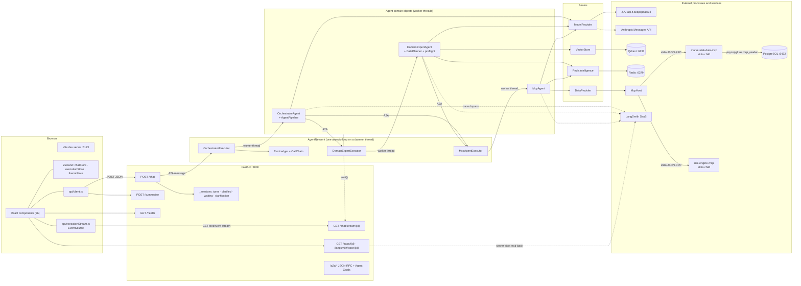
```mermaid
flowchart LR
    subgraph BROWSER["Browser"]
        direction TB
        VITE["Vite dev server :5173"]
        RC["React components (26)"]
        ZS["Zustand: chatStore · executionStore · themeStore"]
        AC["api/client.ts"]
        ES["api/executionStream.ts<br/>EventSource"]
        RC --- ZS
        RC --- AC
        RC --- ES
    end

    subgraph FASTAPI["FastAPI :8000"]
        direction TB
        CH["POST /chat"]
        SM["POST /summarise"]
        HL["GET /health"]
        STR["GET /chat/stream/{id}"]
        TR["GET /trace/{id} · /langsmith/trace/{id}"]
        SESS["_sessions: turns · clarified · waiting · clarification"]
        A2AMOUNT["/a2a/* JSON-RPC + Agent Cards"]
    end

    subgraph NET["AgentNetwork (one asyncio loop on a daemon thread)"]
        direction TB
        LEDGER["TurnLedger + CallChain"]
        OEX["OrchestratorExecutor"]
        DEX["DomainExpertExecutor"]
        MEX["McpAgentExecutor"]
    end

    subgraph AGENTS["Agent domain objects (worker threads)"]
        direction TB
        O["OrchestratorAgent<br/>+ AgentPipeline"]
        D["DomainExpertAgent<br/>+ DataPlanner + preflight"]
        M["McpAgent"]
    end

    subgraph SEAMS["Seams"]
        direction TB
        MP["ModelProvider"]
        DP["DataProvider"]
        VS["VectorStore"]
        RI["RedisIntelligence"]
    end

    subgraph EXT["External processes and services"]
        direction TB
        ZAI["Z.AI api.z.ai/api/paas/v4"]
        ANT["Anthropic Messages API"]
        QDRANT[("Qdrant :6333")]
        REDIS[("Redis :6379")]
        HOST["McpHost"]
        DSRV["market-risk-data-mcp<br/>stdio child"]
        RSRV["risk-engine-mcp<br/>stdio child"]
        PGDB[("PostgreSQL :5432")]
        LSMITH["LangSmith SaaS"]
    end

    AC -->|"POST JSON"| CH
    AC --> SM
    ES -->|"GET text/event-stream"| STR
    RC --> HL
    RC --> TR

    CH --> SESS
    CH -->|"A2A message"| OEX
    OEX --> LEDGER
    OEX -->|"worker thread"| O
    O -->|"A2A"| DEX
    O -->|"A2A"| MEX
    DEX -->|"worker thread"| D
    MEX -->|"worker thread"| M
    D -->|"A2A"| MEX

    O --> MP
    D --> MP
    M --> MP
    MP --> ZAI
    MP -.-> ANT

    D --> VS --> QDRANT
    D --> RI
    M --> RI
    RI --> REDIS

    M --> DP --> HOST
    HOST -->|"stdio JSON-RPC"| DSRV
    HOST -->|"stdio JSON-RPC"| RSRV
    DSRV -->|"psycopg2 as mcp_reader"| PGDB

    O -.->|"traced spans"| LSMITH
    D -.-> LSMITH
    M -.-> LSMITH
    TR -.->|"server-side read-back"| LSMITH
    AGENTS -.->|"emit()"| STR
```

## Every arrow, explained

| # | Edge | Initiator | Payload | Protocol | Expected response | On failure |
|---|---|---|---|---|---|---|
| 1 | Browser → `POST /chat` | `useSend` | `{query, session_id, request_id?}` | HTTPS JSON, CORS-gated | `ChatResponse` (16 fields) | `AgentClientError`; abort after `VITE_AGENT_TIMEOUT_SECONDS` (960s) |
| 2 | Browser → `GET /chat/stream/{id}` | `openExecutionStream`, **before** #1 | none | SSE (`text/event-stream`) | `event: event` frames, then `event: done` | Silent; the answer is unaffected |
| 3 | `/chat` → Orchestrator | FastAPI as `user-boundary` | `handle_user_turn` skill + `{query, history, already_clarified, pending_clarification}` | A2A JSON-RPC (in-process ASGI by default) | A `Task` reaching `completed`, carrying `ARTIFACT_OUTCOME` | Non-settled state is treated as a failure, never as success |
| 4 | Orchestrator → Domain Expert | `AgentPipeline._ask` | `check_requirement_completeness`, then `derive_data_requirement`, then `validate_result` | A2A | `ARTIFACT_COMPLETENESS`, `ARTIFACT_REQUIREMENT` + `ARTIFACT_CATALOGUE` + `ARTIFACT_NEGOTIATION`, `ARTIFACT_VALIDATION` | Gate failure ⇒ **proceed anyway**; derive failure ⇒ stated-reason reply |
| 5 | Domain Expert → Qdrant | `_qdrant_search` | Embedded query vector, `limit`, optional payload filter | Qdrant HTTP/gRPC | `Hit[]` with `distance` | Empty result ⇒ corpus reported silent |
| 6 | Domain Expert → MCP Agent | `A2ADataLayer` | `describe_data_capabilities`, then `assess_data_requirement` per round | A2A (nested — the loop must stay free) | `ToolCatalogue`, `ServeResponse` | Round counts against the negotiation budget |
| 7 | Orchestrator → MCP Agent | `AgentPipeline._ask` | `execute_data_plan` with the agreed `Requirement` | A2A | `ARTIFACT_DATASET` + `ARTIFACT_CALCULATION` + `summary`, **or** task state `input-required` | `input-required` is relayed to the user as one question |
| 8 | MCP Agent → `DataProvider` | `McpAgent._execute` | Typed method call (`get_yield_curve`, `get_rate_history`, …) or `call_tool` | Python, synchronous | dicts | Provider exception → structured error artifact |
| 9 | `McpDataProvider` → MCP host | bridge | MCP `tools/call` | stdio JSON-RPC, protocol 2026-07-28 | `CallToolResult` (possibly `InputRequiredResult`) | MRTR retry loop handles the three interactive primitives |
| 10 | Data server → PostgreSQL | `mcp_servers.data._db` | Parameterised SQL against `analytics.*` only | psycopg2 as `mcp_reader` | Rows | Connection error → MCP error |
| 11 | Any agent → `ModelProvider` | `structured_call` / `tool_turn` / `complete` | System + prompt + JSON Schema | HTTPS (Z.AI or Anthropic) | A **validated** object | One corrective retry carrying the model's own output; then the violation stands |
| 12 | Agents → LangSmith | `@traced` / `span()` | Run tree with metadata and tags | LangSmith SDK | — | Fail-open: the function simply runs |
| 13 | Agents → `EventBus` | `events.emit` | Sanitised `{type, agent, title, status, duration_ms, …}` | in-process | — | `emit` cannot raise |
| 14 | Agents → Redis | `RedisIntelligence.cached` | Namespaced key + envelope | RESP | Envelope or miss | Miss, unless `REDIS_REQUIRED=true` |

## The three swap seams, and the fourth

| Seam | Implementations | Chosen by | Where |
|---|---|---|---|
| `ModelProvider` | `ZaiProvider` · `AnthropicProvider` | `LLM_BACKEND` | `llm/factory.py` |
| `DataProvider` | `McpDataProvider` · `PostgresDataProvider` · `MockDataProvider` | `DATA_BACKEND` | `backend/providers/base.py` |
| `VectorStore` | `QdrantVectorStore` (server or embedded) | `QDRANT_URL` | `backend/knowledge/vector_store.py` |
| `RedisIntelligence` | `RedisIntelligence` · `NoOpIntelligence` | `REDIS_ENABLED` | `agents/cache/factory.py` |
| `DataLayerPort` | `A2ADataLayer` | — | `agents/a2a/ports.py` |
| A2A transport | in-process ASGI · HTTP | `A2A_TRANSPORT` | `agents/a2a/identity.py` |

`DataLayerPort` is what keeps the negotiation's *rules* apart from the transport that carries
them: `agents/planning.py` holds the round limit and the convergence test and knows nothing
about tasks, cards or protobufs — which is what makes the round limit testable without a
network.

---

# 9. Agent Architecture

There are **exactly three** agents. An entity is an agent here if and only if it has an
Agent Card, a mounted JSON-RPC endpoint, and a task lifecycle.

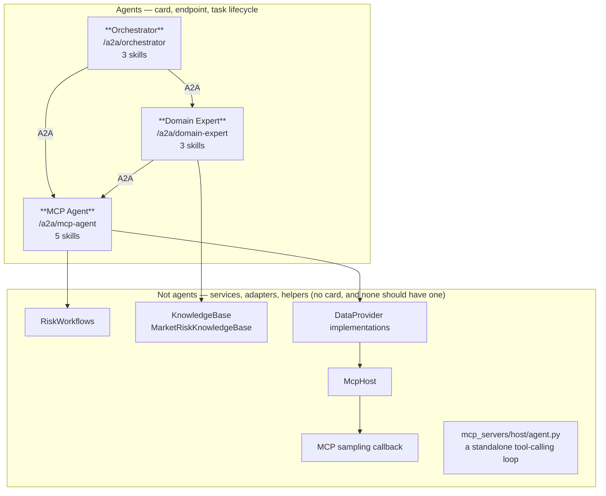
```mermaid
flowchart TB
    subgraph REAL["Agents — card, endpoint, task lifecycle"]
        O["**Orchestrator**<br/>/a2a/orchestrator<br/>3 skills"]
        D["**Domain Expert**<br/>/a2a/domain-expert<br/>3 skills"]
        M["**MCP Agent**<br/>/a2a/mcp-agent<br/>5 skills"]
    end

    subgraph NOT["Not agents — services, adapters, helpers (no card, and none should have one)"]
        H["McpHost"]
        RW["RiskWorkflows"]
        KB["KnowledgeBase<br/>MarketRiskKnowledgeBase"]
        DPI["DataProvider implementations"]
        SC["MCP sampling callback"]
        HA["mcp_servers/host/agent.py<br/>a standalone tool-calling loop"]
    end

    O -->|"A2A"| D
    O -->|"A2A"| M
    D -->|"A2A"| M
    M --> DPI --> H
    M --> RW
    D --> KB
    H --> SC
```

## The three agents

| Agent | Module | A2A address | Primary responsibility | Receives from | Sends to | LLM call site | Tools | User-facing? |
|---|---|---|---|---|---|---|---|---|
| **Orchestrator** | `agents/orchestrator_agent.py` + `agents/pipeline.py` | `/a2a/orchestrator` | Routing on every turn; composing the final reply; owning the conversation, including relayed clarifications | `user-boundary` **only** | Domain Expert, MCP Agent | `CallSite.ORCHESTRATOR` | None directly — it delegates | **Yes — the only one** |
| **Domain Expert** | `agents/domain_expert_agent.py` | `/a2a/domain-expert` | The pre-flight gate; Qdrant retrieval; the grounded `Requirement`; revision during the negotiation; result validation | Orchestrator **only** | MCP Agent (for the negotiation) | `CallSite.DOMAIN_EXPERT` | Reads two Qdrant collections | No |
| **MCP Agent** | `agents/mcp_agent.py` | `/a2a/mcp-agent` | Advertising the live tool surface; assessing a proposed requirement; executing the agreed plan; supplying real choices | Orchestrator, Domain Expert | — | `CallSite.MCP_AGENT` | 34 advertised capabilities → 42 MCP risk tools + 14 data tools | No — returns `input-required` instead of asking |

## The eleven skills

| Agent | Skill id | Idempotent? | Permitted callers |
|---|---|---|---|
| Orchestrator | `handle_user_turn` | no | `user-boundary` |
| Orchestrator | `relay_user_input` | no | `user-boundary` |
| Orchestrator | `summarise_session` | **yes** | `user-boundary` |
| Domain Expert | `check_requirement_completeness` | **yes** | `orchestrator` |
| Domain Expert | `derive_data_requirement` | **yes** | `orchestrator` |
| Domain Expert | `validate_result` | **yes** | `orchestrator` |
| MCP Agent | `describe_data_capabilities` | **yes** | `domain-expert`, `orchestrator` |
| MCP Agent | `assess_data_requirement` | **yes** | `domain-expert` |
| MCP Agent | `execute_data_plan` | no | `orchestrator` |
| MCP Agent | `list_data_choices` | **yes** | `orchestrator` |
| MCP Agent | `provide_input` | no | `orchestrator` |

> `user-boundary` appears on the orchestrator's skills and **nowhere else**. A browser that
> POSTs directly to `/a2a/mcp-agent/` is rejected by name, not served — so the mounted
> endpoints are genuine discovery and agent-to-agent traffic, not a back door.

> **Documentation drift, recorded rather than fixed:** `AGENTS.md` says "nine skills". The
> code has **eleven** — `check_requirement_completeness` and `validate_result` were added with
> the pre-flight gate and the result-validation pass. The count here is from `cards.py`.

## What is deliberately *not* an agent

| Entity | What it actually is | Why it has no card |
|---|---|---|
| `McpHost` | An MCP client that owns two child processes | It transports; it does not reason or decide |
| `RiskWorkflows` | An adapter that prepares inputs, calls two servers and shapes replies | A test asserts it performs **no arithmetic** — it is marshalling, not judgement |
| `KnowledgeBase` / `MarketRiskKnowledgeBase` | Ingest + retrieval services | They answer a query; they do not choose what to ask |
| `DataProvider` implementations | Three interchangeable adapters | Swapping one must not change an agent |
| The MCP sampling callback | A bridge that lends the host's model to a server | It has no goals |
| `mcp_servers/host/agent.py` | A standalone tool-calling loop (`MAX_STEPS=24`) for exercising MCP with no backend, Qdrant or UI | It is **not in the `/chat` path**; it has no knowledge base, no negotiation and no decision trace |

Adding a fourth agent — a router, a planner, a supervisor, a judge — would split a
responsibility one of these three already owns. `.claude/rules/a2a-layer.md` records this as a
design constraint, and `tests/test_a2a.py` asserts the roster.

---

# 10. Why Multiple Agents?

Neither specialist knows enough alone:

- The **domain expert** knows what the *method* requires — historical VaR reads 250 trading
  days, because it read that in the knowledge base and can quote the sentence.
- The **MCP agent** knows what the *source* holds — a par yield curve has no CUSIPs, no issuer
  names and no settlement dates, and some inputs are **unnecessary** because a tool already
  abstracts them.

A one-way handoff produces requirements nobody can serve (six fields, three of which do not
exist) or fetches nobody asked for. The third fact — *"that input is unnecessary"* — is the one
the expert cannot get from the corpus at any price, and it is what lets a requirement shrink
**on evidence** rather than by assumption.

## The trade-offs of collapsing them into one agent

| Consequence | Why it follows |
|---|---|
| Larger prompts | One agent needs the routing rules, the retrieved corpus excerpts, the full tool catalogue and the honesty rules in every call — including for "hi". |
| Unclear responsibility | When a number is wrong, "which agent authored it" has no answer. Splitting means a wrong number has exactly one author. |
| Unrestricted tool usage | With no capability boundary, the reasoning step and the fetching step share a credential and an ambition. |
| Harder debugging | The LangSmith trace collapses to one opaque span instead of `derive → assess → revise → execute`. |
| Harder testing | The round limit and the convergence test could not be exercised without a network; `DataLayerPort` is what makes them unit-testable. |
| More tokens on the cheap path | Routing runs on **every** turn. A greeting would otherwise reach Qdrant and a reasoning-grade call. |
| Weaker governance | Caller allow-lists, the user boundary and the "specialists never speak to a user" rule all need more than one participant to mean anything. |

These are trade-offs, not absolutes. The cost of three agents is real: more moving parts, an
A2A layer to maintain, and a negotiation that can take minutes. The project accepts that cost
because the failure it prevents — a confident, well-formatted, ungrounded number — is the one
failure a market-risk system cannot have.

---

# 11. Orchestrator — Detailed Behaviour

`agents/orchestrator_agent.py` (the model calls) + `agents/pipeline.py` (the workflow).

**The architectural principle holds in code:** the orchestrator is the single user-facing
authority, and the specialists collaborate behind it. This is enforced three ways —
the caller allow-list (`user-boundary` appears only on orchestrator skills), the executor
allow-lists (a specialist cannot call the orchestrator, which is the shape a "let me ask the
user" bypass would take), and the elicitation design (a specialist returns `input-required`
carrying structured field names, and never writes to a terminal).

## Two responsibilities, at the two ends of a request

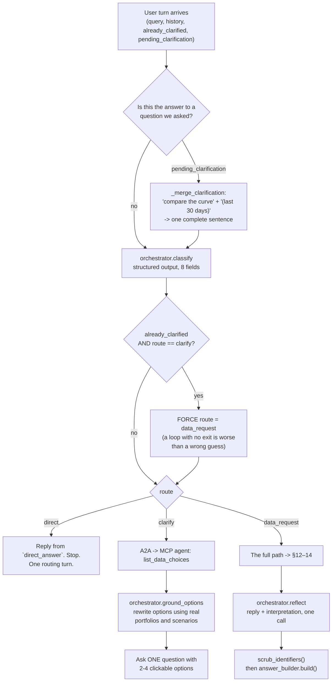
```mermaid
flowchart TD
    A["User turn arrives<br/>(query, history, already_clarified, pending_clarification)"]
    A --> B{"Is this the answer to a<br/>question we asked?"}
    B -->|"pending_clarification"| B2["_merge_clarification:<br/>'compare the curve' + '(last 30 days)'<br/>-> one complete sentence"]
    B -->|no| C
    B2 --> C["orchestrator.classify<br/>structured output, 8 fields"]
    C --> D{"already_clarified<br/>AND route == clarify?"}
    D -->|yes| D2["FORCE route = data_request<br/>(a loop with no exit is worse<br/>than a wrong guess)"]
    D -->|no| E
    D2 --> E{route}
    E -->|"direct"| F["Reply from `direct_answer`. Stop.<br/>One routing turn."]
    E -->|"clarify"| G["A2A -> MCP agent: list_data_choices"]
    G --> G2["orchestrator.ground_options<br/>rewrite options using real<br/>portfolios and scenarios"]
    G2 --> G3["Ask ONE question with<br/>2-4 clickable options"]
    E -->|"data_request"| H["The full path -> §12–14"]
    H --> I["orchestrator.reflect<br/>reply + interpretation, one call"]
    I --> J["scrub_identifiers()<br/>then answer_builder.build()"]
```

## The routes

| Route | Meaning | Cost | Where decided |
|---|---|---|---|
| `direct` | Greetings, small talk, questions about the system's own capabilities, short definitions that neither select a calculation nor state its inputs | One routing call | `CLASSIFY_SCHEMA.route` |
| `clarify` | The user wants data, but a detail is missing that would change the whole result | One routing call + one catalogue read | same |
| `data_request` | Anything needing actual numbers, **plus** methodology questions ("how is X calculated", "what data does X need", "which calculation should I use") — those belong to the domain expert because it reads the corpora | The full path | same |

The routing prompt ends: *"Be decisive. If in doubt between the two, choose `data_request` —
asking the data layer costs a little; inventing an answer costs correctness."* If the routing
call itself fails, `classify` returns `route="data_request"` for the same reason: the domain
expert can still decline, whereas a fabricated direct answer cannot be caught.

## The classify contract (8 fields, all required)

```json
{
  "route": "direct | clarify | data_request",
  "reasoning": "one line on why this route",
  "task": "what the data is for; empty when direct",
  "direct_answer": "the reply; empty unless direct",
  "question": "one clarifying question; empty unless clarify",
  "options": [{"label": "what the user reads",
               "value": "natural language sent as their next message — NEVER a tool name"}],
  "requested_fields": ["any column names the user named"],
  "requested_rows": 250
}
```

`requested_rows` is `["integer", "null"]` — and it is precisely the field that broke on the
cheaper model (§37).

## Two guarantees that live in code, not in the prompt

| Guarantee | Where | Why a prompt is not enough |
|---|---|---|
| **A user who has just answered a clarification is never asked another.** | `pipeline.py`: `if already_clarified and intent.route == "clarify": intent.route = "data_request"` | A model instruction is not a bound. A loop with no exit is worse than a wrong guess. |
| **Clarifying questions carry real choices.** | `pipeline._clarify` reads `list_data_choices` from the MCP agent *before* asking, then `ground_options` rewrites the options from actual portfolios and scenarios | An option is only useful if clicking it *ends* the ambiguity. "A named scenario on my portfolio" restates the question. |

The catalogue read happens **only** on the `clarify` branch, so a greeting still costs nothing.
At the pre-flight gate the same rule is applied more narrowly still: the catalogue is read only
when a missing field is something the data layer holds a list of (a scenario, a portfolio).
"Which comparison period?" needs no catalogue, and paying an A2A call plus a provider round trip
to attach options nobody can use would give back part of what the gate exists to save.

## The reflect contract

`reflect` asks for **two** fields in one call — `reply` (at most three sentences, the executive
answer) and `interpretation` (two to five sentences for a market-risk professional, empty when
the turn produced no calculation and no table). Two calls would double the most expensive part
of composing an answer to produce material the model already has in context.

The honesty rules are in `REFLECT_SYSTEM` and are user-visible obligations:

- Unavailable fields are named as not published by this source, with nothing substituted.
- An ungrounded row count is reported as "the corpus does not state a window".
- `SYNTHETIC_DEMO` and real market data keep their labels.
- **Every rate, curve or risk figure states its observation date.** A rate without a date is not
  an answer — it is a number that was true once.
- A risk figure's parameters are whatever the *calculation* reports, not what the user asked
  for, and a difference is stated plainly. *"Describing a 1-day figure as 10-day because the
  question said 10-day is the worst kind of wrong: it is a true number under a false label."*
- No internal tool, function or column identifier appears in prose.

## Non-negotiable outputs of every turn

`AgentPipeline._finish` is the single point every path passes through, and it attaches:

| Field | Source |
|---|---|
| `langsmith_url`, `langsmith_trace_id` | captured while the root run is still open |
| `handoffs` | the `TurnLedger` — who called whom, at what depth, with which task id |
| `request_id` | the turn's correlation id, shared by SSE, `/trace/{id}` and the handoff ledger |
| `latency` | summed from **measured** durations only; an uninstrumented stage lands in `unattributed_ms` rather than being apportioned |
| `structured` | a typed section document — **including on refusals**, because a declined request has a shape too |

## Failure sentences

`_user_facing_failure` maps an error *kind* to a sentence. Nothing from the underlying error
reaches it — not the exception type, not the message, not a host or a port.

| Kind | What the user is told |
|---|---|
| `timeout`, `incomplete` | Took longer than allowed and was stopped; nothing returned, nothing assumed; try a narrower question |
| `handoff_limit`, `depth_limit` | The agents could not settle it within the exchanges they are allowed; no partial answer was composed |
| `unavailable`, `empty_response`, `transport` | Part of the gateway is not reachable; no figure was produced from memory |
| `caller_not_permitted` | Refused because it did not arrive through the front door |
| Domain-expert default | The data requirement could not be established, so nothing was fetched — fetching without a grounded requirement is guessing |
| MCP-agent default | The data layer could not complete this request; no figure was substituted |

Two blocked-by cases get their own sentences because collapsing them tells the user something
false: `blocked_by="model"` (the reasoning step failed — *"a fault on my side, not a limit of
the data"*) and `blocked_by="account"` (the provider has no balance — *"this needs an operator,
not another attempt"*).

---

# 12. Domain Expert Agent — Detailed Technical Architecture

`agents/domain_expert_agent.py` (1,418 lines) + `agents/preflight.py` (606 lines).

## Why it exists

It is the only agent that reads the knowledge base, and the only one allowed to say what a
calculation requires. **It holds no thresholds of its own.** Every number it states must be
quoted from a chunk it actually retrieved, and the quote is checked against the retrieved text
before the requirement is accepted:

```python
if rows is not None and not quote_is_grounded(quote, context):
    rows, quote = None, None      # discarded — and the user is told why
```

A window recalled from training is rejected exactly like a constant hardcoded in the source.
Both are unfalsifiable: you cannot change them by editing a document, and you cannot audit them
by reading one.

> **The knowledge base is the authority, and a domain expert can edit it without an engineer.**
> Change `250` to `500` in `knowledge/market_risk/var.md`, re-ingest, ask again — the answer
> changes, with no code change and no release.

## The full pipeline

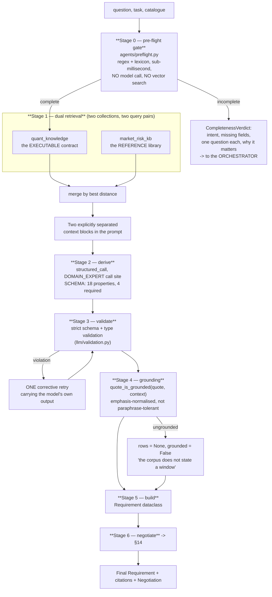
```mermaid
flowchart TD
    Q["question, task, catalogue"] --> PF["**Stage 0 — pre-flight gate**<br/>agents/preflight.py<br/>regex + lexicon, sub-millisecond,<br/>NO model call, NO vector search"]
    PF -->|"incomplete"| PFX["CompletenessVerdict:<br/>intent, missing fields,<br/>one question each, why it matters<br/>-> to the ORCHESTRATOR"]
    PF -->|"complete"| R1

    subgraph RET["**Stage 1 — dual retrieval** (two collections, two query pairs)"]
        R1["quant_knowledge<br/>the EXECUTABLE contract"]
        R2["market_risk_kb<br/>the REFERENCE library"]
    end
    R1 --> MERGE["merge by best distance"]
    R2 --> MERGE
    MERGE --> CTX["Two explicitly separated<br/>context blocks in the prompt"]

    CTX --> DER["**Stage 2 — derive**<br/>structured_call, DOMAIN_EXPERT call site<br/>SCHEMA: 18 properties, 4 required"]
    DER --> VAL["**Stage 3 — validate**<br/>strict schema + type validation<br/>(llm/validation.py)"]
    VAL -->|"violation"| RETRY["ONE corrective retry<br/>carrying the model's own output"]
    RETRY --> VAL
    VAL --> GRD["**Stage 4 — grounding**<br/>quote_is_grounded(quote, context)<br/>emphasis-normalised, not paraphrase-tolerant"]
    GRD -->|"ungrounded"| DROP["rows = None, grounded = False<br/>'the corpus does not state a window'"]
    GRD --> BUILD["**Stage 5 — build**<br/>Requirement dataclass"]
    DROP --> BUILD
    BUILD --> NEG["**Stage 6 — negotiate** -> §14"]
    NEG --> FIN["Final Requirement + citations + Negotiation"]
```

## Stage 0 — the pre-flight completeness gate

Added to stop paying the full path to discover a missing input. Before the gate existed, a
question missing a comparison period cost four Qdrant queries, a reasoning call, a capability
read over A2A, and up to five negotiation rounds of two model calls each — minutes of latency
and a fistful of reasoning tokens — to find out that nobody had named a period.

**It runs on regular expressions and a lexicon, not on a model.** Deciding whether `2026-08-20`
is a date does not need a frontier model, and a model call to find out would reintroduce most
of the cost the gate exists to avoid.

**It is deliberately reluctant to ask.** A field with a documented default is never a reason to
interrupt a senior quant:

| Field | Has an honest default? | Can it stop a turn? |
|---|---|---|
| Confidence level | yes (0.99) | no |
| Holding period / horizon | yes (1 day) | no |
| Observation window | yes (from the corpus, or `SAMPLE_ROWS=60` flagged `window_unstated`) | no |
| As-of date | yes (latest observation) | no |
| Comparison period | **no** | **yes** |
| Stress scenario | **no** | **yes** |
| Reverse-stress target loss | **no** | **yes** |
| Subject of the request | **no** | **yes** |

```
"Show me the 10Y Treasury yield."        -> complete (latest observation)
"10-day 99% VaR on the book."            -> complete
"Calculate VaR."                         -> complete for this gate — the router already
                                            refuses a compute request with no target, and
                                            two agents asking the same question is worse
                                            than one
"Compare the curve and show the moves."  -> INCOMPLETE: which period?
"Run a stress test on the demo book."    -> INCOMPLETE: which scenario?
```

Bounds: `PREFLIGHT_MAX_QUESTIONS` (3 by default, hard ceiling 5 — *"past that the user is
filling in a form rather than having a conversation"*) and `PREFLIGHT_MAX_ROUNDS` (2, after
which the turn proceeds on defaults and says which it used). `PREFLIGHT_ENABLED=false` restores
exactly the previous flow — a way back that does not need a deploy.

A gate failure is **not** a reason to stop. `pipeline._completeness` lets the turn proceed on
the old path if the gate cannot answer: *"an optimisation that can fail the request it was
meant to speed up is a worse trade than the cost it avoids."*

## Stage 1 — two corpora, explicitly separated

This is the most important distinction in the whole reasoning layer, and it is enforced in the
prompt, in the storage and in the code:

| | `quant_knowledge` | `market_risk_kb` |
|---|---|---|
| Source | `knowledge/**.md` — **11** documents, 4 domain subfolders | `docs/market-risk-kb/*.md` — **47** documents |
| Role | **Executable analytical contract** | **Reference knowledge** |
| Prompt label | *EXECUTABLE KNOWLEDGE CONTEXT* | *MARKET RISK REFERENCE CONTEXT* |
| May support | exact operational fields, observation windows, row counts, dates, calculation parameters | terminology, choosing the relevant calculation, identifying risk factors, interpreting formulas and regulation |
| May **not** support | — | any exact operational constraint placed into the requirement |
| Chunking | heading split (`_chunk_markdown`) | hierarchy-aware, budget-enforced (`markdown_chunker.py`) |
| Constant | `EXECUTABLE_COLLECTION = "quant_knowledge"` | `REFERENCE_COLLECTION = "market_risk_kb"` |

**Why retrieved knowledge must not become SQL filters.** A reference document explaining that
FRTB GIRR uses seven tenor vertices is *true* and is *not* a statement about this database.
Turning it into a row filter would produce a query shaped by a regulation rather than by the
data, and the resulting number would be wrong in a way nothing downstream could detect. The
prompt therefore permits only the executable corpus to carry an operational constraint, and the
grounding check verifies the quote against **the retrieved text**, so a paraphrase of a
reference document cannot pass as an executable contract.

**Retrieval runs two queries per corpus, not one.** *"What is expected shortfall"* and *"how
many observations does it read"* are different questions, and one embedding cannot be near both.
Results are merged by best distance. The reference corpus additionally gets a fixed
interpretation query (`REFERENCE_INTERPRETATION`) that turns "which maturity is driving my rate
risk?" into a search that surfaces key-rate DV01 / curve-segment material without another model
call.

## Stage 2 — the `Requirement`

| Field | Meaning |
|---|---|
| `task`, `answerable`, `unanswerable_reason` | what was understood, and whether it can be served |
| `fields`, `candidate_fields`, `field_notes` | what survived vs what the *method* asked for, with a `required / not_needed / unavailable` verdict and a reason each |
| `rows`, `row_quote`, `row_reason`, `grounded` | the window and the verbatim sentence behind it |
| `tenors`, `curve_family` | which curve nodes, on `nominal` / `real` / **`ambiguous`** |
| `temporal` | `TemporalScope(as_of_date, start_date, end_date, lookback_days)` |
| `calculation` | one capability name from the catalogue, or null |
| `calculation_params` | a **closed** schema of 20 declared parameters (§ below) |
| `decision` | `AGREED / NEEDS_USER_INPUT / UNSUPPORTED / CANNOT_REACH_AGREEMENT / null` |
| `is_hypothesis` | true while this is still the opening hypothesis |
| `open_questions`, `assumptions`, `limitations` | what the expert needs answered, and what the method rests on |
| `blocked_by` | `""` / `"data"` / `"model"` / `"account"` |
| `citations`, `warnings` | the chunks behind it, and anything dropped |

### `calculation_params` — a closed schema, and why

**A parameter must have a declared home.** A capability can be routed to perfectly and still be
unanswerable if its input has nowhere legal to arrive. `additionalProperties: false` stays, so
the schema had to be *extended* rather than opened. With only `confidence_level` and
`horizon_days` declared, a planner asked for a bear steepener returned `calculation_params: {}`
and every capability with a required input was blocked by its own guard while the routing had
been perfectly correct.

The twenty declared parameters:

`confidence_level` · `horizon_days` · `scenario` (closed enum) · `shock_bp` · `severity_bp` ·
`pivot_tenor_months` · `tenor_months` · `crisis_id` (closed enum) · `risk_measure` (`var`/`es`) ·
`target_loss` · `target_losses` · `limit_amount` · `dv01_limit` · `var_limit` ·
`stress_loss_limit` · `notional` · `amber_utilisation_percent` · `scenario_count` · `top_n` ·
`other_portfolio_id`

Every one is nullable, which is what lets them stay optional without the planner inventing
values. Parameters are **dropped rather than clamped** on validation failure, *because rewriting
a confidence level of 99 to 0.99 guesses at the number the whole figure is defined by.*

**Dates are the exception**: a period is recorded once in `temporal` and filled in by the MCP
agent for the capabilities that read it, so a planner is never asked to state the same window
twice.

`tests/test_calculation_params_contract.py` (42 tests) fails the build if the declared
parameters and the capability signatures ever disagree.

## Stage 6 — result validation

After execution, `VALIDATED_CALCULATIONS = {compute_var, compute_dv01, run_stress,
price_portfolio}` are sent **back** to the expert that agreed the plan, via
`validate_result`. A catalogue lookup does not benefit from a second opinion, and spending a
model call to have one agent tell another that a table is still a table is ceremony, not
assurance.

A **blocking** mismatch stops the answer:

> "The calculation ran, but it does not match the plan agreed for your question, so I will not
> present it as the answer."

*A true figure under a false description is the worst thing this system can emit, and it was
emitting one.* If the validator itself fails, the result is reported as unverified rather than
withheld — but the reply then says nothing it cannot support.

## Conversation boundaries with the MCP agent

- The expert **proposes**; it never fetches.
- The expert may state what the *method* needs, including inputs the source may lack — that is
  the point of a hypothesis (§14).
- The expert never speaks to the user. A `CompletenessVerdict` travels to the *orchestrator* as
  structured data.
- Both agents are shown the tool catalogue (the expert to judge what the source can hold), so
  both **can** copy an identifier into prose. `agents/redaction.py` substitutes them out at the
  pipeline's three user-facing exits, taking names from the **live** catalogue so a tool added
  tomorrow is covered without anyone remembering.

## Token budget

`_MIN_TOKENS[DOMAIN_EXPERT] = 12,000`, measured rather than guessed. A reasoning model bills its
thinking against the same budget as the visible answer; the smallest prompt this call site ever
sees measured `3,869 reasoning + 1,076 visible` against a 6,000 ceiling, and the real prompt
carries retrieved excerpts and the tool catalogue on top of that. A truncated completion returns
neither prose nor the forced call, which surfaces as `no_tool_call` and *reads like the model
refusing* — it is not refusing; it is being cut off.

---

# 13. MCP Agent — Detailed Technical Architecture

`agents/mcp_agent.py` (1,333 lines). Three jobs, plus two service skills.

| Skill | What it does | Cached? |
|---|---|---|
| `describe_data_capabilities` | **Advertise.** Reports the tools, fields and tenors that are *really connected* | yes, `REDIS_MCP_CATALOGUE_TTL=300` |
| `assess_data_requirement` | **Assess.** Judges a proposed requirement against the source; offers a counter-proposal. The model call | yes, `REDIS_MCP_ASSESS_TTL=21600` |
| `execute_data_plan` | **Execute.** Fetch exactly the agreed requirement, run the agreed calculation, report what actually arrived | **never** |
| `list_data_choices` | Real portfolios and scenarios, so a clarifying question is grounded | yes, `REDIS_MCP_CHOICES_TTL=300` |
| `provide_input` | Resume an interrupted plan with the user's answer, on the same task id | **never** |

## Capability detection, not declaration

```python
if hasattr(self.data, "call_tool"):   # only McpDataProvider has this
    tools += [ToolSpec("price_portfolio", …), ToolSpec("compute_dv01", …), …]
```

Under `DATA_BACKEND=mock` or `postgres` the risk tools genuinely are not reachable, so the
agents never see them and say plainly that there are no positions. *An agent that advertises a
capability it cannot honour will confabulate one.*

Base capabilities, always present: `get_yield_curve`, `get_rate_history`, `get_curve_slope`,
`list_series` (4 informational). Under `mcp`, thirty executable capabilities are added — see
§26 for the full list and how each maps onto the 42 registered MCP tools.

## Execution pipeline

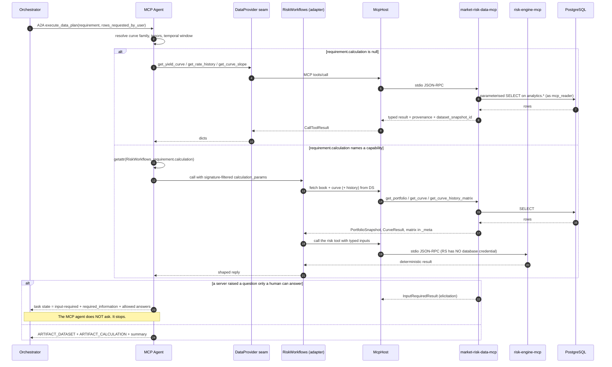
```mermaid
sequenceDiagram
    autonumber
    participant O as Orchestrator
    participant M as MCP Agent
    participant DP as DataProvider seam
    participant RW as RiskWorkflows (adapter)
    participant H as McpHost
    participant DS as market-risk-data-mcp
    participant RS as risk-engine-mcp
    participant PG as PostgreSQL

    O->>M: A2A execute_data_plan(requirement, rows_requested_by_user)
    M->>M: resolve curve family, tenors, temporal window
    alt requirement.calculation is null
        M->>DP: get_yield_curve / get_rate_history / get_curve_slope
        DP->>H: MCP tools/call
        H->>DS: stdio JSON-RPC
        DS->>PG: parameterised SELECT on analytics.* (as mcp_reader)
        PG-->>DS: rows
        DS-->>H: typed result + provenance + dataset_snapshot_id
        H-->>DP: CallToolResult
        DP-->>M: dicts
    else requirement.calculation names a capability
        M->>M: getattr(RiskWorkflows, requirement.calculation)
        M->>RW: call with signature-filtered calculation_params
        RW->>H: fetch book + curve (+ history) from DS
        H->>DS: get_portfolio / get_curve / get_curve_history_matrix
        DS->>PG: SELECT
        PG-->>DS: rows
        DS-->>RW: PortfolioSnapshot, CurveResult, matrix in _meta
        RW->>H: call the risk tool with typed inputs
        H->>RS: stdio JSON-RPC (RS has NO database credential)
        RS-->>RW: deterministic result
        RW-->>M: shaped reply
    end
    alt a server raised a question only a human can answer
        DS-->>H: InputRequiredResult (elicitation)
        M-->>O: task state = input-required + required_information + allowed answers
        Note over M,O: The MCP agent does NOT ask. It stops.
    else
        M-->>O: ARTIFACT_DATASET + ARTIFACT_CALCULATION + summary
    end
```

## Requested and delivered are separate numbers

`execute` reports both. *A fetch that quietly came up short is the one failure that reaches an
answer looking like success.* `rows_requested_by_user`, the requirement's `rows`, and
`rows_delivered` all travel to the reply.

## `RiskWorkflows` computes nothing

`backend/src/backend/workflows/risk_workflows.py` (1,487 lines) is an **adapter**: it prepares
inputs, calls the data server for market data, calls the risk server for mathematics, and
shapes the reply. A test asserts this against the module's syntax tree — arithmetic in a
workflow method fails the build unless the method is on a short allow-list of label formatting
and calendar helpers.

**The `ToolSpec` name *is* the `RiskWorkflows` method name**, because `McpAgent._calculate`
resolves it with `getattr`. Contract tests enforce that in both directions: nothing advertised
without an executor, and no executor left unreachable.

## A required input is asked for, never assumed

A capability whose description says `NEEDS x` and does not receive `x` returns a structured
`needs` block; the MCP agent passes it up and the orchestrator asks. It does not substitute a
default.

## Elicitation belongs to the orchestrator


```mermaid
flowchart LR
    subgraph WRONG["What this system does NOT do"]
        S1["MCP server"] --> A1["MCP Agent"] --> U1(["User"])
    end
    subgraph RIGHT["What it does"]
        S2["MCP server<br/>'30 year' matches BC_30YEAR and TC_30YEAR"] -->|"InputRequiredResult"| A2["MCP Agent"]
        A2 -->|"task stays alive in<br/>input-required, carrying<br/>required_information +<br/>allowed answers"| O2["Orchestrator"]
        O2 -->|"one clarifying question<br/>with clickable options"| U2(["User"])
        U2 -->|"reply"| O2
        O2 -->|"deterministic match against<br/>the server's own enum,<br/>relayed into the SAME task id"| A2
        A2 --> S2
    end
```

**Why it matters architecturally:**

| Concern | If the MCP agent asked directly | With the orchestrator in the middle |
|---|---|---|
| Who owns the conversation | Two agents write to the user; neither knows what the other said | One voice, one place honesty rules live |
| Transport | The specialist would need a channel to the browser | The specialist returns structured data; the transport is the orchestrator's problem |
| Interpreting a human's words | The specialist would have to decide what "30 year Treasury" means | *"Matching what the user said onto the field the servers asked about is a decision about a human's words, and those belong to the orchestrator."* |
| Bounding retries | Unbounded, per specialist | `A2A_MAX_CLARIFICATIONS=3`, enforced by the specialist that owns the task — exactly one place it can be exhausted |
| Continuity | A new question each time | Correlated by **task id**: the interrupted work resumes rather than restarting |

**The match is deterministic**, against the enum the server supplied. *"Asking a model to pick
from a list it was given is a way to occasionally get something that is not on the list."*

**An answer that settles nothing is not a refusal.** "30 year Treasury" answering "nominal or
real?" is neither. The task stays `input-required` and the question is put again, up to
`A2A_MAX_CLARIFICATIONS` times, after which the plan runs on the tool's **own labelled declined
path**. An explicit refusal — matched against a word list on word boundaries, never inferred
from vagueness — ends the task immediately.

**A material clarification re-opens the analysis.** Some answers change *which rows to read*
("use portfolio X"); some change *what the question means* ("use real rates"). For the second
kind (`DOMAIN_MATERIAL_FIELDS`), `pipeline._revalidate` hands the expert the plan it already
agreed plus what changed, so it keeps whatever still holds instead of rediscovering it —
*continuing on a plan agreed for nominal would produce a correct number answering a question
nobody asked.*

---

# 14. The Bounded Negotiation

`agents/planning.py`, against `DataLayerPort`.

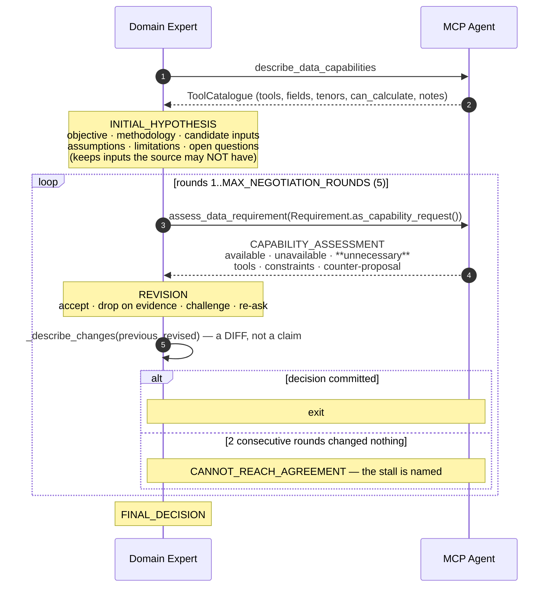
```mermaid
sequenceDiagram
    autonumber
    participant D as Domain Expert
    participant M as MCP Agent

    D->>M: describe_data_capabilities
    M-->>D: ToolCatalogue (tools, fields, tenors, can_calculate, notes)

    Note over D: INITIAL_HYPOTHESIS<br/>objective · methodology · candidate inputs<br/>assumptions · limitations · open questions<br/>(keeps inputs the source may NOT have)

    loop rounds 1..MAX_NEGOTIATION_ROUNDS (5)
        D->>M: assess_data_requirement(Requirement.as_capability_request())
        M-->>D: CAPABILITY_ASSESSMENT<br/>available · unavailable · **unnecessary**<br/>tools · constraints · counter-proposal
        Note over D: REVISION<br/>accept · drop on evidence · challenge · re-ask
        D->>D: _describe_changes(previous, revised) — a DIFF, not a claim
        alt decision committed
            Note over D,M: exit
        else 2 consecutive rounds changed nothing
            Note over D,M: CANNOT_REACH_AGREEMENT — the stall is named
        end
    end

    Note over D: FINAL_DECISION
```

## Why a hypothesis rather than a requirement

The previous design had the expert normalise its plan **before** anyone saw it: fields the
catalogue lacked were dropped silently, so the MCP agent received something already servable
and could only say yes. *That is not a negotiation, it is a rubber stamp, and it made the second
agent decorative.*

Now the opening move keeps the inputs the method asks for — including ones the data layer may
not have — and states what the expert does not know. The MCP agent answers with evidence, and
the most useful of the three verdicts is **"unnecessary, because the tool already abstracts
it."** That is the fact the expert cannot get from the corpus at any price.

## The four decisions, and what each tells the user

| Decision | Meaning | The user gets |
|---|---|---|
| `AGREED` | An executable plan both agents accept | The answer |
| `NEEDS_USER_INPUT` | A choice neither agent may make | One clarifying question |
| `UNSUPPORTED` | The data layer genuinely cannot serve this | A plain refusal and what it *can* do |
| `CANNOT_REACH_AGREEMENT` | The rounds ran out, or the conversation stalled | That fact, and no number |

A boolean `converged` could not distinguish the last three, so all three arrived as the same
flat "declined" — **including the case where one more sentence from the user would have
unblocked it**. `converged` is now *derived* (`decision == "AGREED"`), so the flag cannot drift
from the decision.

## Two bounds, because length and progress are different

| Constant | Value | Bounds |
|---|---|---|
| `MAX_NEGOTIATION_ROUNDS` | 5 | how long a conversation may run |
| `MAX_UNCHANGED_ROUNDS` | 2 | how long it may run **without getting anywhere** |

`_describe_changes` diffs the two requirements rather than trusting the expert's account of what
it changed. That diff was computed and written into the transcript for a long time before
anything *read* it, so a stalled conversation ran its full five rounds to finish exactly where
round one left it — **eight further model calls for nothing**.

Two rather than one, because the first dead round can still be followed by a genuine
convergence; by the second the data layer is answering the identical capability question (the
input fingerprints the same, so the assessment is the turn's own cached reply) and there is no
new information left in the loop.

## The projection that made idempotency work

`assess_data_requirement` is tagged `idempotent` and **never once fired**, because it was handed
the full requirement including `warnings`, which grows every round — and duplicate suppression
digests the *whole* input. The fix was a projection, `Requirement.as_capability_request()`, not
a narrower digest.

Projections must stay honest: the receiver **rebuilds the dataclass**, so a dropped field comes
back as its *default*, not as absent. Omitting `warnings` says "none shown"; omitting `grounded`
would assert `False` about an expert that had grounded its citation. Drop what is unread *and*
harmless as a default; keep the rest.

---

# 15. A2A Architecture

## What A2A means in this project

Every arrow between agents is an **A2A task**, not a Python method call. Each of the three
agents is an independently addressable service with an Agent Card, a set of skills, a JSON-RPC
endpoint and a full task lifecycle, mounted on the same FastAPI app.

| | |
|---|---|
| SDK | `a2a-sdk` ≥ 1.1.2 (proto-derived types + JSON-RPC server bindings) |
| Protocol revision | `PROTOCOL_VERSION_CURRENT` from `a2a.utils.constants` — reported live at `GET /health` under `a2a.protocol_version` |
| Transport | `A2A_TRANSPORT=inprocess` (default) dials the mounted ASGI app through httpx's ASGI transport — real JSON-RPC, real serialisation, real task lifecycle, no second port. `http` dials `A2A_BASE_URL` or a per-agent override |
| Card discovery | `GET /a2a/<agent>/.well-known/agent-card.json` |
| RPC | `POST /a2a/<agent>/` |
| Streaming | Advertised as **`false`**, because streaming is not implemented — *a client that subscribes to a stream nobody produces waits forever* |
| Task states used | `submitted`, `working`, `input-required`, `completed`, `failed`, `cancelled` |
| Artifacts | 15 named constants in `envelope.py`: `requirement`, `negotiation`, `catalogue`, `citations`, `serve_response`, `dataset`, `calculation`, `choices`, `outcome`, `error`, `input_request`, `title`, `capability_assessment`, `result_validation`, `completeness` |
| Push notifications | Advertised as `false` — not implemented |

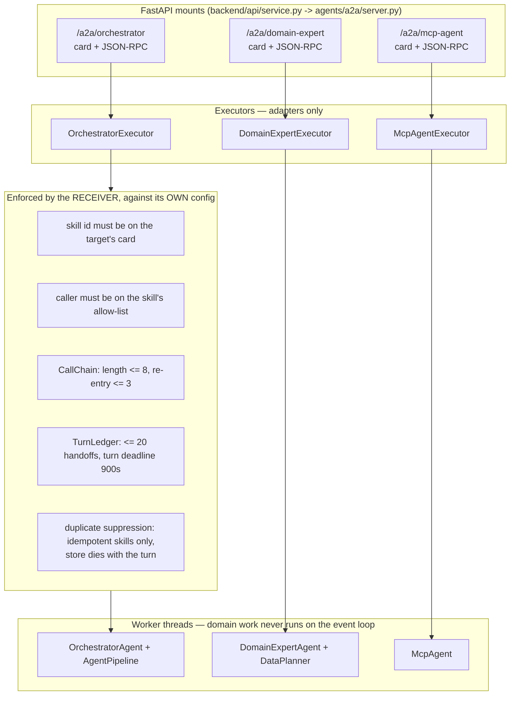
```mermaid
flowchart TB
    subgraph MOUNTS["FastAPI mounts (backend/api/service.py -> agents/a2a/server.py)"]
        M1["/a2a/orchestrator<br/>card + JSON-RPC"]
        M2["/a2a/domain-expert<br/>card + JSON-RPC"]
        M3["/a2a/mcp-agent<br/>card + JSON-RPC"]
    end
    subgraph EXEC["Executors — adapters only"]
        E1["OrchestratorExecutor"]
        E2["DomainExpertExecutor"]
        E3["McpAgentExecutor"]
    end
    subgraph GUARD["Enforced by the RECEIVER, against its OWN config"]
        G1["skill id must be on the target's card"]
        G2["caller must be on the skill's allow-list"]
        G3["CallChain: length <= 8, re-entry <= 3"]
        G4["TurnLedger: <= 20 handoffs, turn deadline 900s"]
        G5["duplicate suppression: idempotent skills only,<br/>store dies with the turn"]
    end
    subgraph WORK["Worker threads — domain work never runs on the event loop"]
        W1["OrchestratorAgent + AgentPipeline"]
        W2["DomainExpertAgent + DataPlanner"]
        W3["McpAgent"]
    end
    M1 --> E1 --> GUARD --> W1
    M2 --> E2 --> W2
    M3 --> E3 --> W3
```

## The five transport bounds

| Bound | Stops | Env var | Default |
|---|---|---|---|
| **Call chain length** | runaway nesting A→B→C→D→E→… | `A2A_MAX_CHAIN` | 8 |
| **Re-entry** | a *cycle*: A→B→A→B→A→… | `A2A_MAX_REENTRY` | 3 |
| **Handoff budget** | breadth: one agent calling a peer forever | `A2A_MAX_HANDOFFS` | 20 |
| **Duplicate suppression** | the same idempotent question asked twice in one turn | (always on) | — |
| **Turn deadline** | a wedged turn | `A2A_TURN_TIMEOUT_SECONDS` | 900s |

Plus two domain bounds outside the transport layer: `MAX_NEGOTIATION_ROUNDS=5` (in
`planning.py`) and `A2A_MAX_CLARIFICATIONS=3` (in `elicitation.py`).

### Why chain length and re-entry are two numbers, not one

They stop different faults. **Length** bounds how far a collaboration goes; **re-entry** bounds
how often the same `(agent, skill)` pair appears on the same path, which is what a cycle
actually looks like. One number tuned to catch `A→B→A→B` refuses honest four-step negotiations;
one tuned to permit those lets the cycle run to the limit.

A bounded negotiation of five rounds issues five *sibling* calls from one worker thread — each
at the **same** chain length, none nested inside another. Counting messages as depth made a
legitimate conversation look like a stack overflow.

The chain is carried as the **path itself** (`orchestrator.plan > domain-expert.derive >
mcp-agent.assess`), so a refusal can name the loop rather than reporting that some number was
reached.

### Why there is no flat per-call deadline

A call **contains** every call made beneath it, so one number applied identically at every depth
makes the outermost call the tightest bound in the system: it expires first by construction.
That is exactly what happened — `derive` took 80s and `assess` took 78s, both legitimately, and
the orchestrator's own 300s deadline then fired mid-revision and reported a turn that was
proceeding normally as hung. Raising the number would only have moved the same failure further
out.

Hang detection is not weakened by removing it: an agent hangs where it waits on the network, and
the model layer already bounds every provider request with `LLM_TIMEOUT_SECONDS`. **Each guard
sits at the level where the fault it catches actually occurs.**

### Duplicate suppression is loop prevention, not a cache

Identity is `(this turn, target agent, skill, canonical input)`. The store lives on the
`TurnLedger`, which is created when a user turn starts and **discarded when it ends** — nothing
survives a turn, so a later independent question can never be answered with an earlier one's
data. Within a turn, only skills their card tags `idempotent` are eligible. Fetching data,
running a calculation and resuming an interrupted plan are repeated rather than replayed,
because their answer is about *now*. *Tagging a data fetch idempotent to save a call is the
moment duplicate suppression becomes a cache and starts serving one user's numbers to another.*

## Caller allow-lists are authorization, not authentication

This is **internal caller authorization**: a logical boundary between components inside one
trusted process, read from message metadata the caller supplied. Nothing here verifies that a
message claiming to come from the orchestrator did. For a local-development system where all
three agents share a process and the only network listener is the developer's own service, a
logical boundary is the right weight — it makes the architecture enforceable and reviewable
without pretending to a security property it does not have. Deploying an agent on a host someone
else can reach is the point at which this would need real authentication (OAuth, JWT, mTLS), and
that is a deployment change.

## Two rules that keep A2A from becoming decorative

1. **Protocol stays out of behaviour.** Only `agents/a2a/` may import `a2a.types`,
   `a2a.client` or `a2a.server`. An agent module takes and returns the dataclasses in
   `agents/contracts.py`.
2. **`agents/pipeline.py` may not import `DomainExpertAgent` or `McpAgent`.** A test asserts
   this against the *parsed import graph* — A2A is decorative if the caller can still reach the
   callee directly. The specialists are not public attributes of `AgentNetwork`; reaching one
   means sending it a message.

The stronger half is `ExecutionContext`: each executor publishes the task it is running before
handing work to a worker thread, and an integration test requires every specialist execution to
carry one whose task id appears in the handoff ledger.

## Integers do not survive JSON

`Part.data` is a `google.protobuf.Value`, so `250` returns as `250.0`. Every typed rebuilder in
`envelope.py` coerces its own integer fields, and `restore_counts()` handles the free-form
structures via `COUNT_KEYS`. Without it, a count reaches a user-visible sentence as
"250.0 observations".

## A2A vs MCP

| Concern | **A2A** | **MCP** |
|---|---|---|
| Purpose | Agent-to-agent collaboration: delegation, negotiation, task lifecycle | Standardised model/agent access to tools, resources and prompts |
| Communication between | Orchestrator ⇄ Domain Expert ⇄ MCP Agent | MCP Agent (via `McpDataProvider` and `McpHost`) ⇄ the two servers |
| Data / tool access | **None.** No A2A message reaches PostgreSQL | **All of it.** The only road to the database and the risk engine |
| User interaction | Only the orchestrator's skills admit `user-boundary`; a specialist returns `input-required` | Elicitation flows server→client mid-call and is relayed, never shown directly |
| Protocol | `a2a-sdk` 1.x, JSON-RPC over HTTP/ASGI, protocol revision 1.0 | `mcp` ≥2.0, JSON-RPC over **stdio**, protocol revision 2026-07-28 |
| Unit of work | a **Task** with a lifecycle and named artifacts | a **tool call** with a typed result |
| Discovery | Agent Card at `/.well-known/agent-card.json` | `tools/list`, `resources/list`, `prompts/list` after `discover()` |
| Bounds | chain, re-entry, handoffs, duplicates, turn deadline | row limits, page sizes, roots containment, `missing_policy` |

> **A2A carries agents; MCP carries data.** Two protocols, two jobs, and neither replaced the
> other.

## How A2A differs from a normal Python function call

| | Python call | A2A call here |
|---|---|---|
| Addressing | import + attribute | agent id → card → mount path → JSON-RPC endpoint |
| Contract | a signature | a **published skill** whose id is checked against the target's card before an executor sees it |
| Authorization | none | per-skill caller allow-list, checked by the receiver |
| Failure | an exception propagates | a `failed` task with a structured `error` artifact; the user-facing sentence is written from the error **kind**, never its message |
| Interruption | not expressible | task state `input-required`, resumable by task id |
| Observability | a stack frame | a task id in the handoff ledger, a LangSmith span, an SSE event |
| Relocation | impossible without a refactor | one environment variable (`A2A_MCP_URL=…`) |

---

# 16. Complete End-to-End Request Sequence

A realistic data request: **"Compute the 10-day 99% historical VaR on the demo book."**

```mermaid
sequenceDiagram
    autonumber
    actor U as User
    participant R as React UI
    participant F as FastAPI :8000
    participant O as Orchestrator
    participant D as Domain Expert
    participant Q as Qdrant
    participant X as Redis
    participant M as MCP Agent
    participant H as McpHost
    participant DS as market-risk-data-mcp
    participant RS as risk-engine-mcp
    participant P as PostgreSQL
    participant L as LangSmith

    U->>R: types the question
    R->>R: newRequestId()
    R->>F: GET /chat/stream/{rid}  (SSE — subscribed FIRST)
    R->>F: POST /chat {query, session_id, request_id}
    F->>F: open TurnLedger(rid); read session memory
    F->>O: A2A handle_user_turn  [caller = user-boundary]
    O-->>L: root run: agent_pipeline (thread_id = session)
    O-->>R: SSE REQUEST_RECEIVED, ORCHESTRATOR_STARTED

    O->>O: orchestrator.classify  (structured, 8 fields)
    O-->>L: span orchestrator.classify (llm)
    O-->>R: SSE ORCHESTRATOR_DECISION route=data_request

    O->>D: A2A check_requirement_completeness
    D->>D: preflight.assess — regex + lexicon, no model
    D-->>O: complete (confidence and horizon were stated)
    O-->>R: SSE DOMAIN_VALIDATION_COMPLETED

    O->>D: A2A derive_data_requirement
    D->>X: exact-key lookup (question + corpus version + model identity + prompt version)
    X-->>D: miss
    D->>Q: query quant_knowledge   (2 queries, merged by distance)
    D->>Q: query market_risk_kb    (2 queries, merged by distance)
    Q-->>D: chunks + distances
    D-->>L: spans knowledge_retrieval, market_risk_reference_retrieval (retriever)
    D-->>R: SSE RETRIEVAL_COMPLETED

    D->>M: A2A describe_data_capabilities
    M-->>D: ToolCatalogue (34 capabilities, can_calculate=true)

    D->>D: domain_expert.derive -> INITIAL_HYPOTHESIS
    D->>D: strict schema+type validation, then grounding check of row_quote
    D-->>L: span domain_expert.derive (llm)

    loop bounded negotiation (<= 5 rounds; <= 2 unchanged)
        D->>M: A2A assess_data_requirement(as_capability_request)
        M->>M: mcp_agent.assess (llm)
        M-->>D: available / unavailable / unnecessary + counter-proposal
        D->>D: domain_expert.revise + _describe_changes diff
        D-->>R: SSE NEGOTIATION_ROUND
    end
    D-->>O: Requirement + Negotiation(decision=AGREED) + ToolCatalogue + citations

    O->>M: A2A execute_data_plan
    M->>M: getattr(RiskWorkflows, "compute_var")
    M->>H: get_portfolio(TREASURY_DEMO_001)
    H->>DS: stdio tools/call
    DS->>P: SELECT … analytics.v_mcp_portfolio_position  (as mcp_reader)
    P-->>DS: positions + instrument economics
    M->>H: get_curve + get_curve_history_matrix(trading_days=N)
    H->>DS: stdio tools/call
    DS->>P: SELECT … analytics.v_mcp_curve
    P-->>DS: N trading days x tenors
    DS-->>H: summary for the model; numeric matrix in _meta
    M->>H: compute_historical_risk_tool(...)
    H->>RS: stdio tools/call   (RS holds NO database credential)
    RS-->>M: VaR, ES, worst days, parameters actually used
    M-->>R: SSE MCP_TOOL_COMPLETED (per call, with measured duration)
    M-->>O: dataset + calculation + summary

    O->>D: A2A validate_result  (compute_var is in VALIDATED_CALCULATIONS)
    D-->>O: ResultValidation(verdict, mismatches, blocking)

    O->>O: orchestrator.reflect -> reply + interpretation
    O->>O: scrub_identifiers(); answer_builder.build()
    O-->>L: span orchestrator.reflect (llm)
    O-->>F: AgentOutcome (+ langsmith_url, handoffs, latency, structured)
    F->>F: persist session turn pair, clarified, waiting
    F-->>R: ChatResponse
    F-->>R: SSE REQUEST_COMPLETED, then done
    R-->>U: answer + table + chart + data plan + negotiation + trace
```

## The same flow, narrated

1. **User enters a question.** The React app is already showing the conversation.
2. **The client chooses `request_id`, then subscribes to `/chat/stream/{id}` *before* posting.**
   Subscribing after would race the first events; the backend replays a bounded per-run history
   on connect, but relying on the replay to cover a race you can simply not have "is the kind of
   thing that works until the day it does not."
3. **FastAPI validates the request** against `ChatRequest` and reads session memory: the last 12
   turns, a `clarified` flag, any `waiting` specialist task, any `clarification` the previous
   turn left pending.
4. **One A2A message goes to the orchestrator**, with caller identity `user-boundary`. A
   `TurnLedger` is opened here — once, at the user boundary — and found by id everywhere else.
5. **The orchestrator interprets conversation state.** If the previous turn asked a question,
   this message is merged with it into one complete sentence; if the previous turn was a
   clarification, a second one is suppressed in code.
6. **The route is classified** as a structured output, never parsed prose. The route is stamped
   as a LangSmith tag and metadata key, so "P95 latency of `data_request` turns" is answerable.
7. **The pre-flight gate runs** — deterministic, sub-millisecond, no model call, no vector
   search. An incomplete question stops here with one grouped clarification.
8. **The domain expert retrieves** from both Qdrant collections, two queries each, merged by
   best distance, and derives a `Requirement` in which every figure is quoted verbatim and the
   quote is verified against the retrieved text.
9. **The negotiation runs** — the expert proposes a hypothesis that keeps inputs the source may
   lack; the MCP agent answers with evidence including *"unnecessary"*; the expert revises; the
   diff proves a round did something.
10. **On `AGREED`, the MCP agent executes** — resolving the capability with `getattr` on
    `RiskWorkflows`, fetching the book and the curve history from the data server, and calling
    the risk server for the mathematics.
11. **A risk figure is validated** by the expert that agreed the plan. A blocking mismatch
    stops the answer.
12. **The orchestrator reflects** — reply plus interpretation in one call — and identifiers are
    scrubbed from both.
13. **`_finish` attaches** the LangSmith URL and trace id, the handoff ledger, the request id,
    the measured latency report, and the structured section document.
14. **FastAPI persists** the turn pair, the `clarified` flag and any `waiting` task id, then
    returns `ChatResponse`.
15. **The UI renders** the answer, the table, the curve chart, the data plan, the negotiation
    transcript, the execution graph, the latency breakdown and — on request — the LangSmith span
    tree fetched server-side.

---

# 17. Dataset Architecture

## The five Treasury datasets

All five are **real, official U.S. Treasury data**, downloaded from the Treasury XML feed and
validated before loading. Coverage as recorded in `data/metadata/us_treasury/load_verification.md`
(load run 8, generated 2026-08-25, **PASS 74/74**) and re-asserted against the live database by
`tests/use_cases/test_question_catalog.py`.

| Dataset (`data_key`) | Source | Purpose | Frequency | Shape | Since | Observations | Distinct dates | Important fields |
|---|---|---|---|---|---|---:|---:|---|
| `daily_treasury_yield_curve` | home.treasury.gov XML feed | Nominal par yield curve — the primary market-risk curve | daily | wide | 1990-01-02 | **108,339** | 9,159 | `BC_1MONTH` … `BC_30YEAR` (14 live tenors) + `BC_30YEARDISPLAY` (excluded) |
| `daily_treasury_bill_rates` | same | Bill rates in **two quoting bases** | daily | wide | 2002-01-02 | **105,204** | 6,157 | 4/8/13/17/26/52-week, each as bank-discount **and** coupon-equivalent; plus CUSIPs |
| `daily_treasury_real_yield_curve` | same | TIPS-derived real par yields | daily | wide | 2003-01-02 | **27,354** | 5,906 | `TC_5YEAR`, `TC_7YEAR`, `TC_10YEAR`, `TC_20YEAR`, `TC_30YEAR` |
| `daily_treasury_long_term_rate` | same | 20-year composite + long-term average | daily | long | 2000-01-03 | **19,965** | 6,655 | `rate_type`, `rate_percent`, extrapolation factor |
| `daily_treasury_real_long_term` | same | Long-term real average | daily | wide | 2000-01-03 | **6,655** | 6,655 | long-term real average rate |
| | | | | | **Total** | **267,517** | | **52 series** |

Full range: **1990-01-02 → 2026-08-11**. Manifest: **140** downloaded files, **0** checksum
failures.

## Quoting basis — the distinction that must never be lost

`treasury.quote_basis` is a PostgreSQL enum, not a comment:

| Value | What it is | Why it must not mix |
|---|---|---|
| `par_coupon_semiannual` | Par yield, bond-equivalent, semi-annual coupon | The curve everything prices off |
| `bank_discount_act360` | Bill **discount rate**, actual/360 | Not a yield. Plotting it on a par curve is a category error |
| `coupon_equivalent` | The same bill, restated on a coupon basis | Comparable to par yields; the discount rate is not |
| `average_real_yield` | Unweighted average of TIPS bid real yields | Real, not nominal — negative values are normal and correct |

> Getting `rate_kind` wrong is visible — a real yield among nominals looks odd immediately.
> Getting `quote_basis` wrong is not: a discount rate registered as `coupon_equivalent` sits
> quietly in a curve until someone prices off it.

## Synthetic data — clearly labelled

| What | Where | Classification |
|---|---|---|
| Demo portfolio (`TREASURY_DEMO_001`, 5 positions) | `demo.portfolio`, `demo.instrument`, `demo.position` | **`SYNTHETIC_DEMO`** |
| Stress scenarios (`TENOR_VECTOR_BP` and `HISTORICAL_REPLAY`) | `demo.scenario` | **`SYNTHETIC_DEMO`** |
| Every rate, curve and history | `treasury.observation` → `analytics.*` | **`REAL_MARKET_DATA`** |

Both labels travel in the MCP response envelope (`data_classification`) and survive into the
final answer. The `list_portfolios` tool description says it outright: *"All portfolios are
SYNTHETIC_DEMO — invented for demonstration. Never present them as a real book."*

Two further honesty rules that reach the user:

- **Bond values are model-implied** from the par curve, not executable prices.
- **Reported VaR is an analytical demonstration**, not a regulatory figure.

## What the data supports, and what it does not

| Application | Supported? | Why |
|---|---|---|
| Yield-curve level, slope, curvature | **yes** | Real par curves, 14 nominal tenors |
| Historical rate analysis | **yes** | 36 years of nominal, 23 of real |
| Curve inversion / steepening | **yes** | Derived from `v_mcp_curve` |
| Realised rate volatility | **yes** | `compute_rate_volatility` over a curve history matrix |
| DV01 / key-rate DV01 | **yes** | On the synthetic demo book, priced off the real curve |
| Historical / parametric / Monte-Carlo VaR and ES | **yes** | Same |
| Stress (parallel, key-rate, twist, curvature, ladder, matrix, historical replay, reverse) | **yes** | 23 stress-family tools |
| FRTB GIRR (delta, vega, curvature) | **yes, USD only** | Published Basel constants; risk classes outside GIRR are refused by name |
| P&L attribution, backtesting, limits, hedging | **yes** | On the demo book |
| CVA, EE/EPE/PFE, RWA, PD/LGD/EAD | **explained, never computed** | No counterparty or exposure data exists. The knowledge corpus covers them; the *Mapping status* table marks them **Explain-only** |
| FX, equity, commodity, credit-spread, option implied vol | **no** | No such data. Refused by name, not approximated |
| Instrument-level detail (CUSIP, issuer, settlement) for the curve | **no** | A par yield curve has none. Bill CUSIPs exist and are in `treasury.bill_security`, but that is a different dataset |

---

# 18. Dataset Ingestion Flow

Two independent ingestion pipelines: Treasury rates → PostgreSQL, and markdown → Qdrant.

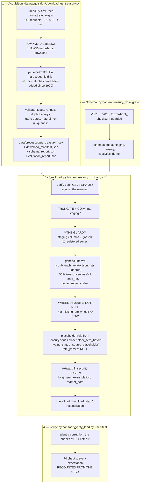
```mermaid
flowchart TD
    subgraph ACQ["1 — Acquisition: data/acquisition/download_us_treasury.py"]
        A1["Treasury XML feed<br/>home.treasury.gov<br/>~140 requests, ~60 MB, ~4 min"]
        A2["raw XML -> data/raw/<br/>SHA-256 recorded at download"]
        A3["parse WITHOUT a hardcoded field list<br/>(6 par maturities have been added since 1990)"]
        A4["validate: types, ranges, duplicate keys,<br/>future dates, natural-key uniqueness"]
        A5["data/processed/us_treasury/*.csv<br/>+ download_manifest.json<br/>+ schema_report.json<br/>+ validation_report.json"]
        A1-->A2-->A3-->A4-->A5
    end

    subgraph MIG["2 — Schema: python -m treasury_db.migrate"]
        B1["V001 … V013, forward-only,<br/>checksum-guarded"]
        B2["schemas: meta, staging, treasury,<br/>analytics, demo"]
        B1-->B2
    end

    subgraph LOAD["3 — Load: python -m treasury_db.load"]
        C1["verify each CSV's SHA-256<br/>against the manifest"]
        C2["TRUNCATE + COPY into staging.*"]
        C3["**THE GUARD**<br/>staging columns - ignored ⊆ registered series"]
        C4["generic unpivot<br/>jsonb_each_text(to_jsonb(st) - ignored)<br/>JOIN treasury.series ON data_key + lower(series_code)"]
        C5["WHERE kv.value IS NOT NULL<br/>-> a missing rate writes NO ROW"]
        C6["placeholder rule from<br/>treasury.series.placeholder_zero_before<br/>-> value_status='source_placeholder', rate_percent NULL"]
        C7["extras: bill_security (CUSIPs),<br/>long_term_extrapolation, market_note"]
        C8["meta.load_run / load_step / reconciliation"]
        C1-->C2-->C3-->C4-->C5-->C6-->C7-->C8
    end

    subgraph VER["4 — Verify: python tools/verify_load.py --self-test"]
        D1["plant a corruption; the checks MUST catch it"]
        D2["74 checks, every expectation<br/>RECOUNTED FROM THE CSVs"]
        D1-->D2
    end

    A5-->C1
    B2-->C1
    C8-->D1
```

## Idempotency and update strategy

- **Deterministic.** Staging is truncated and re-`COPY`ed; the unpivot is a pure function of
  staging plus `treasury.series`. A rerun produces a byte-identical result.
- **Forward-only migrations.** Editing an applied migration is refused by a checksum guard —
  *it is how two developers' databases silently diverge.*
- **Never load unverified bytes.** Each CSV's SHA-256 is checked against the manifest first.
  *Those would not be the bytes that were validated upstream.*
- **Lineage.** `meta.load_run`, `meta.load_step`, `meta.source_file` and `meta.reconciliation`
  make any number traceable back to a Treasury file, a URL and a checksum — which is what
  `explain_number` reads.

## The guard that makes the generic unpivot safe

The join to `treasury.series` is what decides which staging columns are rates. That join is also
the hazard: **an unregistered column would simply vanish, and every number that remained would
still look correct.** Nobody notices a maturity missing from a curve they have never seen
complete. So before any insert runs:

```
staging columns − ignored  ⊆  registered series codes
```

A violation aborts the load, naming the column:

```
daily_treasury_yield_curve: staging column(s) with no registered series:
['bc_2_5month']. Treasury has published a series this database does not know
about. Add it in a migration - do not let the load drop it.
```

**This failure is the feature. Silence would be the defect.** Adding a maturity is then a new
migration with a staging column and a `treasury.series` row — no loader change, because the
unpivot discovers columns and holds no list. Full contract: [`docs/loading-contract.md`](docs/loading-contract.md).

## Knowledge ingestion → Qdrant

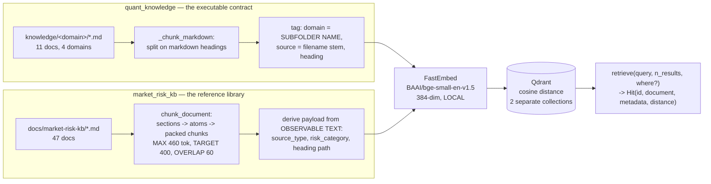
```mermaid
flowchart LR
    subgraph EXEC["quant_knowledge — the executable contract"]
        K1["knowledge/&lt;domain&gt;/*.md<br/>11 docs, 4 domains"]
        K2["_chunk_markdown:<br/>split on markdown headings"]
        K3["tag: domain = SUBFOLDER NAME,<br/>source = filename stem, heading"]
        K1-->K2-->K3
    end
    subgraph REF["market_risk_kb — the reference library"]
        R1["docs/market-risk-kb/*.md<br/>47 docs"]
        R2["chunk_document:<br/>sections -> atoms -> packed chunks<br/>MAX 460 tok, TARGET 400, OVERLAP 60"]
        R3["derive payload from OBSERVABLE TEXT:<br/>source_type, risk_category, heading path"]
        R1-->R2-->R3
    end
    E["FastEmbed<br/>BAAI/bge-small-en-v1.5<br/>384-dim, LOCAL"]
    K3-->E
    R3-->E
    E-->Q[("Qdrant<br/>cosine distance<br/>2 separate collections")]
    Q-->RET["retrieve(query, n_results, where?)<br/>-> Hit(id, document, metadata, distance)"]
```

**Why the reference corpus needed its own chunker.** `BAAI/bge-small-en-v1.5` truncates at 512
tokens *silently* — the tokenizer is configured with truncation on, so an oversized section is
embedded from its first 512 tokens and the remainder is never represented at all. Measured on
`docs/market-risk-kb/`, heading-only chunking produced **1,402 chunks of which 99 exceeded 512
tokens, discarding 26,413 tokens (8.2% of the corpus)**. The worst was a 2,576-token calculation
catalogue section: 66 calculations, of which about 13 would have been searchable.

> Truncation is the dangerous failure because it is invisible. The collection reports the right
> chunk count, retrieval returns plausible neighbours, and the missing two thirds of a table
> simply never match anything.

Three properties make the retrieved text usable rather than merely small:

- **Every chunk carries its full heading path** as a breadcrumb prefix, so an isolated group of
  table rows reads `# 31 - Master Calculation Catalog / ## B. Interest Rate Sensitivities`
  before its first row.
- **A category's blockquote header is repeated into every chunk of that section** — it states
  the market data, aggregation level and regulatory use for the whole category.
- **A split table repeats its header row.** `| IR-02 | Modified duration | … |` is unreadable
  without `| ID | Calculation | Alt names | … |` above it.

**Idempotency:** ids are deterministic, so a rerun upserts in place. Because a document that now
chunks into *fewer* pieces than last time would leave orphans behind that stay retrievable
forever, the `VectorStore` interface carries `ids_where()` and `delete()`, and the reference
ingest prunes.

---

# 19. PostgreSQL Architecture

**Why PostgreSQL:** the data is genuinely relational and genuinely semantic — a rate is
meaningless without its series, and a series is meaningless without its quoting basis and
tenor. Enums, check constraints, composite foreign keys and role grants are the mechanisms that
make "a discount rate can never be mistaken for a par yield" a *property of the database*
rather than a convention the application is trusted to follow.

## Five schemas, each with one job

| Schema | Job | Visible to `mcp_reader`? |
|---|---|---|
| `staging` | One table per CSV, mirroring it exactly. Truncated and re-`COPY`ed each load | **no** |
| `treasury` | The normalised source of record: `dataset`, `series`, `observation`, `bill_security`, `long_term_extrapolation`, `market_note` | **no** |
| `meta` | Lineage: `load_run`, `load_step`, `source_file`, `reconciliation` | only `meta.source_file` |
| `analytics` | 15 views — the only rate surface anything above the database sees | **yes** (SELECT) |
| `demo` | Synthetic book and scenarios: `portfolio`, `instrument`, `position`, `scenario` | **yes** (SELECT) |

## Entity model

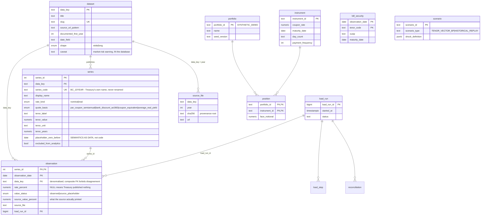
```mermaid
erDiagram
    dataset ||--o{ series : "publishes"
    dataset ||--o{ observation : "data_key"
    series ||--o{ observation : "series_id"
    load_run ||--o{ observation : "load_run_id"
    load_run ||--o{ load_step : ""
    load_run ||--o{ reconciliation : ""
    dataset ||--o{ source_file : "data_key + year"
    portfolio ||--o{ position : ""
    instrument ||--o{ position : ""

    dataset {
        text data_key PK
        text title
        text slug UK
        text source_url_pattern
        int documented_first_year
        text date_field
        enum shape "wide|long"
        text caveat "market-risk warning, IN the database"
    }
    series {
        int series_id PK
        text data_key FK
        text series_code UK "BC_10YEAR - Treasury's own name, never renamed"
        text display_name
        enum rate_kind "nominal|real"
        enum quote_basis "par_coupon_semiannual|bank_discount_act360|coupon_equivalent|average_real_yield"
        text tenor_label
        numeric tenor_value
        text tenor_unit
        numeric tenor_years
        date placeholder_zero_before "SEMANTICS AS DATA, not code"
        bool excluded_from_analytics
    }
    observation {
        int series_id PK, FK
        date observation_date PK
        text data_key FK "denormalised; composite FK forbids disagreement"
        numeric rate_percent "NULL means Treasury published nothing"
        enum value_status "observed|source_placeholder"
        numeric source_value_percent "what the source actually printed"
        text source_file
        bigint load_run_id FK
    }
    bill_security {
        date observation_date PK
        text tenor_code PK
        text cusip
        date maturity_date
    }
    load_run {
        bigint load_run_id PK
        timestamptz started_at
        text status
    }
    source_file {
        text data_key
        int year
        text sha256 "provenance root"
        text url
    }
    portfolio {
        text portfolio_id PK "SYNTHETIC_DEMO"
        text name
        text seed_version
    }
    instrument {
        text instrument_id PK
        numeric coupon_rate
        date maturity_date
        text day_count
        int payment_frequency
    }
    position {
        text portfolio_id PK, FK
        text instrument_id PK, FK
        numeric face_notional
    }
    scenario {
        text scenario_id PK
        text scenario_type "TENOR_VECTOR_BP|HISTORICAL_REPLAY"
        jsonb shock_definition
    }
```

## Two design rules the schema exists to enforce

**1. A new maturity must be a ROW, not a column.** Treasury has added six maturities to the par
curve since 1990 and expects to add more. A wide table would need DDL, a migration and an
application change every time. Here `BC_1_5MONTH` arriving in 2025 is one `INSERT` into
`treasury.series`, and the loader picks it up on the next run.

**2. Every rate carries its quoting basis.** Stored as bare numbers in adjacent columns, a bill
discount rate and a par coupon yield look interchangeable, and eventually someone plots them on
one curve. `quote_basis` makes that mistake impossible to make by accident and trivial to filter
out.

## The constraints that make NULL mean NULL

```sql
CONSTRAINT observation_rate_is_plausible
    CHECK (rate_percent IS NULL OR rate_percent BETWEEN -25 AND 100)

CONSTRAINT observation_status_matches_value
    CHECK (
        (value_status = 'observed'           AND rate_percent IS NOT NULL)
     OR (value_status = 'source_placeholder' AND rate_percent IS NULL
                                             AND source_value_percent IS NOT NULL)
    )
```

The plausibility band is deliberately wide enough that it can only fire on corruption.
**Negative rates are legitimate and permitted** — the real curve prints them routinely.

A placeholder row keeps what the source actually printed in `source_value_percent`, so the trap
stays auditable rather than being erased.

## Indexes

| Index | Table | Purpose |
|---|---|---|
| PK `(series_id, observation_date)` | `observation` | The natural key |
| `observation_date_idx` | `observation` | Point-in-time curve reads |
| `observation_dataset_date_idx` | `observation` | Per-dataset ranges |
| `observation_date_brin_idx` (BRIN) | `observation` | Cheap range scans over a naturally date-ordered table |
| `series_data_key_idx`, `series_tenor_idx` | `series` | Catalogue and tenor-range filters |
| `source_file_data_key_year_idx` | `meta.source_file` | Provenance lookup |
| `load_step_run_idx`, `reconciliation_run_idx` | `meta` | Lineage joins |

## The analytics views

| View | What it serves |
|---|---|
| `v_series`, `v_observation` | The tidy long form and the catalogue |
| `v_par_yield_curve`, `v_real_yield_curve` | Pivoted curves by date |
| `v_bill_rates_quoted`, `v_long_term_rates` | The other three datasets |
| `v_latest_rates`, `v_series_coverage`, `v_dataset_summary` | Current state and coverage |
| `v_source_file_current` | Provenance for `explain_number` |
| `v_mcp_observation`, `v_mcp_curve`, `v_mcp_portfolio_position` | The MCP read surface |
| `v_mcp_series_catalogue`, `v_mcp_dataset` | Catalogue tools |

`V013__mcp_curve_single_source.sql` redefines `v_mcp_curve` so nominal and real curves come from
one source rather than two definitions that could drift.

## The privilege boundary

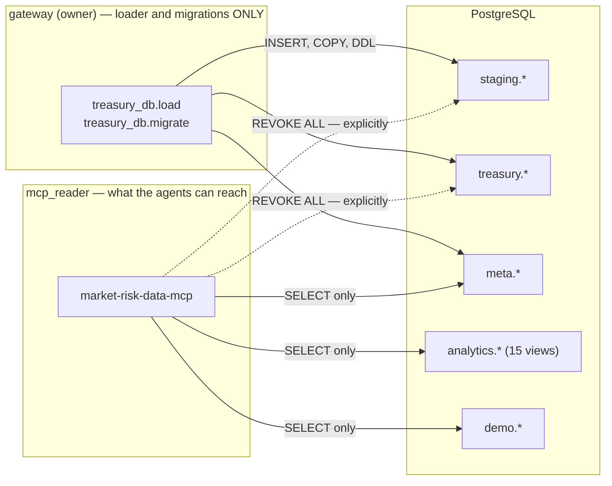
```mermaid
flowchart LR
    subgraph OWNER["gateway (owner) — loader and migrations ONLY"]
        L["treasury_db.load<br/>treasury_db.migrate"]
    end
    subgraph READER["mcp_reader — what the agents can reach"]
        MS["market-risk-data-mcp"]
    end
    subgraph DB["PostgreSQL"]
        ST["staging.*"]
        TR["treasury.*"]
        MT["meta.*"]
        AN["analytics.* (15 views)"]
        DM["demo.*"]
    end
    L -->|"INSERT, COPY, DDL"| ST
    L --> TR
    L --> MT
    MS -->|"SELECT only"| AN
    MS -->|"SELECT only"| DM
    MS -->|"SELECT only"| MT
    MS -.->|"REVOKE ALL — explicitly"| TR
    MS -.->|"REVOKE ALL — explicitly"| ST
```

`V009__mcp_reader.sql`:

```sql
GRANT CONNECT ON DATABASE gateway TO mcp_reader;
GRANT USAGE, SELECT ON SCHEMA/TABLES analytics TO mcp_reader;
GRANT USAGE, SELECT ON SCHEMA/TABLES demo      TO mcp_reader;
GRANT USAGE  ON SCHEMA meta TO mcp_reader;
GRANT SELECT ON meta.source_file TO mcp_reader;   -- the one exception

REVOKE ALL ON SCHEMA treasury FROM mcp_reader;
REVOKE ALL ON ALL TABLES IN SCHEMA treasury FROM mcp_reader;
REVOKE ALL ON SCHEMA staging  FROM mcp_reader;
REVOKE ALL ON ALL TABLES IN SCHEMA staging  FROM mcp_reader;
REVOKE ALL ON ALL TABLES IN SCHEMA meta FROM mcp_reader;
GRANT  SELECT ON meta.source_file TO mcp_reader;
```

The `REVOKE`s are explicit even where the default would already deny — *a future
`GRANT … ON ALL TABLES` cannot silently widen a boundary that is on the record.*
`ALTER DEFAULT PRIVILEGES` keeps a newly created analytics view readable without a manual grant.
`python -m mcp_servers.host --isolation` proves the risk engine cannot reach the database at all.

A separate `gateway_readonly` NOLOGIN role (`V007__grants.sql`) exists for human/BI read access
and is broader — it can see `treasury.dataset` and `treasury.series`.

## How the MCP layer queries

- **No SQL is generated by a model.** Every statement lives in
  `mcp/src/mcp_servers/data/repository.py` and is parameterised.
- **Only `analytics.*` and `demo.*` are reachable**, by grant.
- **Row limits are explicit and named**: at most 32 series codes for coverage, at most 16 for
  history, `repo.DEFAULT_HISTORY_PAGE` for pagination, `MAX_DISPLAY_ROWS = 500` in the agent.
- **Pagination is cursor-based** and the cursor is signed with `MCP_CURSOR_KEY` so it survives a
  server restart; unset, cursors simply do not outlive the process.
- **Dates are never shifted silently.** `get_curve(date_policy=…)` defaults to `exact`; a caller
  must ask for `previous` or `next` to accept a shift.
- **Gaps are refused by default.** `get_curve_history_matrix(missing_policy="reject")` will not
  return a window with holes, *since silently dropping dates changes any risk number computed
  from it*; `intersection` accepts them and reports `excluded_dates`.
- **Rates are `numeric(9,4)` in percent, as published**: `3.72` means 3.72% — not a decimal
  fraction and not basis points.

---

# 20. Qdrant Vector Database Architecture

**Why Qdrant:** the knowledge layer answers *semantic* questions ("what assumptions does
historical simulation make?") that no relational index can serve. It runs either embedded (a
local path, no Docker) or against a Dockerized server, selected by `QDRANT_URL` — which is what
makes the `VectorStore` seam real rather than nominal.

## The two collections

| Collection | Purpose | Content | Source | Embedding model | Dimensions | Distance | Chunking |
|---|---|---|---|---|---|---|---|
| **`quant_knowledge`** | **Executable analytical contract** — the only corpus that may support an operational constraint | 11 documents across 4 domains; **71 points** (asserted by `tests/use_cases/test_question_catalog.py`) | `knowledge/<domain>/*.md` | `BAAI/bge-small-en-v1.5` | **384** | **Cosine** | heading split (`_chunk_markdown`) |
| **`market_risk_kb`** | **Reference library** — terminology, calculation choice, risk factors, formulas, regulation | 47 documents, ~167,000 words | `docs/market-risk-kb/*.md` | `BAAI/bge-small-en-v1.5` | **384** | **Cosine** | hierarchy-aware, budget-enforced (`markdown_chunker.py`) |

> Point count for `market_risk_kb` is **not asserted by a test** and therefore not stated here as
> a fact. Ask the running instance: `curl -s localhost:6333/collections/market_risk_kb`.

### `quant_knowledge` — the 11 documents

| Domain | Documents |
|---|---|
| `market_risk` | `var`, `expected_shortfall`, `stress_testing`, `sensitivities_greeks`, `yield_curve` |
| `credit_risk` | `pd_lgd_ead`, `credit_ratings_pd` |
| `regulatory_capital` | `rwa`, `basel_capital_ratios` |
| `xva` | `cva`, `exposure_metrics` |

**The subfolder name *is* the domain tag** — that is the whole tagging mechanism, and it is why
`retrieve(query, domain="credit_risk")` works with no registry.

These are **executable analytical contracts**, not just prose. Each states its *Required inputs*
as canonical concepts, names the real MCP tool that computes the metric
(`compute_historical_risk_tool`, `compute_dv01_tool`, `run_stress_tool`, `get_curve`, …), and
ends with a ***Mapping status*** table recording whether every input resolves to real data —
and therefore whether the mode is **Calculate + Explain** or **Explain-only**. CVA and RWA have
no counterparty data, so they explain but never compute. **The knowledge never asks for data the
system does not have.**

### `market_risk_kb` — the 47 documents

The taxonomy, instrument coverage, risk-class treatments, VaR/ES/stress, the FRTB framework, and
six large reference catalogues (calculations, formulas, risk factors, glossary,
question-to-calculation, dependency graph). Payload metadata (`source_type`, `risk_category`,
heading path, document title) is **derived from observable text** — a regex over the heading
path, the document title, or the chunk's own body. Nothing is inferred, and a field with no
match is *omitted rather than guessed*: a `risk_category` nobody can trace back to a line of the
document is worse than none, because it will eventually be filtered on.

## Why two collections rather than one with a `corpus` payload field

All three reasons reduce to blast radius:

1. `KnowledgeBase(rebuild=True)` calls `store.reset()`, which **deletes the collection**.
   Sharing one collection means the documented re-ingest command for `knowledge/` silently
   destroys the market-risk vectors. *A payload flag cannot protect against a collection-level
   delete.*
2. The two corpora have **different chunking**. Storing both under one schema would mean one of
   them lying about how it was built.
3. **Retrieval can be measured per corpus**, which is what makes a regression in one visible
   rather than averaged away.

## Retrieval

```python
store.query(text, n_results=3, where=None) -> list[Hit]
# Hit(id, document, metadata, distance)   # distance = 1.0 - cosine similarity
```

| Aspect | Behaviour |
|---|---|
| Top-k | `DomainExpertAgent(n_results=6)` by default; the reference retrieval takes `market_risk_n_results` and caps kept chunks with `max_reference_chunks` |
| Queries per corpus | **two**, merged by best distance — "what is expected shortfall" and "how many observations does it read" cannot both be near one embedding |
| Score | `score = 1.0 - distance`, rounded to 4 dp, carried into the citation shown in the UI |
| Filtering | Optional payload filter (`{"domain": "credit_risk"}`) via `models.Filter` / `FieldCondition` |
| Merging | By best distance across both queries; duplicates collapse on chunk id |
| Point ids | Qdrant requires uint or UUID, so a stable UUID5 is derived from the string id — which is what makes upsert idempotent |
| Bookkeeping | `ids_where()` **scrolls** rather than searches: "what does this document currently own?" is not a similarity question, and asking it with a query vector would silently cap at the search limit |

## How retrieved context enters the prompt

Two explicitly labelled blocks, never merged:

```
MARKET RISK REFERENCE CONTEXT        <- may inform terminology and calculation choice
   …chunks from market_risk_kb…

EXECUTABLE KNOWLEDGE CONTEXT         <- the ONLY section that may support an exact
   …chunks from quant_knowledge…        operational field, window, row count or parameter
```

and the row-count quote is then verified back against **the retrieved text**, so nothing from
either block can enter the requirement unquoted.

---

# 21. Embedding Architecture

| | |
|---|---|
| **Model** | **`BAAI/bge-small-en-v1.5`** |
| **Library / provider** | `fastembed`, bundled via `qdrant-client[fastembed]` ≥ 1.12 |
| **Dimensions** | **384** |
| **Distance metric** | **Cosine** (`models.Distance.COSINE`) |
| **Hard token limit** | **512** (`MODEL_LIMIT`), truncation **silent** |
| **Local or API** | **Local.** No external embedding API, no embedding key, no per-token embedding cost |
| **Where generated** | `QdrantVectorStore._embed()` — both at ingest and at query time, so the two can never drift apart |
| **Normalisation** | None applied in this repository; the model is used as FastEmbed returns it, and cosine distance is scale-invariant in direction |

**Why it is appropriate here:** the corpora are English technical prose measured in hundreds of
thousands of words, not billions; 384 dimensions keep the index small and queries fast; and a
*local* model means ingest and retrieval work with no network, no key and no vendor coupling —
which matters because `llm/` is already a swap seam and adding a second mandatory vendor would
undo that.

**Why the 512-token limit drove a whole chunker.** See §18 — the tokenizer truncates silently,
so exceeding it discards text while every count still looks right. The budget is set at
`MAX_TOKENS = 460` rather than 512, and the gap is not padding: a packed chunk is measured as
`count(head) + count(body)` and the tokenizer does not always agree with itself across that join
(measured drift up to **+12 tokens** on a corpus full of Sigma, subscripts and middots), and the
ingest prepends a document title (~15 tokens) to chunks whose outermost heading is not the
document's own. *The margin is the difference between a guarantee and a hope.*

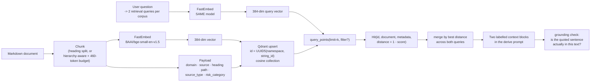
```mermaid
flowchart LR
    D["Markdown document"] --> C["Chunk<br/>(heading split, or<br/>hierarchy-aware + 460-token budget)"]
    C --> P["Payload<br/>domain · source · heading path ·<br/>source_type · risk_category"]
    C --> E1["FastEmbed<br/>BAAI/bge-small-en-v1.5"]
    E1 --> V["384-dim vector"]
    V --> QU["Qdrant upsert<br/>id = UUID5(namespace, string_id)<br/>cosine collection"]
    P --> QU

    Q["User question<br/>-> 2 retrieval queries per corpus"] --> E2["FastEmbed<br/>SAME model"]
    E2 --> V2["384-dim query vector"]
    V2 --> S["query_points(limit=k, filter?)"]
    QU --> S
    S --> H["Hit(id, document, metadata,<br/>distance = 1 - score)"]
    H --> MG["merge by best distance<br/>across both queries"]
    MG --> CTX["Two labelled context blocks<br/>in the derive prompt"]
    CTX --> GR["grounding check:<br/>is the quoted sentence<br/>actually in this text?"]
```

---

# 22. Redis / Caching Architecture

## Status: **implemented and wired**, optional and fail-open

This was verified rather than assumed. Redis is not a configuration stub:

| Evidence | Where |
|---|---|
| 13 modules, ~2,700 lines | `agents/cache/` |
| Called from both specialists | `agents/domain_expert_agent.py` and `agents/mcp_agent.py` both `from agents.cache import get_intelligence` |
| Wired into the network | `agents/a2a/runtime.py` builds it and passes it into `DomainExpertAgent` and `McpAgent` |
| Reported at runtime | `GET /health` → `redis`; `GET /health?analytics=true` adds top questions, latency percentiles and stream lengths |
| Compose service | `redis:8.8.2` with AOF + RDB, `volatile-lfu`, plus RedisInsight on :5540 |
| Tested | `tests/test_redis_intelligence.py` (16 tests) |
| Documented | [`docs/redis.md`](docs/redis.md) |

**Two different defaults, and the difference matters.** `RedisConfig.enabled` defaults to
**`False`** in code — so importing this library in a unit test does not reach for a server. The
shipped `.env.example` sets `REDIS_ENABLED=true`, and Compose overrides `REDIS_URL` inside the
agent container. So: **on by default for the full local stack, off by default for a bare
import.**

> **Redis is derived memory, not authority.** PostgreSQL owns data, Qdrant owns knowledge.
> Redis failures are cache misses unless `REDIS_REQUIRED=true`.

## What is cached — and what is deliberately not

`agents/cache/policies.py` is the single matrix; **no agent contains a TTL constant.**

| Agent | Operation | Exact cache | Semantic cache | TTL (env) | Expensive LLM? |
|---|---|---|---|---|---|
| `domain_expert` | `retrieve` | ✅ | ✖ | `REDIS_DOMAIN_RETRIEVAL_TTL` = 900s | no |
| `domain_expert` | `retrieve_reference` | ✅ | ✖ | 900s | no |
| `domain_expert` | **`derive`** | ✅ | **✅** | `REDIS_DOMAIN_DERIVE_TTL` = 86,400s | **yes** |
| `domain_expert` | `revise` | ✅ | ✖ | `REDIS_DOMAIN_REVISE_TTL` = 43,200s | **yes** |
| `domain_expert` | `validate_result` | ✅ | ✖ | `REDIS_DOMAIN_VALIDATE_TTL` = 3,600s | **yes** |
| `mcp_agent` | `catalogue` | ✅ | ✖ | `REDIS_MCP_CATALOGUE_TTL` = 300s | no |
| `mcp_agent` | **`assess`** | ✅ | ✖ | `REDIS_MCP_ASSESS_TTL` = 21,600s | **yes** |
| `mcp_agent` | `choices` | ✅ | ✖ | `REDIS_MCP_CHOICES_TTL` = 300s | no |
| `mcp_agent` | **`execute`** | **✖ — deliberately absent** | ✖ | — | — |

> **MCP execution is never cached.** The policy module states why in a comment: *"A historical
> result is cacheable only when every provider exposes an immutable snapshot identity. The
> current seam does not, so 'latest' and '2008' both execute normally."* `execution_cacheability()`
> exists purely to make that refusal explicit and returns
> `(False, "historical_snapshot_identity_not_exposed_by_provider")`.

So: **repeated questions can avoid a reasoning call, but never a data fetch or a calculation.**

## Key structure

`KeyBuilder` — namespace is `{REDIS_CACHE_PREFIX}` (default `smcp`), and every key shape lives
in one file:

| Shape | Purpose |
|---|---|
| `smcp:cache:{agent}:{operation}:{sha256}` | Exact cache entry |
| `smcp:semantic:{agent}:{operation}:{sha256}` | Semantic cache entry (JSON + vector) |
| `smcp:idx:semantic` | The vector index over those |
| `smcp:lock:{digest}` | Single-flight lease |
| `smcp:run:{request_id}` · `smcp:idx:runs` | Per-turn run summary (`REDIS_RUN_SUMMARY_TTL` = 7 days) |
| `smcp:stream:agent-events` | Bounded Stream (`REDIS_AGENT_STREAM_MAXLEN` = 50,000) |
| `smcp:stats:counters` · `smcp:stats:question-frequency:{scope}` · `smcp:stats:cache-expiry` | Counters and frequency |
| `smcp:ts:{agent}:{operation}:{metric}` | TimeSeries (`REDIS_METRICS_RETENTION_SECONDS` = 30 days) |
| `smcp:rate:llm:{scope}` | Fixed-window LLM rate limit |

**The digest is what makes an entry safe to reuse.** It is a SHA-256 over
`{identity, versions, model, result_kind}`, where `versions` carries the **corpus content
version**, the **prompt version** and the **schema version** (`agents/cache/versions.py`), and
`model` carries the resolved backend and model id. Edit a knowledge document, change a prompt,
change a schema, or switch `LLM_BACKEND` — and every derived entry is a different key. There is
no invalidation step to forget, because the old key is simply never asked for again.

## Cache hit / miss, with single-flight

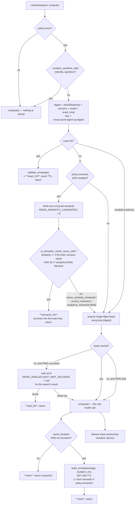
```mermaid
flowchart TD
    A["cached(request, compute)"] --> P{"policy.exact?"}
    P -->|no| Z["compute() — nothing is stored"]
    P -->|yes| SEC{"contains_sensitive_data<br/>(identity, question)?"}
    SEC -->|yes| Z
    SEC -->|no| K["digest = sha256(identity + versions + model + result_kind)<br/>key = smcp:cache:agent:op:digest"]
    K --> EX{"exact hit?"}
    EX -->|yes| EXH["validate_envelope()<br/>-> **exact_hit**, touch TTL, return"]
    EX -->|no| SM{"policy.semantic<br/>AND enabled?"}
    SM -->|yes| SMQ["KNN over smcp:idx:semantic<br/>REDIS_SEMANTIC_CANDIDATES = 8"]
    SMQ --> GATE{"is_semantic_cache_reuse_safe?<br/>similarity >= 0.93 AND versions equal<br/>AND all 17 analytical fields identical"}
    GATE -->|"yes"| SMH["**semantic_hit**<br/>promote into the exact key, return"]
    GATE -->|"no: below_similarity_threshold /<br/>version_mismatch /<br/>analytical_mismatch:{field}"| LOCK
    SM -->|no| LOCK
    EX -->|"InvalidCacheEntry"| LOCK
    LOCK["acquire single-flight lease<br/>smcp:lock:{digest}"] --> OWN{"lease owned?"}
    OWN -->|"no, and PING succeeds"| WAIT["wait up to<br/>REDIS_SINGLEFLIGHT_WAIT_SECONDS = 310<br/>for the owner's result"]
    WAIT -->|"found"| WH["**wait_hit**, return"]
    WAIT -->|"timed out"| CMP
    OWN -->|"yes"| CMP
    OWN -->|"no, and PING fails"| CMP
    CMP["compute() — the real model call"] --> CIF{"cache_if(value)<br/>AND not sensitive?"}
    CIF -->|no| RET["**miss**, return uncached"]
    CIF -->|yes| ST["build_envelope(usage, duration_ms)<br/>SET with TTL<br/>(+ store semantic if policy.semantic)"]
    ST --> RET2["**miss**, return"]
    CMP --> REL["release lease (ownership-checked, atomic)"]
```

Four distinct outcomes are recorded, not two: `exact_hit`, `semantic_hit`, `wait_hit`, `miss` —
each with its Redis latency, and each surfaced in the LangSmith trace via
`_trace_cache_status()`.

**The `SET NX` subtlety:** a lease that is not owned can mean contention *or* an unavailable
Redis. A bounded `PING` distinguishes them — an outage computes **now** instead of pretending
another owner exists and waiting minutes for a result that will never arrive.

## Why the semantic cache cannot serve a wrong answer

Vector similarity alone is *not* authorization. `is_semantic_cache_reuse_safe()` requires **all**
of:

1. `similarity >= REDIS_SEMANTIC_SIMILARITY_THRESHOLD` (0.93)
2. a non-empty `metric` in the query's analytical signature
3. **exact equality of every version** (corpus, prompt, schema, model)
4. **exact equality of all 17 material analytical fields**: `policy_version`, `metric`,
   `method`, `confidence_level`, `horizon_days`, `lookback_days`, `curve_family`, `tenors`,
   `temporal_mode`, `temporal_values`, `requested_fields`, `requested_rows`, `portfolio`,
   `scenario`, `shock_bp`, `numbers`, `calculation_params`

A refusal names its reason (`analytical_mismatch:confidence_level`), which is what makes a
suspiciously low hit rate diagnosable. **"99% VaR" and "97.5% VaR" are semantically almost
identical and can never share a cache entry here.**

## Everything else Redis does

| Capability | Mechanism | Configured by |
|---|---|---|
| **Single-flight** | Ownership-checked lock, atomically released; waits bounded *below* the A2A turn deadline | `REDIS_LOCK_TTL_MS` = 360,000 · `REDIS_SINGLEFLIGHT_WAIT_SECONDS` = 310 |
| **LLM rate limiting** | Redis 8.8 `INCREX`, atomic across processes; fixed window. **Zero deliberately disables a limit**, and all three default to 0 | `REDIS_GLOBAL_LLM_RATE_LIMIT`, `REDIS_DOMAIN_LLM_RATE_LIMIT`, `REDIS_MCP_LLM_RATE_LIMIT`, `REDIS_LLM_RATE_WINDOW_SECONDS` |
| **Operational evidence** | Streams (capped), TimeSeries (retention-bounded), counters, question frequency (capped), per-run summaries | `REDIS_AGENT_STREAM_MAXLEN`, `REDIS_METRICS_RETENTION_SECONDS`, `REDIS_QUESTION_FREQUENCY_MAX_ENTRIES`, `REDIS_RUN_SUMMARY_TTL` |
| **Run completion** | `complete_run(request_id, question, route, result_status, total_latency_ms, negotiation_rounds)` — called from `/chat`, and **wrapped so analytics never changes the response** | `REDIS_RUN_SUMMARY_TTL` |
| **Admin** | `clear(scope)` for `all` / `domain` / `mcp` / `semantic`, using `SCAN` + `UNLINK` in batches | — |
| **Redaction** | `contains_sensitive_data()` / `redact_sensitive()` run on both the key material and the value before anything is written | — |

## Measured savings

**Not benchmarked in this repository.** What can be stated is structural: a `derive` hit avoids
one domain-expert reasoning call (`_MIN_TOKENS = 12,000`), and an `assess` hit avoids one
MCP-agent reasoning call (`_MIN_TOKENS = 10,000`) — and `agents/cache/telemetry.py` records the
token usage and duration of every avoided call, so the saving is *measurable in a running
instance* via `GET /health?analytics=true`. No figure is claimed here that the repository does
not contain.

---

# 23. Qdrant vs PostgreSQL

The source code confirms this division, and both stores can contribute to one answer.

| | **Qdrant** | **PostgreSQL** |
|---|---|---|
| Holds | Semantic / reference knowledge, as text | Structured analytical data, as numbers |
| Answers | "what does this method require?", "when should I use ES rather than VaR?" | "what was the 10-year yield on 1995-06-15?" |
| Read by | The **Domain Expert**, and nothing else | The **data MCP server**, and nothing else |
| Query type | k-NN over 384-dim cosine vectors | Parameterised SQL over `analytics.*` views |
| Written by | `KnowledgeBase.ingest()` / `MarketRiskKnowledgeBase.ingest()` | `treasury_db.load` as the owner role |
| Authority for | *Methodology* — including the number of trading days a VaR reads | *Facts* — every rate, every date, every position |
| Editable by | A domain expert, with a markdown edit and a re-ingest | Only by re-running acquisition and load |

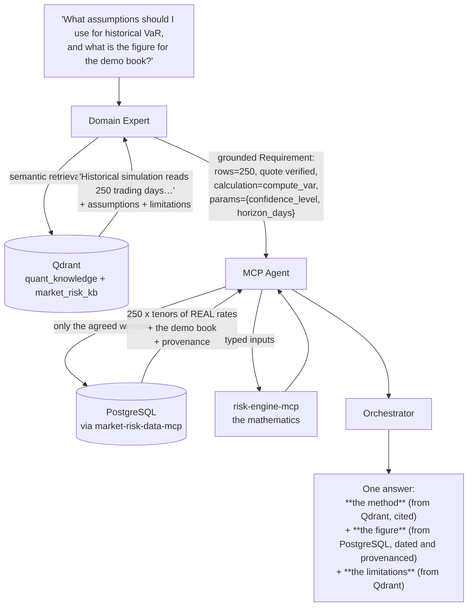
```mermaid
flowchart TD
    Q["'What assumptions should I use for historical VaR,<br/>and what is the figure for the demo book?'"]

    Q --> A["Domain Expert"]
    A -->|"semantic retrieval"| QD[("Qdrant<br/>quant_knowledge + market_risk_kb")]
    QD -->|"'Historical simulation reads 250 trading days…'<br/>+ assumptions + limitations"| A
    A -->|"grounded Requirement:<br/>rows=250, quote verified,<br/>calculation=compute_var,<br/>params={confidence_level, horizon_days}"| M["MCP Agent"]
    M -->|"only the agreed window"| PG[("PostgreSQL<br/>via market-risk-data-mcp")]
    PG -->|"250 x tenors of REAL rates<br/>+ the demo book<br/>+ provenance"| M
    M -->|"typed inputs"| RE["risk-engine-mcp<br/>the mathematics"]
    RE --> M
    M --> O["Orchestrator"]
    O --> ANS["One answer:<br/>**the method** (from Qdrant, cited)<br/>+ **the figure** (from PostgreSQL, dated and provenanced)<br/>+ **the limitations** (from Qdrant)"]
```

**The demonstration that proves nothing is hardcoded** — three commands, sixty seconds:

```bash
# 1. edit knowledge/market_risk/var.md — change "250 trading days" to "500 trading days"
# 2. re-ingest
python -c "from backend.knowledge.knowledge_base import KnowledgeBase; KnowledgeBase(rebuild=True)"
# 3. ask the same question again — the requirement now reads 500, and cites the edited sentence
```

No code change, no release, no engineer. `tests/test_model_provider.py` asserts that the integer
literal `250` appears nowhere in `llm/`, and parameterises the carry-through test over
30 · 60 · 90 · 125 · 250 · 365 · 500 · 750.

---

# 24. MCP Architecture

**Protocol revision `2026-07-28`, SDK `mcp>=2.0.0`.** Three primitives flow client→server; three
flow the other way, mid-call.

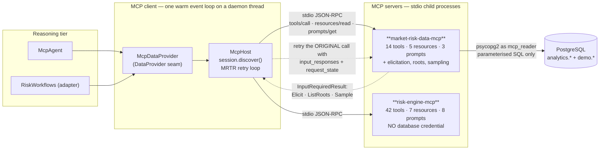
```mermaid
flowchart LR
    subgraph AGENT["Reasoning tier"]
        MA["McpAgent"]
        RW["RiskWorkflows (adapter)"]
    end
    subgraph CLIENT["MCP client — one warm event loop on a daemon thread"]
        DP["McpDataProvider<br/>(DataProvider seam)"]
        HOST["McpHost<br/>session.discover()<br/>MRTR retry loop"]
    end
    subgraph SERVERS["MCP servers — stdio child processes"]
        DS["**market-risk-data-mcp**<br/>14 tools · 5 resources · 3 prompts<br/>+ elicitation, roots, sampling"]
        RS["**risk-engine-mcp**<br/>42 tools · 7 resources · 8 prompts<br/>NO database credential"]
    end
    PG[("PostgreSQL<br/>analytics.* + demo.*")]

    MA --> DP
    RW --> DP
    DP --> HOST
    HOST -->|"stdio JSON-RPC<br/>tools/call · resources/read · prompts/get"| DS
    HOST -->|"stdio JSON-RPC"| RS
    DS -->|"psycopg2 as mcp_reader<br/>parameterised SQL only"| PG
    DS -.->|"InputRequiredResult:<br/>Elicit · ListRoots · Sample"| HOST
    HOST -.->|"retry the ORIGINAL call with<br/>input_responses + request_state"| DS
```

## All six primitives are live

| Primitive | Direction | Where it lives here | What it does |
|---|---|---|---|
| **Tools** | client → server | both servers | 14 data tools, 42 risk tools |
| **Resources** | client → server | both servers | Catalogues, caveats, provenance, methodology, capability gaps |
| **Prompts** | client → server | both servers | Recommended tool orderings, exposed as slash-commands |
| **Elicitation** | **server → client, mid-call** | `search_series` | `'30 year'` matches `BC_30YEAR` *and* `TC_30YEAR` — the server **asks** rather than picking |
| **Roots** | **server → client, mid-call** | `export_curve_csv` | The client grants a directory; the server writes only inside it |
| **Sampling** | **server → client, mid-call** | `brief_dataset_caveat` | The data server has no model, so it borrows the host's |

## How the last three actually work

One mechanism, not three. A tool parameter annotated `Annotated[T, Resolve(fn)]` is filled by
running `fn` **before** the tool body — and `fn` may return `Elicit[T]`, `ListRoots` or `Sample`
instead of a value. The framework then returns an `InputRequiredResult`, and the client answers
by **retrying the original call** with `input_responses` + `request_state` (MRTR —
Multi-Round Tool Request/Response).

```mermaid
sequenceDiagram
    participant A as McpAgent
    participant H as McpHost.call
    participant S as MCP server
    participant U as (Orchestrator -> User)

    A->>H: call_tool("search_series", {query: "30 year"})
    H->>S: tools/call
    S->>S: Resolve(resolve_rate_kind) runs BEFORE the body
    S-->>H: InputRequiredResult(required_information, request_state)
    alt elicitation_mode = "relay" (the agent stack)
        H-->>A: surfaced as task state input-required
        A-->>U: structured field names + allowed answers
        U-->>A: the user's reply, matched deterministically
    else elicitation_mode = "prompt" (the standalone CLI only)
        H->>H: ask on the terminal
    end
    A->>H: retry with input_responses + request_state
    H->>S: tools/call (SAME call, now answered)
    S->>S: the resolver returns a value; the body runs
    S-->>H: CallToolResult
    H-->>A: result
```

`McpHost.call` runs that retry loop, **so the provider seam and the reasoning agent never see
it.** The MCP host's `prompt` mode is for the standalone CLI only; the agent stack runs `relay`.

## `discover()`, never `initialize()`

> **The host must connect with `session.discover()`.** `initialize` is the pre-2026 handshake and
> negotiates at most `2025-11-25`, on which those three primitives fall back to *deprecated
> standalone server-to-client requests*. `discover()` is the stateless `2026-07-28` entry point.
> `tools/verify_mcp.py` asserts the negotiated revision so this cannot regress silently.

## Transport, sessions and process model

- **stdio**, not HTTP. The host launches each server as a child process
  (`python -m mcp_servers.data.server`, `python -m mcp_servers.risk.server`).
- **Servers are never run by hand.** If you do run one, **stdout is the protocol channel** — a
  stray `print()` corrupts the stream and shows up as a mysterious client disconnect.
  Diagnostics go to stderr.
- **The children stay warm.** `McpDataProvider` runs one event loop on a daemon thread for the
  process lifetime and marshals synchronous calls onto it, rather than spawning servers per call
  and paying process startup on every question.
- **Only the data server receives database environment keys** (`ServerSpec(..., DATA_ENV_KEYS)`);
  the risk server is launched with `()`. Its isolation is a fact about its process environment,
  not a promise in a docstring — `python -m mcp_servers.host --isolation` proves it.

## Errors

Structured, with a code and a remedy (`mcp/src/mcp_servers/data/errors.py`), asserted by
`tests/qa/test_qa_tier1_foundations.py::test_errors_carry_a_code_and_a_remedy`. Examples:
`row_limit_exceeded(requested, limit, "Request 1 to 32 series codes.")`, unknown portfolio with
the list of known ids attached, out-of-range date with the actual coverage bounds attached.

---

# 25. MCP Server Catalog

| MCP server | Module | Responsibility | Backing service | Tools | Resources | Prompts | Interactive primitives |
|---|---|---|---|---:|---:|---:|---|
| **`market-risk-data-mcp`** | `mcp_servers.data.server` | Everything the system knows about Treasury rates, the demo book and scenarios — plus its own provenance | **PostgreSQL**, as `mcp_reader`, `analytics.*` + `demo.*` + `meta.source_file` only | **14** | **5** | **3** | Elicitation, Roots, Sampling |
| **`risk-engine-mcp`** | `mcp_servers.risk.server` | The quantitative surface: pricing, sensitivities, stress, distribution risk, attribution, limits, FRTB GIRR | **None.** Market data arrives as a typed argument or not at all | **42** | **7** | **8** | — |

Both are `MCPServer(name=…, title=…, version="0.1.0", instructions=…)`, launched as stdio child
processes by `McpHost`.

## 25.1 `market-risk-data-mcp`

| | |
|---|---|
| **Purpose** | The single road from the reasoning tier to the source of record |
| **Initialization** | `python -m mcp_servers.data.server`, launched by the host. `python -m mcp_servers.data.bootstrap` sets the `mcp_reader` password once |
| **Transport** | stdio JSON-RPC, protocol `2026-07-28` via `session.discover()` |
| **Dependencies** | `treasury_db` (for `.env` and connection helpers), `psycopg2` |
| **Database access** | `mcp_reader`, SELECT-only, `analytics.*` + `demo.*` + `meta.source_file`. `treasury.*` and `staging.*` are explicitly `REVOKE`d |
| **Consumers** | `McpHost` ← `McpDataProvider` ← `McpAgent` / `RiskWorkflows`; also the standalone CLI |
| **Every response carries** | `dataset_snapshot_id`, `data_classification`, `quote_basis`, `rate_kind`, `unit` |

## 25.2 `risk-engine-mcp`

| | |
|---|---|
| **Purpose** | Deterministic quantitative analytics — the mathematics, and nothing else |
| **Initialization** | `python -m mcp_servers.risk.server`, launched by the host with **no database environment keys** |
| **Transport** | stdio JSON-RPC, protocol `2026-07-28` |
| **Dependencies** | Pure Python numerics (`linalg.py`, `numerics.py`); **no `psycopg2` import anywhere** |
| **Database access** | **None, by construction.** `python -m mcp_servers.host --isolation` proves it |
| **Consumers** | `RiskWorkflows` via `McpHost` |
| **Reproducibility** | `risk://model/manifest` publishes every model version and numerical convention, plus a SHA-256 |

Tools are registered from six modules:

| Module | Tools | Family |
|---|---:|---|
| `server.py` (inline) | 5 | Core: pricing, DV01, key-rate DV01, explicit stress, historical VaR/ES |
| `tools_analytics.py` | 6 | Bond and curve analytics, volatility, sensitivities, contributions |
| `tools_stress.py` | 11 | Standardised, key-rate, twist, curvature, ladder, matrix, comparison, attribution, explanation, concentration, severity |
| `tools_historical.py` | 6 | Replay, crisis catalogue, worst-window search, reverse stress, thresholds, limit breach |
| `tools_distribution.py` | 8 | Parametric, Monte Carlo, extreme tail, volatility regime, correlation, method comparison, backtest, P&L attribution |
| `tools_portfolio.py` | 6 | Concentration, limits, portfolio comparison, hypothetical trade, hedging, FRTB GIRR |
| | **42** | |

---

# 26. Complete MCP Tool Catalog

## Two inventories, deliberately different sizes

| | Count | What it is |
|---|---|---|
| **MCP-registered tools** | **42** on `risk-engine-mcp`, **14** on `market-risk-data-mcp` | The protocol surface. Callable by any MCP client, including `python -m mcp_servers.host --ask` |
| **Agent-reachable capabilities** | **30 executable + 4 informational** | What the domain expert may schedule through `/chat` |
| **Reachability** | **34 of 42** risk tools are reached by some capability; 8 are deliberately withheld | See [`docs/agent-capabilities.md`](docs/agent-capabilities.md) |

They are not meant to match. *A capability catalogue is something a planner chooses from under
uncertainty, and every entry it holds is one more chance to choose wrong.*

**The tool inventory is derived from the registered tools, never from prose.**
`tests/test_risk_tool_inventory.py` (62 tests) fails if a documented count drifts from what the
servers actually advertise — it caught a stale "5 risk tools" the day the count became 42. When
code and document disagree, the document changes.

## 26.1 `market-risk-data-mcp` — all 14 tools

| Tool | Purpose | Inputs | Output | When used | Example user intent |
|---|---|---|---|---|---|
| `list_datasets` | The five datasets with coverage and **market-risk caveats** | — | `DatasetPage` | Orientation; before trusting a dataset | "What data do you hold?" |
| `list_series` | Rate series, filterable by dataset, nominal/real, quoting basis or tenor range | `data_key?`, `rate_kind?`, `quote_basis?`, `tenor_min_months?`, `tenor_max_months?` | `SeriesPage` with per-series coverage | Building a catalogue | "Which tenors can I query?" |
| `search_series` | Resolve `'10 year'` / `'thirty year real'` to canonical codes. **Deterministic alias/token matching, not a model** | `query`, `data_key?`, `limit=10`, *`rate_kind` filled by a resolver* | `SeriesSearchResult` | Natural-language tenor references | "Give me the 30-year rate" → **elicitation** |
| `get_series_coverage` | First/last observation and count for named series | `series_codes` (≤32) | `CoverageResult` | Sizing a history request before making one | "How far back does the real curve go?" |
| `get_curve` | The complete par yield curve for one date | `curve_family='nominal'`, `observation_date?`, `date_policy='exact'` | `CurveResult` | Any curve question | "Show me today's curve" |
| `get_rate_history` | Historical observations for up to 16 series over a range, paginated | `series_codes` (≤16), `start_date`, `end_date`, `page_size`, `cursor?` | `RateHistoryPage` | A few named series over time | "A year of 10-year history" |
| `get_curve_history_matrix` | **N trading days × requested tenors**, aligned, for risk calculations | `curve_family`, `as_of_date?`, `trading_days=250`, `tenors_months?`, `missing_policy='reject'` | `CurveHistorySummary`; **numeric matrix in `_meta`**, summary to the model | Every VaR/ES/volatility path | "10-day 99% VaR" |
| `explain_number` | Where a single number came from: value + Treasury file + source URL + SHA-256 | `series_code`, `observation_date` | `ProvenancedObservation` | Auditing a figure without leaving the conversation | "Is that figure right?" |
| `list_portfolios` | Available demo books. **All `SYNTHETIC_DEMO`** | — | `PortfolioList` | Grounding a clarification | "Which portfolios are available?" |
| `get_portfolio` | Positions and full instrument economics for one book | `portfolio_id` | `PortfolioSnapshot` | Every portfolio calculation | "What is in the demo book?" |
| `list_scenarios` | Stress scenarios: `TENOR_VECTOR_BP` or `HISTORICAL_REPLAY` | `scenario_type?` | `ScenarioList` | Grounding a clarification | "Which scenarios are defined?" |
| `get_scenario` | One scenario's definition — its shock vector, or the pair of dates to replay | `scenario_id` | `ScenarioInfo` | Before running a named stress | "Run the 2020 COVID replay" |
| `export_curve_csv` | Write one day's curve to CSV **inside a client-declared root** | `filename` (bare name only), `curve_family`, `observation_date?`, *`roots` filled by a resolver* | `CurveExportResult` | Exporting | "Save the curve to a file" → **roots** |
| `brief_dataset_caveat` | Turn a terse caveat into desk-ready guidance by borrowing the **client's** model | `data_key`, *`drafted` filled by a resolver* | `CaveatBriefing` | Explaining a data trap | "What should I watch out for in the bill data?" → **sampling** |

**Notes that matter:**

- `get_rate_history` vs `get_curve_history_matrix`: the tool description itself steers callers —
  *"For a whole curve's history use `get_curve_history_matrix` instead; it is far more efficient
  and keeps thousands of rates out of the conversation."*
- `missing_policy='reject'` is the default because *"silently dropping dates changes any risk
  number computed from it."* `'intersection'` accepts the gaps and reports `excluded_dates`.
- `date_policy='exact'` is the default: **the date is never shifted silently.**
- `export_curve_csv` refuses a `filename` containing a path separator or `..` — *refused rather
  than sanitised.*
- `brief_dataset_caveat` returns the **verbatim** caveat alongside the drafted prose: *"where the
  two disagree, the verbatim text wins."*

**Possible errors** (all structured, all carrying a code and a remedy): `row_limit_exceeded`,
unknown series / portfolio / scenario (with the known ids attached), date outside coverage (with
the actual bounds attached), no curve on the requested date under `exact`, missing dates under
`reject`, no client roots declared.

## 26.2 `risk-engine-mcp` — all 42 tools

Every tool takes typed inputs — `PortfolioInput`, `ParCurveInput`, `CurveHistoryInput`,
`valuation_date` — and **holds no market data of its own**.

### Core (5, in `server.py`)

| Tool | Purpose | Key inputs |
|---|---|---|
| `price_portfolio_tool` | Present value of fixed-rate bonds under a par curve. **The curve is bootstrapped to discount factors first — par yields are not discount rates** | portfolio, valuation_date, par_curve |
| `compute_dv01_tool` | DV01 by **full revaluation**: the value lost from a parallel rise. Positive for a conventional long fixed-rate book | + `bump_bp=1.0` |
| `compute_key_rate_dv01_tool` | Sensitivity to each par node bumped individually. **Single-node bumps, no smoothing** — the perturbation is exactly what the name says | + `key_tenors_months?`, `bump_bp` |
| `run_stress_tool` | Revalue under an explicit tenor→basis-point shock vector. For a historical replay, difference the two observed curves first — **this server does not fetch market data** | + `shocks_bp_by_tenor_months` |
| `compute_historical_risk_tool` | Historical-simulation VaR **and** ES by full revaluation. Aligned curve history supplied as tenors + a rates matrix (from `get_curve_history_matrix`'s `_meta`) | + `history_tenors_months`, `history_rates_percent`, confidence, horizon |

### Analytics (6, `tools_analytics.py`)

| Tool | Purpose |
|---|---|
| `compute_bond_analytics_tool` | Per bond: dirty/clean price, accrued, YTM, current yield, Macaulay and modified duration, dollar duration, convexity, and **effective** duration/convexity by full revaluation |
| `compute_carry_roll_tool` | Carry and roll-down over a holding period **assuming the curve does not move** — what the position earns if the market delivers what it has priced |
| `compute_curve_analytics_tool` | Par yield, discount factor, zero rate (continuous and semiannual) at each tenor; implied forwards; the standard slope spreads (2s10s, 5s30s…); butterflies |
| `compute_rate_volatility_tool` | Per-tenor standard deviation of bp changes, annualised, with 20/60/250-day rolling windows, plus covariance and correlation matrices |
| `compute_rate_sensitivities_tool` | The whole sensitivity picture in one call: portfolio and per-position DV01, key-rate DV01 at every node with its per-position split, maturity-bucket DV01, effective duration and convexity |
| `compute_risk_contributions_tool` | Component, marginal and incremental risk contributions per position, for VaR or ES. **Component figures are exact Euler decompositions** |

### Stress (11, `tools_stress.py`)

| Tool | Purpose |
|---|---|
| `run_rate_stress_tool` | Parallel shift, or a named curve-shape template (bear/bull steepener, bear/bull flattener, belly and wings selloff/rally) |
| `run_key_rate_stress_tool` | Stress individual nodes **and nothing else** — directly comparable with `compute_key_rate_dv01_tool`, which perturbs the same way |
| `run_curve_twist_stress_tool` | Rotate about a pivot: short end down by the magnitude, pivot exactly zero, long end up, intermediates interpolated by a stated rule |
| `run_curve_curvature_stress_tool` | Belly against wings, or wings against belly |
| `run_shock_ladder_tool` | A ladder of parallel shocks, each fully revalued, **with the duration and duration+convexity approximations and their errors beside the revalued answer at every rung** |
| `run_stress_matrix_tool` | The full standard pack in one call: ±50/±100/±200bp, steepeners and flatteners at two severities, twists both ways, belly and wings, single-node key-rate stresses |
| `compare_stress_scenarios_tool` | Rank caller-supplied shock vectors and name what drives the extremes |
| `compute_stress_contributions_tool` | Decompose one scenario's loss across positions (**exact** — same revaluation pass) and across the curve (**not exact**, and labelled so) |
| `explain_stress_loss_tool` | Structured quantitative facts about *why* a scenario loses what it loses |
| `run_concentration_stress_tool` | Stress the part of the curve the book is **measured** to be most exposed to — largest absolute key-rate DV01 |
| `run_scenario_severity_pack_tool` | One shape at every project-defined severity: MILD 25bp, MODERATE 100bp, SEVERE 200bp, EXTREME 300bp. **Project conventions, not a regulatory classification** |

### Historical (6, `tools_historical.py`)

| Tool | Purpose |
|---|---|
| `run_historical_stress_tool` | Replay an observed move: the shock is the **difference between two supplied published curves, measured here — no historical shock is stored anywhere in this engine** |
| `run_historical_crisis_stress_tool` | Replay a named crisis: 1994 selloff, 2008 Lehman quarter, 2013 taper tantrum, March 2020 COVID, 2022 tightening, March 2023 regional banks. **The catalogue stores DATES ONLY** |
| `find_worst_historical_stresses_tool` | If today's book had existed throughout the history, which observed moves would have hurt most? Every h-day move applied and fully revalued |
| `run_reverse_stress_tool` | Solve for the move that produces a given loss. Takes a **shape** and finds the multiple of it |
| `compute_stress_thresholds_tool` | The magnitude required to reach each of several loss thresholds — turns "we lose 1.9m at +100bp" into "1m at +49bp, 5m at +278bp" |
| `find_limit_breach_stress_tool` | The severity at which a stated limit breaches, and where it turns amber. **The limit is an explicit input — this engine holds no risk policy and will not supply one** |

### Distribution (8, `tools_distribution.py`)

| Tool | Purpose |
|---|---|
| `compute_parametric_risk_tool` | Delta-normal VaR and ES: key-rate DV01 exposure vector × sample covariance, multivariate normal; ES from the normal closed form |
| `compute_monte_carlo_risk_tool` | Full revaluation on every path, so **convexity is priced rather than approximated**. Correlated shocks by Cholesky (or eigenvalue-clipped) |
| `run_extreme_tail_simulation_tool` | A deliberately fat-tailed simulation, **labelled as one**. Four methodologies, each with its own manifest version so none can be mistaken for historical VaR |
| `run_volatility_regime_stress_tool` | Find the most volatile window in the history and simulate from *that* covariance |
| `run_rate_correlation_stress_tool` | Hold volatilities fixed and change only co-movement: `historical`, `perfect_positive` (no diversification — an upper bound), and others |
| `compare_risk_methods_tool` | Historical, parametric and Monte Carlo side by side on identical inputs, with the spread. **A model-validation tool** |
| `backtest_var_tool` | Exception count and rate, exception dates, clustering diagnostics, **Kupiec** unconditional coverage, **Christoffersen** independence and joint conditional coverage |
| `compute_pnl_attribution_tool` | Carry, roll-down, rate move and position change, each by full revaluation, with the rate effect split across the curve by key-rate DV01. **Two residuals, and they mean different things** |

### Portfolio (6, `tools_portfolio.py`)

| Tool | Purpose |
|---|---|
| `compute_concentration_tool` | PV, position DV01, notional, key-rate DV01 and maturity-bucket concentration, each with largest and top-three shares, a **Herfindahl index** and the effective number of equally sized positions |
| `evaluate_risk_limits_tool` | Current value, limit, utilisation %, headroom and GREEN/AMBER/RED per limit. Limits are **caller-supplied** |
| `compare_portfolio_risk_tool` | Two books on identical inputs, across every measure |
| `analyze_hypothetical_trade_tool` | Measure the book, then the book plus hypothetical positions, and difference every measure — **without touching anything stored** |
| `analyze_rate_hedge_tool` | Size a par bond at one node so that node's key-rate DV01 reaches a target. The hedge instrument pays the curve's own par rate at that tenor, so the construction is reproducible |
| `compute_frtb_girr_tool` | FRTB SA GIRR capital: delta and curvature for the USD risk-free curve, key-rate DV01s converted to Basel PV01 sensitivities on the ten prescribed vertices |

## 26.3 The 34 agent-reachable capabilities

Advertised by `McpAgent.catalogue()`. **The `ToolSpec` name *is* the `RiskWorkflows` method
name**, because `McpAgent._calculate` resolves it with `getattr`.

**Always available (4, informational):** `get_yield_curve` · `get_rate_history` ·
`get_curve_slope` · `list_series`

**Available only when the provider exposes `call_tool` (30, executable):**

| Family | Capabilities |
|---|---|
| Valuation | `price_portfolio`, `compute_bond_analytics`, `compute_carry_roll`, `compute_curve_analytics`, `compute_rate_volatility` |
| Sensitivity | `compute_dv01`, `compute_rate_sensitivities`, `compute_risk_contributions`, `compute_concentration` |
| Stress | `run_stress`, `run_rate_stress`, `run_key_rate_stress`, `run_shock_ladder`, `run_stress_matrix`, `compute_stress_contributions` |
| Historical | `run_historical_stress`, `find_worst_historical_stresses`, `run_reverse_stress`, `compute_stress_thresholds`, `find_limit_breach_stress` |
| Distribution | `compute_var`, `compute_parametric_risk`, `compute_monte_carlo_risk`, `compare_risk_methods`, `backtest_var`, `compute_pnl_attribution` |
| Portfolio | `evaluate_risk_limits`, `compare_portfolio_risk`, `analyze_hypothetical_trade`, `compute_frtb_girr` |

The eight risk tools deliberately **not** reachable through `/chat` and the reasoning behind each
withholding are enumerated in [`docs/agent-capabilities.md`](docs/agent-capabilities.md) and
[`docs/capability-gaps.md`](docs/capability-gaps.md).

---

# 27. MCP Resources

**Resources exist and are registered on both servers — 12 in total.**

| Resource URI | Server | Purpose | Data returned | MIME | Consumer |
|---|---|---|---|---|---|
| `market-risk://catalog/datasets` | data | The five datasets with coverage and market-risk caveats | JSON | `application/json` | Host, agents, MCP Inspector |
| `market-risk://catalog/series` | data | All retrievable series with quoting basis, tenor and coverage | JSON (up to 500 rows) | `application/json` | Host, agents |
| `market-risk://caveats/{data_key}` | data | **Templated.** The warning for one dataset: quoting basis, discontinued maturities, placeholder values | Markdown | `text/markdown` | Host, agents |
| `market-risk://docs/data-contract` | data | What the numbers mean, and the traps in the source | Markdown (from `docs/data-contract.md`) | `text/markdown` | Humans, agents |
| `market-risk://docs/provenance` | data | How a number is traced from a response back to a Treasury file, plus the **current `dataset_snapshot_id`** | Markdown | `text/markdown` | Auditing |
| `risk://model/manifest` | risk | Model versions and **every numerical convention**, so a result can be reproduced | JSON + SHA-256 | `application/json` | Model validation |
| `risk://methodology/curve-construction` | risk | Why par yields are **bootstrapped** rather than used as discount rates | Markdown | `text/markdown` | Anyone questioning a price |
| `risk://scenarios/templates` | risk | Every named stress shape as control points in multiples of severity, plus interpolation rules and the project-defined severity labels | JSON | `application/json` | Planning a stress |
| `risk://scenarios/historical-crises` | risk | Named crisis windows **as DATES ONLY** — no shock vector is stored; every historical shock is measured from published curves at run time | JSON | `application/json` | Planning a replay |
| `risk://methodology/risk-measures` | risk | The four loss-distribution methodologies, what each assumes, and **why they are not expected to agree** | Markdown | `text/markdown` | Model validation |
| `risk://methodology/regulatory-girr` | risk | The Basel parameters implemented, their source, and the **complete list of risk classes deliberately not computed** | JSON | `application/json` | Regulatory scope questions |
| `risk://capability-gaps` | risk | What this engine cannot compute, why, and what each capability would require. **Published so an absent number is never mistaken for a zero** | JSON | `application/json` | Scope questions |

---

# 28. MCP Prompts

**Prompts exist and are registered on both servers — 11 in total.** Each returns a recommended
tool ordering, exposed to an MCP client as a slash-command.

| Prompt | Server | Purpose | Arguments | Used by |
|---|---|---|---|---|
| `curve_snapshot` | data | Show and interpret the Treasury par curve for a date | `observation_date=""`, `curve_family="nominal"` | MCP clients / Inspector |
| `explain_series` | data | Explain what a rate series is and how to use it correctly | `series_code` | MCP clients |
| `coverage_report` | data | Report what data exists and where the gaps are | — | MCP clients |
| `risk_summary` | risk | Price a demo portfolio and summarise its rate risk | `portfolio_id=""` | MCP clients |
| `stress_review` | risk | Run a stress scenario against a demo portfolio and interpret it | `scenario_id=""`, `portfolio_id=""` | MCP clients |
| `var_methodology` | risk | Explain how this engine's VaR is computed, **and what it is not** | — | MCP clients |
| `stress_matrix_review` | risk | Run the standard pack and interpret the ranked table | `portfolio_id=""` | MCP clients |
| `reverse_stress_review` | risk | Answer "what move would cost us X" and set it in context | `target_loss=""`, `portfolio_id=""` | MCP clients |
| `model_validation_review` | risk | Compare the risk methodologies and backtest the chosen one | `portfolio_id=""` | MCP clients |
| `pnl_attribution_review` | risk | Explain a period's P&L and interrogate the residual | `portfolio_id=""` | MCP clients |
| `regulatory_scope` | risk | State what regulatory capital this engine computes, **and what it does not** | — | MCP clients |

> **Prompts are for MCP clients, not for the `/chat` agents.** The three runtime agents carry
> their own system prompts and choose capabilities from `ToolCatalogue`; the MCP prompts serve
> `python -m mcp_servers.host` and any external MCP client (MCP Inspector, an IDE) that connects
> to these servers directly. This is a real distinction and worth stating, because "the project
> has 11 MCP prompts" could otherwise be read as "the agents use 11 prompts".

---

# 29. Sampling, Elicitation and Roots

The three server→client primitives. All three are implemented, and all three share one
mechanism: `Annotated[T, Resolve(fn)]`.

## Sampling — the data server borrows the host's model

**Who requests it:** `market-risk-data-mcp`, inside `brief_dataset_caveat`.
**Which model executes it:** the *client's*, at `CallSite.SAMPLING` — under the default backend,
`glm-5.2`.

> Neither server may hold a model. So when the data server needs prose, it asks the **host** for
> a completion. The credential and the reasoning stay on one side of the boundary; the database
> credential stays on the other.

**Limitations, and one measured consequence.** The *server* sets the sampling ceiling at **400
tokens** and cannot know what the client's model costs to *think*. A reasoning model bills its
thinking against the same budget, so with a low floor the completion comes back **empty**:

```
glm-5.2, ceiling raised to 1024 -> 755 reasoning, 278 visible    ok
glm-5.2, ceiling raised to 1024 -> 1022 reasoning,  0 visible    EMPTY
```

An empty completion is not a short answer — the tool falls back to
`[no briefing returned by the client's model]`. `_MIN_TOKENS[SAMPLING]` is therefore **2,048**,
verified over four consecutive runs with reasoning peaking at 1,317 tokens and no empty
completion. **Do not lower it without re-measuring.**

The verbatim caveat is always returned alongside the drafted prose: **where the two disagree,
the verbatim text wins.**

## Elicitation — and why the orchestrator stays in front

**Why an MCP tool may need more information:** `search_series('30 year')` matches `BC_30YEAR`
(nominal par yield) **and** `TC_30YEAR` (real/TIPS yield). These are different quantities and
must never share a curve. The server does not pick — it asks.

```mermaid
sequenceDiagram
    autonumber
    participant DS as market-risk-data-mcp
    participant H as McpHost
    participant M as MCP Agent
    participant O as Orchestrator
    participant U as User

    Note over DS: resolve_rate_kind() returns Elicit[RateKindChoice]<br/>BEFORE the tool body runs
    DS-->>H: InputRequiredResult(required_information, request_state)
    H-->>M: surfaced through the DataProvider seam
    M-->>M: **stops its task in `input-required`**<br/>carrying field names + allowed answers as STRUCTURED DATA
    M-->>O: A2A task state = input-required
    O->>O: turn it into ONE question with clickable options
    O-->>U: "Did you mean the nominal 30-year or the real (TIPS) 30-year?"
    U-->>O: "nominal"
    O->>O: elicit.match_answer() — DETERMINISTIC, against the server's own enum
    alt matched
        O->>M: A2A provide_input, relayed into the SAME task id
        M->>H: retry the ORIGINAL call with input_responses + request_state
        H->>DS: tools/call — the resolver now returns a value
        DS-->>M: filtered matches
    else unmatched, and attempts < A2A_MAX_CLARIFICATIONS (3)
        O-->>U: ask again — the task is still alive
    else unmatched, budget exhausted
        M->>H: retry on the tool's OWN labelled declined path<br/>(unfiltered matches, and it says so)
    else explicit refusal ("cancel", "never mind")
        M->>M: cancel the task; nothing is fetched
    end
```

**Why the orchestrator remains the user-facing component:**

1. **One voice.** The honesty rules — dates on every rate, real-versus-synthetic labels, no
   internal identifiers — live in one prompt, at one exit.
2. **Interpreting a human's words is a decision about a human's words**, and those belong to the
   agent that owns the conversation.
3. **The retry budget lives with the specialist that owns the task**, so there is exactly one
   place it can be exhausted — and the task id is the correlation that makes attempt 2 a
   *continuation* rather than new work.
4. **A specialist has no channel to the browser**, and giving it one would make the user boundary
   meaningless.

**The `A2A_MAX_CLARIFICATIONS` bound exists because both extremes are wrong.** Terminating on
the first unmatched reply throws away a request the user still wants; asking without a bound is
the user-facing twin of an unbounded agent loop. Refusal is matched against an explicit word
list on **word boundaries**, never inferred from vagueness.

**Every clarification path must end in a terminal state.** If you add one, add the bound with it.

## Roots — the client grants the directory

**Where:** `export_curve_csv`. `resolve_export_roots()` returns `ListRoots`; the client answers
with the directories it is willing to expose, and the server writes **only inside them**.

| Rule | Behaviour |
|---|---|
| No roots declared | Nothing is written, and the refusal says so |
| `filename` contains `/`, `\` or `..` | **Refused, not sanitised** |
| Target outside every root | Refused, naming the roots that were offered |
| A malformed root | Skipped by name, never guessed at (`tests/test_primitives.py`) |

The server does not choose the destination and **cannot** write outside what it was given. That
is a capability boundary, not a validation rule.

---

# 30. MCP vs Normal Function Calling

Why the agents do not simply `import` a database module.

| Property | Direct import | MCP, as implemented here |
|---|---|---|
| **Schema** | A Python signature, visible only to whoever reads the file | A published JSON Schema with descriptions, discoverable at runtime via `tools/list` |
| **Discoverability** | grep | `python -m mcp_servers.host --tools`, MCP Inspector, or any MCP client |
| **Decoupling** | The agent process *is* the database client | The servers are separate OS processes with their own environment |
| **Privilege** | The agent holds whatever credential the module holds | The data server holds `mcp_reader`; the risk server holds **nothing**. `--isolation` proves it |
| **Contract** | Whatever the caller happens to pass | Typed inputs and typed results, validated at the boundary |
| **Transport independence** | None — same process, always | stdio today; the same servers would work over another transport with no tool change |
| **Centralised data surface** | Every caller can write its own SQL | Every statement lives in one repository module, parameterised, against `analytics.*` only |
| **Auditability** | A stack frame | A tool call with a name, typed arguments, a `dataset_snapshot_id` and a traced span |
| **Interoperability** | This repository only | Any MCP client — including an IDE — can drive these servers |
| **Interactive questions** | Not expressible | Elicitation, roots and sampling, as first-class protocol features |
| **Documentation drift** | Manual | `tests/test_risk_tool_inventory.py` fails when a documented count drifts from what the servers advertise |

**What MCP costs here, stated honestly:** two extra OS processes, a stdio serialisation hop per
call, an async/sync bridge, and a whole retry protocol (MRTR) to make the interactive primitives
invisible to callers. `DATA_BACKEND=postgres` exists precisely because that cost is not always
worth paying — it is fewer moving parts, at the price of the agent process holding a credential
that can write to the source of record.

---

# 31. FastAPI / Backend API Architecture

`backend/src/backend/api/service.py` — `FastAPI(title="semantic-mcp-data-access-gateway",
version="0.2.0")`.

## Endpoints

| Method | Endpoint | Purpose | Request | Response | Caller |
|---|---|---|---|---|---|
| `POST` | `/chat` | One user turn, sent to the orchestrator over A2A | `{query, session_id?, request_id?}` | `ChatResponse` (16 fields) | React UI, evaluation harness |
| `POST` | `/summarise` | Name a conversation from what it turned out to be about | `{messages: [...]}` (min 1) | `{title}` | React UI, after 300s or 6 turns |
| `GET` | `/health` | Liveness **plus which engines are actually answering** | `?analytics=true` adds Redis analytics | `{status, llm_backend, models, api_key_configured, data_backend, langsmith, redis, a2a}` | UI header, operators, monitors |
| `GET` | `/chat/stream/{request_id}` | The turn's execution events as they happen | — | SSE: `event: event` frames then `event: done` | `EventSource` in the browser |
| `GET` | `/trace/{request_id}` | **This gateway's own** execution trace and latency breakdown | — | `{request_id, available, finished, events, latency}` | Execution and Latency views |
| `GET` | `/langsmith/trace/{trace_id}` | The LangSmith span tree, fetched and **sanitised server-side** | — | `{available, reason?, runs?}` | Trace view |
| `GET` | `/a2a/<agent>/.well-known/agent-card.json` | Agent Card discovery | — | Agent Card JSON | Agents, MCP/A2A tooling |
| `POST` | `/a2a/<agent>/` | JSON-RPC — **agents only** | A2A message | A2A task | The other agents |

`<agent>` ∈ `orchestrator` · `domain-expert` · `mcp-agent`.

## `ChatResponse` in full

| Field | Type | What it carries |
|---|---|---|
| `answer` | `str` | The executive reply |
| `sources` | `list[str]` | Citation labels |
| `trace` | `list[dict]` | Typed decision steps: `intent`, `knowledge`, `decision`, `tool_call`, `answer`, `clarification` |
| `awaiting_clarification` | `bool` | **Follows the route, never the prose** |
| `elicitation` | `{question, options[]}` \| null | A structured question with clickable choices |
| `route` | `str` | `direct` / `clarify` / `data_request` / `resume` |
| `tables` | `list[dict]` | **Columns + rows, never a markdown string** |
| `data_plan` | `dict` \| null | The requirement, its verbatim quote, and the chunks behind it |
| `negotiation` | `dict` \| null | The full discussion transcript |
| `catalogue` | `dict` \| null | What the MCP agent advertised at request time |
| `calculation` | `dict` \| null | The risk result and the parameters actually used |
| `langsmith_url` | `str` \| null | Deep link to this turn's trace |
| `langsmith_trace_id` | `str` \| null | So a message keeps its *own* trace, not a global "latest" link |
| `langsmith_project` | `str` \| null | The project the trace lives in |
| `handoffs` | `dict` \| null | Who called whom, at what depth, with which task id, how long, how much budget |
| `request_id` | `str` \| null | **One id, four views**: SSE, `/trace/{id}`, the handoff ledger, the response |
| `structured` | `dict` \| null | The reply as typed sections |
| `latency` | `dict` \| null | Measured durations only; uninstrumented time lands in `unattributed_ms` |

> `tables` travels as columns + rows because *"a pre-formatted blob cannot be sorted, scrolled or
> exported."*
>
> `awaiting_clarification` follows the **route**. Inferring it from the text was a real defect: a
> finished 2,302-character answer ending "Want me to run DV01?" was reported as a pending
> question, while the same answer ending "Say which and I'll run it." was not — identical intent,
> opposite classification, decided by the final character.

## Request flow

```mermaid
flowchart TD
    A["Browser: POST /chat"] --> B["Pydantic validates ChatRequest<br/>query min_length=1, request_id max_length=48"]
    B --> C["get_network() — lazily builds AgentNetwork<br/>(KnowledgeBase + DataProvider + Redis + loop thread)"]
    C --> D["read session: turns · clarified · waiting · clarification"]
    D --> E["network.handle(...) -> A2A message to the orchestrator"]
    E -->|"exception"| F["HTTPException 502 'agent error: …'"]
    E --> G["intelligence.complete_run(...)<br/>wrapped in try/except — analytics NEVER changes the response"]
    G --> H["persist last 12 turns + clarified + waiting + clarification"]
    H --> I["_response_for(outcome) -> ChatResponse"]

    A2["Browser: GET /chat/stream/{id}"] -.->|"opened FIRST"| J["replay bounded history<br/>-> subscribe to an asyncio.Queue<br/>-> 15s keep-alive comment frames"]
    J -.-> K["event: done when the turn finishes<br/>(or immediately, for a finished turn)"]
```

## Startup and lifecycle

| Concern | How |
|---|---|
| `.env` | `load_dotenv()` runs **at import**, before anything reads the environment — *"a service that starts healthy and dies on the first request is a confusing way to discover a missing key"* |
| Agent construction | **Lazy**, via `get_network()`. `/health` must answer before Qdrant or the MCP children are up |
| CORS | `CORSMiddleware` with `CORS_ALLOWED_ORIGINS` (comma-separated), defaulting to `http://localhost:5173,http://127.0.0.1:5173` |
| Session memory | In-memory `_sessions` dict; **resets on restart**. Last 12 turns, `clarified`, `waiting`, `clarification` |
| Streaming | SSE only, and only for **progress**. `/chat` itself is non-streaming |
| Exception handling | Unexpected → `502`. Specialist failures → sentences via `_user_facing_failure`. A non-settled task state is treated as a failure |
| Logging | `logging.basicConfig(level=A2A_LOG_LEVEL or INFO)` in `__main__`, because *uvicorn's logging configuration swallows the one record that lets you follow a request across three agents*. `httpx` is turned down to WARNING — it logs one line per in-process A2A call |
| Port | `AGENT_PORT`, default **8000**, bound to `0.0.0.0` |

## Why SSE and not WebSockets

The service's own comment answers it: the traffic is **one-directional** — the server reports
progress and the browser reports nothing back. A WebSocket would add a second protocol, a second
failure mode, a handshake to get through whatever proxy sits in front, and its own reconnect
logic, to carry a stream of small JSON objects in one direction. SSE is a plain GET over the same
HTTP stack `/chat` already uses, survives the same CORS configuration, `EventSource` reconnects
on its own, and the whole client is thirty lines. *"The moment the browser needs to send
something mid-turn — cancel this run, answer a question inline — a WebSocket earns its keep; it
does not before then."*

Three details that make it work in practice:

- **History is replayed on connect**, so a client that subscribed a few milliseconds late — or
  reconnected after a drop — sees the whole turn.
- **A 15-second keep-alive comment frame**, because idle proxies close a connection that has been
  silent long enough and a negotiation round can legitimately be silent for a minute.
- **`X-Accel-Buffering: no`**, because Nginx buffers proxied responses by default, which turns a
  live stream into one delivery at the end — *the exact failure this endpoint exists to remove.*

**The stream is a view, never a dependency.** If nobody subscribes, if the subscriber
disconnects, or if the endpoint is never called, the answer is identical — the publisher never
waits for a reader.

## Why `/trace/{request_id}` exists alongside LangSmith

It is served from the events the gateway recorded **itself**, so it answers whether or not
LangSmith is configured, reachable, or has finished ingesting. *"Observability must never be a
dependency of being able to explain what happened, and a trace view that goes blank when a SaaS
is slow is a trace view nobody trusts in the moment they need it."*

---

# 32. Frontend Architecture

**Current stack: React 18 + Vite 5 + TypeScript 5.7 + Tailwind 3.4 + Zustand 5.** Run in place
by Vite; there is no build step in the normal development loop.

> **Legacy:** a **Streamlit** application was the original UI. It was removed in commit
> `0d3a74d` ("refactor: remove Streamlit frontend") and replaced by this React app in `7461c59`
> and `7a30909`. There is **no Streamlit code in the repository today** — only two references in
> prose (`frontend/CLAUDE.md`, `frontend/README.md`) describing what this replaced, and one stale
> mention in `mcp/src/mcp_servers/host/__init__.py`. Treat Streamlit as **legacy architecture,
> not current.**

## Component structure

```mermaid
flowchart TB
    APP["App.tsx"]
    APP --> HDR["Header<br/>+ ThemeToggle<br/>+ useHealth -> /health"]
    APP --> MSS["MarketSnapshotStrip"]
    APP --> SB["Sidebar<br/>chat list, new/clear/delete"]
    APP --> CW["ChatWindow"]
    APP --> RR["RightRail"]
    APP --> STB["StatusBar"]

    CW --> MB["MessageBubble<br/>react-markdown + remark-gfm"]
    CW --> SA["StructuredAnswer<br/>renders the typed section document"]
    CW --> EP["ElicitationPrompt<br/>clickable options"]
    CW --> CI["ChatInput"]
    CW --> RB["RegenerateButton"]
    CW --> DT["DataTable"]
    CW --> CC["CurveChart"]

    RR --> RSL["ReasoningRail<br/>data_plan · negotiation · catalogue"]
    RR --> EV["ExecutionView<br/>live SSE events"]
    RR --> GV["GraphView<br/>@xyflow/react handoff graph"]
    RR --> LV["LatencyView<br/>measured breakdown"]
    RR --> TV["TraceView<br/>LangSmith span tree via the backend"]
    RR --> AP["ArtifactPanel + ArtifactCard"]

    subgraph STORES["Zustand"]
        CS["chatStore<br/>chats · messages · pending · openArtifact"]
        ES["executionStore<br/>begin/push/end for the live run"]
        TS["themeStore"]
    end
    APP -.-> STORES
    CW -.-> CS
    EV -.-> ES
```

## The turn lifecycle, in the browser

```mermaid
sequenceDiagram
    participant U as User
    participant CI as ChatInput
    participant US as useSend
    participant ES as executionStream
    participant AC as api/client
    participant F as FastAPI

    U->>CI: types and submits
    CI->>US: send(question)
    US->>US: newRequestId()
    US->>ES: openExecutionStream(requestId, pushEvent)
    ES->>F: GET /chat/stream/{id}  (EventSource)
    Note over US,F: subscribe FIRST — "relying on the replay to cover a race<br/>we can simply not have is the kind of thing<br/>that works until the day it does not"
    US->>AC: askAgent(question, sessionId, requestId)
    AC->>F: POST /chat   (AbortController, 960s)
    F-->>ES: SSE events, rendered live in ExecutionView
    F-->>AC: ChatResponse
    AC-->>US: ChatMessage (answer, tables, data_plan, negotiation,<br/>handoffs, structured, langsmith*)
    US->>ES: stream.close(); endRun()
    US->>CI: appendMessage; render
    opt after 300s or 6 turns, once
        US->>F: POST /summarise -> title for the sidebar
    end
```

## Application state

| Store | Holds | Notes |
|---|---|---|
| `chatStore` | `chats` (id → session), `activeChatId`, messages, `pending`, `openArtifact` | `popLastMessage()` supports regeneration; a stale artifact reference self-heals rather than leaving the panel open on data that no longer exists |
| `executionStore` | The live run's `requestId` and its ordered events | `begin` / `push` / `end` |
| `themeStore` | Light/dark | — |

## Behaviours

| Behaviour | Where | Detail |
|---|---|---|
| Loading state | `useSend.sending` | Plus the live `ExecutionView`, which is what makes a multi-minute turn legible rather than indistinguishable from a hang |
| Connection status | `useHealth` → `/health` | Header shows the real backend state, the LLM backend and whether tracing is on — **never a key** |
| Errors | `AgentClientError` | Surfaced in the chat; `clearError` |
| Clarification continuation | `ElicitationPrompt` | Options are clickable; clicking sends `option.value` as the next message with the **same `session_id`**, which is what the server uses to resume |
| Timeout | `config.ts` | `AbortController` at `VITE_AGENT_TIMEOUT_SECONDS × 1000`, default **960 s** |
| Mock mode | `VITE_AGENT_BACKEND=mock` | Canned answers shaped exactly like a live `/chat` payload |
| Titles | `useSend` | `TITLE_AFTER_SECONDS = 300`, `TITLE_AFTER_TURNS = 6` — *the first question is a poor title; it is often the vaguest thing the user ever says* |
| Trace | `TraceView` | Fetches `/langsmith/trace/{id}` — the key stays server-side |
| Export / download | `DataTable.tsx` | **Implemented.** A `Download` button serialises the table to CSV via a `Blob` + `a.download='smcp-gateway-export.csv'`. It exports **every row, not just the visible page** — which is why `tables` travels as columns + rows rather than as pre-rendered markdown. Separate from the MCP `export_curve_csv` tool, which writes server-side inside a client-declared root |
| Speech-to-text | `ChatInput.tsx` | **Implemented**, using the browser's own Web Speech API (`window.SpeechRecognition ?? window.webkitSpeechRecognition`), `lang='en-US'`, `interimResults=false`, `continuous=false`. The microphone button is rendered only when `speechSupported`, so browsers without the API degrade silently. No audio leaves the browser and no speech service is configured |
| Table search / pagination | `DataTable.tsx` | Client-side search and page navigation over the returned rows |

> ⚠️ **`VITE_AGENT_BACKEND` defaults to `mock`.** `frontend/.env.example` ships `mock`, and
> `config.ts` falls back to `mock` when the variable is unset. **Set `VITE_AGENT_BACKEND=rest`
> in `frontend/.env` or the UI silently serves canned answers forever with no error.** Check this
> first if answers look wrong.

---

# 33. LLM Architecture

## The seam

```mermaid
flowchart TB
    subgraph CALLERS["Call sites — an agent declares a CallSite, never a model"]
        C1["OrchestratorAgent<br/>CallSite.ORCHESTRATOR"]
        C2["DomainExpertAgent<br/>CallSite.DOMAIN_EXPERT"]
        C3["McpAgent<br/>CallSite.MCP_AGENT"]
        C4["mcp_servers/host/agent.py<br/>CallSite.HOST_AGENT"]
        C5["MCP sampling callback<br/>CallSite.SAMPLING"]
    end
    subgraph SEAM["llm/ — the lowest distribution; imports NOTHING above it"]
        B["ModelProvider Protocol<br/>structured_call · tool_turn · complete<br/>assistant_message · tool_result_message"]
        CFG["ModelConfig<br/>backend · api_key · base_url<br/>models per call site<br/>timeout · retries · token FLOORS"]
        V["validation.py<br/>strictened() + StrictValidator<br/>normalise_nullables()"]
    end
    subgraph IMPL["Implementations"]
        Z["ZaiProvider<br/>forced function call"]
        A["AnthropicProvider<br/>output_config.format.json_schema"]
    end
    CALLERS --> B
    CFG --> B
    B --> Z
    B --> A
    Z --> V
    A --> V
    Z --> ZAPI["Z.AI OpenAI-compatible<br/>api.z.ai/api/paas/v4"]
    A --> AAPI["Anthropic Messages API"]
```

## Every call site, with its model

| Component | Call site | `LLM_BACKEND=zai` **(default)** | `LLM_BACKEND=anthropic` | Override | Structured output? | Tool calling? | Token floor |
|---|---|---|---|---|---|---|---:|
| **Orchestrator** — `classify`, `ground_options`, `reflect`, `summarise_session` | `ORCHESTRATOR` | **`glm-5.2`** | `claude-haiku-4-5` | `ORCHESTRATOR_MODEL` | ✅ | ✖ | 1,200 |
| **Domain Expert** — `derive`, `revise`, `validate_result`, `_interpret` | `DOMAIN_EXPERT` | **`glm-5.2`** | `claude-opus-5` | `DOMAIN_EXPERT_MODEL` | ✅ | ✖ | 12,000 |
| **MCP Agent** — `assess` | `MCP_AGENT` | **`glm-5.2`** | `claude-opus-5` | `MCP_AGENT_MODEL` | ✅ | ✖ | 10,000 |
| **MCP host agent** — a standalone loop, **not in the `/chat` path** | `HOST_AGENT` | **`glm-5.2`** | `claude-opus-5` | `HOST_AGENT_MODEL` | ✖ | ✅ `tool_turn` | 8,000 |
| **MCP sampling** — `brief_dataset_caveat` borrows the client's model | `SAMPLING` | **`glm-5.2`** | `claude-opus-5` | `SAMPLING_MODEL` | ✖ | ✖ `complete` | 2,048 |

> **No agent names a model.** Each declares a *call site*; which model serves it is decided by
> `LLM_BACKEND` and the per-call-site variables, exactly as `DATA_BACKEND` decides which
> `DataProvider` serves a fetch. **A pinned model string is how a cheap routing path quietly
> becomes an expensive one.**

The uniform GLM default is deliberate — *one model to reason about, one latency profile, one set
of quirks* — and the seam still allows a split, since each entry is independently overridable.

Under `anthropic` the split is real: routing runs on Haiku while grounded reasoning runs on Opus,
because **routing a greeting and grounding a market-risk requirement are different problems** and
the routing call happens on *every* turn, including "hi".

## Token floors, not ceilings

`ModelConfig.tokens_for(call_site, requested)` returns `max(requested, floor)` — the floor is
only ever raised toward, never lowered from, what a caller asks for. This exists because
**reasoning models bill their thinking against the same budget as the visible answer**, so a
tight ceiling returns an *empty* completion rather than a short one. It also honours the MCP
sampling contract, where the **server** sets the ceiling (400) and cannot know what the client's
model costs to think.

## Timeouts

| Setting | Default | Bounds |
|---|---|---|
| `LLM_TIMEOUT_SECONDS` | **300 s** | **One model call.** Hang detection lives where hangs happen |
| `LLM_MAX_RETRIES` | **2** | **Transport failures only.** A schema violation is deterministic and is never retried here |

## Adding a third provider

Implement the Protocol in `llm/base.py`, add one line to `llm/factory.py`, and add its defaults
to `_DEFAULT_MODELS`. **Nothing in any agent changes — that is the test of whether the seam is
real.**

---

# 34. LLM Evaluation and Model Selection

## What the repository actually contains

This section is the result of **Investigations B–E**. Every identifier below was located in the
repository or its git history; where something is absent, that is stated rather than inferred.

| Model | Exact identifier | Status in this repository | Evidence |
|---|---|---|---|
| **GLM-5.2** | `glm-5.2` | **Current default at all five call sites** | `llm/config.py` `_DEFAULT_MODELS[ZAI]`; `.env.example`; `docs/model-provider.md` |
| **GLM-4.5-Air** | `glm-4.5-air` | **Legacy / rejected.** Measured, documented, and asserted *not* to be a default | `llm/config.py` comments; `docs/model-provider.md`; `tests/test_model_provider.py:145` — `assert "glm-4.5-air" not in set(config.models.values())` |
| **Claude Opus 5** | `claude-opus-5` | **Configured alternative** — sampling, MCP agent, host agent, domain expert under `LLM_BACKEND=anthropic` | `llm/config.py` `_DEFAULT_MODELS[ANTHROPIC]` |
| **Claude Haiku 4.5** | `claude-haiku-4-5` | **Configured alternative** — orchestrator under `LLM_BACKEND=anthropic` | same |
| **Kimi / Moonshot** | — | ❗ **Not present.** Not in any source file, not in `.env.example`, not in any configuration, not in any test, and **not anywhere in the git history** | Verified by `git log --all -i --grep='kimi'`, `git log --all -S'kimi' -i`, `git log --all -S'moonshot' -i`, and a recursive grep across `*.py`, `*.md`, `*.json` — **all four returned nothing** |

> **On "Kimi K3" and "Opus 5".** The brief referred informally to "Opus 5" and "Kimi K3".
> `claude-opus-5` **is** the exact configured Anthropic identifier and is correct as written. A
> Kimi/Moonshot model is **not verified from the current repository**: no Kimi model has ever
> been configured, committed, or referenced here. Section 35 therefore compares GLM-5.2 and the
> two Anthropic models on repository evidence, and treats Kimi purely as an **external
> comparison** built from the vendor's published price list, clearly labelled as such.

## Provider selection

`LLM_BACKEND` **defaults to `zai`** — *this project runs on open weights unless told otherwise.*
The consequence is deliberate and stated in `llm/config.py`: a checkout with only an
`ANTHROPIC_API_KEY` will **refuse to start the model layer** rather than quietly billing a
different vendor than the one configured. The error names both ways out.

## What is actually evaluated

`python -m evaluation.run` — **13 cases × 11 scorers**, driven through the orchestrator's own A2A
endpoint rather than over HTTP, *"because the properties being scored belong to the agents, and
going through the service would make a red result ambiguous between a reasoning regression and a
serving bug."*

| The 13 cases | |
|---|---|
| `greeting` | "hi" |
| `capability` | "what can you do?" |
| `concept_only` | "what does an inverted yield curve mean?" |
| `vague_stress` | "i want to run a stress test" |
| `vague_var` | "calculate VaR" |
| `vague_table` | "show me a table" |
| `var_10k_rows` | "Give me 10,000 rows of Treasury yield data with observation_date…" |
| `es_window` | "I need data for a 97.5% expected shortfall calculation." |
| `dv01_single_curve` | "Give me the data to compute DV01 on the demo book." |
| `curve_snapshot` | "Show me the nominal Treasury yield curve as a table." |
| `counterparty_out_of_scope` | "Compute CVA on our counterparty exposures." |
| `instrument_detail` | "Give me the CUSIP and issuer for every bond in the 10-year sector" |
| `slope_specific` | "What is the 2s10s slope today?" |

| The 11 scorers | What each asserts |
|---|---|
| `routing_correct` | The route matches what the case expects |
| `cheap_path_stays_cheap` | A greeting never reaches retrieval or reasoning-grade calls |
| `rows_are_grounded` | A stated row count carries a verified verbatim quote |
| `no_ungrounded_numbers` | No figure appears that is not in the material provided |
| `expected_row_count` | The window matches the corpus |
| `impossible_fields_refused` | Fields the source cannot serve are refused, not invented |
| `citations_present` | Retrieved chunks are cited |
| `no_tool_names_leaked` | No internal identifier reaches user-facing prose |
| `answer_is_brief` | The executive reply stays short |
| `discussion_converged` | The negotiation reached the expected decision |
| `clarification_offers_choices` | A clarifying question carries real, clickable options |

**These score behaviour, not answers.** Reported result on the same suite:
`LLM_BACKEND=anthropic` measured **72/73**; the migration evaluation is the source of the
GLM-5.2 measurements in §36–§38.

---

# 35. GLM-5.2 vs Anthropic vs Kimi

## Official list prices

**Verified on 2026-08-26** from vendor documentation. Prices are per **million tokens**, USD.

| Model | Provider | Input | Cached input | Output | Source |
|---|---|---:|---:|---:|---|
| **`glm-5.2`** | Z.AI | **$1.40** | **$0.26** | **$4.40** | [docs.z.ai/guides/overview/pricing](https://docs.z.ai/guides/overview/pricing) |
| `glm-4.5-air` | Z.AI | $0.20 | $0.03 | $1.10 | same |
| **`claude-opus-5`** | Anthropic | **$5.00** | **$0.50** (cache hit) | **$25.00** | [platform.claude.com/docs/en/about-claude/pricing](https://platform.claude.com/docs/en/about-claude/pricing) |
| **`claude-haiku-4-5`** | Anthropic | **$1.00** | **$0.10** (cache hit) | **$5.00** | same |
| **Kimi K3** | Moonshot AI | **$3.00** | **$0.30** | **$15.00** | Vendor list price as reported on 2026-08-26 — see the note below |

> Anthropic cache-write pricing is separate: 5-minute writes are 1.25× base input, 1-hour writes
> 2×, and cache hits 0.1× base input. Z.AI is waiving cache-storage fees for a limited time.
> Anthropic's Batch API halves both input and output.
>
> ⚠️ **The Kimi row is not repository-derived.** No Kimi model is configured or referenced in
> this project (§34). The figures come from Moonshot's published API price list as of
> 2026-08-26 and are included only so the comparison the brief asked for can be made honestly.
> Verify at [platform.moonshot.ai](https://platform.moonshot.ai) before relying on them.

## Engineering comparison

| Dimension | **GLM-5.2** | **Claude Opus 5** | **Claude Haiku 4.5** | **Kimi K3** |
|---|---|---|---|---|
| Provider | Z.AI | Anthropic | Anthropic | Moonshot AI |
| Model type | Reasoning model (reports reasoning tokens) | Frontier reasoning model | Small/fast model | Reasoning model |
| Access in this repo | OpenAI-compatible endpoint (`openai` SDK) | Anthropic Messages API (`anthropic` SDK) | same | **not integrated** |
| Reasoning strength | **8/8** on the orchestrator's real 8-field routing schema; measured in-repo | Fully maintained path; **72/73** on the same evaluation suite | Sufficient for routing; the reason it is the Anthropic orchestrator default | Not measured here |
| Tool calling | ✅ — and it is the *only* structure mechanism this project trusts from it | ✅ | ✅ (adaptive thinking and `effort` **rejected** with a 400 — the request is shaped to the model) | Not measured here |
| Structured output | Via **forced function call**. `response_format` is **not trusted** — see §38 | Via `output_config.format.json_schema` | same | Not measured here |
| Context window | Not asserted in-repo | 1M tokens at standard pricing (Claude 4.6+) | Not asserted in-repo | 1M tokens (vendor) |
| Input / output price | **$1.40 / $4.40** | $5.00 / $25.00 | $1.00 / $5.00 | $3.00 / $15.00 |
| Cached input price | $0.26 | $0.50 | $0.10 | $0.30 |
| Effective project cost | **Lowest of the reasoning-capable options.** Per output token: 5.7× cheaper than Opus 5, 3.4× cheaper than Kimi K3 | Highest | Cheap, but not used for grounded reasoning | ~2.1× GLM on input, **~3.4× on output** |
| Latency observed | **Slower per call than Claude** — `LLM_TIMEOUT_SECONDS` is 300s for this reason. But **faster than `glm-4.5-air` at routing** (60s vs 82s over eight calls) because it needs no retries | Faster per call | Fastest | Not measured here |
| Agentic suitability | Proven across all five call sites in this system | Proven, and **currently blocked on the data-request path** by two schema rules (§55) | Routing only | Unknown here |
| **Project role** | **Default, all five call sites** | Configured alternative: sampling, MCP agent, host agent, domain expert | Configured alternative: orchestrator | **None** |

## Effective cost, worked

A fully negotiated risk turn is roughly: 1 routing call + 1 completeness check (no model) +
1 derive + 1 catalogue (no model) + 1–5 assess + 1–4 revise + 1 validate + 1 reflect ≈ **6–13
model calls**, several of them at 10,000–12,000-token ceilings with reasoning billed against
them.

At list price, per **million output tokens** — the dominant term for a reasoning model:

```
glm-5.2          $4.40      1.00x   (baseline)
claude-haiku-4-5 $5.00      1.14x
claude-opus-5   $25.00      5.68x
kimi-k3         $15.00      3.41x
```

**No per-turn dollar figure is claimed**, because this repository records no token-usage
benchmark from which one could be computed. `agents/cache/telemetry.py` does record per-call
token usage and duration into Redis TimeSeries, so a running instance can produce that figure —
it simply has not been captured in-repo.

---

# 36. Why GLM-5.2 Was Selected

The project deliberately explored strong reasoning models **outside the Anthropic-only path**.
`llm/config.py` states the resulting position plainly: *"This project runs on open weights by
default. Set `LLM_BACKEND=anthropic` to go back to Claude — that path is maintained, tested and
evaluated, not decorative."*

## The factors, and what the repository actually evidences

| Factor | Evidence in this repository |
|---|---|
| **Reasoning quality** | 8/8 on the orchestrator's real eight-field schema, against 2/8 for `glm-4.5-air`. Measured, not asserted |
| **Tool-use behaviour** | Forced function calls are honoured reliably enough to be the project's *only* structure mechanism on this provider |
| **Structured output** | Honoured through forced tool calls; **not** through `response_format` (§38). This is a limitation the project engineered around rather than a strength |
| **Long-context behaviour** | Not benchmarked in-repo. What *is* recorded is reasoning-token burn against a ceiling, per call site, with the floors set from those measurements |
| **Agentic performance** | Proven across five call sites and a bounded multi-agent negotiation, in production use in this system |
| **Latency** | Slower per call than Claude — acknowledged, and the reason `LLM_TIMEOUT_SECONDS=300` and `A2A_TURN_TIMEOUT_SECONDS=900`. Faster than the cheaper GLM at routing, because it needs no corrective retries |
| **Reliability** | One corrective retry, and only one. Every measured failure of this kind was a **serialisation** fault, never a wrong answer |
| **API availability** | OpenAI-compatible endpoint; the `openai` SDK was already a dependency |
| **Token economics** | Official list price: $1.40 / $4.40 per M — the cheapest reasoning-capable option compared here |

## On the "roughly 3× more expensive than GLM" observation for Kimi

The brief reports the project owner observing a Kimi model to be **approximately three times**
GLM-5.2's cost in their usage. Stated correctly, and separated:

- **Official pricing comparison.** Moonshot's list price for Kimi K3 ($3.00 / $15.00 per M) is
  **2.14× GLM-5.2 on input and 3.41× on output**. For a reasoning-heavy agentic workload — where
  output and reasoning tokens dominate — *"roughly 3×"* is a fair characterisation of the
  **published list prices** as of 2026-08-26.
- **Measured project experience.** ❗ **Not verified from this repository.** No Kimi integration,
  configuration, usage record or cost measurement exists here (§34). Any observation of actual
  spend came from outside this codebase and cannot be corroborated against it.
- **What must not be claimed.** "Kimi is 3× GLM" is **not** a universal provider pricing law.
  Moonshot's own catalogue spans $0.60/$3.00 (K2.5) to $3.00/$15.00 (K3), so the ratio depends
  entirely on which model is compared, and vendor pricing changes.

## Anthropic remains available — with one current caveat

`LLM_BACKEND=anthropic` is a genuine, maintained fallback: `AnthropicProvider` preserves exactly
what the repository did before the seam existed, keeps two Anthropic-specific behaviours
(adaptive thinking / `effort` shaped per model, and the typed `stop_reason == "refusal"`), and
scores 72/73 on the evaluation suite.

**However** — and `docs/model-provider.md` says so first — it **cannot currently plan a data
request**. Two schema rules break it, and both are invisible under the default backend because
Z.AI enforces neither. See §55.

---

# 37. The Earlier GLM Experiment

## The exact model: `glm-4.5-air`

Located in `llm/src/llm/config.py`, `llm/src/llm/validation.py`, `llm/src/llm/zai_provider.py`,
`docs/model-provider.md` and `tests/test_model_provider.py`, and traceable through
`git log --all -S'glm-4.5-air'` to commits `72dbc3b`, `4d69efb` and `d6745d8`.

**Where it was used:** the migration to Z.AI originally specified it for the **orchestrator**
(routing) call site — the cheap path — with the reasoning call sites on the larger model.

**Why it was tested:** routing does not need frontier reasoning, and routing runs on *every*
turn. At $0.20 / $1.10 per M against $1.40 / $4.40, it is 7× cheaper on input and 4× on output.
For sampling it looked even better on paper: it reports **no reasoning tokens at all**, so a
small server-set ceiling is never eaten by thinking.

## What was actually measured

Against the orchestrator's **real** eight-field schema:

| Model | Score | Wall clock over 8 calls |
|---|---|---|
| `glm-4.5-air` | **2/8** | 82 s |
| `glm-5.2` | **8/8** | 60 s |

**And the two "passes" were only the safe default firing** — not correct routing.

## The engineering symptom — and it was not reasoning

`glm-4.5-air` **chose the right route** and then could not serialise
`requested_rows: integer | null`. Verbatim from `docs/model-provider.md`:

```
0.0            where null was meant
10000.0        where 10000 was meant
1.25e-08       noise
5034904145...  a 1,000-digit integer
```

**A corrective retry did not change it.** Every failure collapsed into `data_request` — safe,
but it *destroys the cheap path the split exists to protect*: a greeting would reach Qdrant and
frontier-tier reasoning.

A second, separate serialisation defect was observed on the same model — the chat-template stop
token leaking **inside** the function-arguments string, with the closing brace lost:

```
{"route":"direct","requested_rows":-1.0
</tool_call>
```

The decision was right; only the serialisation was broken. `sanitise_arguments()` was written for
exactly this, and still repairs it.

## Why `glm-5.2` replaced it

1. **Correctness on the real schema** — 8/8 vs 2/8, on the actual eight fields, not a toy one.
2. **The failure was not repairable by prompting.** A corrective retry did not change the
   behaviour, so no prompt engineering could have recovered it.
3. **It was also faster.** 60 s vs 82 s over eight calls, *because it needs no retries* — so the
   cheaper model was not even cheaper in wall clock.
4. **The safe-default fallback was silently expensive.** A collapse to `data_request` is safe but
   sends every greeting down the expensive path, which inverts the economics the split existed
   to create.
5. **Uniformity became a virtue.** With the cheap model unusable at the one call site it was
   chosen for, the remaining choice was a split with no cheap half — so the shipped default
   became uniform: *one model to reason about, one latency profile, one set of quirks.*

**The rejection is pinned by a test**, so it cannot be undone by accident:

```python
# tests/test_model_provider.py
assert "glm-4.5-air" not in set(config.models.values())
```

The one thing `glm-4.5-air` was *better* at is recorded rather than discarded: it reports no
reasoning tokens, which makes it the cheaper fit for MCP sampling on paper. The uniform default
was chosen anyway, and `_MIN_TOKENS[SAMPLING] = 2048` is what makes that safe (§29).

---

# 38. Provider-Specific Behaviour: GLM vs Anthropic

This is the section the brief asked for most specifically, and every entry below is located in
the code rather than inferred. **No difference is invented here.**

## The comparison table

| Concern | Anthropic behaviour | GLM (Z.AI) behaviour | Project adaptation | Where |
|---|---|---|---|---|
| **Structured output mechanism** | `output_config.format.json_schema` is honoured | `response_format={"type":"json_schema","strict":true}` returns **HTTP 200 and then renames the fields** | **`response_format` is never used.** Structure is obtained through a **forced function call** (`tools=[…], tool_choice={"name": …}`) and then validated anyway | `zai_provider.py` docstring + `_forced_call()` |
| **Thinking / effort** | Adaptive thinking and `effort` are frontier-model features; **Haiku rejects both with a 400** | Reasoning is implicit; no such parameters | `_LOW_EFFORT = {ORCHESTRATOR, SAMPLING}` — *the request is shaped to the model rather than the model chosen to fit one request shape* | `anthropic_provider.py` |
| **Typed refusal** | `stop_reason == "refusal"` is real | Absent on OpenAI-compatible providers | Normalised into the neutral `ModelReply.stop_reason` **in the provider**, not checked upstream | `anthropic_provider.py` |
| **Leaked stop tokens in arguments** | Not observed | Observed on `glm-4.5-air`: `{"route":"direct","requested_rows":-1.0\n</tool_call>` — sentinel appended, closing brace lost | `sanitise_arguments()` truncates at the sentinel and closes open brackets, **respecting string literals** so a `}` inside a string is not mistaken for a closer. Structure only — **it can never add a value** | `zai_provider.py:431` |
| **Whole forced call rendered as chat-template text** | Not observed | Observed **verbatim on glm-5.2** at the orchestrator call site: `emit_result<arg_key>route</arg_key><arg_value>data_request</arg_value>…` with **no `tool_calls` on the message at all** | `_recover_templated_call()` reads the key/value pairs back into an arguments object. Values are read as JSON where they parse and kept as strings where they do not — the only reading available, since a flat template has no way to say `250` rather than `"250"`. **It deliberately cannot rescue genuine prose.** In production it fired once and recovered eight fields, saving a full orchestrator round | `zai_provider.py:451` |
| **The string `"null"`** | Not observed | `unsupported_calculation`, declared `["string","null"]`, came back as the **four-character string `"null"`** — on every attempt, deterministically | `normalise_nullables()`, **scoped to fields whose schema actually permits null**. A string field that cannot be null keeps the word verbatim, and `""` is never collapsed because an empty counter-proposal is a real value | `llm/validation.py` |
| **Whole floats where an integer is required** | Not observed | `250.0`, `10000.0`, `0.0` where `null` was meant | `integer` is **redefined** to mean a Python `int` (`bool` excluded). JSON Schema treats `250.0` as a valid integer because its fractional part is zero — correct by the specification and wrong here, because the value continues into the application as a `float` | `_is_strict_integer` |
| **Renamed / dropped fields** | Not observed | `{"rows_required": 250, "quoted_sentence": …}` for a schema asking `{"rows", "grounded", "quote"}` | `strictened()` applies `additionalProperties: false` **recursively**, wherever the schema has not already decided. A renamed field is otherwise just an additional property, and the *missing* one is the only signal — which disappears the moment a field is optional | `llm/validation.py` |
| **Union type paired with an enum** | **Rejects the whole request**: `Invalid schema: Enum value 'AGREED' does not match declared type '['string','null']'` | Accepts it | Schemas use `enum` **alone** with `null` among its members. Pinned by `test_no_schema_pairs_a_union_type_with_an_enum` | `domain_expert_agent.py` `SCHEMA["decision"]`, `["scenario"]`, `["crisis_id"]`, `["risk_measure"]` |
| **Union-typed / optional property caps** | Enforces **≤16 union-typed** and **≤24 optional** properties per schema | Enforces neither | ❗ **Currently unresolved** — `calculation_params` has 25 union-typed and 32 optional. Recorded as a **strict xfail** so it fails if fixed without removing the marker. See §55 | `test_no_schema_exceeds_the_optional_parameter_budget` |
| **`minItems` on an array** | Supports only **0 or 1** | Supports any value | ❗ **Currently unresolved** — the orchestrator's clarify options use `minItems: 2`, a deliberate contract (*one option is a statement, not a choice*). Breaks the Anthropic clarify path independently | `orchestrator_agent.py` |
| **Balance / quota errors** | Standard HTTP errors | Z.AI code **1113** is "insufficient balance", **not** a rate limit | `_BALANCE_CODES = {"1113"}` maps it to `blocked_by="account"`, which produces *"this needs an operator, not another attempt"* rather than "asking again usually works" | `zai_provider.py:44` |
| **Retry policy** | Same | Same | **One** corrective retry for a deterministic contract failure; **zero** transport retries at this layer (the SDK already does that) | both providers |
| **Message shapes** | Anthropic content blocks | OpenAI chat messages | `assistant_message()` / `tool_result_message()` live **behind the seam**, so the host's tool-calling loop holds no provider-specific structure at all | `llm/base.py` |
| **Token accounting** | `usage` on the response | `usage` on the response, **including reasoning tokens** | `_usage()` per provider; `last_call_stats()` feeds LangSmith metadata and Redis telemetry | both |
| **Finish reasons** | Anthropic vocabulary | OpenAI vocabulary | `_stop_reason(finish_reason, calls)` normalises both into `ModelReply.stop_reason` | `zai_provider.py:538` |

## Are the known errors still current?

Both quoted failure strings are **still live in the code**, not historical anecdotes:

| Symptom | Still present? | Handled by |
|---|---|---|
| `decision: null is not one of [...]`-class failures — a nullable enum arriving as the string `"null"`, or a union-typed enum being rejected outright | **Yes.** `normalise_nullables()` runs on every validation, and the union+enum rule is pinned by a test that would fail if a schema regressed | `validation.py`, `test_model_provider.py` |
| *"did not produce the forced call"* | **Yes.** It is a listed rejection case, and it is why `_recover_templated_call()` exists — the encoding, not the decision, was wrong | `zai_provider.py`, `docs/model-provider.md` |

## The corrective retry is a **repair**, not a re-derivation

`ProviderError.payload_text` holds whatever the model emitted — the broken object, or the prose —
and the retry carries **the model's own output back** with an instruction to return the same
analysis and change only what the contract requires.

> Without it the model has the complaint and nothing else, so it must think the whole answer out
> again: a second full reasoning burn to fix an encoding fault it had already reasoned its way
> past. **Every failure of this kind that has been measured here was a serialisation fault, never
> a wrong answer.**

## Three defects strict validation exposed

None was a prompt problem, and **none would have been visible without strict validation** — each
produced syntactically valid output that was semantically wrong.

| # | Defect | Consequence | Fix |
|---|---|---|---|
| 1 | The string `"null"` for a nullable field | `"null"` is **truthy**, so `if … and not response.unsupported_calculation:` was always false — **the discussion could never converge on any question**. One bug, five failing evaluation cases, and a negotiation that always ran to the round limit | `normalise_nullables()`, scoped to null-permitting fields |
| 2 | Internal identifiers in user-facing prose | A scope refusal named **seven functions from this repository**. Every fact in the sentence was true; it was still the wrong sentence | `agents/redaction.py`, applied at the pipeline's three user-facing exits. **Substitution, not deletion** (`compute_dv01` → "DV01"), so the sentence still reads. Names come from the **live** catalogue |
| 3 | The grounding guard failing on markdown | The corpus writes `**250 trading days**`. A model that reproduced the asterisks was grounded; one that quoted the *identical sentence* as plain prose had its correct citation **discarded as ungrounded** — the guard failing on typography, and failing *toward* the outcome it exists to prevent | `_normalise()` strips emphasis from both sides. **Exactly as strict**: a paraphrase still does not appear in the source. Both halves pinned by `tests/test_grounding_guard.py` |

## The lesson that generalises

> **A schema that one provider accepts and another rejects will pass every test you have,
> because the tests run on the provider that accepts it.**

That is why the two Anthropic incompatibilities in §55 are recorded as *strict* xfails rather
than quietly fixed or quietly ignored: a strict xfail **fails when the limitation is fixed
without the marker being removed**, so the record cannot go stale.

---

# 39. Structured Output & Validation Architecture

## Parsing is not validation

> `json.loads` succeeding proves the model emitted **well-formed** JSON. It proves nothing about
> whether the model answered the question that was asked.

The measured case: a request for `{"rows": int, "grounded": bool, "quote": str}` came back as
`{"rows_required": 250, "quoted_sentence": "…"}`. HTTP 200, valid JSON, two fields renamed and
one dropped. Downstream every `.get()` misses, the values become `None`, and **the system reports
that the corpus is silent while the model had in fact found and quoted the answer.** No exception
is raised anywhere. *A silent wrong answer is the worst outcome available.*

## The pipeline

```mermaid
flowchart TD
    A["Agent calls structured_call(call_site, system, prompt, schema)"] --> B["strictened(schema)<br/>additionalProperties: false, recursively"]
    B --> C{"provider"}
    C -->|"zai"| D["FORCED FUNCTION CALL<br/>tools=[schema-as-function]<br/>tool_choice={'name': 'emit_result'}"]
    C -->|"anthropic"| E["output_config.format.json_schema"]

    D --> F{"tool_calls present?"}
    F -->|no| F2["_recover_templated_call(content)<br/>-> arg_key/arg_value pairs?"]
    F2 -->|"pairs found"| G
    F2 -->|"prose only"| RETRY
    F -->|yes| G["sanitise_arguments()<br/>truncate at leaked sentinel<br/>close unbalanced brackets<br/>(structure ONLY — never adds a value)"]
    E --> H
    G --> H["json.loads"]
    H -->|"still malformed"| RETRY

    H --> I["normalise_nullables(payload, schema)<br/>'null'/'none'/'n/a' -> None,<br/>ONLY where the schema permits null.<br/>'' is NEVER collapsed"]
    I --> J["**StrictValidator**<br/>Draft 2020-12 with integer redefined<br/>as a Python int (bool excluded)<br/>ALL errors collected, not just the first"]
    J -->|"SchemaViolation"| RETRY

    RETRY{"already retried once?"}
    RETRY -->|no| K["ONE corrective retry,<br/>carrying ProviderError.payload_text —<br/>the model's OWN output —<br/>plus the validator's message"]
    K --> C
    RETRY -->|yes| L["The violation stands.<br/>The caller degrades VISIBLY:<br/>blocked_by='model',<br/>'a fault on my side, not a limit of the data'"]

    J -->|"valid"| M["**Structurally trusted**"]
    M --> N["GROUNDING — a SEPARATE layer<br/>quote_is_grounded(quote, retrieved_text)"]
    N -->|"ungrounded"| O["rows = None, grounded = False<br/>'the corpus does not state a window'"]
    N -->|"grounded"| P["Business logic"]
    O --> P
```

## What the validator rejects — every one of these is valid JSON

| Sent | Rejected because |
|---|---|
| `{"rows": 250}` | required fields missing |
| `{"rows_required": 250, …}` | renamed field (`additionalProperties: false`) |
| `{"rows": 250.0125}` | float where integer required |
| `{"rows": 250.0}` | **whole float** where integer required |
| `{"rows": "250"}` | string where integer required |
| `{"rows": true}` | `bool` is not an integer |
| `{"route": "quant"}` | outside the enum |
| prose, no tool call | the forced call was not made |

**The whole-float case matters more than it looks.** JSON Schema treats `250.0` as a valid
integer because its fractional part is zero — correct by the specification and wrong here,
because the value continues into the application as a Python `float` and **a row count of `0.0`
is not the `None` the model meant.**

## Retry limits and budgets

| Limit | Value | Scope |
|---|---|---|
| Corrective retries | **1** | Deterministic contract failures only (schema violation, or prose where a call was forced) |
| Transport retries | **0 at this layer** (`LLM_MAX_RETRIES=2` is passed to the SDK) | *"Retrying an expensive reasoning request on a timeout is how a retry storm starts"* |
| Per-call wall clock | `LLM_TIMEOUT_SECONDS` = 300 s | One model call |
| Token floor | per call site, 1,200 → 12,000 | Raised toward, never lowered from, what a caller asks |

## The schemas

| Schema | Where | Shape |
|---|---|---|
| `CLASSIFY_SCHEMA` | `orchestrator_agent.py` | 8 properties, all required. `route` is a 3-value enum; `requested_rows` is `["integer","null"]`; `options[].{label,value}` with `minItems: 2` |
| `REFLECT_SCHEMA` | `orchestrator_agent.py` | 2 properties: `reply`, `interpretation` |
| `SCHEMA` (derive) | `domain_expert_agent.py` | **18** properties, **4** required (`task_understood`, `answerable`, `fields`, `calculation`); `calculation_params` is a closed object of **20** nullable parameters; `temporal` is a closed object of 4 |
| `REVISE_SCHEMA` | `domain_expert_agent.py` | `SCHEMA` + `decision` required |
| Assess schema | `mcp_agent.py` | The `ServeResponse` shape: available / unavailable / unnecessary + counter-proposal |
| Validation schema | `domain_expert_agent.py` | The `ResultValidation` shape: verdict, mismatches, blocking, interpretation |

**Why `required` is short, and why that is not laxity.** Eighteen required properties was a
contract no model reliably met: GLM-5.2 returned an object missing `unanswerable_reason` — a
field with **no meaningful value when the task *is* answerable** — failed validation, and then
produced no call at all on the corrective retry. **Two and a half minutes, then a false
refusal.** Everything omitted has a defined, honest default in `_build`: absent `rows` is *the
corpus being silent*; absent `decision` is *not having committed*.

> *"Strictness in the schema does not add rigour when the rebuilder is already total; it only
> adds ways to fail."*

`calculation` earns its place among the required four even though `_build` could default it,
**because the default is not neutral**: left optional, glm-5.2 emitted
`calculation_params: {horizon_days: 10, confidence_level: 0.99}` with **no `calculation` at
all** — a plan stating *how* to compute while naming nothing to compute, which silently turned
"compute 10-day 99% VaR" into a plain table.

## Grounding is a separate layer, and stays separate

```
model output → schema/type validation → quote/value grounding → business logic
```

Structural validity and semantic grounding are different questions, and **collapsing them into
one check loses both.** A structurally perfect object can still be factually ungrounded; a
grounded value can still arrive in the wrong shape.

During the migration evaluation the guard fired against `glm-5.2` and logged
`ungrounded row count 250 discarded` — the honesty contract holding under a new engine, which is
exactly what it is for.

**No domain value is assumed anywhere.** `tests/test_model_provider.py` asserts the integer
literal `250` appears **nowhere** in `llm/`, and parameterises the carry-through test over
30 · 60 · 90 · 125 · 250 · 365 · 500 · 750.

---

# 40. What Can I Ask SMCP Gateway?

Every question below is drawn from **`tests/use_cases/question_catalog.json`** — 66 catalogued
questions, each with an expected behaviour, exercised by 291 tests in
`test_question_catalog.py` plus 276 routing assertions in `test_routing_catalog.py`. The catalog
was written *after* inspecting the live database, the live Qdrant collection, both MCP servers
over the wire, and the agents' code — **not** from what a Treasury dataset sounds like it ought
to support. Prose version: [`docs/supported-question-catalog.md`](docs/supported-question-catalog.md).

## Yield curve and rate lookup

| Ask | What happens |
|---|---|
| "What is the current nominal Treasury par yield curve?" | `get_curve` on the latest published date; every rate carries its quoting basis and observation date |
| "What is the latest 10-year Treasury yield?" | Single series, dated |
| "Show me the real (TIPS) yield curve." | `curve_family='real'` — **negative values are normal and correct** |
| "Give me the 2-year and 10-year yields with their quoting basis." | Explicit `quote_basis` in the table |
| "What is the 3-month Treasury bill rate today?" | Bills are published in **two** quoting bases; the answer says which |
| "Is the yield curve currently inverted?" | Curve analytics — slope, not an opinion |
| "What is the current 2s10s slope?" | `get_curve_slope`, with the observation date |
| "Has the curve steepened or flattened recently?" | Requires a comparison period — **the pre-flight gate asks if you did not name one** |

## Historical rates

| Ask | What happens |
|---|---|
| "Show me the last 250 observations of the 2-year and 10-year yields." | Bounded history; requested vs delivered both reported |
| "Give me a year of 10-year yield history." | Date-range history |
| "Give me 5,000 rows of 10-year yield history." | Paginated, and it says what it actually returned |
| "What was the 10-year yield during 2008?" | Historical window |
| "What was the 30-year yield on 1995-06-15?" | `date_policy='exact'` — the date is **never** shifted silently |

## Comparison, aggregation and statistics

| Ask |
|---|
| "Compare the 2-year and 10-year yields." |
| "How does the real 10-year yield compare with the nominal 10-year?" |
| "Which tenor moved the most over the last year?" |
| "What is the average 10-year yield over the last year?" |
| "What is the highest 30-year yield ever recorded?" |
| "What is the realised volatility of the 10-year yield?" |

## Metadata and catalogue

| Ask |
|---|
| "Which tenors can I query on the nominal curve?" |
| "What can this system actually do?" |
| "Which portfolios are available?" |
| "What date range of Treasury data do you hold?" |
| "Which stress scenarios are defined?" |

## Portfolio and risk analytics *(demo book — `SYNTHETIC_DEMO`, 5 positions)*

| Ask | Capability reached |
|---|---|
| "What is in the demo book?" | `get_portfolio` |
| "What is the present value of the demo book?" | `price_portfolio` |
| "What is the DV01 of the demo book?" | `compute_dv01` |
| "Compute the 10-day 99% historical VaR on the demo book." | `compute_var` → `compute_historical_risk_tool` |
| "What is the expected shortfall on the demo book at 97.5%?" | same tool, ES output |
| "Give me the key-rate DV01 breakdown for the demo book." | `compute_rate_sensitivities` |
| "Run the parallel +100 bp stress on the demo book." | `run_stress` / `run_rate_stress` |
| "Replay the 2020 COVID dash-for-cash scenario on the demo book." | `run_historical_stress` — **the shock is measured from published curves at run time, not stored** |

## Domain explanation *(answered from the knowledge corpora, cited)*

| Ask |
|---|
| "What is DV01?" |
| "How many observations does a historical VaR calculation read, and why?" |
| "When should I use expected shortfall rather than VaR?" |
| "What are the limitations of historical simulation?" |
| "What is CVA and what inputs does it need?" |
| "What is the difference between a par yield and a bill discount rate?" |

## Hybrid — knowledge **and** data in one answer

| Ask | Why it is interesting |
|---|---|
| "What data do you need to compute VaR, and do you have it?" | Qdrant supplies the requirement; the MCP catalogue supplies the capability answer |
| "Explain how DV01 is calculated and then compute it for the demo book." | Explanation from the corpus, figure from the engine, in one reply |
| "Can you compute RWA for this book?" | **Explain-only.** The corpus covers RWA; there is no counterparty data, so it explains and refuses to compute |

## Complex multi-step

| Ask | The path it forces |
|---|---|
| "Work out what data a 99% VaR needs, check you have it, then run it on the demo book." | Domain Expert → catalogue → negotiation → MCP agent → **two** data tools → risk tool → validation → synthesis |
| "Which of the demo book's key rates carries the most risk, and what would a 100 bp rise cost?" | Key-rate sensitivities **and** a stress, then a synthesis that has to relate the two |

## Clarification — questions the system will *not* guess at

| Ask | What it asks back | Why |
|---|---|---|
| "Give me the 30-year rate." | "Nominal or real (TIPS)?" | `'30 year'` matches `BC_30YEAR` **and** `TC_30YEAR` — **MCP elicitation** from the data server |
| "Run a stress test." | "Which scenario?" with the **real** scenario ids as clickable options | A stress with no scenario has no honest default |
| "Compare the curve and show the biggest movements." | "Over which period?" | **Pre-flight gate** — caught in under a millisecond, before any retrieval |
| "Calculate VaR." | "On what?" | The router refuses a compute request with no target |
| "Give me risk." / "Show me the data." / "Give me the curve." | One grounded question each | Ambiguous subject |

Note the deliberate asymmetry: **"10-day 99% VaR on the book" is complete**, but *"compare the
curve"* is not. Confidence level, holding period, observation window and as-of date all have
documented defaults; a comparison period does not.

## Out of scope — refused by name, never approximated

| Ask | The honest answer |
|---|---|
| "What is the CVA on our counterparty exposure?" | No counterparty data exists. Explained, never computed |
| "What is the DV01 of our equity book?" | No equity data |
| "Show me EUR/USD FX rates." | No FX data |
| "Give me the CUSIP and issuer name for every bond in the 10-year sector." | **A par yield curve has no CUSIPs or issuers.** Bill CUSIPs exist, but that is a different dataset |
| "What is our Basel capital ratio?" | Explain-only |
| "What is the 15-year Treasury yield?" | Treasury does not publish a 15-year par yield |
| "What is the implied volatility of the 10-year option?" | No option data |

## Edge cases

| Ask | Behaviour |
|---|---|
| "What was the 10-year yield on 1985-01-01?" | Before coverage (1990-01-02). Refused **with the actual bounds attached** |
| "What was the 10-year yield on 2030-01-01?" | After coverage |
| "Price the portfolio NOT_A_BOOK." | Unknown portfolio, **with the known ids listed** |
| "Compute VaR at 150% confidence." | Invalid parameter — **dropped rather than clamped** |

## Conversational

| Ask | Behaviour |
|---|---|
| "hi" / "thanks, that is helpful" | `direct` route. One routing call. **Never reaches Qdrant** |
| "Show me the 10-year yield." → "and the 30 year?" | The last 12 turns are session memory, so the follow-up resolves |

---

# 41. Example Conversation

**User**

> Compare the Treasury curve and show me the biggest movements.

**Turn 1 — the pre-flight gate stops it, in under a millisecond**

```
route          : data_request
gate           : INCOMPLETE — missing: comparison_period
                 (deterministic; no model call, no vector search)
```

**Gateway**

> Over which period should I compare the curve?

*Nothing has been retrieved. No reasoning call has been made. The unanswered question cost one
routing call.*

**User**

> last 30 days

**Turn 2 — the answer is merged with the question it answers**

```
_merge_clarification -> "Compare the Treasury curve and show me the biggest
                         movements. (last 30 days)"
```

*Merging here rather than letting the router see the fragment on its own is what stops
"last 30 days" being classified as an unrelated request with no subject.* `already_clarified` is
now true, so a second clarification is **impossible** — the pipeline forces `data_request`.

**Gateway** *(after the full path)*

> Over the 30 sessions to 2026-08-11 the curve steepened: the 2-year fell 12 bp to 3.71% while
> the 30-year rose 8 bp to 4.62%, so 2s10s widened by 14 bp. The biggest single move was the
> 3-month, down 19 bp.

**And beside it, in the right rail:**

| Panel | What it shows |
|---|---|
| **Data plan** | fields, tenors, curve family `nominal`, `temporal.lookback_days = 30`, the verbatim quote grounding any stated window, and the Qdrant chunks behind it |
| **Discussion** | the round-by-round transcript, with the decision (`AGREED`) and what each round changed |
| **Catalogue** | the 34 capabilities the MCP agent advertised at request time |
| **Execution** | the live event timeline, each stage with its measured duration |
| **Graph** | the handoff graph — who called whom, with task ids |
| **Latency** | measured breakdown; uninstrumented time in `unattributed_ms` |
| **Trace** | the LangSmith span tree, fetched server-side with prompts and completions stripped |

> **What is *not* shown, anywhere:** the models' hidden reasoning. `agents/events.py` drops
> prompts, completions and retrieved chunk text **at the source**, and
> `backend/api/langsmith_reader.py` uses an **allow-list** of run fields (`id`, `parent_run_id`,
> `name`, `run_type`, `start_time`, `end_time`, `status`, `trace_id`) so `inputs` and `outputs`
> can never travel. What is published is the **architecture of the decision** — routes,
> requirements, assessments, tool calls, verdicts, durations — not the thinking behind it.

---

# 42. Worked Example — A Complex Execution

> **"Calculate a 99% 10-day VaR using 250 days of historical Treasury data on the demo book."**

### Phase 1 — User request

The browser generates `request_id`, opens `GET /chat/stream/{id}`, then posts
`{query, session_id, request_id}`. The `EventSource` is already listening before the orchestrator
starts.

### Phase 2 — Orchestration

`/chat` opens a `TurnLedger` (budget 20 handoffs, deadline 900 s) and sends **one** A2A message,
`handle_user_turn`, with caller identity `user-boundary`.

`orchestrator.classify` returns:

```json
{"route": "data_request",
 "reasoning": "Names a specific measure, a book, a confidence level and a horizon.",
 "task": "99% 10-day VaR on the demo book over 250 days",
 "requested_fields": [], "requested_rows": 250,
 "direct_answer": "", "question": "", "options": []}
```

### Phase 3 — The gate

`check_requirement_completeness` → **complete**. Confidence, horizon, window and subject are all
present. No model call; no vector search. `PREFLIGHT` costs microseconds and saves nothing here —
which is the point: it is cheap enough to run always.

### Phase 4 — Domain interpretation and data requirements

`derive_data_requirement`. Redis is checked first on an exact key over
`{identity, corpus version, prompt version, schema version, model identity}` — a miss on first
ask.

Two queries into `quant_knowledge`, two into `market_risk_kb`, merged by best distance. The
executable corpus supplies the observation window; the reference corpus supplies the assumptions
and limitations.

The catalogue is read from the MCP agent: **34 capabilities**, `can_calculate: true`.

`domain_expert.derive` emits an **opening hypothesis** — deliberately keeping inputs the source
may not have — which is then strictly validated and grounded:

```
Requirement
  task                 99% 10-day VaR on the demo book
  answerable           true
  calculation          compute_var
  calculation_params   {confidence_level: 0.99, horizon_days: 10}
  rows                 250
  row_quote            "<the verbatim sentence from the retrieved chunk>"
  grounded             true          <- verified against the retrieved text
  tenors               [y2, y5, y10, y20, y30]
  curve_family         nominal
  temporal             lookback_days = 250
  candidate_fields     [...] including anything the method asks for
  assumptions          [...]   limitations [...]
  is_hypothesis        true    decision null
```

> If the corpus had been silent on the window, `rows` would be `None`, `grounded` `false`, and
> the reply would say *"the corpus does not state a window"* rather than quietly using 250.

### Phase 5 — Negotiation, then capability selection

| Round | Expert | MCP agent |
|---|---|---|
| 1 | hypothesis (keeps every method input) | **available**: curve history, book, tenors. **unavailable**: instrument-level fields the par curve has none of. **unnecessary**: inputs `compute_historical_risk_tool` already abstracts. Counter-proposal attached |
| 1′ | revises: drops on **evidence**, keeps what still holds, commits `decision = AGREED` | — |

`_describe_changes` diffs the two requirements to prove the round did something. `converged` is
derived from `decision == "AGREED"`, so the flag cannot drift.

### Phase 6 — Database retrieval, through MCP

`execute_data_plan` → `getattr(RiskWorkflows, "compute_var")`, called with **only** the
parameters its signature names (`confidence_level`, `horizon_days`, …).

| Call | Server | SQL surface |
|---|---|---|
| `get_portfolio("TREASURY_DEMO_001")` | data | `analytics.v_mcp_portfolio_position` |
| `get_curve(...)` | data | `analytics.v_mcp_curve` |
| `get_curve_history_matrix(trading_days=250, missing_policy="reject")` | data | `analytics.v_mcp_curve` |

All three as `mcp_reader`, SELECT-only, parameterised. The matrix returns a **summary to the
model** and the **numeric matrix in `_meta`** for the host to forward — thousands of rates never
enter a prompt. `missing_policy="reject"` refuses a window with gaps.

### Phase 7 — Calculation

`compute_historical_risk_tool` on **`risk-engine-mcp`**, which holds no database credential.
Historical-simulation VaR **and** ES by **full revaluation** — the book is repriced under every
historical scenario, so convexity is priced rather than approximated. Both measures come from one
pass.

### Phase 8 — Validation

Two independent layers:

1. **Structural** — the model output already passed strict schema and type validation.
2. **Domain** — `compute_var` ∈ `VALIDATED_CALCULATIONS`, so the result goes back to the expert
   that agreed the plan. It checks the **parameters actually used** against the agreed plan. A
   blocking mismatch stops the answer:
   > "The calculation ran, but it does not match the plan agreed for your question."

   *A true figure under a false description is the worst thing this system can emit.*

### Phase 9 — Final synthesis

`orchestrator.reflect` produces `reply` + `interpretation` in one call, under the honesty rules —
so the reply states the observation date, keeps `SYNTHETIC_DEMO` and real-market labels distinct,
reports the parameters **the calculation actually used**, and calls the figure an analytical
demonstration rather than a regulatory number. `scrub_identifiers()` then substitutes any
internal name out of both (`compute_var` → "VaR"), and `answer_builder.build()` assembles the
section document: *scope · metrics · table · chart · interpretation · methodology · assumptions ·
caveats · sources*.

### Phase 10 — Observability

| Sink | What it received |
|---|---|
| **SSE** | ~60 events, each with its measured duration, streamed live |
| **`/trace/{request_id}`** | The gateway's own timeline and latency report — available whether or not LangSmith is |
| **LangSmith** | One connected trace across three agents: `agent_pipeline` → `orchestrator.classify` → `knowledge_retrieval` → `domain_expert.derive` → `negotiation/round_1.*` → `mcp_agent.execute` → `orchestrator.reflect` |
| **Redis** | `derive` and `assess` envelopes stored with token usage and duration; the run summary; Stream and TimeSeries entries |
| **Handoff ledger** | Who called whom, at what chain depth, with which task id, how long, and how much budget was spent |

---

# 43. Observability Architecture

**Three independent observability channels**, and the ordering matters: the two that live inside
the gateway answer whether or not the third is configured.

| Channel | Lives | Answers | Survives LangSmith being down? |
|---|---|---|---|
| **Application logs** | stdout | "what happened across three agents, while it happened" | ✅ |
| **Execution `EventBus`** | in-process, exposed as SSE + `/trace/{id}` | "what is the system doing right now, and where did the time go" | ✅ |
| **LangSmith** | SaaS (or self-hosted) | "the full span tree, token counts, and evaluation over time" | — |

## Application logs

`logging.basicConfig(level=A2A_LOG_LEVEL or INFO)` is set in `service.__main__` **because
uvicorn's logging configuration otherwise swallows the one record that lets you follow a request
across three agents.** `httpx` is turned down to WARNING — under the in-process transport it logs
one line per A2A call, doubling the volume without adding to it.

| Logger | What it reports |
|---|---|
| `agents.pipeline` | suppressed second clarifications, merged clarification answers, preflight verdicts, relayed questions with task id and attempt, specialist failures |
| `agents.a2a.guardrails` | chain, re-entry, budget and duplicate decisions |
| `agents.domain_expert` | ungrounded values discarded, warnings |
| `agents.mcp_agent` | capability resolution and execution |
| `agents.cache` | serialisation failures (fail-open), lock contention |
| `agents.observability` | resolved model allocation at startup — **with the key redacted to a present/absent flag** |
| `llm.zai` / `llm.anthropic` | provider-level failures, sanitisation and recovery |

## The execution event stream

`agents/events.py` — the source for both SSE and `/trace/{id}`.

**Why it exists:** a turn takes minutes, not milliseconds. *"For that whole time the browser used
to see one spinner, which is indistinguishable from a hang."*

### 24 event types

| Group | Types |
|---|---|
| Request | `REQUEST_RECEIVED`, `REQUEST_COMPLETED`, `REQUEST_FAILED` |
| Orchestrator | `ORCHESTRATOR_STARTED`, `ORCHESTRATOR_DECISION` |
| Gate | `DOMAIN_VALIDATION_STARTED`, `DOMAIN_VALIDATION_COMPLETED`, `CLARIFICATION_REQUIRED` |
| Retrieval | `RETRIEVAL_STARTED`, `RETRIEVAL_COMPLETED` |
| A2A | `AGENT_HANDOFF`, `AGENT_HANDOFF_COMPLETED`, `NEGOTIATION_ROUND` |
| MCP | `MCP_AGENT_STARTED`, `MCP_TOOL_STARTED`, `MCP_TOOL_COMPLETED`, `MCP_TOOL_FAILED` |
| Database | `DB_QUERY_STARTED`, `DB_QUERY_COMPLETED` |
| Model | `MODEL_CALL_STARTED`, `MODEL_CALL_COMPLETED`, `MODEL_CALL_FAILED` |
| Synthesis | `RESPONSE_SYNTHESIS_STARTED`, `RESPONSE_SYNTHESIS_COMPLETED` |

Each carries `agent`, `title`, `summary`, `status` (`running`/`completed`/`failed`/`skipped`/
`info`), `duration_ms`, `tool_name`, `span_id`/`parent_span_id`/`trace_id`, and sanitised
metadata.

### Four rules this module holds to

| Rule | How it is enforced |
|---|---|
| **Observability must never change behaviour** | Every function is fail-open. A full queue, a dead loop, an unserialisable value, or no subscriber at all all degrade to doing nothing. **`emit` cannot raise** |
| **No private reasoning, ever** | Model prompts, completions, chain of thought, rate values, credentials and connection strings are **not published**. `safe_metadata()` drops any key containing `key`, `token`, `secret`, `password`, `credential`, `auth`, `dsn`, `conn` or `cookie`, case-insensitively — *"cheaper than asking every call site to remember, and it fails safe"* |
| **One id correlates everything** | `request_id` **is** the `TurnLedger`'s `user_request_id`, which is also what the handoff ledger reports and what the frontend chose before it sent the question. The live stream, the handoff trail, the latency table and the graph are four **views of the same turn**, not four systems to reconcile |
| **Timing is measured, never modelled** | Durations come from `perf_counter` around real work. An event with no duration reports none; **nothing interpolates a plausible number** |

**Bounded by construction:** `RUN_CAPACITY = 64` turns keep history (*an unbounded dictionary
keyed by request id is a slow leak*), `EVENTS_PER_RUN = 600` (*a fully negotiated risk turn
publishes roughly sixty*), and the **overflow count is reported rather than hidden**.

### The latency report

`latency_report(request_id)` sums **only measured durations**, by component. A stage with no
instrumentation lands in **`unattributed_ms`** rather than being apportioned into a component
that did not spend it. This is the same discipline as the NULL rule: an unknown is reported as
unknown, never distributed into a plausible-looking figure.

## What you can diagnose, from which channel

| Question | Channel |
|---|---|
| Why is this taking so long, *right now*? | SSE — the live `ExecutionView` |
| Where did the time actually go? | `/trace/{id}` → `latency` |
| Did a corrective retry fire? | LangSmith span count on one call site; `MODEL_CALL_FAILED` events |
| How many negotiation rounds, and did they change anything? | `negotiation` in the `/chat` response; `NEGOTIATION_ROUND` events |
| Which MCP tools ran? | `MCP_TOOL_*` events; `mcp_agent.execute` spans |
| Token consumption per call site | LangSmith run metadata; Redis TimeSeries |
| Was this served from cache? | LangSmith `cache_status` metadata (`exact_hit` / `semantic_hit` / `wait_hit` / `miss`); `GET /health?analytics=true` |
| Which agent refused, and why? | Handoff ledger + `trace[]` decision steps |

---

# 44. LangSmith Architecture

## Status: **implemented, optional, fail-open**

Verified rather than assumed:

| Evidence | Where |
|---|---|
| 632 lines of instrumentation | `agents/observability.py` |
| **20 `@traced` decorators** across five modules, plus a `span()` context manager | see the table below |
| Distributed tracing across the A2A boundary | `current_trace_headers()` on the caller, `continue_trace(headers)` on the callee |
| Server-side trace read-back | `backend/api/langsmith_reader.py` |
| Status reported at runtime | `GET /health` → `langsmith` |
| Tested | `tests/test_langsmith_integration.py` (9), `tests/test_observability.py` (17) |
| Dependency | `langsmith>=0.2` — the floor is for `RunTree.to_headers()` and `tracing_context(parent=…)` |

> **Tracing is purely observability.** If LangSmith is disabled, absent, or unreachable, the
> gateway answers exactly as before. Every helper swallows its own errors; a missing key, an
> unreachable endpoint or a payload that will not serialise must not take a request down.

## Initialization and configuration

LangSmith's SDK reads the environment itself; `agents/observability.py` only **reports what it
found**, so there is no second copy to drift.

| Variable | Default | Purpose |
|---|---|---|
| `LANGSMITH_TRACING` | — | Must be `"true"` |
| `LANGSMITH_API_KEY` | — | Must be present |
| `LANGSMITH_PROJECT` | `semantic-mcp-data-access-gateway` | Project name |
| `LANGSMITH_ENDPOINT` | `https://api.smith.langchain.com` | EU or self-hosted instance |
| `LANGSMITH_WORKSPACE_ID` | — | For a multi-workspace key |
| `LANGSMITH_READ_TIMEOUT_SECONDS` | 8 | How long the backend may spend reading a trace back for the UI |

The legacy `LANGCHAIN_*` spellings of all of these are still honoured, so an older `.env` keeps
working.

**Two things are needed: the flag AND a key.** Setting one without the other is *reported* by
`/health` rather than failing quietly:

| State | `reason` |
|---|---|
| Both set | `"runs are being sent to LangSmith"` |
| Flag only | `"LANGSMITH_TRACING is true but no API key is set"` |
| Key only | `"an API key is set but LANGSMITH_TRACING is not 'true'"` |
| Neither | `"set LANGSMITH_TRACING=true and LANGSMITH_API_KEY to enable"` |

> ⚠️ **`LANGSMITH_API_KEY` must never reach the frontend.** There is deliberately no
> `VITE_LANGSMITH_*` variable — *a key in a Vite build is a key in the bundle, readable by
> anyone who opens the page.* The browser learns tracing status from `/health`, which never
> returns the key, and reads traces through `/langsmith/trace/{id}`, which holds the credential
> server-side.

## The trace tree

```mermaid
flowchart TD
    R["**agent_pipeline** (chain)<br/>thread_id = session · route tag · backend/env/data_backend tags"]
    R --> C1["orchestrator.classify (llm)"]
    R --> DE["**domain_expert** work"]
    DE --> K1["knowledge_retrieval (retriever)"]
    DE --> K2["market_risk_reference_retrieval (retriever)"]
    DE --> K3["qdrant.search (retriever)"]
    DE --> D1["domain_expert.derive (llm)"]
    DE --> NEG["**negotiation** (chain)"]
    NEG --> N1["round_1 · mcp_agent.assess (llm)"]
    NEG --> N2["round_1 · domain_expert.revise (llm)"]
    R --> PL["data_planner.plan (chain)"]
    R --> M1["mcp_agent.catalogue (tool)"]
    R --> M2["mcp_agent.execute (tool)"]
    M2 --> M3["mcp_agent.calculate (tool)"]
    M2 --> M4["mcp.tool spans via span() in McpDataProvider"]
    R --> V1["domain_expert.validate_result (llm)"]
    R --> C2["orchestrator.reflect (llm)"]
    R --> LS[("LangSmith")]
```

### Every instrumented boundary

| Span | Run type | Module |
|---|---|---|
| `agent_pipeline`, `agent_pipeline.resume` | `chain` | `pipeline.py` |
| `data_planner.plan`, `negotiation` | `chain` | `planning.py` |
| `orchestrator.classify`, `.ground_options`, `.reflect`, `.summarise_session` | `llm` | `orchestrator_agent.py` |
| `knowledge_retrieval`, `market_risk_reference_retrieval`, `qdrant.search` | `retriever` | `domain_expert_agent.py` |
| `domain_expert.derive`, `.revise`, `.validate_result` | `llm` | `domain_expert_agent.py` |
| `mcp_agent.assess` | `llm` | `mcp_agent.py` |
| `mcp_agent.catalogue`, `.choices`, `.execute`, `.calculate`, `.resolve_family` | `tool` | `mcp_agent.py` |
| MCP tool calls | `tool` | `providers/mcp.py` via `span()` |

**That nesting is what makes the system *evaluable*:** an evaluator can score the domain expert's
requirement on its own, separately from the answer eventually written from it.

## Distributed tracing across A2A

The hard part. Each specialist runs on a **worker thread**, reached through a **JSON-RPC call**,
so the tracing context does not propagate by itself:

1. `AgentPipeline._ask` captures `current_trace_headers()` **on the worker thread, where the
   orchestrator's run is the active one**.
2. The headers travel as A2A call metadata.
3. The receiving executor enters `continue_trace(headers)` before running the agent.

**That is what keeps the specialist's spans under this turn's single root rather than in a trace
of their own** — and it is why `langsmith>=0.2` is the floor.

## What is stamped on every trace

| Kind | Values |
|---|---|
| Thread grouping | `session_id`, `thread_id`, `conversation_id` — all the session id (or the turn id when there is none), so **every turn of one conversation lands on one LangSmith thread** |
| Correlation | `user_request_id` |
| Route | `route` metadata **and** a `route:<value>` tag — *"P95 latency of data_request turns" is a question a dashboard should be able to answer* |
| Process facts | `backend:<llm_backend>`, `env:<SMCP_ENV>`, `data_backend:<value>` tags; `app_metadata()` adds app version and git commit, resolved automatically |
| Model | Which model served each call site, plus token usage from `last_call_stats()` |
| Cache | `cache_status` = `exact_hit` / `semantic_hit` / `wait_hit` / `miss`, with similarity where relevant |

## Reading a trace back into the UI

`GET /langsmith/trace/{trace_id}` fetches the span tree **server-side** and strips it:

- **Allow-list, not block-list**: only `id`, `parent_run_id`, `name`, `run_type`, `start_time`,
  `end_time`, `status`, `trace_id` may travel. *"A block-list is wrong the first time the SDK
  adds a field."*
- **Never `inputs` or `outputs`** — those hold the prompts, the retrieved chunks and the model's
  own working, *"which is exactly the private reasoning the execution view is not allowed to
  show. Dropping them here rather than in the client is what makes that a property of the system
  instead of a convention the UI is trusted to follow."*
- `MAX_RUNS = 500`, and the cap is **reported when it bites** rather than silently truncating.
- **It always answers.** Disabled, unreachable, still ingesting, or a nonexistent trace id are
  four different facts, and all four come back as `available: false` with the reason named —
  never a 5xx, *"because a missing trace must not look like a broken gateway."*

## Running the evaluation against LangSmith

```bash
python -m evaluation.run              # local: 13 cases, printed table, no key needed
python -m evaluation.run --langsmith  # upload the dataset and results as an experiment
python -m evaluation.run --case var_10k_rows
```

The same cases and the same scorers, so runs are comparable over time.

---

# 45. Timeout / Long-Running Request Architecture

## Why an agentic analytical turn is slow

A single question is a **bounded negotiation over several reasoning calls**. A fully negotiated
risk turn is roughly 6–13 model calls, several at 10,000–12,000-token ceilings with reasoning
billed against them, plus Qdrant retrievals and MCP round trips into two child processes and a
database. **Measured turns run 110–370 s.** That is not a performance defect; it is what the
architecture costs, and the timeouts are set to let it complete rather than to hide it.

## The full chain of bounds

```mermaid
flowchart TB
    B["**Browser** — AbortController<br/>VITE_AGENT_TIMEOUT_SECONDS = **960 s**"]
    B --> S["**A2A dispatch** — ledger.remaining_seconds() + 30<br/>(pipeline._ask and A2ADataLayer)"]
    S --> T["**Turn** — A2A_TURN_TIMEOUT_SECONDS = **900 s**<br/>the ONLY deadline the A2A layer enforces"]
    T --> C["**Per call** — whatever REMAINS of the turn<br/>(A2A_CALL_TIMEOUT_SECONDS = 300 is a FLOOR, not a ceiling)"]
    C --> M["**Model call** — LLM_TIMEOUT_SECONDS = **300 s**<br/>hang detection lives where hangs happen"]
    M --> P["**Provider SDK** — LLM_MAX_RETRIES = 2, transport only"]
    T --> R["**Redis single-flight wait** — 310 s<br/>deliberately bounded BELOW the turn deadline"]
    T --> N["**Negotiation** — 5 rounds, and 2 unchanged rounds"]
    T --> H["**Handoffs** — 20 per turn"]
```

| Layer | Setting | Value | Verified in |
|---|---|---:|---|
| Browser | `VITE_AGENT_TIMEOUT_SECONDS` | **960 s** | `frontend/src/config.ts` `DEFAULT_AGENT_TIMEOUT_SECONDS = 960` |
| A2A dispatch | `ledger.remaining_seconds() + 30` | turn remainder + 30 s | `pipeline._ask`, `a2a/ports.py` |
| Turn | `A2A_TURN_TIMEOUT_SECONDS` | **900 s** | `guardrails.DEFAULT_TURN_TIMEOUT_S = 900.0` |
| Per call | `A2A_CALL_TIMEOUT_SECONDS` | 300 s, as a **floor under the turn budget** | `guardrails.DEFAULT_CALL_TIMEOUT_S` |
| Model | `LLM_TIMEOUT_SECONDS` | **300 s** | `llm/config.py` |
| Redis wait | `REDIS_SINGLEFLIGHT_WAIT_SECONDS` | 310 s | `.env.example` |
| LangSmith read | `LANGSMITH_READ_TIMEOUT_SECONDS` | 8 s | `langsmith_reader.py` |
| Qdrant client | `timeout` | 60 s | `QdrantVectorStore.__init__` |
| SSE keep-alive | — | 15 s comment frame | `service.chat_stream` |

## Why the browser waits longer than the backend

**960 = 900 + 60.** The bound belongs to the backend, not to the browser: the service caps a turn
at 900 s and the A2A layer adds headroom on top, so `/chat` always answers within ~960 s — **and
when something has gone wrong it answers with a *stated reason*.**

> ⚠️ **A small documented-vs-code discrepancy, recorded rather than fixed.** `frontend/src/config.ts`
> and `docs/model-provider.md` both describe the headroom as **+60 s**, which is where the 960
> comes from. The code adds **+30 s** (`ledger.remaining_seconds() + 30`, in both `pipeline._ask`
> and `a2a/ports.py`). The browser bound is therefore 30 s *more* generous than the backend
> actually needs, which is the safe direction — it cannot cause a premature abort — but the two
> numbers should be reconciled.

> A client that gives up sooner aborts a turn the backend was about to explain, and the user gets
> a blank network error instead of the cause.

The old default was 60 s. Since a full negotiation measures 110–370 s, **every real data question
failed in the browser while the backend went on to answer it correctly.**

## The bug this design fixed

There used to be a flat per-call deadline applied identically at every depth, and it was
**structurally wrong rather than merely mistuned**. A call *contains* every call beneath it, so
one flat number makes the outermost the tightest bound: it expires first by construction.

Observed: `derive` took 80 s and `assess` took 78 s, both legitimately (the provider repaired a
broken output contract each time), and the orchestrator's own 300 s deadline then fired
mid-revision and **reported a turn that was proceeding normally as hung.** Raising the number
would only have moved the same failure further out.

## Rough shapes, not guarantees

Derived from the architecture and the recorded measurement range — **not** a benchmark, and no
performance guarantee is made:

| Category | Model calls | Path |
|---|---:|---|
| Greeting / small talk | **1** | `classify` only. Never reaches Qdrant |
| Incomplete question | **1** | `classify`, then the gate stops it deterministically |
| Clarification with real options | **2** | `classify` + `ground_options`, plus one catalogue read |
| Single analytical request | **~6** | classify · derive · assess · revise · reflect (+ validate) |
| Multi-tool request | **~8–13** | as above, with more negotiation rounds and several MCP calls |
| Clarification continuation | **~6** | Resumes the same task; a *material* answer re-opens the plan (`_revalidate`) |
| Repeat of an identical question, Redis on | **fewer** | `derive` and `assess` may hit; **execution never does** |

---

# 46. Error Handling and Recovery

| Failure | Detection layer | Recovery | User effect |
|---|---|---|---|
| **Invalid LLM structure** (renamed field, wrong type, whole float, outside enum) | `llm/validation.py` `StrictValidator` | **One** corrective retry carrying the model's own output + the validator's message | Usually invisible. If the second attempt fails: *"I could not complete the reasoning step… This is a fault on my side, not a limit of the data. Asking again usually works."* |
| **No tool call / prose instead** | `zai_provider._forced_call` | `_recover_templated_call()` reads `<arg_key>`/`<arg_value>` pairs back; genuine prose falls through to the corrective retry | Usually invisible |
| **Leaked stop token / unbalanced JSON** | `sanitise_arguments()` | Truncate at the sentinel, close open brackets — **structure only, never a value** | Invisible |
| **Provider timeout** | `LLM_TIMEOUT_SECONDS` (300 s) | The SDK retries transport (2); this layer does **not** retry a reasoning request | *"That request took longer than the gateway allows and was stopped. Nothing was returned, and nothing was assumed. Try a narrower question."* |
| **Provider out of balance** (Z.AI code 1113) | `_BALANCE_CODES` → `blocked_by="account"` | None possible | *"…the configured account has no remaining balance or its key is not valid. The data layer is fine… This needs an operator, not another attempt."* |
| **Ungrounded figure** | `quote_is_grounded()` | The value is **discarded** — `rows=None`, `grounded=False` | The reply says the corpus does not state a window. **No plausible default is supplied** |
| **Result does not match the agreed plan** | `validate_result`, blocking | The answer is **withheld** | *"The calculation ran, but it does not match the plan agreed for your question, so I will not present it as the answer."* + the mismatches |
| **Result validator itself fails** | `pipeline._validate_result` | Reported as **unverified**, not withheld | The reply says nothing it cannot support |
| **Pre-flight gate cannot answer** | `pipeline._completeness` | **Proceed on the old path** | None — *an optimisation that can fail the request it was meant to speed up is a worse trade than the cost it avoids* |
| **MCP tool failure** | Structured MCP error with a code and a remedy | Surfaced as a specialist failure | *"The data layer could not complete this request. No figure was substituted for the one that is missing."* |
| **PostgreSQL unavailable** | `mcp_servers.data._db` connection error | None | *"Part of the gateway is not reachable at the moment… No figure was produced from memory."* — and **no host or port is disclosed** |
| **Qdrant unavailable / empty** | `VectorStore.query` returns `[]` | None | The corpus is reported silent; the requirement is ungrounded and says so |
| **Redis unavailable** | `RedisConnection` bounded `PING` | **Cache miss.** Single-flight computes now instead of waiting for an owner that does not exist | None — unless `REDIS_REQUIRED=true` |
| **LangSmith unavailable** | every helper swallows its own error | Degrades to running the function; `/langsmith/trace` returns `available: false` **with the reason** | None. The trace link is absent; `/trace/{id}` still works |
| **Missing clarification** (pre-flight) | `preflight.assess` | One grouped question, ≤3 questions, ≤2 rounds, then **proceed on defaults and say which** | One clarifying question with real options |
| **Unanswered clarification** (elicitation) | `elicit.match_answer` returns `None` | Ask again on the **same task**, up to `A2A_MAX_CLARIFICATIONS` (3), then run the tool's own **labelled declined path** | The question is put again, then the plan runs and says it was declined |
| **Explicit refusal** ("cancel") | word-list match on word boundaries | Task cancelled | *"Cancelled. Nothing was fetched and nothing was assumed."* |
| **Session restarted mid-clarification** | `provide_input` → `no_pending_task` | The reply is handled as a **new turn** | Invisible — *the user cannot see that and did not cause it* |
| **Negotiation stalls** | `MAX_UNCHANGED_ROUNDS = 2` | `CANNOT_REACH_AGREEMENT`, naming the stall | *"…could not agree on a plan… within the exchanges they are allowed, so nothing was run."* |
| **Handoff / chain / re-entry limit** | `guardrails` on the **receiver** | Task refused, and the refusal **names the loop** rather than a number | *"The agents could not settle this request within the number of exchanges they are allowed. No partial answer was composed."* |
| **Caller not permitted** | executor allow-list | Rejected by name | *"That request was refused because it did not arrive through this gateway's front door."* |
| **Task still `working`** | `SkillResult.completed` | Treated as a **failure** | Same as timeout. *A non-settled state reported as success is how an empty result looks like a successful one* |
| **Unexpected exception in an executor** | `BaseAgentExecutor` | `failed` task + structured `error` artifact | A sentence written from the error **kind**, never its message — no host, port or internal identifier |
| **Unexpected exception in `/chat`** | FastAPI | `HTTPException(502, "agent error: …")` | Error shown in the chat |
| **Unmapped staging column** (load time) | the loader's guard | **Load aborts**, naming the column | *(operator-facing)* — the load fails loudly rather than dropping a maturity |

---

# 47. Security and Guardrails

Current, implemented safeguards only. **No enterprise security certification is claimed, and
this is a local-development system.**

## Credentials

| Rule | How |
|---|---|
| Every credential comes from the environment | `llm/config.py`, `agents/cache/config.py`, `treasury_db.db.load_dotenv()` |
| **No secrets in source** | `.env` is git-ignored; `.env.example` ships placeholders only |
| Status is reported, never the value | `ModelConfig.redacted()` returns `api_key_configured: bool`; `/health` never returns a key |
| The LangSmith key stays server-side | **No `VITE_LANGSMITH_*` variable exists, and none may be added.** The browser holds a trace id, which is not a credential |
| Redaction at the cache boundary | `contains_sensitive_data()` / `redact_sensitive()` run on key material *and* values before anything is written to Redis |
| Redaction at the event boundary | `safe_metadata()` drops any key containing `key`, `token`, `secret`, `password`, `credential`, `auth`, `dsn`, `conn`, `cookie` |
| Tested | `tests/test_redaction.py` (15), `tests/qa/test_qa_tier5_security.py` |

## Database access boundaries

| Control | Detail |
|---|---|
| Least privilege | `mcp_reader` is SELECT-only on `analytics.*` + `demo.*` + `meta.source_file`. `treasury.*` and `staging.*` are **explicitly `REVOKE`d** |
| Enforced where? | **A PostgreSQL grant, not a convention** |
| No generated SQL | Every statement is written and parameterised in `repository.py`. **A model never emits SQL** |
| Row limits | ≤32 series for coverage, ≤16 for history, `DEFAULT_HISTORY_PAGE` for pages, `MAX_DISPLAY_ROWS = 500` in the agent |
| Pagination | Cursor-based; cursors signed with `MCP_CURSOR_KEY` |
| Date handling | `date_policy='exact'` by default — never shifted silently |
| Numeric handling | `numeric(9,4)` in percent as published; a plausibility `CHECK` between −25 and 100 that can only fire on corruption |
| Isolation proof | `python -m mcp_servers.host --isolation` demonstrates the risk engine cannot reach the database. It is launched with **no database environment keys at all** |

## Agent boundaries

| Control | Detail |
|---|---|
| Skill id checked against the target's card | Before an executor ever sees the request |
| Per-skill caller allow-list | `user-boundary` appears on orchestrator skills **only** |
| Enforced by the receiver | Against **its own** configuration, never a number the caller supplied — *a caller is not a trustworthy source for the limit it is being held to* |
| Five transport bounds | chain ≤8, re-entry ≤3, handoffs ≤20, duplicate suppression, turn deadline 900 s |
| Import graph | `agents/pipeline.py` may not import `DomainExpertAgent` or `McpAgent`; a test asserts it against the parsed AST |
| Protocol containment | Only `agents/a2a/` may import `a2a.*` |
| Filesystem containment | `export_curve_csv` writes only inside client-declared roots; a path separator or `..` in `filename` is **refused, not sanitised** |

> **These are internal caller authorization, not authentication.** Nothing verifies that a
> message claiming to come from the orchestrator did. For a local system where all three agents
> share a process and the only listener is the developer's own service, that is the right weight.
> Deploying an agent on a host someone else can reach is where real authentication would be
> required — a deployment change, not a code comment.

## Model input and output handling

| Control | Detail |
|---|---|
| Output validation | Strict schema + type validation on **every** structured call |
| Grounding validation | Separate layer; an unquotable figure is discarded |
| Identifier redaction | Applied at the pipeline's **three** user-facing exits, using the **live** catalogue |
| Error messages | Written from the error **kind**, never its message — no host, port or internal identifier reaches a browser |
| Prompt-injection posture | Retrieved chunks enter as **labelled context**, and — critically — **a retrieved document cannot cause an action**. It can only supply a *quoted* value into a closed-schema `Requirement`, which the MCP agent then independently assesses against what the source actually holds, and which the closed `calculation_params` schema and the `getattr` capability resolution both constrain. A corpus document cannot name a tool that does not exist, cannot widen a grant, and cannot emit SQL |
| User input handling | Pydantic validation (`query` min length 1, `request_id` max length 48); the user's clarification reply is matched **deterministically** against the server's own enum, never by a model |
| CORS | Explicit allow-list via `CORS_ALLOWED_ORIGINS`, defaulting to Vite's dev origins |

## Never commit

`adaptive-legacy-code-complexity-harness/` is a **separate repository** that may sit inside this
working directory with its own `.git`. It is in `.gitignore` and in `.claude/settings.json`'s
deny list and **must stay in both** — committing it produces a broken submodule reference or
absorbs its history, neither of which is cleanly recoverable once pushed.

---

# 48. Configuration and Environment Variables

Complete reference, from `.env.example` and the code that reads it. **Placeholders only.**

## Model layer

| Variable | Required | Default | Purpose | Example |
|---|---|---|---|---|
| `LLM_BACKEND` | no | `zai` | Which engine answers | `zai` \| `anthropic` |
| `ZAI_API_KEY` | **yes** when `zai` | — | Z.AI credential | `<your-zai-key>` |
| `ZAI_BASE_URL` | no | `https://api.z.ai/api/paas/v4` | Z.AI endpoint | — |
| `ANTHROPIC_API_KEY` | **yes** when `anthropic` | — | Anthropic credential | `<your-anthropic-key>` |
| `ORCHESTRATOR_MODEL` | no | `glm-5.2` / `claude-haiku-4-5` | Per-call-site override | `glm-5.2` |
| `DOMAIN_EXPERT_MODEL` | no | `glm-5.2` / `claude-opus-5` | " | — |
| `MCP_AGENT_MODEL` | no | `glm-5.2` / `claude-opus-5` | " | — |
| `HOST_AGENT_MODEL` | no | `glm-5.2` / `claude-opus-5` | " | — |
| `SAMPLING_MODEL` | no | `glm-5.2` / `claude-opus-5` | " | — |
| `LLM_TIMEOUT_SECONDS` | no | `300` | Wall clock for **one** model call | `300` |
| `LLM_MAX_RETRIES` | no | `2` | **Transport** retries only | `2` |

## PostgreSQL

| Variable | Required | Default | Purpose |
|---|---|---|---|
| `POSTGRES_USER` | yes | `gateway` | Owner role; used by Compose and the loader |
| `POSTGRES_PASSWORD` | yes | — | **Placeholder in `.env.example`; set locally** |
| `POSTGRES_DB` | yes | `gateway` | Database name |
| `POSTGRES_PORT` | no | `5432` | Host port. Change to `5433` if a native install owns 5432 |
| `DATABASE_URL` | no | — | Preferred by the loader when present; keep in sync with the above |
| `MCP_READER_USER` | yes | `mcp_reader` | The restricted role the MCP data server connects as |
| `MCP_READER_PASSWORD` | yes | — | Set here, applied once by `python -m mcp_servers.data.bootstrap` |
| `MCP_CURSOR_KEY` | no | unset | Signs pagination cursors so they survive a restart |

## Data and vector layer

| Variable | Required | Default | Purpose |
|---|---|---|---|
| `DATA_BACKEND` | no | `mock` (code) / `mcp` (`.env.example`) | `mcp` \| `postgres` \| `mock` |
| `QDRANT_URL` | no | unset → embedded at `./data/qdrant` | `http://localhost:6333` for the server |
| `QDRANT_PORT` | no | `6333` | Compose REST port |
| `QDRANT_GRPC_PORT` | no | `6334` | Compose gRPC port |

## Redis

| Variable | Required | Default (code) | Purpose |
|---|---|---|---|
| `REDIS_ENABLED` | no | `false` (code) / `true` (`.env.example`) | Master switch |
| `REDIS_REQUIRED` | no | `false` | When `true`, a Redis failure is an error rather than a miss |
| `REDIS_URL` | no | `redis://localhost:6379/0` | Compose overrides to `redis://redis:6379/0` |
| `REDIS_PORT` | no | `6379` | Host port |
| `REDIS_INSIGHT_PORT` | no | `5540` | RedisInsight UI |
| `REDIS_MAXMEMORY` | no | `512mb` | With `volatile-lfu` eviction |
| `REDIS_CACHE_PREFIX` | no | `smcp` | Key namespace |
| `REDIS_NAMESPACE_VERSION` | no | `v1` | Bump to invalidate everything at once |
| `REDIS_DOMAIN_RETRIEVAL_TTL` | no | `900` | Retrieval results |
| `REDIS_DOMAIN_DERIVE_TTL` | no | `86400` | Derived requirements |
| `REDIS_DOMAIN_REVISE_TTL` | no | `43200` | Revisions |
| `REDIS_DOMAIN_VALIDATE_TTL` | no | `3600` | Result validations |
| `REDIS_MCP_CATALOGUE_TTL` | no | `300` | Capability catalogue |
| `REDIS_MCP_ASSESS_TTL` | no | `21600` | Capability assessments |
| `REDIS_MCP_CHOICES_TTL` | no | `300` | Portfolios and scenarios |
| `REDIS_SEMANTIC_CACHE_ENABLED` | no | `true` | Semantic reuse for `derive` only |
| `REDIS_SEMANTIC_CACHE_TTL` | no | `86400` | — |
| `REDIS_SEMANTIC_SIMILARITY_THRESHOLD` | no | `0.93` | **Necessary, never sufficient** — see §22 |
| `REDIS_SEMANTIC_CANDIDATES` | no | `8` | KNN breadth |
| `REDIS_LOCK_TTL_MS` | no | `360000` | Single-flight lease |
| `REDIS_SINGLEFLIGHT_WAIT_SECONDS` | no | `310` | Bounded **below** the turn deadline |
| `REDIS_GLOBAL_LLM_RATE_LIMIT` | no | `0` | **Zero deliberately disables the limit** |
| `REDIS_DOMAIN_LLM_RATE_LIMIT` | no | `0` | " |
| `REDIS_MCP_LLM_RATE_LIMIT` | no | `0` | " |
| `REDIS_LLM_RATE_WINDOW_SECONDS` | no | `60` | Fixed window |
| `REDIS_AGENT_STREAM_MAXLEN` | no | `50000` | Bounded Stream |
| `REDIS_QUESTION_FREQUENCY_MAX_ENTRIES` | no | `10000` | Bounded frequency set |
| `REDIS_METRICS_RETENTION_SECONDS` | no | `2592000` | 30 days of TimeSeries |
| `REDIS_RUN_SUMMARY_TTL` | no | `604800` | 7 days of run summaries |

## A2A

| Variable | Required | Default | Purpose |
|---|---|---|---|
| `A2A_TRANSPORT` | no | `inprocess` | `inprocess` \| `http` |
| `A2A_BASE_URL` | no | — | Host for all three agents when `http` |
| `A2A_ORCHESTRATOR_URL` / `A2A_DOMAIN_EXPERT_URL` / `A2A_MCP_URL` | no | — | Per-agent overrides — move one agent without moving the other two |
| `A2A_MAX_CHAIN` | no | `8` | Call-chain length |
| `A2A_MAX_REENTRY` | no | `3` | Repeats of one `(agent, skill)` on one path |
| `A2A_MAX_HANDOFFS` | no | `20` | Calls per user turn |
| `A2A_TURN_TIMEOUT_SECONDS` | no | `900` | **The only deadline this layer enforces** |
| `A2A_CALL_TIMEOUT_SECONDS` | no | `300` | A **floor** under the turn budget |
| `A2A_MAX_CLARIFICATIONS` | no | `3` | Re-asks after the first |
| `A2A_LOG_LEVEL` | no | `INFO` | The handoff log's level |

## Pre-flight gate

| Variable | Required | Default | Purpose |
|---|---|---|---|
| `PREFLIGHT_ENABLED` | no | `true` | `false` restores exactly the previous flow — **a way back that does not need a deploy** |
| `PREFLIGHT_MAX_QUESTIONS` | no | `3` (hard ceiling 5) | Questions per clarification |
| `PREFLIGHT_MAX_ROUNDS` | no | `2` | Consecutive stops before proceeding on defaults |

## Service and observability

| Variable | Required | Default | Purpose |
|---|---|---|---|
| `AGENT_PORT` | no | `8000` | `/chat` service port |
| `CORS_ALLOWED_ORIGINS` | no | `http://localhost:5173,http://127.0.0.1:5173` | Comma-separated |
| `LANGSMITH_TRACING` | no | — | Must be `"true"` **and** a key must be present |
| `LANGSMITH_API_KEY` | no | — | **Never expose to the frontend** |
| `LANGSMITH_PROJECT` | no | `semantic-mcp-data-access-gateway` | — |
| `LANGSMITH_ENDPOINT` | no | `https://api.smith.langchain.com` | EU / self-hosted |
| `LANGSMITH_WORKSPACE_ID` | no | — | Multi-workspace keys |
| `LANGSMITH_READ_TIMEOUT_SECONDS` | no | `8` | Server-side trace read-back |
| `LANGCHAIN_*` | no | — | Legacy spellings, still honoured |
| `SMCP_ENV` | no | `local` | Trace tag |
| `APP_VERSION` | no | resolved from `pyproject` | Trace metadata |
| `GIT_COMMIT` | no | resolved from `.git` | Trace metadata |

## Frontend (`frontend/.env`)

| Variable | Required | Default | Purpose |
|---|---|---|---|
| `VITE_AGENT_BACKEND` | **effectively yes** | `mock` | ⚠️ **Must be `rest`** or the UI silently serves canned answers |
| `VITE_AGENT_API_URL` | no | `http://localhost:8000` | Where FastAPI listens |
| `VITE_AGENT_TIMEOUT_SECONDS` | no | `960` | Browser abort. Matched to the backend's own bound |

> **Vite only exposes `VITE_`-prefixed variables to client code.** There is deliberately no
> `VITE_LANGSMITH_*`, and there must never be one.

---

# 49. Local Development / Installation

## 1. Prerequisites

| Requirement | Notes |
|---|---|
| Python **3.11+** | `target-version = "py311"` |
| Node **18+** and npm | For the React app |
| Docker + Docker Compose | For PostgreSQL, Qdrant, Redis, RedisInsight |
| A `ZAI_API_KEY` | The default backend. Or set `LLM_BACKEND=anthropic` and supply `ANTHROPIC_API_KEY` |
| ~60 MB free + ~4 min | For the Treasury download, if you refresh source data |

## 2. Clone and configure

```bash
git clone https://github.com/KrishnaAnnavaram/semantic-mcp-data-access-gateway.git
cd semantic-mcp-data-access-gateway

cp .env.example .env
# edit .env: POSTGRES_PASSWORD, MCP_READER_PASSWORD, ZAI_API_KEY
```

## 3. The one-command path

```bash
python tools/setup.py            # fresh system, end to end (7 steps)
python tools/setup.py --check    # report state, change nothing
```

The seven steps are: **prerequisites → configuration → dependencies → containers → source data →
schema/load/verify → knowledge base.**

## 4. Or by hand

```bash
# Python environment
python -m venv .venv
source .venv/bin/activate        # Windows: .venv\Scripts\activate

pip install -r requirements.txt
pip install -e ./llm -e ./postgres -e ./mcp -e ./backend -e ./agents
```

> **All five must be installed** — they import each other (`backend` uses `mcp_servers`, the data
> server uses `treasury_db`, and everything that reasons uses `llm`).

```bash
# Node
cd frontend && npm install && cd ..
```

## 5. Infrastructure

```bash
docker compose up -d postgres qdrant redis
# optionally: docker compose up -d redis-insight     # :5540
```

## 6. Source data (skip if data/processed/ is already populated)

```bash
python data/acquisition/download_us_treasury.py     # ~140 requests, ~60 MB, ~4 min
```

## 7. Schema, load, verify

```bash
python -m treasury_db.migrate                 # --status to inspect
python -m treasury_db.load
python tools/verify_load.py --self-test       # ALWAYS before a PR
```

Expected: `self-test OK: corruption detected …` then `Verification PASS: 74/74 checks passed`.

## 8. The restricted MCP role — once

```bash
python -m mcp_servers.data.bootstrap          # applies MCP_READER_PASSWORD
```

## 9. Knowledge bases

```bash
# quant_knowledge — the executable contract
python -m backend.knowledge.knowledge_base

# market_risk_kb — the reference library
python -m backend.knowledge.market_risk_kb --rebuild
```

Re-ingest after editing any knowledge document:

```bash
python -c "from backend.knowledge.knowledge_base import KnowledgeBase; KnowledgeBase(rebuild=True)"
```

## 10. Verify the MCP layer

```bash
python -m mcp_servers.host --tools            # discover both servers' tools
python -m mcp_servers.host --demo             # curve -> price -> DV01 -> VaR -> stress
python -m mcp_servers.host --isolation        # prove the risk engine cannot reach the database
python -m mcp_servers.host --primitives       # exercise all six MCP primitives
python -m mcp_servers.host --ask "What is the 2s10s slope today?"
python tools/verify_mcp.py --self-test        # 48 checks; 4 canaries must be caught
```

> **You never start the MCP servers yourself** — the host launches them as child processes.

## 11. Backend

```bash
python -m backend.api.service                 # POST /chat on :8000
# or, with the handoff log visible:
A2A_LOG_LEVEL=INFO python -m backend.api.service
```

## 12. Frontend

```bash
cd frontend
cp .env.example .env
# EDIT IT: VITE_AGENT_BACKEND=rest    <-- or you get canned answers
npm run dev                                   # :5173
```

Open **http://localhost:5173**.

## 13. Health verification

```bash
curl -s localhost:8000/health | jq .
curl -s localhost:8000/health | jq .a2a
curl -s 'localhost:8000/health?analytics=true' | jq .redis
curl -s localhost:8000/a2a/mcp-agent/.well-known/agent-card.json | jq .
python -c "from llm import provider_status; print(provider_status())"
```

## 14. First query

In the UI, or:

```bash
curl -s localhost:8000/chat \
  -H 'Content-Type: application/json' \
  -d '{"query":"What is the current 2s10s slope?","session_id":"demo-1"}' | jq .answer
```

## 15. Evaluation

```bash
python -m evaluation.run                      # 13 cases x 11 scorers, offline table
python -m evaluation.run --langsmith          # upload as a dataset + experiment
```

---

# 50. Service / Port Matrix

All verified from `docker-compose.yml`, `.env.example`, `vite.config.ts` and the service code.

| Service | Default port | Purpose | Startup command |
|---|---:|---|---|
| **Frontend (Vite dev)** | **5173** | The React chat UI | `cd frontend && npm run dev` |
| **Backend (FastAPI)** | **8000** | `/chat`, `/summarise`, `/health`, SSE, `/a2a/*` | `python -m backend.api.service` |
| **PostgreSQL** | **5432** | Treasury data, demo book, lineage | `docker compose up -d postgres` |
| **Qdrant (REST)** | **6333** | `quant_knowledge`, `market_risk_kb` | `docker compose up -d qdrant` |
| **Qdrant (gRPC)** | **6334** | Alternative client transport | same |
| **Redis** | **6379** | Optional shared intelligence | `docker compose up -d redis` |
| **RedisInsight** | **5540** | Redis browser UI | `docker compose up -d redis-insight` |
| **`market-risk-data-mcp`** | *(none — stdio)* | MCP data server | Launched by `McpHost` as a child process |
| **`risk-engine-mcp`** | *(none — stdio)* | MCP risk engine | same |
| **A2A agents** | *(none — mounted on 8000)* | `/a2a/orchestrator`, `/a2a/domain-expert`, `/a2a/mcp-agent` | Mounted by the backend |

Override any host port with `POSTGRES_PORT`, `QDRANT_PORT`, `QDRANT_GRPC_PORT`, `REDIS_PORT`,
`REDIS_INSIGHT_PORT`, `AGENT_PORT`.

> **The MCP servers have no ports.** They are stdio child processes, which is why there is no
> "start the MCP server" step — and why a stray `print()` in one corrupts the protocol channel.
>
> **The A2A agents have no ports either.** Under the default `inprocess` transport they are
> mounted ASGI apps on 8000, dialled through httpx's ASGI transport — real JSON-RPC, real task
> lifecycle, no second port to run.

---

# 51. Testing Architecture

**1,835 tests** across 39 files (`python -m pytest --collect-only -q`), plus a separate Vitest
suite in `frontend/`. **There is no CI** — these checks are manual and are the only thing between
a defect and `main`.

## The matrix

| Suite | Tests | What it validates | Layer |
|---|---:|---|---|
| `tests/use_cases/test_question_catalog.py` | **291** | Every catalogued question behaves as recorded, **and the data facts still match the live database** | End-to-end / contract |
| `tests/use_cases/test_routing_catalog.py` | **276** | The domain expert schedules the expected capability for each question | Reasoning |
| `tests/test_risk_properties.py` | **143** | Invariants over a grid of books and curves | Risk maths |
| `tests/test_stress_engine.py` | **72** | Exact scenario vectors, replay, reverse stress | Risk maths |
| `tests/test_model_provider.py` | **65** | Provider behaviour, schema portability, the `glm-4.5-air` rejection, the `250`-literal ban | Model layer |
| `tests/test_distribution_risk.py` | **64** | VaR/ES, parametric, Monte Carlo, backtest | Risk maths |
| `tests/test_risk_workflow_adapters.py` | **63** | `RiskWorkflows` marshalling — **and that it performs no arithmetic** | Workflows |
| `tests/test_risk_tool_inventory.py` | **62** | **The documentation-drift guard.** Documented counts vs what the servers advertise | MCP |
| `tests/test_attribution_and_limits.py` | **60** | Carry/roll, attribution, limits, hedging | Risk maths |
| `tests/test_a2a.py` | **61** | Cards, agent-to-agent routing, artifacts, elicitation relay, guardrails, failures. **Offline, no key needed** | A2A |
| `tests/test_bond_and_curve_analytics.py` | **50** | Golden: closed forms and identities | Risk maths |
| `tests/test_preflight.py` | **47** | The completeness gate: what stops a turn and what must not | Reasoning |
| `tests/test_collaboration.py` | **42** | The negotiation: rounds, decisions, stalls | Reasoning |
| `tests/test_calculation_params_contract.py` | **42** | Declared parameters vs capability signatures, **in both directions** | Contract |
| `tests/test_regulatory_girr.py` | **41** | FRTB constants against the published table | Regulatory |
| `tests/test_rate_sensitivities.py` | **31** | DV01 convergence and reconciliation | Risk maths |
| `tests/test_execution_events.py` | **30** | The `EventBus`: bounds, replay, sanitisation | Observability |
| `tests/test_risk_engine.py` | **26** | Core engine behaviour | Risk maths |
| `tests/test_mcp_provider.py` | **20** | `McpDataProvider` bridge and seam | Providers |
| `tests/test_observability.py` | **17** | `traced`, `span`, fail-open behaviour | Observability |
| `tests/test_redis_intelligence.py` | **16** | Cache policy, semantic safety gate, single-flight | Redis |
| `tests/test_redaction.py` | **15** | Identifier scrubbing and sensitive-data detection | Security |
| `tests/test_requirement_guards.py` | **13** | Requirement invariants | Reasoning |
| `tests/test_primitives.py` | **13** | Elicitation, roots, sampling; malformed-root handling | MCP |
| `tests/test_risk_multi_tool_workflows.py` | **12** | Multi-tool orchestration | Workflows |
| `tests/test_grounding_guard.py` | **12** | Grounding: markdown emphasis, and that a paraphrase still fails | Reasoning |
| `tests/test_clarification_gate.py` | **12** | Clarification bounds and terminal states | Reasoning |
| `tests/test_langsmith_integration.py` | **9** | Trace propagation across A2A | Observability |
| `tests/test_dual_knowledge.py` | **6** | The two collections stay separate and both reach the expert | Knowledge |
| `tests/test_sdk_contract.py` | **5** | SDK version assumptions | Dependencies |
| `tests/qa/test_qa_tier1_foundations.py` | **34** | Import direction (`llm/` imports nothing above it), error codes and remedies | Architecture |
| `tests/qa/test_qa_tier2_schemas.py` | **29** | Schema shapes | Contract |
| `tests/qa/test_qa_tier3_data_integrity.py` | **17** | Data integrity | Data |
| `tests/qa/test_qa_tier4_tools.py` | **28** | Tool surface | MCP |
| `tests/qa/test_qa_tier5_security.py` | **42** | Security boundaries | Security |
| `tests/qa/test_qa_tier6_service.py` | **18** | Service contract | API |
| `tests/use_cases/test_catalog_e2e.py` | **17** | Catalogue end to end | E2E |
| `tests/use_cases/test_risk_capability_e2e.py` | **26** | Risk capabilities end to end | E2E |
| `tests/test_layer2.py` | **8** | Reasoning-layer integration | Reasoning |

Plus the two verification gates, which are **not** pytest:

| Gate | Checks | What makes it trustworthy |
|---|---:|---|
| `tools/verify_load.py --self-test` | **74** | Every expectation is **recounted from the CSVs**, never read back from the database. The self-test **plants a corruption and requires the checks to catch it** |
| `tools/verify_mcp.py --self-test` | **48** | Spawns **real child processes**; **4 canaries must be caught**; asserts the negotiated protocol revision |

## Running them

```bash
pytest                                       # everything (1,835)
pytest tests/test_a2a.py                     # A2A, offline, no key needed
pytest tests/use_cases/                      # the question and routing catalogs
pytest tests/qa/                             # the six QA tiers
pytest tests/test_risk_tool_inventory.py     # the documentation-drift guard

cd frontend && npm test                      # Vitest
```

## The principles behind the suite

| Principle | Where it shows |
|---|---|
| **Expectations are recounted from source** | `verify_load.py` counts the CSVs. *"A check that asks the database what it should contain proves nothing."* |
| **A guarantee needs a canary that proves it can fail** | `--self-test` on both verifiers |
| **Architecture is asserted, not documented** | The import graph, the `no-arithmetic-in-RiskWorkflows` AST check, the agent roster, the `250`-literal ban |
| **Documentation drift is a test failure** | `test_risk_tool_inventory.py` caught a stale "5 risk tools" the day the count became 42 |
| **Contracts are checked in both directions** | Nothing advertised without an executor; no executor left unreachable |
| **A known limitation is a strict xfail** | It fails if fixed without removing the marker, so the record cannot go stale |
| **Failure cases are named** | `test_a_negative_var_forecast_is_refused_as_a_sign_convention_error`, `test_a_malformed_root_is_skipped_rather_than_guessed_at`, `test_an_engine_error_is_surfaced_rather_than_swallowed`, `test_span_does_not_swallow_the_blocks_own_error` |

## Before opening a PR

```bash
python -m treasury_db.migrate --status        # 1. no unexpected pending
python -m treasury_db.load                    # 2.
python tools/verify_load.py --self-test       # 3. 74/74
python tools/verify_mcp.py --self-test        # 4. 48/48 (spawns real child processes)
pytest                                        # 5.
cd frontend && npm test                       # 5b.
git status                                    # 6. no adaptive-legacy-...-harness/, no .env
git grep -nE '^(<<<<<<<|=======|>>>>>>>)' -- ':!data/'   # 7. must return NOTHING
```

> Step 7 exists because conflict markers reached `main` once already, in four files, breaking
> `pip install` for everyone.

---

# 52. Health Check / Runtime Verification

```bash
curl -s localhost:8000/health | jq .
curl -s 'localhost:8000/health?analytics=true' | jq .redis     # opt-in, costs more
```

## Example response

Shape taken from `service.health()`. Values are illustrative; **no secret appears anywhere.**

```json
{
  "status": "ok",
  "llm_backend": "zai",
  "models": {
    "orchestrator": "glm-5.2",
    "sampling": "glm-5.2",
    "mcp_agent": "glm-5.2",
    "host_agent": "glm-5.2",
    "domain_expert": "glm-5.2"
  },
  "api_key_configured": true,
  "data_backend": "mcp",
  "langsmith": {
    "enabled": true,
    "project": "semantic-mcp-data-access-gateway",
    "api_key_configured": true,
    "workspace_configured": false,
    "endpoint": "https://api.smith.langchain.com",
    "reason": "runs are being sent to LangSmith"
  },
  "redis": {
    "enabled": true,
    "connected": true,
    "mode": "redis",
    "config": { "...": "redacted — no URL password, no key" },
    "embedding_model": "BAAI/bge-small-en-v1.5"
  },
  "a2a": {
    "transport": "inprocess",
    "protocol_version": "<from a2a.utils.constants.PROTOCOL_VERSION_CURRENT>",
    "agents": {
      "orchestrator": {
        "path": "/a2a/orchestrator",
        "card": "/a2a/orchestrator/.well-known/agent-card.json",
        "configured_url": "http://agents.a2a.local/a2a/orchestrator"
      },
      "domain-expert": { "...": "..." },
      "mcp-agent":     { "...": "..." }
    },
    "limits": {
      "max_chain": 8,
      "max_reentry": 3,
      "max_handoffs": 20,
      "max_negotiation_rounds": 5,
      "max_clarifications": 3,
      "turn_timeout_seconds": 900.0
    },
    "network_built": true
  }
}
```

## Reading it

| Field | Meaning |
|---|---|
| `status` | Always `"ok"` if the process is answering — **liveness, not readiness** |
| `llm_backend` | Which vendor is live. `"unavailable"` plus `model_layer_error` if the model layer failed to load |
| `models` | The resolved per-call-site allocation. **This is how you settle "which model answered this" without reading source or restarting anything** |
| `api_key_configured` | **A boolean. Never the key** |
| `data_backend` | `mcp` / `postgres` / `mock` |
| `langsmith.reason` | Plain English for all four states (§44) |
| `redis.connected` | An actual connection check; `config` is redacted |
| `a2a.transport` / `protocol_version` | Live from the SDK, not a literal |
| `a2a.agents[].path` vs `.configured_url` | **Both, because they answer different questions.** `path` is where *this service* serves the agent; `configured_url` is what the agents themselves dial — and they differ the moment one is moved |
| `a2a.limits` | All six bounds, read from the live configuration |
| `network_built` | Whether the lazy `AgentNetwork` has been constructed yet |

**Three deliberate design choices in this endpoint:**

1. **Configuration, not a probe.** `/health` must answer *before* Qdrant or the MCP children are
   up, and building the network to report on it would make the liveness check the thing most
   likely to fail.
2. **LangSmith status is *configured*, not *verified*.** It reads the environment and makes no
   network call — **LangSmith being down must never make this service report unhealthy.**
3. **Redis analytics are opt-in.** Top questions, latency percentiles and a stream-length scan
   cost more than a liveness probe should pay on every call from a monitor polling every few
   seconds.

**It answers even when broken.** Every block is wrapped: a failure is reported *in* the response
rather than turning `/health` into a 500.

---

# 53. Design Decisions

| Decision | Why | Trade-off accepted |
|---|---|---|
| **Why MCP?** | A standardised, discoverable, typed tool surface with an enforceable privilege boundary — the data server holds `mcp_reader`, the risk server holds nothing. Plus the three interactive primitives, which have no equivalent in a plain function call | Two extra OS processes, a stdio hop per call, an async/sync bridge, and a retry protocol (MRTR). `DATA_BACKEND=postgres` exists because that cost is not always worth paying |
| **Why A2A?** | Makes each agent independently addressable and its contract publishable; turns delegation into a task with a lifecycle, artifacts and an `input-required` state; makes bounds enforceable by the *receiver* | An extra protocol layer, and a rule (`pipeline` may not import a specialist) that has to be tested rather than trusted |
| **Why separate Orchestrator and Domain Expert?** | Routing runs on **every** turn including "hi"; grounded reasoning is expensive. Separating them keeps the cheap path cheap and gives a wrong number exactly one author | More handoffs, more latency, an extra model call per turn |
| **Why orchestrator-only user interaction?** | One voice, one place the honesty rules live, one bounded clarification budget, and *interpreting a human's words* stays with the agent that owns the conversation | A specialist's question must be relayed, which is more machinery than letting it ask |
| **Why a *negotiation* rather than a handoff?** | Neither agent knows enough alone, and the fact the expert cannot get from the corpus at any price is *"that input is unnecessary, the tool abstracts it"* | Up to 5 rounds × 2 model calls. Bounded twice — by length and by **progress** |
| **Why PostgreSQL?** | The data is genuinely relational *and* genuinely semantic. Enums, check constraints, composite FKs and grants make "a discount rate can never be mistaken for a par yield" a property of the database | A running service to operate |
| **Why Qdrant?** | Semantic questions no relational index can serve; embedded for dev, server for the stack — which is what makes the `VectorStore` seam real | Another store; a second ingest to keep current |
| **Why two Qdrant collections?** | Blast radius: `rebuild=True` **deletes a collection**, so sharing one means the documented re-ingest destroys the other corpus. Also different chunking, and per-corpus retrieval measurement | Two ingest commands |
| **Why Redis?** | Reasoning calls are the expensive part and many are genuinely repeatable; plus single-flight, rate limits and bounded operational evidence | Another store. Mitigated: optional, fail-open, and **execution is never cached** |
| **Why local MCP servers over stdio?** | No port to secure, no network hop, the child processes stay warm, and the risk server's isolation is a fact about its process environment | Not remotely callable without changing transport |
| **Why a local embedding model?** | No embedding key, no per-token embedding cost, ingest and retrieval work offline — and adding a second mandatory vendor would undo the point of the seams | 512-token ceiling, which required a whole chunker |
| **Why GLM-5.2?** | Measured 8/8 on the real routing schema, proven across five call sites and a multi-agent negotiation, and the cheapest reasoning-capable option compared ($1.40/$4.40 per M) | Slower per call than Claude; needs forced tool calls and three serialisation repairs |
| **Why preserve Anthropic compatibility?** | A seam is only real if something else can go through it. It is maintained, tested and evaluated (72/73) — and it is what exposed two schema portability bugs that Z.AI silently accepted | Two schema rules currently break its data-request path (§55) |
| **Why React + FastAPI?** | The turn is multi-minute and produces a *structured document* — table, plan, negotiation, trace, graph, latency. That needs real components and real client state, and SSE needs a real HTTP stack | A build toolchain and a second language |
| **Why SSE over WebSockets?** | The traffic is one-directional. `EventSource` reconnects on its own, survives the same CORS configuration, and the client is thirty lines | The browser cannot send anything mid-turn — the moment it must, a WebSocket earns its keep |
| **Why bound the turn, not each call?** | A call contains every call beneath it, so a flat per-call number makes the outermost the tightest bound and it expires first by construction | A single wedged call can consume the whole turn budget — mitigated by `LLM_TIMEOUT_SECONDS` |
| **Why validate structured output so strictly?** | A renamed field parses cleanly and becomes `None` three layers later. **A silent wrong answer is the worst outcome available** | Occasional corrective retries |
| **Why 30 capabilities, not 42 tools?** | A planner chooses under uncertainty, and every entry is another chance to choose wrong | Eight tools are unreachable from `/chat` — documented, with the reason for each |

Longer form: [`docs/architecture-decisions.md`](docs/architecture-decisions.md).

---

# 54. Implemented vs Experimental vs Not Present

| Capability | Status | Notes |
|---|---|---|
| **React UI** | ✅ **Implemented** | React 18 + Vite 5 + TS + Tailwind + Zustand. 26 components, 3 stores, Vitest suite |
| **Streamlit UI** | ⛔ **Legacy — removed** | Removed in `0d3a74d`. No code remains; two prose references describe what it replaced |
| **FastAPI service** | ✅ **Implemented** | 6 HTTP endpoints + 3 mounted A2A agents |
| **SSE execution stream** | ✅ **Implemented** | `GET /chat/stream/{id}`, 24 event types, bounded history, replay on connect |
| **Orchestrator** | ✅ **Implemented** | 3 skills, the only user-facing agent |
| **Domain Expert** | ✅ **Implemented** | 3 skills, dual-corpus retrieval, grounding verification |
| **MCP Agent** | ✅ **Implemented** | 5 skills, live capability detection |
| **Pre-flight completeness gate** | ✅ **Implemented** | Deterministic; `PREFLIGHT_ENABLED=false` reverts without a deploy |
| **Bounded negotiation** | ✅ **Implemented** | 5 rounds, 2 unchanged rounds, 4 decisions |
| **Result validation** | ✅ **Implemented** | For 4 calculations; blocking mismatches withhold the answer |
| **A2A** | ✅ **Implemented** | `a2a-sdk` 1.1.2+, 3 cards, 11 skills, full task lifecycle, 5 bounds |
| **A2A HTTP transport** | ⚙️ **Configured but optional** | `A2A_TRANSPORT=http` + per-agent URLs. Default is `inprocess` |
| **MCP — tools, resources, prompts** | ✅ **Implemented** | 56 tools, 12 resources, 11 prompts |
| **MCP — elicitation, roots, sampling** | ✅ **Implemented** | Protocol revision 2026-07-28, via MRTR |
| **PostgreSQL** | ✅ **Implemented** | 267,517 observations, 13 migrations, 5 schemas, verified 74/74 |
| **`DATA_BACKEND=postgres`** | ⚙️ **Configured but optional** | Legacy direct path; **bypasses the privilege boundary** |
| **`DATA_BACKEND=mock`** | ⚙️ **Configured but optional** | Dev without a database; risk tools genuinely absent |
| **Qdrant — `quant_knowledge`** | ✅ **Implemented** | 11 docs, 71 points, asserted by test |
| **Qdrant — `market_risk_kb`** | ✅ **Implemented** | 47 docs, budget-enforced chunker. **Point count not asserted by a test** |
| **Local embeddings** | ✅ **Implemented** | `BAAI/bge-small-en-v1.5`, 384-dim, cosine, FastEmbed |
| **Redis** | ✅ **Implemented**, optional, fail-open | Cache, semantic reuse, single-flight, rate limits, telemetry. **Enabled in `.env.example`; disabled by default in code** |
| **Redis semantic cache** | ✅ **Implemented** | `derive` only, behind a 17-field analytical-equivalence gate |
| **Redis rate limiting** | ⚙️ **Implemented but disabled by default** | All three limits default to `0`, which deliberately disables them |
| **MCP execution caching** | ⛔ **Deliberately not implemented** | Awaits immutable snapshot identity from every provider |
| **LangSmith** | ✅ **Implemented**, optional, fail-open | 20 traced spans, distributed across A2A, server-side read-back |
| **Evaluation harness** | ✅ **Implemented** | 13 cases × 11 scorers, offline or LangSmith |
| **Z.AI / GLM-5.2** | ✅ **Implemented — the default** | All five call sites |
| **`glm-4.5-air`** | ⛔ **Legacy — rejected and pinned** | 2/8 on the real routing schema; a test forbids it as a default |
| **Anthropic (`claude-opus-5` + `claude-haiku-4-5`)** | ⚙️ **Configured, maintained — with a current limitation** | 72/73 on the suite; **cannot currently plan a data request** (§55) |
| **Kimi / Moonshot** | ❌ **Not present** | No configuration, no code, **no git history**. Any evaluation happened outside this repository |
| **Speech-to-text** | ✅ **Implemented** | Browser Web Speech API in `ChatInput.tsx`; degrades silently where unsupported |
| **CSV export** | ✅ **Implemented** | `DataTable.tsx`, all rows not just the page |
| **Streaming `/chat` responses** | ⛔ **Not implemented** | `/chat` is request/response. **A2A cards correctly advertise `streaming=false`** |
| **A2A push notifications** | ⛔ **Not implemented** | Correctly advertised as `false` |
| **Authentication** | ❌ **Not present** | Caller allow-lists are *authorization*, from caller-supplied metadata. No OAuth, JWT or mTLS |
| **Docker image for the backend** | ⚠️ **Broken** | The `Dockerfile` references paths that no longer exist (§55) |
| **CI** | ❌ **Not present** | The pre-PR checks are manual, and are the only gate |
| **FX / equity / commodity / credit-spread / option data** | ❌ **Not present** | Refused by name, never approximated |
| **Counterparty / exposure data** | ❌ **Not present** | CVA, EE/EPE/PFE, RWA, PD/LGD/EAD are **Explain-only** |

---

# 55. Known Limitations and Defects

Confirmed from the repository. Documented, **not fixed** — this audit was read-only.

## Defects

### 1. The `Dockerfile` references paths that no longer exist ⚠️

```dockerfile
COPY .claude/src/postgres/ ./src/postgres/
COPY .claude/src/mcp/      ./src/mcp/
COPY .claude/src/backend/  ./src/backend/
RUN pip install --no-cache-dir -e ./src/postgres -e ./src/mcp -e ./src/backend
```

`.claude/src/` **does not exist.** Product code moved to the repository root in commit `6bca93e`
("refactor: product code to repo root, `.claude/` becomes configuration-only"), and the
`Dockerfile` was not updated. Two consequences:

- `docker compose up agent` (or `docker build .`) **fails at the first `COPY`**.
- Even with the paths corrected, it installs only three of the five distributions — **`llm/` and
  `agents/` are missing**, and both are required at runtime.

The `agent` service also sets `DATA_BACKEND: postgres`, which bypasses the `mcp_reader` privilege
boundary that the rest of the architecture is built around.

**Impact:** local development is unaffected — nothing in the documented workflow builds this
image. Containerised deployment does not currently work.

### 2. `LLM_BACKEND=anthropic` cannot plan a data request ⚠️

Documented first in [`docs/model-provider.md`](docs/model-provider.md). Two schema rules break
it, and **both are invisible under the default backend because Z.AI enforces neither.**

| Where | Rule Anthropic enforces | Current value |
|---|---|---|
| `domain_expert` — `calculation_params` | at most **16** union-typed parameters | **25** |
| `domain_expert` — `calculation_params` | at most **24** optional parameters | **32** |
| `orchestrator` — clarify options | `minItems` must be **0 or 1** | **`minItems: 2`** |

The first two arrived with the capability expansion: `calculation_params` grew from two declared
properties to twenty so a planner asked for a bear steepener had somewhere legal to put
`scenario`. Every one is nullable — which is what lets them stay optional without the planner
inventing values — and **each nullable property costs against *both* caps.**

**No split of twenty satisfies both.** The arithmetic allows seven nullable and ten optional,
seventeen in all. Restoring Anthropic therefore means changing the schema's **shape**, not the
required/optional split: one array of `{name, value}` pairs with the names as a closed enum costs
roughly one union and one optional, and leaves room to grow.

The third predates the expansion: `minItems: 2` is a deliberate contract — *one option is a
statement, not a choice* — and Anthropic supports only 0 or 1, so the clarify path fails there
independently.

Recorded as a **strict xfail**
(`test_no_schema_exceeds_the_optional_parameter_budget`), so it **fails if the limitation is ever
fixed without the marker being removed** — the record cannot go stale.

### 3. Frontend and backend disagree about the timeout headroom ⚠️ *(minor)*

`config.ts` and `docs/model-provider.md` both say the A2A bridge adds **60 s** on top of the
900 s turn deadline, which is where `960` comes from. The code adds **30 s**
(`ledger.remaining_seconds() + 30`). The browser bound is therefore 30 s more generous than
needed — the safe direction, but the numbers should be reconciled.

## Documentation drift

| Claim | Where | Reality |
|---|---|---|
| "nine skills" | `AGENTS.md`, `CLAUDE.md` | **Eleven** — `check_requirement_completeness` and `validate_result` were added later |
| "30 A2A checks" in `tests/test_a2a.py` | `AGENTS.md`, `CLAUDE.md` | **61** collected |
| "1275 tests" | `CLAUDE.md` | **1,835** collected |
| "Qdrant with 71 chunks" | `AGENTS.md` | Correct for `quant_knowledge`, but **omits the second collection** — `market_risk_kb` (47 documents) is documented only in code |
| "`Verification PASS: 58/58`" | `docs/loading-contract.md` | The current gate is **74/74** |
| Root `pyproject.toml` comment | describes **three** distributions at `src/…` paths | There are **five**, at the repository root |
| Streamlit | `mcp/src/mcp_servers/host/__init__.py` | Removed in `0d3a74d` |
| `.env.example` | `python -m src.mcp_data.bootstrap` | The module is `mcp_servers.data.bootstrap` |

## Architectural and operational limitations

| Limitation | Detail |
|---|---|
| **Latency** | Measured turns run **110–370 s**. A bounded negotiation is several reasoning calls, and each is tens of seconds. This is what the architecture costs |
| **Expensive reasoning** | 6–13 model calls per fully negotiated turn, several at 10,000–12,000-token ceilings with reasoning billed against them |
| **Provider-specific structured output** | GLM requires forced tool calls, `normalise_nullables`, `sanitise_arguments` and `_recover_templated_call`. A third provider would likely need its own repairs |
| **Session memory is in-process** | `_sessions` is a plain dict. **A restart loses every conversation**, including a task waiting on a clarification (handled gracefully: the reply is treated as a new turn) |
| **No CI** | The pre-PR checks are manual and are the only gate |
| **No authentication** | Caller allow-lists are internal authorization from caller-supplied metadata |
| **Single-node infrastructure** | Compose only. No replication, no backup strategy in-repo |
| **Bounded market universe** | U.S. Treasury interest rates only: 5 datasets, 52 series, 1990-01-02 → 2026-08-11 |
| **Synthetic portfolio** | One demo book, `TREASURY_DEMO_001`, **5 positions**, labelled `SYNTHETIC_DEMO` end to end. Bond values are **model-implied**, not executable prices |
| **VaR is a demonstration** | Explicitly *"an analytical demonstration, not a regulatory figure"* |
| **Unsupported asset classes** | No FX, equity, commodity, credit-spread or option data. Refused by name |
| **Explain-only capabilities** | CVA, EE/EPE/PFE, RWA, PD/LGD/EAD — no counterparty data exists |
| **8 risk tools unreachable from `/chat`** | Deliberate. Enumerated with reasons in `docs/agent-capabilities.md` |
| **FRTB GIRR is USD-only** | Other risk classes are refused by name, and `risk://methodology/regulatory-girr` publishes the complete list |
| **`market_risk_kb` point count untested** | Unlike `quant_knowledge` (71, asserted), the reference collection's size is not pinned |
| **No streaming answers** | `/chat` is request/response. SSE carries progress only — and the cards correctly say `streaming=false` |
| **Embedding truncation ceiling** | 512 tokens, silent. Mitigated by the chunker; a future corpus with different structure would need re-measuring |
| **Redis rate limits off by default** | All three default to `0`, which deliberately disables them |
| **No measured cache savings in-repo** | The telemetry to produce the figure exists; the figure has not been captured |

---

# 56. Troubleshooting

### Backend does not start

```bash
python -c "from llm import provider_status; print(provider_status())"
```

- **`ZAI_API_KEY is not set, and zai is this project's default model backend`** — set
  `ZAI_API_KEY` in `.env`, or `LLM_BACKEND=anthropic` with an `ANTHROPIC_API_KEY`. This is by
  design: *a checkout with only an Anthropic key refuses to start rather than quietly billing a
  different vendor.*
- **`ModuleNotFoundError: agents` / `llm` / `mcp_servers`** — all five distributions must be
  installed: `pip install -e ./llm -e ./postgres -e ./mcp -e ./backend -e ./agents`
- **Port 8000 in use** — `AGENT_PORT=8001 python -m backend.api.service`

### PostgreSQL connection fails

```bash
docker compose ps postgres
python -m treasury_db.migrate --status
```

- **Port 5432 already owned** by a native install — stop that service, or set
  `POSTGRES_PORT=5433` **and** update `DATABASE_URL` to match.
- **`DATABASE_URL` and `POSTGRES_PASSWORD` disagree** — the loader prefers `DATABASE_URL` when
  both are present. Keep them in sync.
- **`permission denied for schema treasury`** — you are connecting as `mcp_reader`. That is
  **correct behaviour**: the role can only see `analytics.*`, `demo.*` and `meta.source_file`.
- **`password authentication failed for user "mcp_reader"`** — run
  `python -m mcp_servers.data.bootstrap` once, after setting `MCP_READER_PASSWORD`.

### Qdrant collection missing / no vectors returned

```bash
curl -s localhost:6333/collections | jq .
curl -s localhost:6333/collections/quant_knowledge | jq .result.points_count
curl -s localhost:6333/collections/market_risk_kb  | jq .result.points_count
```

- **Collection absent** — ingest it:
  `python -m backend.knowledge.knowledge_base` and
  `python -m backend.knowledge.market_risk_kb --rebuild`
- **Points present but retrieval empty** — you may be reading the *embedded* store while the
  server holds the vectors. `QDRANT_URL` unset means an embedded store at `./data/qdrant`.
- **On Windows, a client timeout** — `localhost` can resolve to IPv6 (`::1`) first and hang.
  `QdrantVectorStore` already rewrites `localhost` → `127.0.0.1` for exactly this.
- **⚠️ Careful:** `KnowledgeBase(rebuild=True)` calls `store.reset()`, which **deletes the
  `quant_knowledge` collection**. It never touches `market_risk_kb` — that separation is why they
  are two collections.

### MCP server unavailable

```bash
python -m mcp_servers.host --tools
python tools/verify_mcp.py --self-test
```

- **The client disconnects mysteriously** — something wrote to **stdout** in a server. *stdout is
  the protocol channel.* Diagnostics go to stderr.
- **Never start a server by hand** — the host launches both as child processes.
- **Elicitation/roots/sampling misbehaving** — the host must connect with `session.discover()`,
  not `session.initialize()`. `verify_mcp.py` asserts the negotiated revision (`2026-07-28`).
- **The risk engine cannot see the database** — that is the design. `--isolation` proves it.

### LLM API authentication or quota error

- **Z.AI code `1113`** — insufficient balance, *not* a rate limit. The reply says so:
  *"This needs an operator, not another attempt."*
- **`/health` shows `"llm_backend": "unavailable"`** — read `model_layer_error` in the same
  response.
- **Anthropic 400 on a data request** — expected. See §55, defect 2.

### Invalid structured output

Symptoms in the logs: `SchemaViolation`, `no_tool_call`, `did not produce the forced call`.

- One corrective retry is automatic. If the second attempt fails, the user gets
  *"a fault on my side, not a limit of the data."*
- **`no_tool_call` that reads like a refusal is usually truncation.** Check the token floor for
  that call site (`_MIN_TOKENS`); a reasoning model cut off mid-thought returns neither prose nor
  the forced call.
- Never "fix" this by loosening the schema. The strictness is the point — see §39.

### LangSmith trace missing

```bash
curl -s localhost:8000/health | jq .langsmith
```

`reason` names the exact state: both set, flag only, key only, or neither. If both are set and
traces are still absent, check `LANGSMITH_ENDPOINT` (EU/self-hosted) and `LANGSMITH_WORKSPACE_ID`.
A trace can also simply be **still ingesting** — `/langsmith/trace/{id}` returns
`available: false` with that reason rather than an error.

**`/trace/{request_id}` works regardless**, because it is served from the gateway's own events.

### Frontend shows disconnected, or answers look wrong

1. **`VITE_AGENT_BACKEND=rest`?** If it is `mock` (the shipped default) the UI serves canned
   answers **with no error**. Check this first.
2. `VITE_AGENT_API_URL` points at the running backend.
3. **CORS** — the browser blocks the response even though the request reached the service. Add
   your origin to `CORS_ALLOWED_ORIGINS`.
4. Vite only reads `VITE_`-prefixed variables, and **only at startup** — restart `npm run dev`.

### Request times out

- **In the browser at 60 s** — an old `VITE_AGENT_TIMEOUT_SECONDS`. It must be **960**; measured
  turns run 110–370 s.
- **At 900 s** — the turn deadline fired. The reply says so with a reason. Try a narrower
  question: fewer tenors, or a shorter history.
- **Do not reintroduce a flat per-call deadline.** See §45 for why it is structurally wrong.

### Port already in use

| Port | Override |
|---|---|
| 8000 | `AGENT_PORT` |
| 5173 | `npm run dev -- --port 5174` (and update `VITE_AGENT_API_URL` consumers / CORS) |
| 5432 | `POSTGRES_PORT` **and** `DATABASE_URL` |
| 6333 / 6334 | `QDRANT_PORT` / `QDRANT_GRPC_PORT` **and** `QDRANT_URL` |
| 6379 | `REDIS_PORT` **and** `REDIS_URL` |
| 5540 | `REDIS_INSIGHT_PORT` |

### Redis problems

```bash
curl -s 'localhost:8000/health?analytics=true' | jq .redis
```

- **`connected: false`** — with `REDIS_REQUIRED=false` (the default) this is harmless; everything
  is a cache miss.
- **The semantic cache never hits** — that is usually **correct**. Reuse requires similarity
  ≥ 0.93 **and** exact equality of every version **and** all 17 material analytical fields. The
  refusal names its reason (`analytical_mismatch:confidence_level`).
- **Stale entries after editing a knowledge document** — there is nothing to invalidate: the
  corpus version participates in the key, so the old entry is simply never asked for again. To
  clear anyway, use `RedisIntelligence.clear(scope)` or bump `REDIS_NAMESPACE_VERSION`.

### `docker compose up agent` fails

Expected. See §55, defect 1. Run the backend directly with `python -m backend.api.service`.

### The loader aborts naming a column

```
daily_treasury_yield_curve: staging column(s) with no registered series: ['bc_2_5month'].
```

**This is the feature, not a bug.** Treasury has published a series this database does not know
about. Add a staging column and a `treasury.series` row in a **new** migration —
[`docs/loading-contract.md`](docs/loading-contract.md) — and never let the load drop it.

---

# 57. Glossary

| Term | Meaning **in this project** |
|---|---|
| **A2A** | Agent-to-Agent protocol (`a2a-sdk`, revision 1.0). Carries traffic *between* the three agents as tasks with a lifecycle. **Never touches data** |
| **MCP** | Model Context Protocol (revision 2026-07-28). The **only** road from the reasoning tier to tools and data |
| **Orchestrator** | Agent 1. Routes every turn, writes every reply, and is the **only** agent a user reaches |
| **Domain Expert** | Agent 2. The only agent that reads Qdrant, and the only one allowed to say what a calculation requires |
| **MCP Agent** | Agent 3. Owns the tool surface: advertises it, judges a proposed requirement against it, and executes the agreed plan |
| **MCP Tool** | A callable with a published JSON Schema. 14 on the data server, 42 on the risk engine |
| **MCP Resource** | Read-only content addressed by URI — catalogues, caveats, methodology, capability gaps. 12 in total |
| **MCP Prompt** | A recommended tool ordering, exposed as a slash-command **to MCP clients**, not to the `/chat` agents. 11 in total |
| **Sampling** | A server asking the *client's* model for a completion, because neither server may hold a model |
| **Elicitation** | A server asking a question mid-call. Here it stops the MCP agent's task in `input-required` and the **orchestrator** relays it |
| **Roots** | The client granting a directory the server may write inside — and only inside |
| **MRTR** | Multi-Round Tool Request/Response: answering an `InputRequiredResult` by **retrying the original call** with `input_responses` + `request_state` |
| **Agent Card** | An agent's published contract: id, skills, input/output modes, capabilities. A skill id is checked against it before an executor runs |
| **Skill** | One named capability on a card. 11 across the three agents, each with a caller allow-list |
| **`user-boundary`** | The caller identity FastAPI uses when acting for a human. Appears on orchestrator skills **and nowhere else** |
| **Turn ledger** | Per-turn budget and duplicate store. Opened once at the user boundary, found by id everywhere else, **discarded when the turn ends** |
| **Call chain** | The path a request has taken, recorded step by step. Its **length** bounds nesting; **re-entry** bounds cycles |
| **Requirement** | The domain expert's structured plan: fields, rows, tenors, curve family, window, calculation, parameters, citations — and on whose authority |
| **Hypothesis** | The opening `Requirement`, deliberately keeping inputs the source may lack, so the MCP agent gets to say so **with evidence** |
| **Grounding** | Verifying that a stated figure's quote actually appears in the retrieved text. Ungrounded ⇒ discarded |
| **Pre-flight gate** | The deterministic completeness check that runs before any retrieval or reasoning |
| **Negotiation** | The bounded Domain ⇄ MCP discussion. ≤5 rounds, ≤2 unchanged, four possible decisions |
| **Qdrant** | The vector database. Two collections: `quant_knowledge` (executable) and `market_risk_kb` (reference) |
| **Vector embedding** | A 384-dim `BAAI/bge-small-en-v1.5` representation, generated locally |
| **Semantic retrieval** | k-NN over those vectors by cosine distance, two queries per corpus, merged by best distance |
| **PostgreSQL** | The source of record. Reached only through the MCP data server, as `mcp_reader` |
| **`mcp_reader`** | The SELECT-only PostgreSQL role. `treasury.*` and `staging.*` are explicitly revoked |
| **Redis** | Optional **derived** memory: validated work cache, semantic reuse, single-flight, rate limits, telemetry. **Never authoritative** |
| **LangSmith** | Optional trace sink. Fail-open; never on the request path |
| **Quoting basis** | How a rate is quoted — `par_coupon_semiannual`, `bank_discount_act360`, `coupon_equivalent`, `average_real_yield`. **Travels with every rate** |
| **Par yield** | The coupon a bond would need to trade at 100. **Not a discount rate** — the engine bootstraps before discounting |
| **Yield curve** | Rates across maturities on one date. `nominal` (Treasury CMT) or `real` (TIPS-derived) |
| **DV01** | The value lost from a 1 bp parallel rise. Computed here by **full revaluation**, not a duration approximation |
| **Key-rate DV01** | Sensitivity to each curve node bumped individually — single-node bumps, no smoothing |
| **VaR** | Value at Risk: the loss threshold at a confidence level over a horizon. Here an **analytical demonstration**, not a regulatory figure |
| **ES / Expected Shortfall** | The average loss beyond the VaR threshold |
| **Confidence level** | e.g. 0.99. Has a documented default, so it never blocks a turn |
| **Holding period / horizon** | The days over which loss is measured. Also defaulted, also never blocking |
| **Observation window** | How many trading days a historical method reads. **Must be quoted from the corpus** or the answer says the corpus is silent |
| **`SYNTHETIC_DEMO`** | The label on every invented portfolio and scenario. Survives into the answer |
| **`REAL_MARKET_DATA`** | The label on every actual Treasury rate |
| **FRTB GIRR** | Basel standardised-approach General Interest Rate Risk. Implemented for **USD only** |
| **`DataProvider` / `VectorStore` / `ModelProvider` / `DataLayerPort`** | The four swap seams. An implementation change must require no agent change |

---

# 58. Final End-to-End Architecture Summary

```mermaid
flowchart TB
    U(["👤 User"])

    subgraph B["Browser — smcp-gateway-ui :5173"]
        UI["React 18 · Vite · Tailwind · Zustand<br/>chat · structured answer · artifact panel<br/>execution · graph · latency · trace"]
    end

    subgraph API["FastAPI :8000 — the user boundary"]
        CHAT["POST /chat"]
        SSE["GET /chat/stream/{id} — SSE"]
        SESS["session memory<br/>12 turns · clarified · waiting"]
        HEALTH["GET /health · /trace/{id} · /langsmith/trace/{id}"]
    end

    subgraph A2A["A2A network — 3 addressable agents, 11 skills, 5 bounds"]
        ORCH["🧭 **Orchestrator**<br/>route · gate · relay · reflect<br/>THE ONLY USER-FACING AGENT"]
        DE["🧠 **Domain Expert**<br/>preflight · retrieve · derive<br/>revise · validate"]
        MA["🔌 **MCP Agent**<br/>catalogue · assess · execute<br/>choices · provide_input"]
    end

    subgraph KN["Knowledge — Qdrant :6333"]
        QK[("quant_knowledge<br/>11 docs · 71 pts<br/>EXECUTABLE CONTRACT")]
        MK[("market_risk_kb<br/>47 docs<br/>REFERENCE LIBRARY")]
        EMB["FastEmbed<br/>bge-small-en-v1.5<br/>384-dim · cosine · LOCAL"]
    end

    subgraph MCP["MCP — stdio child processes, revision 2026-07-28"]
        DS["market-risk-data-mcp<br/>14 tools · 5 res · 3 prompts<br/>elicitation · roots · sampling"]
        RS["risk-engine-mcp<br/>42 tools · 7 res · 8 prompts<br/>NO DB CREDENTIAL"]
    end

    PG[("🗄️ PostgreSQL 17 :5432<br/>267,517 observations · 52 series<br/>1990-01-02 → 2026-08-11<br/>reached ONLY as mcp_reader")]
    RD[("⚡ Redis 8.8 :6379<br/>derived memory · fail-open<br/>execution NEVER cached")]
    LLM["🤖 ModelProvider seam<br/>**glm-5.2** at 5 call sites (default)<br/>claude-opus-5 / haiku-4-5 (alternative)"]
    LS["📊 LangSmith<br/>20 traced spans · fail-open"]

    U --> UI
    UI -->|"1 · POST"| CHAT
    UI -.->|"0 · subscribe FIRST"| SSE
    CHAT --> SESS
    CHAT ==>|"2 · A2A handle_user_turn<br/>caller = user-boundary"| ORCH
    ORCH ==>|"3 · completeness + derive"| DE
    DE -->|"4 · 2 queries per corpus"| EMB
    EMB --> QK
    EMB --> MK
    DE <==>|"5 · bounded negotiation<br/>≤5 rounds, ≤2 unchanged"| MA
    ORCH ==>|"6 · execute_data_plan"| MA
    MA -->|"7 · DataProvider seam"| DS
    MA --> RS
    DS -->|"8 · SELECT on analytics.* + demo.*"| PG
    ORCH ==>|"9 · validate_result"| DE
    ORCH -->|"10 · reflect + redact + structure"| CHAT
    CHAT --> UI
    UI --> U

    ORCH -.-> LLM
    DE -.-> LLM
    MA -.-> LLM
    DE -.-> RD
    MA -.-> RD
    A2A -.-> LS
    A2A -.->|"events"| SSE
    HEALTH -.-> LS
```

## The lifecycle in fourteen steps

1. **The user types a question** in the React chat interface.
2. **The client chooses a `request_id` and subscribes to the SSE stream first**, then posts to
   `/chat` — so it is already watching before the first agent starts.
3. **FastAPI validates the request**, reads session memory (the last 12 turns, a `clarified`
   flag, any waiting specialist task, any pending clarification), opens a **`TurnLedger`**
   (20 handoffs, 900 s), and sends **one** A2A message as `user-boundary`.
4. **The orchestrator merges any pending clarification** with the answer it belongs to, then
   **classifies** the turn as a structured output — `direct`, `clarify` or `data_request`. A user
   who has just answered a question can never be asked another; that is enforced in code, not in
   a prompt.
5. **The pre-flight gate runs** — deterministic, sub-millisecond, no model call, no vector
   search. It stops only on a field no default can honestly stand in for, and asks one grouped
   question with **real, clickable** options.
6. **The domain expert retrieves** from two Qdrant collections, two queries each, merged by best
   distance — the *executable contract* kept explicitly separate from the *reference library*.
7. **It derives a `Requirement`** whose every figure is quoted verbatim, with the quote **verified
   against the retrieved text**. When the corpus is silent, `rows` is `None` and the answer says
   so rather than supplying a plausible default.
8. **The negotiation runs** over A2A: the expert proposes a hypothesis that deliberately keeps
   inputs the source may lack; the MCP agent answers with evidence — *available*, *unavailable*
   and, most usefully, ***unnecessary***; the expert revises, and a **diff** proves the round did
   something. It ends in one of four decisions, and which one it was decides what the user is
   told.
9. **On `AGREED`, the MCP agent executes**: `getattr(RiskWorkflows, capability)`, fetching only
   the agreed rows through the MCP data server as `mcp_reader`, and calling the risk engine —
   which holds no database credential at all — for the mathematics.
10. **A risk figure is validated** by the expert that agreed the plan. A blocking mismatch
    **withholds the answer**, because a true figure under a false description is the worst thing
    this system can emit.
11. **The orchestrator composes the reply** under the honesty rules — dated figures, preserved
    `SYNTHETIC_DEMO` / real-market labels, the parameters the calculation *actually* used — and
    internal identifiers are substituted out at the user-facing exit.
12. **`answer_builder`** assembles a typed section document, and every turn — **including every
    refusal** — gets one.
13. **`_finish` attaches** the LangSmith URL and trace id, the handoff ledger, the request id, and
    a latency report summed from **measured durations only**.
14. **The UI renders** the answer, the table, the chart, the data plan, the negotiation
    transcript, the execution graph, the latency breakdown and the LangSmith span tree — the last
    fetched server-side with prompts, completions and retrieved text stripped by an **allow-list**,
    so what a reader sees is the architecture of the decision and never the reasoning behind it.

## The four rules that hold across every layer

> **1. A missing observation is NULL.** Never zero, never the previous day's rate, never an
> interpolation — and never an uninstrumented millisecond apportioned into a component that did
> not spend it.
>
> **2. Nothing is trusted that cannot be checked.** Structured output is validated against a
> strict schema; a figure is grounded against retrieved text; a revision is *diffed*, not
> claimed; a documented count is asserted against what the servers advertise.
>
> **3. Every bound is code, checked by the receiver.** Chain, re-entry, handoffs, duplicates,
> turn deadline, negotiation rounds, unchanged rounds, clarification retries — never a number the
> caller supplied, and never a prompt instruction.
>
> **4. When the system cannot answer, it says so.** A plain refusal with the reason, and no
> figure substituted for the one that is missing.

---

# 59. Further Reading

| Document | What it covers |
|---|---|
| [`AGENTS.md`](AGENTS.md) | Vendor-neutral description of the runtime agents |
| [`CLAUDE.md`](CLAUDE.md) | Repository instructions and per-layer conventions |
| [`docs/a2a.md`](docs/a2a.md) | A2A design and guardrails in full |
| [`docs/model-provider.md`](docs/model-provider.md) | The model seam, the measurements, the three defects strict validation exposed |
| [`docs/redis.md`](docs/redis.md) | Redis policy and operations |
| [`docs/system-overview.md`](docs/system-overview.md) | The tiers, end to end |
| [`docs/reasoning-layer.md`](docs/reasoning-layer.md) | The agents' own behaviour |
| [`docs/mcp-contract.md`](docs/mcp-contract.md) | The MCP surface contract |
| [`docs/risk-tool-reference.md`](docs/risk-tool-reference.md) | Every risk tool, every convention |
| [`docs/risk-methodology.md`](docs/risk-methodology.md) | The mathematics |
| [`docs/agent-capabilities.md`](docs/agent-capabilities.md) | Which of the 42 tools `/chat` can reach, and why the other eight are withheld |
| [`docs/capability-gaps.md`](docs/capability-gaps.md) | What the engine deliberately cannot do, and what each gap would cost |
| [`docs/supported-question-catalog.md`](docs/supported-question-catalog.md) | What a user can actually ask, derived from the live stores |
| [`docs/question-test-coverage.md`](docs/question-test-coverage.md) | The coverage matrix behind that catalog |
| [`docs/data-contract.md`](docs/data-contract.md) · [`docs/data-guide.md`](docs/data-guide.md) | What the numbers mean, and the traps in the source |
| [`docs/database-schema.md`](docs/database-schema.md) · [`docs/postgres-setup.md`](docs/postgres-setup.md) | Schema and provisioning |
| [`docs/loading-contract.md`](docs/loading-contract.md) | How to extend the loader when Treasury publishes something new |
| [`docs/architecture-decisions.md`](docs/architecture-decisions.md) | The decision record |
| [`docs/market-risk-kb/`](docs/market-risk-kb/) | The 47-document reference library ingested into `market_risk_kb` |
| [`knowledge/`](knowledge/) | The 11 executable analytical contracts ingested into `quant_knowledge` |

---

# 60. Licence

See [`LICENSE`](LICENSE).

---

<div align="center">

**Semantic MCP Data Access Gateway**

*Understand the intent · determine the data · constrain the retrieval · ground the answer · show the work*

</div>
