<h1>semantic-mcp-data-access-gateway</h1>

> Redis 8.8 provides optional shared intelligence for the Domain Expert and MCP
> Agent: validated exact caching, strictly gated semantic reuse, single-flight
> coordination, model rate limits, and Streams/TimeSeries analytics. It remains
> a derived, fail-open layer; PostgreSQL, Qdrant, MCP, and A2A keep their existing
> authority and boundaries. See [the Redis architecture and operations guide](docs/redis.md).

**Ask a market-risk question in plain English. Three specialist AI agents work out what data the
task actually needs — grounded in a vector database, never in a hardcoded constant — negotiate
what the data layer can honestly serve over a real agent-to-agent protocol, fetch exactly that
through a standardized tool protocol, and show their working.**

Today's domain is U.S. Treasury interest rates: **267,517 verified observations, 1990-01-02 to
2026-08-11**, straight from `home.treasury.gov`, verified via the last recorded load run
(2026-08-25, 74/74 checks).

> **Read this before anything else in this file:** every number, model name, file path, and
> status label below was re-derived from the code, the database, the git history, and the
> checked-in verification reports on 2026-08-25 — not recalled or assumed. Where something
> could not be verified in this environment (a live query, a package install), that is stated
> explicitly rather than guessed. See [§0 How this document was produced](#0-how-this-document-was-produced).

---

# Table of contents

**Orientation**
[0. How this document was produced](#0-how-this-document-was-produced) ·
[1. Project overview](#1-project-overview) ·
[2. High-level architecture](#2-high-level-architecture) ·
[3. Repository layout](#3-repository-layout)

**System architecture**
[4. Detailed system architecture](#4-detailed-system-architecture) ·
[5. Agent architecture](#5-agent-architecture) ·
[6. The Orchestrator](#6-the-orchestrator) ·
[7. The Domain Expert](#7-the-domain-expert) ·
[8. The MCP Agent](#8-the-mcp-agent) ·
[9. A2A architecture](#9-a2a-architecture) ·
[10. End-to-end request sequence](#10-end-to-end-request-sequence)

**Data & knowledge**
[11. Dataset architecture](#11-dataset-architecture) ·
[12. Dataset ingestion flow](#12-dataset-ingestion-flow) ·
[13. PostgreSQL architecture](#13-postgresql-architecture) ·
[14. Qdrant architecture](#14-qdrant-architecture) ·
[15. Embedding architecture](#15-embedding-architecture) ·
[16. Redis / caching architecture](#16-redis--caching-architecture)

**MCP layer**
[17. MCP architecture](#17-mcp-architecture) ·
[18. MCP server catalog](#18-mcp-server-catalog) ·
[19. Complete MCP tool catalog](#19-complete-mcp-tool-catalog) ·
[20. MCP resources](#20-mcp-resources) ·
[21. MCP prompts](#21-mcp-prompts) ·
[22. Sampling and elicitation](#22-sampling-and-elicitation)

**Application layer**
[23. FastAPI / backend API architecture](#23-fastapi--backend-api-architecture) ·
[24. Frontend architecture](#24-frontend-architecture)

**LLM layer**
[25. LLM architecture](#25-llm-architecture) ·
[26. LLM evaluation and model selection](#26-llm-evaluation-and-model-selection) ·
[27. GLM-5.2 vs Anthropic vs Kimi](#27-glm-52-vs-anthropic-vs-kimi) ·
[28. Why GLM-5.2 was selected](#28-why-glm-52-was-selected) ·
[29. The rejected GLM-4.5-Air experiment](#29-the-rejected-glm-45-air-experiment) ·
[30. Provider-specific behavior: GLM vs Anthropic](#30-provider-specific-behavior-glm-vs-anthropic) ·
[31. Structured output & validation architecture](#31-structured-output--validation-architecture)

**Using the system**
[32. What can I ask SMCP Gateway?](#32-what-can-i-ask-smcp-gateway) ·
[33. Example conversation](#33-example-conversation) ·
[34. Demo script](#34-demo-script)

**Operations**
[35. Observability architecture](#35-observability-architecture) ·
[36. LangSmith architecture](#36-langsmith-architecture) ·
[37. Timeout / long-running request architecture](#37-timeout--long-running-request-architecture) ·
[38. Error handling and recovery](#38-error-handling-and-recovery) ·
[39. Security and guardrails](#39-security-and-guardrails)

**Getting it running**
[40. Configuration and environment variables](#40-configuration-and-environment-variables) ·
[41. Local development / installation](#41-local-development--installation) ·
[42. Service / port matrix](#42-service--port-matrix) ·
[43. Testing architecture](#43-testing-architecture) ·
[44. Health check / runtime verification](#44-health-check--runtime-verification)

**Reference**
[45. Design decisions](#45-design-decisions) ·
[46. Implemented vs experimental vs future](#46-implemented-vs-experimental-vs-future) ·
[47. Known limitations](#47-known-limitations) ·
[48. Troubleshooting](#48-troubleshooting) ·
[49. Glossary](#49-glossary) ·
[50. Final architecture summary](#50-final-architecture-summary)

---

# 0. How this document was produced

This README was rewritten by reading the repository, not by extending the previous version's
prose. Every table, model name, tool count, and file path was independently re-derived from:
the source code (`agents/`, `backend/`, `mcp/`, `postgres/`, `frontend/`, `llm/`), `git log`
across every distribution, the `.env.example` file, `docker-compose.yml`, the checked-in
verification reports under `data/metadata/us_treasury/`, and two official-pricing lookups
(dated below). Nothing here is inferred from a dependency being installed, a comment describing
a future plan, or a name that appears only in git history.

Two corrections this rewrite makes to the previous README, because the code disagreed with it:

| Previous claim | What the code actually shows |
|---|---|
| "All 19 tools" across both MCP servers | **56** tools are registered (14 data + 42 risk); 30 distinct capability names are reachable by the reasoning agents, the rest remain callable directly over MCP |
| `cd frontend && pytest` — 29 tests | The frontend suite runs on **Vitest**, not pytest (`npm test` → `vitest run`); 12 test files were found, not a pytest suite |

Everything else below was checked and is presented as verified, unless explicitly marked
otherwise (**Not verified from the current repository**, **Experimental**, **Not currently
present**).

**What this document does not claim.** Kimi/Moonshot AI has zero footprint in this repository —
no code, no `.env` reference, no doc, no commit, ever. It is described in §27 for completeness
because the requested comparison named it, but it was never evaluated or integrated here, and
nothing in this README should be read as claiming otherwise.

---

# 1. Project overview

**Semantic MCP Data Access Gateway** (short name: **SMCP Gateway**) is an agentic system that
turns a plain-English market-risk question into a scoped, cited, executable data-and-calculation
plan — and refuses to invent an answer when the data does not support one.

### The business problem

A risk analyst who wants "10-day 99% VaR on the book" today either writes SQL by hand against a
schema they may not fully know, or asks an LLM that answers fluently and wrongly — because a
general-purpose model has no access to the actual curve, no knowledge of how many trading days a
historical simulation is supposed to read, and no way to tell the analyst that a par yield curve
holds no CUSIPs. The result is either a slow manual query or a confident, ungrounded number.

### The technical problem

Connecting an LLM directly to a production database ("*let the model write SQL*") throws away
every governance property that made the database worth building in the first place: no bound on
rows returned, no record of *why* a query needed the columns it asked for, no way to tell a
missing observation from an honest zero, and no protocol boundary between "reasoning about what
data is needed" and "the credential that can read it."

### What "semantic" and "smart" mean here, concretely

- **Semantic**: the system does not match keywords to SQL. A **Domain Expert** agent retrieves
  from a vector database (Qdrant) to determine, from written analytical methodology, *what a
  metric actually requires* — e.g. that historical VaR reads a 250-trading-day window, because
  that number is a sentence in `knowledge/market_risk/var.md`, not a constant in Python.
- **MCP, not raw SQL access**: the *only* road to the data is the **Model Context Protocol** — a
  standardized tool/resource/prompt interface with typed schemas, not a query language a model
  can misuse. There is no `run_sql` tool anywhere in this codebase, and a QA test enforces that
  no data tool ever grows a `where`/`order_by`/`columns` parameter that would amount to one.
- **Gateway**: one FastAPI service, `/chat`, is the single entry point a user or evaluation
  harness ever calls. Everything downstream — three A2A agents, two MCP servers, PostgreSQL,
  Qdrant, an optional Redis cache — is reached only through that gateway or through the MCP
  protocol boundary inside it.

### Why unrestricted retrieval is the wrong default for analytical workloads

An analyst asking for "10,000 rows" is not stating a real requirement — they are guessing at
what a downstream calculation needs. This system takes the opposite default: a specialist agent
determines the *actual* requirement (fields, row window, tenors, calculation) from written
methodology and negotiates it against what the data layer can honestly serve, before a single
row is fetched. Concretely, a request for "10,000 rows … for 10-day 99% historical VaR" is
answered with **250** rows — the number the knowledge base states the method reads — with three
requested fields (CUSIP, issuer name, settlement date) refused outright because a par yield curve
does not carry instrument records. See the worked example in [§33](#33-example-conversation).

### Intended users

Market-risk analysts and desk quants who want a cited answer over U.S. Treasury data without
writing SQL; engineers extending the system to a new dataset or a new MCP tool; and anyone
auditing *why* the system produced a given number, via the decision trace and LangSmith.

### Minimizing unnecessary work — the mechanism, not a claim

Three things are enforced in code, not asserted in prose:

1. **The row window is negotiated, not assumed.** The Domain Expert proposes a window grounded
   in a retrieved knowledge chunk; the MCP Agent replies with what the source can actually serve;
   a bounded discussion (max 5 rounds, terminating early on two unchanged rounds) settles it —
   see [§9](#9-a2a-architecture) and [§33](#33-example-conversation).
2. **A cheap route stays cheap.** A greeting or a conceptual question is answered by the
   Orchestrator alone, on a small/cheap model, with no vector search and no data-layer call —
   see [§6](#6-the-orchestrator).
3. **Fields that do not exist are refused, not filled.** The `Requirement` contract can mark a
   field `unavailable`; the agent says so rather than inventing a CUSIP for a par curve — see
   [§7](#7-the-domain-expert).

---

# 2. High-level architecture

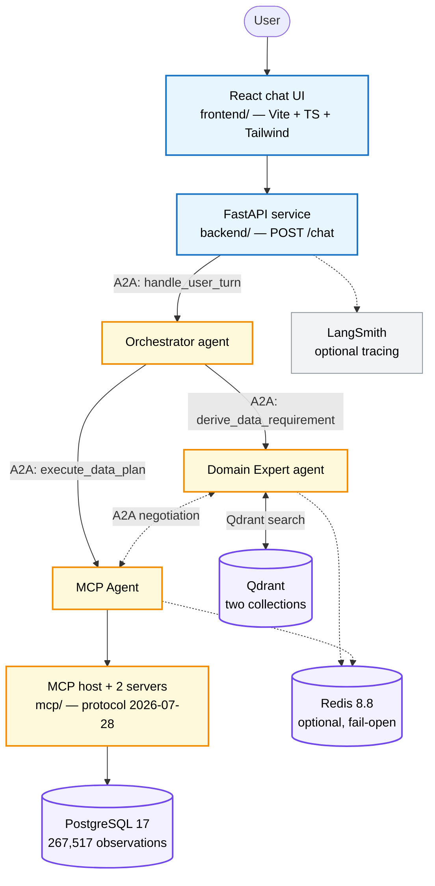
```mermaid
flowchart TB
    U(["User"])
    F["React chat UI\nfrontend/ — Vite + TS + Tailwind"]
    B["FastAPI service\nbackend/ — POST /chat"]
    O["Orchestrator agent"]
    D["Domain Expert agent"]
    M["MCP Agent"]
    MCP["MCP host + 2 servers\nmcp/ — protocol 2026-07-28"]
    PG[("PostgreSQL 17\n267,517 observations")]
    QD[("Qdrant\ntwo collections")]
    R[("Redis 8.8\noptional, fail-open")]
    LS["LangSmith\noptional tracing"]

    U --> F --> B
    B -- A2A: handle_user_turn --> O
    O -- A2A: derive_data_requirement --> D
    D <-- Qdrant search --> QD
    O -- A2A: execute_data_plan --> M
    D <-. A2A negotiation .-> M
    M --> MCP --> PG
    D -.-> R
    M -.-> R
    B -.-> LS

    classDef ui fill:#e7f5ff,stroke:#1971c2,stroke-width:2px,color:#000
    classDef agent fill:#fff9db,stroke:#f08c00,stroke-width:2px,color:#000
    classDef store fill:#f3f0ff,stroke:#7048e8,stroke-width:2px,color:#000
    classDef obs fill:#f1f3f5,stroke:#868e96,color:#000
    class F,B ui
    class O,D,M,MCP agent
    class PG,QD,R store
    class LS obs
```

| Layer | Distribution | Job |
|---|---|---|
| **UI** | `smcp-gateway-ui` (npm) | How a human sees the answer and how it was reached |
| **Service** | `gateway-backend` | The single entry point; owns session memory across turns |
| **Agents** | `gateway-agents` | Decide *what data a question needs*, over a real agent-to-agent protocol |
| **MCP** | `mcp-servers` | The only road between reasoning and data — tools, resources, prompts |
| **PostgreSQL** | `treasury-db` | Where the Treasury data actually lives |
| **Qdrant** | (backend-owned) | What the domain *means* — retrieved methodology, not a cache |
| **Redis** | (backend/agents-owned, optional) | Derived, fail-open shared memory — never a system of record |
| **LangSmith** | (optional) | Full-turn tracing across every agent boundary |

This is a **derived** diagram — the topology comes from reading `agents/`, `backend/`, `mcp/`
and `docker-compose.yml`, not a template. Three interface seams keep every engine swappable
without touching an agent:

| Seam | Implementations | Chosen by |
|---|---|---|
| `DataProvider` | `McpDataProvider` · `PostgresDataProvider` · `MockDataProvider` | `DATA_BACKEND` |
| `VectorStore` | `QdrantVectorStore` (embedded, or Docker via `QDRANT_URL`) | `QDRANT_URL` |
| `ModelProvider` | `AnthropicProvider` (Claude) · `ZaiProvider` (GLM) | `LLM_BACKEND` |

No agent names a model — each declares a *call site* (`CallSite.ORCHESTRATOR`,
`CallSite.DOMAIN_EXPERT`, `CallSite.MCP_AGENT`, `CallSite.HOST_AGENT`, `CallSite.SAMPLING`), and
`llm/src/llm/config.py` resolves which literal model string serves it. `LLM_BACKEND=zai` (the
default) runs `glm-5.2` at every call site; `LLM_BACKEND=anthropic` runs `claude-haiku-4-5` at
the Orchestrator and `claude-opus-5` everywhere else. See [§25](#25-llm-architecture).

---

# 3. Repository layout

Five installable Python distributions, one npm package, run in place, dependencies strictly
downward:

```
semantic-mcp-data-access-gateway/
├── llm/              gateway-llm      → import llm            (lowest layer, imports nothing above it)
├── postgres/         treasury-db      → import treasury_db
├── mcp/              mcp-servers      → import mcp_servers     (deliberately not "mcp" — see below)
├── backend/          gateway-backend  → import backend
├── agents/           gateway-agents   → import agents, agents.a2a
├── frontend/         smcp-gateway-ui  npm package, React + Vite + TS + Tailwind
├── data/             source of record: raw/, processed/, metadata/, acquisition/
├── knowledge/        RAG corpus — 4 domains, 11 markdown documents
├── docs/             market-risk-kb/ (47 reference docs) + architecture/contract docs
├── evaluation/       13-case × 11-scorer offline evaluation harness
├── tools/            setup.py, verify_load.py, verify_mcp.py
├── tests/            26 root test files + qa/ (6 tiers) + use_cases/ (4 files)
├── docker-compose.yml  postgres · qdrant · redis · redis-insight · agent
├── .env.example      the full configuration surface (see §40)
└── .claude/          Claude Code configuration only — no product code
```

| Path | Type | Responsibility | Used by |
|---|---|---|---|
| `llm/` | Package | `ModelProvider` seam — the only place a model literal is named | `agents/`, `mcp/host/agent.py` |
| `agents/` | Package | Orchestrator, Domain Expert, MCP Agent + the `agents.a2a` protocol layer | `backend/` |
| `backend/` | Package | `/chat` FastAPI service, `DataProvider`/`VectorStore` seams, `KnowledgeBase`, `RiskWorkflows` | `frontend/` (over REST) |
| `mcp/` | Package | Two stdio MCP servers, the host that drives them, all curve/risk mathematics | `agents/` (as `mcp_reader`), `mcp_servers.host.agent` standalone |
| `postgres/` | Package | Migrations, generic unpivot loader, analytics views | `backend/` (postgres `DataProvider`), `mcp/` (as `mcp_reader`) |
| `frontend/` | npm package | React chat UI, artifact panel, execution graph, trace view | End users |
| `data/` | — | Immutable raw XML, validated CSVs, manifests, schema/validation reports | `postgres/` loader |
| `knowledge/` | — | The executable-contract corpus the Domain Expert retrieves from | `backend/` `KnowledgeBase` |
| `docs/market-risk-kb/` | — | A second, larger reference corpus (47 docs) — see [§14](#14-qdrant-architecture) | `backend/` `market_risk_kb.py` |

**Why `mcp_servers`, not `mcp`.** The package is deliberately not named `mcp` — that name
belongs to the MCP SDK on PyPI, and shadowing it breaks every server with an import error that
looks like a corrupted install. (The *directory* `mcp/` is safe: a regular installed package
outranks a namespace portion, so `import mcp` still resolves to the SDK.)

Key individual files, with what they actually do (not just their name):

| File | Purpose | Calls / depends on |
|---|---|---|
| `agents/orchestrator_agent.py` | Routes every turn (`direct`/`clarify`/`data_request`), writes the final reply | `llm` seam, `CallSite.ORCHESTRATOR` |
| `agents/domain_expert_agent.py` | Retrieves methodology, derives/revises the `Requirement`, grounds every quoted number | `backend.knowledge` (Qdrant), `llm` seam |
| `agents/mcp_agent.py` | Advertises the tool catalogue, assesses feasibility, executes, dispatches by `ToolSpec` name via `getattr` | `backend.workflows.risk_workflows.RiskWorkflows`, `llm` seam |
| `agents/planning.py` | The negotiation state machine — round limits, convergence, decision derivation | `agents/contracts.py` |
| `agents/a2a/{cards,executors,guardrails,envelope,client,server}.py` | The A2A protocol layer — cards, skill routing, bounds, wire encoding | `a2a-sdk` |
| `backend/src/backend/api/service.py` | The FastAPI app — `/chat`, `/summarise`, `/health`, mounts the three A2A endpoints | `agents.a2a` (in-process ASGI) |
| `backend/src/backend/knowledge/vector_store.py` | `QdrantVectorStore` — embeds and queries both collections | FastEmbed, Qdrant client |
| `backend/src/backend/workflows/risk_workflows.py` | Deterministic marshalling from a `Requirement`/portfolio into the risk engine's input shape | `mcp_servers.risk` via MCP |
| `mcp/src/mcp_servers/data/server.py` | The data MCP server — 14 tools, 5 resources, 3 prompts | `postgres` as `mcp_reader` |
| `mcp/src/mcp_servers/risk/server.py` | The risk MCP server — 42 tools, 7 resources, 8 prompts, no DB, no network | pure Python maths |
| `mcp/src/mcp_servers/host/mcp_clients.py` | `McpHost` — spawns both servers as stdio children with an allow-listed environment | `mcp` SDK client |
| `postgres/src/treasury_db/load.py` | The generic unpivot loader, the unmapped-column guard | `psycopg2`, staging tables |
| `data/acquisition/download_us_treasury.py` | Downloads, validates, and reconciles all five Treasury datasets | Treasury's public XML feed |

---

# 4. Detailed system architecture

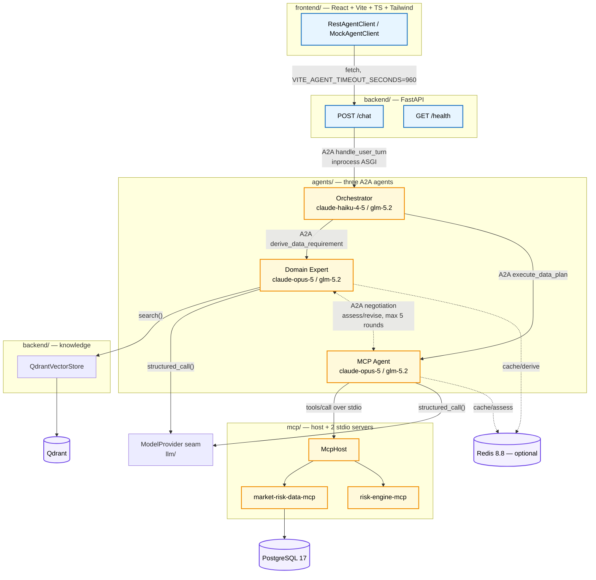
```mermaid
flowchart TB
    subgraph UI["frontend/ — React + Vite + TS + Tailwind"]
        RC["RestAgentClient / MockAgentClient"]
    end
    subgraph API["backend/ — FastAPI"]
        CHAT["POST /chat"]
        HEALTH["GET /health"]
    end
    subgraph AG["agents/ — three A2A agents"]
        ORC["Orchestrator\nclaude-haiku-4-5 / glm-5.2"]
        DOM["Domain Expert\nclaude-opus-5 / glm-5.2"]
        MCA["MCP Agent\nclaude-opus-5 / glm-5.2"]
    end
    subgraph KB["backend/ — knowledge"]
        QVS["QdrantVectorStore"]
    end
    subgraph MCPL["mcp/ — host + 2 stdio servers"]
        HOST["McpHost"]
        DSRV["market-risk-data-mcp"]
        RSRV["risk-engine-mcp"]
    end
    PG[("PostgreSQL 17")]
    QD[("Qdrant")]
    RD[("Redis 8.8 — optional")]
    LLM["ModelProvider seam\nllm/"]

    RC -- "fetch, VITE_AGENT_TIMEOUT_SECONDS=960" --> CHAT
    CHAT -- "A2A handle_user_turn\ninprocess ASGI" --> ORC
    ORC -- "A2A derive_data_requirement" --> DOM
    DOM -- "search()" --> QVS --> QD
    DOM -- "structured_call()" --> LLM
    ORC -- "A2A execute_data_plan" --> MCA
    DOM <-. "A2A negotiation\nassess/revise, max 5 rounds" .-> MCA
    MCA -- "tools/call over stdio" --> HOST
    HOST --> DSRV --> PG
    HOST --> RSRV
    MCA -- "structured_call()" --> LLM
    DOM -.->|cache/derive| RD
    MCA -.->|cache/assess| RD

    classDef ui fill:#e7f5ff,stroke:#1971c2,stroke-width:2px,color:#000
    classDef agent fill:#fff9db,stroke:#f08c00,stroke-width:2px,color:#000
    classDef store fill:#f3f0ff,stroke:#7048e8,stroke-width:2px,color:#000
    class RC,CHAT,HEALTH ui
    class ORC,DOM,MCA,HOST,DSRV,RSRV agent
    class PG,QD,RD store
```

For every arrow above, who initiates it, what crosses it, and what happens on failure:

| Arrow | Initiator | Carries | Protocol | On failure |
|---|---|---|---|---|
| UI → `/chat` | Browser `fetch`, `AbortController` at `VITE_AGENT_TIMEOUT_SECONDS` (960s) | `{query, session_id}` | HTTPS/REST, JSON | `AgentClientError` shown as a dismissible red banner; no auto-retry |
| `/chat` → Orchestrator | FastAPI route handler | One A2A `Message` | A2A JSON-RPC, in-process ASGI (default) or HTTP | Wrapped exception → `HTTPException(502)` |
| Orchestrator → Domain Expert | `AgentPipeline` via `A2ADataLayer`/A2A client | `Requirement` derivation request | A2A `derive_data_requirement` skill | `HandoffRefused` on chain/budget breach; else a `failed` task with a structured `error` artifact |
| Domain Expert → Qdrant | `QdrantVectorStore.search()` | Two queries per corpus, merged by distance | Qdrant client (gRPC/HTTP) | Empty result → `rows=None`, `grounded=False`, never a fabricated chunk |
| Domain Expert ⇄ MCP Agent | `DataPlanner._negotiate()` | `assess_data_requirement` / revised `Requirement` | A2A, `A2ADataLayer` | Assess failure → treated as feasible (fail-open on this side only); no-change rounds end the loop |
| MCP Agent → MCP servers | `McpHost.call()` | Typed tool arguments | MCP JSON-RPC over stdio | `DomainError` (structured), or MRTR retry on elicitation/roots/sampling |
| Data server → PostgreSQL | `mcp_servers.data.repository` | SQL against `analytics.*`/`demo.*` views only | `psycopg2`, role `mcp_reader`, 5s statement timeout | Query error surfaces as a `DomainError`; connection refused if `assert_constrained_identity` fails |
| Agents ↔ Redis | `RedisIntelligence.cached()` | `CacheRequest` digests, TTL-bound | `redis` client (RedisJSON/RediSearch/Streams) | Any failure → cache miss, call proceeds normally (fail-open unless `REDIS_REQUIRED=true`) |
| `/chat` → LangSmith | `@traced` decorator, background | Spans + metadata, never payload bodies | LangSmith SDK, HTTPS | Any failure → tracing silently no-ops; never blocks the response |

---

# 5. Agent architecture

**There are exactly three runtime agents.** Each is independently addressable over A2A — an
Agent Card, a set of skills with tagged callers, a JSON-RPC endpoint, and a task lifecycle. A
fourth candidate would be a design change, not a convenience: a router, planner or judge would
each split a responsibility one of the three already owns.

**Not agents**, despite being substantial modules with real logic — they have no card and are
never addressed over A2A: `mcp_servers/host/agent.py` (a standalone CLI loop, see [§17](#17-mcp-architecture)),
`McpHost`, `RiskWorkflows`, `KnowledgeBase`, the three `DataProvider` implementations, the
sampling callback. This distinction is enforced by a repo test that parses the import graph and
fails if `agents/pipeline.py` ever imports `DomainExpertAgent` or `McpAgent` directly — a
specialist is reached only by sending it an A2A message.

| Agent | Primary responsibility | Receives from | Sends to | Model (zai / anthropic) | Tools it calls | User-facing? |
|---|---|---|---|---|---|---|
| **Orchestrator** | Route every turn; write the final reply | The user, via `/chat` | Domain Expert, MCP Agent | `glm-5.2` / `claude-haiku-4-5` | None directly — delegates | **Yes** — the only one |
| **Domain Expert** | Retrieve methodology, derive/revise/validate the data `Requirement` | Orchestrator (A2A) | Qdrant, Redis, MCP Agent (negotiation) | `glm-5.2` / `claude-opus-5` | None (no MCP tool access) | No — returns `input-required` at most |
| **MCP Agent** | Advertise capabilities, assess feasibility, execute, calculate | Orchestrator, Domain Expert (A2A) | MCP servers, Redis | `glm-5.2` / `claude-opus-5` | All 56 registered MCP tools, dispatched via `RiskWorkflows` | No |

The pipeline mirrors AGENTS.md's own diagram, verified against `agents/orchestrator_agent.py`,
`agents/domain_expert_agent.py`, `agents/mcp_agent.py`, `agents/planning.py`:

```
User → Orchestrator.classify()
         ├─ direct   → Orchestrator.reflect() → reply, stop
         ├─ clarify  → MCP Agent.choices() → one question with real options
         └─ data_request
              → Domain Expert.derive() (Qdrant-grounded hypothesis)
              → MCP Agent.catalogue() (what can actually be served)
              ⇄ NEGOTIATION: assess() / revise(), ≤5 rounds, ≤2 unchanged
              → MCP Agent.execute() (fetch + calculate)
              → Domain Expert.validate_result()
              → Orchestrator.reflect() → reply
```

---

# 6. The Orchestrator

`agents/orchestrator_agent.py`, class `OrchestratorAgent`, call site `CallSite.ORCHESTRATOR`.

**Intake and routing.** `classify(question, history, already_clarified)` makes one **structured**
model call against `CLASSIFY_SCHEMA` — never parsed prose — returning a `route` of exactly
`"direct"`, `"clarify"`, or `"data_request"`, plus `reasoning`, `task`, `direct_answer`,
`requested_fields`, `requested_rows`, `question`, and `options`. `additionalProperties: False`
and all 8 fields are `required`, so a route cannot silently degrade to free text.

**State handling — two guarantees enforced in code, not in a prompt:**

- **A user who just answered a clarification is never asked another.** `classify()` takes
  `already_clarified: bool`; when true, a `guard` string in the prompt forbids a second
  `"clarify"` route on this turn, and the session-level `clarified` flag (see [§23](#23-fastapi--backend-api-architecture))
  is what feeds that flag in from the previous turn.
- **Clarifying questions carry real choices.** `_catalogue_options()` builds the offered options
  from the MCP Agent's live `choices()` response (actual portfolios and scenarios), used as a
  fallback pad if the model under-delivers — never invented labels.

**`awaiting_clarification` follows the route, never the prose.** `backend/src/backend/api/service.py:326`
computes `clarifying = outcome.route == "clarify"` directly from the structured field. This
replaced an earlier defect: a 2,302-character finished answer ending "*Want me to run DV01?*"
was once misclassified as a pending question purely because of its final character.

**Final reply.** `reflect()` builds a `summary` (rows returned/requested, grounding, warnings,
calculation, observed date window) and makes a second structured call against `REFLECT_SCHEMA`
(`{"reply": string}`). On model failure, `_fallback_reply()` assembles a deterministic sentence
from the same facts — never a second unconstrained generation attempt.

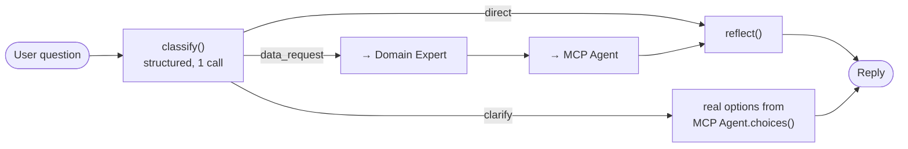
```mermaid
flowchart LR
    Q(["User question"]) --> C["classify()\nstructured, 1 call"]
    C -->|direct| RF["reflect()"] --> A(["Reply"])
    C -->|clarify| OPT["real options from\nMCP Agent.choices()"] --> A
    C -->|data_request| DE["→ Domain Expert"] --> MC["→ MCP Agent"] --> RF
```

---

# 7. The Domain Expert

`agents/domain_expert_agent.py`, class `DomainExpertAgent`, call site `CallSite.DOMAIN_EXPERT`
(`_MIN_TOKENS = 12,000`, the largest floor in the system).

**Why it exists.** Neither of the other two agents can determine, on its own, what a market-risk
*method* actually requires. The Domain Expert's entire job is to answer that question from
written methodology, never from memorized numbers.

**Input/output contract — `Requirement`** (`agents/contracts.py`), every field:

`task, answerable, fields, field_notes, rows, row_reason, row_quote, grounded, tenors,
curve_family, temporal, decision, is_hypothesis, candidate_fields, open_questions, assumptions,
limitations, calculation, calculation_params, unanswerable_reason, blocked_by, citations,
warnings`

Two projections exist deliberately: `as_dict()` (full serialization) and
`as_capability_request()` (drops `decision, blocked_by, unanswerable_reason, row_reason,
warnings, citations` — the fields the MCP Agent's `assess` skill never reads — so that skill's
`idempotent` tag can actually fire on repeated rounds without a growing `warnings` list breaking
the digest match every time).

**Retrieval — two queries, not one, merged by distance.** `_retrieve()` issues the task itself as
one query and `f"{subject} observation window how many rows lookback observations read"` as a
second, because "what a metric means" and "how large its window is" are not near each other in
embedding space. Results from both are merged into one dict keyed by
`(collection, chunk_id, source::heading)`, keeping the better-scoring hit on collision, then
sorted by distance. The same two-query pattern runs a second time against the separate
`market_risk_kb` reference collection (see [§14](#14-qdrant-architecture)).

**Grounding — the mechanism that keeps numbers honest.** `quote_is_grounded(quote, context)`
normalizes both strings (strips markdown emphasis, unifies dashes/quotes, collapses whitespace,
lowercases) and requires the quote (≥12 characters) to literally appear in the retrieved text:

```python
if rows is not None and not quote_is_grounded(quote, context):
    rows, quote = None, None      # discarded — and the user is told why
```

A number recalled from model training is rejected exactly like a hardcoded constant would be —
**both are unfalsifiable**: neither can be changed by editing a document or audited by reading
one.

**Reference knowledge vs. an executable data requirement — the distinction the system enforces.**
Retrieved chunks answer "*what does this method require*" (a row count, a field list, an
assumption). They are never turned directly into SQL filters or column lists; the `Requirement`
they produce is *proposed*, then tested against what the MCP Agent's live catalogue can actually
serve in the negotiation described in [§9](#9-a2a-architecture). A knowledge chunk describing
CVA's inputs does not cause the system to query for counterparty data that does not exist — it
causes `blocked_by="data"` and an honest refusal.

**`calculation_params` — a closed schema, not a free bag.** Every parameter a capability reads
(`confidence_level`, `horizon_days`, `scenario`, `shock_bp`, `tenor_months`, `crisis_id`, …) must
be declared here; out-of-range values are **dropped, never clamped** — rewriting a stated
confidence level of `99` to `0.99` guesses at the number the whole figure is defined by.

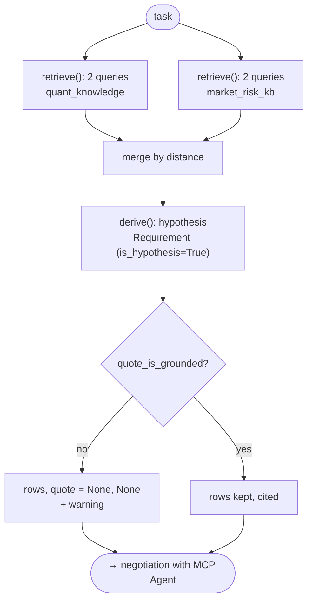
```mermaid
flowchart TB
    T(["task"]) --> R1["retrieve(): 2 queries\nquant_knowledge"]
    T --> R2["retrieve(): 2 queries\nmarket_risk_kb"]
    R1 --> MRG["merge by distance"]
    R2 --> MRG
    MRG --> H["derive(): hypothesis\nRequirement (is_hypothesis=True)"]
    H --> G{quote_is_grounded?}
    G -->|no| DROP["rows, quote = None, None\n+ warning"]
    G -->|yes| KEEP["rows kept, cited"]
    DROP --> NEG(["→ negotiation with MCP Agent"])
    KEEP --> NEG
```

---

# 8. The MCP Agent

`agents/mcp_agent.py`, class `McpAgent`, call site `CallSite.MCP_AGENT`
(`_MIN_TOKENS = 10,000`).

**What it does when work arrives:**

- **`catalogue()`** — reads `self.data.list_series()` for live fields/tenors, always advertises 4
  non-executable data lookups (`get_yield_curve`, `get_rate_history`, `get_curve_slope`,
  `list_series`), then checks `hasattr(self.data, "call_tool")` to decide whether the risk engine
  is reachable at all. When it is, appends **30** executable `ToolSpec`s (one per agent-facing
  capability — see [§19](#19-complete-mcp-tool-catalog)); when it is not (e.g. under
  `DATA_BACKEND=postgres` or `mock`), it says plainly that no positions/risk tools exist rather
  than advertising something it cannot honour.
- **`assess()`** — a proposed `Requirement` is checked two ways: **mechanical facts**
  (`available_fields`/`unsupported_fields` by set intersection against the live catalogue,
  coverage-date checks) computed directly in Python, merged **over** the model's judgment half
  (unnecessary fields, a counter-proposal). The mechanical facts always win — "a confident wrong
  answer about what exists cannot survive."
- **`execute()`** — fetches the table (snapshot or history) and, if a calculation was agreed,
  dispatches it via `getattr(workflows, tool_name)` where `tool_name` is literally the
  `RiskWorkflows` method name declared on the `ToolSpec` — a contract test enforces this holds in
  both directions.
- **`choices()`** — the real portfolios (`RiskWorkflows.list_portfolios()`) and scenarios
  (`list_scenarios()`), `[:8]` each, that feed the Orchestrator's clarifying-question options.

**Iterative execution and elicitation — why the MCP Agent never talks to the user directly.**
When an MCP server needs a human decision mid-call (`search_series` cannot tell `'30 year'`
nominal from real), the MCP Agent's `interaction.py` policy is `"relay"`: it records the
question and declines that round cleanly, rather than answering it itself. The refusal surfaces
as an A2A `input-required` task state carrying the field names and allowed answers as structured
data. This is a deliberate separation of concerns:

```
MCP Agent → Orchestrator → User        (what actually happens)
MCP Agent → User                       (never — no card admits the user boundary here)
```

The Orchestrator is the only agent whose card lists `user-boundary` as a permitted caller; the
MCP Agent's and Domain Expert's skills reject it by name. This keeps exactly one place in the
system responsible for phrasing a question to a human and exactly one place responsible for
resuming the right task when they answer.

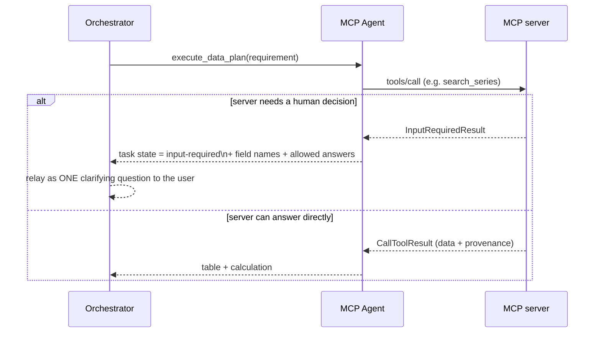
```mermaid
sequenceDiagram
    participant O as Orchestrator
    participant M as MCP Agent
    participant S as MCP server
    O->>M: execute_data_plan(requirement)
    M->>S: tools/call (e.g. search_series)
    alt server needs a human decision
        S-->>M: InputRequiredResult
        M-->>O: task state = input-required\n+ field names + allowed answers
        O-->>O: relay as ONE clarifying question to the user
    else server can answer directly
        S-->>M: CallToolResult (data + provenance)
        M-->>O: table + calculation
    end
```

---

# 9. A2A architecture

**A2A carries agents; MCP carries data.** Two protocols, two jobs, and neither replaced the
other. Each of the three agents is mounted on the same FastAPI app at `/a2a/<agent>`: an
Agent Card, skills, a JSON-RPC endpoint (`a2a-sdk` 1.1.2, protocol revision **1.0**), and the
full task lifecycle including `input-required`. `POST /chat` sends exactly one A2A message to
the Orchestrator; the other two agents' cards reject the `user-boundary` caller by name.

**Cards and skills** (`agents/a2a/cards.py`) — every skill, its tags, its idempotency, and the
callers permitted to invoke it (`agents/a2a/executors.py`):

| Agent | Skill | Tags | Idempotent | Permitted callers |
|---|---|---|---|---|
| Orchestrator | `handle_user_turn` | routing, user-facing, reflection, market-risk | no | `user-boundary` |
| Orchestrator | `relay_user_input` | elicitation, user-facing, task-continuation | no | `user-boundary` |
| Orchestrator | `summarise_session` | routing, user-facing, idempotent | **yes** | `user-boundary` |
| Domain Expert | `derive_data_requirement` | market-risk, knowledge-retrieval, requirements, citations, negotiation | **yes** | `orchestrator` |
| Domain Expert | `validate_result` | market-risk, validation, assurance | **yes** | `orchestrator` (deliberately not `mcp-agent` — keeps the orchestrator from letting the MCP agent certify its own output) |
| MCP Agent | `describe_data_capabilities` | mcp, capability-discovery, catalogue | **yes** | `domain-expert`, `orchestrator` |
| MCP Agent | `assess_data_requirement` | mcp, feasibility, negotiation | **yes** | `domain-expert` |
| MCP Agent | `execute_data_plan` | mcp, data-access, risk-calculation, provenance | no | `orchestrator` |
| MCP Agent | `list_data_choices` | mcp, catalogue, clarification-support | **yes** | `orchestrator` |
| MCP Agent | `provide_input` | mcp, task-continuation, elicitation | no | `orchestrator` |

The card is a real contract: a skill id is checked against the target's card before an executor
ever sees it, and a repo test rejects any skill description under 80 characters or with no tags.
Duplicate suppression only applies to skills tagged `idempotent`, on their own card — tagging a
data fetch idempotent to save a call would turn loop-prevention into a cross-user cache, so it
is refused by convention and reviewed for on every skill addition.

**What is transported.** A2A messages carry the dataclasses in `agents/contracts.py` (the
`Requirement`, the `Negotiation` transcript, `AgentOutcome`) — never a raw Python object and
never protocol types outside `agents/a2a/`. Only `agents/a2a/` may import `a2a.types`; a parsed
import-graph test enforces this, and enforces separately that `agents/pipeline.py` never imports
`DomainExpertAgent` or `McpAgent` directly, so A2A cannot become decorative.

**Bounds — code, not prompts**, each enforced by the *receiving* agent against its own config,
never a number the caller supplied:

| Bound | Default | Env var | What it stops |
|---|---:|---|---|
| Max chain depth | 8 | `A2A_MAX_CHAIN` | How far one path may go |
| Max re-entry | 3 | `A2A_MAX_REENTRY` | Same agent+skill repeating on one path — what a cycle actually looks like |
| Max handoffs | 20 | `A2A_MAX_HANDOFFS` | Total calls per user turn (breadth budget) |
| Turn timeout | 900s | `A2A_TURN_TIMEOUT_SECONDS` | The whole turn; every nested call gets whatever remains |
| Call timeout | 300s | `A2A_CALL_TIMEOUT_SECONDS` | Floor under the turn budget |
| Max clarification retries | 3 | `A2A_MAX_CLARIFICATIONS` | An unmatched reply looping forever |
| Max negotiation rounds | 5 | (planning.py constant) | The domain expert / MCP agent discussion |
| Max unchanged rounds | 2 | (planning.py constant) | Spending the full ceiling on a stalled discussion |

Chain length and re-entry are deliberately **not** collapsed into one counter: length bounds how
far a collaboration goes, re-entry bounds how often the same agent+skill repeats — a single
number tuned to catch `A→B→A→B` would also refuse an honest four-step negotiation.

**Duplicate suppression** lives on the `TurnLedger` and dies with the turn — not a cache. **The
digest covers only what a skill reads**: `assess_data_requirement` receives
`requirement.as_capability_request()` rather than the full `Requirement`, specifically so a
field the skill never reads (like a growing `warnings` list) cannot break the match every round.

**Wire-format detail worth knowing:** `Part.data` is a `google.protobuf.Value`, so an integer
like `250` round-trips as `250.0`. Every typed rebuilder in `agents/a2a/envelope.py` coerces its
own integer fields back (`COUNT_KEYS`, 30 keys), so a user never sees "250.0 observations."

**Transport.** `A2A_TRANSPORT=inprocess` (default) dials the mounted ASGI app directly via
`httpx.ASGITransport` — "real JSON-RPC, real serialization, real task lifecycle, no socket."
`A2A_TRANSPORT=http` addresses each agent by its own base URL for genuine network deployment.

### A2A vs MCP

| Concern | A2A | MCP |
|---|---|---|
| Purpose | Agent-to-agent collaboration and negotiation | Standardized access to tools, resources, prompts |
| Communication between | The three reasoning agents (Orchestrator, Domain Expert, MCP Agent) | The MCP Agent and the two MCP servers |
| Data/tool access | None directly — carries decisions and structured requirements | The only road to PostgreSQL and the risk engine |
| User interaction | Only the Orchestrator's skills accept the `user-boundary` caller | Never — a server that needs input elicits *through* the calling agent |
| Protocol | `a2a-sdk` 1.1.2, revision 1.0, JSON-RPC over ASGI or HTTP | `mcp` SDK ≥2.0.0, revision 2026-07-28, JSON-RPC over stdio |
| Unit of work | A `Task` with a lifecycle (`working`→`completed`/`input-required`/`failed`) | A `tools/call`, possibly retried via MRTR |
| Bounded by | Chain depth, re-entry, handoff budget, turn timeout | Server-side tool logic; no protocol-level round limit |

A2A is not a nicer way to call a Python function — it is what lets the Domain Expert and MCP
Agent genuinely *not know* each other's implementation, be independently deployable behind
`A2A_TRANSPORT=http`, and have every hop show up as its own auditable task with its own
LangSmith span (see [§36](#36-langsmith-architecture)).

---

# 10. End-to-end request sequence

The complete path of one real question — the "10-day 99% VaR" case narrated in [§33](#33-example-conversation):

```mermaid
sequenceDiagram
    autonumber
    actor User
    participant UI as React UI
    participant API as FastAPI /chat
    participant ORC as Orchestrator
    participant DOM as Domain Expert
    participant QD as Qdrant
    participant MCP as MCP Agent
    participant SRV as MCP servers
    participant PG as PostgreSQL

    User->>UI: types question
    UI->>API: POST {query, session_id}
    API->>ORC: A2A handle_user_turn
    Note over ORC: classify() → route = data_request

    ORC->>MCP: A2A describe_data_capabilities
    MCP-->>ORC: catalogue (fields, tenors, 30 capabilities)

    ORC->>DOM: A2A derive_data_requirement
    DOM->>QD: search "historical VaR" (query 1)
    DOM->>QD: search "observation window how many rows" (query 2)
    QD-->>DOM: chunks, merged by distance
    Note over DOM: quote_is_grounded(quote, context)?
    DOM-->>ORC: Requirement (rows=250, grounded=true, is_hypothesis)

    rect rgb(255, 249, 219)
    Note over DOM,MCP: NEGOTIATION — A2A, bounded at 5 rounds
    DOM->>MCP: A2A assess_data_requirement
    MCP-->>DOM: feasible; 3 fields unsupported (no CUSIP on a par curve)
    Note over DOM,MCP: converged, round 1
    end

    ORC->>MCP: A2A execute_data_plan
    MCP->>SRV: get_curve_history_matrix (stdio)
    SRV->>PG: SELECT ... as mcp_reader
    PG-->>SRV: 250 x 14 matrix
    SRV-->>MCP: rows + provenance
    MCP->>SRV: compute_historical_risk_tool
    SRV-->>MCP: VaR/ES result
    MCP-->>ORC: table + calculation

    ORC->>DOM: A2A validate_result
    DOM-->>ORC: mechanical + narrative check

    ORC->>ORC: reflect() -> <=3 sentences
    ORC-->>API: AgentOutcome
    API-->>UI: answer + tables + data_plan + negotiation + citations + langsmith_url
    UI-->>User: reply + artifact card
```

Numbered narration:

1. **User enters a question** in the React chat input.
2. **The frontend sends it** as `POST /chat {query, session_id}` — the session id is the chat's own id, generated client-side.
3. **FastAPI validates** the request body (`ChatRequest`, `query` non-empty) and reads session memory (last 12 turns, `clarified` flag) for this `session_id`.
4. **The Orchestrator classifies** the turn — one structured model call, no vector search yet.
5. **The Orchestrator asks the MCP Agent what exists** before asking the Domain Expert to plan against it, so the plan targets what is actually connected.
6. **The Domain Expert retrieves** from Qdrant with two queries per corpus and derives a `Requirement` hypothesis — no number in it that isn't a grounded quote.
7. **Domain Expert and MCP Agent negotiate** over A2A until AGREED, NEEDS_USER_INPUT, UNSUPPORTED, or the round/stall bound is hit.
8. **The MCP Agent executes**: an MCP `tools/call` reaches the data server over stdio, which queries PostgreSQL as the restricted `mcp_reader` role, then (if a calculation was agreed) a second `tools/call` reaches the risk server for the actual maths.
9. **The Domain Expert validates the result** against the agreed contract before the Orchestrator ever sees it as final.
10. **The Orchestrator writes the reply** — a second structured call, budgeted to a few sentences, built from the facts already assembled rather than re-deriving them.
11. **`/chat` returns** the answer plus `tables`, `data_plan`, `negotiation`, `catalogue`, `calculation`, and (if configured) `langsmith_url`/`langsmith_trace_id`.
12. **The UI renders** the prose in the chat pane and an artifact card standing in for the table; opening it shows the Table/Data-plan/Discussion/Source tabs.
13. **LangSmith**, if enabled, has the whole turn as one trace tree rooted at `agent_pipeline`, spanning every A2A hop (see [§36](#36-langsmith-architecture)).

---

# 11. Dataset architecture

Five **real** Treasury datasets, one **synthetic** demo book. Never mixed, never mislabelled.

| Dataset | Source | Frequency | First year | Shape | Series | Observations |
|---|---|---|---:|---|---:|---:|
| Daily Treasury Par Yield Curve Rates | `home.treasury.gov` XML feed | Daily | 1990 | wide | 15 | **108,339** |
| Daily Treasury Bill Rates | same | Daily | 2002 | wide | 28 | **105,204** |
| Daily Treasury Par Real Yield Curve Rates | same | Daily | 2003 | wide | 5 | 27,354 |
| Daily Treasury Long-Term Rates | same | Daily | 2000 | **long** | 3 | 19,965 |
| Daily Treasury Real Long-Term Rates | same | Daily | 2000 | wide | 1 | 6,655 |

**Sum: 267,517** — verified against the last recorded load run (`data/metadata/us_treasury/load_verification.md`, run 8, 2026-08-25T18:10:07Z, 74/74 checks passed), matching the number stated at the top of this document.

Verbatim caveats, carried from the acquisition script through `treasury.dataset.caveat` into every answer that touches the series:

- **Par yield curve**: *"These are PAR yields, not zero-coupon/spot rates and not executable market prices."* `BC_30YEAR` is absent 2003-2005 (the 30-year bond was discontinued and reintroduced); `BC_30YEARDISPLAY` is a Treasury *display* variant, published as a literal `0` for every date before 2011-01-03 — a placeholder, not a yield (see [§13](#13-postgresql-architecture)).
- **Bill rates**: *"CLOSE columns are DISCOUNT rates on a bank-discount actual/360 basis. YIELD columns are COUPON-EQUIVALENT yields."* Both correct for the same instrument; never share a curve.
- **Long-term rates**: natural key is `(QUOTE_DATE, RATE_TYPE)` — a date legitimately carries multiple rows, and the embedded `Real_Rate` series must not be merged with the nominal ones.
- **Real yield curve**: TIPS-based; *negative values are normal and correct* and must never be clipped.
- **Real long-term**: a single composite series with no meaningful point tenor; coverage is interrupted where Treasury itself suspended publication.

**Quoting basis** — the single column that must never be lost, because getting it wrong is *invisible* (a discount rate registered as coupon-equivalent sits quietly in a curve until someone prices off it):

| `rate_kind` | `quote_basis` | Series | Meaning |
|---|---|---:|---|
| nominal | `par_coupon_semiannual` | 17 | The classic Treasury par curve |
| nominal | `bank_discount_act360` | 14 | Bill discount rates |
| nominal | `coupon_equivalent` | 14 | The *same bills*, bond-equivalent basis |
| real | `par_coupon_semiannual` | 5 | TIPS par real yields |
| real | `average_real_yield` | 2 | Long-term average real |

**Synthetic data — clearly labelled, never presented as market data.** `postgres/migrations/V008__demo_schema.sql` creates a `demo` schema whose own comment reads: *"Everything in this schema is INVENTED... a data_classification is NOT NULL DEFAULT 'SYNTHETIC_DEMO' with a CHECK pinning it to exactly that value on every table."* One portfolio (`TREASURY_DEMO_001`), 5 instruments, 5 positions, 7 stress scenarios — invented bond holdings that exist solely so the risk engine has a book to price. Every wire response type in `mcp_servers/data/contracts.py` carries a `DataClassification = Literal["REAL_MARKET_DATA", "SYNTHETIC_DEMO"]`, and both labels are required to survive into any answer: *"the answer states both: a real methodology over a `SYNTHETIC_DEMO` portfolio priced off `REAL_MARKET_DATA`."*

Applications supported today, all traced to a real MCP capability: yield-curve retrieval and slope analysis (`get_curve`, `compute_curve_analytics_tool`), historical-rate analysis (`get_rate_history`, `compute_rate_volatility_tool`), DV01 and key-rate DV01 (`compute_dv01_tool`, `compute_key_rate_dv01_tool`), historical/parametric/Monte-Carlo VaR and ES (`compute_historical_risk_tool`, `compute_parametric_risk_tool`, `compute_monte_carlo_risk_tool`), and deterministic stress/scenario analysis (`run_stress_tool` and the 10 tools around it). Full inventory: [§19](#19-complete-mcp-tool-catalog).

---

# 12. Dataset ingestion flow

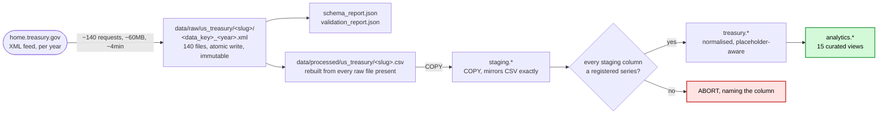
```mermaid
flowchart LR
    T(["home.treasury.gov\nXML feed, per year"])
    RAW["data/raw/us_treasury/&lt;slug&gt;/\n&lt;data_key&gt;_&lt;year&gt;.xml\n140 files, atomic write, immutable"]
    VAL["schema_report.json\nvalidation_report.json"]
    CSV["data/processed/us_treasury/&lt;slug&gt;.csv\nrebuilt from every raw file present"]
    STG["staging.*\nCOPY, mirrors CSV exactly"]
    GUARD{"every staging column\na registered series?"}
    CORE["treasury.*\nnormalised, placeholder-aware"]
    ANA["analytics.*\n15 curated views"]

    T -->|"~140 requests, ~60MB, ~4min"| RAW
    RAW --> VAL
    RAW --> CSV
    CSV -->|COPY| STG
    STG --> GUARD
    GUARD -->|no| STOP["ABORT, naming the column"]
    GUARD -->|yes| CORE
    CORE --> ANA

    classDef bad fill:#ffe3e3,stroke:#c92a2a,stroke-width:2px,color:#000
    classDef good fill:#d3f9d8,stroke:#2f9e44,stroke-width:2px,color:#000
    class STOP bad
    class ANA good
```

**Acquisition** (`data/acquisition/download_us_treasury.py`): one `DatasetSpec` per dataset (data
key, first year, date field, natural key, shape, market-risk caveat), hitting
`https://home.treasury.gov/resource-center/data-chart-center/interest-rates/pages/xml?data=<data_key>&field_tdr_date_value=<year>`.
Raw bytes are written via a temp file + `os.replace` — *"raw files are immutable afterwards... a
partial write is never visible as a valid raw artefact."* Missing tokens (`""`, `"n/a"`, `"-"`,
etc.) become `None`, **never zero** (`normalise_value()`).

**Validation, before a single row reaches staging:** `schema_report.json` tracks column presence
per year (so `BC_1MONTH` appearing in 2001 or `BC_30YEAR` vanishing 2003-2005 is discovered from
the data, not assumed); `validation_report.json` checks download completeness, date sanity,
business-day coverage, duplicate detection, numeric plausibility (`[-10.0, 25.0]` pp, flagged
only, nothing dropped — negative real yields are legitimate), and a dedicated **placeholder-zero
screen**: a column's zeros are only flagged as a suspected placeholder when *every* zero in its
history forms one unbroken leading run of at least 250 observations (`SENTINEL_ZERO_MIN_RUN`).
This is exactly how `BC_30YEARDISPLAY`'s 5,256 leading zeros were identified.

**Loading** (`postgres/src/treasury_db/load.py`, [§13](#13-postgresql-architecture) has the SQL):
staging tables mirror each CSV exactly; a generic `jsonb_each_text` unpivot maps every wide
column to a `treasury.series` row; the **unmapped-column guard** aborts the load naming any
staging column with no registered series, rather than silently dropping it.

**Vectorization** (knowledge ingestion, distinct from Treasury data ingestion — see
[§14](#14-qdrant-architecture) and [§15](#15-embedding-architecture)): markdown documents are
chunked, tagged with `{domain, source, heading}`, embedded locally with FastEmbed, and upserted
into Qdrant. Idempotent — `KnowledgeBase(rebuild=True)` deletes and rebuilds a collection from
the current files on disk, so editing a document and re-ingesting is the entire update procedure.

There is no `UPDATE`-in-place for either raw Treasury files or vector points: both are rebuilt
from source on every run, which is what makes "recount from source, never trust what's already
loaded" (the verification principle in [§43](#43-testing-architecture)) actually meaningful.

---

# 13. PostgreSQL architecture

**Why PostgreSQL.** A relational engine with `CHECK` constraints, composite foreign keys, and
role-based grants was the right fit for a schema-shaped question ("what does a rate mean, and
who may read it") — the placeholder-zero rule, the quoting-basis distinction, and the
`mcp_reader` boundary are all enforced as *constraints*, not application code.

## 13.1 Schemas

| Schema | Purpose |
|---|---|
| `meta` | Lineage and audit — which file, checksum, run, row count |
| `staging` | Landing zone, one table per processed CSV, Treasury's own column names, truncated/reloaded every run |
| `treasury` | The normalised source of record — datasets, series, observations. A new maturity is a row, not a schema change |
| `analytics` | Read layer, views only, no storage — placeholder zeros and display duplicates already excluded |
| `demo` | Synthetic-only portfolio/instrument/scenario data for the risk engine, `CHECK`-pinned to `SYNTHETIC_DEMO` |

## 13.2 Core tables

**`treasury.observation`** (the fact table) — `series_id, observation_date, data_key, rate_percent, value_status ('observed'|'source_placeholder'), source_value_percent, source_file, load_run_id`, `PRIMARY KEY (series_id, observation_date)`. A composite foreign key `(series_id, data_key) REFERENCES treasury.series (series_id, data_key)` makes the dataset denormalization structurally impossible to disagree with. `CHECK observation_status_matches_value`: an `observed` row must have `rate_percent NOT NULL`; a `source_placeholder` row must have it `NULL` and `source_value_percent NOT NULL` — **the placeholder-zero rule is enforced at the constraint level**, not only in application code.

**`treasury.series`** — `series_code, display_name, rate_kind ('nominal'|'real'), quote_basis (4-way enum), tenor_label/value/unit/years, is_display_variant, excluded_from_analytics, placeholder_zero_before date`. The comment on `placeholder_zero_before`: *"The rule lives here rather than in the loader so that recognising a placeholder is a property of the series, and adding another one is an `UPDATE` rather than a code change."*

**`treasury.dataset`** — one row per dataset, including the verbatim `caveat` text quoted in §11.

Supporting: `bill_security` (26,300 rows — CUSIPs and maturity dates, not rates), `long_term_extrapolation` (994 rows), `market_note` (1 row).

## 13.3 Row counts — every table, live

| Schema.table | Rows | |
|---|---:|---|
| `treasury.observation` | **267,517** | The core table |
| `treasury.bill_security` | 26,300 | |
| `treasury.long_term_extrapolation` | 994 | |
| `treasury.series` | **52** | |
| `treasury.dataset` | 5 | |
| `staging.long_term_rates` | 19,965 | |
| `staging.par_yield_curve` | 9,159 | |
| `staging.real_long_term_rates` | 6,655 | |
| `staging.bill_rates` | 6,157 | |
| `staging.real_yield_curve` | 5,906 | |
| `meta.reconciliation` | 1,696 | |
| `meta.source_file` | **140** | |
| `meta.load_step` | 70 | |
| `meta.load_run` | 8 | |
| `demo.scenario` | 7 | |
| `demo.portfolio` | 1 | `TREASURY_DEMO_001` |

All counts are from the checked-in `load_verification.md`/`mcp_verification.md` artifacts for the last recorded load run, not a live query executed while writing this document — this environment had neither the package installed nor a reachable Docker daemon (see [§0](#0-how-this-document-was-produced)).

## 13.4 Analytics views — the only surface `mcp_reader` can see

15 views: `v_observation`, `v_series`, `v_series_coverage`, `v_latest_rates`, `v_par_yield_curve`, `v_real_yield_curve`, `v_bill_rates_quoted`, `v_long_term_rates`, `v_dataset_summary`, `v_source_file_current`, `v_mcp_curve`, `v_mcp_observation`, `v_mcp_series_catalogue`, `v_mcp_dataset`, `v_mcp_portfolio_position`. The `v_mcp_*` views exist specifically because `mcp_reader` was correctly refused direct access to `treasury.*` — the fix each time was a curated view, never a wider grant.

## 13.5 ER overview

```mermaid
erDiagram
    DATASET ||--o{ SERIES : registers
    SERIES ||--o{ OBSERVATION : has
    SOURCE_FILE ||--o{ OBSERVATION : provenance
    LOAD_RUN ||--o{ OBSERVATION : loaded_by
    SERIES ||--o{ BILL_SECURITY : "tenor (bill datasets)"
    PORTFOLIO ||--o{ POSITION : holds
    INSTRUMENT ||--o{ POSITION : priced_as

    DATASET {
        text data_key PK
        text title
        text caveat
    }
    SERIES {
        int series_id PK
        text data_key FK
        text series_code
        enum rate_kind
        enum quote_basis
        date placeholder_zero_before
    }
    OBSERVATION {
        int series_id PK_FK
        date observation_date PK
        numeric rate_percent
        enum value_status
        text source_file
    }
    PORTFOLIO {
        text portfolio_id PK
        enum data_classification "SYNTHETIC_DEMO, CHECK-pinned"
    }
```

## 13.6 The unmapped-column guard

```sql
FROM staging.<table> st
CROSS JOIN LATERAL jsonb_each_text(to_jsonb(st) - <ignored>) AS kv(key, value)
JOIN treasury.series s ON s.data_key = :key AND lower(s.series_code) = kv.key
WHERE kv.value IS NOT NULL
```

There is **no list of maturities anywhere in the loader** — every staging column becomes a
key/value pair, and the join decides which are rates. That join is also the hazard: an
unregistered column would simply vanish, and everything else would still look correct. So before
any insert runs, the loader asserts `staging columns − ignored ⊆ registered series codes` and
aborts naming the column if not. **This failure is the feature.**

## 13.7 The privilege boundary — `mcp_reader`

```sql
CREATE ROLE mcp_reader LOGIN NOSUPERUSER NOCREATEDB NOCREATEROLE NOREPLICATION
    NOBYPASSRLS CONNECTION LIMIT 5;
GRANT CONNECT ON DATABASE gateway TO mcp_reader;
GRANT USAGE ON SCHEMA analytics TO mcp_reader;
GRANT SELECT ON ALL TABLES IN SCHEMA analytics TO mcp_reader;
GRANT USAGE ON SCHEMA demo TO mcp_reader;
GRANT SELECT ON ALL TABLES IN SCHEMA demo TO mcp_reader;
GRANT SELECT ON meta.source_file TO mcp_reader;   -- the one meta exception
REVOKE ALL ON SCHEMA treasury FROM mcp_reader;
REVOKE ALL ON SCHEMA staging FROM mcp_reader;
ALTER ROLE mcp_reader IN DATABASE gateway SET default_transaction_read_only = on;
ALTER ROLE mcp_reader IN DATABASE gateway SET statement_timeout = '5s';
ALTER ROLE mcp_reader IN DATABASE gateway SET lock_timeout = '1s';
```

No password is set in the migration by design — `mcp_servers/data/bootstrap.py` sets it
post-migration (refusing anything under 12 characters), then **verifies the credential actually
works** by reconnecting as `mcp_reader` and calling `assert_constrained_identity()` before
reporting success. Session limits are role-scoped, "so a runaway MCP query must not be able to
affect the loader or an analyst's psql session." There is also a broader `gateway_readonly`
NOLOGIN role for general analyst read access to `analytics`/`meta`/`treasury.dataset`/`treasury.series` —
distinct from, and wider than, `mcp_reader`.

**No credentials are reproduced anywhere in this document.**

---

# 14. Qdrant architecture

**Why Qdrant.** The Domain Expert needs semantic retrieval over written methodology — "what does
historical VaR require" is not a keyword match — with per-point metadata it can cite back to the
user. Qdrant is never a cache: query results are grounded and quoted, not memoized.

**Two collections, deliberately kept separate** (`store.reset()` deletes an entire collection, so
mixing corpora would make a rebuild of one destroy the other):

| Collection | Purpose | Content | Chunks | Embedding model | Dim | Distance |
|---|---|---|---:|---|---:|---|
| `quant_knowledge` | The executable-contract corpus the agent plans against | `knowledge/` — 11 markdown docs across 4 domains | **71** | `BAAI/bge-small-en-v1.5` (local) | 384 | Cosine |
| `market_risk_kb` | A larger reference library for deeper explanatory retrieval | `docs/market-risk-kb/` — 47 docs, ~167,000 words | **~1,485** | `BAAI/bge-small-en-v1.5` (local) | 384 | Cosine |

Both figures are point-in-time claims recorded in `docs/supported-question-catalog.md` and
`docs/question-test-coverage.md` and in code comments (`market_risk_kb.py:26`) — not re-derived
by running a live ingest in this session, to stay read-only. `knowledge/` currently contains
exactly 11 `.md` files on disk, consistent with the "71 chunks across 11 documents" claim.

**`knowledge/` — the executable-contract corpus, by domain:**

| Domain | Documents | Style |
|---|---|---|
| `market_risk` (5 docs) | `var`, `expected_shortfall`, `yield_curve`, `sensitivities_greeks`, `stress_testing` | Full contract: Definition → When to use → Required inputs → Observation window → Calculation → Assumptions → Output → Limitations → **Mapping status** |
| `credit_risk` (2 docs) | `credit_ratings_pd`, `pd_lgd_ead` | Shorter: Definition → Formula → Data required → Notes (no Mapping status — Explain-only by construction) |
| `regulatory_capital` (2 docs) | `basel_capital_ratios`, `rwa` | Same shorter style |
| `xva` (2 docs) | `cva`, `exposure_metrics` | Same shorter style |

Only `market_risk` docs carry a *Mapping status* table, because only market-risk metrics resolve
to real, computable data. Example, `knowledge/market_risk/var.md`:

```
| Required input | Mapping | Status |
| `portfolio.positions` | `demo.position` | Available — Synthetic |
| `us_treasury.observation.history` | `analytics.v_observation` | Available — Real |

Mode: CALCULATE + EXPLAIN — via compute_historical_risk_tool.
```

`knowledge/xva/cva.md` has no Mapping-status section at all — it ends at `## Notes`, matching
AGENTS.md's rule that CVA is explained from knowledge but never computed (no counterparty data
exists in this system).

**Retrieval parameters actually used at runtime** (`agents/domain_expert_agent.py`): `n_results=6`
against `quant_knowledge`, `market_risk_n_results=4` (capped to `max_reference_chunks=6` after
merging with the first collection's results) against `market_risk_kb`. Two queries per corpus,
merged by best distance — see [§7](#7-the-domain-expert).

**Mode.** `QDRANT_URL` set → Docker server (default `http://localhost:6333`); unset → embedded
local store at `./data/qdrant`. No API key required either way — the embedding model runs
locally.

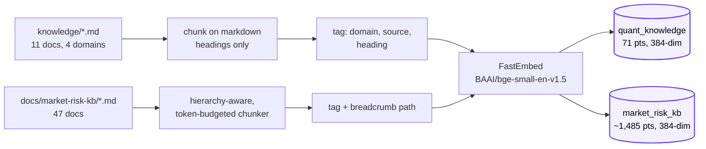
```mermaid
flowchart LR
    MD1["knowledge/*.md\n11 docs, 4 domains"] --> CH1["chunk on markdown\nheadings only"]
    MD2["docs/market-risk-kb/*.md\n47 docs"] --> CH2["hierarchy-aware,\ntoken-budgeted chunker"]
    CH1 --> TAG1["tag: domain, source,\nheading"]
    CH2 --> TAG2["tag + breadcrumb path"]
    TAG1 --> EMB["FastEmbed\nBAAI/bge-small-en-v1.5"]
    TAG2 --> EMB
    EMB --> Q1[("quant_knowledge\n71 pts, 384-dim")]
    EMB --> Q2[("market_risk_kb\n~1,485 pts, 384-dim")]

    classDef store fill:#f3f0ff,stroke:#7048e8,stroke-width:2px,color:#000
    class Q1,Q2 store
```

---

# 15. Embedding architecture

**Model: `BAAI/bge-small-en-v1.5`**, served locally via **FastEmbed** (`fastembed.TextEmbedding`)
— not an API call, no external key. 384 dimensions, Cosine distance, `MODEL_LIMIT = 512` tokens
(the model's own hard truncation ceiling).

**Two chunkers, by design, not by accident:**

- **`knowledge/` (executable corpus)** — heading-only split (`_chunk_markdown`, regex on markdown
  heading boundaries), no token budget enforced. Deliberately simple: these documents are
  "hand-sized" and short enough that a naive split never approaches the 512-token ceiling.
- **`docs/market-risk-kb/` (reference corpus)** — a hierarchy-aware, token-budget-enforced
  chunker (`backend/src/backend/knowledge/markdown_chunker.py`): `MAX_TOKENS=460`,
  `TARGET_TOKENS=400`, `OVERLAP_TOKENS=60`, counted with the embedding model's *own* tokenizer
  (`bge_token_counter()`) rather than a proxy. Preserves heading breadcrumbs, keeps a formula
  glued to its explanatory prose, and splits oversized tables while repeating the header row.
  The module's own docstring states why this exists: naive heading-only chunking on this larger
  corpus produced 1,402 chunks, of which 99 exceeded 512 tokens — **silently discarding 8.2% of
  the corpus** at embed time. That measured defect is what the token-aware chunker fixes.

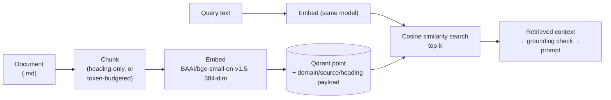
```mermaid
flowchart LR
    D["Document\n(.md)"] --> C["Chunk\n(heading-only, or\ntoken-budgeted)"]
    C --> E["Embed\nBAAI/bge-small-en-v1.5, 384-dim"]
    E --> Q[("Qdrant point\n+ domain/source/heading payload")]
    QU["Query text"] --> QE["Embed (same model)"]
    QE --> S["Cosine similarity search\ntop-k"]
    Q --> S
    S --> CTX["Retrieved context\n→ grounding check → prompt"]
```

Normalization: FastEmbed's BGE implementation applies the model's native normalization
internally; no separate post-processing step exists in this codebase. Indexing and search both
use the same Cosine metric declared at collection creation (`models.Distance.COSINE`).

---

# 16. Redis / caching architecture

**Status: implemented and wired into the live `/chat` path**, not merely configured — this is
the most recently landed subsystem in the repository (`git log` on `agents/`: `58323d3 feat: add
Redis-backed shared intelligence for the specialist agents`, `2bdd2ff feat(observability):
surface Redis cache outcomes in LangSmith traces`, both at the top of `main`'s history as of this
writing). It is **derived memory, not authority** — PostgreSQL, Qdrant, and MCP execution remain
the systems of record; Redis failures degrade to cache misses unless `REDIS_REQUIRED=true`.

**Selection**: `agents/cache/factory.py:build_intelligence()` — `REDIS_ENABLED=false` (or
unreachable, non-required) returns a `NoOpIntelligence()` that always misses; `.env.example`
ships `REDIS_ENABLED=true` as its documented default.

**What is cached, and for how long** (`agents/cache/policies.py:policy_for()`):

| Agent | Operation | Exact cache | Semantic cache | Default TTL |
|---|---|:---:|:---:|---:|
| Domain Expert | `retrieve` | yes | no | 900s (15 min) |
| Domain Expert | `retrieve_reference` | yes | no | 900s |
| Domain Expert | `derive` | yes | **yes** (0.93 similarity, 8 candidates) | 86,400s (24h) |
| Domain Expert | `revise` | yes | no | 43,200s (12h) |
| Domain Expert | `validate_result` | yes | no | 3,600s (1h) |
| MCP Agent | `catalogue` | yes | no | 300s (5 min) |
| MCP Agent | `assess` | yes | no | 21,600s (6h) |
| MCP Agent | `choices` | yes | no | 300s |

**Execution is deliberately never cached.** The policy module's own comment: *"A historical
result is cacheable only when every provider exposes an immutable snapshot identity. The current
seam does not, so 'latest' and '2008' both execute normally."* — `compute_historical_risk_tool`
and every other calculation runs fresh on every call.

**Key structure** (`agents/cache/keys.py`): `{namespace}:cache:{agent}:{operation}:{digest}`
(exact), `{namespace}:semantic:{agent}:{operation}:{digest}` (semantic), plus
`{namespace}:lock:{digest}` (single-flight), `{namespace}:stream:agent-events`,
`{namespace}:stats:*`, `{namespace}:ts:{agent}:{operation}:{metric}` (time series),
`{namespace}:rate:llm:{scope}` — `namespace = "{cache_prefix}:{namespace_version}"`, default
`smcp:v1`.

**Other capabilities in the same layer**: single-flight coordination on concurrent identical
requests (`REDIS_LOCK_TTL_MS=360000`, `REDIS_SINGLEFLIGHT_WAIT_SECONDS=310` — deliberately just
under the A2A turn deadline), per-scope model-call rate limits (disabled by default, `=0`), and
bounded operational evidence — a capped Redis Stream of agent events (`maxlen=50,000`), a
question-frequency counter (`max_entries=10,000`), metrics retained 30 days.

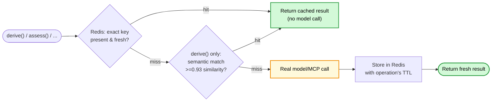
```mermaid
flowchart LR
    REQ(["derive() / assess() / ..."]) --> LOOKUP{"Redis: exact key\npresent & fresh?"}
    LOOKUP -->|hit| RETURN["Return cached result\n(no model call)"]
    LOOKUP -->|miss| SEM{"derive() only:\nsemantic match\n>=0.93 similarity?"}
    SEM -->|hit| RETURN
    SEM -->|miss| CALL["Real model/MCP call"]
    CALL --> STORE["Store in Redis\nwith operation's TTL"]
    STORE --> RETURN2(["Return fresh result"])

    classDef hit fill:#d3f9d8,stroke:#2f9e44,stroke-width:2px,color:#000
    classDef miss fill:#fff9db,stroke:#f08c00,stroke-width:2px,color:#000
    class RETURN,RETURN2 hit
    class CALL miss
```

Full operational detail: [`docs/redis.md`](docs/redis.md).

---

# 17. MCP architecture

Two stdio MCP servers, one host, protocol revision **2026-07-28**, SDK `mcp>=2.0.0`. **56 tools
total are registered** (14 data + 42 risk) — correcting the previous README's stale "19." All six
MCP primitives are live, three flowing client→server and three flowing server→client mid-call.

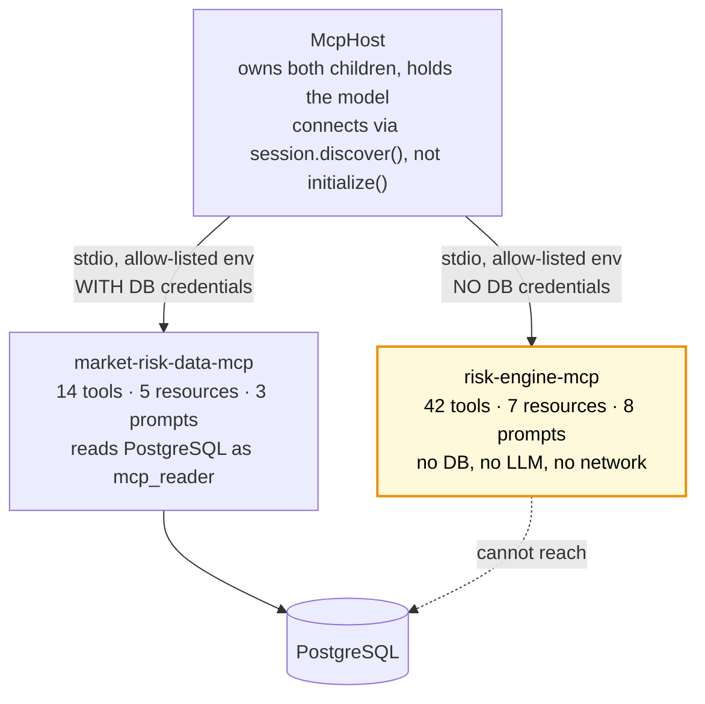
```mermaid
flowchart TB
    H["McpHost\nowns both children, holds the model\nconnects via session.discover(), not initialize()"]
    D["market-risk-data-mcp\n14 tools · 5 resources · 3 prompts\nreads PostgreSQL as mcp_reader"]
    R["risk-engine-mcp\n42 tools · 7 resources · 8 prompts\nno DB, no LLM, no network"]
    PG[("PostgreSQL")]

    H -->|"stdio, allow-listed env\nWITH DB credentials"| D
    H -->|"stdio, allow-listed env\nNO DB credentials"| R
    D --> PG
    R -.->|cannot reach| PG

    classDef isolated fill:#fff9db,stroke:#f08c00,stroke-width:2px,color:#000
    class R isolated
```

**Why the risk engine has no database access.** Not because it would misuse it — because a
calculation service that *cannot* reach the database makes "was the input wrong, or the maths?"
a mechanical question. `sanitised_env()` builds each child's environment by **allow-list**, not
deletion: `RISK_SERVER = ServerSpec("risk-engine", "mcp_servers.risk.server", env_keys=())` — the
risk child's environment literally contains no `POSTGRES_*`, `MCP_READER_*`, or
`MCP_DATABASE_URL` key. `python -m mcp_servers.host --isolation` proves this by checking both the
child's actual environment and its live tool list for anything DB-shaped.

**Both servers run exclusively as stdio child processes** — verified by reading every file under
`mcp/src/mcp_servers/`: no `uvicorn`, no `socket`, no port binding anywhere. `McpHost` spawns each
via `StdioServerParameters` + `stdio_client(...)`.

**Why `session.discover()`, not `session.initialize()`.** `initialize` is the pre-2026 handshake
and negotiates at most protocol 2025-11-25, on which elicitation, roots and sampling fall back to
deprecated standalone server-to-client requests. `verify_mcp.py` asserts the negotiated revision
so this cannot regress silently.

**Stdout is the protocol channel.** Both servers route all logging to `stderr` explicitly — a
stray `print()` on stdout corrupts the JSON-RPC stream and looks like a mysterious client
disconnect rather than what it is.

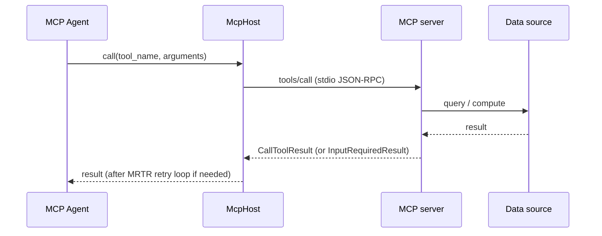
```mermaid
sequenceDiagram
    participant M as MCP Agent
    participant H as McpHost
    participant S as MCP server
    participant D as Data source
    M->>H: call(tool_name, arguments)
    H->>S: tools/call (stdio JSON-RPC)
    S->>D: query / compute
    D-->>S: result
    S-->>H: CallToolResult (or InputRequiredResult)
    H-->>M: result (after MRTR retry loop if needed)
```

---

# 18. MCP server catalog

| MCP server | Responsibility | Backing service | Tools | Resources | Prompts |
|---|---|---|---:|---:|---:|
| `market-risk-data-mcp` | Judge what the source can serve, and serve it | PostgreSQL, as `mcp_reader` | 14 | 5 | 3 |
| `risk-engine-mcp` | Deterministic curve/pricing/risk mathematics | None — pure Python, no DB, no LLM, no network | 42 | 7 | 8 |
| **Total** | | | **56** | **12** | **11** |

### `market-risk-data-mcp`

`mcp/src/mcp_servers/data/server.py`. Started via `python -m mcp_servers.data.server`, always as
a child of `McpHost`. Depends on `treasury_db` for connection settings and connects as the
restricted `mcp_reader` role — `main()` calls `assert_constrained_identity(conn)` before serving
a single request, refusing to start against a superuser or misconfigured identity. Consumers:
the MCP Agent (via the host), and `mcp_servers.host.agent` for the standalone CLI.

### `risk-engine-mcp`

`mcp/src/mcp_servers/risk/server.py`. Started via `python -m mcp_servers.risk.server`. Its module
docstring states the design directly: deliberately absent are any DB driver, any LLM client, any
network call. Every tool takes the curve and portfolio as **typed arguments** — the engine holds
no market data of its own. Curve construction bootstraps discount factors from Treasury's
published par yields (`curve_builder_version = "par_bootstrap_logdf_interp_v1"`); pricing and
sensitivities use full revaluation (`pricing_version = "fixed_coupon_full_pv_v1"`,
`sensitivity_version = "full_revaluation_bump_v1"`); four independent VaR/ES methodologies never
presented as agreeing with each other; stress shocks are tenor-vector basis points, always
returned alongside the loss so a scenario's shape can be inspected; historical crises are stored
as *dates only*, with the shock always measured live from published curves. FRTB GIRR follows
Basel MAR21 (10 prescribed vertices, 3 correlation scenarios). Full mathematics:
[`docs/risk-methodology.md`](docs/risk-methodology.md); every tool's exact contract:
[`docs/risk-tool-reference.md`](docs/risk-tool-reference.md); what it deliberately cannot compute
(options, FX, equity, credit, liquidity, most of FRTB) with the cost of closing each gap:
[`docs/capability-gaps.md`](docs/capability-gaps.md).

**Agent-reachable vs. protocol-registered — two different inventories, on purpose.** The risk
server registers 42 tools; the MCP Agent's `catalogue()` advertises **30** distinct executable
capability names to the reasoning agents (`docs/agent-capabilities.md`). 2 are folded into other
capabilities as composite support (`compute_key_rate_dv01_tool`, `run_historical_crisis_stress_tool`);
2 are withheld as internal duplicates (`explain_stress_loss_tool`, `compare_stress_scenarios_tool`);
6 are withheld as too specialized for the common case (`run_extreme_tail_simulation_tool`,
`run_volatility_regime_stress_tool`, `run_rate_correlation_stress_tool`,
`run_scenario_severity_pack_tool`, `run_concentration_stress_tool`, `analyze_rate_hedge_tool`).
Every withheld tool remains fully callable directly over MCP and through
`python -m mcp_servers.host --ask` — withholding is a planner-catalogue decision to reduce
ambiguity, never a protocol restriction. A repo test (`tests/test_risk_tool_inventory.py`) fails
the build if the registered tool count drifts from documentation.

---

# 19. Complete MCP tool catalog

## 19.1 `market-risk-data-mcp` — 14 tools

| Tool | Purpose | Key inputs | Backing view | Example user intent |
|---|---|---|---|---|
| `list_datasets` | The five datasets with coverage and caveats | — | `analytics.v_mcp_dataset` | "What Treasury datasets do you have?" |
| `list_series` | Catalogue of rate series, filterable | `data_key`, `rate_kind`, `quote_basis`, tenor range, page/cursor | `analytics.v_mcp_series_catalogue` | "What tenors are available?" |
| `search_series` | Resolve `'10 year'` → series codes; **elicits** on ambiguity | `query`, `data_key`, `limit` | (lexical scoring, deterministic) | "Find me the thirty year series" |
| `get_series_coverage` | First/last observation + count | `series_codes[1..32]` | `v_mcp_series_catalogue` | "How far back does the 10-year go?" |
| `get_curve` | One day's complete par curve | `curve_family`, `observation_date`, `date_policy` | `analytics.v_mcp_curve` | "Show today's Treasury yield curve" |
| `get_rate_history` | ≤16 series over a date range, paginated | `series_codes`, `start_date`, `end_date`, cursor | `analytics.v_mcp_observation` | "How has the 10-year moved this year?" |
| `get_curve_history_matrix` | N-day × tenor matrix for risk calcs (matrix returned via `_meta`, model sees a summary) | `curve_family`, `as_of_date`, `trading_days [60-1250]`, `missing_policy` | `analytics.v_mcp_curve` | "Give me 250 days of curve history for VaR" |
| `explain_number` | Provenance for one value — file, hash, row | `series_code`, `observation_date` | `v_mcp_observation` | "Where did that 4.70% come from?" |
| `list_portfolios` | Demo books, labelled `SYNTHETIC_DEMO` | — | `v_mcp_portfolio_position` | "What portfolios can I analyse?" |
| `get_portfolio` | Positions + instrument economics | `portfolio_id` | `v_mcp_portfolio_position` | "Show me the demo book" |
| `list_scenarios` | The stress scenarios | `scenario_type` (optional) | `demo.scenario` | "What stress scenarios exist?" |
| `get_scenario` | One scenario's full shock definition | `scenario_id` | `demo.scenario` | "What exactly is the COVID scenario?" |
| `export_curve_csv` | Write a curve to CSV inside a client-granted directory; **uses roots** | `filename`, `curve_family`, `observation_date` | `v_mcp_curve` | "Export today's curve to CSV" |
| `brief_dataset_caveat` | Terse caveat → desk-ready prose; **uses sampling** | `data_key` | (borrows host's model) | "Explain the caveats on the par curve" |

All 14 are `annotations=READ_ONLY` except `export_curve_csv` (`read_only_hint=False`, since it
writes a file). Errors raise a structured `DomainError`, never a bare exception. Pagination uses
opaque, HMAC-signed, tamper-evident cursors bound to a query fingerprint — a cursor cannot be
replayed against changed filters.

## 19.2 `risk-engine-mcp` — 42 tools, in 6 modules

All `annotations=DETERMINISTIC`. Dispatched from the agent side by `getattr(RiskWorkflows,
tool_name)` — the `ToolSpec` name *is* the `RiskWorkflows` method name.

**In `server.py` (5):** `price_portfolio_tool` · `compute_dv01_tool` · `compute_key_rate_dv01_tool` · `run_stress_tool` · `compute_historical_risk_tool`

**`tools_analytics.py` (6) — bond/curve/vol/sensitivity/contribution:** `compute_bond_analytics_tool` · `compute_carry_roll_tool` · `compute_curve_analytics_tool` · `compute_rate_volatility_tool` · `compute_rate_sensitivities_tool` · `compute_risk_contributions_tool`

**`tools_stress.py` (11) — deterministic stress:** `run_rate_stress_tool` · `run_key_rate_stress_tool` · `run_curve_twist_stress_tool` · `run_curve_curvature_stress_tool` · `run_shock_ladder_tool` · `run_stress_matrix_tool` (21-scenario standard pack) · `compare_stress_scenarios_tool`* · `compute_stress_contributions_tool` · `explain_stress_loss_tool`* · `run_concentration_stress_tool`* · `run_scenario_severity_pack_tool`*

**`tools_historical.py` (6) — historical/reverse stress:** `run_historical_stress_tool` · `run_historical_crisis_stress_tool`† · `find_worst_historical_stresses_tool` · `run_reverse_stress_tool` · `compute_stress_thresholds_tool` · `find_limit_breach_stress_tool`

**`tools_distribution.py` (8) — distribution risk & backtesting:** `compute_parametric_risk_tool` · `compute_monte_carlo_risk_tool` · `run_extreme_tail_simulation_tool`* · `run_volatility_regime_stress_tool`* · `run_rate_correlation_stress_tool`* · `compare_risk_methods_tool` · `backtest_var_tool` · `compute_pnl_attribution_tool`

**`tools_portfolio.py` (6) — portfolio & regulatory:** `compute_concentration_tool` · `evaluate_risk_limits_tool` · `compare_portfolio_risk_tool` · `analyze_hypothetical_trade_tool` · `analyze_rate_hedge_tool`* · `compute_frtb_girr_tool`

`*` = withheld from the agent-facing catalogue (8 total, see §18). `†` = folded into another
capability's execution path (composite support).

### Representative detailed entries

**`compute_historical_risk_tool`** — *Purpose:* historical-simulation VaR/ES via full
revaluation. *Input:* portfolio id, curve history matrix, confidence level, horizon days. *Logic:*
revalues the book under each historical daily shock, ranks losses, takes the nearest-rank quantile
(no interpolation). *Backing data:* `get_curve_history_matrix` output + `demo.position`. *Trigger:*
"calculate 99% 10-day VaR". *Errors:* `DomainError` if fewer trading days are available than
requested.

**`run_stress_tool`** — *Purpose:* revalue a portfolio under an explicit tenor→bp shock vector.
*Input:* portfolio id, shock vector. *Logic:* full revaluation off the shocked curve; the applied
shock vector always returns with the result. *Trigger:* "run a bear steepener". *Errors:*
`DomainError` on a malformed shock vector (wrong tenors).

**`compute_frtb_girr_tool`** — *Purpose:* FRTB GIRR sensitivities-based capital charge. *Input:*
portfolio id, curve. *Logic:* 10 prescribed vertices, tenor correlation
`ρ(k,l)=max(40%, exp(-3%·|Tk-Tl|/min(Tk,Tl)))`, 3 correlation scenarios, capital = the largest.
*Trigger:* "what is the FRTB GIRR charge on the book?" *Errors:* returns `null` for vega (never
zero) — the book has no optionality, so vega is genuinely absent, not zero risk.

The full inputs/outputs/error surface for every one of the 56 tools is documented in
[`docs/risk-tool-reference.md`](docs/risk-tool-reference.md) (risk) and
[`docs/data-guide.md`](docs/data-guide.md) (data) — reproducing all 56 in full here would exceed
what this README can stay legible at; the table above is the complete name/purpose/trigger
inventory, cross-checked against the registered tool count.

---

# 20. MCP resources

12 total (5 data + 7 risk) — correcting the previous "6."

| URI | Server | Purpose |
|---|---|---|
| `market-risk://catalog/datasets` | data | The five datasets with coverage + caveats |
| `market-risk://catalog/series` | data | All retrievable rate series (up to 500) |
| `market-risk://caveats/{data_key}` | data | The market-risk warning for one dataset (URI template) |
| `market-risk://docs/data-contract` | data | The data contract document |
| `market-risk://docs/provenance` | data | The provenance chain, including live snapshot id |
| `risk://model/manifest` | risk | Every numerical convention/version, machine-readable |
| `risk://methodology/curve-construction` | risk | Why par yields are bootstrapped, not used as discount rates directly |
| `risk://scenarios/templates` | risk | Every named stress shape as control points |
| `risk://scenarios/historical-crises` | risk | Named crisis windows as **dates only** — never a stored shock vector |
| `risk://methodology/risk-measures` | risk | The 4 loss-distribution methodologies and their assumptions |
| `risk://methodology/regulatory-girr` | risk | FRTB GIRR constants and their Basel source |
| `risk://capability-gaps` | risk | What the engine deliberately cannot compute |

---

# 21. MCP prompts

11 total (3 data + 8 risk) — correcting the previous "6." Recommended tool orderings, exposed as
slash-commands in an MCP-aware client.

| Prompt | Server | Purpose |
|---|---|---|
| `curve_snapshot` | data | Retrieve and interpret a curve for a date |
| `explain_series` | data | Explain a series' meaning, basis, gaps, incompatibilities |
| `coverage_report` | data | Summarize what data exists and where the gaps are |
| `risk_summary` | risk | Standard book-level risk summary ordering |
| `stress_review` | risk | Standard stress-review ordering |
| `var_methodology` | risk | Walks through which VaR method to pick and why |
| `stress_matrix_review` | risk | Reviewing the 21-scenario standard pack |
| `reverse_stress_review` | risk | Reverse-stress workflow ordering |
| `model_validation_review` | risk | Model-manifest / methodology validation ordering |
| `pnl_attribution_review` | risk | Carry/roll/attribution workflow ordering |
| `regulatory_scope` | risk | What is and is not in regulatory scope here |

Demo: in MCP Inspector, opening **Prompts → `curve_snapshot`** returns the *plan* itself
(retrieve with `get_curve`, then describe its shape) — the server tells the client how to use it,
rather than the client guessing an order.

---

# 22. Sampling and elicitation

Both are **server → client, mid-call** requests, sharing one mechanism: a tool parameter
annotated `Annotated[T, Resolve(fn)]` is filled by running `fn` before the tool body; `fn` may
return `Elicit[T]`, `ListRoots`, or `Sample` instead of a plain value. The framework converts that
into an `InputRequiredResult`; the client answers by **retrying the original call** with
`input_responses` + `request_state` — the **MRTR** pattern. `McpHost.call()` runs that retry loop
(via the SDK's `run_input_required_driver`), so neither the provider seam nor the reasoning
agents ever see the retry mechanics directly.

**Elicitation — `search_series`.** `'30 year'` matches `BC_30YEAR` (nominal par yield) *and*
`TC_30YEAR` (real/TIPS yield) — two different `rate_kind`s. The resolver does not guess:

```python
def resolve_rate_kind(query, data_key=None):
    kinds = {row["rate_kind"] for row in repo.search_series(conn, query, data_key, 20)}
    if len(kinds) < 2:
        return RateKindChoice(rate_kind=kinds.pop() if kinds else "nominal")
    return Elicit(
        f"{query!r} matches both nominal and real series. A nominal par yield "
        "and a real yield are different quantities and must not be combined "
        "on one curve. Which do you want?",
        RateKindChoice,
    )
```

**Why the Orchestrator, not the MCP server or the MCP Agent, asks the user.** An MCP server has
no channel to a human at all — it can only signal `input-required` back through its client. The
MCP Agent's `interaction.py` policy for the agent stack is `"relay"`: it records the question and
declines that round rather than guessing, surfacing an A2A `input-required` task. Only the
Orchestrator's skills accept the `user-boundary` caller, so it is the only place in the system
responsible for phrasing a clarifying question and for resuming the correct task once the user
answers — see [§8](#8-the-mcp-agent) and [§9](#9-a2a-architecture). (The MCP host's `"prompt"`
elicitation mode, which asks on a terminal directly, exists only for the standalone
`--ask --interactive` CLI — never in the agent stack.)

**Roots — `export_curve_csv`.** The **client** grants a directory; the server may write only
inside it. `contained_target()` refuses any filename containing `/`, `\`, or `..` *before*
joining to the root, then re-checks the resolved path for containment — two independent defenses
against a symlink escape or a crafted filename.

**Sampling — `brief_dataset_caveat`.** The data server holds no model, so it asks the *host* for
a completion (`Sample(messages=[...], max_tokens=400, system_prompt=...)`), always as a request
— never a plain-value return, since the tool's entire job is to borrow a model. The verbatim
caveat travels back alongside the drafted prose so the two can be checked side by side.

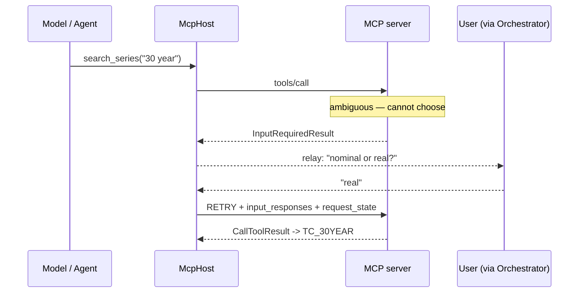
```mermaid
sequenceDiagram
    participant M as Model / Agent
    participant H as McpHost
    participant S as MCP server
    participant U as User (via Orchestrator)
    M->>H: search_series("30 year")
    H->>S: tools/call
    Note over S: ambiguous — cannot choose
    S-->>H: InputRequiredResult
    H-->>U: relay: "nominal or real?"
    U-->>H: "real"
    H->>S: RETRY + input_responses + request_state
    S-->>H: CallToolResult -> TC_30YEAR
```

---

# 23. FastAPI / backend API architecture

`backend/src/backend/api/service.py`. `load_dotenv()` runs at import time, before `app =
FastAPI(...)` is constructed. `get_network()` (the `AgentNetwork`) is built **lazily**, on first
request, "so the service can start and report health before Qdrant or the MCP children are
reachable."

| Method | Endpoint | Purpose | Request | Response | Caller |
|---|---|---|---|---|---|
| `GET` | `/health` | Runtime status of every subsystem | — | `status, llm_backend, models, api_key_configured, data_backend, langsmith, redis, a2a` | UI header pills, `useHealth` poll |
| `POST` | `/summarise` | Generate a short chat title | `{messages: [...]}` | `{title: str}` | UI (cosmetic; failures return `null`, never surfaced as an error) |
| `POST` | `/chat` | The single reasoning entry point | `{query: str, session_id?: str}` | `ChatResponse` (below) | UI, evaluation harness |
| `GET` | `/a2a/<agent>/.well-known/agent-card.json` | Discovery | — | Agent Card JSON | Any A2A-aware client |
| `POST` | `/a2a/<agent>/` | A2A JSON-RPC | A2A `Message` | A2A `Task` | Agent-to-agent traffic only (caller allow-lists reject the user boundary on 2 of 3 agents) |

**`ChatResponse` — every field:** `answer, sources, trace, awaiting_clarification, elicitation,
route, tables, data_plan, negotiation, catalogue, calculation, langsmith_url,
langsmith_trace_id, langsmith_project, handoffs`. `elicitation` is
`{question: str, options: [{label, value}]}` when present.

**Startup lifecycle:** module import → `load_dotenv()` → FastAPI app construction → CORS
middleware registered → A2A agents mounted at `/a2a/<agent>` via a `LazyAgentApp` that resolves
on first request → routes registered. `get_network()` is not called until the first `/chat`,
`/summarise`, or `/health` request touches it.

**CORS**: `CORS_ALLOWED_ORIGINS` env var, comma-separated, default
`http://localhost:5173,http://127.0.0.1:5173`; `allow_credentials=True`, all methods/headers
allowed. A frontend origin missing from this list is silently blocked by the browser even though
the request reaches the service — the single most common "it works in curl but not the UI"
failure mode (see [§48](#48-troubleshooting)).

**Session memory — owned entirely by this service, not the agents** (`_sessions`, in-memory,
module-level dict): the last **12 turns**, a `clarified` flag set from `outcome.route ==
"clarify"`, and a `waiting` field holding any specialist A2A task id left in `input-required` —
the correlation a resumed task needs. `clarified` is what feeds `already_clarified` into the
Orchestrator's next `classify()` call (see [§6](#6-the-orchestrator)).

**Exception handling.** `/chat` wraps the whole `network.handle()` call: any exception becomes
`HTTPException(502, f"agent error: {exc}")`. A separate, independently-wrapped analytics
completion call (`network.intelligence.complete_run(...)`) is allowed to fail silently —
"analytics never changes the response."

**Timeout/streaming.** There is no streaming response — `/chat` is a single JSON response after
the full turn completes. No per-request timeout is set by FastAPI itself; the bound comes from
`A2A_TURN_TIMEOUT_SECONDS` inside the agent call (see [§37](#37-timeout--long-running-request-architecture)).

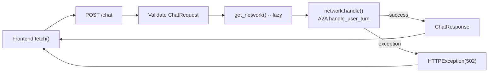
```mermaid
flowchart LR
    F["Frontend fetch()"] --> R["POST /chat"]
    R --> V["Validate ChatRequest"]
    V --> N["get_network() -- lazy"]
    N --> H["network.handle()\nA2A handle_user_turn"]
    H -->|success| RESP["ChatResponse"]
    H -->|exception| ERR["HTTPException(502)"]
    RESP --> F
    ERR --> F
```

---

# 24. Frontend architecture

`frontend/` — `smcp-gateway-ui`, React **18.3.1**, Vite **5.4.21**, TypeScript **5.9.3**,
Tailwind **3.4.19**. State: **Zustand 5.0.15** (two stores; no Redux, no Context-based store).
`@xyflow/react` **12.3.5** (React Flow) for the execution graph. `react-markdown` + `remark-gfm`
for answer rendering. `lucide-react` for icons. **No UI component library** — hand-built Tailwind
throughout. **No charting library** — `CurveChart.tsx` is a dependency-free hand-rolled SVG line
chart. **No dedicated speech-to-text package** — `ChatInput.tsx` uses the native browser
**Web Speech API** directly, feature-detected, with hand-declared types (not in TS's default DOM
lib).

**Structure** (`frontend/src/`):

| Area | Files | Role |
|---|---|---|
| `api/` | `client.ts`, `health.ts`, `mockFixtures.ts` | `RestAgentClient`/`MockAgentClient`, `askAgent()`, `/health` polling, canned mock answers |
| `store/` | `chatStore.ts`, `themeStore.ts` | Chats keyed by session id, active chat, open artifact; light/dark theme (localStorage) |
| `hooks/` | `useSend.ts`, `useHealth.ts` | Send/regenerate/auto-title orchestration; 30s health poll (skipped in mock mode) |
| `lib/` | 6 pure modules, each unit-tested | Classification badges, elicitation dedupe, trace formatting, execution-graph derivation, market-snapshot extraction, artifact summaries |
| `components/` | ~20 components | See below |
| `types/chat.ts` | — | Mirrors the backend `ChatResponse` exactly |

**Key components**: `Header` (Mock/API/LangSmith status pills), `Sidebar` (chat list),
`ChatWindow` + `ChatInput` + `MessageBubble` (the conversation), `ArtifactCard` +
`ArtifactPanel` (Table / Data plan / Discussion / Source tabs), `RightRail` — a **4-tab
observability panel** (Reasoning / **Graph** / **Trace** / Data): `ReasoningRail` (the pipeline
steps), `GraphView` (an interactive React Flow diagram of which agents/services actually ran,
built purely from the handoff ledger + trace), `TraceView` (the A2A handoff timeline + LangSmith
link), `ElicitationPrompt` (clickable clarification options), `CurveChart` /
`MarketSnapshotStrip` (2Y/10Y/30Y strip and hand-rolled curve chart), `StatusBar`, `EmptyState`,
`RegenerateButton`, `Badge`, `ThemeToggle`.

**API client → `/chat` lifecycle:** `RestAgentClient.ask()` posts `{query, session_id}` with an
`AbortController` timed at `VITE_AGENT_TIMEOUT_SECONDS` (default **960**); the only hard-required
response field is `answer`, everything else defaults via `??`. `awaitingClarification` is
derived as `payload.elicitation != null` — the elicitation payload's presence *is* the signal,
not a separately trusted boolean. **Mock mode** (`VITE_AGENT_BACKEND` unset or not `"rest"`)
waits 400ms and returns a fixture shaped exactly like a real `ChatResponse`, including a special
"30 year" elicitation path — used throughout the frontend test suite and whenever the backend
isn't running.

**Session/state handling:** a chat's own id *is* the `session_id` sent to `/chat`. Clicking a
clarification option calls `send(value)` on the **same** chat, resuming the same backend session.
`RightRail`/`ArtifactPanel` render `trace`, `langsmith_url`/`langsmith_trace_id`/`langsmith_project`,
and the `handoffs` ledger — all actively used. `catalogue` and `calculation` are received and
typed but currently **not rendered anywhere** in the UI (typed, unused).

**Error/timeout handling:** on abort or non-2xx, `client.ts` throws a typed `AgentClientError`,
caught in `useSend.ts` and shown as a dismissible red banner. **There is no automatic retry** —
Send/Regenerate must be clicked again. `/summarise` failures are swallowed to `null` since a
title is cosmetic.

**Dev server**: port **5173** (`vite.config.ts`). **Build**: `npm run build` (`tsc -b && vite
build`) — type-checking is folded into the build, there is no separate `lint` script. **Tests**:
**Vitest** (`npm test` → `vitest run`), `jsdom` environment, React Testing Library — 12 test
files (`App.test.tsx`, `api/client.test.ts`, `components/{Header,StatusBar,TraceView}.test.*`,
`config.test.ts`, `lib/{artifact,classification,elicitation,executionGraph,marketSnapshot,trace}.test.ts`).

**Legacy Streamlit — confirmed gone, not dead code.** `git log --all --oneline -- '*streamlit*'`
shows it added at `4672f58` ("Add Streamlit chatbot UI (v1)") and fully removed at `0d3a74d`
("refactor: remove Streamlit frontend"). Only three prose references remain in the current tree
(`frontend/CLAUDE.md`, `frontend/README.md`, one MCP host docstring), each describing it in the
past tense. No Streamlit file, import, or dependency exists in the working tree today.

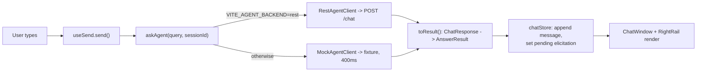
```mermaid
flowchart LR
    T["User types"] --> S["useSend.send()"]
    S --> C["askAgent(query, sessionId)"]
    C -->|VITE_AGENT_BACKEND=rest| REST["RestAgentClient -> POST /chat"]
    C -->|otherwise| MOCK["MockAgentClient -> fixture, 400ms"]
    REST --> P["toResult(): ChatResponse -> AnswerResult"]
    MOCK --> P
    P --> ST["chatStore: append message,\nset pending elicitation"]
    ST --> UI["ChatWindow + RightRail render"]
```

---

# 25. LLM architecture

| Component | Provider | Model (`zai` default / `anthropic`) | Structured output? | Tool calling? |
|---|---|---|---|---|
| Orchestrator | configurable via `LLM_BACKEND` | `glm-5.2` / **`claude-haiku-4-5`** | Yes — `CLASSIFY_SCHEMA`, `REFLECT_SCHEMA` | No |
| Domain Expert | same | `glm-5.2` / `claude-opus-5` | Yes — the `Requirement` schema (25/32 optional properties) | No |
| MCP Agent | same | `glm-5.2` / `claude-opus-5` | Yes — assessment schema | No (dispatches to `RiskWorkflows` directly, not via model tool-calling) |
| Sampling call site | same | `glm-5.2` / `claude-opus-5` | No — free text (caveat briefing) | No |
| Host agent (`--ask` CLI) | same | `glm-5.2` / `claude-opus-5` | Partial | **Yes** — the only call site that does model-driven tool calling, over MCP |

**Important correction:** the Anthropic backend does **not** run `claude-opus-5` uniformly — only
the Orchestrator uses the cheaper `claude-haiku-4-5`; Domain Expert, MCP Agent, Sampling, and
Host Agent all use `claude-opus-5`. This is a deliberate cost/latency split between a cheap
routing model and an expensive reasoning model, present in both backends' allocations.

**No agent ever names a model.** Each declares a `CallSite` (`llm/src/llm/contracts.py`);
`llm/src/llm/config.py` resolves the literal string from `LLM_BACKEND` plus an optional per-site
override env var (`ORCHESTRATOR_MODEL`, `DOMAIN_EXPERT_MODEL`, `MCP_AGENT_MODEL`,
`SAMPLING_MODEL`, `HOST_AGENT_MODEL`). A repo test (`tests/test_model_provider.py`) asserts a
rejected model string never reappears in the resolved config.

---

# 26. LLM evaluation and model selection

**Two providers exist in this codebase, and only two**, confirmed by exhaustive `git log --all
-p` and working-tree search: **Z.AI (GLM)** and **Anthropic (Claude)**. Kimi/Moonshot AI has
**zero footprint** anywhere in the repository — no code, no `.env.example` line, no doc, no
commit, ever (two independent full-history searches for `kimi` and `moonshot` returned nothing).
It is covered in [§27](#27-glm-52-vs-anthropic-vs-kimi) only because a complete comparison was
requested, and is marked **Not currently present** throughout.

**Model history, from `git log --oneline --all -- llm/`** (5 commits ever touched this
distribution):

| Commit | What it did |
|---|---|
| `72dbc3b` | Introduced the `ModelProvider` seam. Both `glm-4.5-air` and `glm-5.2` appear — the former only in comments, as a measured-and-rejected alternative |
| `fdd8792` | Switched the default backend to `zai`; Anthropic became the explicit fallback |
| `c406ca6` | A2A protocol landed; both agents now negotiate over real A2A calls |
| `8fc27e9` | Perf: removed duplicated model work across the negotiation loop |
| `58323d3` | Redis-backed shared intelligence added |

A full-history search for every GLM string ever committed anywhere in the repo returns exactly
two: `glm-4.5-air` (rejected) and `glm-5.2` (shipped). No `glm-4.6` or any other GLM generation
was ever committed. `glm-5.2` is the live default at every call site today.

**Anthropic models, current code:** `claude-haiku-4-5` (Orchestrator only) and `claude-opus-5`
(everywhere else). No other Claude variant appears anywhere in `llm/`, `agents/`, or `docs/`.

**Evaluation.** `docs/model-provider.md` states the Anthropic path scores **72/73** on the
project's own 13-case × 11-scorer evaluation suite (the same suite [§43](#43-testing-architecture)
describes), against **73/73** for the GLM/zai default — the fallback path is measured and
maintained, not decorative.

---

# 27. GLM-5.2 vs Anthropic vs Kimi

Pricing verified 2026-08-25 against official/aggregated pricing pages (search results, dated
this session — see Sources below); this is **official list pricing**, not this project's
observed spend, which is not separately metered in this repository.

| Dimension | GLM-5.2 (Z.AI) | Claude Opus 5 (Anthropic) | Claude Haiku 4.5 (Anthropic) | Kimi (Moonshot AI) |
|---|---|---|---|---|
| Provider | Z.AI | Anthropic | Anthropic | Moonshot AI |
| Used in this project? | **Yes — default (`LLM_BACKEND=zai`)** | **Yes — `LLM_BACKEND=anthropic`, all call sites but Orchestrator** | **Yes — `LLM_BACKEND=anthropic`, Orchestrator only** | **No — not present anywhere in this codebase** |
| Model type | Open-weights, hosted API | Proprietary, hosted API | Proprietary, hosted API | Not evaluated here |
| Input price (official) | **$1.40 / M tokens** | **$5.00 / M tokens** | **$1.00 / M tokens** | Not verified from the current repository |
| Output price (official) | **$4.40 / M tokens** | **$25.00 / M tokens** | **$5.00 / M tokens** | Not verified from the current repository |
| Cached-input price | $0.26 / M (≈0.19× base) | 0.1× base on a cache hit | Not separately verified here | Not verified from the current repository |
| Structured output | Forced function call (`response_format` renames fields — see [§30](#30-provider-specific-behavior-glm-vs-anthropic)) | Native `output_config.format.json_schema` | Same as Opus | Not applicable — not integrated |
| Tool calling | Yes, via forced tool call workaround | Yes, native | Not used at this call site in this project | Not applicable |
| Measured routing accuracy (this project's suite) | glm-5.2: **8/8**; glm-4.5-air: 2/8 (rejected) | 72/73 on the full 13×11 evaluation suite | (routes as part of the Anthropic path above) | Not applicable |
| Project role | **Default at every call site** | Fully maintained fallback, one env var away | Cheap routing model under the Anthropic backend | None |

Kimi is included here only because it was named in the request; it is **not evaluated, not
integrated, and not referenced anywhere** in this repository's code, configuration, docs, or git
history. Any comparison beyond "it was never considered here" would be fabrication and is
deliberately omitted.

**Sources** (pricing, verified 2026-08-25):
- [GLM 5.2 API Pricing & Benchmarks — OpenRouter](https://openrouter.ai/z-ai/glm-5.2)
- [Z.ai GLM API Pricing: Full Breakdown of Costs (Aug 2026)](https://developer.puter.com/tutorials/zai-glm-api-pricing/)
- [Claude Opus 5 pricing in 2026 — eesel AI](https://www.eesel.ai/blog/claude-opus-5-pricing)
- [Pricing — Claude Platform Docs](https://platform.claude.com/docs/en/about-claude/pricing)
- [Claude Haiku 4.5 — Anthropic](https://www.anthropic.com/claude/haiku)

---

# 28. Why GLM-5.2 was selected

The project deliberately explored a strong reasoning model outside the Anthropic-only path. The
factors recorded in `docs/model-provider.md` and in `llm/src/llm/config.py`'s own comments:

- **Reasoning/schema quality, measured, not assumed.** On the Orchestrator's routing schema,
  `glm-5.2` scored **8/8**; the earlier `glm-4.5-air` scored **2/8** — see
  [§29](#29-the-rejected-glm-45-air-experiment) for the specific failure modes.
- **Token economics.** At official list pricing, GLM-5.2 is roughly **3.6× cheaper on input** and
  **~5.7× cheaper on output** than Claude Opus 5 (§27's verified numbers) — a material difference
  at the Domain Expert's call site, which runs with a 12,000-token floor per call and is the
  single most token-hungry site in the system.
- **Agentic suitability, once the provider-specific defects were engineered around.** GLM-5.2
  required real normalization work (§30) that Opus does not — chat-template sentinel leakage,
  string `"null"` instead of JSON `null`, a forced-function-call workaround for a schema
  endpoint that silently renames fields. Those defects are measured and fixed in code, not
  theoretical.
- **Anthropic remains fully maintained, one variable away.** `docs/model-provider.md`: "Anthropic
  remains one variable away and is not decorative: it scores 72/73 on the same evaluation suite
  that GLM scores 73/73 on." Setting `LLM_BACKEND=anthropic` changes nothing else — no agent
  code, no schema, no prompt.

This project's own commit history does **not** contain a documented "Kimi was 3× more expensive"
comparison anywhere — no Kimi evaluation exists in this repo to compare against. If that
comparison exists, it was made outside this codebase and is not something this README can verify
or reproduce; §27's official pricing table is offered instead.

---

# 29. The rejected GLM-4.5-Air experiment

`glm-4.5-air` is the one earlier GLM model that appears anywhere in this repository's history —
introduced in the same commit that built the `ModelProvider` seam (`72dbc3b`), and never once a
shipped default. It appears only in comments and tests describing why it was rejected:

| Measured symptom | Evidence in code |
|---|---|
| Routing-schema compliance: **2/8** vs `glm-5.2`'s 8/8 | `llm/src/llm/config.py:55-60` comment |
| Could not serialize `requested_rows: integer \| null` reliably | Same comment block — observed outputs included `0.0`, `10000.0`, `1.25e-08`, and once a 1,000-digit integer for an integer-or-null field |
| Leaked chat-template sentinels into tool-call output (`<tool_call>`, `</tool_call>`) | `llm/src/llm/zai_provider.py:46` comment; `sanitise_arguments()` exists specifically to truncate these |
| Excluded by a repo test from ever being a resolved model | `tests/test_model_provider.py:132,145,450` — `assert "glm-4.5-air" not in set(config.models.values())` |

These are **schema-compliance and output-format defects**, not a subjective "it was worse" — each
is a concrete, reproducible failure mode against the same routing schema `glm-5.2` now passes
cleanly. `glm-5.2` replaced it once the newer model closed these gaps; the provider-level
workarounds engineered for GLM generally (§30) remain in place because some of the same defect
classes (string-null, sentinel leakage) still occur, at a much lower rate, on `glm-5.2`.

---

# 30. Provider-specific behavior: GLM vs Anthropic

The `ModelProvider` seam (`llm/`) exists specifically because these two backends do not behave
identically at the wire level, and the differences are real, measured, and fixed in code — not
theoretical.

| Concern | Anthropic behavior | GLM (Z.AI) behavior | Project adaptation |
|---|---|---|---|
| Structured output mechanism | Native `output_config: {"format": {"type": "json_schema", "schema": ...}}` | `response_format={"type":"json_schema","strict":true}` returns **HTTP 200** but silently **renames fields** (e.g. `rows` → `rows_required`) | `ZaiProvider` sends the schema as a **forced tool call** instead: `tools=[{...}], tool_choice={"type":"function","function":{"name": result_name}}` |
| Null values | JSON `null` handled natively | The literal **string** `"null"`/`"none"`/`"nil"` observed in place of real `null`, even where the schema permits null | Two complementary fixes: `validation.py:normalise_nullables()` (schema-scoped) and `zai_provider.py:_unstring_nulls()` (unconditional, applied right after `json.loads()`) |
| Integer vs float | Native distinction preserved | `10000.0` returned for a field typed `integer` | `validation.py` redefines the JSON Schema type checker (`_is_strict_integer`/`_is_strict_number`) so a Python `float` is rejected as an `integer` even when numerically whole |
| Tool-call format | Clean `tool_calls` entries | Observed writing the call as raw **chat-template text** (`<arg_key>...</arg_key><arg_value>...</arg_value>` pairs) instead of an actual `tool_calls` entry | `_recover_templated_call()` regex-recovers the arguments from the leaked template text |
| Truncation/leakage | Not observed | Chat-template sentinels (`</tool_call>`, `<tool_call>`, `</function_call>`, `<|`) leaking into otherwise-valid JSON | `sanitise_arguments()` truncates at the first sentinel, then `_close_unbalanced()` repairs unbalanced brackets, string-literal-aware |
| Reasoning/thinking | `adaptive` thinking, `effort: low` at cheap call sites (Orchestrator, Sampling), `effort: high` elsewhere; Haiku models get no thinking block at all | GLM expands its reasoning to fill whatever token ceiling it is given | On a `budget_exhausted` provider error, one retry is made with `thinking` explicitly disabled (`extra_body: {"thinking":{"type":"disabled"}}`) |
| Refusal signaling | Typed: `stop_reason == "refusal"` raises `ProviderError(kind="refusal")` | No typed refusal channel — only fires via `finish_reason == "content_filter"` | `_stop_reason()` normalizes both onto one neutral vocabulary the rest of the seam consumes |
| Retry on a schema violation | Same mechanism both backends | Same mechanism both backends | `_corrective_retry()`: quotes the model's own broken output verbatim (≤4,000 chars) back to it and asks for a **repair**, never a re-derivation from scratch |
| Schema size limits | Caps around 16 union-typed / 24 optional properties per schema | No such cap observed | The `Requirement` schema has 25 required + 32 optional properties (`domain_expert_agent.py`) — a documented `xfail` records that this specific schema cannot run cleanly under `LLM_BACKEND=anthropic`'s stricter limit; it runs under the default `zai` backend without modification |

**Why this matters for the README's honesty rule.** Every one of the above rows traces to a
specific, named function with a code comment describing the *measured* defect that motivated it
— `llm/src/llm/zai_provider.py` and `llm/src/llm/validation.py` are effectively a changelog of
GLM's structured-output quirks, encountered and fixed one at a time rather than designed in
advance.

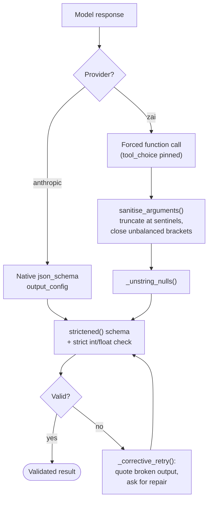
```mermaid
flowchart TD
    R["Model response"] --> P{"Provider?"}
    P -->|anthropic| A1["Native json_schema\noutput_config"]
    P -->|zai| Z1["Forced function call\n(tool_choice pinned)"]
    A1 --> V["strictened() schema\n+ strict int/float check"]
    Z1 --> S["sanitise_arguments()\ntruncate at sentinels,\nclose unbalanced brackets"]
    S --> U["_unstring_nulls()"]
    U --> V
    V --> OK{Valid?}
    OK -->|yes| DONE(["Validated result"])
    OK -->|no| RETRY["_corrective_retry():\nquote broken output,\nask for repair"]
    RETRY --> V
```

---

# 31. Structured output & validation architecture

Every model response that must be structured is **validated, never trusted** — a schema match is
a necessary condition, not a sufficient one.

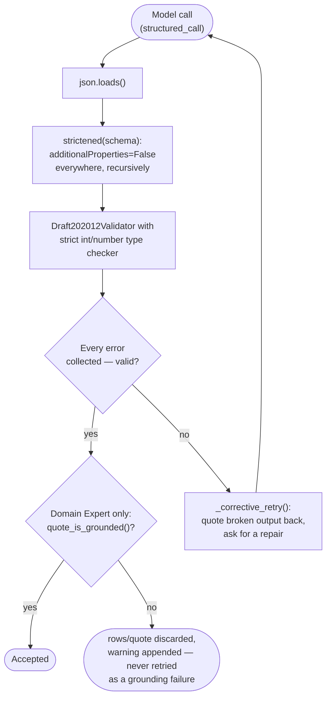
```mermaid
flowchart TD
    CALL(["Model call\n(structured_call)"]) --> PARSE["json.loads()"]
    PARSE --> STRICT["strictened(schema):\nadditionalProperties=False\neverywhere, recursively"]
    STRICT --> TYPECHK["Draft202012Validator with\nstrict int/number type checker"]
    TYPECHK --> VALID{"Every error\ncollected — valid?"}
    VALID -->|yes| GROUND{"Domain Expert only:\nquote_is_grounded()?"}
    VALID -->|no| RETRY["_corrective_retry():\nquote broken output back,\nask for a repair"]
    RETRY --> CALL
    GROUND -->|yes| ACCEPT(["Accepted"])
    GROUND -->|no| DISCARD(["rows/quote discarded,\nwarning appended — never retried\nas a grounding failure"])
```

- `strictened()` recursively forces `additionalProperties: False` on every object in a schema —
  no silent extra field.
- The type checker is intentionally **stricter than JSON Schema's own default**: a `10000.0` is
  rejected where `integer` was declared, even though standard JSON Schema treats a whole float as
  a valid integer — this is the specific defense against GLM's observed float-for-integer defect.
- `SchemaViolation` collects **every** error in one pass (capped at 8 shown), not just the first,
  so a corrective retry can address multiple problems in one round trip.
- **Retries are bounded and purposeful**: `LLM_MAX_RETRIES` (default 2) covers only *transient
  transport* failures (timeouts, connection errors) — never a schema violation, which always goes
  through the quote-and-repair path instead of a blind re-ask.
- Grounding (`quote_is_grounded`, [§7](#7-the-domain-expert)) is a **separate, later** check —
  a structurally perfect result can still be factually ungrounded, and is rejected independently
  of schema validity.

---

# 32. What can I ask SMCP Gateway?

Every question below maps to a real, currently reachable capability — derived from the tool
catalog ([§19](#19-complete-mcp-tool-catalog)) and the project's own 13-case evaluation set
([§43](#43-testing-architecture)), not invented to look impressive.

**Yield curve**
- "Show me the latest Treasury yield curve."
- "What is today's par yield curve?"
- "Compare the 2-year and 10-year Treasury yields."
- "Is the curve inverted right now?"
- "What is the 2s10s slope today?"

**Historical rates**
- "Give me the 10-year Treasury rate history for the last 90 days."
- "How has the 10-year moved this year?"
- "How far back does the 10-year series go?"
- "Where did that 4.70% number come from?" (provenance — `explain_number`)

**Series discovery and metadata**
- "What Treasury datasets do you have?"
- "What tenors are available?"
- "Find me the thirty-year series." (triggers elicitation — nominal vs. real)
- "What are the caveats on the par yield curve dataset?"

**Risk analytics — the demo book**
- "What is the demo book worth?"
- "What is the 10-year's yield, duration, and convexity?"
- "Calculate DV01 for the demo portfolio."
- "Break the DV01 down by tenor."
- "Calculate 99% 10-day historical VaR on the book."
- "Compare historical, parametric, and Monte Carlo VaR."
- "Backtest last year's VaR."
- "What is the FRTB GIRR charge on the book?"

**Stress and scenario analysis**
- "What stress scenarios exist?"
- "Run a severe bear steepener."
- "Show me the P&L ladder from -300 to +300 basis points."
- "Run the standard stress pack and tell me the three worst scenarios."
- "Run the March 2020 COVID shock."
- "What rate move would cost us $2 million?" (reverse stress)
- "At what shock do we breach the risk limit?"

**Portfolio impact**
- "What happens to my risk if I add $10 million of 10-year notes?"
- "What is the current risk-limit utilization?"

**Clarification examples — where the system must ask, not guess**
- "I want to run a stress test" → asks **one** question, with the real 7 scenarios as clickable options (not invented labels).
- "Calculate VaR" → asks for confidence level / horizon, using the actual accepted parameter ranges.
- "Find me the thirty year series" → elicits nominal vs. real, because both exist and are not interchangeable.

**Complex multi-step questions** (Domain Expert → negotiation → MCP Agent → multiple tool calls → synthesis)
- "Give me 10,000 rows of Treasury yield data with observation_date, rate_percent, quote_basis, cusip, issuer_name and settlement_date. I need it to compute 10-day 99% historical VaR." — the full worked example in [§33](#33-example-conversation).
- "Compare the risk of the demo book under three different VaR methodologies and tell me which is most conservative."

**Explicitly out of scope, answered honestly rather than fabricated**
- "Compute CVA on our counterparty exposures." → explained from knowledge, never computed — no counterparty data exists in this system.
- "What is our RWA?" → same: Explain-only, and the answer says so.

---

# 33. Example conversation

**User:**
> "Give me 10,000 rows of Treasury yield data with observation_date, rate_percent, quote_basis,
> cusip, issuer_name and settlement_date. I need it to compute 10-day 99% historical VaR on the
> book."

**Phase 1 — Intake.** `/chat` receives the query with a fresh `session_id`.

**Phase 2 — Orchestration.** `classify()` returns `route="data_request"` — a data question, not
a greeting or a concept question. One structured call, cheap model.

**Phase 3 — Domain interpretation.** The Domain Expert retrieves from Qdrant with two queries
("10-day 99% historical VaR" and the observation-window query) and finds
`knowledge/market_risk/var.md`'s stated window: *"Historical simulation reads a fixed lookback
window of **250 trading days** of daily observations."* `quote_is_grounded()` confirms the quote
appears verbatim in the retrieved chunk.

**Phase 4 — Data requirements.** The Domain Expert proposes a `Requirement`: `rows=250`,
`row_quote` set to the sentence above, `fields` limited to what a par curve can hold
(`observation_date, rate_percent, quote_basis, tenor`), and marks `cusip`, `issuer_name`,
`settlement_date` as candidates the negotiation should test.

**Phase 5 — MCP tool calls / negotiation.** Over A2A, the MCP Agent's `assess()` computes the
mechanical fact: a par yield curve has no instrument-level records, so `cusip`/`issuer_name`/
`settlement_date` are `unsupported_fields`. Round 1 converges — the Domain Expert accepts the
correction rather than insisting.

**Phase 6 — Database retrieval.** The MCP Agent calls `get_curve_history_matrix` (250 trading
days × the curve's tenors); the data server queries `analytics.v_mcp_curve` as `mcp_reader`.

**Phase 7 — Calculation.** The MCP Agent calls `compute_historical_risk_tool` against the demo
book, on the 250-day matrix just retrieved, at 99% confidence / 10-day horizon.

**Phase 8 — Validation.** The Domain Expert's `validate_result()` checks the returned result
against the agreed contract (rows delivered vs. rows agreed, calculation matches what was
negotiated) before the Orchestrator treats it as final.

**Phase 9 — Final synthesis.** The Orchestrator's `reflect()` writes a short reply: the VaR
figure, the 250-row/window citation, and an explicit note that CUSIP/issuer/settlement date are
not available on a par yield curve.

**Phase 10 — Observability.** If LangSmith is enabled, the whole turn is one trace rooted at
`agent_pipeline`, with every phase above as a nested span — see [§36](#36-langsmith-architecture).

No hidden reasoning is exposed above — every phase corresponds to a structured, inspectable
artifact (`Requirement`, `Negotiation`, `AgentOutcome`) that the UI's Data-plan and Discussion
tabs render directly, not a paraphrase of an internal chain of thought.

---

# 34. Demo script

Ten minutes, in this order:

| # | Do this | Point at |
|---|---|---|
| 1 | Type **"hi"** | Instant. Trace shows one Orchestrator call — no Qdrant, no reasoning model. |
| 2 | Type **"i want to run a stress test"** | It asks one question, with the real 7 scenarios as options. |
| 3 | Click **"1994 bond massacre"** | It proceeds. It does not ask again — `already_clarified` guarantee. |
| 4 | Type the 10,000-row VaR question ([§33](#33-example-conversation)) | It returns **250** rows, quoting `var.md`, and refuses `cusip`/`issuer_name`/`settlement_date`. |
| 5 | Open the artifact card → **Data plan** | The verbatim quote, and each field marked required / not needed / unavailable. |
| 6 | Open → **Discussion** | The two agents arguing, over real A2A calls. |
| 7 | Edit `knowledge/market_risk/var.md`, change 250→500, re-ingest, re-ask | A different answer, no code change — proof there is no hardcoding. |
| 8 | Run `python -m mcp_servers.host --primitives` | All six MCP primitives, protocol 2026-07-28. |
| 9 | Run `python -m mcp_servers.host --isolation` | The risk engine cannot reach the database. |
| 10 | Open LangSmith (if configured) | The full run tree, token counts per agent, one trace per turn. |

---

# 35. Observability architecture

Beyond LangSmith ([§36](#36-langsmith-architecture)), the system logs structurally rather than
through free text: A2A handoffs log `turn=<id>` correlations (`A2A_LOG_LEVEL=INFO`), each MCP
tool call's arguments and result shape are visible in the trace (never raw payloads), and the
`/chat` response's `trace` array is a typed sequence of steps (`intent`, `knowledge`, `decision`,
`tool_call`, `answer`, `clarification`) the UI's Reasoning tab renders directly — the same
structure LangSmith spans mirror.

What is *not* logged: request/response bodies to a general-purpose log, API keys or connection
strings (redacted at the source — `/health` reports `api_key_configured: bool`, never the key),
or full retrieved-chunk text outside the trace's own bounded metadata.

---

# 36. LangSmith architecture

**Status: fully wired, verified in code, fail-open, and optional.** Live ingestion against a
keyed LangSmith account was not observed in this environment (no credentials available here) —
flagged as a known gap in [§47](#47-known-limitations), not a claim of production verification.

**What is traced** — one root span per user turn, spanning every A2A hop:

```
agent_pipeline                          (chain)     <- one root per user turn
├── orchestrator.classify               (llm)
├── domain_expert.derive                (llm)        <- reached over A2A, still nested
│   └── knowledge_retrieval             (retriever)
│       ├── qdrant.search               (retriever)  <- query 1
│       └── qdrant.search               (retriever)  <- query 2
├── mcp_agent.assess                    (llm)        <- the negotiation, over A2A
├── domain_expert.revise                (llm)
├── mcp_agent.execute                   (tool)
│   └── mcp.call:get_curve_history_matrix (tool)     <- MCP server call
│       └── postgres.query              (tool)       <- DB read (mcp_reader)
├── domain_expert.validate_result       (llm)
└── orchestrator.reflect                (llm)
```

The exact shape follows the actual execution — a greeting is just `orchestrator.classify`. Trace
continuation across A2A hops works via `agents/observability.py:current_trace_headers()` /
`continue_trace()`, carried in A2A message metadata under the key `langsmith_trace`, so what
would otherwise fragment into separate root traces per agent stays one tree.

**Enabling it:**

```bash
LANGSMITH_TRACING=true
LANGSMITH_API_KEY=lsv2_pt_...
LANGSMITH_PROJECT=semantic-mcp-data-access-gateway   # optional; this is the default
# LANGSMITH_ENDPOINT=https://eu.api.smith.langchain.com   # optional, EU/self-hosted
# LANGSMITH_WORKSPACE_ID=...                                # optional
```

`LANGCHAIN_TRACING_V2`/`LANGCHAIN_API_KEY`/`LANGCHAIN_PROJECT`/`LANGCHAIN_ENDPOINT` are accepted
as legacy aliases. **Both** the flag and a key must be present — either alone leaves tracing off.

**Fail-open by design.** With no key, no `langsmith` package, a wrong endpoint, or an unreachable
service, every `@traced` call simply runs the function — no warning per call, no failed request.
A LangSmith outage cannot take the gateway down. **The API key never reaches the browser** — there
is deliberately no `VITE_LANGSMITH_*` variable; the frontend learns status only from `/health`.

**Checking status:**

```bash
curl -s localhost:8000/health | jq .langsmith
```

returns `enabled`, `project`, `api_key_configured`, `workspace_configured`, `endpoint`, and a
`reason` string naming exactly what's missing if it's off. The React header shows the same as a
pill; the right-rail **Trace** tab's **Open full trace** button opens the exact turn in
LangSmith, or shows a plain "not traced" note when tracing is off.

**Running the evaluation against LangSmith:** `python -m evaluation.run --langsmith` uploads the
dataset and records a scored experiment; without the flag, it prints a local table only.

---

# 37. Timeout / long-running request architecture

| Bound | Default | Env var | Scope |
|---|---:|---|---|
| Turn timeout | 900s | `A2A_TURN_TIMEOUT_SECONDS` | The whole user turn; every nested call gets whatever remains |
| Call timeout | 300s | `A2A_CALL_TIMEOUT_SECONDS` | Floor under the turn budget |
| Browser fetch abort | **960s** | `VITE_AGENT_TIMEOUT_SECONDS` | Deliberately `900 + 60`, so the backend's own bound plus the A2A bridge's grace period always wins over the browser giving up first |
| Model call wall clock | 300s | `LLM_TIMEOUT_SECONDS` | A single model request |
| Model transport retries | 2 | `LLM_MAX_RETRIES` | Transient transport failures only — never a schema violation |
| A2A bridge's own wait | `turn_timeout + 60s` | (implicit) | Must outlast the deadline it is waiting on |
| Domain Expert's wait on MCP Agent | `remaining + 30s` | (implicit) | Bounded by what's left of the turn |

**No MCP-server-specific or per-tool-call timeout exists** — the only bounds on MCP tool
execution are the A2A turn/call timeouts above and the model-layer timeout on the *reasoning*
that decides what to fetch, not on the tool call itself.

**Why analytical workflows take longer than chat.** A measured turn runs **110–370 seconds** —
retrieval, a bounded negotiation (up to 5 real model+A2A round trips), a tool call, and a
calculation, versus a single model call for a greeting. This is why the frontend timeout is set
to outlast the backend's own bound rather than guess a lower number: a client that gives up first
turns an explainable backend error into a blank network failure.

| Category | Typical latency driver |
|---|---|
| Greeting / capability question | One Orchestrator call only |
| Single analytical request, no negotiation friction | Retrieval + 1 negotiation round + 1-2 tool calls |
| Multi-tool / contested requirement | Up to 5 negotiation rounds + multiple tool calls |
| Clarification continuation | A second full turn on the same session, `already_clarified=true` |

No guaranteed performance figures are claimed beyond the measured range above — this is not a
load-tested SLA.

---

# 38. Error handling and recovery

| Failure | Detection layer | Recovery | User effect |
|---|---|---|---|
| Invalid/malformed LLM structured output | `llm/validation.py` (`SchemaViolation`) | `_corrective_retry()` — quotes the broken output back, asks for a repair | Transparent if repaired; otherwise a `ProviderError` propagates |
| GLM schema-endpoint field renaming | `ZaiProvider._forced_call()` | Forced tool call bypasses the buggy `response_format` path entirely | Transparent — never reaches the user |
| MCP tool failure | `mcp_servers/data|risk/errors.py` (`DomainError`) | Structured `is_error=true` JSON, never a bare exception | Orchestrator explains the refusal in plain language |
| PostgreSQL unavailable | `mcp_servers/data/_db.py` connection layer | Server startup fails fast (`assert_constrained_identity`); a live query failure surfaces as `DomainError` | "I don't have that" rather than a stack trace |
| Qdrant unavailable | `QdrantVectorStore.search()` | Returns empty results | `rows=None`, `grounded=False` — the answer says the corpus is silent, not a fabricated default |
| Redis unavailable | `agents/cache/client.py` | Cache miss (or `RedisUnavailable` if `REDIS_REQUIRED=true`) | No observable effect on a correct answer, only on speed |
| Provider timeout | `LLM_TIMEOUT_SECONDS` in `llm/config.py` | `LLM_MAX_RETRIES` transport retries, then `ProviderError` | Surfaces as a `failed` A2A task with a structured, host-free error message |
| A2A chain/re-entry/budget breach | `agents/a2a/guardrails.py` `TurnLedger.authorise()` | `HandoffRefused` naming the specific bound hit | The turn ends, naming the loop rather than hanging |
| Missing clarification answer | `agents/a2a/elicitation.py` | Re-asked up to `A2A_MAX_CLARIFICATIONS` (3), then the tool's own declined path runs | One repeated question, then an honest "proceeding without that" |
| Schema validation failure at the frontend boundary | `frontend/src/api/client.ts` | `AgentClientError` with a specific message | Dismissible red banner; user must retry manually |
| Non-settled A2A task state | `agents/a2a/executors.py` | Treated as a failure, never reported as success | Never presented as a completed answer |

Every failure state surfaces as a **structured** error — an exception string with hosts, ports,
or internal identifiers is never shown to a user; the user-facing sentence is written from the
error *kind*, not the raw message.

---

# 39. Security and guardrails

- **Credentials only via environment variables**, never in source. `.env.example` ships no real
  secrets; `/health` reports `api_key_configured: bool`, never a key value.
- **Database access is role-scoped, not application-scoped.** `mcp_reader` cannot read `treasury`
  or `staging` at all — only `analytics`, `demo`, and one `meta` table — enforced by PostgreSQL
  `GRANT`/`REVOKE`, not by application logic that could be bypassed. See [§13.7](#13-postgresql-architecture).
- **No SQL surface for a model, ever.** No `run_sql` tool exists; a repo test refuses any data
  tool that grows a `where`/`order_by`/`columns` parameter.
- **Session-scoped resource limits**: `mcp_reader` has `CONNECTION LIMIT 5`,
  `statement_timeout='5s'`, `lock_timeout='1s'`, `default_transaction_read_only=on` — a runaway
  MCP query cannot affect the loader or another connection.
- **The risk engine physically cannot reach the database** — its child process environment
  contains no database credential key at all (allow-list construction, not a runtime refusal).
  See [§17](#17-mcp-architecture).
- **Roots containment is checked twice** — before path construction and after resolution, to
  catch a symlink escape, in `export_curve_csv`'s only filesystem-writing path.
- **Structured output is validated, never trusted**, at every model call — see [§31](#31-structured-output--validation-architecture).
- **A2A caller allow-lists are internal caller authorization**, not authentication — a logical
  boundary inside one trusted process from caller-supplied metadata, not OAuth/JWT/mTLS. This
  project does not claim otherwise and does not need to for a local, single-process deployment.
- **CORS** is explicit and origin-listed (`CORS_ALLOWED_ORIGINS`), not wildcarded in a way that
  would accept credentialed requests from anywhere.
- **Prompt-injection surface**: retrieved knowledge chunks are treated as context, never as
  instructions the agent executes; the grounding check constrains what a model may *claim*, not
  what it may be told to do, so this remains a standard LLM-application consideration rather than
  a solved problem — not claimed as fully mitigated here.
- **No enterprise security certification is claimed.** This is a research/demo-grade gateway with
  real database-privilege separation, not an audited production security boundary.

---

# 40. Configuration and environment variables

Full surface from `.env.example` (228 lines), placeholders only — no real secrets appear here or
in the repository.

**PostgreSQL**

| Variable | Required | Default | Purpose |
|---|:---:|---|---|
| `POSTGRES_USER` | yes | `gateway` | DB user for Compose and the loader |
| `POSTGRES_PASSWORD` | yes | `change-me-locally` | DB password — set your own |
| `POSTGRES_DB` | yes | `gateway` | Database name |
| `POSTGRES_PORT` | no | `5432` | Host port (bump if a native Postgres is already on 5432) |
| `DATABASE_URL` | no | built from the above | Preferred when set; must stay in sync |
| `MCP_READER_USER` | yes (for MCP) | `mcp_reader` | The restricted role the data server connects as |
| `MCP_READER_PASSWORD` | yes (for MCP) | `change-me-locally-too` | Set via `mcp_servers.data.bootstrap`, not the migration |
| `MCP_CURSOR_KEY` | no | random per-process | Signs pagination cursors to survive server restarts |

**LLM / reasoning agents**

| Variable | Required | Default | Purpose |
|---|:---:|---|---|
| `LLM_BACKEND` | no | `zai` | `zai` (GLM, default) or `anthropic` |
| `ZAI_API_KEY` | yes if `zai` | — | Z.AI credential |
| `ZAI_BASE_URL` | no | `https://api.z.ai/api/paas/v4` | Z.AI endpoint |
| `ANTHROPIC_API_KEY` | yes if `anthropic` | — | Anthropic credential |
| `ORCHESTRATOR_MODEL` / `DOMAIN_EXPERT_MODEL` / `MCP_AGENT_MODEL` / `SAMPLING_MODEL` / `HOST_AGENT_MODEL` | no | per-backend default (§25) | Per-call-site override |
| `LLM_TIMEOUT_SECONDS` | no | `300` | Wall clock per model call |
| `LLM_MAX_RETRIES` | no | `2` | Transport-only retry bound |

**Qdrant**

| Variable | Required | Default | Purpose |
|---|:---:|---|---|
| `QDRANT_URL` | no | unset (embedded) | Set for the Docker server, e.g. `http://localhost:6333` |
| `QDRANT_PORT` / `QDRANT_GRPC_PORT` | no | `6333` / `6334` | Compose host ports |

**Redis (optional, on by default)**

| Variable | Required | Default | Purpose |
|---|:---:|---|---|
| `REDIS_ENABLED` | no | `true` | Off = `NoOpIntelligence`, always miss |
| `REDIS_REQUIRED` | no | `false` | `true` makes an unreachable Redis a hard failure instead of a miss |
| `REDIS_URL` | no | `redis://localhost:6379/0` | Connection string |
| `REDIS_PORT` / `REDIS_INSIGHT_PORT` | no | `6379` / `5540` | Compose host ports |
| `REDIS_MAXMEMORY` | no | `512mb` | Capacity |
| `REDIS_CACHE_PREFIX` / `REDIS_NAMESPACE_VERSION` | no | `smcp` / `v1` | Key namespacing |
| `REDIS_DOMAIN_RETRIEVAL_TTL` … `REDIS_MCP_CHOICES_TTL` | no | see [§16](#16-redis--caching-architecture) table | Per-operation TTLs |
| `REDIS_SEMANTIC_CACHE_ENABLED` / `_TTL` / `_SIMILARITY_THRESHOLD` / `_CANDIDATES` | no | `true` / `86400` / `0.93` / `8` | Safety-gated semantic reuse for `domain_expert.derive` only |
| `REDIS_LOCK_TTL_MS` / `REDIS_SINGLEFLIGHT_WAIT_SECONDS` | no | `360000` / `310` | Single-flight coordination |
| `REDIS_*_LLM_RATE_LIMIT` | no | `0` (disabled) | Atomic fixed-window rate caps |

**Data backend / backend service**

| Variable | Required | Default | Purpose |
|---|:---:|---|---|
| `DATA_BACKEND` | no | `mcp` | `mcp` \| `postgres` \| `mock` |
| `AGENT_PORT` | no | `8000` | `/chat` service port |
| `CORS_ALLOWED_ORIGINS` | no | `http://localhost:5173,http://127.0.0.1:5173` | Browser origins allowed to call `/chat` |

**A2A**

| Variable | Required | Default | Purpose |
|---|:---:|---|---|
| `A2A_TRANSPORT` | no | `inprocess` | `inprocess` (mounted ASGI) or `http` |
| `A2A_BASE_URL` / `A2A_ORCHESTRATOR_URL` / `A2A_DOMAIN_EXPERT_URL` / `A2A_MCP_URL` | no | — | Per-agent HTTP addresses when `A2A_TRANSPORT=http` |
| `A2A_MAX_CHAIN` / `A2A_MAX_REENTRY` / `A2A_MAX_HANDOFFS` | no | `8` / `3` / `20` | See [§9](#9-a2a-architecture) |
| `A2A_TURN_TIMEOUT_SECONDS` / `A2A_CALL_TIMEOUT_SECONDS` | no | `900` / `300` | See [§37](#37-timeout--long-running-request-architecture) |
| `A2A_MAX_CLARIFICATIONS` | no | `3` | Retries on an unmatched clarification reply |
| `A2A_LOG_LEVEL` | no | `INFO` | Handoff-log verbosity |

**LangSmith**

| Variable | Required | Default | Purpose |
|---|:---:|---|---|
| `LANGSMITH_TRACING` | no | unset (off) | Must be `true`, and a key present, to trace |
| `LANGSMITH_API_KEY` | yes to trace | — | LangSmith credential |
| `LANGSMITH_PROJECT` | no | `semantic-mcp-data-access-gateway` | Project name |
| `LANGSMITH_ENDPOINT` / `LANGSMITH_WORKSPACE_ID` | no | official endpoint / unset | EU/self-hosted, multi-workspace |

**Frontend** (`frontend/.env`, not the root `.env`)

| Variable | Required | Default | Purpose |
|---|:---:|---|---|
| `VITE_AGENT_BACKEND` | **yes, for a real backend** | `mock` | Set to `rest` or the UI silently serves canned mock answers |
| `VITE_AGENT_API_URL` | no | `http://localhost:8000` | Backend base URL |
| `VITE_AGENT_TIMEOUT_SECONDS` | no | `960` | Must stay ≥ the backend's own turn bound |

---

# 41. Local development / installation

```bash
# 1. Prerequisites: Python 3.12+, Node 18+, Docker (for postgres/qdrant/redis)
git clone <repo-url> && cd semantic-mcp-data-access-gateway

# 2. Python environment + all five distributions (they import each other)
pip install -r requirements.txt
pip install -e ./llm -e ./postgres -e ./mcp -e ./backend -e ./agents

# 3. Configuration
cp .env.example .env             # set POSTGRES_PASSWORD, ZAI_API_KEY (or ANTHROPIC_API_KEY)
cp frontend/.env.example frontend/.env   # set VITE_AGENT_BACKEND=rest

# 4. Data layer
docker compose up -d postgres
python -m treasury_db.migrate                     # --status to inspect
python -m treasury_db.load
python tools/verify_load.py --self-test            # expect 74/74

# 5. MCP layer
python -m mcp_servers.data.bootstrap                # once: sets the mcp_reader password
python -m mcp_servers.host --primitives             # exercises all six MCP primitives
python -m mcp_servers.host --isolation              # proves the risk engine has no DB access
python tools/verify_mcp.py --self-test              # expect 48/48

# 6. Knowledge layer
docker compose up -d qdrant
python -c "from backend.knowledge.knowledge_base import KnowledgeBase; KnowledgeBase(rebuild=True)"

# 7. (optional) Redis
docker compose up -d redis redis-insight

# 8. Backend + frontend
python -m backend.api.service                       # :8000
cd frontend && npm install && npm run dev            # :5173

# 9. Verify
curl -s localhost:8000/health | jq .
# then open http://localhost:5173 and ask a question
```

Or the scripted path, end to end:

```bash
python tools/setup.py            # fresh system
python tools/setup.py --check    # report state, change nothing
```

All five Python distributions must be installed together — there are **no `sys.path` hacks
anywhere**; each package finds the repo root by walking up for a marker file, never by counting
`parents[N]` (five packages sit at five different depths, and a fixed count breaks the moment a
file moves).

---

# 42. Service / port matrix

| Service | Default port | Purpose | Startup command |
|---|---:|---|---|
| Frontend (Vite dev server) | `5173` | React chat UI | `cd frontend && npm run dev` |
| Backend (`/chat` service) | `8000` | FastAPI, A2A endpoints | `python -m backend.api.service` |
| PostgreSQL | `5432` | Treasury data + demo book | `docker compose up -d postgres` |
| Qdrant (REST / gRPC) | `6333` / `6334` | Knowledge vector store | `docker compose up -d qdrant` |
| Redis | `6379` | Optional shared cache | `docker compose up -d redis` |
| RedisInsight | `5540` | Redis admin UI | `docker compose up -d redis-insight` |

All ports are `${VAR:-default}` in `docker-compose.yml` — override any of them with the matching
env var (`POSTGRES_PORT`, `QDRANT_PORT`, `REDIS_PORT`, `REDIS_INSIGHT_PORT`, `AGENT_PORT`)
without editing the compose file.

---

# 43. Testing architecture

**No CI exists.** These are the manual gates between a defect and `main` — see the pre-PR
checklist in `CLAUDE.md`.

```bash
python -m treasury_db.migrate --status    # no unexpected pending migrations
python -m treasury_db.load
python tools/verify_load.py --self-test   # 74/74 — plants a corruption, requires it caught
python tools/verify_mcp.py  --self-test   # 48/48 — 4 canaries must be rejected
python -m mcp_servers.host --isolation    # risk engine cannot reach the DB
python -m evaluation.run                  # 73/73 behavioural checks
pytest                                    # documented as 1,275 tests (see caveat below)
cd frontend && npm test                   # Vitest — 12 test files
```

**A documented figure this session could not fully reproduce**: `CLAUDE.md` documents **1,275**
total pytest tests. A local `pytest --collect-only -q` in this session's own virtualenv collected
1,097 with 14 collection errors, every one a `ModuleNotFoundError: No module named 'a2a'` — this
venv was missing an editable install of `gateway-agents`/`a2a-sdk`, not a defect in the tests
themselves. Reported here per [§0](#0-how-this-document-was-produced)'s rule: state what could
not be verified rather than assert a number this session did not actually observe.

**Verification is designed to prove it can fail, not just that it currently passes.** A suite
that has only ever passed is equally consistent with a suite that cannot detect anything —

- `verify_load.py --self-test` plants a corruption, requires reconciliation (recounted from the
  source CSVs, never from what the database already believes) to catch it, then rolls back.
- `verify_mcp.py --self-test` plants **four canaries that must be rejected**: a rate missing
  `quote_basis`, a leaked `BC_30YEARDISPLAY` placeholder, an unlabelled demo position, and a
  filename escaping a granted root.

**Root `tests/` — 26 files, one line each:**

| Suite | Validates |
|---|---|
| `test_a2a.py` | A2A guardrails and task lifecycle, offline (models stubbed) |
| `test_attribution_and_limits.py` | Carry/roll attribution and limits maths, exact identities |
| `test_bond_and_curve_analytics.py` | Golden bond/curve values, established independently |
| `test_calculation_params_contract.py` | Every calc parameter a capability reads has a validated home |
| `test_collaboration.py` | The Domain Expert / MCP Agent negotiation genuinely converges |
| `test_distribution_risk.py` | VaR/ES — Kupiec likelihood ratio, ES/sigma ratio, checked algebraically |
| `test_dual_knowledge.py` | Retrieval across both Qdrant collections without weakening grounding |
| `test_grounding_guard.py` | `quote_is_grounded` rejects an unfalsifiable number, accepts an honest one |
| `test_langsmith_integration.py` | Real A2A transport, stubbed models; tracing across agent boundaries |
| `test_layer2.py` | Offline reasoning-layer checks — no API key, no network |
| `test_mcp_provider.py` | Needs a live DB + MCP servers; skips (not fails) when the stack is down |
| `test_model_provider.py` | Offline `ModelProvider` behavior, no live model call |
| `test_observability.py` | `agents.observability` degrades gracefully without LangSmith |
| `test_primitives.py` | Elicitation/roots/sampling logic without live child processes |
| `test_rate_sensitivities.py` | DV01 reconciliation |
| `test_redaction.py` | Refusals never leak internal function/module names |
| `test_redis_intelligence.py` | Redis caching policy; integration cases need a real Redis 8 |
| `test_regulatory_girr.py` | FRTB GIRR constants against the published Basel table |
| `test_requirement_guards.py` | `Requirement` self-consistency rules |
| `test_risk_engine.py` | Hand-verified golden risk-engine cases |
| `test_risk_multi_tool_workflows.py` | Multi-step requests resolve to the correct multiple tool calls |
| `test_risk_properties.py` | Property-based checks over a grid of books/curves |
| `test_risk_tool_inventory.py` | Documentation-drift guard — registered vs. documented tool count |
| `test_risk_workflow_adapters.py` | The workflow-adapter layer, apart from the live `/chat` suite |
| `test_sdk_contract.py` | The installed `a2a`/MCP SDK actually implements protocol 2026-07-28 |
| `test_stress_engine.py` | Stress scenario shapes as exact vectors, not loose properties |

**`tests/qa/` — 6 tiers**: T1 foundations (package/import/contract sanity, gates everything
else) · T2 schemas (tool-selection correctness) · T3 data integrity (the NULL-never-zero rule
against loaded data) · T4 tools (one happy path + one edge case per tool) · T5 security
(architecture guarantees, tested by trying to break them) · T6 live service (slowest tier, spends
real model tokens). **`tests/use_cases/`**: end-to-end catalog/routing checks against a live
backend + MCP + model, skip cleanly when that stack is down.

**Frontend — Vitest, not pytest** (correcting the previous README): `npm test` → `vitest run`,
`jsdom` environment, React Testing Library. 12 test files covering the full-app smoke path, the
API client (mock and REST modes), and all 6 pure `lib/` modules.

---

# 44. Health check / runtime verification

```bash
curl -s localhost:8000/health | jq .
```

```json
{
  "status": "ok",
  "llm_backend": "zai",
  "models": {
    "orchestrator": "glm-5.2",
    "domain_expert": "glm-5.2",
    "mcp_agent": "glm-5.2",
    "sampling": "glm-5.2",
    "host_agent": "glm-5.2"
  },
  "api_key_configured": true,
  "data_backend": "mcp",
  "langsmith": {
    "enabled": true,
    "project": "semantic-mcp-data-access-gateway",
    "api_key_configured": true,
    "workspace_configured": false,
    "endpoint": "https://api.smith.langchain.com",
    "reason": "runs are being sent to LangSmith"
  },
  "redis": { "enabled": true, "reachable": true },
  "a2a": {
    "transport": "inprocess",
    "protocol_version": "1.0",
    "agents": {
      "orchestrator": { "path": "/a2a/orchestrator", "configured_url": null },
      "domain-expert": { "path": "/a2a/domain-expert", "configured_url": null },
      "mcp-agent": { "path": "/a2a/mcp-agent", "configured_url": null }
    },
    "limits": {
      "max_chain": 8, "max_reentry": 3, "max_handoffs": 20,
      "max_negotiation_rounds": 5, "max_clarifications": 3,
      "turn_timeout_seconds": 900
    },
    "network_built": true
  }
}
```

(Shape verified against `backend/src/backend/api/service.py:211-300`; exact field values above
are illustrative, not a captured live response — no credentials were available in this session
to hit a running instance.) Every sub-block is independently wrapped in its own `try/except`, so
a broken subsystem degrades that one field rather than failing the whole endpoint. No secret
value is ever present in the response — only `*_configured: bool` flags.

---

# 45. Design decisions

**Why MCP, not direct function calls.** A model that imports a database function directly has no
enforced schema, no discoverability, and no transport independence — MCP's typed tool schemas,
`resources`/`prompts` for context and recommended orderings, and a stdio/HTTP-agnostic transport
give the data layer a real contract the reasoning layer cannot quietly bypass. Trade-off: an
extra protocol hop versus a Python call — accepted because the isolation it buys (§17's
risk-engine boundary) would be much harder to guarantee with a bare import.

**Why A2A, not just more Python classes.** Three independently addressable agents mean the
Domain Expert and MCP Agent genuinely do not import each other's implementation, can be deployed
behind `A2A_TRANSPORT=http` without code changes, and every hop is its own auditable task with
its own LangSmith span. Trade-off: real serialization and task-lifecycle overhead on every
call — accepted because the alternative (in-process function calls with an implied protocol) is
what a parsed-import-graph test in this repo exists specifically to prevent from creeping back in.

**Why separate Orchestrator and Domain Expert.** A cheap routing decision ("is this a greeting?")
and an expensive grounded-retrieval decision ("what does this metric require?") have very
different cost profiles; folding them into one agent would put every "hi" through a 12,000-token
reasoning floor. Trade-off: two model calls instead of one on the data-request path — accepted
because the greeting path stays near-instant.

**Why the Orchestrator alone speaks to the user.** One place responsible for phrasing a question
and resuming the right task keeps that logic auditable and prevents two different "voices"
answering the same user in one turn. Trade-off: an extra hop when a specialist needs input —
accepted, and bounded by `A2A_MAX_CLARIFICATIONS`.

**Why PostgreSQL.** Constraint-level enforcement (the placeholder-zero rule, the composite
foreign key tying observations to their dataset) turns data-quality rules into things the
database itself refuses to violate, not application conventions that can drift.

**Why Qdrant.** Cheap local embeddings (FastEmbed, no API key) with per-point metadata a citation
can point back to — a requirement the grounding check in [§7](#7-the-domain-expert) depends on.

**Why Redis, and why optional.** Real latency/cost wins on repeated retrieval and assessment
calls, without becoming a system of record — every cached operation has a real, fresh fallback,
and execution is deliberately never cached because no provider yet exposes an immutable snapshot
identity to cache safely.

**Why local (stdio) MCP servers, not networked ones.** Removes an entire class of
network-boundary questions from the risk engine's isolation guarantee — its child process simply
never receives a database credential, which is a stronger claim than "it is firewalled from the
database."

**Why GLM-5.2 as the default, with Anthropic preserved.** See [§26](#26-llm-evaluation-and-model-selection)–[§28](#28-why-glm-52-was-selected):
measured schema-compliance parity, materially lower token cost, and a fully maintained one-variable
fallback.

**Why React + FastAPI.** A typed request/response contract (`ChatResponse`) shared conceptually
between a Python backend and a TypeScript frontend, with no server-rendering complexity needed
for a chat-shaped UI.

---

# 46. Implemented vs experimental vs future

| Capability | Status | Notes |
|---|---|---|
| React UI (chat, artifact panel, execution graph) | **Implemented** | Vitest-tested, 12 files |
| FastAPI `/chat`, `/summarise`, `/health` | **Implemented** | See [§23](#23-fastapi--backend-api-architecture) |
| Orchestrator, Domain Expert, MCP Agent | **Implemented** | The only three runtime agents |
| A2A protocol layer | **Implemented** | `a2a-sdk` 1.1.2, protocol 1.0, 30 A2A tests |
| PostgreSQL (5 real Treasury datasets) | **Implemented** | 267,517 observations, 74/74 verification |
| Qdrant (two collections) | **Implemented** | 71 + ~1,485 chunks, local embeddings |
| Redis shared intelligence | **Implemented, optional, fail-open** | Most recently landed subsystem |
| LangSmith tracing | **Implemented in code; live ingestion unverified in this session** | Fail-open; needs a keyed account to confirm end-to-end |
| Z.AI / GLM-5.2 | **Implemented — default backend** | 73/73 on the evaluation suite |
| Anthropic (Claude Opus 5 / Haiku 4.5) | **Implemented — fully maintained fallback** | 72/73 on the same suite |
| GLM-4.5-Air | **Rejected, historical only** | Never a shipped default; excluded by a repo test |
| Kimi / Moonshot AI | **Not currently present** | Zero footprint in code, config, docs, or git history |
| MCP elicitation, roots, sampling | **Implemented** | Protocol 2026-07-28, all six primitives live |
| Streamlit frontend | **Legacy, fully removed** | Present only in git history (`4672f58`→`0d3a74d`) |
| CVA / RWA / PD-LGD-EAD calculation | **Not currently present — Explain-only by design** | No counterparty data exists in this system |
| CI pipeline | **Not currently present** | Verification is manual; see [§43](#43-testing-architecture) |

---

# 47. Known limitations

- **A user's scenario choice can be ignored.** Clicking "Parallel +100" can still run a different
  named scenario — the MCP Agent resolves via `_first_scenario()` instead of carrying the user's
  pick through end to end. A field needs threading from intent → `Requirement` → `execute()`.
- **Repeated market questions may answer from session memory** rather than re-fetching;
  intermittent, recorded as an `xfail`.
- **LangSmith's end-to-end trace tree has not been observed against a live, keyed account in this
  environment** — the code path, propagation, and fail-open behavior are all tested, but a real
  run was not confirmed here for lack of credentials.
- **Routing runs on a small/cheap model** and shows run-to-run variance on genuinely borderline
  phrasing.
- **No load-tested SLA** — the 110–370s turn range in [§37](#37-timeout--long-running-request-architecture)
  is a measured observation, not a guarantee.
- **Local pytest collection in this session came up short of the documented 1,275** (1,097
  collected, 14 collection errors from a missing editable `a2a-sdk` install in that venv) — not a
  code defect, but unverified in this session; see [§43](#43-testing-architecture).
- **The market universe is Treasury interest rates only** — no credit, FX, equity, or commodity
  data exists anywhere in this system.
- **Bond values are model-implied, not executable prices**; reported VaR is an analytical
  demonstration, not a regulatory figure. The demo portfolio is synthetic and labelled as such at
  every layer.

---

# 48. Troubleshooting

| Symptom | Likely cause | Fix |
|---|---|---|
| Backend won't start | `.env` missing `POSTGRES_PASSWORD` or an LLM API key | `cp .env.example .env` and fill in the required values ([§40](#40-configuration-and-environment-variables)) |
| PostgreSQL connection fails | Wrong `POSTGRES_PORT`, or a native Postgres already on 5432 | Set `POSTGRES_PORT` in `.env` to something free, restart `docker compose up -d postgres` |
| `mcp_reader` login fails | Password never set post-migration | `python -m mcp_servers.data.bootstrap` (must run after every fresh migrate) |
| Qdrant collection missing / no vectors returned | Knowledge base never ingested | `python -c "from backend.knowledge.knowledge_base import KnowledgeBase; KnowledgeBase(rebuild=True)"` |
| MCP server unavailable | Not started by hand — it's a stdio child, not a network service | Never run `mcp_servers.data.server` directly; use `python -m mcp_servers.host --tools` to launch it correctly |
| LLM API authentication error | Wrong key for the active `LLM_BACKEND` | Check `ZAI_API_KEY` (if `LLM_BACKEND=zai`) or `ANTHROPIC_API_KEY` (if `anthropic`) — `provider_status()` reports which is expected |
| Invalid structured output loop | A genuinely malformed schema, not a transient issue | Check `llm/validation.py` logs for the collected `SchemaViolation` errors — this is a code-level defect, not a retry-away issue |
| LangSmith trace missing | Flag or key unset, or both | `curl localhost:8000/health \| jq .langsmith.reason` names exactly what's missing |
| Frontend shows "disconnected" | `VITE_AGENT_BACKEND` not set to `rest` | Set it in `frontend/.env`, not the root `.env` — only `VITE_`-prefixed vars reach the browser |
| Frontend request times out before the backend answers | `VITE_AGENT_TIMEOUT_SECONDS` overridden too low | Leave it at the default 960, which is deliberately longer than the backend's own 900s turn bound |
| Browser blocks the `/chat` response (CORS) | Frontend origin missing from `CORS_ALLOWED_ORIGINS` | Add the frontend's exact origin to the backend's `.env` |
| Port already in use | Another process on 8000/5173/5432/6333/6379 | Override via `AGENT_PORT`/Vite's `--port`/`POSTGRES_PORT`/`QDRANT_PORT`/`REDIS_PORT` |
| A load aborts naming an unmapped column | Treasury published a new series | Register it in a **new** migration — see [`docs/loading-contract.md`](docs/loading-contract.md); never edit an applied migration |
| `verify_mcp.py --self-test` fails | A real regression — canaries are supposed to be rejected | Investigate before assuming it's the test; that's the point of a self-test |

---

# 49. Glossary

| Term | Meaning in this project |
|---|---|
| **MCP** | Model Context Protocol — the standardized tool/resource/prompt interface between the MCP Agent and the two servers |
| **A2A** | Agent-to-Agent protocol — how the Orchestrator, Domain Expert, and MCP Agent collaborate |
| **Orchestrator** | The only user-facing agent; routes every turn and writes the final reply |
| **Domain Expert** | Retrieves methodology from Qdrant, derives and defends a data `Requirement` |
| **MCP Agent** | Advertises capabilities, assesses feasibility, executes tools, dispatches calculations |
| **MCP tool** | A callable, typed operation registered on a server (56 total in this system) |
| **MCP resource** | Read-only context (catalogues, methodology, caveats) — 12 total |
| **MCP prompt** | A recommended tool ordering, exposed as a slash-command — 11 total |
| **Sampling** | A server borrowing the host's model when it needs prose but holds none itself |
| **Elicitation** | A server asking the user a question mid-call rather than guessing |
| **Roots** | The client granting a server a directory it may write inside, and nowhere else |
| **Qdrant** | The vector database holding both knowledge collections |
| **Embedding** | The 384-dim `BAAI/bge-small-en-v1.5` vector representation of a text chunk |
| **Grounding** | The check that a quoted number literally appears in a retrieved chunk |
| **PostgreSQL** | The relational database holding the real Treasury data and the synthetic demo book |
| **`mcp_reader`** | The restricted database role the data server connects as — no write, no raw-table read |
| **Redis** | Optional, fail-open shared cache/derived-memory layer — never a system of record |
| **LangSmith** | Optional distributed tracing across every agent boundary |
| **DV01** | Dollar value of a 1bp rate move — a first-order interest-rate sensitivity |
| **VaR** | Value at Risk — a loss threshold at a stated confidence level and horizon |
| **Holding period** | The horizon (in trading days) a VaR/ES figure is measured over |
| **Confidence level** | The probability threshold (e.g. 99%) a VaR/ES figure is defined at |
| **Yield curve** | The set of Treasury par yields across tenors on a given date |
| **`SYNTHETIC_DEMO`** | The classification label on every invented portfolio/position/instrument — never real |
| **`REAL_MARKET_DATA`** | The classification label on every genuine Treasury observation |
| **Quote basis** | Whether a rate is a par yield, bank-discount rate, coupon-equivalent yield, or average real yield — never interchangeable |

---

# 50. Final architecture summary

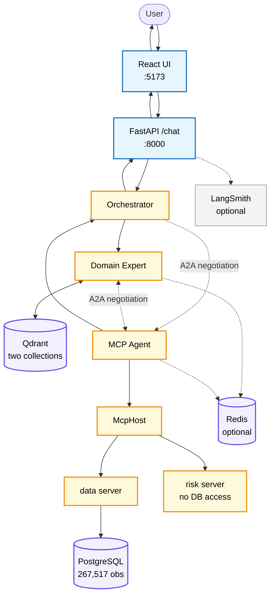
```mermaid
flowchart TB
    U(["User"]) --> UI["React UI\n:5173"]
    UI --> API["FastAPI /chat\n:8000"]
    API --> ORC["Orchestrator"]
    ORC --> DOM["Domain Expert"]
    DOM <--> QD[("Qdrant\ntwo collections")]
    ORC -. A2A negotiation .-> MCA["MCP Agent"]
    DOM <-. A2A negotiation .-> MCA
    MCA --> HOST["McpHost"]
    HOST --> DSRV["data server"] --> PG[("PostgreSQL\n267,517 obs")]
    HOST --> RSRV["risk server\nno DB access"]
    DOM -.-> RD[("Redis\noptional")]
    MCA -.-> RD
    API -.-> LS["LangSmith\noptional"]
    MCA --> ORC --> API --> UI --> U

    classDef ui fill:#e7f5ff,stroke:#1971c2,stroke-width:2px,color:#000
    classDef agent fill:#fff9db,stroke:#f08c00,stroke-width:2px,color:#000
    classDef store fill:#f3f0ff,stroke:#7048e8,stroke-width:2px,color:#000
    classDef obs fill:#f1f3f5,stroke:#868e96,color:#000
    class UI,API ui
    class ORC,DOM,MCA,HOST,DSRV,RSRV agent
    class PG,QD,RD store
    class LS obs
```

1. A user asks a market-risk question in the React UI.
2. The UI posts it to FastAPI's `/chat`, the single entry point.
3. The service sends one A2A message to the Orchestrator, which classifies the turn on a cheap model.
4. A greeting or concept question is answered here and stops — no vector search, no data call.
5. A real data question goes to the Domain Expert, which retrieves grounded methodology from Qdrant.
6. The Domain Expert and MCP Agent negotiate the actual requirement over real A2A calls, bounded at 5 rounds.
7. The MCP Agent fetches through the MCP protocol — the only road to PostgreSQL, reached as the restricted `mcp_reader` role.
8. If a calculation is needed, the same MCP Agent calls the risk engine — a server with no database access at all.
9. Redis, if enabled, may short-circuit a repeated retrieval or assessment step, but never a calculation.
10. The Domain Expert validates the result against what was actually agreed.
11. The Orchestrator writes the final reply from the assembled facts, not by re-deriving them.
12. `/chat` returns the answer plus the full data plan, negotiation transcript, and citations.
13. The UI renders the prose and an artifact card; opening it exposes the Table/Data-plan/Discussion/Source tabs.
14. If LangSmith is configured, the whole turn is one trace tree spanning every agent boundary.
15. Nothing in this path can silently substitute a guess for a missing number — a refusal, a clarifying question, or a cited figure are the only three outcomes.

---

# Further reading

| Document | Covers |
|---|---|
| [`AGENTS.md`](AGENTS.md) | The runtime agent architecture in full |
| [`CLAUDE.md`](CLAUDE.md) | Shared project memory; rules for every session |
| [`agents/README.md`](agents/README.md) | The three agents in depth |
| [`docs/a2a.md`](docs/a2a.md) | A2A design and guardrails |
| [`docs/loading-contract.md`](docs/loading-contract.md) | How to extend the data pipeline |
| [`docs/model-provider.md`](docs/model-provider.md) | The `ModelProvider` seam, and why structured output uses forced tool calls |
| [`docs/redis.md`](docs/redis.md) | Redis architecture and operations |
| [`docs/risk-methodology.md`](docs/risk-methodology.md) | Curve construction and risk mathematics |
| [`docs/risk-tool-reference.md`](docs/risk-tool-reference.md) | Every risk tool's exact contract |
| [`docs/agent-capabilities.md`](docs/agent-capabilities.md) | Which of the 42 risk tools the agent can reach, and why |
| [`docs/capability-gaps.md`](docs/capability-gaps.md) | What the risk engine deliberately cannot compute |
| [`docs/postgres-setup.md`](docs/postgres-setup.md) | Database provisioning, narrated |
| [`docs/data-guide.md`](docs/data-guide.md) | The datasets, in detail |

## Licence

See [LICENSE](LICENSE).


