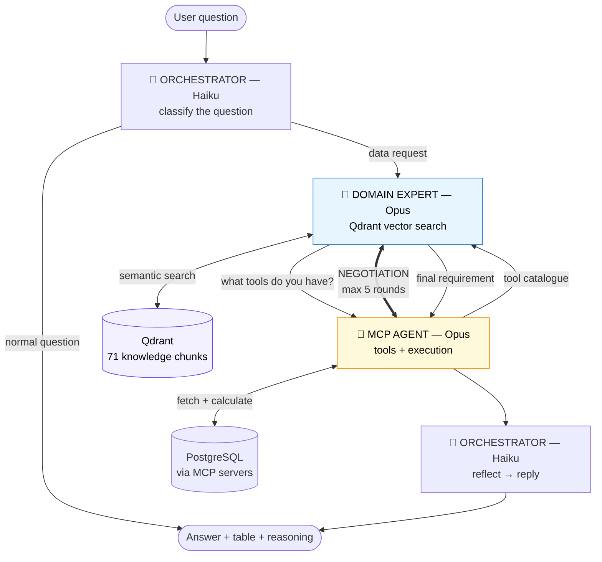

# `agents/` — the three runtime agents

This is where the system's intelligence lives. Three agents, each with a model, a
job, and a traced boundary.

| Agent | Model | Why that model | Job |
|---|---|---|---|
| **Orchestrator** | `claude-haiku-4-5` | Runs on *every* turn, including "hi". Routing does not need frontier reasoning. | Classify the question; reply directly, or delegate. Then write the final reply. |
| **Domain Expert** | `claude-opus-5` | This is where the thinking is. | Vector-search Qdrant, decide what the task requires, defend it in discussion. |
| **MCP Agent** | `claude-opus-5` | Judging what a source can serve needs reading, not a set lookup. | Advertise tools, negotiate, fetch, calculate. |

---

## The flow



---

## The discussion — why it exists

The centre of the design. **Neither agent knows enough alone:**

- The **domain expert** knows what the *method* requires — that historical VaR
  reads a 250-day window — because it read that in the knowledge base.
- The **MCP agent** knows what the *source* actually holds — that a Treasury par
  yield curve has no CUSIPs, no issuer names, no settlement dates.

A one-way handoff produces requirements nobody can serve. So they talk:

```
round 0  domain_expert → "Proposing 5 fields and a 250-row window for
                          10-day 99% historical VaR"
round 1  mcp_agent     → "I can serve the full daily par-curve history for all
                          14 tenors over the 250-trading-day lookback. I cannot
                          serve cusip, issuer_name or settlement_date — this is
                          a par yield curve, it holds no instrument records."
         ✓ converged
```

The loop is **bounded at 5 rounds**. Two agents that can always reply will
always reply; if they never converge, that fact is recorded and reported rather
than hidden behind a last-ditch answer.

---

## No hardcoded thresholds

The domain expert holds **no numbers of its own**. Every figure it states must be
quoted verbatim from a chunk it actually retrieved, and the quote is checked
against the retrieved text before the requirement is accepted:

```python
if rows is not None and not quote_is_grounded(quote, context):
    rows, quote = None, None      # discarded, and the user is told why
```

A window recalled from the model's training is rejected exactly like a constant
in the source — both are unfalsifiable. You cannot change them by editing a
document, and you cannot audit them by reading one.

**Live proof** — the expert quotes `knowledge/market_risk/var.md`:

> *"Historical simulation reads a fixed lookback window of **250 trading days**
> of daily observations."*

Change that sentence and the behaviour changes on the next request. **No code
edit, no release, no engineer.** The knowledge base is the authority, and a
domain expert can edit it.

When the corpus is silent, `rows` comes back `None` and the answer says the
corpus does not state a window — rather than quietly supplying a plausible
default.

---

## LangSmith

Every agent boundary is a run, so a trace shows the shape of the system:

```
agent_pipeline
├── orchestrator.classify          (llm, Haiku)
├── mcp_agent.catalogue            (tool)
├── knowledge_retrieval            (retriever, Qdrant)
├── domain_expert.derive           (llm, Opus)
├── discussion
│   ├── mcp_agent.assess           (llm, Opus)
│   └── domain_expert.revise       (llm, Opus)
├── mcp_agent.execute              (tool)
└── orchestrator.reflect           (llm, Haiku)
```

That nesting is what makes the system **evaluable** — an evaluator can score the
domain expert's requirement on its own, separately from the answer written from
it.

To switch it on:

```bash
export LANGSMITH_TRACING=true
export LANGSMITH_API_KEY=ls__...
export LANGSMITH_PROJECT=semantic-mcp-data-access-gateway
```

Tracing never changes behaviour: a missing key, an unreachable endpoint or an
unserialisable payload degrades to simply running the function.

---

## Files

| File | What it is |
|---|---|
| `contracts.py` | Every message between agents. Dataclasses, not dicts — a negotiation is only auditable if each turn has a fixed shape. |
| `orchestrator_agent.py` | Agent 1. `classify()` in, `reflect()` out. |
| `domain_expert_agent.py` | Agent 2. `retrieve()` → `derive()` → `revise()`, plus the grounding guard. |
| `mcp_agent.py` | Agent 3. `catalogue()`, `assess()`, `execute()`. |
| `pipeline.py` | Wires the three together and records the discussion. |
| `observability.py` | LangSmith wiring and the shared structured-output call. |

## Use it

```python
from agents import AgentPipeline

pipeline = AgentPipeline(knowledge_base, data_provider)
outcome = pipeline.handle("Give me 10,000 rows for a 10-day 99% VaR")

outcome.route                    # "data_request"
outcome.requirement.rows         # 250
outcome.requirement.grounded     # True
outcome.requirement.row_quote    # the verbatim sentence from the corpus
outcome.negotiation.turns        # the full discussion
outcome.tables                   # columns + rows, ready to render
```
